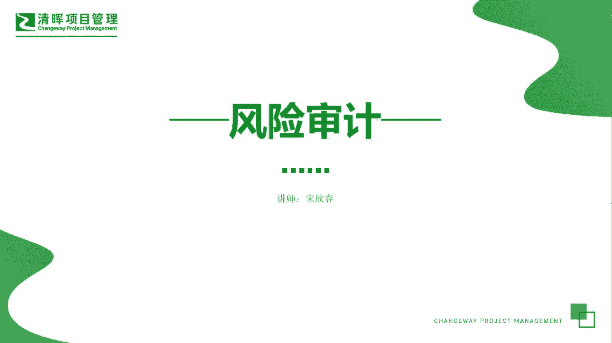
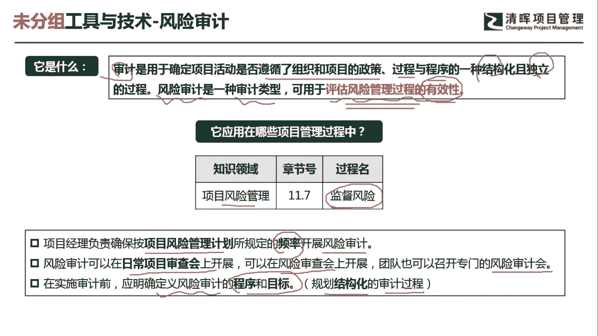
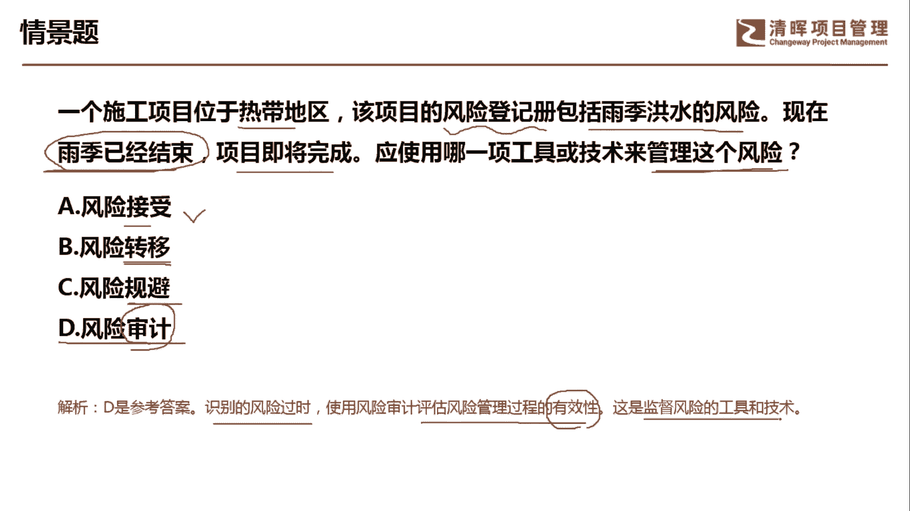
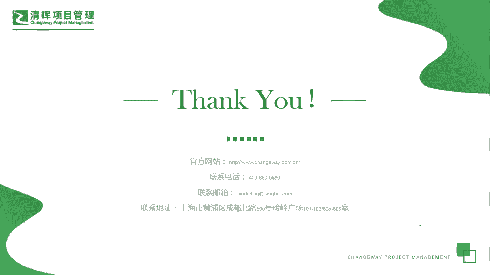

# 超全项目管理实战工具~收藏不亏，总会用得上 - P3：风险审计 - 清晖Amy - BV1rG4y1k7Rb

🎼。

各位同学大家好，我是宋老师。今天我们来看风险审计这个工具。

那说到风险审计呢，我们首先要了解一下什么是审计。审计呢主要是用于确定项目活动是否遵循了组织和项目的政策过程与程序的一种结构化，而且是独立的一个过程。所以呢风险审计呢也是一种审计的类型。

它主要是用于评估风险管理过程的有效性。注意它是风险管理过程的有效性，不是这个风险应对措施是否有效。如果是风险应对措施是否有效呢，这个叫做风险的审查啊，也就是这个risk review风险审查。

它就不是风险审计了。审计一定是对于。政策过程程序的一种这个结构化独立的这个审查过程。好，风险审计呢，它是在风险管理的监督风险过程中所使用。因为我们是要对过程流程进行一种管控。因此呢它是在监控过程组。

那么怎么样进行风险的审计呢？首先，项目经理要负责确保按照项目风险管理计划所规定的一个频率开展风险的审计。风险审级呢其实可以是定期的，也可以是不定期的。可以是由外部的人进行审计，也可以由内部的人进行审计。

那风险审计呢可以在日常项目审查会上开展。也可以在风险的审查会上开展啊，这个呢就是专项的一种风险审查会了。团队呢也可以召开专门的这个风险审计会。在实施风险审计之前呢，应该明确的是定义风险审计的程序和目标。

也就是我们所说的要规划这个结构化的一个审计过程。所以呢我们书上讲到的审计呢有3个，一个是这个风险审计。还有一个呢就是质量审计。还有呢就是采购审计，他们的共性其实都是一样的啊。

对于这个组织项目的政策过程程序是否有遵守。

我们来看这样一道题，一个施工项目位于热带地区，该项目的风险登记册包括雨季洪水的风险。这个在风险登记册当中有记录，现在呢雨季已经结束，项目即将完成，应该使用哪一项工具或技术来管理这个风险？好。

说明呢这个雨季已经结束，风险已经发生了。那我们怎么样去管理这个风险呢？很显然，这个是属于监控风险。因为他是处于过程中发现这个风险已经结束了，预季已经结束了。风险接收风险转移，风险规避呢。

这个都属于我们风险。应对措施之一啊，也就是我们风险当中有这个危险，有这个机机会。那我们这个三个呢ABC呢都属于这个风险当中的威胁的应对措施之一。比如说接收策略，接收策略呢，它分为主动接收和被动接收。

主动接收呢，它往往是这个准备一些应急储备，准备一些缓冲时间，那还有一种被动接收呢，它是。这个监督风险它不会让这个风险再扩大。转移策略呢，它主要是把这个风险带来的这种损失呢转移给第三方。

一般是找一个这个保险或者外包公司去这个承担。规避策略呢？有时候他最极端的做法就是整个的这个项目就停工了，或者呢它缩小范围或者呢延长工期，这个是风险威胁当中的规避策略。风险审计它主要是。

审查你的风险管理过程是否有效啊，管理过程是否合规，它是一个结构化的过程。因此呢我们应该是选择这个监控过程组的这个风险审计这个工具。通过风险审计识别风险。这个发生了使用风险审计评估风险管理过程有效性。

这是监督风险的工具和技术。好，今天呢主要和大家分享的是风险审计这个工具，我们下次再见，谢谢大家。

🎼。