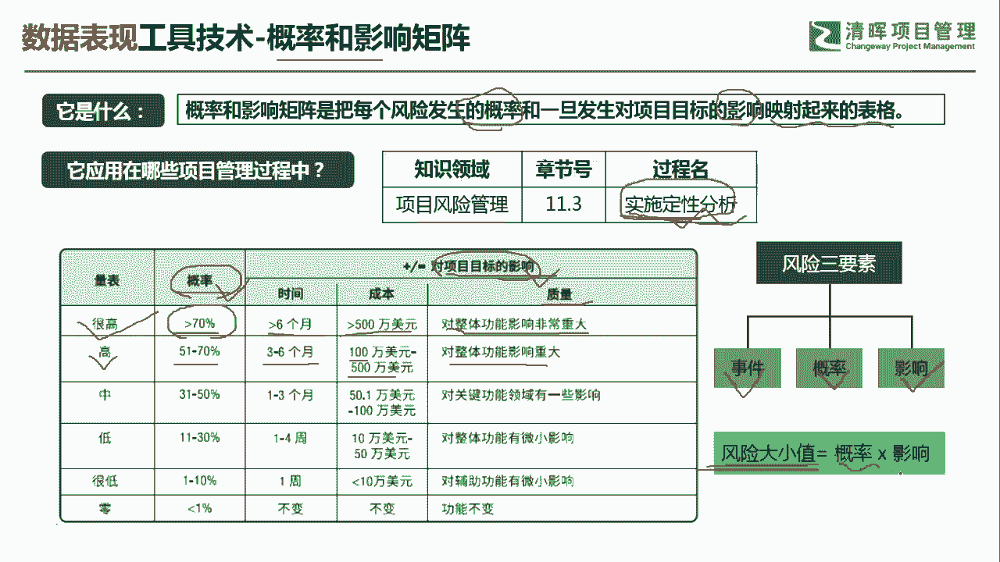
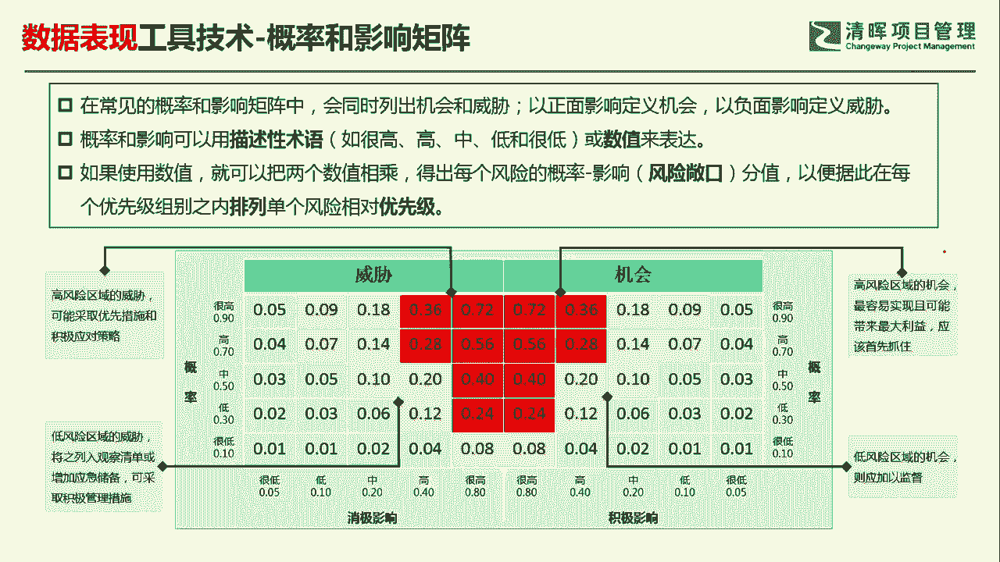
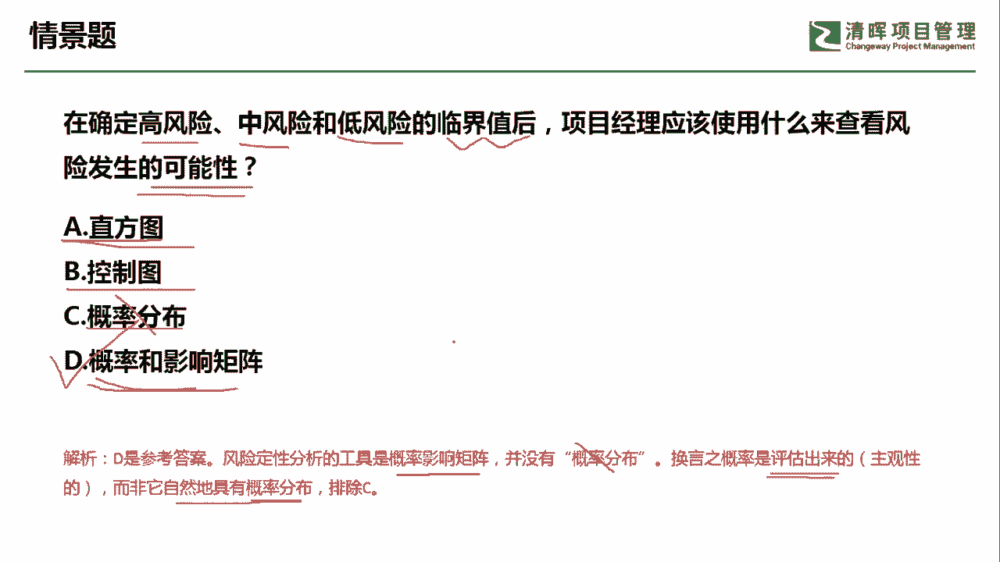

# 超全项目管理实战工具~收藏不亏，总会用得上 - P4：概率和影响矩阵 - 清晖Amy - BV1rG4y1k7Rb

🎼。

各位同学大家好，我是宋老师。今天我们来看概率和影响矩证这个工具。

概率和影响矩证呢主要是把每个风险发生的概率和一旦发生对项目目标的影响能够映射起来的一个表格。所以它是一个矩证形式。概率和影响区证，它是在风险管理的实施定性风险分析过程中所使用。所以它是一个定性分析工具。

不是一个定量分析工具。不要看到概率，好像就想到是一个定量，不是这个意思。定性风险分析呢它的主要目的呢，它其实就是为了识别风险的这个优先级啊，能够抓住高优先级的风险。那么这个概率和影响是怎么界定的呢？

概率和影响呢，其实它是主观来界定的。比如说他认为呢这个概率大于70%。在时间进度上大于6个月，比如说他拖延6个月，或者呢成本是在大于500万以上。或者呢质量呢它是描述成对整体功能影响非常重大。

像这种描述呢就是代表对项目目标的影响非常大。概率呢一般在70%以上，我们认为呢就是一个高概率事件。由概率和影响两个因素来判定。在我们的这个风险的这个优先级上，我是把它列为很高啊，这种呢是把它列为很高的。

如果你发现这个概率呢，它在之这个51%到70%之间，那么有可能它的进度呢或者时间呢是在。拖延了3到6个月，或者呢它的这个成本是大于了100万，在50万。500万之间。

或者呢你发现它的质量描述呢是对整体功能影响重大的那这类的这个风险呢，它其实在风险的优先级上就显示成是高的。好，以此类推，这样的话我们就可以去判断一下这个风险的。大小值啊，所以我们风险呢有三个要素。

一个呢不确定性事件，一个呢是概率和它的影响。风险的大小值呢。等于概率乘以它的影响。

我们书上呢，其实有一张这个概率和影响矩证的表格，我们可以具体来看一下。在常见的概率和影响矩阵中，我们一般会同时列出这个机会风险和威胁的风险。因为他们两个都可以吃风险。

以正面影响定义机会，以负面影响的定义危险。这都是。可以带来这个收益或者损失的风险。概率和影响呢可以描述可以用一些描述性的术语。比如说。这个很高啊。高啊中低很低来描述。

也可以用呢一些数值来表达啊一些数值来表达。那我们怎么来看这个值呢？像这个里面。如果使用数值的话，就可以把两个数。值相乘这个两个数值呢是指影响的数值。和概率的数值相乘，它们下面都有数值。

比如说你认为呢它是一个很高，那我们可以界定为是影响的是0。8。那如果概率是很高呢，我们可以界定为0。9。刚才我们所说了，这些值呢是你主观把它定义出来的啊，不是你测量出来的。

你测量出来的其实呢就是概率和影响了相乘的值，它代表呢风险敞口，风险敞口就是它的这个值的大小。那我们通过这个值呢，就可以分辨出这些风险的相对优先级。比如说我们来看威胁威胁当中有一个这个0。180。

18怎么得出来的？它其实是概率的0。9乘以这个消极影响的0。2，这样得出来0。8啊，0。36呢等于。概率的0。9乘以呢这个影响的。消极影响的这个很高的影响的0。4，那这个等于0。36，很低呢。

这个地方有1个0。010。01怎么得出来？其实是0。1乘以0。05，那算出来是0。0。05，但是呢我们四舍五入等于0。01。好，我们得出了这些。具体的风险敞口的值之后呢，你就可以抓住一些高优先级的风险。

比如说。我们抓住0。360。28等等。这边红色区域的全部都是高优先级的风险。当然包括威胁，当然也包括机会。那具体说它这个为什么是划分为红色区域，为什么划分为黄色区域？这个呢是事先我们界定的在某个区间内。

我们就认为是高风险，在某个区间内认为是中风险或者低风险。所以呢这个就是概率和影响矩证的一些用法，这样你就可以从容的去抓住这个单个风险的这些优先级了，相对优先级了。我们具体来看这样一道题。

在确定高风险、中风险和低风险的临界值之后，项目经理应该使用什么来查看风险发生的可能性。查看风险发生的可能性。那这个呢其实呢是。风险发生的可能性，这个呢属于定性的概念，不是一个定量的概念。

直方图直方图呢它主要是一个质量工具，主要是发现这个引起缺陷的主要原因。它和帕雷图图一样。帕雷图图呢它是特殊的这个直方图，它是有排序的那我们单独的讲直方图，它一般是没有排序的。

控制图呢也是一个控制质量的工具，它主要展示你的质量过程是否稳定，然后预测未来的质量绩效。概率分布没有这个工具，这是一个陌生词汇。我们可以考虑概率和影响矩阵啊，这个呢是对应你的风险发生的可能性的大小。

风险定性分析的工具有这个概率和影响矩阵，没有概率分布。所以刚才我们所说陌生词问呢是首先排除掉。换言之呢，概率是评估出来的。什么评估出来的？它其实是主观界定的，而非它是自然。具有的概率分布。

所以我们这一题呢是选D选项，通过概率和影响矩证来判断你的风险发生的可能性的大小。好，今天呢主要和大家分享的是概率和影响矩正这个工具，我们下次再见，谢谢大家。

🎼。