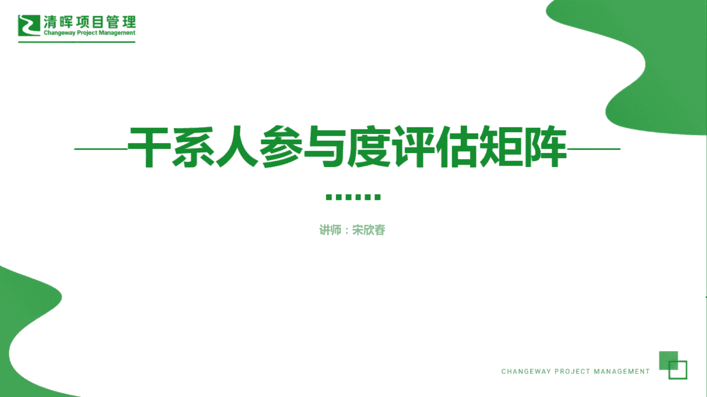
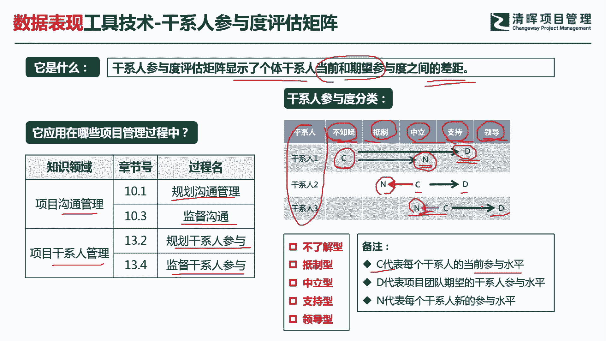
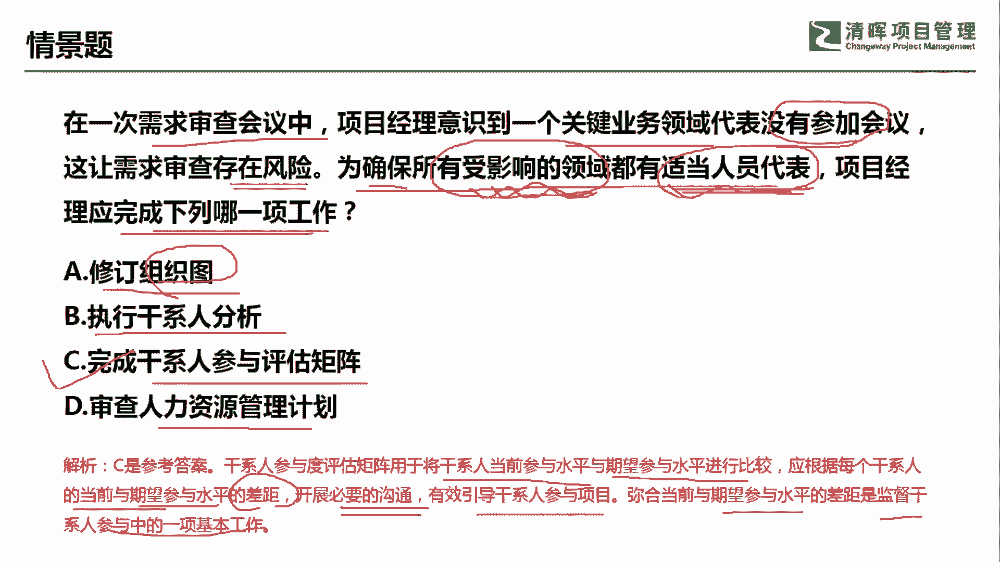

# 超全项目管理实战工具~收藏不亏，总会用得上 - P5：干系人参与评估和矩阵 - 清晖Amy - BV1rG4y1k7Rb

🎼。

各位同学大家好，我是宋老师。今天我们来看干系人参与度评估矩证这个工具。干系人参与度评估矩证，它主要是显示了个体干系人当前和期望参与度之间的一个差距。所以这个矩阵主要是代表一些差距方面的问题。

干系人参与度评估矩证主要是在沟通管理的规划沟通管理以及监督沟通和干系人管理当中的规划。干系人参与和监督干系人参与当中会使用。那这个矩证怎么使用呢？首先我们对于干系人的这个参与度呢，我们会有5种分类。

分别是不知晓抵制中立支持和领导，那么不知晓呢？往往是代表他压根就不知道这个项目的存在，或者是说这个项目的影响。抵制呢是代表他是反对这个项目的啊，他是。

智肘或者说他是这个给项目带来一些麻烦的这样的一个参与度。中立呢他是不置可否，我也不支持，我也不抵制。那么支持呢是代表我们的参与度呢是非常的高，而且呢它是这个积极的去推动。支持。

最后一种参与度呢叫做领导型。领导型的这个参与度呢，它其实是自带驱动力的啊。我们书上有这句话，就是说要保证项目的成功，我们的干系人呢必须要到达0。领导型这个参与程度才行啊，这个地方我们要注意一下。好。

纵向的这个矩阵当中的纵向呢一般是代表干线的名称。横向的这几个字母呢是代表。C是代表他的当前参与水平current啊，我们的期望。Design。A呢是代表new它的新的这个参与水平状态。比如说干线一。

我们在一开始规划的时候呢，希望他从这个当前的这个不知晓到达这个知识的参与度。但是呢它新的参与程度呢。变成中立了，说明没有达到我们的这个期望，说明一定是有问题的。我们要进行沟通啊，去监督。同样干线二。

我们从一开始的这个中立期望他到达支持，但实际上他现在的参与度反而是抵制了，说明问题更大啊，更要去重点关注干线三呢，我们期望他从支持到达领导，但是他也是往回走了，到达中立了，那说明也是有问题的。

这个时候呢我们就必须去这个监督沟通和监督干线的参与。

我们来看这样一道题。在一次需求审查会议中，项目经理意识到一个关键业务代表没有参加会议。这让需求审查存在风险。为了确保所有受影响的领域都有适当的人员代表，项目经理应该完成下列哪一项工作？

他要确保所有受影响的领域都有适当的人员代表，那就说明呃有适当的人员参与。啊，A选项修订组织图。组织图呢它本身。是属于资源管理计划当中的一个内容，它不是一个这个。呃，工具啊不是一个工具。执行干前分析。

执行干前分析呢，我们是可以去了解他为什么没有参与这个会议。但是呢你是不能确保。有影响的领域都有适当的代表。参加的啊，这个呢其实就是。你分析他，但是你不能。这个知道。

某些人他应该在什么情况下去这个代表受影响的领域。C选项完成干弦参与度评估矩阵。完成干弦参与评估矩阵，我们就可以在这个矩阵图上知道。该每个干闲他这个当前的参与以及这个我们所期望的参与。

还有中间所出现的一些偏差。所以这样的话我们就可以确保呢所有受影响的领域呢都有适当的人员去做代表啊，都有人参加。D选项，审查人力资源管理计划。首先不是资源缺失啊不是资源的异动。

所以呢不需要去审查人力资源管理计划。因此呢我们这一题呢应该是选择C选项。干系人参与度评估矩证用于将干系人当前参与水平与期望水平进行比较。应根据每个干系人当前的参与水平。

这个与期望水平的这个差距开展必要的沟通。所以呢他没有参加会议，就说明了他的参与是有问题的。开展必要的沟通，有效的引导干线人的参与项目。弥合当前与期望水平，期望参与水平的差距。

也是监督干系人参与中的一项基本工作。所以呢我们这道题呢其实一个是考的是监督沟通，一个呢是考的是这个监督干闲人的参与啊，要让他去做适当的代表。因此呢这一题呢我们应该选C选项。好。

今天呢主要和大家分享的是干线参与度评估矩阵这个工具我们下次再见，谢谢大家。

🎼。