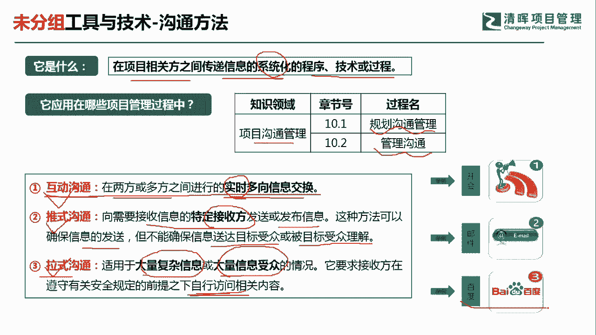

# 超全项目管理实战工具~收藏不亏，总会用得上 - P8：沟通方法 - 清晖Amy - BV1rG4y1k7Rb

🎼。

各位同学大家好，我是宋老师。今天我们来看沟通方法这个工具。

沟通方法呢，它主要是在项目的相关方之间传递信息的系统化的一些程序、技术或者过程。沟通方法它主要是在沟通管理的规划沟通管理和管理沟通过程中所使用。在其中呢我们有三种经常所遇到的这种沟通方法。

分别是互动式沟通。推式沟通和拉式沟通。第一个互动式沟通呢，其实有时候也翻译成交互式沟通。它的主要特点是。在两方或者多方之间进行实时多项的信息交换。注意它的关键信息呢在于实时多项信息交换。

比如说我们的这种开会。他的特点就是实时的多项信息交换，及时的有反馈，有什么情况当面就能谈清楚。所以呢互动式沟通，它的效果往往是最好，它往往也适用于一些关键的这种信息的沟通，或者和一些关键人物的沟通。

推卸沟通呢它的主要特点是向需要接收信息的特定的接收方发送。这个发布信息这种方法呢可以确保信息的发送，但是呢不能确保信息送达目标受众或者被目标受众所理解，这是什么意思呢？比如说我们发邮件。

邮件是发送给特定的接收方，但是呢对方是不是设定了这个垃圾过滤器，那你的邮件有可能就被过滤了，他收不到。还有一种情况呢，就是你把信息发送给对方。但是呢对方不一定能够理解你想要所表达的意思。啊。

这是推市沟通的特点。第三种沟通方法呢叫做拉式沟通。拉式沟通呢它是适用于大量复杂的信息，或者呢大量信息受众的情况，也就是接收方会比较多。他要求接收方在遵守有关安全规定的前提之下，自行访问相关的内容。

因为它信息量比较大。他的受众也比较广泛，所以他不可能一一的进行互动式的这种沟通或者推势的沟通。他需要你自己去查看。比如说我们的这个百度，你自己可以去查看，或者公司内部呢有一些网盘或者公共盘。

那我们呃来了新员工之后，你可能跟他这么说，就是说我们有一些这个过去的一些项目经验，你可以呢在这个网盘上自己去查看。好，这个呢就是拉式沟通的特点。所以呢三种沟通方法，它分别有它三种适用的场景。

这个是我们每一次考试当中经常会让你做出判断的。

我们来看这样一道题。一家大型全球性公司的员工分布在7个不同的国家，啊，说明他是一个虚拟团队。为了确保项目成功，每个人无论其物理位置，必须能够方便的通过安全的内部网站访问培训。好，这使用的是哪种沟通方法？

这道题目呢它的关键情景呢在于。他的员工呢分布比较广泛，在7个不同的国家，然后呢需要你通过安全的内部网站访问培训，那说明呢需要你自己去操作啊，这个呢其实就是很典型的拉式沟通的特点。

交互式沟通也叫这个互动式沟通。那刚才我们说了，它适用于就是说信息量不是很多，但是信息也比较重要，然后需要实时的双方的这种互动式的这种形式。来及时的反馈。没有编码式沟通这个词，这是一个面陌生词汇。

我们首先要把它排除掉。推式沟通呢，它的特点是把信息推送给特定的接收方，但是呢它不能保证信息被送达或者被这个目标受众所能理解。因此呢也不符合我们的情境的含义。这道题目呢我们应该选择C选项拉式沟通。

它是适用于大量复杂的信息或者大量信息受众的情况。我们这个里面呢7个不同的国家符合。信息受众比较广泛。他要求接收方在遵守有关安全规定的前提下自行访问相关内容。自行的去访问培训。

包括门户网站、公司内网电子在线课程。经验教学数据库或者知识库。好，今天呢主要和大家分享的是沟通方法这个工具，我们下次再见，谢谢大家。

🎼。