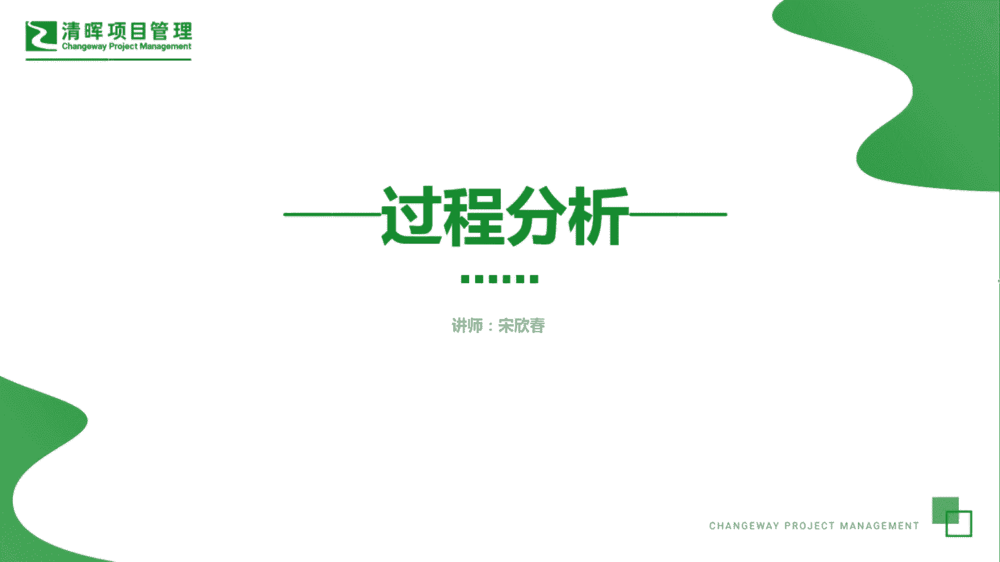
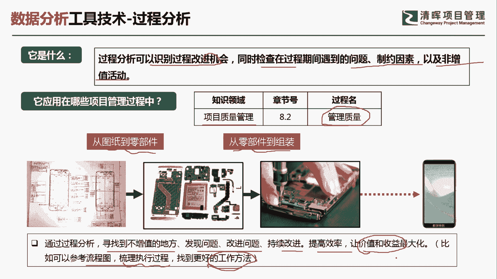
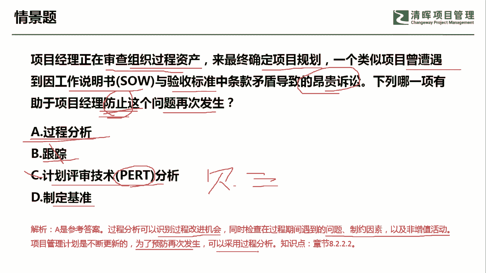

# 超全项目管理实战工具~收藏不亏，总会用得上 - P9：过程分析 - 清晖Amy - BV1rG4y1k7Rb

🎼。

各位同学大家好，我是宋老师。今天我们来看过程分析这个工具。过程分析呢主要是可以识别过程改进的机会，同时检查在过程期间遇到的问题制约因素以及非增值活动。在偏僻了很多情景题当中呢，它往往暗示项目经理。

如果要进行改善。你应该去怎么做。那么要进行改善呢，其实有一个很多的这个考点就是要发现一些增值和非增值的活动。这样的话你才能有的放矢，才能去进行这个改善活动。那过程分析呢，它主要是在。

质量管理的管理质量过程中所使用啊，比如说我们在装配一个这个手机的时候，你从。这个图纸到零部件从零部件到组装的过程中。

你可能会发现某些零部件其实是不必要的那有时候呢你也会发现这个有些动作是不必要的那这些其实都是非增值的一些这个改善点。那在此基础上，你进行过程分析，你就会发现你下一步应该怎么样去进行改善。

为了未来去做一个准备。所以呢通过过程分析，我们寻找到不增值的地方，发现问题，改进问题，持续改进，提高效率，让价值和收益最大化啊，也可以参考流程图来进行这个梳理执行过程。以便找到更好的工作方法。

所以这种过程分析呢，它往往和这个质量审计也有很大的区别。那么质量审计呢更多的是对于质量的过程政策流程是否遵守的一种这个检查判断啊，我们过程分析呢更多的是为了这个改进改进产品的质量。

然后通过发现一些增值的非增值的活动去进行改善。

来看下这样一道题，项目经理呢正在审查质量这个组织个人资产来最终确定项目的规划。一个类似项目曾遭遇到因工作说明书与验收标准中的条款矛盾导致的昂贵诉讼。那下列。😊。

哪一项有助于项目经理防止这个问题的再次发生？防止这个问题的再次发生，其实就是怎么样进行改善啊，指向于未来。A选项过程分析啊过程分析呢其实就是通过一些流程去发现。当时的问题点。

然后呢寻找到可以改善的地方啊，我们就可以用过程分析来防止这个问题再次发生。跟踪没有这个工具，所以呢我们把它剔除掉。计划评审技术呢PRT技术呢，它一般是这个属于在不确定性情况下的一种估算技术。

比如说经常用的贝塔分布。这个三角分布啊，这些呢都属于估算工具。它呢都是计划平整技术当中的一种。但是我们这道题目很显然不是在不确定性情况下进行某些估算，没有估算成本，没有估算进度，因此不要去选它。

制定基准制定基准并不能防止某个问题再次发生，它不会起到预防的作用啊。因此呢我们这道题目呢应该通过过程分析来识别。过程改进的机会，同时检查在过程期间遇到的问题、制约因素以及非增值的活动。防止问题再次发生。

可以采用过程分析。今天呢主要和大家分享的就是过程分析这个工具，我们下次再见，谢谢大家。

🎼。

