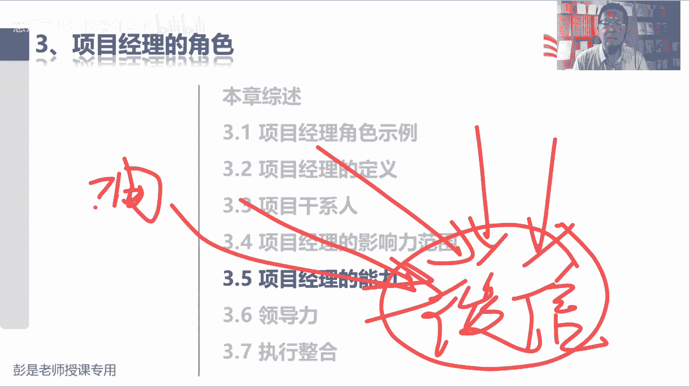

# 速看｜2024年 PMBOK第七版 超全、超长 PMP精讲课程｜冒死上传 - P1 - 慧翔天地软考 - BV19e411d7eG

I。好，各位同学下午好下午好，还有一分钟时间，咱们即将开始。今天下午的课程，下午好下午好，大家下午好，还有40秒40秒啊。大家检查一下声音是否正常，课件能否正常显示，下午好下午好，各位同学下午好。

Okay。Yeah。谢谢谢谢嗯。😊，啊。好。🤧。嗯。看。あ。好了。好。Yeah。好，各位同学下午好，还有10秒钟时间即将开始今天下午的课程了。1987643210。下午好啊，咱们正式开始下午的课程。

大家下午很容易犯困的啊，前一个小时应该还好，后半个小时，尤其是2点到3点很容易犯困的啊，想办法给自己找找提神提神醒脑的方法呀，想一想啊，什么物理攻击、魔法攻击可以站起来走一走，伸个懒腰啊，这是物理攻击。

魔法攻击呢就是想一想那些糟心的事啊，对吧？物价呀、房价呀、房贷呀、车贷呀、工作好不好找呢？月薪是多少呢？对对，以此类推啊，总之想办法想办法让自己精神饱满，热情洋溢啊。好，那咱正式讲下午的课程啊。

没来得及休息啊。就是讲下午课程，讲下午课程之前再回顾一下，快速回顾一下啊。上午就讲了这么几个事情啊，开企业目标远景使命价值观定企业的战略规划做好做好了战略规划之后呢，项目就有了，然后运营就有了。另外。

把存在着依赖关系的事情放到一起去进行管理，就有了项目及管理，要做的事情这么多，我们要排排序分配人财物就有了项目组合组合管理。哎，这就是企业管理地图。然后我们又分析了，这东西啊。

这东西啊是计划是我们的理想啊。实际商业运作环境之中，这东西不是一成不变的。商业环境一旦出现了变化，就出现了一些影响我们企业的因素，那受到影响，不能坐以待毙啊。

所以呢我们还要不断的寻找新的商业机会就带出来可能基于什么技术进步啊、法律法规啊、竞争对手啊、市场环境啊、客户要求啊，各种各样的各种各样的原因吧，我们能够发现一些商业机会。那发现商业机会之后。

这这个这个事儿我们要不要做呢？就需要通过商业论证和效益计划的制定去分析这个事情的可行性和价值。如果这个事情既有可行性，又有价值，我们才愿意投入人财物，投入资源和资金去做项目。然后我们又知道项目结束以后。

我们的产品服务成果可能会需要移交运营，运营需想办法想办法实现这个价值，并让这个价值最大化。所以呢某些项目结束的时候，有没有实现目标效益呢？不知道需要运营一段时间。哎。

就把项目经理的这个格局工作范围打宽了，打宽了啊，像上午大概讲到这儿了。好，那知道了知道了。这个这这段中心思想之后，大家再听一个小的知识点啊，再提记一个小的知识点。那，项目启动之前需需求评估。

寻找商业机会，商业论证，分析项目的可行性和价值、效益管理计划的制定，说清楚实现效益的实现时间点。这些事是项目启动之前需要开展的工作。那这些工作谁管？需要掌握这样一个知识点。这些事谁管呢？项目经理吗？

咱都说了，这是项目启动之前的事情。所以通常通常我们需要有一个角色来做这个事儿，这个角色叫什么呢？哎，非常棒，做做过预习了吧，叫发起人。Yeah。发起人不一定是产品经理啊，发起人是个角色。

我们需要这样一个角色。这个角色可能是任何人呢，总之就是发起一个项目的人提项目的建议书入，做项目的立项立项管理啊。哎，发起人有可能是任何人，有可能是任何人啊，他的主要工作是什么呢？看看有没有商业机会。

找项目，找到项目之后去分析这个事情的可行性和价值，然后向公司申请申请什么呢？申请我们需要资源和资金。去做这个事儿。那申请的时候，公司一定要分析了，这个对吧？这公司要评审啊。

分析这个看看你这个项目有没有可行性啊，有没有价值啊，是否符合公司的战略目标啊。哎，走公司的流程。那如果公司一旦批准，项目经理就从公司得到授权，有权利动用组织的资源去完成项目的工作。

就体现了项目的合法性、合规性。大概有这个印象啊，发起人这个角色后边还会讲到的。好，这下来看看前面这小段课程，大家学到了啥，咱做做几道题试一试啊，试试水。第一题。😊。

这四个里边哪一个不是项目的可交互成果呢？你给他。Yeah。Yeah。Yeah。哎，宋峰同学醒一醒醒一醒。仔细看啊仔细看有坑的。选A的同学仔细看仔细看啊，题目里面是有坑的，有坑的再往下看。

考试的时候一定做到啊，四个选项都看完。四个选项都看完啊，不要草率不要草率啊。下面可能会有更过分的选项，对不对？所以犹豫不决的时候要去分析，哎，这四个选项好的里边找最好，坏的里边找最坏。好，有选A的。

有选B的，有选D的，没有人选C呀，项目创造独特的产品服务或成果。那正确的答案是什么呢？B。正确的答案是B啊。B选项说研究课题所发现的知识，什么新冠特效药，什么发发现了一个算法啊。

发现了一个新的工艺基础啊，知识产权这种东西吧，它是通过项目创造的成果。C选项说学校新开发的课程，我们教PMP交软考交ACP哎，这也是我们创造的可交付成果。A选项大家容易容易迷惑啊。

项目管理团队所编制的项目管理计划，那像项目计划第一个小问题，项目计划这个东西啊，是不是我们的劳动成果呢？是。第二个小问题去思考这个劳动成果可不可以交付给客户呢？可以。所以它也是我们的劳动成果。

也可以作为项目的可交付成果，对不对？就像大家日常在工作里边，工资里边，你要定自己的什么个人计划、年度计划、部门计划。哎，这些计划是你的劳动成果，这些计划需要交给交给领导啊。哎，一个道理啊。

所以A选项是我们的可交付成果，可交付成果的范围非常非常广义啊。计划不是文件啊，后面再说，总之你的工作计划、工作文件产出的东西都是你的劳动成果啊。那C选项是什么呢？啊？B选项是什么呢？批量。

批量批量批量看到批量那个单词，哎，他更侧重于什么呢？重复重复的产出相同品质的产品服务或成果。所以通常我们可以认为它是运营运营啊，运营的成果对不对？持续的重复的每天做汉堡，每天做薯条，每天做做菜呀。

就这个东西啊。当大家学到最后一定要发现啊，知识点知识点，咱们学到所有的管理管理学科管理科管理科学，它不一定是敬畏分明的啊，不是非黑即白的思维模式啊。非常重要的一个理念啊，不是非黑即白。

什么叫不是非黑即白呢？那像批量生产的汽车零配件这个事情，客户定了定了生产1000个轮胎，就像这个订单，这个订单啊，对于我们来说属于运营。对于对于我们来说属于运营吧，重复的持续的把这个东西做出来。

那运营的事情可不可以当做项目来进行管理呢？Okay。想了个问题。这个订单我们可以可不可以把它当做项目来进行管理？不犯法吧，完全可以吧，对不对？哎，这是个大客户，这个订单我是个新新新的业务业务人员。

这个事儿我很重视。对吧这个订单也有明确的开始结束日期啊，多长时间交付，对不对？我们要去思考这个订单和以前的订单不一样，它也有独特性。这个订单客户要1000个轮胎，要1000个什么样的轮胎呢？

它也有渐进明细的特点。所以事情的特性基本上性质是一样的。只不过我们要去思考管理重心不一样。项目管理项目管理更侧重于考虑周全风险意识，运营管理更关注什么呢？标准规范标准化规范化的运作。

以便于我们能够产出相同品质的产品服务或成果。哎，所以他俩其实不一定定位分明啊。项目可以当做运营，运营可不可以转项目呢？以此类推吧。就这个道理啊。所以学完学完最后知道它的特点就够了啊。

判断一个事物到底是项目，到底是运营，其实没意思，对不对？取决于我们的什么呢？管理上的需要。Okay。取决于我们管理上的需要。如果你更关注这个事儿，我们一定要做的标准规范。

那可能侧重于运营持续开展定期开展这样的特性。如果你更关注这个项目，这个项目有什么特点，它的独它的独特性，考虑周全风险意识，那你可能更侧重于需要通过项目管理的这种思维方式去考虑这个事务。

所以取决于管理要求。所以这个这个大道理就像大家新冠期间，新冠期间就像什么做核酸。做核酸，一开始是项目吧，慢慢的慢慢的就从非常态转到了常态化，对不对？慢慢就变成运营了，天天做呀，三天一做呀，就这个道理。

好，看情况。那再看看这道题呢，以下哪一项最能表现项目的特征呢？Yeah。听过了。Okay。Okay。问题不大吧，就这三个特点啊。独特性、临时性、渐定明细性。最能表现最能表现就找三特性就可以了。A不对。

这B不对，D不对，所以正确的答案是C。有确定的期限，就要有明确的开始结束日期，正最能体现项目的典型特征。那其他选项其实项目和运营项目和运营很难区分的啊。C选项在某些情况下，你也很难分分清楚啊。

所以有些题的目的是让大家知道这个意思，知道这个知识点就够了，必需要去背的啊。好，再看这道题呢。以下哪一项说法是正确的？Okay。好。Yeah。嗯嗯。想一想项目的这些掌握的特点呢。A说。

既然和以前的项目可交付成果相比，本项目的成果中存在着某些重复的元素。所以本项目从本质上讲，不再是独特的这肯定错了吧。在某些方面存在着同重复的元素，那肯定在某些方面存在着不同的元素啊，它仍然具有独特性。

A不对的。B项目只能生产出有形的产品，我们也可以创造出无形的产品啊。知识产权这种东西啊。所以B不对呀。C项目大多数是创造持久性的结果，对吧？我们通常不希望创造的成果具有临时性。

通常是希望它能够持续的实现价值。C是对的。D持续时间长达十年的工作不应该当做项目来开展，这肯定错了，到底要不要当做项目来开展呢，取决于我们的管理要求啊，取决于我们的管理需要。

但是项目的周期长和短和项目的临时性不冲突，有的项目自然而然周期长，有的项目周期短，所以做完这道题，大概把这几个知识点回顾一下，差不多了啊。好，再看看第三个特点，渐渐明细呢。

以下哪一项是项目管理不可以渐进细化的方面呢？Oh。🎼，哎，有不认识的单词怎么办呢？Yeah。嗯。有不认识的单词不好选了吧。这道题。这道题是可以错啊可以做A项目范围需要鉴定明细，产品范围需要鉴定明细。

那假设条件是什么意思呢？假设条件的标准概念是这样的啊，是我们主观上认为他成立的事件或条件，但是它成立不成立，不确定。Yeah。Yeah。他成立不成立，不确定的，就像现在大家那个关于具体具体的考试日期。

现在实际上是不不知道的吧，对不对？我们到底是11月什么15号随便说了哈，11月15号考试吗？还是16号考试啊，还是20号考试啊，不知道，没有官宣呢。那没有官宣的情况下，我们需要做一个假设了吧。

假设11月15号考试，假设11月30号考试，哎，我们需要主观上给出这样一个条件，以便于我们安排好课程的时间。那这个条件到底成立不成立吗？成立不成立呢？不确定，对不对？所以它意味着风险。

意味着风险它存在着不确定性。所以我们需要持续的持续的去验证这个东西啊是否成立。所以它也需要鉴定明细。那B选项没这个呃，没B选项这个东西啊，它指的是已发生的事情。这个概念前没想到呢啊，后面会说的。

它指的是已发生的事情。什么叫范围蔓延呢？它叫失去控制的范围的变化。ちっと？失去控制的范围的变化。什么叫失控呢？我们没有我们没有考虑到对时间、对成本、对质量等其他因素的影响。

所以大家玩大家或多或少都有范围蔓延的这个问题啊。最好理解的场景就是晚上睡觉前你都在干啥？对吧睡觉前看一看哎呀，还有一个小时啊，刷一会儿抖音吧，刷会抖音刷了一会儿啊，看看朋友圈吧。哎呀，再看看微博热搜吧。

哎，再玩会儿游戏啊，再跟张三聊一会儿天，哎，这就是范围不断在增加，从而导致我们这个时间失控了吧，这就叫范围蔓延，所以范围蔓延指的是已发生的东西，它也不太需要鉴定明细，对不对？

确定性的是他它是一个确定性的客观事实啊。这个概念听一听啊。好，再往下走了啊，看看这道题，组织所从事的整体业务价值通过什么来体现呢？Yeah。Okay。Yeah。非常棒啊，恭喜大家答对了。

看到商业价值就想啊，不是为了名，就是为了利。总之，它叫商业价值，可以有形，可以无形。所以像A和D啊，股东权益，股票市值这都属于有形价值，还有什么品牌声育、口碑、无形价值啊。好，继续了啊。这道题。

呀剧透了。刚才说出来。以下都是商业价值的无形价值。除了什么呢？Yeah。就A了吧，股东权益这玩意儿一看就可以变现的，对不对？哎，它是有形价值，像品牌认知度、公共利益、商标商誉，这都属于无形价值。

公共利益是什么玩意儿呢？就是大家什么选举权这种东西啊，对不对？公共事业公共利益，公共事业就是。什么警察啊，交警，这不都是公共事业吗？对吧？对，国际民生谋获利的东西啊，对吧？

什么社保、公积金这都是啊公共事业，公共利益，那就是大家的什么公共权利、公众权利、选举权哪，各种权利啊，哎，这都属于无形价值啊。这玩意儿不用背吧，听一听知道意思够了啊。好。

这就是一点一大概讲了这么几个知识点。那一。2项目管理的重要性。看看这段文字啊，项目管理就是把知识技能工具技术应用于项目活动来满足项目的要求。这段文字也不太需要去背它啊，总之，中心思想是什么呢？

作为一个项目的管理者，作为一个项目经理，我们的主要工作任务就是把一身本领用到工作中，完成任务，实现目标得到期望的成果。好，理解吧。所以项目管理是合理的运用，后面就不念了啊，看就可以了。再往下。

有效的项目管理可以帮助个人群体和公共以及私人组织。后面噼里啪啦一大堆这一大堆大家也不太需要去背，都是满满的正能量。但是这些单词未来大家复习的时候要能够看得懂，也能看得懂啊。第一个达成业务目标。

那关于目标管理上午大概说了一个就有一个smart原则，那目标目标通常我们关于目标会提出四个方面的期望。这个需要掌握。哪四个方面的期望呢？就是四个字啊，叫。多。快。Howo。Yeah。上。Okay。

Yeah。Yeah。叫多快好省好，理解吧，多指的是什么呢？范围。京东啊京东的同学京东的同学啊，彭老师可以接商务的啊。以后每次讲到这一段，一直都在讲多快好省。多指的是范围。多指的是范围啊。

就像中午吃几个菜，各位同学中中午吃饭的时候，中午吃几个菜呀，这不是范围吗？中午吃几个菜，这是范围吧。哎，刷碗这是工作范围，谁来叫外卖，这是工作范围，在相同质量进度成本的前提下。

我们希望这个范围越大越好越多越好，对不对？同样10块钱，人家菜量那么大，你们家菜量这么小，哎，这指的是范围，那快指的是什么呢？进度，这也好理解吧，对吧？他们家同样同样在相同品质的前提下。

范围质量成本相同的前提下，他们家3分钟就能送过来。哎，你们家需要半个小时，快指的是进度。我们希望进度越快越好。好，指的是啥呢？质量。品质品质啊，他家的菜不用地沟油，不用什么苏丹红，对不对？哎。

他家的菜里面没有鸭脖子，就这个东西吧。在范围进度成本相同的前提下，我们希望这个质量越高越好。最后省指的就是成本。大家都是同样的菜量，都是同样的品质，都是同样的送餐时间。但是他家便宜。哎。

那我就从从他家买，就是就这个道理啊。所以通常我们对项目的目标会分析啊，我们要完成什么工作，花多少钱达到什么样的质量标准和要求，以及多长时间把这个事儿去完成。哎。

通常通常关于目标管理可能会提多怪好省这四个东西。那这四个东西在这四个东西我们又把它称之为什么呢？继续思考啊。多。快。Ca。省范围通常通常通常是明确的，中午吃个什么鱼香肉丝。哎。

那如果我们想我如果我们想进度提前一点，是不是可能需要对。成本和质量做出一些牺牲啊。对吧中午中午吃饭时间比较短的，3分钟把这个菜差不多差不多，凑合凑合炒出来就可以了。哎，以此类推吧。

所以我们会发现这些因素之间，这些因素之间存在着各种各样的千丝万缕的关联关系。如果我们企图增加项目的范围，通常可能会导致进度延误，需要更多的时间呢。那如果我们想缩短工期，缩短工期啊。

通常可能需要投入更多的资源。投入了更多的资源，就可能会导致成本又上去了。哎，投入了更多的资源，又可能会带来一些质量的问题。所以接下来管理制约因素，管理制约因素就带出来这么这么一段话啊，非常重要的知识点。

那我们知道项目的目标都快好省，在此技础之上就带出来衍生出来六大制约因素。管理项目的制约因素包括范围、质量、进度、成本、资源和。风险。范围进度、成本、质量、资源也会引发风险，对不对？哎。所以他们相互竞争。

相互制约。如果我们想要增加范围，就会就可能会调整进度，进度调整进度调整就可能需要调整我们的成本，资源，带来质量问题，可能引发风险，就称之为6个制约因素。六大制约因素再往下延展。再往下延展啊。

有可能会引起相关方干系人。有可能引起干型满意度的变化，有可能影响项目的沟通，还可能会影响到采购。所以其实就变成了9个知识领域。最后呢在高屋建瓴盖个大帽子，就有了整合管理。

这就是我们传说中的10个知识领域，慢慢去记，现在不需要记住它啊，现在至少至少看到目标就想到都快好手，看到制约因素呢，就想到我们要考虑周全，对不对？考虑周全，不仅仅只考虑范围，还要考虑进度成本质量。

因为他们迁移法而动全身，这是关于这一篇大概这么几个东西。所以呢就了这句话呀，我们要平衡制约因素对项目产生的影响。就是各位同学，你中午吃饭的时候，你就考虑周全了，中午吃几个菜呀，菜太多了，来不及啊。

对不对？然后质量如果要求太高，太太高，这个时间也来不及来不及啊。大家中午中午吃饭这个时间，中午吃饭这个事情，通常第一制约因素就是进度，对不对？所以可能有些同学在在下课之前提前叫叫好外卖了，哎。

省时间节约时间了。好，再往下项目管理不善，可能或者是缺乏管理，这段文字也不念了，大家看就可以了啊，不需要背了，就是全都是满满的负能量啊，范围、进度、成本、质量、资源都全都是往不好的方向在发展。

不需要背的啊。再往下最后这一小段。最后这一小段啊，项目是组织创造价值和效益的主要方式。这句话看完了，马上就能反应过来啊。三太阳。当前状态过渡状态将来状态，项目在帮助企业创造价值。

所以后面这一大段话也不变了。后面这一大段话就在说刚才说过那个那个道理，商业环境出现了变化，可能对我们的企业造成影响。那我们要启动项目去进行应对。通过项目再帮助企业创造价值。

创造出来的价值需要通过运营去实现的。对吧研发了一个新的手机，研发了一个新的汽车，需要经过运营啊，通过运营量产，然后销售量产销售，哎，想办法去实现这个价值，把这个价值最大化。那我们在运营的过程中再去分析。

对吧？这个车好卖不好吗？不好卖呢？这个手机有没有人愿意下单付付费呢？哎，再去分析商业环境有没有变化，会不会出现影响企业的因素，那我们再启动项目去进行应对，再帮助企业创造新的商业价值。

就这样这样对企业来说，企业管理嘛？不就就这样不断的循环啊。好，后面这段文字知道意思就够了啊，多看几遍，理解就够了。然后有效和高效的项目管理将被组织视为战略能力。这段文字看就过了，没啥可念的了。

看看这道题吧。Yeah。Okay。这道题大家完全可以凭借工作经验去猜。完全可以凭借工作经验去猜呀这个事儿项目经理能不能做主呢？对吧A和B肯定排除掉了，不对。项目经理能不能做出这个决策呢？

不能很遗憾啊很遗憾。所以呢通常高层来决定啊，高层来决定，对不对？我们这个项目到底要不要赚钱呢？我这我们这个项目的工期要不要控制一下呢？公我们这个项目需要达到什么样的质量标准和要求呢？哎。

所以公司管理层、企业管理层、组织管理层会对项目提出这方面的期望，那我们要平衡这四个因素啊？知道这个意思可以了哈，考试也不考。好，再往下1。21。3，再说项目项目及项目组合和运营。1。

3的中心思想主要内容其实已经讲完了。讲一想回顾一下啊，不难不难，慢慢的就会适应，慢慢的就会适应这种这种这种解题的思路啊。项目项目及项目组合和运营对企业来说，目标愿景使命价值观定战略，然后有项目有运营。

我们会发现项目和运营或者是项目和项目之间存在着某种依赖关系。于是呢扔到一个圈圈里来多项目管理。来分析分析。把这个项两个项目啊给他协调好，然后又去发现有对企业来说有这么多要做的事情。

所以呢需要适分轻重缓急啊，排水排排排序呸排序，合理的安排好我们的人财务，就有了项目组合管理。好，再往下看了啊，再看着书上这段文字，相对来说就学起来就比较快了吧。项目管理过程不念了。

一个项目可以采用三种不同的模式去进行管理。这这种话一定正化反抗啊，作为一个独立的项目，不包括在项目组合或者是项目集制中。那换句话说，它不被包括在项目集制中，说明这个事情和其他事情没有依赖关系。

它没有包括在项目组合之中，说明这个东西可能和公司的战略目标没关系。它就是一个独立的存在，对不对？和战略目标没关系的啊。就像我家窗户下下雨漏水，我把窗户修一修，这个事儿和我的人生战略没什么关系。

咱只是临时的独特的把它完成就可以了。那在项目集制内说明什么呢？说明这个事情，这个项目和其他项目或者是公司的运营存在着某种依赖关系。对不对？那我们要想办法把这两个事情协调好。

那如果一个项目在项目组合之内说明什么呢？说明它和公司的战略相关。那这种项目我们一定要重视起来，对不对？合理的分配好企业的人财物。能理能反过来理解就可以了啊。好，所以后面再说。

如果在项目组合或项目集吧拉叭拉，后面这把成这段文字不念了啊。例如未达成目标，我们可能需要实施多个项目。这种情况下，项目可能会放入项目集，然后给出了项目级的一个枯燥的抽象的概念。项目集是一组相互关联。

并且被协调管理的项目子项目集和项目集活动，以便获得分别管理所无法获得的利益。所以其实他的中心思想是什么呢？不浪费。想一想刚才说的那个场景，买房子和上和小孩上学，对不对？买房子要买错了，还得重新买。

这不是浪费时间吗？浪费钱哪。所以其实他的中心思想就是想办法一加一大于。Park。Okay。Yeah。Okay。想办法一加一大于2，他更关注的是什么呢？叫如何把事情做对呀。Okay。Yeah。

如何把事情做好？所以他更关注的是方法是how。更关注的是方法是好这事儿怎么干，怎么把这两个事情协调好，避免浪费，创造更多的价值。所以典型的项目机管理啊，大家在粗暴理解一般就不说了啊。

典型的项目机管里你就想这个场景，比如说修路。修路马路修好了，干干净净，整整齐齐。过两天有没有可能把它挖开呢？挖开来干嘛呢？买管线呢？哎，我们是供水集团的供水集团的啊，买卖水管，买卖水管。好。

挖开以后又修好了，又修好了，又铺上了，过两天又挖开了，我们是供电的，抱歉啊，我们供电的再挖一遍。过两天我们是天然气的，过两天我们是搞网络的。哎，挖开了铺挖开了埋上，挖开了埋上，挖开了埋上，这好路就变。

坏路了吧，过两天再修啊，再重新修一遍呢，又干干净净整整齐齐了。过两天我们这个水对吧？供水供水管道啊，有问题啊，再挖吧，再挖吧，一字类推啊。哎，这就是浪费。

所以其实他就考虑啊考虑如何把这些更多的事情给他统一协调好，协调好，把它处理好，想办法想办法消除浪费。避免浪费，不代表着杜绝浪费啊，不一定不一定能够百分之百杜绝。但是总之，想办法把这种浪费降到最低。

降降到最小来想办法一加一大于2，知道这个意思够了。那再往下项目组合管理就说了吧，项目组合管理来管理什么什么项目啊，项目集啊、子项目组合啊、运营啊，总之这些事情如果和公司战略相匹配，放到一个圈圈里。

放到一个圈圈里，然后排排序，合理的分配好人财物，所以项目组合管理关注的是什么呢？它叫what。项目及关注的是号，多个事情怎么做？项目关注的也是号，怎么把这个项目做好。项目组合关注的是对企业来说。

我们做什么事情是正确的。对不对？到底是我们要修路啊，还是铺桥啊，我们是造什么汽车呀，做什么事情是正确的，他更关注的是战略。中间有两个单词也不太需要特别多特别多的去背它啊，就像子这个意思是什么呢？

记一个大道理叫天价大事，合久必分，分久必合。项目太大了，就把它分一分，变成更多更多个子项目。比如咱要开奥运会，建设奥运场馆，修一个足球场，修一个篮球场，修一个排球场，哎，这都可以当做一个子项目。

但是奥运会场馆建设就是一个总体工程嘛。大项目啊。所以就是太大的东西，规模太大的东西，我们就把它拆一拆，太小的东西那就合并回来啊。天下大势合久必分，分久必合。那如果一个项目集太大了。

就可以把它拆分成更多的更小的子项目集。如果一个项目组合规模过于庞大，就可以把它拆成子项目组合，这是一个大道理啊。好，这是1。1。3那1。3。1项目项目及项目组合大意思听明白了之后再往下走。

说明书上这张图就是个示意。就是个事意啊，告诉我们大概大概这个项目可以以什么样的形式去存在。书上所有的图都不太需要大家去背。失意的意思是什么呢？它不一定百分之百正确，不一定百分之百严谨啊。

至让你明白大概什么意思就可以了。所以这张图就这样大概听一遍就完事了啊，一个项目单独存在两个项目之间如果存在着依赖关系，那可以扔到项目级里面去。项目级B太大了。

所以我们把它拆成子项目级B1以及另外一个项目6。那项目组合里更关注的是公司的战略是啥啊？我们做什么事是正确的，把正确的事情全都放过来，然后排排序，合理的分配人才5，就这个东西。看懂意思就可以了啊。

不太需要去背的。好，再往下。Yeah。Oh。Yeah。嗯。就找到这一句话，重点一标，刚才说过了吧。从组织的角度看，项目项目集和项目组合，项目集和项目管理，他们工作重心是以正确的方式。

他更侧重于方式方法较好。项目组合管理更侧重于开展正确的项目和项目集。他更关注的是我们到底做什么事儿是正确的。讲过了吧。好。各位同学问的这个问题啊，项目集里边可以有运营吗？好问题思考。

项目集里面有没有可能包括运营呢？那换句话换句话去理解这个这个问题，项目和运营会不会存在着某种依赖关系呢？Okay。项目和运营有没有可能存在着依赖关系的？关联关系呢？可以吧。Okay。可以吧，哎。

所以如果存在着依赖关系，那我们就把这两个事情放到一个圈圈里来协调。来祈祷吧。所以变成大白话呀，你给小孩找个好学校，可能以后啊你就省点心运营就省事儿了。给小孩找了一个不好的学校，遇到一个不好的老师。

你可能就需要多操心。哎，项目可能会影响到运营。那我们要考虑要考虑这个事情啊，就通盘考虑大局观呢，就可以考虑把这两个事情放到一起去相互协调。好，再往下了啊，132这段文字全都不念了，大家后面看就够了啊。

非常重要的知识点，更好的理解什么叫项目集。前面都给大家讲过了，项目集不念了啊，不念了，什么依赖关系，确定最佳方法。然后再往下具体的措施完全不需要背的啊。不用被重要的事情说说三遍。重要的事情说三遍。

不需要背，但是我们要需需要大概能未来总结出来啊这么一套话术啊。就是项目里面的讨厌鬼。项目里边最讨厌最讨厌的四大恶人是什么呢？Yeah。这就是我们做事情的四大恶人。这四个恶人会阻止我们朝朝着目标去前进的。

叫风险冲突问题变更。不管是工作、生活、项目、运营、项目及项目组合，甚至是公司的战略管理，都是这四个东西啊，很讨厌，对不对？风险一旦发生，会对我们的实现目标产生影响啊。冲突是什么呢？观点的不一致。

意见的不一致，什么优先级资源的稀缺啊，都是冲突。问题是已发生的对我们目目标产生影响的这些东西。变更就是变化，纯粹的字面意思啊，这四个玩意儿超级讨厌的。所以无论在哪一个层级。

不管是项目管理还是项目级管理还是项目组合管理，它的工作重心都是保搞这四个东西，也就是考试的高频考点，考试的重点。所以未来我们学到这四个知识点的时候，大家一定一定多听多看多听多看啊，一定要掌握高频考点啊。

未来考试的考题基本上都是说这个项目遇到了个风险，问你咋整，这个项目里面遇到了冲突，问你怎么办？这个项目遇到了一个问题，问你怎么解决，这个项目遇到了一个变更，问问你怎么管高频考点啊。好。

但是其他的文字不需要去背的啊。再往下，书长给出了一个项目级的例子，咱也不念了，知道这个意思就可以了吧。说建立一个新的卫星通信系统，就是一个项目级的实力。其中包括什么地地面站和卫星的建设。

什么卫星什么发射系统的整合，总之，这些事情之间存在着关联关系，依带关系，地面站盖的这么大，卫星盖的这么小，真是浪费。卫星盖的这么大，地面站搞一个这么小的，它也不行啊。哎，知道这个意思啊。Yeah。

Yeah。嗯。Ca。Okay。Yeah。好，微笑同学，这个问题还是需要大家掌握的啊。所以项目他问的是项目级或者是项目组合，不一定是项目经理管吧。哎，人家既然称之为项目级，就需要有项目级经理。

就是大家刚才见过的1个PGMP。有这个认证的那项目组合就需要有项目组合的经理PFMG。M品。那运营有没有运营经理呢？有啊，以此类推了啊。好，1。3。3项目组合管理，这段文字也不变了，嗯就是一堆事儿。

排排序。合理分配人才不郝钢用在刀刃上去分析我们做什么事情是正确的。这堆文字全都不练了。大家不需要背的啊，能看懂中心思想就可以了，不不需要去背的。咱就全都不念了啊，三角画画个三角就完事了。

然后后面这段文字最核心的就这么一句话。需要精心检查项目组合的组成部分，确定它的优先顺序，以便于企业能够合理的分配人财物。所以变成大场景的话，就是你公司重要的项目，战略性战略型的项目肯定是精兵强将往里扔。

不重要的这些事情交给不重要的人，重要的事情交给重要的人。所以其实整个我们管理思维里面最重要的两个理念是什么呢？人分369等，事分轻重缓急排序。这是最重要的一个思维方式，排序。

那顺便拐个弯儿啊顺便拐个拐个弯儿，失分轻重缓急。既然说到排序这个这个道理了啊，失分轻重缓急需要大家掌握一个一个排序的方法。这个大家工作生活里面都可以用到，包括考试啊。嗯。叫什么呢？

叫我们要去分析每天的工作生活就这些乱七八糟的事情有两个维度，这叫埃森豪威尔决策矩阵的这两个维度是什么呢？就是重要性和。紧急度。Okay。Okay。重要性和紧急程度啊。

他是说我每天S尔豪威尔美国美国总统以前都是那个总司令啊，说在战场上战场上每天大事小行一大堆，怎么合理的安排好这些事情呢？那他就做了四象线的划分A这个事情啊非常非常重要，非常非常紧急。比如说敌人打过来了。

那怎么怎么办呢？怎么办？我们的管理策略叫马上处理，对不对？别犹豫啊，别犹豫，马上处理啊。既重要又紧急的事情马上去做。那B这个事情啊，它非常非常重要，但是呢不着急不着急，对吧？比如一个月以后，两个月以后。

我们要发起商总共，哎，他很重要，但是不着急。那这样的事情，这样的事情我们怎么处理呢？叫有计划的去处理。对不对？要有作战计划的，不对不对？不然大家一头一头苍蝇，一头雾水啊。🎼好，重要的事情。

但是不紧急的事情就是有规划。然后DC这个事情呢，它重要性没有这么高，但是很着急，但是很着急，对吧？比如说你什么媳妇啊，家人啊，给你打个电话，你要不接的话，不接的话，这个电话就可能挂了。哎，很着急。

但是可能不重要，这样的事情是什么呢？像什么大家取外卖什么对吧？收个快递这样的事情很着急的，外卖小哥不等你吧，但是不太重要，这样的事情可以考虑啊授权。こ。交给其他人去处理，咱是领导，咱是领导，对不对？

小事不重要的事情交给其他人去办，咱不操这个心不操这个心啊。最后一个事情呢叫既不重要又不紧急。既不重要又不紧急。就像各位同学，哎，我刚发刚才发的朋友圈有人点赞吗？对不对？刚才发到朋友圈有人点赞吗？

今天有啥热搜吗？这事儿这事跟他没关系啊，既不重要又不着急啊，这样的事情呢就叫少做，或者是等有时间的时候再处理。现在都不一定要搭理他，不要处理他啊，这就是时间管理大师，时间管理大师。

那些什么什么渣男用的这种这种方法。好，大概知道这个意思啊嗯。所以像面朝大海，春暖花开同学说到这个问题啊。咱现在讲的是什么呢？这个这还还需要给大家说清楚啊，咱们现在讲到的所有的这些单词都叫角色。

项目需要一个项目经理，项目经理对项目来说是个角色，是项目上的职务啊，我们需要有一个发起人，需要有这样一个角色吧。他来负责做可行性研究，咱们一直讲的都是角色，这个角色到底是谁呢？不知道看情况对不对？

拍戏需要男主角，女主角，对不对？但是这个男主角女主角是谁呢？不知道看情况，可能是导演可能是演员，可能是群众演员，可能是彭老师，李老师赵老师啊，爱谁是谁，不重要哈。好，这段文字拐弯拐回来啊。😊，再往下1。

3。4，运营管理不需要念了吧。运营运营它关注的是什么呢？标准规范叫持续的产出相同品质的产品服务或成果。那怎么做到持续的产出相同品质的产品服务或成果呢？就需要我们运营标准化规范化。嗯，所以像这种事情。

像这种事情啊。像这个道理，你就完全可以对标看看制造业的同学，对不对？你们什么生产矿泉水，生产汽车，生产手机，每个手机都一样啊，对不对？它的操作工序、流程、程序都一样啊，标准化、规范化运作吧。

再对标到对标到麦当劳肯德基对不对？为什么西餐容易标准化、规范化呢？中餐就不一定吧。哎，所以他更追求的是标准化规范化的运作可以降低成本，提高质量，提高效率。知道他的中心思想就可以了啊。Okay。嗯。

Okay。嗯。好，再往下1。3。5。1。3。5啊，听一听这段话。Yeah。听一听这个这个大道理啊，1。3。5在说项目和运营的这种这种关联关系。嗯。他俩有啥关系呢？等我写一下啊。Qu。Okay。

随便带个场景去理去理解他啊，随便带个场景。说彭老师啊，你那么老讲餐厅啊，什么麦当劳、肯德基，什么盖房子这样的案例，能不能讲一个有深度的案例呢？比如说比如说啊什么什么盖个桥修个路哎。

这种这种这种建议其实可以理解啊。但是但是实际上在讲课的过程中，如果讲其他行业同学听不懂的案例，这就不公平了吧。对吧我讲一个软件开发的案例，你们就好多同学就疯了。我再讲一个制造业的案例。

其他行业的同学就疯了，你们就会都怼死我的怼死我的。说庞老师啊，你上课听不懂啊，能不能讲能不能讲我们能听懂的东西吧。哎，所以只能讲粗暴的东粗暴的东西啊，便于大家更好的理解。

然后大家课后再结合你自己行业的特点，去举一反三，融会贯通。咱现在不可能只讲某一些某些专业性太强的东西啊。所以仍然是简单粗暴的场景。好那听课听场景啊，我们现在开了个牛肉面馆。开了个牛肉面馆了。

发现生意不好做，发现竞争很激烈，这叫什么呢？红海，这叫红海啊，大家都玩门槛低呀，门槛低呀，红海竞争激烈啊。哎，我们要走高端走高端，我们要转转型转型，我们打算上烧烤，夏天到了。

那像从牛肉面馆变成烧烤馆这个事情这个事情是项目吧，哎，是项目啊，那从运营到项目会发生什么样的过渡呢？第一个小问题。启动这个项目需不需要运营的同事参与到这个项目之中，来帮助我们提出他们合理化的建议。啊。

Okay。需不需要呢？这边你问问你的厨师，我们这个厨房怎么改造，对吧？问问你的服务员，我们这个流程要不要改，周一板凳要不要重新调一调，对不对？来帮助我们更好的完成这个改造工程，需要吧？为什么呢？

因为这些人有指识。对不对？这些有知识啊，他们更熟悉我们这个餐厅的什么后厨啊、前台啊，什么什么收银啊、流程啊、标准啊规范啊，这些也有知识。我们希望这些这些人参与到项目之中，为我们贡献他的专业知识。

贡献他的技能，从而帮助我们更好的实现目标完成任务。所以运营到项目的时候，我们是拿资源，拿知识。拿资源拿支持啊，那项目结束项目结束，这些人是不是要各回各家，各找各妈呢？对不对？

回到各自的工作岗位完成本职工作，厨师你就搞找炒菜去厨务员，你就做服务。所以项目结束以后，这些资源回去了。这样回去了啊。Ch。指识有没有更新呢？🎼哎，我是个炒菜的厨师，做牛肉面的厨师。

现在通过这个项目啊学会了烧烤，对不对？他通过项目掌握了新的知识技能，哎，知识回去了。还回去一个什么东西呢？就是我们项目创造的可交付成果。所以记着记这个结论，借两个还三个好借好还再借不难呐。

🎼所以就了书上这一大段文字，道理听明白了，看文字很简单的，对不对？项目和运营存在着交叉，项目和运营会带，后面就不垫了啊，巴拉巴拉巴拉，后面这些都不垫了，都可以看看就知道了啊。主要就是最后两句。

在每个交叉点可交付成果和指使在项目和运营之间做转移。然后说在这个过程中，我们将转移项目资源或知识到运营之中，或者是转移运营资源到项目之中。所以记这个结论吧，项目启动的时候，我们从运营这边拿到知识。

以及拥有知识的人才，就是资源，甚至你的锅碗瓢盆不都是资源吗？那项目结束以后，我们。知识资源还给你，另外给你创造了可调不成果。Okay。知道他俩的交叉点就够了啊。嗯。好，1。3。6再往下走了。Okay。

🎼这段文字达不掉。哎，至少至少说了好几遍了，再说我都嫌啰嗦了啊。🎼所以这段文字不练了啊，大家看就可以了。又在说项目组合项目集项目。Yeah。好，再往下提出了一个单词叫OPMOPM这个词啊。

其实咱PMP考试不考不考的啊，但是大家要粗暴的理解到底什么叫OPM粗暴的理解就够了啊。所以接下来的话术大家专心听。张新林好。刚才我们知道了，公司有目标愿定使明、价值观，有企业的什么战略管理。

这边有项目管理，有运营管理，还有项目集，上面还有项目组合哎。那不良企业的特点是什么呢？不良企业的特点啊叫各扫门前雪。大家工作中或多或少会遇到这样的困扰，各个职能部门的员工更关注本部门的利益，对不对？

这很正常啊，人之常情啊，更关注小家，不关注大家，所以工作中会有遇到各种各样的钉子，对吧？推诿啊，拖延啊，这事跟我没关系，这事你找李总，这事儿不是外们部门的事情啊，对不对？你们部门出了问题。

跟我们有什么关系，以此列对吧？各扫门前学。这么玩会导致你企业运转起来运转起来，到处都是问题的，有隐患。所以OPM也是这个逻辑。我们有了项目组合这种管理方法，又知道了项目及这种管理方法。

项目还有项目的管理方法，运营，有运营的管理方法，甚至上到公司战略，你们都有各自的方法论，记住啊，我们是个集体呀，我们是个集体，咱得。抱团取暖啊。这就是OPM要做的事情，用项目管理的这种思维。

想办法想办法让大家能够有效的协作，高效的协作，从而帮助企业更好的实现我们这个鸿图大业，宏图大业啊，实现企业的战略目标。所以接下来这一大段文字就看这句话，其实就够了。为了使项目符合组织的战略目标。

对项目组合、项目和项目项目集合项目进行系统化管理。什么叫系统化呢？就是我们是个集体。我们是个集体啊，你项目做不好，会影响到项目级，项目级管理不到位，会影响到组合，项目组合管理的不到位。

又会影响到项目和项目级，对不对？还会影响公司的战略啊。那我们是个集体啊，是个集体，我们要有效的协作，有效的协作。哎，这就叫系统化思维。所以关于这种系统化思维，再粗暴理解一下。

比如说大家看那个路上天天跑的汽车，对吧？有轮胎，有方向盘，有发动机，有车壳，有好多零件呢，这些零件每个零件都有自己独特的功能，把所有零件的功能组合到一起，就实现了一个更大的功能吧。哎，系统化思维。

就这个逻辑啊。那我们有项目项目及项目组合战略管理、运营管理。那我们是要结合到一起，组合到一起。所以呢就了书上后边这半段超出项目的概念啊，它是为了实现战略目标来整合各种驱动因素的框架，搭台唱戏。

确保大家能够有效的有序的去完成各自的管理管理工作。所以这段文字知道这个中心思想就够了啊，咱们PMB考试不考OPM到底怎么管，这太深了太深了，只要浅浅的知道它是怎么回事就行了。

所以其实中心思想第二个出来叫集体意识，大局观，集体意识大局观啊。好，然后再往下给出来这张图，这张图大家也不太需要去背。但是里边每个单词学到学到现在的程诺，包括未来复习的时候，每个单词要能够给他看明白。

怎么看呢？比如说这些来听一遍就完事了啊。哎，这个我能看懂项目组合关注的是做什么事，正确，把钱花在哪，好高用在刀刃上，所以叫价值决策。那我们根据实际的运作环境，可能会不断的对组合里边的内容做调整啊。

所以呢就根据业务影响分析，考虑要不要调整组合里面的东西，那业务到底受没受影响呢，需要在运营的时效，运营的时候，运营的过程中吧，去分析我们的客户啊，市场啊经营对手啊有没有发生变化，就是根据运营的绩效。

变成大白话，就是说我生产了1000台手机打算赚它10个亿，结果啊现在只卖出去了100台，还有900台压在仓库里卖不出去，没有实现目标效益，那我们要考虑到是不是我们战略出了问题，是不是战略出了问题。

要不要对战略做调整，那战略一旦发生变化，后面联动啊项目项目及项目组合运营甚至都可能会产生调整，能看懂就够完全不用记啊，完全不用背的。好，看看这一段这段课程大家学到了啥。Yeah。看看这道屏。Okay。

啊。一。下午容易犯困哪，这ABCDABCD都出来了啊。千万不要迷惑呀，最后大家学到最后啊，就抱缘守医。什么是圆呢？这是那个概念，这是概念啊。作为一个项目的管理者，我们只负责中间这一段了。项目启动之前。

需求评估商业论证效益管理计划，这事跟咱没关系。我们只负责中间完成任务，实现目标产出成果。项目这一段项目结束以后的运营跟咱没关系。我们虽然有可能会跟踪运营，但是运营不包括在运营不包括在项目。项目之中。

所以答案是C，其他说法不对，它不是收尾的一一项重要活动，不是我们生命周期中的一个阶段，不是一个独立的项目。好，知道这个意思啊。所以后面大家脑补脑补就想这个结构。项目启动之前三件事儿，项目结束以后有运营。

中间就是项目。然后我们通过学习，又知道项目和运营存在着交集，对不对？人家在运营的过程中，我们启动项目拿资源拿知识。项目结束以后呢，把资源知识还给你，然后把成果移交运营。好。

这道题呢当两个项目有内在的依赖关系，为了获得更好的利益，应该采用什么样的管理方法呢？嗯。😊，Okay。不不要慌不要慌，能考过的。Hy。Okay。这道题比较简单吧，重拾信心了吧。各位亲各位亲啊。

重拾信心啊。答案没错没错，恭喜大家答对了啊，答案就是地。再给大家提神行脑一下，拐个小弯啊，拐个小弯啊，大家知不知道这两种价值观的人看待事物是不一样的呢？对不对？有没有听过这个梗说这有水这有水。

然后里面有半杯水，悲观的人会怎么看呢？哎呀，太惨了，只有半杯水呀，乐观的人会怎么看呢？哎呀，太好了，还有半杯呢，大家现在现在刚刚开始听课，刚开始刚开始听课千万千万不要悲观呢。哎，这道题错了。

完了考不过了，这学没法学了。哎，这这习没法学了吧。哎，乐观乐观，坚信自己能行啊，对不对？自信不自大，记住啊，非常重要的一个观观点，自信不自大，要有信心，坚持听课，坚持看书，坚持学习就可以通过考试。

但是千万不要自大，千万不要自大啊。好。看看这道题呢。以下哪一项属于运营的一部分？心理建设很重要的。未来你们自己带团队都要都要关注这个东西啊。啊。讲到资源那一章再说资源那一张再说啊。好。

以下哪一个属于运营的一部分呢？会计业务调整、更新服务流程再造。就判断这些事情通常它是常态的还是非常态的吧。对不对？常态化的东西持续开展的定期开展呢就叫运营。所以答案是A像调整现有的运营系统。

这事不一定不一定经常发生，对不对？产品的更新换代，这不一定经常发生，定期开展服务流程再造，不一定定期开展定期发生了。所以相对来说最合适的选项就是A了。会计业务什么叫会计？想一想你们企业财务财务管理。

对不对？会计出纳干这个事儿啊，一个记账，一个发钱的。嗯。好，这道题呢。不了。Oh。前面那道题做错了，这道题再做对了。哎，这个知识点不就巩固了吗？好，恭喜大家答对了啊，正确的答案就是D。A选项说的没错吧。

项目和运营都受制于有限的资源。对企业来说，我们的人财务捉襟见肘啊。B选项说，运营是持续不断重复开展的，项目有临时性、独特性没问题啊。C选项说，项目和运营都需要规划执行和控制，没毛病吧。

其实任何事情都需要规划执行和控制啊。所以D错了，运营是项目生命周期收费阶段的重要工作之一。不对。嗯好，在这道题呢。好。坚持坚持啊，做完再再做几道题，我们就重大利好休息了。Yeah。项目集是什么呢？

Yeah。这信心满满啊。蜗牛同学蜗牛同学。看一看。A选项肯定不能选吧。这个前提条件可不确定啊，它和周期长短没关系的，所以正确的答案就是B呀。我可以过了吧。好，再加深一点点难度啊。在组织战略发生变化以后。

以下哪一项也会发生变化呢？Okay。嗯。就想这个粗略的结构啊，教略发生调整。那我们组合里边的内容应该进行相应的调整吧。所以变成大白话，就是我们现在项目组合里边最重要的项目是牛肉面。

对吧我们要把这个牛肉面研发成功啊，让它又好吃又好吃又卖钱又赚钱啊。结果啊我们公司战略转型，战略转型，决定做烧烤。这种情况下，牛肉面研发这个项目踢出去烧烤研发这个项目放进来，确保我们一直做正确的事儿。哎。

所以答案是C。好，这道题呢？稍稍复杂了一点啊。后五年一系列战略目标。优先级，这叫啥？对对你工对你企业来说，短期规划，长期规划，五年战略、三年战略一堆事儿排排序。一堆事儿排排序，分清优先级。

看到这样的场景，就找C项目组合管理不是A呀。A是OPMOPM是什么呢？刚才说过了吧，想办法啊让这些人呢有机的结合到结合成一个整体，然后相互协作，更好的更好的实现我们这个鸿都大业。他是干这个事儿的啊。好。

所以这道题正确的正确的答案是C。一堆事儿战略目标排排序。再复杂一点点，看看这道题。Okay。Okay。Thank you。Okay。P。Okay。实在还不好好还不好理解的同学就记这个单词就完事儿了。

项目组合更组合更关注的是对企业来说做我们做什么事情是正确的。项目及项目管理更关注的是怎么把项目及这些工作完成，怎么更好的把项目完成实现目标产出成果。好，这道题是组织的商业价值成功属于什么呢？

先有战略规划。鲜有战略规划。先有战略规划。对企业来说不一定有项目组合。对企业来说不一定有项目，对企业来说甚至不一定有项目级，对不对？在企业发展的过程中，某些阶段可能只有项目，某些阶段可能只有运营。

所以仍然需要粗暴理解啊。我现在打算开个煎并摊，我研究研究这个煎并到底怎么做，这是项目。把这个项目结束以后，我就没有项目了，我就运营去了，每天摊煎饼，摊煎并，摊煎饼就运营去了，可能我这辈子都没有项目了。

对不对？所以在企业里边不一定有项目，不一定有有运营，不一定有运营吧。我摊煎并没学会，哎，这这个煎饼摊我就不开了，运营就没了，对不对？公司黄了。就这个道理啊，所以对企业来说。

项目啊、运营啊、项目级啊、项目组啊都不一定有，但肯定有的是战略管理战略规划。就这个道理啊，知道知道意思就够了啊。所以先有战略规划，想了个层级，战略规划才决定我们到底有没有项目，有多少个项目，有没有运营。

对不对？才决定我们有没有项目级，有没有组合。好，这道题又简单了，不要哭不要哭。这道题超简单的。以下哪一个不是运营的例子？Okay。Okay。这回重拾信心了吧。Okay。所以恭喜大家答对了，答案就是A。

因为BCDBCD都体现出了重复性啊。但记住啊，不是非黑即白，不是泾渭分明。我们可不可以把BCD当做项目来进行管理呢？不犯法对不对？很正常啊也正常啊，不犯法啊，对不对？可以啊，记住这个结论。

文字游戏文字游戏啊。好，看看这道题，关于项目组合以下哪一个说法不正确呢？Yeah。错。Yeah。简单吧，恭喜大家答对了啊。项目组项目组合通过结合所有项目集合项目的数据来评价组合是否成功，这好理解吧。

对吧你打算存钱，然后有炒股、定期期货、炒黄金，看看看看他们的结果，不就是数据吗？来评价这个事儿管的到位不到位。然后B选项也没没毛病，项目组合可以包括项目和项目集。

项目组合根据企业的目标来进行组织ABC都是对的。D不对。不一定有项目机。好，再复杂一点。这道题基本上比较贴近考试的这种场景了。Thank。Okay。一定要能够理解这个意思啊，这道题实际上先考阅读。

先考阅读，通过读题，我们能够自己总结归纳出来，他在说什么事儿。然后再去思考它对应到哪一个概念。现在基本上考试都是这样的，综合综合。综合性的考题了，考综合能力啊。好，准备了啊，大家先说答案。

大部分同学答对了，一家能源公司正在做一系列的投资预案，一堆事儿，想要寻找替代能源，使公司在10年后保持竞争力，这不是你们那个目标院级市民价值观吗，对不对？战略呀，然后这些预案要一起跟综合管理。

因为对公司成功至关重要，生死存亡啊，这一看就是战略高屋建瓴的事情啊，所以呢叫组合管理A。Okay。这就是1。3，大概这么几个概念，知道意思知道意思就可以了。把刚才给大家标记的那些重要的知识点。

把它理解到位了啊。好，接下来就各位同学又可以休息了。就可以休息了啊。刚才这句话就在说做what。再做一堆事儿，看看做water特能够让我们保持竞争力啊，中间要休息了，中间要休息了啊。现在14点38。

咱们休息8分钟时间。休息一下休息一下，大家洗洗脸走一走。看看看看朋友圈。Okay。Okay。好嘞，各位同学准备了准备了，还有10秒钟时间，即将开始下午第二小段课程。今天预计下个几点呢？

预计下课时间18点18点左右啊。课表上发的是17点还是17点半，我也不知道啊，预计下课时间18点。18点为什么呢？咱学学完了活学活用啊，我们知道多快。好，省这四个四个要素了，范围进度、成本质量。

知道了这四个东西吧。好，那我们讲课这个事儿换位思考啊，讲课这个事儿我们能不能最进度呢？说我们一定要5点钟下课。不好不好啊，那我们能不能降低质量呢？不好不好，我们能不能砍范围少讲一点呢？不好不好。

能向大家要钱吗？不好不好，我们唯一能改的就是时间就是时间。所以未来可能需要加课拖糖很正常啊，加课拖糖。我们能改的就是进度啊，尽量的考虑给大家讲细一点，然后达到一定的质量班长和要求啊。

不能不能不能讲的不好，对不对？还要不能向大家收钱，不能向大家收钱啊，我们能改的只能是进度，对不对？哎，就是平衡平衡。所以呢今天预计下课时间18点左右啊。项目组合项目级不是很理解，区分不太明白。

不重要不重要啊，再去回去复听前面那段课程，应该应该讲的没那么难理解吧。好，那接下来1。4项目组成，项目关键组成部分，这部分知识点又开始多了啊又开始多了。大家学习过程啊，一定要保持一个良好的心态。

学习过程和你爬山一个道理。爬山一个道理啊，爬过一个坡，再上一个坡，爬过一个坡，再上一个坡啊，节节高升，慢慢的慢慢的肯定有迷糊的地方，肯定有迷糊的地方啊，再去多听多看，多听多看，不断的巩固，奔过而知新。

好，1。4项目关键的组成部分，这段文字超重要的啊，需要大家掌握大量的概念了。转型听了，第一，项目生命周期1。4。1。这个也不难理解吧，项目生命周期是指项目从启动到完成所经历的一系列阶段。那什么叫阶段呢？

是意组什么逻辑关系，项目活动的集合通常以一个或多个可交付完成完成作为结束。这些阶段可能是顺序迭代交接的关系，阶段的名称数量、持续时间巴拉巴后后面都不列了，总之变成大白话就是什么呢？变成大白话就是什么呢？

好，不同项目阶段划分不一样。这个结论一定要记住啊，不同项目它的阶段划分不一样。比如说我们要做个软件。你要做个小程序做个小程序，哎，做软件软件开发里面通常通常有什么阶段呢？做可研，做项目规划，做设计。

找人敲代码，然后测测测试。安装部署、运维可能划分成7到8个阶段。那你要盖房子。是不是好像阶段命名不一样了，盖房子又不又不又不又不写代码，哎，可能是可研，然后做设计画图纸啊、施工图结构图啊。

画完图纸可能打地基搞土方，然后盖房子，然后装修，然后打扫打扫就可以入住了。它的阶段划分也不一样。那你要搞药品。是不是还不一样呢？药品又不涉及到什么土搞土方，对不对？打题机盖房子，搞药品研发。

你要在实验室做实验，做完实验啊，拿什么小白鼠拿小猪做做什么活体实验，然后呢考虑临床一期、二期、三期，临床三期之后呢才能够才能够啊上市啊，它的阶段划分又不一样。总之呢中心思想是什么呢？

我们需要根据工作的性质，根据工作的性质，把项目从开始到结束，把它分成不同的阶段，每个阶段有每个阶段的工作重心，每个阶段由每个阶段的工作任务，这个阶段是搞设计的，这个阶段是搞施工的，这个阶段是搞装修的。

这个阶段是做保洁的。哎，根据工作性质，把它做做分组。以便于我们更清晰的知道什么阶段做什么事情，所以就像大家学习PME这个事情，对不对？看看我们是不是也分成了不同阶段呢？现在是听课看书这个学习的阶段。

学习的阶段过去了之后啊，过去了之后，模拟考试到了这个阶段。那模拟考试过去之后啊，就是考前最后冲刺这个阶段。哎，所以就是根据工作的性质，根据工作的性质来把它分成不同的分段。

每个分段有每个分分段的主要工作任务。这就是项目生命周期，它的它的它的它的内容，是指从开始到完成所经历的一系列阶段。这些阶段取决于这些工作的具体性质。那每个项目每个项目阶段划分是不一样的。

有的项目分5个阶段，有的项目分8个阶段，并且每个阶段的命名肯定不一样啊，因为工作性质不同，搞定这个概念啊，然后再看这三个单词，这些阶段之间可能是顺序迭代或交叠的关系。Yeah。

这些阶段之间可能是顺序迭代或交叠的关系，这三个单词要也也要能够理解顺序纯粹的这边意思吧，就是A阶段完成之后，B阶段。B阶段完成之后，C阶段。那交叠就是有交集啊，A阶段干的差不多了，就可以开始B阶段了。

B阶段干的差不多了，就可以开始C阶段了。他在某些某些时间上存在着交集。这就是焦叠，所以呢就要搞定中间这个词了，什么叫迭代。什么是迭迭代呢？大家工作里面工作里面有没有遇到过迭代这样的场景呢？Yeah。

Yes。迭代它的主要特点是什么呢？Yeah。Yeah。Yeah。重复。循环。重复循环。他指的是工作上的重复循环，重新开展一遍，重新开展一遍。所以最好理解理解的场景，对不对？

比如说啊这个场景老板让我写个文件，然后我写了1个1。0版本。老板说这这这这都有问题，让我改。那我需要把这个文件再重新编排一遍，对不对？循环一遍了，这就是变成了2。0，以此类推了吧。

老板又说这这这这需要改，好，我再迭代一版，再把这个工作重复开展一遍，就可能变成了新的3。0版本。哎，他指的是工作上的重复，重复开展了啊。嗯。好，所以项目阶段有可能是按照先后顺序。

也有可能是存在着交急病情啊，也有可能是不断的循环不断的循环，以此类推了。嗯。迭代也有升级更新的意思吧，重复开展一遍，做的更好，不就是升级吗？所以他的重心是把工作重复开展一遍。

千万不要把那个结果和这个和这个工作。对等啊。嗯。因为涉及到敏捷，敏捷里面最重要的思想就是迭代。好，大概知道项目阶段，知道了生命周期的概念，知道了这三个单词的意思就可以了。

总之原则就是不同项目阶段划分不一样。有的项目5个阶段，有的项目8个阶段，有的项目10个阶段。这些阶段之间可能是先后顺序这道串行。也可能是存在着交叠关系，这就叫并行，也有可能呢是需要不断的重复。

不断的循环，不断的重复不断的循环啊。不。所以再粗暴理解一版，这个这个写个写个文档，写个文档。老板说宋体字不好看，改成黑体。好，迭代一次。老板又说了，黑体字也不好看，改成微软，微软雅黑又迭代一遍，对不对？

以此类推啊，他更侧重于重复开展工作的性质。Yeah。好，再往下项目阶段可以基于各种因素而建立，包括巴拉巴拉，后面那段全都不念了，总之取决于管理需要。完全取决于管理需要。我要垒个猪窝，垒个鸡圈，哪个鸡圈。

那个那个那个鸡窝猪圈。要不要做可行性分析呢？我可能就不做了，要不要做什么设计的画，各种施工图，设计图物结构图呢？我可能也不干了，我直接就上手去施工了，很可能吧。看情况，根据项目的实际情况。

有的规有的阶段可能工作量比较比较大，规模比较大比较复杂，天天大事合久必分的。我们可以把它拆分成更多更小的阶段，可以降低项目的复杂程度啊。那有的阶段呢可能比较简单，我们就把它合并回来。以此类推。

根据我们的管理需要，根据项目的实际情况来决定这个项目到底分成多少个阶段。就像各位同学，你中午叫外卖，就直接下订单就完事了吧。耳熟能详的事情就很简单，不需要把它搞复杂。但是如果你叫100个人的外卖。

这事儿就要掂量掂量了。如果你组织1个1000人的宴会，我这事儿又复杂了吧。哎，那我们就需要把它分成很多小阶段了，降低这个事情的复杂程度。知道这个意思哈，所以就有了最重要最重要这个结论。

把项目分成多个阶段的方式，有助于更好的去掌控项目管理，这事儿更好管了，因为很明确。因为很明确啊，做可研。做规划设计，做施工，搞装修交付哎，更明确。同时还提供了评估项目绩效。

并在后续阶段采取必要纠正或预防措施的机会。这句话在说什么意思呢？有问题及时改。有问题及时改，总之，可以帮助我们降低失败的。风险。这个结论一定要记住。可以帮帮助我们降低失败的风险。Yeah。

所以再变成场景去理解啊，怎么降低失败的风险呢？比如说甲方找我盖一个住宅小区，一共什么10个楼，一共10个楼啊。好，做可研，做规划，做设计施工，然后装修交付交付。如果我这一口气儿把所有的事全完成。

再来让甲方来验收。万一甲方不满意，说啊这个需求跟我的这个成果跟我的需求不一样，对不对？这个楼怎么改成这个样子了，这个楼应该有电梯啊，这个地方应该有个湖啊，以色列对吧，很可能导致我们失败的成本非常非常高。

所以呢为了降低失败的风险，通常通常我们每个阶段都需要做一个评审？就是走一步，让甲方看看对不对，走一步，让甲方看看对不对，走一步，让甲方看看对不对，这不就可以降低失败的风险吗？如果这活干错了。

可以及时的纠正，这是它的重要作用啊。好，大道理听明白之后，1。4。2讲完了。所以看看书上这段文字，项目生命周期会受到组织行业开发方法所用技术独特性质的影响。所以不同阶段不同项目它的阶段划分不一样。

虽然每个项目都有起点终点，但具体的成果和工作会因项目的不同而有很大差异。你盖房子、开发软件、开发药品、药品研究做导弹，它的成果不同，但是不管项目涉及到具体的工作是什么。

我们都会得出这样一个通用的生命周期。所以这段文字变成大白话，就是说不管你项目到底5个阶段、8个阶段、10个阶段还是100个阶段，我们总能找到一些阶段，这些阶段工作性质是开始一个项目。总能找到某些阶段。

这些阶段工作，它的主要工作性质是做组织与准备。比如说我们做规划，做设计，画图纸，这都是组织与准备，对不对？你做什么软件设计，产品设计，设计个汽车，设计一下房子，设计一下房子啊，画各种图纸啊。

这都是组织与准备，还没真正动手干呢，然后总能找到一些阶段。他的主要工作是什么呢？按照我们的规划设计做执行。把房子盖起来，打地基、开发软件、开发软件啊都是执行。那最后执行完了之后呢，对吧？就扫尾了。

总能找到一些阶段的工作去做收尾。所以这四个阶段是不管什么类型项目，它共性的四个阶段都有这样性质的阶段，就叫开始组织与准备、执行和结束。这个道理听明白就够了啊，这四个阶段到底有啥不需要背的？

听明白知道知道什么意思就够了。我们总结出这四个阶段最重要的作用在后面。就是找特点，找规律。所以通用生命周期结构一般可以总结出以下的特点以下的规律。就是两条交叉线，第一条交叉线看左边那张图啊。Yeah。

风险这种不确定的程度在项目早期非常非常非常高，为什么呢？项目早期得到的信息少，它比较粗略。没有那么详细啊，所以这种不确定的程度会非常高。但是随着项目渐进明细的特点，随着工作的开展，信息越来越多。

越来越细化，越来越细致，越来越准确。这种不确定的程度就在有效的降低。这是这这条线风险。所以呢就了这句话，在项目开始时，风险最大，在整个项目生命周期之中，随着决策暴了乱，风险会逐步降低。

那下面这条线是什么呢？变更成本。变更成本啊，就这样去理解啊。变更的。成本。也就是变更的代价。Okay。Okay。变更产生的影响变变更造成的后果。是随着项目开展，随着项目开展越来越大的。为什么呢？

因为我们每天都在花钱，大家的房租、水电、工资对不对？社保、公积金随着时间的推移，项目的成本会在不断的不断的不断的往上走。那到了项目后期，变更的代价就越来越大。因为生米煮成熟放。因为木已成舟。

因为大楼已经盖好了。就这个道理吧，把大楼盖好了，开业主跟你说再加两层地下室，哎，这个变更的代价非常高非常大。那在项目早期，我们可能就是纸上谈兵，我们在做规划设计。纸上谈兵的时候，讲改随时改呀，对不对？

动动笔就改完了，动动笔就改完了，对吧？我给客户画画图纸，我给您画了10层，客户说20层好，没问题，分分分分钟画完对不对？就这个道理啊。所以在项目早期变更的代价比较小。变更代价比较小，到了项目后期。

变更的代价会越来越高。因为木已成舟了，就有了这条交叉线。一定要记住非常重要的概念啊。好。Yeah。好，掌握了这条交叉线之后呢。再加一个小小的知识点是什么啊？继续思考。项目有渐进明晰的特点。

随着工作的开展，这种不确定的程度会越来越低。但是呢我们随着工作的开展，成本也在不断的提升，不断的提升。那到了项目后期，这个风险一旦发生，或者是出现了问题，或者是出现了变更，导致我们成本非常高昂。

怎么避免这个问这这个情况呢？怎么避免如何避免这种尴尬的情况呢？项目后期变更的代价非常高，最好不出，最好风险不发生，最好不出问题，最好不出问题，最好别改。Oh。少变更啊。Yeah。Yeah。Okay。

分阶段是个思路吧，哎分阶段不就这个思路吧，所以就带出来这样一个知识点。我们要想办法呀，想办法让问题前置。让问题前置，让问题提前出现，提前发生。对不对？想办法让问题提前出现，提前发生，那怎么做呢？

就带出来刚才生命周期阶段划分了吧，你把项目分成多个阶段，多个阶段的。做可研、做规划、做设计，每个阶段每个阶段需要这些人参与评审。需要这些人参与评审呐，您看看我们做的对不对，对不对？现在如果改成本比较低。

不要等到后面啊。越等到等到越后越后面变更的变更的代价越高啊。所以呢就是希望我们这些相关方，这些干洗人能够提前的参与到项目之中，为我们的项目贡献出他的专业知识、技能、经验、技巧。那对客户来说呢。

我们希望这些人提前参与到项目之中，能够说清楚你的需求、诉求、期望主张。因为早发现、早治疗、早康复。就这个道理啊。把问题扼杀在摇篮里，及时的尽早的发现问题，解决问题的代价比较低，解决问题的成本比较低。哎。

就提到了最后未来我们需要学到一张相关方管理，干型管理，这是参与。啊。希望大家能够尽早的参与其中啊。好，再往下了啊。所以后面这两段话又再说了，不显著影响成本和进度的前提下。

干系人改变项目产品最终特性的能力在开始时最大，为什么呢？这个叫影响力，这个叫影响力啊。因为早期纸上谈兵变更的成本比较低，您说啥是啥？他随着项目的进展而减弱，为什么呢？因为到了项目后期物已成舟啊。

您不能胡来啊，不能胡来，对不对？所以呢就了最后这个这个结论咱也不见了啊，做出变更和纠正错误的成本通常会随着项目越来越接近完成而显著提高。因为项目的成本到了后期马儿的命的往上走啊。好。

就这一段非常非常重要啊。再往下1。4。3。Okay。快速回顾一下，刚才有没有印印象中听到过这个单词呢？阶段关口是在项目阶段结束时进行，将项目的绩效和进度与项目和业务相关文件比较。变成大白话。

是说这些文件包括商业论证、章程、计划、效益计划。哎，我们把项目为了降低风险，为了降低风险，把项目分成多个阶段。然后呢，项目启动之前，我们有两个重要的事情啊，一个叫商业论证。

一个叫效益计划去分析这个事情的可行性和价值。那我们在项目开展的过程中，需要这样一个决策点。这个决策点最重要的工作就是仍然分析项目是否还有可行性，是否还有。价值。系。是否还有可行性，是否还有价值。

通过第一阶段的工作，我们发现经过分析啊，这个项目不值得做了，不赚钱不赚钱，我们可能就不做了。哎，他做这样的决策点。这就叫接种关口。做决策做决策，所以他怎么决策呢？就是这一大堆文件就称之为理想。

Goodby。项目的绩效是什么呢？就是实际情况。现实啊，我们用理想和现实来做比较，分析是否还有可行性，是否还有价值。所以变成大白话，就是原计划第一个阶段这样这样理解啊，原计划第一个阶段收入10万块钱。

我们的成本是5万，能赚他5万。现在实际情况第一个阶段收入只有8万，但是实际成本呢12万，严重超支啊。那未来我们可能一分析，未来可能干的越多，错的越多，咱就及时止损。这项目咱就不玩了。

那如果通过分析现实情况发现，哎，第一个阶段确实能够赚钱，那我们继续再往后走。就这个东西，这就是阶段关口的重要作用啊，做决策。所以就带出来后面这一大段话，我们根据比较的结果，根据分析的结果来做决策。

决策的结果可能是各种各样的这5个决决策的结果不太需要去背。不用背啊，能看懂就够了。进入下一个阶段，纯粹的自妹自妹意思吧。整改后进入下一个阶段，用到了整改，说明什么呢？说明有问题。那还能够进入下一个阶段。

说明什么呢？说明这个问题啊不大，对不对？小问题没关系啊，结束项目这可能过分了吧，就说明项目可能没有可行性，没有价值了。婷婷在当前阶段可能形式不明朗，按兵不动，等一等，重复阶段或某个要素就返工去了。

大概知道这个意思，可以可以了啊，这5个东西不太需要去背的。但是讨厌的地方来了，后面那句话，这几个单词需要耳熟一点，耳熟一点啊嗯。在不同的组织行业或工作类型之中。

阶段关口可能会被称为阶段审查阶段门关键决策点阶段入口阶段出口就是不同行业，不同企业用词习惯用词不一样。所以呢教材就把它全都罗列出来了。但考试来说。

基本上大多数情况下就用阶段关口这个专业术语也有可能使用其他术语。所以这几个单词需要印象稍稍深一点。好，9196同学说，谁来组织做阶段关口呢？好问题啊，谁来组织呢？

有没有可能和组织那个商业论证的是同一个人呢？就那个东西吧。哎，发起人呢发起人牵头分析可行性，分析价值。那阶段关口阶段关口也是发起人呢。发起人来搞吧，他来负责牵头搞啊。那需不需要高层参与呢？

不知道最好最好参与啊。好，调往下了啊，1。4。4开发生命周期。这个术语。啊，这个术语啊。说项目生命周期可以是预测型和适应型。现在没讲到适应型的啊。

马上回讲项目生命周期内通常有一个获得个和产品服务成果开发相关的那这些阶段称为开发生命周期。这个开发生命周期，这个术语有印象就够了。粗暴理解，我项目有ABCDE5个阶段。

其中BCD3个阶段和产品开发有关系。那咱就把这三个阶段称之为开发生命周期。就这样有印象就够了啊。不太粗好的知识点。但是再往下走，开发生命周期可以是预测迭代、增量、适应或混合模式。

预测型迭代型、增量型、适应型生命周期，百分之百要掌握要能理解的知识点非常重要。因为后面我们就要兵分两路了，先去学一学传统的管理方法，基于过程了，再去学一学。哎，多变环境下的项目管理方法，就叫敏捷。

这叫适应型生命周期，就是敏捷。好，那这段家知道知识点，讲讲知识点之前，再给大家粗暴的想场景去理解这这些东西的用途啊。怎么去理解它呢？等我找到一页比较空白的空白的PPT啊。Okay。先搞定预测型啊。

什么情况下用预测型啊，什么情况下用预测型的？刚才说我们开公司目标远睛使命战价值观，然后定战略战略之后定了之后呢，就有了项目和运营工作。好，现在假设假设啊咱们一帮同学，咱们来联合创业。我们要成立一家公司。

成立一家公司叫什么呢？Okay。巨蟹。交句心啊。好，我们的拳头产品主打产品是什么呢？就和微信一模一样。所以我们战略三步走战略三步走啊。第一步，我们的策略叫什么呢？超o。给我做一个和微信一模一样的东西。

Yeah。超就这么不要脸，给我做一个和微信一模一样的东西。哎，那第一目标明确不明确呢，需求明确不明确呢，范围明确不明确呢？明确吧，对不对？范围很明确的，微信有啥功能，咱就做什么功能，给我抄的一模一样啊。

所以呢它叫范围。明确。过程中有没有太多变化呢？咱这个范围不变。不变啊，过程中不一定有太多变化。哎，这种情况下，我们就用预测型生命周期，就这么赤裸裸的抄就可以了，对不对？所以它的特点是什么呢？

以结果为导向，你给我抄一个一模一样的，最后把东西做出来，我来检查一下是不是一模一样。如果真的一模一样验收打款完事了，所以他可以做到一次交付。能听懂吧？可以做到一次交付的。中间你这个什么开发过程。

设计过程不要找我不要找我啊，我就看结果，只要结果一模一样，就OK了，就这个东西吧。所以范围明确能够做到一次交付，我们就用预测型生命周期。为什么叫预测型呢？未来可以预测呀，结果可以预测呀，范围明确。

没有太多变化，结果可预测吧。A，这叫预测型生命周期。所以不好理解不好理解的同学，你就前面加一个可字就完事了，对不对？可预测可预测。这份是预测型啊。那什么叫适应性？什么叫适应性啊？再回到我们这个公司。

对不对？战略第一步，我们这个定的策略叫超叫超啊。战略规划。第二步说我们我们这个东西一旦上线了，一旦上线了，哎，我们需要竞争，对不对？需要竞争啊。人家说陌陌好，人家说钉钉好，人家说微信好，微信啊。

屏蔽咱屏蔽咱，咱要还打通打通京东啊，淘宝拼多多呀，以此类推吧。哎，变化多了。在这么竞争激烈的行业，竞争激烈的行业变化多，我们到底是朝着什么方向去发展，其实是不确定的。我们要取决于客户的反馈。

竞争对手的措施，考虑什么政策、法律法规，考虑商业环境啊，所以叫变化多。那我们发展的方向不确定范围不确定，我们用什么生命周期类型呢？我也不知道要做什么，但是我们需要能够快速响应。需要能够快速响应了。

今天微信把我屏蔽了，明天我就屏蔽你啊。今天你和拼多多联盟了，那我明天就找就找什么淘宝，对不对？以此类推的吧。好，这种情况下需要根据商业环境的变化，根据用户的反馈快速响应。

但是呢到底做什么功能可能不确定啊，走一步看一步了，就叫适应性就是敏捷。我们要尽快的尽快的根据市场的变化，根据客户的反馈出我们的功能来打败这种就是白热化竞争这个阶段就要快，就叫适应性生命周期。

然后咱战略规划第三步是什么呢？就思考啊，现在我们超了微信，然后呢，又经过了经过了斗争，把它打败了。第三个阶段呢，一家独断垄断。第一，我们到底做什么不确定。不确定啊，第二，要不要这么快呢？不需要了。

垄断了，着什么急呢，对不对？所以我们就要定期的出一些新的功能就可以了。这种情况下就用中间那两个单词组合到一起，就叫迭代增量。定期的把工作开展一遍，出一个新功能，定期的把工作开展一遍，出一个新功能。

就有了迭代和增量这个模式。好，大概知道这个意思哈。所以其实不同行业，不同产品，不同企业，你发展到不同阶段，可能采用不同的方法去做这个事儿，对不对？那像微信刚出来的时候就用敏捷。

因为要快快速的推出一些一个产品。然后呢，根据根据市场的反馈，因为是新鲜事物啊，对不对？微信刚出来的时候，什么被移动被移动告被联通告，说你抢了我们短信的生意啊，哎，那就需要快速响应。

所以呢他就用了敏捷这样的方式。然后到了现在这个阶段呢，它就迭代和增量，定期的推出一些新功能吧。可能一两个月两三个月出个新功能，它要求稳。学问啊。那什么情况下微信会用预测型生命周期呢？在思考什么情况下。

微信会用到预测性设备楼梯呢？什么情况下微信会自己抄自己呢？哎移植弄个手把手机版的微信弄到电脑版里抄，对不对？或者是发现比如说啊粗暴理解竞争对手出了个新玩意儿，我们觉得挺好抄，对不对？总之范围明确。

对不对？海外版以此类推吧。哎，看人家做抖音做火了，我们出小视频超以此类推啊。所以就是根据我们项目的实际情况，我们需要去分析采用什么样的开发方法。如果范围明确。就是这句话啊。

在早期阶段我们就能够确定项目的范围、时间和成本。这种情况下我们就可预测。一次交付对不对？那可预测可预测范围既然说定了，所以呢对任何范围的变更都要仔细管理，尽量的尽量的不要改，要控制变更。Okay。

这是第一种。再看最后一种适应型生命周期，也叫敏捷详细范围在迭代开始之前得到了定义和。和批准这句话大家现在现在掌握不了啊，掌握不了，就先不要看它，不要看它啊。总之总之它的范围不明确，我们需要小步快跑。

走一步，看一步，走一步看一步，这叫敏捷适应性生呃适应性生命度梯。那中间这种呢把它俩加到一起，就叫迭代和增量，这是定期。定期推出一些新功能，定期推出一些新的产品服务成果。知道了这个意思就够了啊。

回来还会反复讲这段知识点的。Okay。好，所以就带出来这张表。再回顾一下刚才讲的这个模式啊，预测型是指说需求在开发前预先确定，那我们就可以做到一次交付。就可以做到一次交付。所以呢需求明确需求明确。

那我们就要自然而然的尽量限制变更，最好别改。所以呢大家不需要持续参与特定里程碑点，你定期来看一看，甚至最后交付的时候再看都可以啊。这就是预测型生命周期。在这样的场景下，它有它的优点。那敏捷性生命周期呢。

再看最右边，就是需求在交付期间才会频繁的细化。那到底做什么，现在说不准呢，所以变化多。那频繁的交付有价值的各种子集，走一步看一步走一步看一步。那我们就可以把什么什么变更融入项目持续参与啊。

所以它更关注的是时效性。需要能够快速响应啊，所以他用的频繁实时持续这样的单词。中间这个迭代和增量和敏捷有什么区别呢？实际上他的工作方式差不多，它的区别主要就在于周期。它的区别主要就在于周期。

敏捷可能需要我们一周两周就出一个新功能，它需要非常快的。那迭代和增量呢通常大于4周，一个月、2个月、3个月，它通常迭代的周期会更长。它本质上游戏规则是一样的啊，就是周期长短的区别。

所以中间这个完全可以让他去死，学不学，没关系。因为游戏规则是一样的。好，这就是关于1。4。4这几个概念，一定要掌握非常重要的知识点啊。Okay。Okay。所以大家活学活用。

你可以放到任何一个场景里面去理解这个概念，对吧？什么情况下直接要结果，什么情况下走一步看一步。以此类推吧。Yeah。所以在在粗暴这个场景，便于大家更好的去更好的去理解他的中心思想哈。比如说。

比如说你去餐厅吃饭，鱼香肉丝、宫爆鸡丁，什么软炸里脊、水煮鱼、水煮肉，就这些东西，如果你都吃过了，如果你都吃过了，还还觉得味道不错，下次是不是可以一次交付了呢？因为它是确定的，对不对？

你确定这些东西好吃啊，饭没确定啊就可以做到一次交付了。点5个菜，老板都给我做好，你就不管了，你就不管了啊，过程中尽量少参与，我们以结果为导向。那如果这些菜都没吃过，你也不知道好吃不好吃。

你会一次点5个菜吗？还是说还是说基于风险这个视角，我们最好吃一个看一看吃一个看一看，吃一个看一看，这不就是循环嘛，对不对？先点菜。先来一个，然后我们吃。看看好吃不好吃，再点第二个菜。再点第二个菜啊。

再吃。再点第三个菜再吃。如果如果过程中发现不好吃，这家餐厅做的太一般，咱就不吃了，及时止损了。因为需求不确定，因为变化多，所以点菜吃，这就是迭代，这不是循环嘛？对不对？点菜吃点菜吃，把这些工作循环一遍。

循环之后呢，我我们会得到一个体验。这就是增量了，这个菜还好吃，这个菜也好吃，这个菜不好吃，这就是增量，吃一堑长一智啊。就这个大道理吧，所以它普遍适用于任何一个场景啊，大家学习也是迭代和增量啊。

现在在听课听第一章听完之后呢，大家需要去看书。看第一章，然后呢做题，做章节练习题，做第一章这些工作完成之后就会得到一些知识。这不就是迭代加增量吗？再去听课、看书、做题，做第二章。

然后又得到了s导知识循环得到一些新的东西，循环得到一些新的东西。如果所有的知识你都知道，所有的知识你都学完了，你就可以预测了，一次把这本书看完。风险低，因为都学过了。如果没学过的情况下。

你一次把这本书看完，什么都记不住啊。那为了降低风险，那就。法了你的小步快跑对不对？听一段记一些知识点，听一段记一些知识点，可以降低风险。好，知道这个意思啊，不解释了，不再举例子了啊，再举就太多了。

最后这个单词也需要大家记住啊，混合型混合型是什么意思呢？别 that。是。迭代和就是敏捷加预测，所以变成人话，就是说根据项目生命周期的情况，有的阶段该预测的就预测，有的阶段可能变化多，该适应的就适应。

Yeah。嗯，这就叫混合，根据项目的实际情况，该预测的就预测该。敏捷大就敏捷。好，知道这个意思啊。所以就让大家那个去年去年今天都在用的那个健康码，刚出来的时候不也是敏捷吗？要快速的根据疫情的形势定对吧？

玩了命的快啊，玩了命的书啊。对不对？四天做个健康码，过两天做个扫码登记要快呀，敏捷，对不对？因为疫情形势形势着急呀，着急呀，紧迫呀。然后发展到了后期，这玩意儿就不着急了，定期的出一些新的功能，对不对？

这是迭代加增量。然后什么情况下用预测呢？移植啊，对不对？什么支付宝里有健康码，微信里面也有健康码，做的一模一样啊。嗯。好，再往下了啊，那1。4。5项目管理过程，这段文字基本上都可以不看了，可以不看了啊。

因为后面我们传统的项目学的就是管理过程，所以这段文字都可以不看了，可以不看了，包括什么图啊都可以不看了啊。但是。1。4。6是一定要知道的非常非常非常重要的知识点。讲完这一段就可以休息了。坚持坚持坚持啊。

好，五大过程组，它的根是什么呢？各位同学，这个东西听过吗？PDCA。叫什么呢？代明款没错吧。代名环代名环学华特老师体重大代明老师啊把它发扬光大了，哎，把它改善了，变成了一套体系。

然后帮助日本制造业飞速发展呢，这个叫代名环。所以呢代明老师被日本日本日本人认为是现在质能管理支付啊。代民环中心思想是什么呢？它其实是个大道理啊，告诉我们做任何事情的时候。

P指的是规划plan都要有计划呀。做完了计划呢就要按照计划去落实去执行，这是D就落实执行的过程中，我们要去通过C监督检查我们工作开展的情况。最后这个A是什么呢？监督展检查监督检查。

如果发现有一些什么缺陷呢差距啊不足啊，我们要总结经验教训，不断的进行改进。改进就是让我们工作做的越来越好啊，所以就是规划执行监控改进，规划执行、监控改进。这样呢1个PDCA接着另1个PDCA。

对企业来说就可以做到持续改进。这就是大明环的中心思想。哎，数值必备啊。好，非常非常好的提醒啊。各位同学，未来你写述职报告一定这么写啊，对吧？我们的计划是啥？然后工作中执行情况怎么样，有没有缺陷差距不足。

未来怎么去改进啊，体现了你的管理者的思维啊。好，那所五所以五大过程组的根儿就是代明环。我们项目管理也如此，我们需要有规划过程组，需要有执行过程组，需要有监控过程组，需不需要改进呢？需要。

但是不放到过程组了啊。那我们管理工作需要规划执行和控制，另外要善始善终，所以呢加了一头一尾。加了一头一尾，其中过程组叫定义一个新项目，或者是现有项目的一个新阶段授权。

它的关键词叫授权规划过程组就是制定行动方案，做计划。执行过程组纯粹的字面意思，按照计划去完成工作呀。最后第四个监控过程组呢是看绩效绩效是什么呢？用理想和现实做比较，看看现在的实际情况是不是符合计划呢。

看看有没有偏差呢，这是绩效。另外，监控过程组，第二个事情就是管理好这个讨厌鬼变更。对不对？计划没有变化快呀，所以要管理好各种各样的变化，管变更的它有两个事情。最后收尾过程组呢纯粹的这边意思啊。

做扫尾结束项目或者是项目中的某个阶段。叫结束项目后阶段这个事情。好，各位同学再坚持一分钟坚持一分钟啊，我们把它再具象化一下啊，更好的便于大家去理解这个事情。怎么去象化呢？等我看看啊。

我找一个不空白页也可以吧，能听懂意思就可以了啊，专心听一分钟搞定一个小知识。啊。盖房子吧，随便说了啊。😊，我要盖房子，盖个盖个盖个盖个卧室，在老家盖个盖个卧室啊。好，盖房子这个事儿我分成几个阶段。

分成四个阶段了，把项目从开始到结束，分成了这四个阶段啊，第一个阶段做可研，看看问问村委会呀，让不让盖房子让不让盖房子能盖多大，这位要不要做环评，可行性研究。第二个阶段呢，盖房子之前，我要做设计。

我要画图纸、效果图、施工图、设计图上下水，把这些图纸都画好，画好图纸之后去施工。由于由于屏幕大小有限制，我就分成这三个阶段了啊。第三个阶段叫施工，就把这个房子盖起来，打地基，搞土方，盖房子。

弄墙弄门弄窗户。哎，这三个阶段一结束，我加加这个房子就盖好了。那接下来第一个小问题啊，第一个小问题。做可研这个事儿做可研这个事儿开始这个阶段的工作，需不需要得到授权呢？以此类推啊，设计工作要想开始。

需不需要得到授权呢？这道理好理解吧，施工工作要想开始，需不需要得到授权呢？都需要吧。我们这边图纸没画好呢，图纸没画好呢，对不对？你们那边先不要施工的，对不对？万一施工施弄错了，哎，白这活白干了。

设计工作，设计工作先不要开始设计呢，村委会还没批呢，村委会还没批呢，村委会要批了，对吧？我们再开始设计啊，万一村委会不批准，你这个设计工作不就白搞了吗？所以呢每个阶段开始的时候都需要得到授权。

那以此类类推了吧，每个阶段工作每个阶段工作我们做可研的时候，这个阶段的工作呀也需要做计划，做好了计划呢就去执行。执行完成之后，执行的过程中要需要监控设计图纸这个工作呀也需要做计划，按照计划去执行。

然后监控施工工作仍然需要有工作计划，按照计划去执行，然后监控。那最后一个知识点，什么叫结束呢？就是收尾，就是收尾啊。对不对？好，可研这个阶段搞定了之后啊，我们要做收尾，把村委会发的这些什么许可证啊。

给大家看一看，说啊批了批了，我们可以开始做设计了，就这样粗暴理解吧。设计工作完成了之后啊，我们要把这些画好的图纸啊，画好的图纸啊，然后交给施工方啊，对不对？说这个图纸啊，通过评审了。

你们按照按照图纸去施工。哎，所以结束项目或阶段，他最重要的工作叫总结归档移交总结归档移交。Yeah。只是随便给大家说个例子，只是随便给大家说个例子啊。

大家千万不要用自己的工作经验去去去猜说设计工作可不可以和施工工作并行呢？可以可以啊，只是方便大家更好的理解。为什么每个阶段都要有开始启动过程组都要有规划执行监控首尾。

第二个阶段仍然有启动规划执行监控首尾，这才是需要掌握的知识点。说到底能不能一边设计一边施工呢？不重要。取决于这个项目的实际情况，能听懂吧？我要垒个猪圈，哪个鸡窝，我根本就没有设计啊，直接就干了，对不对？

你要盖个盖个住宅小区，那肯定是肯定肯定肯定是需要设计，然后再施工了，以此类推吧。那有些情况下可以并行的。刚才说过了吧，它可能是按顺序开展，也可以是迭代的，也可以是交叠的。总之看情况。但是不管你怎么分。

每个阶段里边都有5个过程组，这才是需要掌握的考点，对不对？每个阶段能不能开始都需要得到。授权每个阶段的工作都需要做规划、执行和监控。监控呢关注的是绩效和变更。那每个阶段工作完成的时候都要做首尾啊。

总结归档移交，总结归档移交，这才是需要大家记住的知识点。项目到底分成多少个阶段呢？看情况随便随便啊，想怎么分就怎么分啊，取决于什么呢？管理需要取决于这个项目的规模复杂程度啊。好，知道这个意思就可以了啊。

然后徐芳同学徐芳同学问的这个问的这个问题啊，可言不是带系系统去之研技能工作吗？可以啊。这个问题挺好，大家可以课间课间想想几个小问题啊，像可行性研究这个事儿。刚才我们讲啊，大多数情况下。

我们认为它是项目启动之前，项目启动之前做的事情啊。那第一个小问题，我可不可以把可行性研究作为项目的第一个阶段呢？可不可以把可行性研究作为项目的第一个阶段？不犯法吧。可以可以。不犯法啊不犯法。

所以是通常和看情况，对不对？通常我们考试的时候认为它是项目启动之前做的事情。那实际工作中可不可以把它作为项目的一个阶段呢？可以。可以吧。好，第二个小问题，我可不可以把可行性研究单独当做一个项目呢？

犯法吗？不犯法，可以，对不对？有些大型项目可研可研，至少35年就出去了。想一想对不对？比如说什么石油开采，弄个矿，弄个矿，哎，这种规模的项目可能可研都需要35年的。很正常吧。

所以呢仍然是取决于这个事物的规模复杂程度啊。最后就直到最后大家就掌握三个单词，叫看情况，看情况啊。但又话说回来吧，考试考试这个角度看，我们默认这潜规则呀。

默认商业论证需求并估可行性研究是项目启动之前需要开展的工作。这些事情由发起人负责。我们默认项目以后的运营工作和不包括在项目之中，哎，这是默认默认潜规则呀。好，各位同学，大家我们再稍事休息一下啊。

稍事休息一下，然后讲后面这个知识点。嗯。那现在是15点35。休息15点。43。8分钟时间啊。Thank。Yeah。好，nancy同学基本上到位了啊，任何事情任何事情如果需要，就可以把它当到项目去处理。

甚至项目生命周期中的某个阶段，以此类推了。嗯。嗯。Yeah。Yeah。Okay。嗯。好，各位同学。摒弃凝神，继续从下一个阶段的知识点啊。好，各位同学1。4。6搞定了啊。五大过程组。

启动规划执行监控收尾6个关键词，启动呢授权规划不用记了吧。做计划执行监控呢一个叫绩效，一个叫变更，最后收尾呢就是结束项目后期的做总结归档词，总结归档移交这样的事情啊。然后1。4。7项目管理知识领域。

这段文字基本上大家也可以不看了。因为后边的课程主要就讲十大知识领域，就是传统项目的管理方法。所以呢可以不看了可以不看了啊。未来大家下一次上课之前预习的时候可以看看，想一想什么叫范围进度成本成不变了吧。

不定了啊。然后再往下这个这句话也需要大家能够理解啊，说我们列出来项目的十大知识领域，四个目标多快好省，加上六大智慧因素资源和风险。再加上我们的干系人管理、沟通管理和采购管理。我们是。一个集体。

所以呢需要协作需要协作，就有了整合管理。那里边为什么没有大家工作中可能涉及到的，比如说安全管理、环境管理、健康管理这种东西呢？就这句话，某些项目可能需要一个或者是多个其他的知识领域。

那现在教材里面只是给大家列出来，通常通常大多数情况下，我们需要考虑到知识域，其他的知识域，我们可以根据项目的实际情况做裁剪。比如说什么财务管理呀、安全管理呀、环境管理呀，以此类推了吧，好。

知道这个意思就够了啊。这张图后面会说到啊，那1。4。8项目管理的数据和信息，这里面又抽象了，转心听啊。转新明啊。这里面涉及到三个概念，叫工作绩效数据、工作绩效信息和工作绩效。报告。😡。

这三个概念大家也是知道这个大道理，先听先听大道理啊，什么叫数据？什么叫信息？什么叫报告呢？什么叫数据呢？就是原始的观察结果核测量值。那什么叫原始的观察结果核测量值呢？比如说各位同学啊。

我昨天做体检做体检。对吧做体检的时候，护士啊说彭老师啊，给你量量身高体重哎，身高体重。这就是原始的观察结果和测量值，还没有经过任何的分析，没有经过任何的分析啊。那知道了身高体重之后呢。

可以计算一个东西叫什么呢？BMI吧。哎，通过通过计算啊，算一算，彭老师这个BMI指数啊，看看你胖不胖了。这个BMI就是经过了专业的分析。分析之后呢，分析之后说BMI彭老师28、2930啊。

得到了绩效信息之后啊，这玩意儿我也看不懂，能不能帮我把它变成人化呢，总结归纳概括一下呢，最后就体现在体检报告里说，彭老师啊，您太胖了，太胖了，超胖。哎，这就是绩效数据，绩效信息和绩效报告这个逻辑关系。

那我们作为项目的管理者，我们可能采集到员工每天干了什么事儿，花了多少钱，这都是原始的数据啊，那进度是提前落后呢？成本是超支还是节约呢？我们就需要得到绩效信息。得到绩效信息之后，我们再总结归纳。

来概括整个项目的情况，以整个项目的范围、进度、成本、质量、资源沟通。这个总结归纳出来的东西就称之为项目的工作绩效报告。就这样一个逻辑。所以这个逻辑它也是非常非常底层的一个思维方式。

就和大家日常在工作里面公司里边啊。再想个场景。讲个场景啊，这是公司的老板，下面有三个部门，下面有三个部门啊，部门下面又有员工。我们下面由员工张三李四、王五、赵六员工每天干了什么活。

这就是原始的工作绩效数据。然后部门的管理者，部门的管理者，部门的领导，经过分析，变成本部门的工作情况，这就是工作绩效信息。那老板干什么事呢？老板收到了各个部门的工作汇报。

各个部门的工工作汇报总结归纳概括，变成整个公司的情况，这得照工作绩效报告。那接下来项目经理就干这个事情了。项目经理干的什么事呢？项目经理干了什么事呢？首先大家每天干了什么活，产出的叫原始的工作绩效数据。

这个绩效数据啊，项目经理先不看的，我们交给9个大臣。哪9个大臣呢？就是其他9个知识领域、范围、进度、成本、质量、资源、沟通、采购相关方风险。好，交给这9个大臣，你们帮我分析现在项目范围是什么情况。

现在项目进度是什么情况。现在项目成本是什么情况，就变成了9个知识领域的工作绩效信息。来告诉我们范围的进度的、成本的、质量的资源的各个知识领域的工作情况。那项目经理收到9个大神的工作汇报。

我们总结归纳概括就变成了整个项目的工作绩效报告。好，知道这个意思哈。这就是这三个术语，一定要掌握啊。那这这段内容就结束了，这段内容结束了啊，检查一下大家对知识知识的掌握情况，看看这道题。那。Okay。

Okay。Okay。哪一个正确呢？Oh。我。有。Yeah。Okay。我们要去分析这四个选项的可能性，对不对？所以考试来说啊，考的就是大家推理呀、分析呀、判断思维的能力啊，分析这些选项的可能性。

如果题目让你找正确的那我们就。好的，里边找最好的。如果题目让你找错误的选项，那我们就坏的里边找最坏的。就这个思维方式啊，和大家排队一样，对对？让你找个儿高的，你就找最高的，让你找个儿矮的。

你就找最矮最矮的。永远是找一个相对来说相对来说最合适的选项。管理学没有绝对的没有绝对的对与错啊，都叫相对。好，所以这道题答案是什么呢？B项目管理生命周期对于每个项目来说是独特的。是独特的题目。

如果没有明确的说明，都是单选啊，多选一定会告诉你选几个的。A选项不一定，对不对？项目变化和发展的时候，项目生命周期通常随之变化和发展，这可不一定啊。不一定吧，C选项项目管理生命周期就是项目生命周期。

这名字看起来就不一样，所以它肯定不一样。那什么叫项目管理生命周期呢？项目管理的生命周期指的就是五大扩程组。启动规划执行监控收尾五大过程组和项目生命周期的阶段可不是一回事啊，每个阶段都有五大过程组。哎。

这个这个道理要明白啊，那D选项说，典型的产品生命周期包含多个项目生命周期。他一定吗？不一定。什么叫产品的生命周期呢？这个产品从研发研发出来，引入市场上升期、成熟期、衰退期这退出市场指的是产品的市场寿命。

所以想一想咱身边有些产品可能现在已经看不见了，对吧？比如说一些古早的古早的什么寻呼机啊，什么CD啊、VCD啊这些东西慢慢的慢慢的可能会退出市场。哎，这是产品的生命周期，它可包括多个项目。

但不一定不一定啊，所以最确定确最确定的选项啊。B。知道这个意思够了啊，考试也不会考这么复杂的这么复杂的文字游戏的概念。Yeah。生命周期的生命是什么呢？从生到死啊，一个项目从开始到结束。

不就是从生到死吗？好，看看这道题呢。嗯。Yeah。嗯。Okay。在每个阶段开始时进行启动过程，这么做的目的是什么呢？Yeah。这个知识点应该学的还不错啊，恭喜大家答对了，对不对？

每个每个阶段都需要启动过程组，启动过程组主要是做授权，授权开始项目或者是开始项目中的某个阶段。那授权就说明什么呢？说明这个项目还有可行性，还有。价值。这个道理吧，对不对？阶段港口做完了分析评估啊。

这个项目还值得做呀，继续往下推进呢，甲方打款了，继续往下推进啊。哎，所以有助于确保项目符合预定的业务需要，验证项目的成功标准，就是B了。再往下项目生命周期，哪个阶段具有最大的风险和不确定性呢？Sure。

这种题啊就想到刚才见过的交叉线呢，项目早期不确定的程度最大，然后项目的成本呢越来越高啊。所以呢就找最早的概念计划编制实施首尾，那就是A。在项目早期这种不确定程度，这种风险最大最大啊。选D的同学。

你应该是把风险和风险造成的后果给他，想反了啊，在收尾阶段对吧？变更的代价，风险一旦发生变成问题造成的后果造成的影响是最大的。但是在项目早期这种不确定的程度最高，想到这条交叉线就可以了啊。

计划编制纯粹的这面意思啊，就是做计划。然后刚才有同学问说前面这道题D选项是什么意思呢？现在没学到知识点，可以不看可以不看啊。好，这道题呢。下列关于项目阶段说法正确的是哪一个呢？找一个最确定的选项。

找一个最确定的选项，如果稍稍有一些犹豫，哎，这觉得这这个事情说的不说到片面了。说的片面了，说的不一定就要想一想啦。A肯定不能选吧，项目阶段和五大过程组不是一回事啊嗯。B一个阶段的结束。

通常包括核准下一个阶段的开始，这不对吧，对不对？阶段结束不代表着就可以自动开始下一个阶段了吧。我们可能需要一个阶段关口啊，需要做决策。所以呢B不准。

C说在可交互生活被确认符合技术要求后就可以结束该阶段了。你只看技术吗？还是说我们还要看。除除了技术之外的其他因素呢，对不对？范围。需求对不对？看看人家做的东西符不符合你的期望要求啊。

所以呢不只不只看技术啊，他不一定啊，那就定了吧。项目阶段的结束涉及到可交付成果的，移交交接一个阶段产出的可交付成果，我们需要把它移交到下一个阶段的，就像刚才说呃，施工化的图纸啊。

这个图纸要移交给施工方啊，人家才知道这个房子怎么盖，对不对？好。再看看这道题呢。以下哪一项是对适应型生命周期的正确解释？People。嗯。Okay。选B的同学如果觉得答不准呢，再看看C，再看看C呀。

永远是找一个你根据我们的认知最确定的一个选项。每有人选A很棒啊，A叫充分了解你交付的产品，有厚实的行业实践基础时使用，就是明确，对不对？超威信啊，这叫预测型性敏周期，B包含迭代和增量的概念。

所需的时间和资源不固定，这不一定不一定啊。未来我们学完敏捷，你就知道资源相对固定，时间相对固定。所以这话说错了。C呢优称敏捷方法开始时，我们确定产品为完项中最优先交互。这大家现在看不懂啊。

每次迭代结束的时候进行什么什么客户审查，就想刚才给大家说的，对吧？我要做五个菜ABCDE啊，做一个吃一口尝看，看看这个手益怎么样，如果可行在做第二个这是以色类推吧，不断的迭代和交互，不断的迭代和增量。

所以正确的答案是CD选项肯定不对，需要确定项目的总体范围，也就是交付此范围所需的时间和成本。D是预测。所以这个知识点这个知识点后面复习的时候，你再看这个知识点就超简单了啊。先听一听。好，看看这道题呢嗯。

こ。Yeah。知道。Okay。嗯。准备了54321。这道题其实知识点超简单，就是迷惑就是迷惑啊。前面都是废话，都是干扰因素。一个高级开发人员建议应该使用一种敏捷方法，这个建议得到了他的认可。然后呢。

问现在这个项目各阶段的关系是什么呢？张三说，建议使用敏捷，你同意了，所以敏捷是什么关系呢？就是迭代和增量。就是迭代和增量。B重叠关系是并行这种事情啊。并行那种设计。好，再看这道题送分题了吧。

以上以下各项都是项目管理过程组，除了什么呢？五大过程组五大过程组啊启动。规划。执行。监控和最后的收尾十0个字啊。所以呢A不是过程组，对不对？总分题啊。考试不可能出这种题档，太简单了太简单了。Yeah。

Okay。好，看看这道题呢，启动过程组只在得到获得授权，以便于什么呢？Okay。继续送分啊。54321，恭喜大家答对了啊，正确的答案就是哎有人选C呀，正确的答案是A呀。

授权授权以便于我们开始项目或者是开始项目中的某个阶段。这种题啊大家如果不好理解，全都变成ABCD呀。我这个项目分成4个阶段，项目开始需要得到授权，项目开始需要得到授权，B阶段开始需要得到授权。

C阶段开始需要得到授权，D阶段开始需要得到授权。所以呢答案是A。C选项有迷惑性啊，C选项明显胡说八道呢，批准对项目的选择决策不知道啥意思，对不对？项目的选择决策其实是强于论证之前的事情啊。

立项管理项目建议管理啊。Yeah。好，这道题呢。1298同学1298同学到学到位了啊，授权的目的是体现我们这个事情的合法性，对不对？甩锅呀。H。嗯。好，准备了54321这道题，这道题超赞的。

每次每次上课都讲啊，就是因为大家基于我们的基于我们的经验，通常通常你就会想歪。就会想歪呀，说一个项目和项目的承包商，一个项目经理和承包商之间发生一点问题，他不确定承包商是否遵照合同。

不确定承包商是否遵照合同，按照我们这种思维的惯性，通常我们就会想了，哎，沟通沟通沟通沟通。所以呢有些同学就选了D。然后有些有些学习一学到一定程度的同学选B的同学是这个出发点啊，看到不确定老师。

你说不确定不确定，这就叫风险管理。哎，就选了B。那为什么正确答案是C呢？为什么正确答案是C呢？所以正儿八经的解题思路是这样的，正儿八经的解题思路是这样的，你想你自己现在就是皇帝啊，项目经理不就是皇帝吗？

高高在上高高在上。下面有9个大神啊，有人管范围，有人管进度，有人管成本，有人管质量，有人管资源，有人管风险，有人管沟通，有人管采购，有人管供应商。那现在你不确定承包商是否遵照合同，你找哪一个大臣呢？

简单了吧，是找负责沟通的，还是找负责风险的，还是找负责采购的同事呢？所以答案是C了吧，找负责采购的同事，你先确认一下人家有没有按照合同在执行啊，对不对？所以正确的答案是C，这是标准的解题思路。

未来所有的解题思路，传统的项目都是这样的啊，传统项目的解题思路是什么呢？定位。我们要去分析啊这道题啊这道题目前在哪一个过程组呢？到底是启动规划、监控执行还是收尾？然后再去横向去分析啊。

他现在想知道的是找哪个大臣呢？范围进度、成本、质量、资源沟通、采购相关方还是风险呢？横纵一定位就知道了他现在想考哪一个管理过程。然后再去分析他想考的是过程的输入输出工具技术。

还是说这个过程和其他过程之间的管理关系。慢慢慢慢去学这些知识点啊。好，不确定承包商叫啥呀。哎，这需要科普一下啊，承包商是什么呢？承包商是什么呢？你叫外卖叫外卖，对吧？你在那个餐厅买的菜。

这个餐厅对你来说就叫承包商啊。就这个玩意儿吧。你是买方，人家是卖方。OK你是买方，人家是卖方。好，这个这个知识点。听一听就完事了啊。好，再往下了啊。😊，这道题呢？Oh。这道题刚才说了吧。

五大过程组五大过程组在项目生命周期的每个阶段都有五大过程组。对不对？可信性研究，做什么概念，做设计，做原型，做构建，哪一个阶段都有五大过程组啊。所以正确的答案就是B。对每个阶段重复使用5个过程组。

其他选项不对啊，每个阶段分配一个过程组不对，跳过一个过程组不对，消除阶段结构，使用其中一个过程组命名就不对。Oh。好，这是关于1。4这部分知识点。那咱们进行进行下一个话题啊。进行下一个话题。转心听啊。

根据现在学习的学习的结果，我们知道了大概这样一个框架。对企业来说，目标眼低使平、价值观、战略计划、有项目，有运营，有项目及有项目组合。然后呢，我们又知道项目启动之前有这么几个事儿啊。

需头评估商业论证效益计划的制定。项目结束以后呢，有运营。然后项目需要有明确的开始日期、结束日期。为了更好的管理这个项目呢，我们需要把相同性质的工作给他分分组，就有了项目生命周期的阶段划分。

然后又去思考每个阶段开始的时候啊，都有实习事情要做呀，叫启动过程组需要得到授权呢，每个阶段都需要做计划执行监控首尾，生命周期中的每个阶段都有五大过程组。然后呢，这些五大过程组主要管什么事呢？

有横向又一分，有多快好省范围进度成本质量，有资源风险，六大制约因素，再加上干系人采购沟通，就有了9个知识领域，这9个知识领域，我们不能各扫门前学压，我们是个集体啊，所以呢再加上项目经理，皇帝啊整合哎。

就有了五大过程组，十大知识领域，中间49个管理过程。那接下来再去思考最后这个中极小问题，1。5在说什么事儿呢？1。5说的事儿啊。就这样去想这个事情。这些东西你自己项目都用得上吗？

这些东西自体项目都需要吗？对吧不一定不一定简单的项目可能阶段开始就合并了，甚至呢砍掉一些不必要的知识领域，对不对？砍掉一些不必要的知识领域吧，自己家哪个猪窝，弄个鸡那那哪个哪个猪猪圈鸡窝。

弄什么质量管理差不多就行了，差不多就行了，砍需要砍，对不对？有些项目需要加的加安全管理、环境管理、卫生管理、健康管理。哎，那这个操作叫什么呢？就是1。5要说的事情了。裁剪根据项目的实际情况，量底裁一。

根据项目的实际情况，量体裁艺啊，哎，这是做裁剪，所以知道裁剪是什么，知道裁剪是什么就可以了。到底如何来裁剪，到底怎么裁剪呢？咱PMP考试没法考。哪边考啊，这种题如果想出，一定是谜底就在谜面上。

因为它非常非常非常复杂，没那么简单，所以它不好考。所以接下来1点5，大家主要是阅读，读一读，读一读，更好的理解。什么是裁剪，更好的理解这些专业术语就可以了，完全不用背，记得住，记不住没关系的。好。

所以现在书上这段文字给大家大概说说怎么回事，快速读快速读快速读就可以了啊。嗯。说项目经理把项目管理方法应用于工作，方法论是什么呢？是我们工具根据我们的实际情况总结出来的，总结出来的最佳实践呢。

所以我们这个教材不是方法论，对不对？它只是把知识给我们罗列出来了，我们还要根据自己项目的实际情况做调整，这叫裁剪。所以呢建议裁剪时参考标准，看看情况，看看情况，变成你自己的良好实践。所以再说一遍。

本指南不讨论具体的方法论。那关于方法论和良好实践，需要给大家科普一下啊，看看这两个东西到底什么意思，变成人话变成人话。就是说呀我们给大家教知识，什么叫知识呢？比如说炒菜。炒菜啊炒菜有这么几个环节叫洗菜。

切菜。炒菜。放调料。出锅。这就是知识。那到底怎么洗，到底怎么切，到底怎么炒，到底放什么调料，放糖啊，放盐呢？看情况，我们要根据自己的情况，家庭的情况，个人的情况做调整的。有的家庭放盐，对不对？

炒鸡蛋西红柿，有的家庭放盐，有的家庭愿意放糖啊，这就是你们自己的最佳最佳实践了吧，对不对？对吧？我这么胖，我就少吃点糖，少吃点盐，清淡一点，对不对？我长身体呢，长身体的，你就多放点多放点啊，以此类推。

所以我们要根据掌握的知识去分析我这个项目到底怎么管，变成我们自己的最佳实践，总结说变成你企业的什么最佳实践的啊，项目管管理的标标准规范政策流程程序，变成这些东西啊。这段文字就在说这个道理。

听一听就可以了。好，困难的同学想方法呀，提得物理工具、魔法工具。Okay。那再往下书上这一大段文字，基本上大家未来去复习看一遍就可以了。看一遍就可以了啊，看的目的是让大让大家更好的去熟悉概念。

提升阅读能力。提升阅读能力2。好，再往下了啊，所以不念了。然后什么什么质量这都不念了啊，重要的知识点一定会停下来的，一定会停下来的。看看这几道题。送问题啊。Yeah。A吧。

B说成为具有强制性的项目管理为规范，这可不对啊。C说可以不加修改的，运用于任何行业的项目管理，这肯定太过分了。D选项其实也不对。他说，对成为对知识体系的完整描述，咱不完整啊，咱要推陈出新啊。

咱要与时俱进，整个知识体系非常非常繁杂。我们只是把适用于当前这个时代的一些重要的知识抄出来。所以呢正确的答案就是A，它可以共享，可以反复规则，是这么一套游戏规则呀。我们根据这个规则做调整，做裁剪。

来实现你项目中的最大秩序。好，这道题呢？上脑上脑啊。这段这段烧完了，大家又可以来个短休息了。累了。Okay。哎，这道题在说什么呢？P。Yeah。Okay。嗯。Okay。嗯。Okay。好，恭喜大家。

大部分同学答对了啊。正确的答案就是C正确的答案就是C啊。题目是说哪个约束不受这个问题的影响。也就是说我们没有违反哪一个约束。什么叫约束呢？范围进度成本质量了。哎，所以变成现在给大家写的这个场景。

老板让你100块钱买个新手机，然后说买100G100G的内存，哎，这种情况下，如果你实际成本是花了120块钱，这不就是违反了成本约束吗？所以人员费用高于原先的计划，说明我们违反了成本这个约束啊。

然后100G100G实际上买过来的手机可用的空间可能只有10个GB啊。这种情况下我们违反了什么呢？100GB它既是资源需求，又是质量要求。只能理解吧，空间的大小空间的大小，这是资源需求啊。

另外它也是质量标准，对不对？你买个手机号称128G，实际可用空间只有一个G，你肯定不干的。说这个东西怎么质量这么差，对不对？所以呢资源和质量这两个约束，我们也违反了。但是题目里面判断不出来违反了进度。

判断不出来违反了时间约束。什么叫时间约束呢？公司要求9点上班，结果呢我9点10分才到公司，哎，违反了时间的限制条件啊。所以题目判判断不出来吧，没有说这个项目延期了，没有说这个项目延期了。

没有说这个项目不能按期交付，对不对？所以C答案是C啊，稍稍稍一点脑。好，再看看这道题。再烧一下。这道题就比较接近于正式考试的试题了。这个单度这个这个阅读量，这个复杂程度。不こ。思考一下啊。

选哪一个选项了。Yeah。嗯。Okay。想一想啊，问题的根儿问题的根儿是哪个大臣，哪个大臣？他管例的知识领域出了问题。一定要刨根问底啊，对症下药啊，打蛇打七寸的。54321。说我们得到一个日程安排。

给出了每一个人的度假计划。他发现这个软件交付给质量评价小组。如果恰好在质量评价小组成员假期重叠时提交软件，就很可能存在质量问题。因为。软件投入生产阶段之前，没有人对软件做测试。哎。

这就是导致问题的根本原因啊。Okay。导致问题的根本原因就是因为受到了资源的限制，资源的约束。所以呢建议的答案是C。不是时间约束不是时间约束啊，时间约束是说这个时间这个时间我们做不到啊，对不对？

明天早上9点开会到不了啊，到不了啊，质量约束也不对吧，说根本原因是因为没有人呢，如果有人如果有人就可能没有后面这些事情了吧。哎，烧脑啊，正式考试基本上都是要烧到这个程度很容易混的，确实是。好。

所以这道这种题，这种题慢慢慢慢去适应啊，对不对？学习过程学习过程不可能一蹴而就啊，需要坚持需要坚持啊，没懂跳过它没懂跳过的啊，总之根本原因就是没有人。对不对？所以就像这种题啊。

这种题应该再给大家粗暴理解一下，比如说买房又开始虐薪了啊。我想买房啊，说我打打算等结婚以后再买房，可能结婚以后啊，3到5年呢，然后等日子稳定了，等日子稳定了，或者是打算要小孩的时候再买房，这都是借口。

买不起房的根本原因就是穷。这都是借口，买不起房的根本原因就是穷。这道题就在说这个意思，不管是什么假假期呀，什么质量问题啊，根本原因都是因为受到资源的限制。就这个道理啊。对不对？好，知道这个意思就可以了。

知道这个意思就可以了，不要不要纠结啊，不然不犯困了啊，提提神提提神。所以如果人家休假不就有人吗？不对不对，根本原因还是资源不足啊，还是受到资源的约束，资源的限制。如果物质极大丰富，人太多，人太多。

就没有后面这些乱七八糟的事情了，就这个道理啊，人就是资源，没错。人就是资源。所以后面学到资源管理，学到资源管理，它分两种，一个叫物资，一个叫成员。说很可能存在质量的问题，根本原因还是没有人。

根本原因还是没有人呢，对不对？Yeah。好，这道题不用纠结啊，那1。6项目商业文件。很明显，大伙儿没预习啊。😊，好，不要纠结啊不要纠结，后面慢慢慢慢去掌握这种思维方式，不可能一蹴而就的。

不可能一蹴而就啊。有难度的题有难度的题，不要担心，不要灰心，不要焦虑，早晚能搞定的，早晚能搞定的啊。好，接下来1。6项目商业文件。项目商业文件，刚才那个知识点翻篇翻篇，后面再说了。看看1。

6项目商业文件，其实没有特别多新的知识点，咱就可以快速过了，专心听专心听专心听啊。商业论证效益管理计划。商业论证更关注，更关注我们这个项目有没有可行性，赚钱不赚钱。

效益管理计划呢更关注什么时间会赚到多少钱。实现效益的实现。对对，项目结束以后能赚钱吗？需要运营多长时间能赚钱吗？运营一年、两年、三年、5年、十0年、8年以后能赚多少钱呢？哎，这就是效益计划的制定。あ。

好，再往下了啊。那接下来第一个重要的知识点。记住他。这事儿刚才也说了吧，商业论证效育计划的制定，这会儿这会儿咱管不了，通常通常通常发起人负责商业论证文件的制定和维护。我们通常管不了这个事情。

那项目经理干什么事呢？我们只是负责提出我们的建议和见解，来想办法让所有的东西保持一致性，不要写岔了啊。好，后面这段文字全都不练了，一定记住这个重要的知识点知识点啊。发起人发起人他是个角色，他到底是谁呢？

不重要，对不对？他可能是各种人呢，可能是任何人啊。可能是任何人。比如说大家刚才说过，常见常见你公司里边这些项目的发起人可能是销售业务。对吧甲方发了一个招标公告。甲方发了个招标公告。

我们这些销售啊打算去投标啊，哎他可能就是这个项目的发起人。咱现在从乙方这个视角说啊。以此类推吧，各种可能性啊。各种冷静，你们公司的什么销售啊，说我们这个。最近最近名誉不太好啊，我们请个明星代言呐。

让我们这个销路打开呀，他就是这个事情的发起人。我是公司的保安，我是公司的保安说我们公司啊这个监控系统坏了，打算买个新的监控系统啊，我就是这个事情的发起人。总之他需要有一定的职权。

可以从公司里面申请出来什么呢？申请出来我们完成项目所需要的资金和资源。申请出来我们完成项目所需要的资金和资源。这样呢项目经理才可以合法的使用这些资金和资源完成项目的工作。嗯，好了，再往下啊。

这张图不念了。对吧四个通用的阶段，中间这个菱形的小方块叫阶段关口。项目启动之前三件事情需求评估，找商业机会，商业论证效益计划的制定。好，再往下商业论证是指文档化的经济可行性研究报告。

巴拉巴拉后面都不念了。他列出了为什么要做这个项目，因为项目有可行性，因为项目有价值啊，我们要通过他评价项目是否成功，这都见过了吧。好，再往下在项目启动之前，通过商业论证好了吧？

需求评估通常是在商业论证之前进行的，它就是主要作用是什么呢？找项目。找项目啊，发现商业机会啊，看看有啥可以做的。都怎么找呢？都怎么找呢？就是刚才我们见过的通常那四大类啊，看看有没有什么需要改进创新的。

看看有没有法律法规相关的要求，看看什么客户有没有新的需求，对不对？然后看看我们那个产品产品啊。意思列对吧？哎，这就是这事找需求评估找项目。好，再往下了啊。😊，专心听专心听。Yeah。资源不包括资金啊。

资源和资金两回事儿啊。千万千万不要用我们生活中的工作中的这些常用的术语去推啊。资源资金两回事，资源指的是人物，资金指的是钱。Okay。好，再往下定义业务需要分析形式，提出建议和定义评估标准的过程。

是用于任何组织的项目。商业论证核心的内容要知道大概的意思啊，也就是说商业论证到底写什么东西呢？到底写什么东西呢？粗暴理解，怎么粗暴理解呢？想场景啊，随便给大家说了啊。Okay。Okay。

甲方甲方打算买打算找人呢，盖个房子，盖个房子啊，咱现在是乙方，然后我们的销售啊就发现了这个商业机会。发现的一个商业机会。第一，我们需要把做什么事儿写清楚吧，就是业务需要。Okay。就是业务需要吧。

甲方盖这个房子到底是为了干啥呢？是为了自己住，还是为了出租，还是要说养猪、养牛、养马还是做仓库，这不都是业务需要吗？哎，就是动机。就是动机。所以就有了业务需要。第一句话，我们确定确定促进采取行动的动机。

动机不同给出的解决方案是不一样的。对吧给给牛住和给人住解决方案不一样的。哎，这是业务需要。把业务需要写清楚之后啊，我们要分析形式。什么叫分析形式呢？就是啊出方案出方案啊，我们公司有什么优势。

我们公司有什么劣势，我们公司都有哪些方法，哪些方案可以满足用户的业务需要。比如说拿砖头盖个房子，对不对？拿钢筋混凝土盖个房子，拿木头盖个房子，哎，这都是解决方案了，这都是解决方案吧，对吧？

比较科技的公司，科技的公司就是用用什么呢？打印机。大家都听过听过这样的这样的新闻了吧，都不算新闻了吧。对吧用打印机打房子啊，哎，这都是方案。这就是分析形式，分析完了形式啊，有这么多的方案。

我们要给公司做建议啊，对不对？我们想出来方案A方案B方案C方案D要提建议了，建议公司啊告诉公司我们怎么做最好，那就要说清楚。就要说清楚啊，做这个事情为什么，也就是价值，对不对？

比如说我们建议啊公司用打印机，用砖头，用砖头盖了个房子，这样做公司赚钱赚的多。哎，这就是提出建议和定义评估标准，评估标准就更侧重于说清楚这个事情的价值，有形价值，无形价值就是好处。就是好处啊。嗯。好。

盖房子啊，换任何一个场景。这个道理只要道理听明白了，换任何一个场景，你都能把这个事说明白。比如说比如说啊讲完那段咱就休息了啊，坚持坚持你们最棒了。比如说啊。比如说什么呢？什么叫业务需要？我现在口干舌燥。

口干舌燥啊，这就是业务需求啊，都想解渴呀。对不对？哎发现了一个商业机会。解渴，那第一，把用户业务需要写出来，对吧？彭老师讲课口渴了。第二，分析形式出方案。解渴这个事儿可以怎么做呢？吃个酸梅。喝点水。

喝点茶，喝点饮料，对不对？或者是忍着这都是方案的，然后再提出建议，对不对？跟公司说呀，我们到底怎么做能赚多少钱，告诉公司怎么做最好。然后说清楚这么做的。价值嗯。这就是商业论证要干干这个事情啊，对吧？

就是说白了就是目标方案、建议和理由。为什么这么做？理由不就是说哎，这个事儿第一有可行性，第二有。价值吗？这就是商业论证的中心思想，把这个中心思想搞定搞定啊，再看文字，不需要背的，知道意思就够了。

所以业务需要就说明我们要做什么事儿。用户的业用户的需求是啥？形式分析呢就这一大段方案。方案对不对？然后推荐就是我们建议公司怎么做。建议公司怎么做，评估就是大概能转。多少钱？嗯。嗯。以此类推啊。

困了困了的同学，哎，有同学困了。有业务需要了吧，发现商业机会了。对不对？困了商业机会出方案。对吧头悬梁追刺股喝咖啡、喝红牛，然后想一想银行卡的余额，想一想你要还的贷款，想一想周边的人。

人家都过得比你好啊，出方案了。方案找方案想了这么多，提建议啊，自己去思考哪一个方案对你的刺激性最高，可以帮助你快速的提神醒脑，然后说清楚这么做的价值，对不对？就这个道理啊，所以万目同理，万物同理啊。好。

道生一一生二二生三三生万物。大道理听明白了之后，大道理听明白了之后，书上很多内容千万不要去背，越看越困，越背越烦恼，对不对？所以就这四个东西啊，这个东给西回顾一下。业务需要分析形式提出建议。

评估标准评估标准主要体现在钱，就这样粗暴理解。不集中不集中了啊，马上休息了马上休息休息了啊。😊，主打一个理解啊。1。6。2。1。6。2啊。效一句划关键词是什么呢？时间。效益计划的关键词是时间。

因为刚才我们知道一个知识点，有的项目结束的时候。赚钱不赚钱是不确定的，可能需要运营一段时间。所以我们要长远的看问题啊，对不对？把这个短期效益、中期效益、长期效益都给他说清楚。

这个对标到粗暴理解的场景就像修路修路啊，大家知不知道高速公路的这个这种建设模式呢？高速高速为什么要收费呢？对不对？我们是乙方把这个路给你盖好了，盖好了之后啊，政府不给钱的那这个钱怎么回来呢？

这个钱怎么回来呢？运营啊。哎，我们负责建设，负责运营，运营个三五十年的来收回这个成本的，再赚钱。哎，这就需要给老板说清楚了吧。这个项目结束的时候能不能赚钱，然后运营1年8年、30年、50年。

未来的收益是什么？这就是效益计划的主要内容。所以知道这个大道理。后面这个这堆单词啊，标几个重点，目标效益要赚多少钱，实现效益的实现阶段短期长期持续，给他写清楚，让老板知道什么时间能赚多少钱。最后呢。

效益责任人和一些测量指标说清楚。这个测量指标后面我们需要大家掌握一些指标，后面再说了。Yeah。好，知道意思就可以了啊，这就是商业论证加效益计划的内容，非常非常非常重要啊，一定要掌握。

因为商业商商业分析是项目经理需要必备的一些知识，必备需要掌握的一些考点。Oh。🤧。あ。对。Okay。好，然后再往下后面这堆文字全都不念了，全都不念了啊，想看就看，不想看可以不看了，记大道理。

找商业机会需求评估，分析可行性和价值商业论证，说清楚什么时间赚多少钱。教育计划的制令。把这三个事搞定之后，公司向公司申请资源资金，完成项目的工作。公司一旦批准，哎，项目经理走马上任了。

我们就完成项目实现目标。项目章程是什么呢？后面再说，后面再说啊。后面再说了，现在可以不理解啊。😊，其实这。这句话标一下就好理解了。整合管理第一个管理过程就是出章场。后面再说了，现在先跳过它跳过的啊。

抓它放小。好，怎么能记住啊，反复看一定是反复看的1。6。4，我们一会儿再讲，一会儿再讲，需要大家大家需要休息了。现在16点32，咱来个短休息啊。37。372四五分钟，大家缓一缓缓一缓，把脑子的东西清空。

再接收一点新的知识点。Yeah。好，各位同学。准备啦准备了，还有10秒钟时间即将开始后币下单课程了。Okay。专心听专心看专心听专心看啊。对不对？预习的时候看书确实。看书确实看不进去。

大家想一个大道理啊，拐个小弯啊，学习这个事情叫什么呢？反人类呀。对不对？我也不想看书，我也懒得看书啊，他是反人类的对吧？什么学习啊、进步啊、成长啊这东这东西都都不喜欢，你都不喜欢啊。

所以这个过程一定很痛苦。但是呢它延迟满足，知道吗？对不对？未来要长远长远，未来会给你带来好处的，所以坚持学习习惯，坚持坚持学习这种事情就四个字，淡手熟耳？大家那个卖油翁那个知道吧？对吧？没什么技巧。

没什么技巧啊，勤能补拙呀，我也是学渣，我学习也不好啊，但为什么这么熟呢？就是多看就是多看。然后举一反三，融会贯通啊，根据我的理解，根据我的理解，根据我的工作经验，给大家给大家说一些耳熟能详的案例。

然后大家举一反三，慢慢的慢慢的去适应这种这种东西啊。然后再总结归纳抽象，变成一大堆高大上的术语，就显得你逼格很高了吧。所以为什么尤其是IT行业吧，为什么说那么多的术语，什么叫什么闭环这种东西吧，哎。

就显得很专业，就这个道理。所以我们发明出了一大堆一样堆高大上的术语。这样呢显得我们专业性很高啊，逼格满满的。所以大家现在缺的就是需要一个过程去不断的熟悉这些枯燥抽象的概念。但是道理其实很简单啊。好。

再往下了啊，继续重拾信心，只要有信心，只要能坚持，只要能坚持都不掉事了。好，接下来啊1。6。4看看有没有新的知识点呢。很遗憾，没有，对不对？时间成本范围质量。历来作为市为项目是否成功的重要因素啊。

多快好省精神了吧，多快好省啊。通常我们考虑这个项目成功不成功，成功不成功，要考虑范围进度成本质量，对不对？想到叫外卖这个场景，菜量合适不合适啊，便宜不便宜啊，里面有没有什么鸭脖子啊，有没有什么地沟油啊。

质量吧，哎，大概多少钱呢？来评价这个事情，成功不成功。那除了这四个重要的指标，除了这四个重要的指标，我们还要考虑另外一个重要的因素是什么呢？叫满意度，这也超好理解吧，对不对？为什么你打完车。

人家说亲给个好评，叫完外卖，人家说亲给个好评，淘宝买完东西，人家说亲给个好评啊，我们要去评价衡量客户的满意度。事儿做的再好，人家不满意也白扯。哎，这是第第4个第5个重要的重要的指标啊。

所以未来对报道未来对报到我们杰出项目后阶段，在整个项目开展的过程中，要去评价衡量相关方关键相关方关键干选的满意程度。大家知道这个意思啊。然后1。6。4后半段这5个财务指标又开始反人类了。

需要大家掌握需要大家掌握。他的算法是不考的。我们要知道这些指标代表的意思啊。算法不考啊，说老师啊这个经验值怎么计算，超复杂的，什么内部报酬率回收期怎么算？哎，不需要大家掌握啊。

但是它代表什么意思要能理解。那我们先一个一个逐个击破。听话听音啊，逐个击破，逐个击破大目标变成小目标，天下大事合久必纷，分久必合呀，一个一个的小目标实现了。哎，大目标就实现了。学习过程中就这样的。

那先搞定第一个啊。回收期。好猜吗？回收期回收期多长时间收回成本？张三找你借了1万块钱，多长时间还给你三年、5年、8年，这就叫回收期。你投资100万开了个餐厅，多长时间能收回成本呢？三年、5年、8年。

这就是投资回收期。哎，它体现的是多长时间收回成本，赚钱不赚钱是判断不出来的。这你能理解吧，说三年收回成本，那第四年会赚钱吗？不知道，通过这个指标判断不出来。

所以回回周期回周期代表着我们收回成本的这个周期的长或者是短。那按照这个思路再往下想一想，收回收回成本的这个周期是长比较好还是短比较好呢？是。越短越好吧。好，把这个结论写上，对不对？张三找你借了钱。

你这个钱还的越快越好，风险小啊。风险小化，所以回收期短回收期短，代表着代表着风险低。嘿，能知道这个这个意思就可以了啊，这个指标搞定的。剩下后面这一堆指标啊，还有一个指标和其他人不一样，那需要单独记。

就是这个效益成本比BCR。BCR怎么粗暴理解呢？它的算法超简单的，就是用收入除以成本除以支出啊。收入除以支出。支出就是成本吧，我买了一瓶可口可乐，买了一瓶可乐，花了5块钱卖给张三，卖了8块钱，赚钱了吗？

赚钱了吗？哎，它就会大于一。如果我买了一瓶可乐，花了8块钱卖给张三，他只给了我5块钱，小于一，这活就赔了吧。所以BCR这个指标需要大于一，说明有钱赚。那是不是越大越好呢？是不是越大越好讲这个道理啊。

5块钱的可乐卖给张三卖了15块钱哇，3倍呀，赚了赚翻了，对不对？哎，所以他的结论是什么呢？BCR需要大于一，说明有钱赚，并且越大。越好。并且越大越好。好，这个指标搞定了啊，剩下三个剩下三个啊。

这个名字要熟悉啊，净现值回报率内部报酬率对不对？这三个指标大于0，就说明有钱赚，并且也是越大越好。好，记这个结论就可以了，回收期越小越好。剩下一大堆其他指标都是越大越好。然后呢，BCR需要大于一。

说明有钱赚，剩下净现值、投资回报率、内部报酬率都需要大于0，才说明有盈利、有利润。就这么去记这个5个财务指标。这是财务指标啊，那非财务指标像刚才同学说的，哎，老师啊，这个这个无形价值怎么计算？

想一想生活中见到的场景，无形价值、无形价值，怎么把它量化呢？好问题啊。有什么无形价驶，你生活中看到过的呢？说这家这家酒店。这家酒店对吧？评分4。1。这家酒店评分4。7，这是什么呢？

对吧这个淘宝店铺什么皇冠好评率90%，这是什么呢？是不是五星价值呢？就是这个东西吧，这家企业信用评级4个A。对吧这家企业这家企业老赖企业呀，黑名单的是不是无形价值呢？哎，就这东西啊，商誉口碑评价，对吧？

抖音粉丝量还大家举一反三啊，活去活用，非常棒啊，对吧？抖音粉丝量。那后面后面我们其实其实要学到啊，还有还有一个叫虚假指标呢，说我有100万个粉丝，100万个粉丝，其中活跃度活跃的粉丝只有两个人。我。

好惨呐，剩下99万都是僵尸粉呢，这是有效指标和无效指标。对不对？100万粉丝可能是一个虚假指标，真正真正我们可能能可能更关注的是日活月活呀，这才是一个真正有效的评价评价这种东西的指标啊。好。

知道这个意思啊。嗯。Yeah。管理软件怎么评估价值，你可以微信私信我。私信华这东西一说，其他同学听不懂，比如说。功能多少，技术先进性、稳定性、复杂性、可靠性、安全性。很多因素呢很多指标呢。好。

这这段知识点回回回聚焦啊，聚焦，不要发散自卑了啊，聚焦这5个指标搞定啊，一定要记住看看到这5个指标，我们能够能够通过这5个指标判断这个项目的盈利能力。看看哪个项目好，哪个项目赚钱多。

这是需要大家掌握的知识点。好，再往下了啊，1。6。4后半这段文字全都不念了，全都不念了啊，看看就可以了，都是看就够了，记得住，记不住，根本就没关系啊，反复讲了。Yeah。刚才有同学说啊。

最喜欢彭老师说这段内容可以看一看，或者甚至不看了，对不对？帮助大家精简啊。好，后面没念到的内容都是看不不需要，甚至可以不看了啊，甚至可以不看了。接下来招大放小看看题。练一练啊，说你加入了项目选择委员会。

正在审查一个文档。这个文档描述了一个潜在的项目的战略意义，以及对公司的好处，这是什么东西呢？就找讲过的选项选。就可以了巩固。Okay。战略意义以及好处，对吧？就是开展这个项目的理由。

为什么要做这个项目呢？因为有可行性，因为有价值，所以就是商业论证。就这个东西啊。这道题。以下哪一个是项目发起人角色的最佳描述呢？Yeah。Yeah。Okay。这道题其他几个其他的一个术语啊。

现在没学到的，但是马上会讲到先给大家说一说，所以说啊哎肯定不能选。A，肯定不能讲。哎，这个活谁干像项目团队分派工作，这活谁干呢？项目经理呀。对不对？B选项为项目提供所需要的资金资源。

这是发起人要做的事情。发钱要做事啊，提供项目经理完成项目所需要的资源资金啊，他向组织去申请的。C选项说，在组织内部从行政上支持项目，行政支持这块谁干的？职能部门。I。

这是你公司里边的各个职能部门、财务、采购、销售、办公室，这行政支识吧哎。C不是发权干行政支持，行政支持就是你公司的各个部门。D呢既定义组织的结构类型，这目前没学到啊，这事儿谁干呢？高管。管理层。

所以能选的就是B了。好，这道题呢。Yeah。90801同学，你应该是对这个提供资金有误解啊，向公司申请我们完成项目所需要的资源资金，而不是自己出这个钱呢，对不对？都让个人出钱，这会儿没法干了。Okay。

Yeah。这是找我们刚才见过的财务指标啊，就那四个东西吧，5个东西啊，大家不一定记得住，对不对？可以翻偷偷翻翻书啊。净现值效益成本比对吧？什么什么投资回周期。哎，所以答案是C。

BCR这个玩意儿需要大于一，说明有钱赚越大越好，其他没学到的，先让他去死。成本绩效指数之项目内的绩效指标啊，正值是我们管成本的东西啊。实传图分析是找原因的也不对呀。好，这道题呢？

您的组织需要在所有复杂和高价值的项目启动之前做全面的业务分析活动。啊。他需要干什么事儿呢？其他的看不懂啊，这就这个思路就行了。现在第一天上课就找你能看懂的选项，加深印象。所以正确的答案就是B。确定问题。

确定业务需求和可行的解决方案，这是商业论证的内容吧。问题不就是用户的问题，用户的痛点吗？业务需要对吧？王老师口渴了，需要喝水啊，不然活不下去啊。然后你去分析可行的解决方案，哎，有印象就可以了啊。好。

得知同学这个问题。这个问题可千万千万不能不能记住它啊，PMP考试没有什么三短一长，选最长，三长一短选最短，只要不会就选C，没有这个套路啊，没有这个套路。咱们那个考试的试题，原题是英文。

然后我们是做了中文的翻译，没有这个套路啊，千万千万千万不要记啊。好，这道题呢？No然。好到。简单吧，说白了就是这活谁干。商业案例教育管理计划，这会找谁呢？发起任，所以答案是B。项目经理不管这个事情了啊。

育儿同学项目经理管启动项目，管项目中的这些这点事情啊。项目启动之前是发起人负责需求评估商业论证和效益计划的制定。好，恭喜大家恭喜大家啊，不要哭不要哭。最抽象、枯燥、无聊没意思的概念搞定了搞定了啊。

第二章和第三章，接下来各位同学抱着轻松加愉快的心情，我们就愉快的愉快的把这两章快速的讲完。他可以快到什么程度呢？超快的超简单，没有什么复杂的知识点，放下包袱啊，放下包袱。刚才讲过的这些知识点。

如果印象不深。如果印象不深，没记住，没关系啊，没关系。这种课程这种课程啊，咱一共6天课程的，你不可能听一遍就记住。想一想这个大道理。说老师啊，这个课我听一遍全都记住了啊，这一考试通过考试拿到证书。

这种培训我一定会建议你不要去学了，对不对？这种培训这种培训它的含金量一定会非常非常非常低，没价值。是个人就能做到是个人就能做到这这这。这个证书没有价值的，对不对？一定是有一定难度的啊。

所以不要担心不要担心这种课呀，就是看书、听课、看书、听课迭代。不断的迭代，手能生巧。好。😊，第二章第二章啊，项目运行环境有回放了。项目运行环境就这么三个单词，事业环境因素和组织过程资产。

事业环境因素和组织构同资产掌握这两个概念就可以了。这两个概念先看第一个啊，说项目所说的环境可能会对我们产生有利的不利的影响。这些影响主要两大来源，一个叫事业环境因素，一个叫组织过程资产。

事业环境因素原往往源自于什么外部内部，你都不用想的，不用想的啊。什么叫事业环境因素呢？它通常会对我们的工作形成限制。形成限制形成约束。那什么叫组织过程资产呢？它的关键词是什么呢？

我们企业独有的这些东西啊。先有这个印象啊，不着急做笔记了。好，往下翻。所以这张图不讲了啊不讲了，事业环境因素分成外部的内部的组织过程资产分成过程政策程序知识股到底是什么呢？往下看，所以2。

1事业环境因素重要的知识点又来了，事业环境因素是指团队不能控制的，会对我们产生影响限制指令的各种条件。就是会限制，会对我们的工作形成限制，那都有什么限制呢？都有什么限制呢？

什么内部的外部的看一看就可以了啊，一看就秒懂。比如说这一大段以下都是组织内部的事业环境因素，包括你组织的文化结构、治理。什么叫文化？什么叫文化嗯。什么叫企业文化？这个需要大家想一想，什么叫企业文化呢？

Yeah。对吧可能很多老板都说我们要搞企业文化建设，我们要搞企业文化建设。什么叫企业文化呢？粗暴理解啊，996啊也是一种文化啊，价值观三观吧。好，人有个性。这好理解吧，每个人有每个人的特点呢。

对吧有的人脾气急，有的人脾气脾气慢，有的人考事情考虑事情周全，有的人呢就比较粗心，哎，人都有个性的那企业企业的个性就叫企业的文化。企业的个性就叫企业的文化，对不对？有的企业比较上进。

有的企业啊混日子做一天和尚，撞一天钟啊，对不对？所以这就是组织文化。那这种东西通常我们没有能力去改变它。通常我们没有能力去改变它，改变一个企业的文化，35年都不一定有成效，很难的，尤其是在国内哈。

很难很难的，哎，这个东西会对我们的工作形成限制啊。再往下后面这几个超好理解了，设施和资源的地理分布会对我们的工作形成限制和约束吧。我们公司的工厂在西藏在新疆哎，这么远。

我改变不了它会对我的工作形成限制啊，以此类推了吧。基础设施，我们公司啊穷超抠的超抠的，没有网，需要蹭隔壁公司的wifi。哎，它会对我们的工作形成限制。对不对？大家公司里边能不能访问外网，对不对？

都会限制啊。好，软件以此类推，资源的可用性。纯字面意思吧，我们打算开一家餐厅，开一家餐厅啊，结果啊我们这个厨师啊只会做牛肉面。没有人会烤串没有人会考串，所以资源可用性加上资源能力，哎。

会对我们的工作形成限制。对不对？我们这个厨师这个厨师只会只会做牛肉面，没有人会烤串，也会限制我们的工作。哎，这都看懂听懂就可以了，千万千万不要去背它啊，背它没用的，就这个大道理，听明白就可以了。好。

再往下。外部事业环金因素以此类推，不用背，看懂就可以了。都好理解吧，市场条件、社会文化什么法律限制，就这个超好记。法律限制、法律法规这东西会限制我们的工作啊。然后什么商业数据库学术研究。

总之这些东西我们都改变不了它，他们会对我们的工作形成限制和约束，就像物理环境天气改变不了啊。好，记结论了吧。对我们对我们产生影响到，现在有这么一大类叫事业环境因素。

然后内部的事业环境因素就是咱公司自己的这些东西，外部的环境因素就是公司外面的这些东西啊。Oh。有些也不是限制吧，哎，影响不一定都是负面的，有的可能是好事，有的可能是不好的事情，对不对？Yeah。

事物都有两面性，千万不要想瞎隘了，千万不要想想片面了啊。非常好的提醒啊，未来大家看书的过程中，看书的过程中，我们看到的所有单词都不一定是坏事儿。比如说冲突不一定是坏事，风险不一定都是危险。

后面大家再讲了啊。好，聚焦事业环境因素分成内部因素，外部因素。那以此类推，组织过程资产，我们也可以把它分成两大块。事业环境因素会对我们的工作形成限制和约束。那组织过程资产呢就叫不一定了。这样不一定了。

所以它的关键词是什么呢？是执行组织特有的一些东西。包括你公司的各种过程、政策程序标准、规范、规章制度。这些东西啊这些东西叫不一定。不一定会对我们的工作工作形成限制。对不对？你决定的就想这个大道理啊。

你决定的这些规章制度能不能改呢？能不能改呢？有没有可能改呢？有可能吧。哎，所以他叫不一定会对我们的工作形成限制，对不对？叫有可能啊，有可能，但不一定吧。但是。话说回来啊话说回来。

每家企业的过程、政策、程序标准、规范是不是都不一样呢？对不对？百度的公司的什么考勤制度啊，和你公司的考勤制度是不是不一样？你们公司的流程、过程、政策、程序、标准规范。

它都是根据我们企业自身的情况定的这些东西啊，哎，它可能不一样，所以叫特有。好。后面这段话需要记住了。那组织过程资产既然是咱家特有的这些东西，既然是咱家特有的这些东西，我们就可以对它做调整。

但是事业环境因素通常不一定能够做调整了，就这个东西啊。所以就了后面这句话，咱也不念了啊，需要记住这个知识点，组织构剩资产是我们企业自己的东西，所以呢有可能对它做必要的更新和增补。好，再往下2。

2说组织过程资产可以分成两大类，一个叫过程政策程序，一个叫知识库。过程政策程序的更新通常不是项目工作的一部分。换句话说，如果你想改你企业的流程，如果想改企业的流程，修改这个操作，修改这个操作啊。

不是我们项目组干，是找相关的职能部门去完成。我们只是发起申请。那像第二大类呢组织的知识库，我们项目团队就可以随时的考，随时的对他做更新，这个没关系。Okay。好，这段概念听明白什么意思。

记大概几个结论就OK了啊。再往下2。2。1说组织用于执行项目工作的流程和程序，包括，但不限于就告诉我们启动规划实行监控收尾，都要考虑哪些组织过程资产。这一大段文字，大家目前复习的时候完全可以不看。

完全可以不看啊。看完了你也记不住。那看它干啥，对不对？所以完全可以不看。但是呢第二遍看书的时候还是需要看一看的啊。因为看到第二遍的时候，你就掌握了一些知识点，再去看一看，看一看。

可以巩固一些其他的知识点啊。所以第一遍复习的时候完全可以不看的，这东西也不要去背啊，背不下来的，背下来也没用啊。但是还是需要看的啊。好，交代完了，咱就不念了。再往下2。2。2组织知识库。

这些东西也不需要去背，也不需要背啊，看一看就可以了。但是有个单词可能需要解释，需要解释啊，从下往上看，以往项目的档案。

字面意思测量指标数据库、字面意思、问题和缺陷管理数据库字面意思、历史信息、经验教训知识库字面意思，财务数据库字面意思。就第一个大家工作中可能不一定接触的到配置管理。配置管理配置管理看到这个单词。

就想到这个单词版本。版本啊。Okay。怎么理解版本呢？大家想一想你手机，想一想你的手机啊。Okay。你手机里的APP是不是有版本？微信7。17。27。3对吧？什么吃鸡游戏2。03。04。0。哎。

他有版本呢。你手机里的操作系统有没有版本呢？安卓9。19。29。3，苹果IOS14。114。2以此类推吧，它都有版本。它都有版本啊，那这些版本这些版本我们需要把它存下来。就像你项目上的一些什么资料。

设计图纸，就这些东西吧，包括你写程序写的源代码都有版本呐，这些东西我们要归档，要归档，对不对？包括你的什么户口本，对吧？都有历史记录的，对不对？包括你的个人简历啊，都有版本呐，以此类推了吧。

所以未来考试的时候，包括学习过程中看到配置管理，可千万别想到参数配置，它更侧重于指版本。动策容易指版本啊，我们要把这些什么软件、硬件文档、资料图纸，把它的每一个版本记录下来，做存档，以便于追溯啊。

能够体现出这些东西的来龙去脉啊。Yeah。好，这个单词解释一下，那2。3组织系统。又开始抽象了啊，亲做好准备，做好准备呀，其实还好其实还好。书上后面这一大段话超抽象说我们什么项目运行环境。

什么职责、职权，什么权利分配，什么独特的系统，什么权利影响力，噼里啪啦一大堆呀。给大家解释一下什么叫治理，知道他的中心思想就可以了啊。千万不要去背它。什么叫治理？什么叫治理啊？想这个大道理。

我们要开餐厅，开餐厅啊。好，开餐厅先干嘛呢？目标愿景使命价值观，然后定义战略规划，然后呢，有项目有运营，这是事情。就明确了。那干活的是什么呢？人对不对？那接下来我们要继续思考啦，我们需要什么样的人呢？

还有有人给人送菜，有人呢擦桌子，有人呢洗盘子，有人切菜，有人炒菜，人人人人人人，我们就想分工，想分工，人多了就要分组，人再多就要分层级，所以呢就有了组织架构。哎，这帮人是搞后厨的。

后厨再往下这帮人负责洗菜，这帮人负责炒菜，这帮人负责切菜，这帮人负责刷盘子。然后呢，我们还有前台前台对吧？有人负责点餐，有人负责扫桌子，有人负责收钱。然后呢，我们还有人做保安，对不对？然后在上面什么。

这是我老板董事长，以此列推吧架构。哎，有了组织架构，那继续思考。有了组织架构，我们刚才大概想了想分工啊，分工分工就涉及到要有流程，对不对？客人来了，怎谁先点餐，点完餐，谁来做菜，做完菜怎么怎对吧？

怎么打扫桌子，谁来收钱，我们就流程了吧，麦当劳肯麦当劳肯德基和什么和什么海底捞，流程不一样，有的餐厅是先交钱后吃饭，有的餐厅是先吃饭后交钱，对不对？流程不一样的，哎，组织过程资产。根据企业的情况。

我们定这些过程政策程序标准规范，那就是说清楚每个部门负责做什么事情。说清楚，在这个流整个流程之中，每个部门的权利分配呀，对不对？你们这个部门在我们的一级流程、二级流程、三级流程，哎，大家各自的分工。

各自的职权分别是什么？把这些东西都要说清楚啊，流程、政策、程序与标准规范。所以治理。最后约等于什么呢？权利的分配。权力的游戏看过吗？就这个玩意儿。收银员负责干啥，保安负责干啥？服务员，你负责干啥。

对不对？厨师负责干啥，说清楚，说清楚这个游戏的规则啊，这就是组织治理。治理的目的是什么呢？让大家不要各扫门前雪呀，我们是个集体啊，相互配合，才能够把这个餐厅干好啊，对不对？这找你的游戏啊。

这段概念听完了，这些文字不需要背的啊，不需要背。甚甚至如果看不懂，看不懂，跳过去死。好，所以就了后面这句话看看PPPT啊，说近期的PMI研究指出，治理制组织各个层面有组织或有结构的安排。

说清楚大家的分工，说清楚你要做什么事儿，明确各自的工作职责。还，明确各明确在整个企业流程里面，大家的分工是啥，就这个东西。所以呢我们要考虑人员角色结构、政策，通过巴拉拉，后面就不念了。

知道这个中心思想就可以了啊，这就是组织治理的框架。好，意思听明白了之后，后面这些内容大家想看就看，不想看，可以不看了，太枯燥了，规则、政策程序规范不念了。非常考验啊。好，包括什么目标，风控绩效不念了啊。

2。3。3管理要素。管理要素这段内容大家仍然可以不看了啊，仍然可以不看了。什么叫管理要素呢？就是啊你们公司到底分成多少个部门呢？分成多少个部门呢？尤其是对一些同学可能傻傻分不清楚的部门啊。

比如说呃随便举举例子了啊，市场销售营销哎，这个权利怎么分呢？是合到一起呢，还是分开呢？就这个东西吧。哎，这就是2。3。3要说的一事情。我们要去根据公司的情况去分析啊，怎么聚焦，怎么分组，怎么聚焦。

怎么分组，有了一大堆的管理原则。这些原则大家想看就看，不想看可以不看了。只是让我们了解就可以了啊。好，跳过了啊，所以后面全都不念了，全都不念了啊。再往下2。3。4组织结构类型就代出来这张表。

如果大家课件上这张表看不清楚，看不清楚啊，看看你教材啊。需要大家掌握的是这么几个东西啊。嗯。需要大家掌握几个东西，咱把这几个东西念完，你们就可以又又短休息了啊。

所以这是下午倒数第二节课最后一个小小小山峰，我们一起努力把它征服掉啊。第一个系统型或诊简单型听先专心听啊，专心听系统型和简单型就粗暴理解。彭老师开了个煎饼摊儿，开了个煎饼摊。

这个煎饼摊就一个人就一个人哎。对吧最多最多两个人最多最多两个人，三个人，总之小人少，人少，就没必要把这个结构搞得这么复杂。对不对？说我一个煎饼摊，我要开展组织治理，我要分层级啊，需要有一个保安部门。

需要有一个保洁部门，需要有一个售前，有一个售中，有一个售后，还加一个客户投诉部，对不对？加一个客户投诉部啊，最后呢再往下细分，这里面需要一个经理，一个主管，一个员工，一个经理，一个主管，一个员工。

最后发现啊最后发现所有的部门都是彭老师自己。这不神经病嘛，对不对？神经病嘛？就没必要了，没必要分那么多部门，那么多层级，那么多小组啊，这是官僚主义啊，这是官僚主义神经病。哎，所以呢就简单粗暴，简单粗暴。

大家合伙看着怎么办？看着来呀，这就叫系统型、简单型、扁平化的组织。变民化的组织，所以就有了灵活，大家并肩工作。就我和张三开个煎秘摊，对不对？需要保安的时候，我就是保安，需要保洁的时候，张三就是保洁。

张三贪见命，我就把在旁边给他打扫卫章，打下手，以此类推了吧。所以他就简单传销好掉头，灵活呀。哎，这个知道意思就够了啊，知道意思就够了。再往下就需要大家掌握这么几个组织结构类型了，需要掌握的是什么呢？

职能型。举证行。项目型。中间那个多部门多部门可以不看不看啊。都部文管理和那个程人型差不多的，可以不看帮大家做减法呀。可以。好。那这些大家开始讲了啊，开始讲职能型的特点是什么呢？职能型的特点啊。

项目经理项目经理啊啥也不是。啥也不是啊，就这样粗暴理解。所以大家日常管项目通常通常最大的问题是啥呢？这两个东西不一样。Okay。这两个东西不对等啊。这是大家日常在公司里边可能最大的最大的问题啊。

为什么要做组织治理呢？就是很多管理者管理者，这个这两个东西想不明白。锅都往下水，全不敢放，有没有有没有这样的困扰？锅都往下水啊，这事出了问题，唯你是问哪，这个事儿出了问题，唯你是问哪。

但是你处处处处捉襟见肘，没有权利做决策呀，对不对？这叫权责不对等。选责不对等啊，这最大的问题，对不对？叫责任重如山，权力保德下指。什么事儿都做不了主，但是呢出了问题，锅都在你身上了。哎。

大家不要不要延长了啊，不要延长了，每个企业或多或少都有这样的问题。所以刚才组织治理组织治理就需要高层把这些事情想明白呀，该授权的地方就应该授权呢？不授权下面的人怎么干活啊，对不对？如果不授权就有什么呢？

官僚主义。层级主义啊，这事儿我要请示领导，我的领导要请示他的领导，他的领导再请示他的领导，这不是官僚主义吗？层层来层层来啊，谁也不敢做这个主啊，因为没有权利，就这个流程的效率。

这个流程的质量就可想而知了吧。好。所以现在这些课件就在说权责权责啊。先看第一个职能型组织之中，职能型组织之中，项目经理P也不是就这样记啊，我们更像叫联络员，就是P也不是啊，什么权利都没有。

所以看看权利这一列，谁负责项目呢？Okay。就看这一列吧，谁负责预算呢？手里掌握了钱，手里就掌握了权，对不对？在我们家我媳妇做主啊，所有钱都归他管啊，大权在握。手里有了钱，他就有了权，手里有了权。

他就有了钱一个道理啊，所以这一列统体现的就是权力的大小。那在职能型组织职工，职能型组织结构之中啊，职能经理掌握预算。职能经理说了算，我们P也不是啊，就是联络员，没有权利没有权利啊。

所以项目经理项目经理基本上等于0，啥权利都没有啊，我们就是联络员。记住这个啊，那好一点的事情，好一点的好一点好一点的组织结构是什么呢？中间这三个叫矩阵型。矩阵型这三个东西也不太需要去记。

你看看弱全呃弱均衡强，均衡就是平衡矩阵。从弱到平衡到强，项目经理的权利应该是不断的不断的往上走啊。哎，这就好理解了吧。所以在弱矩阵组织结构之中，还是职能经理负责项目。

我们说白了还是P也不是啊还是P也不是啊，我们最多最多算协调员。可能有一点点权利做一些工作上的协调，但是有限有限啊，啥事儿基本上也做不了主。所以就了中间项目经理决策这段文字咱都不垫了啊。

知道意思就可以了啊。好，然后我们再改一改组织结构，给项目经理更多的授权。于是呢就来到了平衡矩阵这一行嘛。在这种情况下，项目经理和职能经理的权利看一看。双方混合掌握项目的预算，混合混合的意思是什么呢？

平起平坐了。项目经理掌握一部分预算，职能经理掌握一部分预算，就这样理解啊，平起平坐了。然后强举阵的特点是什么呢？项目经理单独掌握预算了。哎，所以结论是大于号。听懂了吧？

所以后面在家做笔记的时候先不要写啊，听完了再记啊，还要总结呢。职能型，咱P也不是小于号，对吧？弱矩阵P也不是小于号，平衡矩阵哎好一点，平起平坐等于号强矩阵，我们在项目上的权利大于职能经理。

最后呢项目型项目型的意思是什么呢？项目经理直接管理着职能部门，他把部门挂到项目组里边去了。项目经理直接管理职能部门，我们一家独大大到拥有，几乎拥有全部权利。部门归项目管部门归项目管，挂到项目组里面去了。

这就是关于这5种组织结构类型，它的典型特征。职能型P也不是弱矩阵，P也不是平衡矩阵全平起平坐。强矩阵强矩阵啊，强矩阵是职能部门没有挂到项目里面去。但是在项目上的权利，项目经理是大于智能经理的。

我们单独掌握项目的预算。项目型呢就是我们把部门挂到项目组里边去。部门挂到项目组里面去，项目项目经理全都管啊，所以叫直接管理。好，其他什么虚拟呀、混合型啊、PMO啊，后边未讲的。

现在不需要这张表现在不需要记续记啊，多部门可以不看简单型呢就粗暴理解，就是人少，人少就没必要搞这么啰嗦。No。这一页课件等就刚才大家需要把那个大于号小于号等于号，把这个东西梳理清楚，梳理清楚就可以了。

所以典型的典型的项目是项目型组织，它的特点啊，还需要再加一个知识点。典型的项目组的特点是什么呢？大家就参考参考你身边什么盖小区修地铁这种工程项目。想场景啊，工程项目它的特点是什么呢？这个地铁修完了之后。

这个团队这个团队会得到一个什么什么什么下场呢？Yeah。包括我们的什么工人呐，设立方啊、监理方啊，这个团队叫散了。团团队就散了吧，哎。因为我们把部门挂到项目里面去了，所以呢团队是无家可归的。

通常是这么说，无家可归呀，没有办法回到本职部门了，解散了，再找下一个项目去吧，对不对？就想工人这个场景。给你这个地方盖个房子，盖个房子，房子盖完了，我们这个团队都散伙了，散伙了。

那前几种组织结构的特点是什么呢？我们成立一个项目组，项目结束以后，成员成员成员回到哪去呢？回到各自的工作岗位啊，回到各自的职能部门。这是这种组织结构的典型特征啊。成立一个项目组，项目完项目完成。

项目结束，回到各自的职能部门，但是项目形式没有职能部门可以回的。因为我们我们把职能部门挂到项目里面去了，所以叫无家可归。系い。但是千万千万这段内容千万不要用你公司的实际情况去套啊。

因为不同企业根据你企业的治理结果，很可能这个架构不一样。能能听懂吧？不同企业的情况不一样。所以我们只是说大多数情况下，这些组织结构有这样的特点。好，这是2。3。4。Yeah。职能行空弱取证的区别是什么？

好问题啊，大家去想想这个知识点，职能型弱矩阵在这两种组织结构之中，听起来哪一个项目经理混得更惨呢？职能型，我们通常叫项目经理是联络员。若举镇，我们通常叫项目经理是协调员，哪一个听起来你更惨？

他就是权力最小的组是处处织结构。所以叫只能行吧。好。所以大家关于这页这这张表格啊，你可以画个标号排个序，最惨的是只能行好一点的弱矩阵，权力再大一点的平衡矩阵，再往上走就是强矩阵，最后呢就是项目型。

他的权利从小到大，掌握的资源从小到多，掌握的预算分这一列吧，就可判判断出来权利的大小。好，再往下2。3。5组织结构选呃组织结构组织结构选择的考虑因素。这两文字大家其实可以不看了，可以不看了啊。

重要的东西会单独说的啊，可以不看了。236这个知识点，我们来个超短的短休息啊，让大家缓一口气儿。因为马上6点下课啊，我们再来个小冲刺，小冲刺之前呢缓一缓缓一缓，现在17点21，咱休息5分钟。

预计下个时间18点。180啊。好，各位同学放松一下啊，再来个冲刺。今天的课程就结束了。Yeah。好嘞，各位同学准备了准备啦，摒气凝神啊，斗志满满的，再来挑战最后一个知识最后一小段知识点。想换工作呀。

拐个小弯啊，想换工作啊，好事儿啊，在吃换工作之前啊，最好把课听完，最好把书看完，储备一定的知识，你就可以轻松的应对各种可能轻松的应对各种考面试官问的各种问题了。我们有不少学员都是掌握了一些知识。

考试的时候面试的时候，根据掌握的知识噼里啪啦一顿一顿喷了，给人家喷晕了。给人家喷晕了，大家未来都会达到这个状态的啊。记住，掌握了大掌握了大道理。然后适当的适当的加一些专业术语，逼格立马立马就提升了啊。

好，接下来接下来接下来啊，2。3。6非常非常重要的一个知识点叫PMOPMO啊PMO是对项目相关治理过程进行标准化进行标准化，促进资源方法论工具和技术共享的一个组织。

它的工它的名字它的名字叫项目管理办公室。所以呢这帮人这帮人主要的工作就是项目管理的方法论呢，想办法根据企业的情况，把项目管理的方法尽量的尽量的做到标准规范。

这段内容其实PMPPMP接下来这段话术PMP不考啊，大家有印象就可以了。那管理方法标准不标准，实际上有一个成熟度模型，成熟度模型就是第一，你们公司的工作可能是无序的混乱的，瞎管瞎管啊。

这是最low的一个水平啊，好一点的是呢，哎我们慢慢的慢慢的总结出一些标准的东西啊，能够适当的适当的管理出管理出一些一些项目，让一些项目能够从无序做到有序。这是第二个阶段。第三个阶段是什么呢？

慢慢的慢慢的我们又成熟了，成熟了，叫成熟度模型吧。我们这些方法标准政策程序规范，可以让公司大多大多数的项目大多数的运营达到达到一个成熟稳定的一个情况。我们可以按照预期的范围进度成本质量。

实现我们的目标完成任务，产出通过，这叫标准标准化。标准化之后再往上走呢，就是量化。我们能够把我们这些工作呀全都量化，量化的目的是什么呢？可以更客观的去评价这些事情的开展情况。

再往上走呢就是PDCA的这个A改进优化，持续的改进我们的过程，持续改进我们的方法，让我们做到更好，所以PMO它的工作重心，就是这个事儿啊，去分析我们目前工作开展的情况成熟不成熟啊，完善不完善呢。

乱不乱呢，有没有规矩啊，不断的促进项目管理方法的完善、成熟优化。这是这个部门的主要工作。所以人家叫项目管理办公室。项目管理办公去啊。有有点不太知道职能是什么东西，职能职能如果不知道的话。

想一想没有工作经验不丰不丰富的同学想一想你学校。学校里边有没有人管老师，有没有人管保安，有没有人管教学，有没有人管教务呢？哎，这就是职能啊，工作职能分组啊，对不对？学生处什么政教处、教务处。

这不都是工作职能吗？保安、保洁、食堂以此类推吧，什么研究生处哎。研究生处研究生处好，那对企业来说也如此啊，对不对？企业我们有市场营销、销售、宣传、开发，以此也推导啊。所以PMO就是这样一个职能部门。

它就是这样一个职能部门。这个职能部门的工作重心就是项目管理方法。知道这个意思啊。那接下来三种类型一定要掌握，还要能够记住PMO常见的三种类型支持型、控制型、指令型，它的主要特点是权力从小到大。

权利从小到大。哎，知识性是说我们给项目担当顾问的角色呀，给项目提供什么模板，最佳实践培训，后面不需要记啊。控制型的特点是什么呢？不仅给项目提供支持，而且通过各种手段要求项目服从规定。好记吧。

控制型控制型要求我们按照他的标准政策程序去开展工作。我们要听他的。支持型呢我们可以不听的那指令型呢叫直接管理和控制项目。所以指定型的PMO他会招一大堆专职的项目经理，这些专职的项目经理挂到这个部门里边。

我们完成公司大部分项目的管理工作。他的控制程度就非常非常高了，所以他的就权利从小变到大三种类型啊，要记住。好，再往下后面这段文字基本上就可以不看了，可以不看了啊。再往下。都不念了啊。

都是看一看一遍就完事了，甚至可以不看了。再往下说PMO的一个主要职能是通过各种方式向向项目经理提供支持。项目经理提供支持啊，包括但不限于噼里啪啦一大堆，这一大堆也是基本上看一遍就可以了。看一遍就可以了。

好，徐芳同学这个问题其其实挺好，产研项目和工程项目是2个PMO组织还是一个呢？这取决于你们的标准化规范化的程度了吧，可不可以弄两个呢？因为这是两个不同的事情吧。哎，所以对企业来说。

PMO可不可以成立多个呢？很正常啊很正常。所以就是看情况，你企业人少，你就合并，对吧？这两个部门这两个部门很大，你就单独单独分别设2个PO啊。Yeah。好，回到教材啊，PMO的一个主要职能。

这一段文字基本上也是看一遍就可以了。基本上也就看一遍就可以了吧。它的主要工作重心就是给我们提供项目管理方法的支持。另外呢可以做一些项目之间的协调沟通这样的事情啊。知道这个意思就可以了吧。好，做做题。

把PMO搞定，看看这道题。Yeah。Yeah。不。啊，办公室政治。Yeah。这种题应该不难猜吧，所以好多东西不需要看不需要看啊，靠猜的。说，某组织内办公室政治对之前的项目造成负面影响。

为防止办公室政治影响到当前项目项目经理应该怎么做呢？第一个小问题，什么叫政治？什么叫政治不不需要解释了吧。这什么权力的斗争这种事情啊。第二个小问题，政治的权力斗争，权力斗争项目经理能不能hold住呢？

hold不住。这事儿咱管不了，太大了太大了，那hold不住的事情可以找谁呢？所以呢答案就是。诶。对高层。权力的游戏咱做不了主啊，一定记住这个结论啊，权力的游戏这玩意儿咱也搞管不了。

一定是高层完成组织治理。高层啊，所以建议的答案就是A，其他选项不合适，对吧？什么什么出推荐一个什么这个其他选项胡扯了啊，不念了。好，这道题呢。所以有个项目经理发现的。文佳同学，一会儿你再问这个问题啊。

其实挺好，其实挺好。Good。Okay。好，行先看这道题。啊。选B的同学应该是题没读没读明白啊。题没读明白吧。一个建筑项目的项目经理发现他所在项目所在地正在建一条新的水管线。

这个新的水管线是咱自己公司的项目吗？跟他没关系吧，判断不出来的这是一个干扰因素啊。他爱干什么干什么，跟他没关系的，对不对？好，所以B选项排除掉。不是项目级啊，千万别被忽悠了啊。

后面就说公司政策要求在他的团队继续完成这个项目之前，必须。先填写一系列有关城市环境变化的表格。这叫什么呢？必须必须必须没得商量啊，他对我们的工作形成了限制和约束。所以在这道题的场景里。

他属于一个失业环境因素。属于一个世界环境因素吧。好。所以答案是C答案是C啊。我们把这个题把这个题改造一下，让它变得更难呢。公司政策。必须。那如果加个E选项组织过程资产，你怎么选呢？单选只选一个啊。

加一个E选项组织过程资产，你咋选？说公司的政策程序标准规范，这玩意儿属于组织过剩资产。必须填写一个什么什么环境变化的表格，这玩意儿又属于失业环境因素。查选。咋选呢？Oh。纠结了吧，哎。

偏批考试正式考试题基本上就会答就会就会是这样一个情况啊，让大家会纠结，会难受啊。那现在通过题目的描述，我们更关心它的哪一个特征呢？从这个出发点去考虑啊，更关心的是这个东西是我们公司自己的。

还是说更关心这个东西会对我们的工作形成约束，形成限制呢？把这句这句话一答完，答案就出来了，所以仍然咬牙选C呀，对不对？公司的政策对我们的工作形成了约束，它就属于一个事业环境因素了。所以记住那个结论。

咱学习学习千万千万不是非黑即白，不代表着说事业环境因素，对吧？事业环境因素和组织过程资产就要敬位分明。某些组织过程资产你对我们的工作一旦形成了限制和约束，并且呢通常不容易去改变它。

那它也可以属于事业环境因素的一种啊。记住这个结论啊。属于内部因素吧。所以再再给大家提提神啊，提提神，虐个心。比如说大家知不知道这个单词的意思啊，人事政策。いって。人事政策从字面意思看。

这是我们公司独有的政策，这玩意儿属于组织过程资产。但这个东西目前通常会对我们的工作行政限制和约束。比如说公司规定啊，今年招聘只招211。只招211硕士以下都不干，只招博士。指招博士。

这是不是一个事业化因素呢？对不对？哎，它会限制我们的工作开展啊，所以政策不代表着公司的组织过剩资产不代表着不会对工作形成限制，它有可能形成限制。从这个角度看，我们可以把它当做一个事业环境因素。

那这是我们公司内部的东西吧。所以呢它也可能是我们内部的环境因素，就这个道理啊，知道意思就就可以了啊。好，再往下了啊。😊，这道题。你是一个弱矩阵组织中的项目经理，以下哪一个说法不成立？若举阵只能行。

就想啊全力王如止啊，命怎么这么苦啊，责任重如山呐，背锅呀。哪个说法不整理呢？答案是D了吧。没错，恭喜大家答对了。A选项说的是对的。在弱矩阵职能型组织结构之中，谁说了算呢？职能经理啊，人家是老大呀。

由各个职能部门分别负责，负责项目中各个职能部门的这部分这部分东西啊，这种情况下，项目经理啊就是联络员协调员对被打杂的。所以人家向职能经理就汇报汇报汇报汇报这个事情就体现权力的大还是小。

然后你并并不直接负责资源，没问题，人家权力大，人家手里直接掌握的资源。职能经理做出的决策会影响到我们项目。没问题，人家有这个权利呀。所以呢答案是D在职能型组织结构之中，我们没什么权利。

所以呢按照我们掌握的知识，那这个责任我们应该也担不起。权责要对等考试来说啊，权责一定要对等啊，权力大，我就背锅，权力小就不背锅。千万千万千万要脱离实际情况啊。大家实际工作中大概率基本上就是背锅侠。

对不对？所以考试千万要脱离实际场景。我们默认所有的题，所有的题都是平衡矩阵，全都对等。项目经理有一定的职权。好，再往下看看这道题。这个场景就比较好理解了啊。Yeah。Yeah。嗯。Yes。嗯。Yeah。

比较简单吧。很好分析。在项目实施过程中，在你不知情的情况下，两个人被调走了，给你项目造成了很大的麻烦。组织类型是什么呢？对不对？不知情不知情就P也不是，对不对？人家都没必要通知你。

人家都没必要批通知你吧，说明什么呢？说明我们人情言威呀，没权利，对不对？权利低呀，所以呢就是B就是B啊，太惨了，就这么惨啊。好。这道题再改造一下啊，加一个E选项，职能型，你选哪个呢？不。

如果加一个E选项，只能请组织结构选哪个呢？恭喜大家掌握了掌握了答题的技巧，记住好的里边找最好的坏的里边找最坏的，永远是找相对来说最合适的一个选项。对不对？那这道题就是找最惨的找最惨的啊。

对对它的确定程度最最高。好，再往下了啊。这道题做一做，挺有意思啊，在下列哪一种组织结构之中，项目成员在收尾阶段最感到忧心忡忡。哎呀，这可不好猜了。什么阶段你最忧心忡忡呢？你要思考why为什么呢？

为以什么呢？因为无家可归呀，对不对？哎，掌握这个道理就可以了啊，无家可归，对不对？吃了上顿没下顿的这个项目组干完了就散伙了，没地儿去了，除非找一个新项目。除非找一个新项目啊，就是项目型的典型特征。好。

终于到PMO了啊。看看这道题。项目管理办公室对项目结果负有直接间接的责任。以下哪一个不是PMO的职责呢？Okay。嗯。选A的同学送你三个字啊，草率了。草率了，四个选项一定要都看完了。

看到后面你就会发现哎，哎好像还有点道理。后面有更过分的选项呢。答题技巧之一啊，一定要看完整啊，一定要耐心啊，一定要都看完哪。哇，提示到这个程度，还选什么的都有啊。这就是做题的必要性了吧。

做题检查我们的我们的知识的掌握情况，发现问题，然后再去听课，再去看书巩固它。好，讲讲讲解一讲啊。说PMO对项目结构会有直接间接的责任。影下哪一个不是PMO的职责。A给项目提供行政支持服务。

这是PMO的职责，所以它不是答案，对不对？各个职能部门给项目经理提供行政支持，这是对答案。B选项说培训指导和辅导项目经理，这是他的职责，所以不是答案。C和D要挑一挑这个判断的技巧是什么呢？啊。边界。

就去思考啊，什么东西是项目经理管，什么东西我们可能管不了。讲这个道理。制定项目干系人之间的沟通计划。这玩意儿一看，项目经理管的。C选项是说什么呢？项目之间。人员的协调A项目和B项目之间的人员协调。

这事项目经理搞不定了，需要往上走了吧。哎，可以找PMO给我们去进行协调。所以就这个道理啊，所以ABCPMO可以干。D选项项目干系人之间的沟通，这是项目经理自己分类的事情。所以答案是D答案是D。

大道理听完了，再看后面题超简单了。啊，说我们成立了一个项目管理办公室，不难，他直接管理着许多项目，拥有全职的项目经理，同时包括可以控制项目的预算，这是什么类型呢？Okay。就这三个单词吧，支持控制指令。

直接管理就直接定位到指令型权利最大了。所以呢答案是C。对不对？后面给了非常好明显的提示，拥有全职项目经理什什么，后面就不不念了啊。嗯，好，再做这道题，再巩固一遍。Oh。好。Okay。

以下哪一个选项是错误的呢？支持行。控制行。指令行从高到低。不难吧，简单吧。Yeah。好，恭喜大家答对了啊。正确的答案就是A找一个错误的选项。BCD说的都是对的。Okay。再复杂一点，看看这个玩意儿。

Oh。Yeah。简单吧。选A的同学再仔细看一看啊，说我们是一个工厂建设项项目经理，最近加入了组织，然后呢必须更好的了解他们以下哪一项可以为丹尼尔提供一些关于。干系人参与先前项目的历史信息呢？

那就是企业独特的沉淀的积累的总结下来的这些东西就叫组织过程资产呢。历史资料历史资料啊。变成大白话，就是翻一翻你企业的这些什么文档啊、资料啊。

历史项目的这些这些这些计划都叫组织过程资产、文档资料都在里边了，对不对？记住这个东西嗯。好，再往下看看这道题呢。Okay。Okay。选C的同学选C的同学。再仔细看一看。和前面那道题知识点一样啊。

所项目完成的时候，你需要解散团队，使他们回到使他们参与公司的另外一个项目。这就是标准的项目型组织结构啊。A项目结束了，大家无家可归需要去B项目，这就是项目型。说这个项目结束了，大家要回到各自的职能部门。

这就叫。强举阵就这个区别。所以通常强举阵我们描述他是说权力没有那么大，因为他不直接管理部门，而项目型呢就是权力达到几乎拥有全部，他直接管理着部门啊嗯。所以学习这个事情啊。

就是大家心情心情通常通常就会这么波动，一会儿行，一会儿不行，一会儿开心，一会儿难受。但是我们要对待知识如初恋，不离不弃，只有坚持啊，坚持坚持坚持到最后，大部分知识点都还好，没那么复杂哈。好。

这就是第二章第二章啊。那大概还有10分钟下课，大概还有10分钟下课，大家再哈哈一笑。咱把第三章几个头能讲到哪儿就是哪儿能讲到哪儿就是哪啊，留个尾巴，留个尾巴。下次上课之前呢，再回顾一下，对吧？

承前启下呀，承上启下啊，再顺着往下讲，好，专心盯啊，专心盯voing writing啊。第三章项目经理的角色，这段内容其实没有很多深万个的知识点，没有很多深要的知识点啊，大家后面后面复习的时候。

基本上就是看看个一遍两遍差不多就行了。听课的过程过程中重要的就知识点，单独标反复看。好，接下来看项目经理的角色超简单的啊，说项目经理的项目经理的定义是领导团队达成目标，发挥重要作用。

在整个项目期间这就不念了啊。然后后面这段文字后面这段文字专心听先听啊。玉文同学这段文字在说什么大白话呢？就是说。上午给大家反复说的啊。就想这个结构，项目启动之前三件事情，需求评估商业论证效益计划的制定。

这事跟咱没关系。发起人主导项目结束以后是运营，对不对？中间是项目经理。现在现在啊大家对项目经理的期待越来越高。希望我们能够参与到需求评估商业论证效益计划制定，参与到这些工作之中。

为发起人提出我们合理的建议和见解。另外呢我们还可能参与项目结束后的运营去分析有没有实现目标效益，对最对最终的效益做跟踪。这就是书上这段文字想述这么一个东西，把项目经理的工作边界变宽了。

工作变工作边界变宽了，就需要项目经理的格局啊，见识啊非常非常高，非常非常广啊。那能力要求自然就高，能力要求自然就高。你如果匹配的这个能力要求，哎，说明你的身价就高了，就这个道理。

所以呢项目经理项目经理大家越来越期越来越期待项目经理。能干很多事情啊，就这段文字。需要能看懂。需要能看懂啊，打个五打个五角星。嗯，好，再往下说不同组织对项目经理的，后面就不变了啊。3。

1项目经理的决策事例，这段文字大家基本上看一遍就完事儿了。就是通过这个大型管弦乐队指挥和项目经理这个例子来告诉你更好的理解项目经理到底干啥事的。对不对？皇帝高高在上啊，指手画脚啊，对吧？

这个大臣你去打仗，这个大臣你去救灾，这个大臣你去征税，这个大臣你去收粮食，这个大臣你管教育，这个大臣你管卫生，这个大臣你管工商税务，咱就干这个事情啊，指挥。所以收藏这个例子，大家基本上看咱也不见了。

看就可以了啊。好，3。2。这一小段内容大家甚至都可以不看，就好像印象中就几句话，对吧？说项目经理的角色不同于职能经理和运营经理。项目经理是带领团队实现目标完成任务产出成果。Yeah。

职能经理呢专注于某个职能领域或业务部门的管理和监督，就是管财务的财务管理者，管行政的、管HR的、管采购的、管销售的，管管法务的这就是职能经理。他关注于本部门的管理啊。所以传说中传说中啊。

这个运营经理基本上可以不看了啊，可以不看了。运营经理就是想办法保证我们这个运营的过程，标准化、规范化，降低降低成本，提高质量，提高效率。好。😊，所以传说中传说中对企业来说，我们不可能不可能都是项目型。

对不对？我们很可能大多数企业就是什么矩阵型、强矩阵或者甚至可能弱矩阵。所以传说中有这样一个传说听一听就完事了。对于我们的团队成员来说。为什么不好管呢？为什么项目项目团队不好管呢？对团队成员来说。

职能经理叫亲马。项目经理叫。号码。去去品一品啊。想一想是不是这个道理。我是财务，你们这个项目组，我加入到项目团队里面去。但是呢我的亲妈是我的财务经理，对不对？我跟人家关系更亲，人家给我发工资。

定奖金定绩效。哎，那我肯定言听计从，我更关注我们本部门的利益，你这个项目后妈后妈差不多意思一次差糊动糊弄就得了。所以通常通常不好不好管就就就难在这儿了。我们要想办法消除掉消除掉这种部门之间的隔阂呀。

这后面讲到资源管理再说了啊。好，3。2讲完了。3。3项目干系人这个知识点超简单的。超简单的啊，看概念。相关方和干系人是一回事儿。相关方和干系人是一回事啊，所以当课件上包括教材里面把这两个词一直保留了。

英文都一都一样的啊。stakeholder相关方就是干系人，干系人，就是相关方。再给大家说个小故事，超有意思的。我们第四版。第四版。第五版都叫干系人。第六版改成相关方。第七版又改回干系人，文化差异。

文化差异，大家习惯用的术语不一样，有的人喜欢叫相关方，有的群体喜欢叫干系人，所以会反复改反复改。但他的意思都一样的啊，英文都是一个。所以考试的时候，你会看到各种各样的单词。

干系人、相关方、利益相关者、利害关系者都是一个东西啊。好，知道这个意思啊。那干型是指可能影响项目决策结果或活动的个人。以及会受到项目影响的。个人群体或组织，或者是自认为会受到项目影响的个人群体或组织。

所以三种人。能够影响项目受到项目影响，自认为受到项目影响的人。接下来各位同学就可以发散思维了，发散思维了啊。像在培训PMP这个事情，各位同学是不是相关方呢？班主任是不是相关方呢？彭老师是不是相关方呢？

都是啊，肯定是百分之百是啊。好，那各位同学的家人。是不是这个项目的相关方呢？Yeah。你的家人。是不是呢？他有没有受到这个项目的影响？可能现在就开始说你了吧，对吧？天天美其名曰在那学习，在那看书。

也不知道在干啥。但是呢以看书学习为借口，不做家务，不带孩子，不做饭，不洗碗，哎，对不对？他就会觉得你这个项目对他产生了影响。你这个项目对他产生了影响，他会怎么办呢？就会抱怨埋怨，对不对？哎，他有些行为。

有些措施就可能反过来对你听课、看书学习产生影响了，所以会受到项目影响的人，就有可能采取行动措施，反过来对我们项目产生影响。所以他其实追到根上都可能是一种人啊。那第三个，自认为受到项目影响的人。

会不会也反过来对我们项目产生影响呢？就这个道理吧，就这个道理啊，这个项目明明跟他没关系，但是他觉得他觉得。你你的项目对他产生影响了，他也有可能采取措施采取行动，反过来对我们的项目产形成阻碍啊。

所以即使归则包堆，最后都是一种人。对不对？总之就是可能影响我们项目的人。Yeah。好，萌奇同学萌奇同学啊，sorry，对不起，对不起啊，刚才这段话术可能对单身的同学产生了一些伤害，对不起啊，对不起。

但没关系啊，作为一个项目经理，对不对？心理素质一定要过硬，能文能无，能高能低，能上能下，能身能屈啊，对不对？好，你们能提笔安天下午，能上马定乾坤的。这是项目经理最厉害的技能就是不要脸，就是不要脸。

真的真的是真的是非常重要的啊。😊，真的是非常重要的，不要抹不开面子，抹得开抹不开面子。在这个在这个社会里面很难生存的，对不对？活不下去了。尤其是在尤其是在国内做项目啊，尤其是在国内做项目。

咱们更关注的就是人际关系这种东西这种东西如果。如果要脸不好混，真的不好混啊。好，拐弯拐回来啊，聚焦。还有2分钟快速说一下了啊，相关方后面这段文字全都不念了，对不对？他可能来自于各个维度啊。

各种人都可能对项目产生影响，尤其是什么拆迁施工，对不对？可能遇到村民的阻挠，可能对当地当地居民生活工作产生干扰和影响。哎，那这些人受到影响之后，就可能反过来阻攻啊，一个道理吧。

所以就有了最个最后这个结论，他可能会对项目产生积极的消极的影响，可能会受到项目积极的消极的影响，哎，知道这个意思就可以了啊。所以书上后面这段文字就给大家列举出来，列举出来一些常见的相关方，不用背看。

看能看懂就可以了。发起人资源经理PMO见过了吧？项目组合指导委员会既然叫指导委员会肯定权利大呀，挺起在高高在上的样子啊，项目级经理其他项目这都不念了，客户和最终用户稍稍区分一下，不太一样。

稍稍区分一下啊，不太一样，客户指的是什么呢？付费的。购买我们产品服务成果的。买单的人呢最终用户是什么呢？使用。付款的人和使用的人可能不是同一拨人啊，哎，他俩不太一样。

所以客户我们更关注如何吸引他愿意花钱。用户呢我们更关注的是他的体验。他的体验啊。这不难理解吧，他的感受。好，这两个稍微有一个区分啊，然后什么供应商这都不念了，纯粹的这么意思啊。

再往下这张图就是示意啊告诉你告诉你相关方的构成啊，看看了解就可以了，不用背，千万不要背啊，千万不要背。好，再往下了啊，3。43。4，咱把这个东西收完说完啊。然后接下来下节课讲3。5。到点了。

优秀的项目经理从来都是不要脸的，优秀的老师从来都是不要脸的。我再讲两分钟，我再说两句。哎，就这样啊，彭老师也不要脸。好，3。4把把把这段讲完，专心专心最后一分钟了。影响力这段呢基本上各位同学以看为主。

以看为主啊，没啥重要的知识点，超简单的，能看懂字面意思就OK完全不要去背，完全不要很很很深的去去理解这里这里面的文字，它都是很浅的。所以呢第一，领导什么什么实现期望，这都不念了啊，看都是看就可以了。

研究指明。什么什么这都不念了吧，说顶尖的项目经理，顶尖的项目经理都有超凡的人际关系、沟通技能以及积极的态度，对不对？超凡的人际关系这不不念了吧，关系好，关系好，主要靠刷脸，主要靠热情、正能量。

以此列对吧？然后沟通技能，读写能力，会聊天，会说话，会表达，还能写字啊，还能看懂东西啊，积极的态度，正能量正能量你骂我，我也开心，我也开心，是为了帮助我成长。杨一强，对不对？客户骂你。

你就伤心了就难过了。不行，不能这么想问题，客户骂你是为了帮助你，让你成长啊，说明我们工作做的不到位。哎，所以就是满浑身充满了正能量，打满了积血啊。再往下后面这段文字都看，我就不念了啊。

不念了不念了不念了。不念了都不念了。什么行业专业学科，大家基本上看一遍就完事儿了，甚至都可以不看了。里面都是纯纯的字面意思，很浅的。好，各位同学。专心听最后真的最后一分钟了。

沙门截止到目前之前讲过的内容，大家大家还是需要继续复听，一定要听课啊。这个课你听一遍，记不住的，一定要复听。在听课的过程中，如果发现一些重要的知识点，该做笔记，做笔记，在书上做个标记。

然后再去看书上的文字，更好的去理解，更好的去理解，给老师给大家讲的一些大道理啊。然后下次上课之前呢，再预习一下下节课要讲的内容，这就是复习和预习的这两个事情啊。复习看讲过的内容，预习呢是是看要讲的内容。

那预习看什么内容呢？大家一定要关注班主任在微信群里发的通知。Yeah。一定要关注班主任在微信群里面发的公告啊，发的公告。如果不知道怎么怎么怎就公告被刷走了怎么办呢？哎，有聊天聊天记录聊天记录啊。

你可以关注关注微信群里面有设置的，关注班主任发的公告，关注班主任这个人呢就可以及时的收到消息了。好，今天的课程。就上到这儿了啊，上到这儿了。下次上课之前，大家一定要该复习的地方把它复习扎实了。

该预习的地方把它看一看，看不懂没关系啊。记住啊，看不懂没关系看不懂看不懂没关系啊，看不懂做个标记，拿铅笔做个标记，带着问题来听课，效果会更好啊。带着问题听课效果会更好啊，要不要做练习题呢？看群公告。

看群通知复习要看视频吗？最好最好是看文字，看完文字再听视频，其实效果会更好。其实效果会更好啊，怎么复习呢？看群公告群通知群通告群通知啊啊对吧？所有的大家的疑问，班主任都会在微信群里面告诉大家的。

Yeah。好，各位同学辛苦了辛苦了。今天听一天课，不容易啊，给你们自己点赞，给你们自己点点赞啊。冯老师做个项目经理吗？现在现在能活到这么大活到这么大，现在项目真的是国内做项目不好做啊，做怎么不做呢？

项目啊、产品啊、技术啊都管啊。😊，好，各位同学辛苦了辛苦了辛苦了，下节课再见，下节课再见啊，给你们点赞，加油加油，你们再棒了。坚持坚持，千万千万不要三天打鱼，两天晒网啊，知识知识知识这种不尽脑子的东西。

过两天就忘了。再叮嘱一句啊，知识这种不进脑子的东西，过两天就忘了。可以百度一下I丁浩斯记忆曲线，一周不看书，基本上忘光了。好，各位同学辛苦了辛苦了，下节课再见。各位同学，拜拜拜拜拜拜。嗯。😊。

