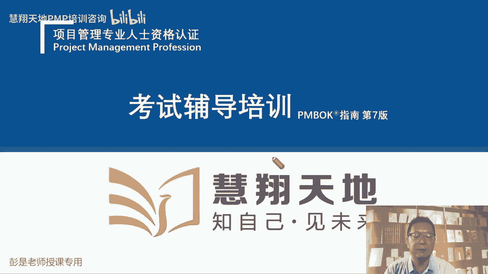
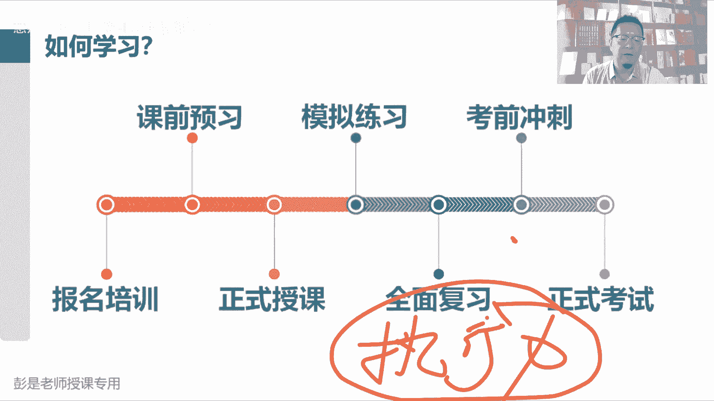
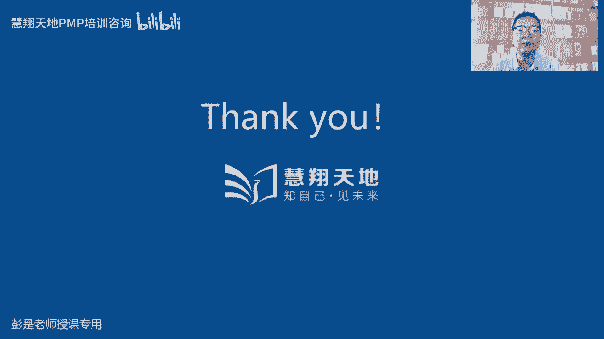
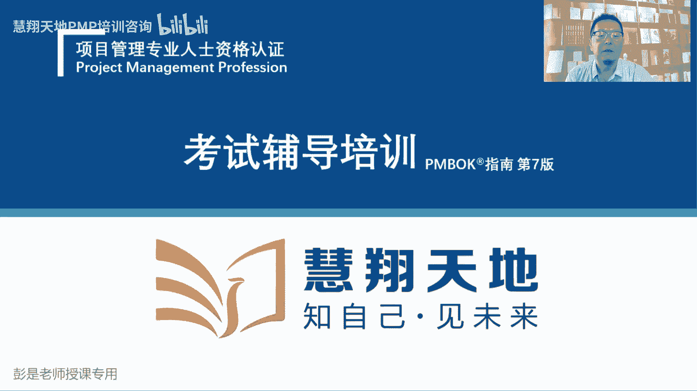
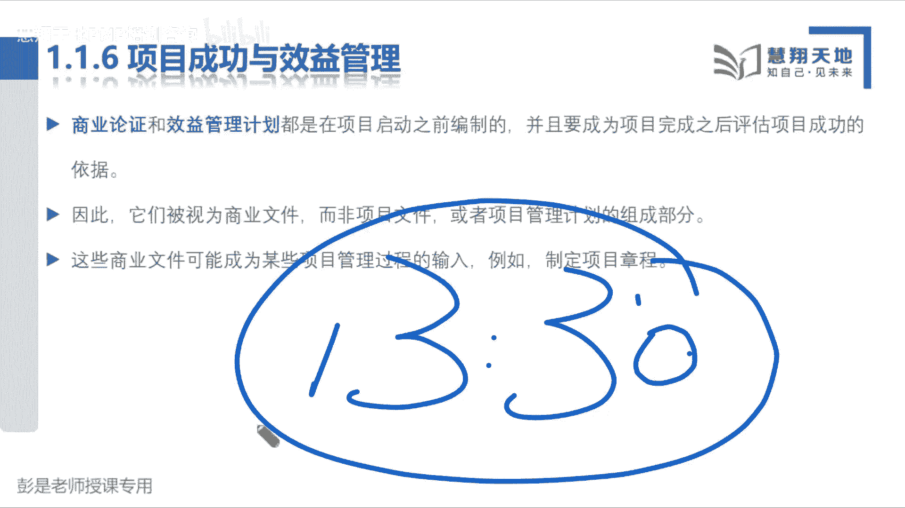

# 速看｜2024年PMP项目管理精讲课程｜收费课程限时免费观看 - P1 - 慧翔天地软考 - BV1yN4y1a7hc

。早上好早上好，大家早上好。Okay。OK了，写的字也能看到吧。早上好，9点钟早早早。好，再等10秒钟啊。因为有些同学咱们第一天上课，有些同学可能还不太熟悉咱们这个学习平台，所以稍稍等一等。

还有10秒钟时间即将开始早上的课程。早上好早上好。嗯。屏幕小能放大吗？应该你把你要是在电脑上看的话，把那个浏览器地址，把那个把那个听课的网址弄到浏览器里面去，应该就可以了啊。

具体的技术细节我其实不太懂啊。可以征求咨询一下班主任，应该有什么全屏类似的按钮吧。好，早上好早上好，1987654321。好了，各位同学，大家早上好早上好，咱们正式开始今天第一天上课啊。第一天上课。

第一小节课基本上大家听就可以了。咱叫导入课呀，听一听给大家介绍一下咱学的这个东西到底是个什么鬼PMP到底是个什么玩意儿，然后给大家大概分享一下咱们这个考试的东西啊，说考试的形式啊。

老师考试的什么什么通过怎么算呢？然后咱这个课到底学什么东西给大家说一下啊。所以第一第一小节课程大概一个小时左右，40分钟到50分钟。第一小节的课第一小节的课大家听就可以了，不需要看教材。

教材上也没有的啊。好，专心听专心听啊。那接下来咱给大家介绍一下，介绍一下咱这个课到底是个什么玩意儿啊。大家学的这个东西叫PMP对不对？PMP好，开始了啊，那到底什么是PMP呢？到底什么是这个玩意儿呢？

好多人好多人会认为说哎老老师我们学的是什么拍马屁吗？拼音对不对？不对咱啊不对，咱们这个全称。

叫项目管理专业人士资格认证。项目经理啊，项目经理到底怎么干活的？学这个答案，项目经理所需要掌握的管理技能拍拍马屁是其中之一啊，拍马屁是其中之一啊，软技能。咱们不学真正的拍马屁啊，咱们学科学的拍马屁。

所以咱们这个认证的全称叫。项目管理专业人士资格认证。它是由美国项目管理协会，美国项目管管理协会这个这个机构叫PMI美国项目管理协会颁发的项目管理专业人士资格认证。那看到这个title，看到这个名字啊。

就要想了，刚才有同学问到啊，说这个考试老师简单吗？不简单。一点儿都不简单，为什么呢？因为通过考试以后就具备，就认为我们具备了项目管理专业人员这样一个从业资格。那什么叫专业呢？什么叫专业呢？

说知道死记硬背，知道一些概念叫专业吗？这不叫专业。不叫真那样，我们掌握了概念之后，还需要能够做到灵活的运用。Okay。还要能够做到灵活的运用。所以我们要理解它里面的逻辑，去理解它们里面的道理。

去理解这些这些什么输入输出啊、过程啊、工具技术啊方法呀，去理解他们的价值观，这样呢才能才能够达到一个更高的水平。根据我们掌握的知识，灵活的运用到工作中，灵活的运用到考试之中。

所以这个考试的特点特别特别像什么呢？什么叫专业啊？就想这个场景。医生给你看病，他需要他需要储备多少知识呢？对不对？本科可能需要5年实习，可能一两年一两年啊，他需要掌握的大量知识。

才能够真真真正正的为我们去看病啊，才能够做到对症下药，有利放矢。那项目管理项目经理项目经理项目经理不也是干这个事儿的吗？所以这个考试的形式就特别特别像项目经理给项目来看病，题目给出一个描述一个场景。

一个项目遇到了一个什么问题。一个项目遇到了一个什么情况。您作为一个项目管理的专业人员会给出什么样的建议呢？哎，就是ABCD希望我们在众多选项之中找到一个相对来说比较合适的选项。

给出一个相对来说比较合理的建议。哎，考的是这个专业能力。这就是考的是我们对知识的灵活运用，看看我们是不是知道概念，知道概念之后，还能够经过我们的分析。经过我们的思考，给出一个相对来说更合适，更更贴合题。

更贴合题目场景的这样一个方法。哎，大。这个中心思想。所以这个考试的难度，大家一定做好充分充分充分的心理准备，和那个考交规根本就不一样。像大家如果去考去考驾照，就超简单，学什么学呀，视频根本就不看。

对不对？刷题就够了，刷题就够了啊，把这道题考试之前刷个一两遍，哎，记住答案就完事儿了。考试的时候都是这些题都这些题啊，然后根据你的记忆找那个答案就完事了，根本就不需要去理解的，对不对？

但PMP考试可不是这样的啊，第一，我们没有题库，没有题库PMI官方也有题库，但是这个题库会不断的更新不断的更新。所以每次考试遇到的题目可能不一样。第二第二。第二。第二是什么呢？记答案没用的。

因为题目一旦变了，选项一旦变了，最后最后的答案就不一样了。就像看病还是看病那个道理。同样一个患者，对吧？两个患者，两个患者可能可能同样是感冒的症状，给出的治疗方案很可能不一样。有的人就去吃药了。

有的人可能需要输液啊，有的人可能需要住院观察，哎，就是因为情况不一样，那作为一个像专业的项目经理，我们也这个道理吧，根据不同的场景，根据不同的项目的情况，根据不同的项目的形质。

我们给出来的建议很可能是不同的，考的非常非常灵活呀。所以这个考试的特点是什么呢？你做题做题做题记答案没用的，一点用都没有啊，一点用都没有，有可能会遇到相似的题目，相似的选项，但是稍微稍微改动一两个字。

答案就完全不同了。所以呢备题背题一点用都没有啊，还是建议大家通过我们的学习过程，希望能够掌握了它里面那个道，只要把这个道搞定了。道法术、道法术、道法术、方法和术根本就不重要啊。

只要把这个中心思想、大道理、价值观、逻辑逻辑思维的方式，把这些东西掌握了。知识点是什么？学到最后一点都不重要，大概知道这个意思啊，所以大家一定一定今天今天能首先听课非常非常非常棒啊。

一大早起床真的不容易啊。但是我们要做好充分的心理准备，循序渐进，先了解这些知识是啥，然后慢慢的慢慢的找改变我们的思维方式，慢慢的改变我们的思维方式，到最后呢能够灵活的运用这些知识去推理去推理去思考。

达到这个状态。大家知道这个意思。所以这个考试真的真的没那么容易啊，做好充分的心理准备。好，这个是这个小问题回答完了啊，继续往下走了啊，那PMI为什么这么牛呢？为什么我们要学这个PMP呢。等一等啊。

我把这个头像很讨厌给他调走。为什么我们要学PMP呢？就是啊PMIPMI作为项目管理领域的全球的这样一个专业的机构，它非常非常专业。上世纪60年代196几年就成立了，一直到1996年一直到1996年。

沉淀了将近30年才正式的推出我们这个官方教材的第一个版本。然后按照SO国际标准化组织的要求，四年更新四年更新，一直到我们现在2023年，我们这次考试学到第七版。哎，他沉淀了30年才推出第一版。

然后一直一直在与时俱进。随着时代的发展，在不断的根据项目管理的最新的什么新兴趋势啊，最佳实践呢，总结沉淀积累。所以呢他就推出了项目管理领域方面，各个方面的各种各样的专业认证。

包括咱们现在学的左上角第一个PMP认证，还推出了进度管理专业人士认证风险管理商业分析师PPAA就是那个特别特别像的一个大产品经理。然后呢，敏捷ACP还包括项目及这项目级认证。

项目组合认证和助理项目管理专业人士认证。总之他推出了这样的全家桶，就是体现自己在项目管理这个领域，它的权威性。非常非常权威啊。既然ISO国际标准化组织的项目管理标准都是参考的PMI推出的这个教材。

所以它非常非常权威。哎，非常非常火。那权威和火这个东西它的考试自然自然就不容易，就会有一定的难度，大家千万做好充分的心理准备啊。储充分的心理准备是说，不要让大家知难而退，不要焦虑不要焦虑啊，循序渐进。

循序渐进。刚才有同学问到哈，说这东西他到老师到底怎么学呢？就三个字啊。就三个字执行力。这个考试其实拼到最后拼的就是执行力。按照我们的学习计划，12345让干啥就干啥。让听课就听课，让看书就看书。

让预习就预习，让复习就复习。该做章节练习题，做课后练习题，该做模拟考试，参加模拟考试。按照我们的学习计划把它执行到位，通过考试就不叫梦。所以坚持坚持唯有这两个字啊。好，不要焦虑啊，焦虑没用的。

有哪些必考呢？不知道不知道，一会儿会收到的考试题目范围不定啊，没有，不像咱们这个传统的上学的那种那种那种考试啊，上学的考试老师给你划画重点啊，就看这些东西就可以了。这个偏批考试不是这回事啊。好。

再往下走了啊。那它火到什么程度呢？看一看PMI在全球的影响力。它在全球200多个国家和地区开通了考试认证培训机构，全球基本上无死角覆盖了。除除非除非一些极度不发达的国家和地区啊。

然后目前PMI的全球会员数已经超过了300万300万人，都是项目管理的专业人士。然后拥有PMP是直播吗？今天是2023年8月13号，现在是北京时间上午9。09。昨天北京下雨了，今天没下，阳光直射。

昨天也没下。好，拐弯拐快来啊。那全球目前持有PMP证书的人士已经超过了120万人，75%的企业，这些数据都是全球是个视角啊，75%的企业招在招聘项目管理相关专业人士的时候，会优先考虑是否拥有PMP证书。

所以这四个数据拿出来就想证明啊这个东西这个东西第一PMI相对来说是在项目管理领域比较权威的。第二个是他的这个认认证相对来说是比较火的。受到大家的追捧。他出的官方教材一直被项目经项目经理。怎么称呼的呢？

叫项目管理领域的圣经，非常非常地位非常崇高的啊。然后这么多人都拥拥有这个证书，这么多人都拥拥有这个证书啊。目前这个全球的证书分布形式其实会稍有变化。以前拥有证书第一大第一大国是美国，第二大国是日本。

然后咱们从那个2019年18年左右就开始反超了。现在中国咱们咱国家是拥有PMP证书第二大国家。然后按照目前的这个报考的一个火爆的程度，这个趋势去分析啊，再过个两三年。

基本上咱们就能变成全球拥有PMP证书最多的国家，没办法，咱人口基数大人多呀。然后咱们国内目前拥有PMP证书的企业是什么呢？Yeah。华为。华为要求他的这些这些管理人管理管理层。

至少至少至少要学一个这个东西。所以既然华为都认可这个证书，说明什么问题呢？对不对？华为不不会花为冤枉钱去冤冤枉钱去学一些没有价值，没有含金量的证书吧。所以说明这个东西活，说明这个东西权威。

说明这个东西有权威性，有含金量。那含金量含金量肯定是会和这个东西等价的。再说一下啊，下下下午教回大家难度确实有难度，一定要做好充分的心理准备啊，含金量高的东西，自然自然就不容易得到它。如果想得到它。

就需要付出一定的努力。所以各位同学保持一个良好的学习习惯，就坚持坚持就可以了。不希望大家每天生水深火热一样，说，老师我要学8个小时9个小时没必要啊，没必要。我面会说到，保持学习习惯，坚持1到2个小时。

差不多了，不难的啊，只要坚持只要坚持。好，再看一下PMP在中国的情况。1999年，咱国家外国专家局就把PMP认证引入到了国内，到今年今年已经24点了。

然后后来国家外国专家局被中国国际人才基金交流会合并了，现在叫中国国际人才基基金交流会啊。然后2018年年度日参加认证的人数第一次超过了10万人，就是印年考试的人超过了10万人。2022年。

咱们持证人数已经超过了50万，按照这个趋势越来越多了。所以这个考试到时候到了报名这个阶段，大家就能发现他的火爆程度了，非常非常火啊，报名的人多呀。那个考场的座位跟抢座似的，就这个意思啊。听一听就可以了。

好，那接下来看看咱们那个圣圣经，咱们这个教材的名字叫项目管理知识体系指南，简称PM book，就是咱们这个官方教材。然后ISO国际标准化组织。标国际标准化组织。

就把咱们教材的一部分内容作为全球项目管理的新标准。他出了那个ISOO相关的标准。哎，所以这个这个教材的内容是非常非常权威的。国际标准啊，那这个教材啊。里面都写了什么东西呢？写什么东西啊。

咱给大家梳理一下项目管理的发展历程，看看这本教材里面的知识点是怎么出来的。那项目管理项目管理通常认为它有三个阶段。第一个阶段呢叫古代。古代呢叫经验式的项目管理阶段，就是我们这些先辈啊，先贤呐修金字塔。

修长城。当时大家靠的是什么呢？经验吃一堑长一智吃一堑长一智。在平原地区，这个长城应该怎么修？在山上，这个长城应该怎么修？在土山上，这个长城怎么修。哎，在什么花岗岩山上，这个长城应该怎么修。

我们以血肉的代价，对不对？死了好多人呢去换取换取相关的经验，没办法，只能不断的以极大的代价去试错。以极大的代价去试错，没办法啊，倒是没有很科学的管理方法，哎，这叫经验式的，它不一定成体系。

它可能是一些零散的知识，然后呢，慢慢的随着工作的工作经验的不断丰富，不断丰富。哎，我们有了相当的经验，这个活我们可以做的很好了。但是这套经验不一定适用于其他领域。他有局限性啊，这套经验。

这套方法换一个场景它就不灵了，对不对？我会在山上修长城，那到了荒漠怎么修呢？哎，这招不好使了，又要攒经验。那我掌握了各种各样修长城的经验，掌握了各种各样修修修修长城的方法，你让我盖个城堡，这我就不会了。

你让我修个金字塔，这我也不会了，我们还需要去试错，所以古代我们试错的代价非常高，好在是中央集权，对不对？皇帝下了子命令啊，皇帝下了子命令，大家没得没得商量，没得选，只能玩了命的去往前走了。

这就是古代当时那个阶段，他可能不断的在某一个领域或者是某些领域沉淀，总结出来一些经验，但是他有局限性。他有局限性啊，知道这个意思。那到了近代，有两个非常著名的事件，推动了项目管理体系的发展。

那左边这个叫曼哈顿计划，右边这个叫阿波罗登月计划，它的时代背景基本上差不多，都是时间紧，任务重，很着急的事情啊。啊，曼哈顿曼哈顿计划是说，我们当时二战要尽快的造出一个很厉害的武器，打败小日本的。

所以要造这个原子弹，时间紧任务重。所以当时一大堆科学家就玩了命的去想，哎这事儿应该怎么管呢？有什么好的方法吗？就想了我们应该采用什么样的科学的管理方法去更好的实现我们这些目标啊，时间紧，尽快把它做出来。

成本呢还不能铺张，不能浪费，试做的代价不能太高啊，不能说你造个100颗200颗原子弹都不想啊，都不差不行，那我们还需要达到一定的质量标整和要求，这个东西最好最好依次成功。

所以当时一大堆科学家就发明了我们未来需要掌握的非常非常关键的项目管理的一些核心的方法和技术。比如说分解关键路定法，政治分析这些东西来更好的管理好我们项目的进度、成本和质量。哎。

他慢慢慢慢就逐渐形成了一套体系。什么叫体系呢？它就涉及到很多知识领域了，范围怎么管，进度怎么管，成本怎么管，质量怎么管，依此类推脱吧。哎，这些方法这些方法到了第二个事件事件事件的出现啊。

大家发现哎还能用得上。说我们当时美国和苏联搞那个太空争霸，这不就是登月计划吗？美国和苏联搞太空争霸呀，时间紧任务重啊，苏联今天卫星上天啊，那我们人上天，苏联今天人人上天啊，还出仓行走了。

那我们那我们看看能不能发射个东西上月球啊，对不对？苏联发射的东西上月球了，那我们把人送到月球上，哎，就这样一个时代为景，双方要抢啊，抢啊，抢第一名啊。哎，那科学家又思考了，我们这个时间呢时间紧啊。

啊不能成本不能超支啊，不能浪费啊。然后这些人呢上去以后还要回来啊，对不对？要成功啊，不能失败啊，当时科学家就想，哎，我们之前想的这些方法，现在看起来好像。还可以用，他可以复用。哎。

不管是你造原子弹还是登月，这套方法，这这些方法都灵。哎，于是慢慢的科学家就发现我们这些方法真的是它有普遍的适用性，它适用于各个行业，适用于各个项目适用于各个领域。不管是你搞什么登月造原子弹造武器。

或者是修桥大陆搞工程啊。哎，它有共性有共性啊。于是呢于是呢就把它变慢慢的慢慢的形成了一个叫学科学科。所以从这些著名的事件之后，美国政府就要求了说政府花钱。

从此以后我们做项目做项目都要采用这种科学的管理方法。因为它能够帮助我们更好的管理好项目的范围啊、进度啊、成本啊、质量啊，以此类推。哎，这就是两个非常非常著名的事件，推动了推动了项目管理这个学科的发展。

那发展到了现代发展到了现代啊，我们又发现工作中会出现各种各样的问题。Okay。各种各样的问题啊。嗯。什么问题呢？这些问题大家不用背啊，听一听就完事儿了。就是啊什么什么变更多，然后什么什么进度延误啊。

然后人员资源离职啊。核心成员不断的不断的可能会离职，离职率比较高啊，然后缺陷越来越多呀。以此类推了，各种各样的问题。那遇到问题，我们要干什么呢？遇到问题分析原因才能够对症下药。我们要去分析啊。

这些问题怎么会出现呢？产生的原因是什么呢？找到原因之后，咱再想这些原因，我们有什么方法，有什么方案去解决它呢？哎，这些方法这些方法我们总结出来之后，如果真的有效啊。

下次有什么好方法尽量的能够避免这些问题重复的出现，重复的发生了，这就变成了什么呢？叫注意事项。对不对？预防预防预防啊就变成了各种各样的注意事项。说我们项目优先级不明确，这个要注意啊。

这个东西会影响到项目实现目标的项目章程如果不正确，如果不完整，这活可能你也干不好。WBS以此类推啊，我就不念了啊，总之就涉及到太多太多的注意事项。那注意事项多了，需要怎么做呢？注意事项太多了。

需要怎么做呢？说这个项目啊，你干干这个项目，干这个项目做计做规划的时候，我这有2000条注意事项，3000条注意事项。项目经理，你逐条逐条去核对吧。太乱了太乱了啊，就需要去梳理它。就需要去梳理它吧，哎。

结构化的东西啊，梳理它梳理它。那自然自然自然而然我们就想到一个好方法叫分组，对不对？这些是我们管进度的时候的注意事项。这些是我们管成本时候的注意事项，这些是我们管质量的时候需要注意的东西。哎。

就做了分组，这个分组自然而然就衍生衍生，衍生变成我们项目十大知识领域。他在告诉我们管范围的时候，有哪些注意事项，管进度的时候有哪些注意事项。以此类推了吧，成本质量资源沟通风险采购相关方加上整合。

就变成了我们现在学到第六版之前的，现在学到第七版之前的第六版的非常非常经典的叫十大知识领域。然后我们又思考了，那进度啊，我在做进度表的时候在做规划的时候，这个注意事项。

和我未来监控监控进度的时候做的注意事项，好像不太一样。那我们在执行过程中有什么注意事项呢？项目一开始启动的时候有什么注意事项呢？最后项目结束的时候收尾的时候有什么注意事项呢？哎。

所以其实根据著名的代名代名环PDCAPDCA是说我们在做规划的时候执行的时候，监控的时候都有什么注意事项。再加上一头一尾启动和收尾，所以呢就衍生出非常非常著名的叫五大过程组。哎。

这就是我们一直一直在讲基于过程的项目管理方法的非常非常核心的非常核心的框架。五大过程组十大知识领域，中间有49个管理过程。哎，最后就变成了这张表，非常非常注名注明啊。他在提醒我们，在启动的时候。

你要做什么事儿，做这些事情的时候，有什么注意事项？在做规划的时候，我们有什么事情要开展，这些都是管理工作呀。那完成这些管理工作的时候，有什么注意事项，以此类推，就变成非常经典的五大过程组十大知识领域。

一共49个管理过程。然后每个管理过程什么叫管理过程呢？就是你管理工作。这些管理工作开展的时候，你需要一些输入，需要一些材料啊，对不对？输入。那这些管理工作完成的时候啊，你会得到一些成果，又变成了输出。

那完成这些管理工作的过程中，我们可能会用到一些方法，这些方法就呢就叫工具技术，对吧？这会怎么开呀？这个天怎么聊啊，有什么方法可以更好的帮助我们完成这些管理工作呢？哎，再往下一延展一延展就变成了这张表。

叫五大过程组十大知识领域49个管理过程，以及每个管理过程的输入输出管理过程的工具技术以及这个管理过程和其他管理过程之间的管理关系逻辑关系。就变成了非常非常复杂的一个框架。

所以这个框架我们就给他起了个名字叫什么呢？叫项目管理知识。体系它是一套东西，存在着很多很多相关的关联关系啊，所以称之为体系非常复杂。所以咱们这个教材以前叫项目管理知识体系指南，就对我们的工作形成指导。

让我们知道啊管理这个项目的时候都需要参考哪些知识，去去分析这些知识是否都用得上。哎，就变成了这样一个这这样这样一个结构。好，那再往下走了啊。所以呢PMI就干了这么一个事儿。Okay。Yeah。

PMI一直就致力于这样的工作呀，我们找全球的项目管理从业人员。根据大家在工作中的这些最佳实践，这实践方法这些方法论去不断的不断的对我们这个知识体系推陈出新。把旧的知识淘汰掉，把新的知识加进来。

与时俱进了。按照国际标准化组织的要求，四年更新一版。所以他沉淀了30年才推非常非常慎重的推出了第一版项目管理知识体系指南第一版。

然后2000年2000年推出到第二版、04年、第三版、08年、第四版、第二年、第五版、17年，当时由于出版发行的原因，所以推迟了一年17年才推出第六版。然后一直到今年2023年。咱推出第七版。

因为受到疫情的影响，所以又往后推了。哎，就这个大道理。所以现在现在我们考试备考的就是第七版项目管理知识体系指南这个官方教材，这里边的知识就是随着时代的发展，科技的进步，大家不断的不断的与时俱进。

推陈初新，大概这样这样一个来龙去脉啊。那发展到了现在，为什么要推出第七版？第七版又做了什么什么样的一个变化呢？刚才我们知道了五大过程组十大知识领域49个管理过程，这个逻辑非常清楚。

但是这个东西一旦逻辑非常清楚，条理非常明确，可能慢慢的慢慢的大家就形成了这样一个叫教条主义的东西啊。说我们一定要严格的按照这里面的流程，这里面的流程去管理项目，教条主义就墨守成规。但是现在的工作。

现在的工作不可能不可能。不可能让我让我们能够做到顺风顺水啊，现在的工作都通常通常通常很容易出现更多更多新的问题。所以这套思想这套思想不太适用于这个时代了，那我们需要对这个结构做个调整，做个调整啊。

那现在就像这种东西，什么新冠疫情，这不解释了吧，气候危机，咱们每年最尤其是最近最近最近两年嘛感受到非常非常强烈啊，对吧？什么洪水降雨台风对不对？地震，哎。

会可能导致我们的工作生活推出遇到遇到各种各样的变化啊，民权运动这不解不解释啊，全球态势，什么全球的局势，对吧？隔壁油价打仗打了打了这么长时间了，对不对？以此类推了。然后人工智能的出现。

让大家让大家耳目一新啊，拆的GPT就是这种东西吧，哎，可能会改变我们的工作生活，甚至改变国际形势啊。那就意味着变化越来越多，变化的节奏越来越快，变化越来越频繁。对不对。

不管是国家国际、国家、城市、行业、企业、个人工作、生活方方面面，方方面面变化越来越多。那如何更好的适应这种变化呢？如何更好的适应这种变化呢？在当今这个这个多变的商业环境下，我们在墨守成规。

按照我们传统的这种管理方法去完成项目的管理工作，它可能不一定能够适应了，才有问题的。所以基于这个理由，我们把这个所有的知识重新打散，重新分组，重新梳理，就变成了咱们要学的第基版。所以带出来这样一个词。

说，大家一致认为当前这个时代的特点叫乌卡时代VUCA是指的是我们在在这个商业环境中，第一易变性非常非常高，变化非常非常多呀。就不能不难理解吧，变数多呀，计划没有变化快呀，因为是新冠疫情这种东西对不对？

今天隔离了，明天又放了，后天又严了，后天又松了。哎，变化非常多，那商业环境也如此，对不对？我们的竞争对手每天都在不断的努力啊，今天出个什么独角兽，明天又出个黑天鹅，后天这个某某个企业又跨界跨界来搅局。

哎，变化非常多。第二个呢，不确定因素越来越多，不确定性越来越高，大家通常通常关于现在的商业环境的分析预判很难很难做到精准的，很难的，因为变数多。那一第三个呢就是复杂。现在我们这个世界没有这么简单。

越来越复杂呀，存在着各种各样千丝万缕的关联关系啊，牵一发而重全身。某个企业一个不起眼的行为，可能导致行业的发生变化了，对不对？这大家也不难理解啊，最后呢就是模糊性，就像新冠疫情的出现。

我们我们对这个东西一无所知啊，一无所知到底会发生什么完全完全很难去掌控的。哎，那商业环境存在着乌卡。这样一个特点。所以呢我们不断的总结，不断的归纳2021年其实就正式推出了第七版。

只不过2023年才正式的采用它。2023年正式采用啊。那定C版到底。把知识对知识干了什么事呢？重新做了分组。咱过去分组的方式是说，五大过程组十大知识领域。

告诉我们启动规划执行监控收尾的时候都要都要做什么事情，有哪些注意事项？告诉我们管范围有什么注意事项，管进度有什么注意事项。现在这个这个思维方式不对了。

没没有办法没有办法很灵活的根据项目的实际情况去做调整。所以我们把它改成了叫基于原则，然后关注的是价值交互。原则通常是给项目管理团队看的。告诉我们的管理者告诉我们管理者啊，管项目的时候有哪些注意事项。

有哪些原原则高屋兼瓴的东西啊？相关方哎，有什么原则呢？对对什么采购什么项目工作以此类推了吧。那价值交互更关注的是这活怎么干。他他这个视角更像更更倾向于让我们的项目团队成员去理解，我们在管项目的时候。

有哪些需要注意的绩效，绩效的领域，对吧？规划的时候有什么注意事项，以此类推吧，更工作的时候有什么注意事项，以此类推，干系人管干系人维持干系人的满意度，有什么注意事项。哎，所以他其实知识点没怎么变。

虽然增加了一些新的知识点，但大部分的知识点仍然适用于当前这个时代，只不过是说我们把知识重新做了一个分组。所以他就是旧的知识，适当的做了一些挑淘汰，适当的做了一些更新，然后引入了一些新的知识。

并且把这些新旧新旧的知识把它重新重新打散，再重新分组，告诉我们有什么原则，告诉我们完成工作完成工作哎，以结果为导向，以价值为导向，有什么要注意的东西，就变成了叫12个原则和8个绩巧域。

所以以前大家如果接触过第六版甚至第五版甚至更早的项目管理篇博课的同学，也不要担心啊，大部分的知识仍然适用于这个时代，仍然适用于啊它没有没有没有非常非常陈旧，没有非常迂腐，仍然适用于这个时代。

只不过是说我们五大过程组十大知识领域这个框架这个分组的形式不一定适用了。哎，这就是未来大家需要学就2块。其实说白了一个就是传统的项目怎么管，一个就是这种变化多的项目怎么管。所以大家如果拿到通关宝典。

你看看就告诉你，哎，基于过程的管理方法和多变环境下，项目管理的方法就是敏捷。哎，把这两个结合到一起。我们再根据项目的实际情况。该传统的地方就要传统，该多变的地方就灵活就适应。

就就要混合型的混合型的工作方式啊。好，大概知道这意思啊。所以其实第七版第七版大家也不需要过多担心，不要过多的担心啊，它知识知识点知识点。没变的，就增加了一些新的知识点。然后有同学如果之前看过第六版。

你就会发现哎PMbook第六版，这需要给大家拐拐弯解释一下啊。PM book第六版大家知道多少页吗？全书大概多少字呢？非常非常非常非常非常厚，那个页主我也记不住啊，七八百页，六七百页是有了。嘿。

它里面全书大概50多万字啊，快快70万了哎，五六十万字。那PM博格第七版它非常非常薄300多页。700多页吧，篇部个第七版300多页，360还是380，我也记不住啊，它里面的字数没有那么多。好。

771页VS300多页。还说老师啊，那我们这个考试考试不是非常简单吗？以前第六版700多页呢，现在只有一半都不到了，300多页，300多页是不是考起来非常非常简单呢？不是这个道理啊。

如果大家有兴趣看真正的第七版，你就会发现，第七版里面关于很多知识，关于很多知识不解释了。不解释了，直接大概写了一下，哎，这个知识，把这个单词往这一抛，都不告诉你这个单词是什么意思了。他不解释。

那第六版的关于这种项目管理的基础概念，基本概念做了大量的解释性的工作，去告诉你这个基本概念是什么。那第七版关于这个基本概念，很多很多都不解释，为什么呢？他认为你是一个项目管理的专业人员啊。

作为一个专业人士，很多基本概念没必要给咱解释了。所以他把这种大量的大量的解释性的工作给他去掉了。哎，所以他的页数就变薄了。这个道理啊，不代表着知识点少了啊，不代表知识点少了。

需要大家掌握的知识点其实是多了，在第六版的基础之上增加了一些新的知识点。大概有这个意思啊，所以大家考试的时候备考这个过程中就看通关宝典这一本书就够了，一会儿会说到教材的问题的。Okay。好。

大概知道了PMI是个什么鬼。然后呢，大概知道了咱这个考试啊，PMP是什么鬼，又知道了项目管理这个来龙去脉。咱们这个教材是个什么鬼PM不可。那接下来这个小话题就是看看项目经理。那目前全球形势在变。

对吧我们的教材在变，为什么呢？就是因为大家对项目经理的期待越来越高了。Yeah。就是对大家对项目经理的期待越来越高了啊。项目经理项目经理大家对他有什么期待呢？其实我们之前做过这样的企业调研。

说大家认为你心目中的项目经理，项目经理说这个岗位到底是干什么的呢？哎。大部分的员工，大部分的员工给出的答案，基本上基本上惊人的一致啊。大家普遍会认为说觉得哎我们接触过的项目经理啊，好像好像是干这个的。

Okay。打杂的。Bye。救火的我们接触到的项目经理基本上是打杂的哎，什么事儿都找他财务的什么什么售前的、售后的、售中的销售的和客户的和供应商的采购的技术的研发的市场的以此类推啊，什么事都管。

什么事都管啊，救火的是什么意思呢？哪有问题出现在哪儿啊，救活对涨啊，对不对？这边什么开发开发有问题了，技术有问题了，对吧什么客户那边又有疑问了，这个这这个系统又坏了，这个房子又漏水了，总之啊以此类推。

打杂的救活的什么都管，哎，这就是对大家对项目经理的期待啊，希望你能文能武能上能下，能高能低啊，什么都要干的，什么都要干了，对不对？从员从我们的工作到员工的生活都需要管哪，非常非常非常操心啊。哎。

所以其实大家对项目经理的期待越来越高，那管理层这个市场上看，对你的期待遇更高吧，希望你能把这个项目照顾好，最好呢还能考虑考虑啊，怎么让公司赚钱的。降低成本，提高质量提高效率啊，降本增效啊。

甚至我们还要考虑项目经理啊，你还要懂一些运营工作。这个东西我们一旦运营啊，一旦量量产啊，我们也要掌握相关的知识点啊，最好你还能参与一些售前工作，对把什么招标投标坐标书这些事儿你都得管的。哎。

就大家对对项目经理的期待其实就是越来越高，对不对？该横的地方就横该装松，该怂的地方就怂，对不对？意此类推了。哎，大概知道这意思啊，所以看看调研，看看调研调研的结果是这样的。我们要去分析啊。

客观的分析到底项目经理需要需要做成一个什么样的人呢？那目前全球的项目现状是这样的，符合最初最初的目标，能够实现最初的商业意图。上意图啊，这个比率这个比率在越来越高。从2019年到2021年。

它的比例能够提高提高50%个5%个故呃5%个这个比率。然后呢，在原始预算内完成功的完成项目，完成项目这个比率也在逐点提高。项目失败的概率在逐年降低，以前多以前多的时候能达到百达到50%。

到了2021年、2023年这个比率越来越低，失败的概率越来越低，被视为被视为失败的项目的比率越越来越低。哎，知道这个意思啊，就是人家好多项目成功的比率在提高，失败的比率在下降。要有思考了，为什么呢？

为什么人家做的项目成功的比例越来越高？哎，为什么我们公司这些项目这些项目失败的越来越多呢？要思考了，为什么呢？是什么原因呢？所以呢于是我们继续往下调研，去看看目前目前在全球视角上看。

不管是什么全球啊、北美呀、拉丁啊，咱们中国呀、以色利亚，不管不管是什么国家和地区，不管是哪个州的全球目前这个大趋势，就是这样的，项目成功的几率都在不断的提升。项目失败的几率，失败的几率都在不断的下降。

哎，那为什么呢？不管是什么行业的什么IT的什么什么伊色列列的吧，不念了啊，什么政府的IT的金融的电信的大家失败的失败的概率都在下降，成功的概率都在提高。那这些企业，它有什么特点呢？分析啊我外分析法呀。

为什么为什么为什么？好，再看这些企业的情况。那我们会发现项目成功成功概率提升的这些企业，它仍然有共性。所以交付客户价值为中心。刚才那个单词见过了吧，价值交付啊，他们更关注如何更好的帮助客户实现商业意图。

然后呢，和组织的价值观保持一致，大家团结众志成城，团结一致，万众一心的，然后采用数字化的解决方案，就数字数字数字化转型这种东西啊，以此列对吧？支持灵活的工作方案。就是变成了三个字叫看情况。

根据项目的实际情况，采用灵活的工作方式，该预测的地方预测该敏捷的敏捷，就这个东西啊，然后多样性以此类推不不一个一个逐个的训练了啊。总之，这些企业，我们最后一总结，他们叫进取型的组织文化。什么叫进取型呢？

就是学习上进，与时俱进，不墨守成规，不教条主义，不官僚主义。哎，这些失败的失败的几率就会下降。成功的比率就会提高。那这些进取型的企业，进取型的企业再往下分析啊。对吧除全球项目成功的概率在提升。

然后不管不同国家和地区成功的概率都在提升。这些企业他们有这样的一个特性啊，他们都爱学习，他们都上进都上进啊。那这些企业这些企业他们里边关于项目管理的方式有什么不同呢？再看啊，进去型组织新的工作方式。

新的工作方式啊，哎，瀑布行瀑布行。比传统企业少。瀑布型是什么是什么东西呢？就是我们传统的管理管理方式，五大过程五十大知识领域。哎，教条主义墨索成归啊，他们这方面这方面做的比比传统企业少很多。

那他们现在更多的在采用敏捷的方式，或者是混合型的方式，混合型的就是瀑布加敏捷加到一起。灵活的根据项目的情况，该教条主义的时候，教条主义该灵活多变的时候，灵活多变，就这个意思啊。

所以这些企业成功的几率就高得多，还灵活。那这些企业这些企业他们更关注人。的哪些方面呢？人的哪些方面呢？将发展协作型领导视为人才培养中的重点。他更关注更关注你是不是具有很好的领导力啊。

是不是能够组织大家协调大家促进其促进工作的促进工作的推进呢？哎，所以再去分析这些企业里面的人，就会发现他们的这些管理者，有这么4个非常非常厉害的共性的技能。不不行，听不懂，没关系啊。

五大过程组是大知识领域。好，再往下走了啊。那这些企业这些企业他们的这些管理者更关注什么呢？沟通。问题解决合作。通过领导力促进团队合作和战略性思维，善于思考啊，有大局观，有大局观啊，就这种东西。

他们的管理者有这四个4个非常非常共性的特征，非常鲜明的。哎，这样他们这些企业才会上进。这些企业一旦上进了，他的成功的几率才会提升，成功的几率才会提升了。哎，显得与众不同啊，那继续往下一分解。最后最后。

就这么一个话题啊，说大家项目成功的概率在提升，是因为有一些企业表现的与众不同，非常非常卓越，非常非常优秀。那这些企业更注重一些很新兴的方法实践，用到工作之中，他们企业里面的这些领导。

这些管理者更关注是什么呢？什么沟通啊，领导力啊，哎以此类推了，就分析到人，所以就是根据根据目前全球的这个态势。我们发现大家对管理者、管理者，有这样的这样的一个共识。

所以对第七版我们这个教材知识内容都做做了调整啊，变成了。12个原则，8个绩效率是告诉我们管项目的时候，哎，目前目前全球这些人他们采用了这些新的方法，能够更好的完成任务，实现目标。

提高我们这个事情成功的可能性，把项项目的成功从偶然变到必然，就这个思路啊。好，说白了还是根据现在现在最新的趋势去分析大家在用什么新兴的方法在完成工作，把这些新兴的方法根据我们的教材做了调整。Okay。

好，所以再往下。那再翻看看啊，我们学这个学这个项目经理这个破玩意儿到底有什么用啊？如果如果学了学了项目管理，像学了项目管理。未来如果想走到项目经理这样一个岗位的话，第一。

这觉得最大好最大的好处就是工作机会多呀。今年今年工作形势不景气，大家应该也有所耳闻啊。但是根据官方的预测，根据官方的调预测。权威机构的调研的结果啊，我们预测到2030年，从19年到2030年。

目前全球项目项目项目工的工作机会非常非常多。因为更多企业更多企业在通过项目的形式在不断的研发新的产品啊、搭桥修路啊、做工程啊、搞基建啊以此这样，通常是通过项目的形式去完成。那通过项目的形式去完成。

就需要很多专职的专业的项目经理。所以目前根据这个预测，到2030年，中国国内项目经理应该能够能够达到100万百万级啊。然后各个国家和地区咱就不念了啊，总之机会，工作机会比其他岗位上升的会多得多。

然后再看具体的薪酬，这不这这个这这个东西大家可能会看起来不舒服啊。就看中国吧，以中国为例，然后像低于三年的项目经理啊，基本上中位数是25000美元一年。大概是十几万15万哈。

然后3到5年的基本上能够达到20万，5到10年的就是30万，伊此类特不念了啊，3361830万左右吧。我书记不好啊，总之，工作经验越多，薪资上涨越高。但是这里边的人群这里边的人群又分两种又分两种啊。

最后给会给出这样一个定性的结论。在接受调查的40个国家和地区中，具有PMP证书的调查对象的中位数更高。是什么意思呢？有证书的人比没证书的人，他的薪资普遍会高一点点。高一点点啊，就这个道理。

普遍高到什么程度呢？就这个平均数是16%左右。所以如果没有证书，你的年薪是1万块钱，有证书，你的年薪可能就是一点。16万就这个意思。有证书比没证书强的多呀。哎，有证书的人能够证明你的学习能力，对吧？

能够证明你达到一定的一定的专业程度啊。所以他入职入职的这个门槛会低一些，就这个道理啊。所以随便看一看其他的其他的国家和地区的数据，大家就不要看了，不要看了啊，看完了心情会不太舒服呀，对吧？

什么澳大利亚哇，什么人家年薪都这么这么这么多钱了，一大堆数字看起来不爽。🤧Yeah。知道意思就可以了啊。所以通过考试拿到证书之后，大家未来普遍这个证书能够帮助你提升自己的身价。因为第一。

这个考试没那么简单，有含金量的。如果能够通过考试拿到证书，说明你有本事啊。好，等一下了啊。那PMP对认证对大家个人的价值呢，这听一遍就完事儿了。第一，能力咱们这个培训不是给大家说，不是给大家念念教材。

没意思的。念教材给大家念一遍这个什么什么叫受理需求，念一遍什么叫定义什么什么什么叫定义范围，没用的，没意义哈。咱们希望通过不断的听课，看书，包括未来日后的群里面的答疑，每日练习，包括未来的模拟考试。

希望大家能够提升能力。思维能力。推理的能力，判断分析的能力、决策的能力。所以通过咱们的培训，大部分同学能够认为哎至少至少这几方面能力会得到一定的提升。第二个，收入的提升。

这个话题其实其实现在可能谈起来不合适啊，不不谈了。第三个呢，效率。大部分的同学通过通过学习PMP会认为自己工作效率得到提升了。因为学习能力强了。你会不知不觉不不知不觉，至少至少你的学学习能力会强。

所以呢工作效率、工作效率、工作方法。比如说未来会给大家讲什么饭茄工作法啊，包括什么S hour决策矩阵这些这些知识大家或多或少会用到工作之中，可以提高你的工作效率和质量。最后呢就是认可的提升。

通过调查数据之中有76。7%的人认为，取得PMB证书之后得到领导和同事的认可。所以变成大白话，就是通过考试拿到证书，发个朋友圈，学一波，不少人来点赞。不少人类点赞的。一会儿你看看那个后面有图案。

成绩单证书逼格B格非常高啊，可以装一装啊。好，那最后说到正儿八经的一个小知识点。恐怖。收到考试。做次考试了啊，大家专心听专心听啊，这个非常重要了。

考试咱们这个考试从这三个从这三个领域来评价你对知识的掌握情况，叫人员过程和业务环境。人员呢就是相关方能不能管好团队成员能不能管理好。哎，指的是相关方管理和团队成员管理过程呢。

就是我们能不能知道这些预测型的管理方法呀，铺布的管理方法，敏捷的管理方法。哎，知不知道这些过程应该怎么做？业务环境就是大局观。就是大局观。你知不知道什么叫商业环境？知不知道什么叫消目启动之前那些事情啊？

对不对？什么可行性研究啊、商业价值啊、效益分析啊，知不知道什么叫项目及项目组合就这些东西要了解项目的环境，包括运营。那从这三个领域评价，我们对知识的掌握情况，看看这句话。

在考试中约一半的内容将体现项目管理中的预测法，也就是传统的瀑布型的这种管理方法，五大过程组十大知识领域49个管理过程。嗯。那另一半呢将体现敏捷方法或者是混合方法。

也就是大家未来需要学到的什么srme看板这些东西啊。哎，所以一半的题目将考预测型，一半的题目一半左右将考敏捷。非常非常灵活呀，看看我们能不能能不能根据题目给出的场景。

灵活的灵活的根据我们掌握的知识来判断来分析啊就这个东西啊。所以这是考试考试大纲这么这么一段话啊。好，这张图这张图就是大家考试通过之后会得到的一张叫成绩单。成绩单啊，成绩单中间呢就是及格线。

如果你的成绩在左边，在及格线的左边，就说明不合格。Okay。综合能力没有达到要求，就说明不合格。如果你的成绩在右边呢，就说明合格，符合要求，哎，就能够拿到证书了。

然后下面呢是关于人员过程和商业环境三个领域的评分，三个领域的评分评分分成四档，叫ATTB。嗯，如果你的考试评价会得到A，比如说人员是A，就说明什么呢？高于平均水平，高于预期啊。如果是T。

就叫他给的叫符合符合预期。如果是B就说明掌握的不太好，低于目标低于预期。N呢就是说需要改进，说这个成绩不好，成绩不好，学的不好，学的不到位。所以最糟糕的成绩叫三个N，最糟糕的成绩叫三个N啊，都不好啊。

最好的成绩，成绩呢就叫三个A三个领域都拿A呀，非常非常优秀。所以各位同学各位同学，相信大家不断的坚持学习，拿到3A不是梦，拿到3A不是梦啊，想拿到3N还挺难的，挺难的啊，很巧妙的躲开所有的正确答案。

其实挺难的。所以预祝大家预祝大家都能够顺利的通过学习，通考考试拿到3A拿到这个证书啊。好，接下来看看，这就是证书。证书的形式可能会未来未来会做一些细微的调整啊，但内容是不变的，上面是PMI的标志。

中间是证书的持有者，然后中间名字下面就是证书的名字PMP认证ACP认证都这个东西啊。然后呢，左边右左下角右下角领导签字，PMIPMI的领老板签字，最下面一行就是证书的编号有效期，编号有效期啊。

啊概这意思。所以通过考试通过考试，如果成绩好的同学，如果成绩好的同学，你能选两张图啊，一张是成绩单3A。一张是证书，纯英文纯英文逼格非常高啊，对不对？如果成绩不好的同学呢，你可能只能选一张图秀一张图。

只能秀个证书了。证书上是不体现成绩的，证书上看不到成绩的。哎，所以至少至少通过考试通过考试发个朋友圈，会得到一大堆的得到一大堆同事同学的亲戚朋友的认可。哎，这个意思啊，那考试的形式，整个考试的形式啊。

一共是180道题，180道选择题。考试时间呢230分钟230分钟啊，大概4个小时，两种题型，一种叫单选，从四个选项里面选出一个相对来说比较合适的答案。还有一种叫多选。

从5个6个7个里边选2到3个题目一定会明确的告诉你选几个答案，这个多选题。所以100180道题，230分钟，两种题型单选和多选单选和多选啊。多选题大概十道题左右，剩下大概170道题左右都是单选。

都是安全。嗯。好，接下来各位同学先不要闲聊了，专心听专心听专心听非常重要。和你考试有关的东西。如果还不想听啊，这个考试这个考试要要打油准备的仗啊，专心听啊。那接下来非常重要的话题是什么呢？

咱们这个考试啊是线下考试，需要涂答题卡，和大家高考中考图的那个答题卡一样的，需要涂答题卡，大多数人涂卡的时间基本上需要20到30分钟。🎼图180个空的，正常人，正常人基本上20分钟到30分钟左右。

所以实际上实际上我们考试的有效时长就是200分钟。然后200分钟要答180道题。每道题呢大概100多个字，平均下来啊，100多个字，100多个字，看完了之后，明白这个题目的场景是什么。

明白这个项目的场景是什么。还要看完ABCD4个选项，然后去根据我们掌握的知识去分析这四个选项，哪一个相相对来说最好给出一个答案，所以变成大白话就是一分钟一道题，要能够把这个项目的情况看明白。

要能够做出我们的决策。所以它实际上考的就是你专业不专业，就体现这个决策能力了。那一分钟一道题，这个难度可想而知。100多字100多字，你要搞明白这个项目的情况，然后看完选项。

看完选项给出一个相对来说比较合适的建议。哎，这个难度非常高，难度非常高啊。他考的是什么呢？考的是你快速反应能力啊。就是稳准狠就是稳准狠，对吧？一个专业的医生听你大概说这么两句话，哎。

就能给出一个相对来说比较合适的比较科学的决策结果了。就这个道理，考的是你的快速反应能力啊，看看你这个这个方面这个方面它就体现你的专业性。对不对？反应越快反应越准，说明越专业呀，反应越慢，反应越不准。

说明越不专业呀，就这一个道理啊。所以他其实考的就是肌肉记忆，程序化记忆这种东西就像大家什么什么骑自行车，对不对？骑自行车之前，大家应该不会想它的流程，不会想它的操作的程序，登场就走，登场就走啊。

根本就不思考啊，像每天早上早上起起床以后，洗脸刷牙，没有人去想啊，想一想这个脸应该怎么洗，想一想这个牙应该怎么刷，根本就不想，都存在小脑理，存在小脑里。哎，这叫程序化记忆。

看看你作为一个专业的项目管理人士是不是能够快速的快速的根据题目的场景给出一个相对来说比较合适的建议。所以这玩意儿的是玩的是文字游戏啊，为什么叫文字游戏呢？再给大家科普一下，为什么叫文字游戏呢？

项目经理的读写能力，大家就想这个场景，读写能力重要吗？你投投个标投个标几千页的标书见过吗？如果没有优秀的卓业的读写能力，这个标书你都看不懂啊，看不出其中的文道啊，就这个道理吧。

所以读写能力也是考核的一方面也是考核的一方面。对不对？所以它是综合能综合分析啊，综合能力啊，不仅是阅读，不仅是对不对？不需要咱写哈，阅读能力、阅读的速度、阅读的效率、阅读的质量都是考核的。

都是考核的一方面的。🤧就像大家大家买到买到那个药买的药啊。买的药，你看那个药品的使用说明书，如果有专业知识的人就能快速看懂。如果没有专业知识的人就看不懂啊，对不对？什么什么什么什么禁忌啊。

什么什么不良反应啊，症状啊，没有专业知识，根本就看不懂啊。哎，他就体现你的专业性了，就这个道理啊。所以你要想证明自己是一个专业的项目经理，就需要能够快速的快速的把这个题目看懂。

根据你们掌握的知识点去分析去判断，给出一个相对来说比较合适的选项，给出一个相对来说比较合适的决策结果。然后什么25分不计题，25题不计分就做梦了啊，做梦了。大家这个考试的考试的计分规则，现在不要担心。

不要操心PMI根本就不公开。你在网上搜到的资料都过时了，过时了，老黄历了，清朝都推翻了多少年了，就这个东西啊。所以后面大家学习方法里边有一个非常重要的东西啊，叫不要百度，不要去搜索。

不要在网上去看去看一些外部资料。因为你们目目前大家没有没有足够的知识储备，你没有办法判断网上的资料说的是对的还是错的。🎼这个咱能达成共识吧，没有足够的知识储备，你判断不出来他说的对不对，你可能搜了半天。

搜了半天，学到了一些说的不太对的错误的知识点，这反而这种东西啊很很难很难很难把它从脑子里面清除掉的对，清除不出去的那你掌握了这个错误的知识点，错的知识点。哎，就像同学说的啊。

因为可能学了一些莆田系的知识点。哎，反而不助于大家考试啊。所以。听课听课啊，专心听课，专心看书，尽量的少看一些外部资料，少看一些啊，尤其是题。尤其是你旦知道大家那个焦虑担心啊。

说老师我想搜到一些更多的题，做做题，做做题，看看我这知识掌握的情况。外面的题外面的题啊，他给出的答案，给出的解析，给出的答案，给出的解析，对不对，你们判断不出来的，对不对？万一说你记了一个错误的答案。

万一你说你做了记了一个错误的解析不好不好啊，不利于大家对考，所以尽量的少看，尽量的少看咱们的题够你刷的，咱们题够你刷的了。我每次就舔一舔啊，跟小猫喝水一样啊。其实我现在口干舌燥。好，这段这边这段翻过啊。

这段翻过，回到回到正正道上来拐弯的结束啊。Yeah。所以呢这个考试要求大家作为一个专业的项目经理，能够快速的决策。因为你在日常工作中，很多场景都需要快速决策呀。张三那边有问题了，你四那边有困难了。

客户这边又提新需求，过两天客户又不付款了，明天还要向供应商过会付款，供应商这个货还没到呢。供应商货没到，哎，影响你项目进度了，这边质量又出了问题，以此类推吧。

大家在工作中工作中很多很容易出现各种各样的突发事件，这种突发事件一旦出现，一旦出现，你没有办法快速的给出一个相对来说比较合适的决策，结果很可能导致大家觉得你没本事啊，对不对？老板在屋里面躲了好几天了。

现在也没一事不吭啊，一事不吭啊，这活不知道怎么干的。哎，乱糟糟了吧，所以以此类推，他考核的就是你这个专业性。好，再往下走了啊。所以听课的时候加上这张这张这张这张图标像什么呢？一会儿就休息了。

坚持坚持啊几分钟了。这张图片叫什么呢？大大家都知道吧，叫微信啊，叫微信啊，考试的时候基本上就亮了。你像哪一个是微信的logo？第一个第二个第三个第4个我看起的头像啊，如果不专心，如果不专心。

很容易选不出来的，对不对？所以考试的时候它会加很多叫干扰因素。叫烟雾弹。叫干扰因素叫烟雾弹是什么意思呢？它不会问你纯概念的，不会问你纯概念的。问你刚才那个图标是什么的logo，对不对？

它会加很多干扰因素，烟雾弹变成场景。No。高总你在一个项目里面，可能张三离职了，然后明天那边又换领导了，这边客户又提了新需求了，问你哎，应该怎么做呢？他会加很多干扰因素烟雾弹来干扰你的思维方式。

所以呢我们要能从重重迷雾之中找到对应的知识点，找到对应的选项，给出一个比较合适的答案，要做到这个啊，需要有一定一定的难度的，需要大家不断的不断的提升。第一，听课的能力，就首先需要训练了。什么叫专心听呢？

就是不要聊天，少聊天，少聊无关的话题，聊知识点。第二呢就是后面大家学习看书啊，看书啊，也需要专注。通过看书训练我们的阅读能力。通过看书训练我们的阅读能力啊。

阅读的速度、阅读的效率、阅读的质量都需要提升的。如果不提升不提升，后面题都做不完，题都做不完的。好，再通过不断的做题，检查我们对知识的掌握情况。总之，学习计划给大家安排好了。

大家一定一定关注班主任发的群公告群通知。该做什么就按时按时把它执行下去，落实下去就可以了啊。好，所以听一听到底怎么学呢？PMI官方推荐的官方推荐的推荐的参考资料一共有10本。一共有10本啊。

咱们现在学的叫项目管理知识题指南第七本第七版左上角这个还需要掌握A种敏捷实践指南。它里边的很多很多知识啊，还来自于什么sum精髓，项目管理过程，什么项目管理工具箱，以此类就不念了啊。

官方推荐的教材阅读资料是十本书。这十本书这十本书大家可能工作十年8年的都不一定能够看完了。看不完的怎么办？老师，这事这事没法考了，对不对？这事没法考了。我们现在是8月初备考，11月份。

3个月看十本书都看不完，这是怎么考？对不对？我们只有一本通关宝典嘛，哎，他就是抓精髓呀，抓精髓呀。所以大家完全不用去看这些东西了，完全不用去看这些东西。看通关宝典，做做咱们那个给大家发的题就够了。

就够了。就够了，重要的事情说三遍啊，所以不要担心不要焦虑不要焦虑啊，说老师这些书这些教材我们需要去看吗？不需要不需要啊，抓大放小，抓大放小，我替你们都看过了，我听我替你们都看过了，就这个话说啊。

就帮你们看完了，然后总结出来，总结出来重要的考点都在咱们那个宝典里面了。好，听一听就完事了。所以关于我自己这这段文字就不垫了啊，吹牛逼的吹牛逼的，反正吹完了，大家也不一定信啊，听课看疗效，看疗效啊。对。

就是这个医生水平高不高，看疗效，看疗效，看后果。好，这段吹牛逼的不念了。所以希望通过大家通过通过培训，第一掌握项目管理相关的知识，不仅仅是死记硬背。什么叫掌握呢？能够根据我们的知识灵活的运用啊。

然后彭老师会帮助大家减少学习的复杂性和困惑。刚才十本书要不要看呢，不要看不要看啊，减减这减少这个困惑。然后帮助大家能够。更好的掌握这个道，我们要去理解一些逻辑，理解一些价值观，理解一些大道理。

这个大道理清楚了之后呢，很多知识点根本就不用记的，不用背的，不希望大家死记硬背，死记硬背，一点好处都没有的。然后希望提升大家所学知识的应用能力。通过通过讲解，还希望大家能够掌握这个知识啊。

能够做到举一反三，灵活运用，对不对？你记住它记住它也没用，还要能能够用到我们的工作或者是生活之中。所以后面讲解讲解大部分的案例都是大家生活中耳熟能详的案例，炒个什么鱼香肉丝，炒个鸡蛋、西红柿。

做个宫爆鸡丁，哎，灵活的运用啊，最后呢最终目标是促进大家能够顺利的通通过考试拿到这个证书，提升大家在职场上的竞争力。你有了证书能力得到提升思维方式比较严谨，比到周密，考虑的比较周全。

能够掌握一定的推理能力。哎，这不就是批判性思维这种东西吗。总之总之，能力提升，身价提升，希望大家走向人生巅峰，变成高富帅。以色列对啊。好。那接下来最后最后两三分钟，咱们就可以休息了啊，坚持坚持坚持。

没讲啥哈，那到底怎么学，每次都看到这个小杯子啊，这叫什么呢？老师是要喝着酒学吗？老师是要喝白酒学吗？不是的不是的啊，这个东西叫。空。They。空杯心态空杯心态。什么叫空杯心态呢？什么叫空杯心态？

Book。快速的磨一磨耳朵啊，就当时啊这样一个场场景，有个一个高僧，佛法非常高明啊，很厉害的。然后有个人向他去请教，是吧，大师啊大师啊，我想向你请教问题啊，结果这个人到了大师面前。

就开始叨叨叨叨叨叨诉说自己对这个世界的看法，诉说自己对这个世界的理解。大师都插不上话了，大师插不上话，开始干嘛呢？开始往这个杯子里啊，给施主倒茶倒茶。结果这个水倒满了之后，水倒满了之后啊，大师没有停。

继续倒，哎，这个施主就好奇了，说大师水满了，不要再倒了，不要再倒了，水都洒了。大师说，您来向我请教佛法。您来向我请教佛法，您内心里面已经充满了这个对这个世界的认知，充满了对这个世界的不满。

你现在啊听不进去东西啊，对不对？你要把你对自己的对对这个世界的认知和力量，把它扔了，把它扔吧，你先听我说，你先听我说，我来给你说一些东西啊，就这个道理吧。你来向我学。

你要倒了到了自己自己自己内心的认知啊。那为什么呢？为什么大家学习学习备考，包括未来考试的时候，包括听课的时候要空杯心态呢？就看这张图，现在我们学的叫通用的职业标准，刚才说过了吧。

修长城修金字塔、曼哈顿计划、阿波罗登院计划到现在这个时代，乌卡时代。PMI一直在与时俱进。我们推推出的官官方教材，官方教材它有普遍的适用性。第七版就用了这样一个词啊。

说教材里面的知识适用于所有项所有行所有项目，跨行业，跨领域，不管是你搞工程、搞电子、搞软件、造汽车，搞医药、搞制造。不管是哪一个领域，它都能用得上，所以它适用于所有行业，所有行业啊。

那我们自己实际工作中呢，首先我们要考虑行业特点，造汽车的和修房子的这个套路是不一样的，对不对？工套路不一样吧，要考虑行业特点。那同一个行业呢，每个企业情况又不一样，同样是造汽车的同样是造汽车的对吧？

什么电动车哎A公司和B公司它的方法又不一样。它是根据公司的环境来决定我们的标准政策流程过程程序规范这些东西啊，每个企业有每个企业的特点。那同一家企业。同一家企业啊，相同的两个项目情况又不一样。

上次造电车和这次造电车，哎，我们这个方法可能会做调整，每个项目又有每个项目具体的情况，最后呢再结合到我们个人身上，每个项目的管理团队，每个项目的管理者。

你们掌握的知识啊、教育背景啊、经验啊、技能啊、技巧啊又不同吧。哎，所以实际上我们自己在工作之中是根据行业的情况，企业的情况，项目的情况，自己团团队的情况来决定了一套管理方法。

那这套管理方法这套管理方法有什么问题呢？它可能能够帮助各位同学很好的完成当前的这些工作。但是它的适用性适用范围越来越窄，所以大家实际上说难听点。我们每个人每个人都是什么呢？都是井底之蛙呀，对不对？

每天的每天的工作，每天的工作只这么点东西啊，哎，我们的见识非常非常对吧？非常少的，见不到更多东西啊，就是它有局限性，它不一定适用于其他项目，不一定适用于其他企业不一定适用于其他行业。

所以你遇到A项目管的好好的，来了个B项目情况不一样了。哎，这套方法不好使了，或者是你跳槽跳到其他企业了，你要适应这个企业的什么文化呀、流程啊，政策啊程序呀，标准大规范呢，情况不同。

甚至你都没有办法跨行业。哎，所以呢空杯心态，空杯心态，尤其是考试的时候，一定不能根据我们自身的工作经验去判断。我们要去。有大局观，看看放眼全球啊，看看全球这些项目管理从业人员，他们是怎么做的。哎。

所以空杯心态，空杯心态，千万千万不要根据我们自己的经验去分析经验最不可靠。在考试的考试的时候啊，经验最不可靠了，所以一定要忘掉自己的经验啊。就这个道理。好，所以呢整个整个我们备考阶段。

现在现在给大家在正式授课了吧。然后呢后面会组织大家做课后练习啊，课后练习听课复习呀。然后组织大家模拟考试，组织大家全面复习到考前中四到正式参加考试。总之，计划已经帮大家定好了，大家现在拼的是什么呢？あ。

拼的就是执行力。拼的就是执行力啊。所以之前你们有同学说过呀，即使在班的人虽然听起来很难听啊，即使在班的人在班的人啊，按照我们的学习计划，12345，你把它落实执行下去，通过考试不是梦。

但前提条件千万千万千万不要太自信。不要说哎老师我工作经验比较丰富了。我基本上哎大概听一听大概翻译班教材做题差不多就行了。千万千万不要这样啊，不要想，当然不要太自信，因为考试和你实际工作出入非常大的。

你工作有局限性的，你只知道一方面的，对不对？只知道一方面，他不一定有很高的很很高的适应性啊，适应性了。所以这个就就这个意思啊，坚持坚持坚持就这两个字，相信相信坚持下去，大家通过考试拿到3个1都不是梦了。

上课直接讲3个小时，有课间休息吗？接下来就是这么打理好时间，肯定要休息的，肯定要休息的，我也需要休息啊。所以咱们基本上考试每每节课每节课保持到40分钟到一个小时这个时间段。

然后呢适当的适当的中间会有课间休息的对讲3个小时死掉了。好，那接下来就是重大利好时间。重大利好呢就是课间休息。

快点休假啊，先别先别跑啊，亲亲不要跑不要跑不要慌。等我告诉你休息到几点呢。我得写出来哈，不写出来大家会可能会听不到的。看看现在时间啊，10。09，咱们休息8分钟时间，休息到10点17准时回来。あ。

8分钟时间8分钟时间，各位同学该喝水喝水，该放松放松，接下来就要讲知识点了啊。可。Okay。🤧。玉玺一会儿会说的玉玺一会儿会说的啊。考试B卷吧，有会会说开卷，你翻书都翻不到知识点在哪，他不会考概念的。

基本上现在不咋考概念啊，翻书都找不到的。嗯。好，各位同学准备了准备了，我们开始正式今天的第二小段课程了，开始正式的讲知识点了啊。Yeah。Yeah。好，各位同学正儿八经的开始讲课了啊，开始讲知识点。

然后什么什么老师未来怎么预习的，今天听完课，听完课啊，看班主任发的群公告群通知，会告诉大家，听完课之后怎么看书，怎么复习。下次上课之前该预习什么内容。所以大家一定一定关注咱们微信里面的群通知。然后呢。

如果觉得这个这个东西太吵了太吵了，可能会打扰到你比什么设置评蔽群消息啊，关注班主任发的通知就可以了。嗯。好，全世界同时都是同时间考试吗？不是的不是的啊，除了大陆地区，其他国家和地区都是在线考试。

都是在线考试。只有大陆大陆大陆地区是。呃，线下考试。是一年4次、3月、5月、8月、11月。好，正式开始讲知识点了啊。

那第一部分第一部分给大家就先讲项目管理相关的背景概念。我们要了解什么叫项目，什么叫项目及什么是项目组合，什么是PMO项目经理有什么能力要求，什么叫运营？项目和运营之间各种各的关系啊。

所以接下来我们上课的内容和大家通关宝典上的内容是一样的。按照通关宝典从前往后讲。那在讲课的过程中，讲课的过程中啊，有一些重要重要的知识点，一定会放慢语速给大家反复讲反复讲。

所以建议大家建议大家在听课的过程中是这么学的啊。现在呢就专心听。现在就专心听，大家可能来不及，有足够的时间去做笔记。来不及呀。你可能低头一去写。低头一续写就听不到我在说什么了，就会走神儿就会分心啊。

如果大家低头去做笔记的时候，可能就听不到知识点了。所以建议大家呢第一遍听课，第一遍听课就专心致志的听就可以了。听明白它是什么？适当的在书上做一些重点的标记。比如说重要的知识点，你标个五角星。

需要大概看一看的标个什么三角形，有些内容可能现在出于备考这个角度可能不需要看，你就做个什么么叉错的标记啊，以此类推，做做标记，画画重点就可以了。然后第二遍听课的时候，第二遍复听的时候，复习的时候。

再去根据你掌握的情况来适当的开该记录记录，该写一写，该写一写知识点，写一些总结的东西啊。所以这是学习的建议。然后呢，第二个需要给大家分享的是什么呢？专心听专心听专心听这个东西。

这个东西其实是我们学习的第一大障碍。第一大障碍啊叫专注力不够啊。Okay。专注力不够吧，什么叫专注力呢？这注意力不集中，注意力不集中啊，现在能够影响我们专注力的东西太多了太多了啊。

就像大家日常想一想你工作里边的场景，对吧？哎，有人给你发微信消息。我刚才发的朋友圈有点赞吗？今天的热搜是什么呢？今天的热搜是什么呢？有没有什么八卦可以吃在线吃瓜子呢？哎，有人盯我呀，有人盯我呀。

刚才那个邮件刚才有另外一会儿又来了什么骚扰电话，还有工作上的电话，每天每天影响我们注意力的东西太多了。所以导致大家实际上实际上目前在工作中基本上都是这样一个状态啊，叫碎便话呀。非常非常零碎啊。

很难保持注意力的高度集中，这是一个共性的问题。很难保持注意力的高度集中。那怎么办呢？怎么破呢？给大家先分享一个学习的小方法，包括可以用到工作中这个学习工作的方法叫什么呢？叫。提笔忘字。Okay。

是这么写吧。番茄工作法这个方法超简单的。あと？大家可以百度一下啊，这个这个知识点可以去搜一搜搜一搜搜一搜。超简单的番茄工作法的原理是什么呢？我们要训练自己的注意力、专注力啊，那注意力不集中的同学。

大多数人现在能够坚持15分钟到20分钟就差不多了，很很难很难专心致志的把一件工作完成，什么？30分钟、40分钟啊，那我们就想办法想办法不断提升自己的注意力，怎么提升呢？他都是这样建议的啊。

你可以考虑把自己的工作或者是学习任务，把它分成分成一大堆一大堆的小小的工作单元。每个工作单元你可以刚开始注意力不集中的时候，比如说设置15分钟或者是20分钟一随便啊。总之，设置一个时长，在这个时间段内。

我就专心致志的把这项工作去完成。尽量的想办法排除掉一些各种各样的干扰因素。对干扰说去死来了电话不接，来了来来了微信不看呢不看了，专心致持的完成手头的工作。那如果在工作的过程中，你接了电话，看了微信。

看了朋友圈，我们就认为这就是一个中断。如果有了这样的中断，那这个事儿怎么办呢？重新来再重头开始，仍然让自己专心致志的花10分钟、15分钟、20分钟甚至更多时间把它去完成。那完成一个番茄时间。

完成一个番茄时间啊。比如说完成了A这个工作，它就是一个番茄时间吧。完成了一个番茄时间，适当的休息个三五分钟，可以该看看微信，看微信，该看朋友圈，看朋友圈啊，该学习的时候学习，该休息的时候休息。

休息完了之后呢，再开始下一个番茄时间，然后再来适当的来个短休息，再开始下一个番茄时间，适当的考虑要不要弄一个长休息，以此类推，非常非常简单的方法，可以训练自己的专注专注注意力啊。总之。

中心思想专心致志的把这段工作完成，该休息的时候就专心致志的去休息。然后随着这样这样不断的训练，慢慢的我们的专注力可以不断的提升。从15到2020到3030到40。

大多数人基本上45分钟到60分钟差不多了，几下。两三个小时的注意力的高度集中，这也很累的，累心的也不现实啊。所以这就是番茄工作法，可以训练我们的注意力的。好，所以大家想这个道理。

为什么小学咱上学的时候一节课45分钟啊，就这个道理啊，差不多了，到头了，再往下走，学习的效率就会下降了。好，知道这个学翻题工作法。然后第二个，大家未来复习的时候，就可以考虑用这样的方法了。

45分钟左右啊，30分钟啊，20分钟啊，专心致志的听，专心致志的听。听完了之后该休息休息，该中断中断，以此列列。那第二个大家考试的障碍就是刚才说到的读写能力。

就是阅读能不能最快的把这个题目什么意思说看明白，能不能尽快的把四个选项什么意思看明白。哎，阅读的速度、阅读的效率、质量也是影响影响我们考试的一个重要因素。这方面也需要大家做专单独的训练啊。

那阅读阅读阅读有什么好方法呢？说老师，我看小说行不行啊，看散文行不行啊，没用吧。就像刚才有同学说啊，看什么电子教材其实都不好。因为大家实际上目前的阅读习惯基本上一目十行啊，尤其是看小说，对不对？

一整页纸拿也睛一扫，可能意思大概意思就差不多就知道了。但是考试这么玩可不行啊，考试这么玩不行啊，太粗了太粗略了。所以呢阅读能力，阅读能力，我们要看这种不说人话的书，看这种不好理解的书。

去训练自己的阅读能力，所以这让大家上学的时候学的那种文言文，白话文不好不好看吧。但是如果你掌握了一些技巧，掌握了一些方法，哎，慢慢的慢慢的就会越看的越来越快就能看得懂了。所以呢阅读阅读阅读。

建议大家就看咱的官方教材给大家发的通关宝典，就看这个书吧，然后最好最好最好看纸质的。个人建议啊不建议大家看电子的。因为咱正式考试也是线下考试，也是纸质的试卷书啊，也是纸质的。如果你看电子的看习惯了。

突然突然切换到纸质上，纸质上可能不习惯，可能不习惯啊。另外看纸质的东西，你可能注意力会更集中啊。电子的东西在电脑上在手机上就很容易分新的。哎，随以时给大家大概分享这么两个挑战这挑战啊，两大障碍。

一个是专注，一个是阅读。好，那正儿八经开始讲开始讲知识点了啊，专心听专心听专心听。不道。放心，重要的知识点一定会反复带着带着大家去梳理。如果某一段时间突然一走神，灵魂出窍了，听不懂，跟不上了，没关系啊。

没关系，还会讲到的。所以大家在听课的过程中，听课的过程中，现在讲解的知识点，如果有不理解的，可以及时的提出问题啊。但是不建议大家去聊其他无关的话题，不要发散思维了。好，那接下来看看这一章的内容啊。

项目基本要素。我们要了解项目项目管理的重要性，项目项目提系项目组合运营，还有了解项目管什么什么关键组成部分，什么阶段啊，阶段关口啊，这些东西啊，然后了解什么叫项目裁剪，了解项目的，什么叫商业文件。啊。

开始讲了啊。第一。我就直接跳了啊，一。1先看这个概念，项目是创造独特的产品服务或成果而进行的临时性工作。一上来就给了这么一个高大上的术语。帮助我们去理解什么是项目。

所以理解什么是项目说创造独特的产品服务成果而进行的临时性工作。这到底什么意思呢？到底什么意思呢？所以需要给大家带场景去理解啊，听故事听故事啊。好，给大家讲个小故事。呃，讲什么话题呢？

现在大家都知道洪水这个事吧。哎，好，就讲这个东西吧，虽然不太好啊，洪水洪水洪水导致我们还有些村庄受到了受到了影响，我们的路都被冲坏了，我们这个桥都被冲断了，冲断了啊，卡了吗？卡了。现在好了吗？

12345678910好了吧，111213行了吧，好。可能现在。现在什么洪水呀这种东西啊，有可能会影响到影响到网络啊。好，那重新来啊。重新来。准备了啊，项目是创造独特的产品服务成果而进行的临时性工作。

所以呢需要给大家讲带带入场景啊，去理解这个东西啊，到底什么是项目。项目到底搞什么事儿啊，带场景带场景，咱就说修桥搭路这个事儿吧。现在什么有些地方有洪水，大家都听说了啊，导致我们这个路面受损呐。

桥被冲断了，桥被冲断了，村庄房子都冲倒了。哎。那行，我们要把这个路给他修修好。把这个桥给他修好。把这个房子给他盖起来，盖起来这些事情它有什么特点呢？这些事情它有什么特点呢？Okay。流畅啊。

把它完成就可以了吧。把它完成就可以了吧哎。把这个路给他修好，对吧？什么搭上搭上路基，然后铺上碎石，铺上沥青，把这个路修好就可以了。把这个桥给它搭好就够了，把这个房子给它建好就够了。那路修好之后。

桥修好之后，房子修好之后，还有一些很多事情啊，可能需要定期的去开展啊，定期的把这个路给它给它清理清理，给它扫干净，定期的把这个路面啊给它维护一下，保养一下。哎，这个桥修好以后。

定期的要去打扫打扫这个以色列修吧，定期的要去把它维护保养一下啊，这个房子修好了以后啊，每天也要做卫生的，清理一下，对不对？这个房子呀可能定期的去维护保养一下。哎，这样的事情，这样的事情。

这样的事情他更侧重于什么呢？Yeah。叫运营吧，持续开展。定期定期定期定期的打扫一下卫生，定期的做一下维护。哎，那上面这些修对吧？修路搭桥盖房子，它更侧重于什么呢？把这个事儿完成，它叫临时性。Yeah。

它叫临时性。所以有这种临时性的东西，我们通常通过项目的方式把它去完成。这种持续性的东西呢，我们通过通常通过运营的方式把它去完成，这就是两个非常非常重要的基本概念，叫项目和。运营。

两个非常重要的基本概念啊，叫项目和运营，也就是常态和非常态，对不对？有一些临时的事情，我们通过项目的方式把它去完成。哎，那这个房子盖好了以后，我们每天什么维修啊、保养啊、打扫卫生啊，这事就叫运营。

以此类推，我们可以把这个场景切换到任何一个任何任何一个行业领域啊，比如说开餐厅。好，我要开一家餐厅都干什么事呢？选址，然后租房子装修、注册公司、买灶台、买炉具、买炊具，对不对？哎，什么上软件、桌椅板凳。

哎，就这这些这些事情啊，这些事情都有临时性这样一个特点，把它完成。就可以了。那很多事情还要重复开展呢，每天买买菜对不对？做菜，然后刷碗。打扫卫生，收钱。哎，这样的事情。

这样的事情对我们这个企业来说需要持续的重复的去开展。我们把它称之为运营运作。哎，这是项目和运营两个非常非常重要的基本概念。以此类推了吧。你开个什么酒店，开个什么度假村，盖房子项目房子盖好了以后，对吧？

每天打扫卫生，打扫房间运营，持续开展，重复开展。所以这就是项目和运营的本质区别。再换各种场景都适用啊。就样大家想这个话题啊，比如说。比如说啊。找对象是项目还是运营啊？🤧嗯。找对象是项目还是运营呢？

回答的时候要慎重啊要慎重啊。是不是有些人把它当做运营在处理？对吧什么海王渣男哎，看情况吧，但是大多数人我们把它会当做项目去进行处理，把这个事儿完成就可以了，对不对？你不能跟你跟你跟你娘亲说。

我每天都对吧？我持续的每年都要找对象啊，一年找一个呀，这是运营吧，这是好这不对不对啊，不对不对，通常通常我们把它当做项目去完成就可以了。那找完对象，哎，3253同学说的很棒啊，处对象。谈恋爱。

这是项目还是运营呢？谈恋爱谈恋爱，维持两个人的关系，这是项目还是运营啊，运营了吧，对不对？定期的没事，吃吃饭，喝喝茶，看看电影，聊聊天，维持关系啊，这是运营。那运营到运营到一定一定程度之后，谈婚论嫁。

我们要领结婚证办婚礼，这是什么呢？🤧项目对不对？不能说天天办啊不能说天天办啊，哎，通常大多数大多数正常人把它当做项目去助理，以此类推了吧，结完婚过日子，这是什么呢？运营每天柴米油盐酱醋茶，对不对？

每天做这点事儿啊。以此类推了吧。所以其实无论是工作，无论是生活，无论是对企业来说，还是对个人来说，这个大道理基本上都一样。有一些临时的事项，我们把它去完成，通常通过项目的形式就可以了。

有一些需要重复的持续的定期的去开展的工作。哎，那我们通常通过运营的方式把它去实现。所以吧买房子项目买完了房子装修项目装修完了住住运营在里面维护保养，对不对？打扫房间，以此类推了啊。好。

那知道了这个大道理，我们再看啊，再看再想一个小问题啊。再讲一个小问题啊。那知道了对企业来说，我们有两个事情，一个叫项目，一个叫运营。那换场景换场景。如果各位同学现在你打算去创业。打算去创业。

你会先想什么呢？先想什么呢？Yeah。我要租房子，我要注册公司，我要装修。创业项目创业项目先定什么呢？方向。就是定位吧。Yeah。先定方向吧。创什么样的业，对不对？这些方向就有一大堆高大上的术语了。

叫什么呢？目标愿景、使命、价值观就你企业这点事情啊，我们是一家什么样的企业，未来我们会达到一个什么样的状态。我们来到来到这个地球上有什么样的使命？然后我们的价值观是什么？

就是目标愿景使命价值观、高屋建瓴这些东西啊，为我们指明方向啊，对不对？我们是打算成立是一个什么餐饮公司啊，还是要建筑公司啊，工程公司啊，还是什么技术创新研发公司啊，以此类推，哎，就是企业的蓝图。

那这个方向一旦敲定了定位一旦有了，接下来做什么事儿呢？去思考。这叫如何了吧。如何实现你的宏图大业呢？就这个道理吧，所以方向告诉我们做什么。What。😮，如何如何就是告诉我们去思考如何实现这个目标啊。

就是好怎么实现的。哎，这个东西叫什么呢？叫企业的战略规划。我们走什么样的路径去实现这个目标，我们走什么样的路径去实现这个目标，对不对？比如说我们打算一年一年先定个小目标啊，一年赚它一个亿。

那怎么赚这一个亿呢？你是炒股，买理财，还是去打砸抢，还是做实业，做什么实业呢？是卖煎饼，还是麻辣烫，还是做火锅，以此类为吧。哎，对企业来说，这是选择呀？就是叫战略规划，我们选择走什么样的路径。

选择做什么样的事情，去朝着这个方向去发展。那战略计划战略计划战略计划一旦敲定了。接下来其实我们具体的项目和运营就清楚了。对不对？像我们打算开一家什么牛肉面馆，哎，那选址注册公司装修、买罐瓢盆，哎。

这些项目我们就清楚了。那这些项目一旦完成之后，我们公司进入日常的运作，日常的经营，每天对吧？买什么要买什么原材料，买牛肉，买面。哎，我们每天打扫房间，刷盘子，刷碗运营的工作也就清楚了。这就是对企业来说。

最重要的最重要的企业管理地图这么几个单词啊。话擦掉重来。第一，定方向，目标愿景使命价值观，然后做企业的战略管理。战略管理就是做我们的战略规划，一年、两年、三年、5年、短期长期中期这种东西啊。

做了战略规划，我们要做的具体事情就清楚了，就知道了我们未来需要开展哪些项目，知道了我们企业运营工作，运营工作到底怎么做，开个餐厅和开个酒店运营的工作不一样，对不对？我打算开个制造业，开个工厂。

或者做手机做汽车运营的工作不一样。那研发手机研发研发汽车，哎，这个项目不一样啊，所以通过目标愿景使命价值观，通过企业的战略规划，我们未来要做的具体事情才能够清楚。

这就是企业管理地图三件事儿叫战略管理、项目管理、运营管理三步走啊，定战略。有项目。管好运营哎，这么三个事情。那知道了这个大概的结构之后，再看。那通过企业，通过企业，我们企业里面有很多事儿啊。

有些事情它有临时性，我们需要把它去完成，把它去完成。所以项目的概念就带出来。我们通过通过项目可以帮助企业创造一些独特的产品服务或成果。通过帮助通过项目帮助协商到独特的产品服务服务和成果。

他需要有一个明确的开始日期和结束日期。这个明确的开始日期结束日期就称之为项目具有临时性。它和运营是没有，它和运营是相反的，运营通常不希望有明确的结束日期。

这叫不希望啊不希望我们希望这个这个这个公司这个公司这个牛肉面馆开1年，开80年，开100年，开1万年。我们希望能够持续的赚钱的对不对？希望能够持续的赚钱。所以运营通常通常不具有不希望它具有临时性。

但对项目来说，我们一定要有明确的项目的工期的要求吧，三个月把这个桥修好，4个月把这个路修好，一个月把这个公司注册下来，他希望有明确的开始日期结束日期，这个目标一定要明确的。好，知道了企业目标愿景。

使命价值观，知道了企业的战略管理。知道企业有项目，有运营项目呢，我们希望他能够有明确的开始结束日期，不能遥遥无期。运营呢既然追求的叫持续发展，持续发展。哎，我们通常不希望他有这个明确的结束日期。好。

知道这么多这么套话术啊。那再往下我们还要搞定搞定这个单词，为什么叫创造独特的产品服务或成果呢？为什么叫创造独特的产品服务或成果呢？嗯。就是说呀对。Okay。Okay。不是这个竞争力啊不是这个竞争力。

就像盖两个楼，盖两个楼，它的结构。他的楼层它的装修对吧？内外装修一模一样一模一样。但是他什么地方不一样呢？Yeah。Okay。Okay。位置不同吧，有的楼下面可能就是岩石，有的楼下面可能就比较松软。行。

所以大家可以参考参考。前两天那个天津，不是有个楼，什么地下结构波不滚，这个楼就歪了，就这个东西吧。哎，它的位置不一样，它的环境不一样啊。那位置不一样，环境不一样，有的楼下面就比较结实。

有的楼下面就不结实。有的楼下面可能有供水供电、天然气管道啊，施工的时候一定要小心啊，有的楼下面可能千疮百孔啊，有地下河呀，以此类推类类推了吧。哎，它的位置不同。那这个楼完成的时间很可能不一样啊。

盖楼的人有可能不一样啊，即使是同样的人，他在不同时期，他的心情他的能力他的体力都不一样，这叫什么呢？就统称为独特性。那这种独特性意味着什么呢？这种独特性意味着什么呢？不是。不是差异化产品那个独特啊。

它意味着什么呢？哎，不确定子轩同学说的没错啊，这种独特性就意味着不确定。就意味着不确定性了，对不对？这个楼下面什么结构啊，这个楼结实不结实啊，这个人盖楼的时候心情好不好啊，能不能按时完成啊，对不对？

它意味着不确定性，这种不确定性就意味着风险。就意味着风险。对？所以就是不要侥幸心理，要考虑周全，考虑周全，考虑周全，学项目管理就是风险意识。看看我们能不能做到考虑周全这个楼的位置一样不一样啊。

有什么特殊的因素啊，有什么特殊的注意注意事项啊，全是注意事项吧，这个人有什么注意事项啊，这个人昨天和今天状态有什么不同啊，今天心情不好，万一出了安全事故会怎么办呢？风险意识啊。所以我们要考虑清楚啊。

哎这种独特性独特性，我们要考虑每个项目，每个项目它的独特的这些因素，这些因素就意味着风险。那我们要提前规划好规划好这个东西啊，让问题尽量的不发生，少发生，这是风险意识。好，这个概念搞定。

项目创造独特的产品服务或成果而进行的临时性工作。项目的两大特性搞定了啊，独特性临时性。那接下来再看再看中间这三个单词，产品服务或成果，这就不难理解了吧。产品非常广义的一个概念啊。刚才有同学说产品差异化。

哎，产品差异化战略管理其实有两条路啊，低成本、低成本对边或者是走特征差异，低成本就是咱家便宜。特征差异呢就是我们与众不同啊。那创造独特的产品产品是什么意思呢？就手机是产品，电脑是产品。

房子也可以称之为产品，软件是产品，药品是产品，汽车是产品。哎，借助产品。哎，两位同学非常棒啊，迈克尔波特三大竞争战略吧。或者是考虑成本差异，或者是考虑特征差异，或者是深耕，对吧？深耕。好。

这这咱PMP考试不考啊，回到产品这个单词啊，产品这个单词好理解吧。软件、汽车、手机都可以认为是产品。我们通过项目的形式创造出新的产品，或者是对现有产品做升级做改造。对吧？

比研发了手机第一版、第二版、第三版，嘿，或者是对现有的产品做升级，从而形成新的产品服务和成果。那服务是什么东西呢？服务啊更侧重于叫什么呢？叫工作。完成工作给你提供提供提供一些服务啊，达到你的预期啊。

所以像保安、保洁、外卖，这都是服务吧。外卖小哥给你送餐，这不是服务吗？对不对？哎，伊斯列克快递物流，包括给大家讲PMP培训，这也是服务啊。那通过项目的形式可以创造出一些新的服务，对吧？

比如老师在课后备课，我等讲PMP讲软考，讲ACP那备课这样的事情对我来说就是项目啊，我要做PPT我要看书，我也要学习呀，备课备课，对我来说就是项目了。那备完课之后讲课对我来说实际上就是运营。对不对？

讲课实际上对我来说就是运营啊。我希望讲课这个事儿啊能讲100年、1000年、1万年都赚钱了，大白话啊。记住刚才有同学有同学给其实总结的非常到位了啊，不同视角不同视角观点不一样的那讲课对我来说是运营。

对各位同学来说，大家学PMP这事儿对你来说是项目还是运营呢？大家参加培训，参加培训，对各位同学来说，这是项目，对不对？我们有临时性，对不对？工期工期是固定的吧，是什么11月几号考试我也记不住啊，对不对？

有明确的开始日期、结束日期，它是项目标准的项目啊。那每个每每对吧？大家学习每个同学拥有每个同学的特点吧，大家的经验、背景、专业知识技能都不太一样啊，这是独特性啊。每次培训每次培训对各位同学来说，哎。

我们每个培训班，每个微信群都有独特性吧，这都是风险啊。好，就这个意思啊，所以视角不同视角不同，看待事物的最后这个结论可能不一样。所以大家活学活用啊，活学活用到底什么是项目，到底什么是运营，根本就不重要。

重要的是什么呢？我们要知道项目的特点，我们要知道运营的特点。项目的特点我们更关注的是能不能按时完成。更关注的是这个这个独特的项目有没有。不一样的地方有没有不确定性，有没有风险。那对运营来说。

我们更关注的是如何把这个事儿持续的开展下去，持续的开展下去啊，每天都有客人来买单的干这个事啊好。再往下走了啊，项目创造的独特的产品服务。那第三个，什么叫成果呢？什么叫成果呢？这也好理解啊。

就想到科研成果、研究成果这种东西吧。对吧，你来帮我做个。做个研究个什么核酸检测方法，什么抗原检测方法，研究个什么新冠特效药。哎，这是科研成果。科研成果啊。这个东西。所以通过项目的形式。

可以研可以创造出新的产品，可以研发出创造出新的服务，可以创造出独特的成果。这个概念都搞定了啊。嗯好，所以咨询咨询咨询其实是提供服务吧。通过这个服务，可能会得到一个对市场调研的成果。哎，这个东西啊。

以色列对了。所以我们创造独特的产品服务或成果，项目又有独特性，又有临时性。这5个数五个单词搞定。这就是项目。好，再回到第二个。图这张图大家教材上没有听就可以了啊，听就可以了，讲会讲好多遍的。

这张图是什么呢？就是刚才给刚才给大家说的企业管理地图。对企业来说，对企业来说，我们可能需要决定我们的一些方向啊，目标、愿景、使命、价值观。我们要开一家餐厅，一年收回成本，两年赚到100万。

三年以后实现财务自由。嘿，目标愿景使命价值观，对吧？我们这个餐厅服务人群是什么？我们要做牛肉么牛肉面啊、麻辣烫啊，定位是哪先定方向。方向定好了之后呢，我们做战略规划，到底我们到底这个餐厅怎么选址，对对？

这个餐厅到底规规模有多大？我们餐厅啊到底是做做做外卖呢？还是还是主主打一个主打一个高精尖高端呢，以此类推，做企业的战略规划，选择我们做什么事去实现目标这个选择对我们来说就是方案呢。

就是好这个方案一技巧定要做的事，就两大块，一个叫项目，一个叫运营左下角叫运营operation，右下角叫项目project。项目把它完成就可以了，它有临时性。

通过项目的形式帮助我们创造新的独特的产品服务或者是成果。另外我们餐厅餐厅哎只能堂食过两天过两天我们拓展经营，可以从可以可以外送了，这是增加了服务吗？哎，拓展经营，拓展经营，可以增加增加更多的更多的菜品。

这都是通过项目的形形式去完成。完成这些项目之后呢，我们就转运营，把我们的成果移交运营，该修路修路，该修开打扫卫生，打扫卫生。这就是企业管理地求地图这三件事啊。

战略管理运营管理项目管理后边会说这个项目组合和项目集现在时机不到啊，到时再说了。好，这样往下走了啊。第一个概念搞定，再看书上这段文字，相对来相对来说就比较简单了。一点一点一。1。1点压。

program指的是项目级，项目级的概概念概念，后面再学了啊。对。Yeah。其实项目集压也超简单，给大家先说先说吧，讲个道理讲个道理啊，讲个场景。想个场景啊，就这这个这个这个这个场景。

不一定百分之百准啊，知道意思就过了。像买房子和你小孩在哪儿上学。这俩事儿会不会。会不会有关联关系呢？在哪儿买的房子上哪儿的学校，这两个事情会不会有关联关系呢？以前有个概念叫什么呢？叫学区房吧。

现在可能有些有些城市在淡化这个概念啊，但是但是咱说大多数情况下啊，会吧买在哪买的房子在哪上学，这两个事情有关联关系。那买房子这个事情对你来说是项目还是运营呢？买房子这个事情。对你来说是项目还是运营呢？

项目吧。回答运营的同学，土豪啊土豪要要要低调啊低调。土豪会把这个事情当运营，对不对？我是专业的专业的炒房人，就没别的就有钱，每天买房买买买。哎，咱们不不考虑这个这个场景啊，大多数情况下对我们来说是项目。

那小孩说上小学上小学找一个学校对我们来说是什么呢？也是项目吧。对不对？😊，哎，这个地方要不要考虑让他上个什么学什么上市重点，区重点，或者实在实在是学校太普通，要不要考虑，对不对？哎。

对我们来说找找学校找学校也是项目。那这两个项目它存在着强关联关系吧，它的成果之间存在着依赖关系。依赖关系啊大多数情况下上什么学校取决于你买哪儿的房子，对不对？它存在着依赖关系。

那我们要想办法把这两个事情都给他管理好。这种管理方法叫什么呢？就叫。项目级。所以项目级他就是就是多项目管理。他关注的是怎么把这些这些事情啊，怎么把这些事情，这两个事情给他一次处理好。

不要说买到错误的房子，影响小孩上学啊。哎，这就是项目级管理。这叫program。这个单词。那前面再往上，既然讲完项目及索性把项目组合也讲了吧。上面那个port项目组合，项目组合，什么叫项目组合呢？

什么叫项目组合呢？它的道理是这样的啊。等我把中间这段擦掉一点点，项目组合又是又是个什么玩意儿呢？这个道理也超简单的，大家就带到带到自身的场景里面啊，说张三同学张三同学跟我说，彭老师啊。

我现在有很多事情要去做。比如说呃找这些啊。找对象啊。买房子，然后学PMP学PMP啊，哎我还想换工作，换工作有好多大事儿。那对人来说，我们有限的是什么呢？时间。经历。成本。对不对？我们有限的时间。

有限的精力，有限的成本啊，今年不可能这四个目标都实现的，今年不可能这四个目标都实现的，有难度有难度啊。那我们需要考虑干什么事呢？就叫世分轻重。缓急。十分轻重缓急，十分轻重缓急，我们要去排排序了。

看他对你来说什么事情更重要。什么事情更重要？今天有些同学可能没有办法来听课，为什么呢？可能要加班，对不对？如果不去加班，老板可能就把你开除掉，开除掉啊，会影响到会会影响到你未来的生活。哎。

所以对有些同学同学来说，今天去上班比今天学PMP这个事情优先级更高。优先级更高，因为他生活所迫呀。那有些同学今天不来听课，可能他去找对象去了，对不对，说找对象找对象，今天不去啊，不去去哎这。

对吧人家以后就见不上了。哎，对他来说，现在这个阶段找对象这个事儿更重要。有些土豪同学可能今天去买房，今天去买房啊，以此类推。所以我们对人来说，我们有限的是时间精力前，那我们要十分轻重缓急，排排序。

把我们有限的时间、精力和资金用到正确的地方，用到正确的地方啊。那对企业来说也是这个逻辑啊，一模一样。对企业来说，我们可能要研发一个新的产品。对企业来说，我们可能有多条产品线啊，大家随便参考企业啊，对吧？

车企什么百度、腾讯都有这个道理吧，苹果对吧？腾讯有QQ，有微信，有什么腾讯会议，以此列对吧？它有多条产品线。那对企业来说，我们有这么多的产品，可能还要提供很多的服务啊，还有很多的成果呀，所以换句话说。

对企业来说，我们有很多项目。Yeah。有项目ABCD每个项目又有可能有很多项目后的运营工作。我们要维护维护保养这个微信，让大家能够用啊。我们还有团队在运营QQ呢，以思类退吧。那对企业来说。

我们有要做的事儿这么多这么多排序了。我们分析分析啊，把我们的钱花在什么地方是正确的，就变成一句大白话叫好钢用在刀刃上。因为对企业来说，我们最捉襟见肘的就是资源资金、人财务。Okay。人财务。

所以大家看企业的产品规划，比如说什么苹果呀，比如说什么汽车公司啊，它都有主打产品。哎，主打产品就是当前这个阶段，我们这个东西最赚钱，最赚钱的事情，那我们就投入精兵强将。哎，人财物给予倾斜。

有一些产品可能不赚钱，慢慢的它就不受待见，对不对？那我们可能换换一些什么老油病残运就上去了。以此类推了吧。哎，所以对企业来说，它的项目组和项目组合，它的出出发点是什么呢？就是去分析我们。对吧。

如何把钱用到正确的地方？如何把钱用到正确的地方？所以他项叫项目组合这个单词啊是从投资组合，从投资借出来的。投资组合投资组合，你一今年攒了100万，这100万你花钱，你你打算存到哪儿？对不对。

打算干什么用？这不是投资组合吗？是存定期啊，还是买什么什么买理财产品啊，还是炒原油，炒期货去啊哎。要去分析了吧，有限的资金怎么去分配，怎么去分配，更科学、更合理，更正确，就变成大白话。

就是思考如何好钢用在刀刃上。做什么事情是正确的。做什么事情是正确的，做什么事情更赚钱就这道理，对吧？你想开餐厅，仍然可以用项目组合这种思维方式啊，想开餐厅，你卖热菜，卖凉菜，还有麻辣烫，还卖面食、面条。

还卖饺子、包子，还卖火锅，还卖烤鱼，还卖羊肉串，这么多事情，哪一个最赚钱呢？对不对？做哪一个最正确呢？这就这大思路啊，所以他的中心思想叫什么呢？就叫排序，是分轻重缓急，干这个事儿啊。好。

这张知识点搞定啊，再看完这张图，咱回顾一下，大家就可以重大利好休息一下了啊。讲了半天，就这么几个单词啊。第一，对企业来说，我们定目标，定愿景，定使命定价值观，定方向。方向定了之后呢。

我们就做企业的战略规划。去思考我们走哪条路，做什么项目啊，怎么运营啊，发展几个产品线呢，是单一产品呢，还是多元化的产品呢？对不对？比如说造汽车，我们是造电动车还是造燃油车还是造混动呢？

那电车电车我们是做小轿车SUV还以此类推吧，规划企业到底做什么事。这些事情一旦清楚了，那就该研发汽车研发汽车就有了很多项目，研发个家用的轿车，研发个什么SUV呃研发个什么电动的卡车，公交车。哎。

我们可能通过项目的形式创造独特的产品服务获成果。那这个汽车研发出来之后，每天流水线源源不断的生产，这不都是标准的。运营工作嘛，对不对？生产加工生产加工，把汽车造出来，然后卖，然后卖啊购买原材料。

生产加工制造，造完了之后去销售，这就是运营工作，需要持续的定期的重复的去开展。那对企业来说，我们这么多的产品，轿车呀，什么SUV什么卡车、公交车，哪一个产品最赚钱呢？对不对？

这么多项目哪一个项目更重要呢？所以呢就有了项目组合管理，就有了项目组合管理。最后再思考，那我们这个项目啊，你造什么车和这个生产线最后怎么运营，这俩事儿肯定有依赖关系，对不对？

轿车和卡车的生产线肯定不一样。生产线生产线哎，以此类推了吧，那这两个事存在着依赖关系，或者是某几个事情存在着依赖关系。比如说我轿车SUV车都用同一款发动机。我要研发一个新的发动机，研发一个新的发动机啊。

哎，这是个项目。那研发了发动机，我在研发两款车型，一个是轿车，一个是SUSUV这些项目之间存在着依赖关系吧。哎，这种情况下，我们就把它放到项目级，就有了这么几个单词，最下面的左下角叫运营，右下角叫项目。

项目上管依赖关系的称之为项目级，一大堆事排排序，好钢用在刀刃上的就叫。项目组合。再往上最高屋建瓴的就是企业的目标愿景、使命价值观和企业的战略管理。这就是对企业来说。

日常日常经营运作涉及到涉及到这么几个知识点。将军同学，你说不像直播，现在是北京时间，2023年8月13号11点01分。接下来我们要休息休息休息几分钟啊。要不要给你念一念今天的热搜的？

要不要给你念一念今天的热点呢？Yeah。好了，各位同学，接下来我们重大利好，重大利好啊，休息一下休息一下。现在是11点10分是11。0111。01，我们休息几分钟呢，休息8分钟啊，11。02了啊这。

休息到11点10分准时回来。嗯。休理随体。先先把这个概念先给它捋顺了啊，然后一会儿快速的回顾一下，回顾一下，我们再往下讲细节，先把这个大方向的大框架构定。好，各位同学休息休息，还有8分钟时间。不要脸。

休息休息啊。不想休息啊，马上马上就回来了，我断水了断水了，水遁。对。啊。好嘞，各位同学，我回来了回来了，还有15秒即将开始上午最后一小段课程。上午下课时间预定12点，然后下午上课时间呢是一点半。好。

还有54321。那接下来这个大概的思维框架搞定了啊，对企业来对企业来说，我们定目标愿景什么价值观，然后做企业的战略规划。战略规划其实不是咱PMP考试的重点啊，咱不考，大概知道什么叫做战略规划就可以了啊。

那实际上做企业战略规划的时候，还有不同的不同的选择呢，有很多方法了，对吧？主动的被动的进取的对吧？创新的改革的以此类推了。然后再往下战略规划做好了之后呢，对企业来说我们要做的具体的事情就清楚了。

有一些事情它具有临时性把它完成就可以了，就称之为项目。有一些事情呢我们可能需要持续的重复的定期的去开展。这样的事情通常称之为运营。那要做的事儿这么多，要做的事儿这么多，可能有项目ABCD我们又去思考。

有一些事情之间存在着某种依赖关系，我们就有了项目组合呃，项目级管理。他更关注的是如何把多个事情做到位，如何把多个事情做好啊，如何把多个事情处理好，然后又去思考要做的事儿这么多。要做的事儿这么多。

又画了个大圈儿，这么多事儿我们就要排排序，合理的分配好我们企业的资源、资金、人财物。郝钢用在刀刃上，于是呢就有了项目组合管理。就这个道理啊。所以以此类推把这个事情再缩小，缩小到大家个人身上。说老师啊。

我要学PMP学完了PMP啊，拿到证书之后，另外一家公司给我一个很高的offer，我要跳槽啊。哎，这两个事情存在着依赖关系，就完全可以当做项目级去进行处理。哎，以此类推的吧。那你还要做很多事呢？

可能什么谈婚论嫁，找对象，结婚给小买房子，让让买新车，让小孩上学以此类推，你要做的事儿这么多，我们有限的时间精力成本，我们要去排排序了。看看什么时期，什么事情更重要。这套管理方法就叫项目组合。

所以项目级和项目组合都是多项目，他关注点不一样。一个关注的是关理关系依赖关系，一个关注的是排序优先级。好，再往下了啊，再往下看，书上后面这部分文字相对来说就比较好理解了。大框架理清楚了之后。

我们去填细节填细节啊。所以就像大家学习任何事情都是这个逻辑啊，先了解框架，对吧让咱学什么地理，先了解国家国家的结构，国家国家地图，然后理了解我们国家有多少个省对吧？直辖市自治区。

再看看这个省里面有多少个城市再去写以此类推，都是这条这套道理啊，不断的去往里面填充气节，最后就变成了整个知识体系。🤧好，看这段文字啊，项目的独特性1。1。1项目的独特性啊，专心听专心听讲过的知识点。

在复习的时候会讲的很快的。我们创造独特的产品服务或成果，开展项目是为了通过可交互成果达成目标。那目标是指工作所指向的结果，要达到的什么战略地位啊，达到的目的啊，取得的成果啊。

适用的产品啊提供的服务目标目标这不念了啊。那关于目标管理目标管理，后面我们我们会学到一个重要的东西叫smart原则。Okay。大家可以先写一下smart原则，聪明的目标，它取的是5个字母啊。

5个5个单词，首字母。聪明的目标是说我们目标管理每个目标一定要明确。一定要可衡量，一定要有可行性，一定要和我们的业务有相关性。另外呢，T指的就是时间限制。要可行性，不能不不能不切实际。

要有办法能够通过客观的客观的东西去衡量他去评价它，不能主观。还要具有可行性呃，还还要和业务具有相关性。你了吧，还要具有可行性和业务有相关性，还要有明确的时间限制，先听一听就可以了啊。总之。

通过项目通过项目想办法实现目标完成任务产出成果，那可交付成果指的是某个一个过程阶段或者是项目完成时，必须产出的任何独特并且可核实的产品服务或成果的能力。所以粗暴理解盖好的房子，画好的图纸，你买的房子。

买好的车，这些都叫可交付成果，都叫可交付成果啊，装修好的餐厅装修好的餐厅买回来的锅碗瓢盆啊，这些都叫成果。所以通过项目的形式可以创造出新的产品服务或成果。那可交付成果，它的概念涉及到范围更广义更广义啊。

知道这个意思啊。最后可交付成果可以是有形的，也可以是。无形的这两个概念非常重要啊，什么叫有形？什么叫无形呢？说我们要创造我们要创造可交付成果，这个玩意儿又可以有形，这个好理解，盖好的房子有形。

画好的图纸有形。对不对？那什么叫无形呢？什么叫无形呢？Yeah。Okay。Okay。哎，有形的产品，无形的服务对吧？专利专利信誉知识产权、有形资产、无形资产。所以就粗暴理解一下名和利名和利吧，对不对？

对企业来说，我们的什么市值啊，股权呢，对我们的固基础设施，固定资产固定资产，哎，这都是看得见摸得着的东西啊，对不对？那看不见摸不着的东西，什么版权、知识产权、著作权，公司的名誉，公司的口碑。

这都是叫无形资产，所以可交互成果，它非常非常广义啊，通过项目通过项目能不能想办法提高公司的品牌品牌影响力呢？可以吧？做宣传做推广，请明星代言，哎，这都是无形的无形的东西啊，所以项目的形式非常非常广义啊。

好，这段文字搞定啊，目标知道我们要达到的结果，可交付成果是我们要创造的东西。然后呢，通过可交付成果呢可以实现有形的、无形的。另外呢它最后对标的都是叫价值。不管是有形的还是无形的。

我们都可以把它转换为价值，就是有形资产、无形资产、有形价值、无形价值。通过通过学PMP通过学PMP，大家的能力得到了提升，大家的身价得到了提升，对对？掌握了知识，掌握了技能，知识技能。

这不就是无形的东西吗？哎，涨工资了，这就叫有形的成果。这段文字搞定。好，再往下走了啊。那实现目标可能会产生以下一个或多个可交补成果。这段文字其实在没必要给大家详细念了，也不太需要去背。

大家能看懂就可以了。他就解释什么叫产品服务或成果。刚才说过了吧。新手机研发的手机、汽车，这是产品啊，软件硬件。服务呢就是什么配送啊、物流啊、外卖呀、培训啊、保安啊、保洁呀，这都叫服务。

通过项目的形式把它研发出来。最后呢就是知识产权这种东西对吧？新的什么算法呀，像什么人工智能啊，哎科研成果啊，研究成果。那甚至可以是一个产品服务或成果的独特组合，这也好理解吧。

什么一个软件应用程序以及相关文件中什么帮助服务。你买手机买手机，这是产品，然后我给你给你做初始化，给你装APP给你把旧的通讯录导到新的手机里面去，这就是服务。所以项目创造的东西非常非常广。

取决于项目的具体情况。但是我们要知道，创造了新的产品服务或成果。这个事情需要需要有明确的开始日期、结束日期。好，所以再往下就带出来项目独特性的解释，说，某些项目可交付成果和活动中可能存在着重复的元素。

但这种重复并不会改变项目工作本质上的独特性。就刚才给大家说的这个例子，每个建筑项目仍然具有独特性，位置啊、设计啊、环境啊、情况啊，参与项目的人呢，可能不懂啊。以此类推了吧。

所以独特性独特性看到这个单词就想到刚才说的意味着不确定性，不确定性就意味着风险。所以它的大道理和世界上没有完全相同的两片树叶，这个道理是一样的，对不对？就是风险意识啊。风险意识风险意识刚才一直在说。

我们有很多很多很多的注意事项。那他考试的要点就是我们能不能掌握这么多这么多注意事项。然后通过题目的场景去给这个题看病。给出一个相对来说最合适的建议，考的就是这个专业性了，考虑事情，考虑的是不是周全。好。

再往下走了啊。😊，再往下后面这小段也是听一听就完事了，超简单的知识点不太需要去背的啊。他是说项目可以在组织的任何层面上开展。有的项目可能只涉及一个人，有的项目可能是要涉及到一组人。

有的项目可能只涉及一个组织单元。有的项目可能涉及到多个组织单元，所以变成大白话是什么意思呢？有的项目一个人就搞定了，就像各位同学备考PMP对不对？你自己搞定了。那有的项项目可能需要多个人去写作。

多个人去协同。就像你比如说家庭聚餐，你可能需要张三喜菜，李四切菜，王五炒菜，周六刷碗，哎，可能需要多个人去写作？那有的项目可能涉及到一个组织单元。什么叫组织单元呢？组织里面的一个部门呢。对不对？

有的项目你研发可就搞定了，有的项目可能需要测试搞定，有的项目可能需要财务搞定，有的项目可能需要销售搞定，以此类推，一个部门就搞定。那有的项目可能涉及到多个组织单元，就是需要多个部门去协作。

这大道理一样吧。有的项目交给张三就搞定了。有的项目可能需要好几个人一起去完成。有的项目可能交给一个部门就搞定，有的项目可能需要多个部多个部门去找去搞定啊。讲的不一样吗？一模一样啊。亲。一模一样啊。

从前往后翻，按照这个标号翻啊，1。1。1项目的独特性，只不过就是断句的形式可能不一样吧。书上可能就是这么一行话，我现在把它分段分段分段分段，把它做了分解。嗯。啊。啊。好。

项目重复的元素和运营重复的元素有什么区别呢？这后面再这个不是不是咱考试的重点啊，项目中重复的元素你盖两个楼。盖两个楼，它的结构装修可能一模一样，但是我们要考虑的是什么呢？这两个楼它仍然有一些独特的地方。

那运营追求的是什么呢？运营追求的是我们生产出来的每个产品都一样，每个服务都一样，标准化、规范化。这道理不难理解吧，生产出来的每辆汽车一模一样，生产出来的每一台手机一模一样，生产出来的每个矿泉水一模一样。

甚至餐厅炒出来的每个菜一模一样啊。哎，所以能想到麦当劳标准化、规范化的运作。好，回到知识点啊。所以这段文字大家听一遍，知道什么意思就可以了。知道什么意思就可以了，所以它变成大白话，就是有的项目小。

有的项目大。有的项目小，有的项目大啊。排版不一样，知识点一模一样啊，专心听专心听啊，重要的知识点，重要的知识点一定会给大家强调的。有的地方说听一听就可以了，那真的就听一听就可以了，知道一次就够了。

有的地方可能不需要看了。好，再往下翻了啊。那接下来书上就给出了大家项目的例子，这个例子这基本上就是看就够了。都不需要记都不需要记啊。说老师这个行业我不了解，看不懂没关系没关系啊，找自己能看懂的地方看。

通过项目开发新的药品，对吧？什么新冠特效药啊，抗癌药品啊，通过项目扩展公司的导游服务。现在什么昨天昨天新闻说了吧，我们又开放了开放了一波开放了一波团体游啊。哎，对吧？以前我们做东南亚。

现在就可以做欧洲了，可以做日本了，对，可以做美国了，可以做澳洲了，通过项目通过项目帮帮助通过项目的形式，帮助公司创造新的服务能力。那合并两家组织后面就不念了啊，找能看懂的看就够了。好，第二个知识点，1。

1。2。项目的临时性。项面的临时性啊。是指项目需要有明确的起点和终点，需要有明确的开始日期和结束日期。刚才说过了吧。那第二个知识点是说，临时性并不一定并不一定意味着项目的持续时间短。那换句话说换句话说。

项目的临时性不一定不一定意味着项目的持续时间短。那换句话说，就是有的项目周期长，有的项目周期。短它仍然取决于项目的规模，和前面那个道理一模一样。有的项目一个人搞定，它的周期短。

有的项目可能需要多个人搞定，它的周期就变长了。有的项目可能一个部门去搞定，有的项目可能需要多个部门去搞定，甚至有的项目可能需要多个企业联合搞定啊。哎，它取决于项目的规模取决于项目的复杂程度。

所以变成大变化，就是有的项目可能一周就搞定，有的项目可能一年，有的项目可能十年20年成，对不对？就像咱们那个三峡工程。再加过注啊，30年。这个日本的国民健康计划50年以此类推了。Okay。Okay。

但是不管你时间长还是时间短。不管你项目时间长还是时间短，我们都需要有一个明确的时间点，什么时候开始，什么时候结束。不能遥遥无期，不能遥遥无期啊。这就带出来刚才我们见过的那个目标管理。

目标管理smar原则呀，需要有明确的起止日期。所以大家带入到自己的工作场景里边也很好理解。比如说我老板老板跟我说，彭老师啊，彭老师。啊，给我写个资料，给我写写个资料啊。😊。

那如果这个工作没有时间上的要求。没有时间上的要求啊，很可能会有什么后果呢？会得到一个什么结果呢？不着急。图对？优先级放到最低放到最低，不着急不着急。没有时间要求的东西，我们就不着急了吧。嘿。

所以对项目来说，我们一定需要有明确的结开始结束日期，便于我们去思考能不能按期完成项目工作。Okay。好，这两个句话搞定啊，非常重要的知识点。好，再往下说，在以下一种或者是多种情况下，项目集宣告结束。

这段文字完全不用背，能看懂就可以了。三角就是能看懂啊，对不对？五角星就是非常非常重要的知识点啊。三角能看懂就可以了，完全不需要背，记不住也没关系啊。说达成目标不会或者是不能达成目标，项目资金缺乏。

这都不难理解吧。这达成目标，项目就结束了，或者是我做不到，做不到啊，我想一个月减肥时间，结果发现做不到，放弃了，放弃了，或者是项目资金缺乏或者是没有可分配的资金没钱，这会咱也不干了。

或者是什么需求不存在，客户不客户黄了，客户倒闭了。以色列列无法获得所需的人物人财务都不到位，就可能导致项目提前终止，最后呢出于法律原因，我们这个项目可能违法，或者是有了新的法规，哎，咱也不不做了。

所以这段文字能看懂就可以中心思想是什么呢？外部原因，或者是。内部原因内部原因就是咱们企业咱们组织自己的原因。我们公司战略转型，对对我们卖麻辣烫不赚钱，改做煎饼，我们煎并不赚不不赚钱，改做牛肉面。

内部原因对，以此类推了吧。外部原因呢就是市场啊、竞争对手啊、客户啊、法律法规啊这些因素的影响。所以能听懂就够了。能听懂就够了啊。不用背的东西啊。Yeah。总之，受到外部内部各种因素的干扰和影响。

项目可能正常结束或者是异常终止，异常终止提前终止。好，再往下又来带出来几个重要的小知识点。后面说，虽然项目是临时临时性工作，但其可交付成果可能会在项目终止后依然存在。

那项目可能产生社会经济材料环境相关的成果，例如，国家祭点没移建设项目，就要是创造一个流传百世的可交互成果。陈东话什么意思呢？Okay。翻译过来转换过来的中心思想是什么呢？项目有临时性。

他需要有明确的开始。结束日期。但我们项目创造的成果。项目创作的成果啊通常记住这个前提啊，通常不希望它具有临时性。我们希望这个创造的成果呀能够持续的实现这个价值。所以变成大白化，变成场景呢。

就是我们投入投入资金，研发一个新的手机，研发一个新的汽车。哎，这就是我们的成果。那我们希望这个手机这个汽车能够一直一直有人买，能够一直一直去赚钱呢。不需要再投入更多的资金资金研发新的汽车，新的手机了。

就这个道理吧。哎，我们希望希望一招先能够吃一辈子呀。我们餐厅卖麻辣烫，希望一直有人来下下单下下订单，一直能够赚钱呢，包括大家的科研成果，对吧？就让大家打的那个新冠疫苗，它有临时性吧。哎。

新冠疫苗的有效期有效期是一年或者是半年吧，过了这个时间就要重新打了。那我通常通常我们不希望它具有临时性。我们希望这个疫苗能够管一辈子，就这个道理。所以通常记住这个前提啊，通常我们创造的产品服务或成果。

我们不希望它具有临时性。记这个结论。还要换角度考虑问题啊，换角度考虑问题。那你说某些项目创造的成果如果有临时性呢？那我们这个思考的方式，思考的出发点就变了。项目创造的成果如果具有临时性。

大家看一看你身边，比如说修路啊，什么地铁呀，修地铁呀，哎，那我们这些工人是不是需要住呢？住的地方需要房子啊，需要房子啊，这个房子是不是具有临时性啊？对不对？路修完了，什么地铁修完了，这个房子就要拆掉了。

它具有临时性了啊，对不对？那这种具有临时性的东西具有临时性的成果。那我们出发点是什么呢？这房子盖完了，早晚要拆的，拆完了以后啊，浪费了浪费了。那怎么想办法提高他的？复用性吧。哎。

能够重复使用不就更好了吗？所以看看周围的房子是不是都变慢慢的就像那个方舱医院吧。哎，它复用性会比较强，复用对移动板房嘛。哎，在这个地方弄几个小板一搭房子好了，需要不需要的时候把它拆掉。

然后再拿到下一个账上，再拿到其他地方可以复用，这样可以避免浪费，所以出发点不一样啊，如果创造的成果真的具有一些临时性，那我们要考虑不浪费，不浪费不就是赚钱吗，对不对？就是省钱的。

那如果这个成果需要它具有持续性，希望它能够长期的时现价值，那我们出发点又不一样。这是关于项目临时性，最后扩展到这么几个知识点。所以最后一总结，项目需要有明确的开始结束日期。

我们创造的成果不一定具有具有临时性。另外，项目的开始和结束日期和项目的周期长或短不冲突。有的项目周期长，有的项目周期短，但是我们仍然需要有明确的时间点有明确的开始和结束日期。好，那现在课件上这些内容。

大家教材上没有这段内容，大家也是听一耳朵知道什么意思就够了啊，听就可以了。项目还有一个重要的特点叫什么呢？叫渐进明细渐定明细啊，现在课件上带加号的，基本上大该叫教材上没有，不是听一听就完事了。

什么叫建进明细呢？带场景带场景啊，我打算我打算开一家餐厅。我打算开一家餐厅，我打算开一家餐厅8个字，这个信息非常非常非常粗略呀，他不详细。能听懂吧？非常粗略。那一定是随着工作的开展，会不断的去细化它。

不断的去完善它，不断的去丰富它。你这餐厅什么时间开开在哪儿花多少钱，开多大规模，对不对？是楼房啊、平房啊，还是个院子呀，你餐厅卖什么菜品啊，卖什么菜品啊，对不对？以此类推了吧。哎，都是随着工作的开展。

会不断的丰富，不断的不断的细化。这个不断丰富细化的过程，就称之为渐进明细。所以其实这是一个这是一个大道理，对吧？科学的尽头是哲学，哲学的镜头是神学啊。咱们现在学的更多的是哲学性的思考啊。

这是一个所有事情都是这个道理啊，都是随着个这些事这这个事情的发展，会不断的清晰，不断的细化，不断的丰富。哎，这就是建鉴定明细的特点。所以看看这段文字应该能看懂了。

鉴定明细是在整个项目生命周期中收集新的相关见解，不断的改进我们计划的过程。在项目初期，由于提供的信息很少，所以呢通常这个计划比较粗略，它不精准。对不对？不精准就比较有挑战。

那鉴定明细是指随着信息越来越详细，越来越具体。那我们的估算结果，关于项目工期啊、资源啊、成本，这个估算的结果就会越来越准确，而持续细化来适应新的数据。所以呢我们团队要思考要思考在项目早期。

我们的信息比较少，这个估算的结果可能不太准。我们一定会随着工作的开展，工作的推进，不断的去丰富细化的，从而得到更准确的估算结果。就这个道理啊，所以任何事情都是这个道理啊。这是项目的第三个特点。

独特性、临时性、渐进明细的特点就是项目的三大特性。过。独特性、临时性、渐进明细的特点就是项目的三大特性。这是关于项目项目项目三个最重要的属性。好，AO同学这个问题挺好，信息较少会导致目标不明确。

然后导致目标变更吗？相信你自己就就应该能想到答案了，对不对？相信你自己就应该能够想到答案了啊。我不知道怎么减肥，现在越来越胖了，我想减肥呀，我想减肥啊，我定定个小目标一周。一周减10斤。

后来随着对这个事情的不不断深入了解，不断深入了解，知道这个东西不现实不现实。那我可不可以去调整这个目标呢？可以。可以很常见的很常见的啊，比如说一周减一斤，对吧？现在天气炎热啊，天气炎热，对吧？

出门就一身汗呐，懒得动啊，那我就先不减肥了，甚至可能会把这个目标搁置下来，甚至完全取消减肥这个事情，以此类推了吧。所以最后一总结看情况，看情况啊。好，这段内容书上没有啊，知道这个意思就够了啊。

知道这个意思就够了。嗯。带加号的没有，知道这个意思就了。项目的三大特点、独特性、临时性、渐进明细的特点。好，再往下了啊。那1。1。3说项目驱动变更，这这段内容也是听一遍就完事儿了。听一遍就完事儿了啊。

主要是这张图，大家这张图这张图啊能够解读出这个意思看看。当前状态和将来状态对企业来说，什么东西变了呢？价值。Yeah。Okay。价值。所以对企业来说有三个状态叫当前状态，中间的叫过渡状态。

然后达到将来状态，项目推动企业推动企业变革的，帮助企创造新的产品服务或成果，就能够让企业从当前状态经历过渡状态，从而达到将来状态。那我们创造了新的产品服务或成果，对企业来说是不是。就更值钱了呢。

就这个道理吧，对企业来说更值钱了，更值钱了。哎，能够帮助企业提升商业价值，所以叫项目创造价值。项目创造价值啊。所以这个大道理，比如说我们这个企业啊有一款手机，然后又研发了第二款手机，估值就增加了。

又研发了第三款手机，估值又增加了，又研发了第四款手机，估值不断上升啊。所以通过项目的形式帮助大家创造价值，大家学PMP学PMP学PMP之前是当前状态。现在在听课，在学习在备考就是过渡状态。

过渡状态等你通过考试拿到证书，达到将来状态，你的身价就有所提升。哎，创造价值啊，就这个道理吧，所以它也是一个大道理，知道这个大道理，知道意思就够了啊，这玩意儿不太难背，不太难背啊。好。

所以再看文字就简单多了。项目驱动变更驱动变更啊。嗯。驱动变更从商业的角度看，项目是在推动企业从一个状态转到另一个状态，开始之前叫当前状态，驱动变更，将来状态中间叫过渡状态。所以通过成功完成项目。

可以实现将来状态并达到他的目标。然后这张图这张图知道意思就够了。这张图的示意是什么呢？就是组织改革，对吧？我们现在公司比如说粗暴理解啊，我们公司有两个事业部。两个事业部啊，一个就像腾讯吧，腾讯。

体育腾讯做社交平台。第二个呢，做游戏做游戏啊，过两天我们要组织改革，我们增加一条事业线做外卖。哎，这不是启动一个项目吗？启动了项目，启动项目，帮助企业创造了新的价值，新的价值啊。好。

知道这个意思就够了吧。Okay。好，所以讲课的建议收到收到收到。但是改不改，另外一回事啊，现在讲讲讲这么慢的目的是什么呢？听一遍听一遍，大家少看书了。大家有没有这种感受呢？现在1。31。1。

3之前的之前的文字基本上可以不看了啊，欢迎各种各样的建议，欢迎各种各样的建议啊。没关系没关系，大家的出发点不一样的。都是好的都是好的，出发点都是好的吧。好，再往下走了啊，1。1。41。1。4啊。

项目创造商业价值，这个单词非常非常非常重要啊。PMI将商业价值定义为从商业运作中获得的可量化净效益。可量化竞效益什么意思呢？司马的原则。要明确，要可衡量，要可行性，要和业务有相关性，要有时间要求。

所以就是中心思想就来了，主观到。客观。Okay。主观到客观就这个东西啊，非常非常重要的一个高频考点。一个中心思想。什么叫主观到客观呢？我觉得我以为我认为哎，这就是带有主观主观主观看到了吧。

那这个事儿是什么样的，这叫对事不对人嘛，这个事情到底进度慢了，进度快了呢，而不是你觉得进度快了，进度慢了，就这个道理啊。所以我们要希望能够找到一些客观的评价事物的方法。

这样避免减避免或者减轻人的这种主观倾向，就这个道理啊，所以就叫可量化可衡量。通过客观的去客观的数据，客观的事实，去评价我们项目的实际情况，从而帮助我们做出更科学的决策。做出更科学的决策啊。

这是非常非常重要的一个道理。所以未来未来重要的高频考点就叫对事不对人，先不要轻易的质疑人。我们要先看看这个事儿是什么情况。不要质疑人这个人是不是有什么偏见呢，这个人是不是有什么居心叵测呀。

不要有这样的思思想啊，大家的出发点都是好的啊。好，再往下了，效应可以有形，可以无形，或者是两者两者兼有之，名格利。刚才说了吧，这就可以不看了。那在商业分析中，商业价值被视为回报，进以某种投入。

换取时间、资源什么什么，后面就不都不念了。对，总之就是收入。支出就这么点事儿了，对吧？收多少钱赚多少钱，成本多少。哎，那我们要想办法想办法想办法获得一定的投资回报的，不能不能赔本赚吆喝啊。好。

后面这段文字全都不念了，知道中心思想就够了吧。这段文字大家听完知道什么意思就够了啊。商业价值，商业价值可以有形，可以无形，不是名就是利。刚才有个口误有个口误啊，现在纠正一下。

大家自参考一下自己公司自己自己公司在做的这些事情啊，有没有事情，即使不赚钱，我们也可以做的。有没有就想这个道理。Okay。有吧对吧，开拓市场。拓展创新，哪怕赔钱也要做呀。赔本赚吆喝赔本赚吆喝。

赔本就是我们放弃一些利益。但是赚的吆喝就是为了名，对不对？请明星代言，这不是赔本赚吆喝的事情吗？对不对？所以以此类推啊。商业价值商业价值不一定仅仅有形，也可能是无形。也可能是无形啊，我们要有这个认知啊。

好，慈善非常棒啊，做到点上了。那再往下就带出来有形效益和无形效益，对吧？给家人们谋福利啊，有形效益就是看得见摸得着的什么货币呀，这些东西都是看就可以了，完全完全不要背背起来没用的啊，不要背啊。看多了。

左边都是有形的，右边都是无形的有形效义，无形教义啊，不是名就是利啊。就去中心思想就够了啊。像红十字会，这不是公益事业嘛？公益组织吧，哎，人家就是为了名啊。那有些企业呢就是要赚钱要赚钱啊。

赚钱口碑不好就做不下去了，还要注重口碑啊，所以各种可能性啊，所以可能是名和利的组合。好，再往下了。😊，当下这一段知识点又开始抽象。这段知识点又开始抽象了啊，看文字之前先讲大道理，大道理是什么呢？

大道理是什么呢？Co。啊。Yeah。我们说对企业来说有两有两种事情啊，一种叫项目，一种叫运营。那我们到底要做什么项目呢？就要思考了吧，到底做什么项目呢？到底有哪些项目需要开展呢？要不要不要买房啊。

要不要买车呀，要不要结婚啊，要不要生小孩啊？哎，那对企业来说，我们到底要不要研发新的产品呢？对现有的产品要不要升级呢？哎，它需要有个理由需要有个理由。所以在项目启动之前有一个非常重要的工作叫什么呢？

有一个非常重要的工作叫叫什么呢？叫可行性分析。可行性研究。可行性分析纯粹的字面意思。看看这个事儿啊，对我们来说有没有可行性。那这个事儿对我们来说有没有可行性，到底什么事儿呢？再往前还有一个工作。

这叫需求评估。先听啊，后面都能看到概念的那需求评估需求评估说白了变成大白话，就是找项目去分析我们到底有什么项目可以做，看看有没有商业机会，这叫需求评估。那找项目找项目项目这个出生出生，对吧？

把这个项目升出来，把这个项目生出来啊，那需求评估这个事情，怎么这项目怎么找到的呢？怎么找到的呢？可能有各种各样的出发点。这些出发点是什么呢？就是1。1。5项目的启动背景。好，启动项目之前。

我们要做一个项目的可行性分析，判断这个事儿能不能做到。那做可行性分析之前，我们要清楚啊到底做什么事儿，到底做什么事，那这个事儿是从哪儿来的，可能是是有这四方面的出发点。第一，符合法律法规或社会要求。

对吧？比如说我们这个汽车尾气排放不达标，现在出了新的新的相关相关的标准和要求啊，哎，那我们要改善改善我们这个对我们这个汽车做升级啊，这不是出于法律法规嘛，对吧？比如说碳排放，碳排放啊，节能减排。

减少对什么空气土壤，水的污染，哎，出于法律法规的要求，你做软件做IT的同学什么数据安全保护法，我们要保护个人隐私数据啊，哎，基于法律法规的原因，我们要做点事，可以发现一些项目发现一些项目啊。

那第二个也纯粹的正面意思吧，满足干系人的需求或要求。张三找。找你说给我盖个房子，李四找你说给我这儿盖个小住宅住宅小区。王五找到你说给我们公司开发一个软件，这叫满足干洗人的要求和需求。

那执行变更业务和技术战略纯粹的这面意思吧。现在什么叉的GPT元宇宙比较火呀，那我们要做战略储备呀。要做战略储备吧，然后什么什么新能源，新能源，这都以此类推吧。我们要不断的不断的做一些技术方面的积累。

技术方面的升级，包括什么工艺啊，这种东西可以发现一些项目。最后呢创造改进或修复产品过程或服务，对吧我们这个产品有问题，有缺陷，哎，我们要升级升级换代。所以这是各种各样项目的出发点、出生地啊。

你基于这各种各样的因素，我们来。发现有一些事情要去完成发现项目，发现项目就是发现了商业机会，这个事儿叫需求评估。看看要做什么事儿来满足什么样的业务需要。把这个事儿搞清楚之后。

我们再去分析这个事儿对我们企业来说有没有可行性。Yeah。能不能做到？哎，分析完了可行性才正儿八经的会开始这个项目。这就是项目启动之前非常非常重要的两件事情，叫需求评估叫。第二个叫可行性研究。

所以再看这段文字相对来说就比较简单了。组织领导者启动项目是为了应对影响组织的因素。那这些基本因素说明了项目背景大致有这么四个分类，这四个分类也不需要大家去把它背下来，没用的啊，不要背不要背。

能听懂就够了。总之，各种各样的原因，各种各样的理由，我们会发现一些事情要去做，发现一些项目，发现这些商业机会。好。那再往下，后面书上这段话以此类推了，都不用背，能看懂就可以了啊，看一看就完事儿了。

那这些因素会影响组织的持续运营和业务战略，让领导者应对这些因素，以便组织持续运营。那项目为组织提供一个有效的途径使能能够成功应对这些因素所得的变更。这些因素，把到后后面后面都不念了。

变成大白话变成大白话。大家就想这样一个场景。想这个场景啊，我开了一家餐厅。卡里拉餐厅啊卖牛肉面。然后呢，现在商业环境有了变化。什么叫商业环境有了变化呢？隔壁隔壁也开了一家牛肉面馆。隔壁开了家牛肉面馆啊。

那我的生意就受到了影响啊。哎，商业环境有了变化。出现了一些影响组织的因素。对吧出现了一些影响组织的因素。那咱们不能坐以待毙啊，咱们要反抗，要挣扎呀。哎，那我们通过项目的形式。

看看我们能不能加一些羊肉串的。来吸引客户啊，来让客户回到我们这个餐厅啊，哎，增加一些烧烤的项目啊，增加一些烧烤的菜品吧。哎，这就是项目。通过项目的形式，我们让公司具备了能够生产羊肉串的能力哎。

组织领导者应对这些因素来启动项目。启动项目的目的是什么呢？那。以便组织能够持续的运营，持续的经营，以便我们这个生意啊能够继续做下去啊。能够源源不断的源源不断的有人来吃东西啊，就这个道理吧。

所以变成最后最后非常抽象的概念，就是商业环境有了变化，出现了影响企业的因素。那我们要应对这个事情，要去抗争啊，应对它的目的是什么呢？通过项目的形式帮助企业创造新的产品服务或成果。

从而让我们能够持续的去实现价值。想办法把这个价值最大化。嘿就变成了这么一套大道理啊。Okay。Yeah。对吧，所以子轩同学说的这个案例，大家应该也能也能看懂啊，说新能源汽车非常棒啊。

说国家补贴每年都会提高门槛，所以呢要持续研发，要不然就没有补贴，就这道理啊。好多新能源汽车对吧？不靠卖车赚钱啊，靠补贴赚钱啊，就这个道理啊。所以大家像关于这种东西，关于这种东西随便对标到任何一个场景。

你把这个意思理解就够了。商业环境出现了变化，人家都是本科，人家都有PMP证书，人家都有PMP证书，就我没有啊，就出现了影响你个人的因素。那你为了不能坐以待毙啊，为了应对这个影响，你需要做点事啊。

所以各位同学可能够来学PMP对不对？我也能够拿到证书，拿到证书的目的是什么呢？以便于你更好的过日子啊，赚钱赚钱工作赚钱工作赚钱，这不是过日子嘛？以便更好的持续经营，持续运作。知道这个例思就够。

知就可以了啊。好。再往下走了啊，那1。1。6项目的成功和效益管理。道理只要听明白了，这段文字大家看起来速度效率就高了啊。所以说启动项目的目的是抓住和组织战略目标相符的商业机会。抓住商业机会。

就是想办法赚钱呢，不是为了名，就是为了利啊。那启动项目之前，通常需要编制商业论证。商业论证啊来概述项目的目标所需的投资，以及用于测量项目成功的财务标准和其他量化指标。商务商业论证是什么呢？知识分析啊。

这两个单词啊，一个叫可行性。可行性。第二个单词敢不敢猜？可信性是说这个项目咱能做才能做啊。那如果能做，我们还要考虑啊有没有什么呢？有没有什么呢？变成大白话就是好处，对不对？就是好处吧。

张三找到你说说对吧？张三找到你说哎，李四能不能给我写个给我写个资料啊，有什么好处？李四能不能帮我取个外卖，有什么好处，对不对？李四能不能帮我楼下取个快递，有什么好处。那对企业来说也这个事儿啊。

我们为什么要投入人财务做这个事儿呢？哎，就要把它变成高大上的术语啊，就叫价值。可行性和价值。可行性和价值。这就是商业论证要搞清楚的事情。非常重要的东西啊。一定要记住，还能够理解，并且不难理解吧。好。

所以回顾一下啊，就这么三个单词了。所以这个来龙去脉把它梳理清楚啊。第一，我们找项目，这个事儿叫需求评估，看看有什么项目可以做，找商业机会啊，找项目可能因出于各种各样的原因，对吧？

什么法律法规啊、技术进步啊，改革创新啊，客户要求啊，市场调研呢，有各种各样的原因，可以发现商业机会，那发现商业机会之后，咱也不傻，咱要分析啊，这事儿第一能不能做如果没有可行性，咱就不玩了，就不玩了啊。

那如果有可行性呢，我们还要考虑第二个东西啊，叫价值。不是为了名，就是为了利。对不对？不是为了名，就是为了利吧。有的项目要赚钱，有的项目要赚吆喝，有的项目又又赚钱又赚吆喝呀，这就是价值分析。

那做完了商业论证之后，这个项目如果既有可行性又有价值，我们才会正儿八经的投入人财物去开展这个事情，去做这个项目，去让这个项目启动。这就是项目启动之前最常非常重要的三个术语。

叫需求评估、商业论证以及他的好朋友。后面会看到叫效益管理计划。叫教育管理计划。那商业论证搞清楚之后啊，效益管理计划的中心思想是啥呢？在想这个大道理啊，商业论证是说，你告诉老板，第一。

这个项目咱能搞有可行性。第二，这个项目会赚钱会赚钱啊，比如说研发一个新的手机，研发一个新的汽车，告诉老板，我们能赚钱的，老板肯定会问肯定会问的啊，什么时间。能赚多少钱呢？这要说清楚啊，项目结束的时候。

研新研发出来的汽车不赚钱的对吧？你研发汽车投入好几个亿啊，研究这个什么生产线哪流程啊标准啊规范哪，不赚钱不赚钱，我们只是投入等这个汽车上了生产线源源不断的生产出来，老板又会问了吧。

生产一年两年能收回成本吗？三年5年能收回成本吗？你要说清楚啊，不能遥遥无期吧，跟老板说，100年以后开始回成本，哎，老板就疯了，所以呢实现效益的时间点要说清楚，短期效益，长期效益就要说清楚啊。

多长时间赚多少钱，就这样粗暴理解，所以你开餐厅也是个道理吧。张三找到你说投资100万，开个餐厅麦当劳肯德基，多长时间收回成本呢，收回成本之后，每年能赚多少钱呢？这要说清楚啊，收回成本之后，一年赚1万。

那这项目咱不做，对不对？还不如打工呢，就这个道理啊，所以这就叫效益管理计划，他更侧重于告诉我们的管理者告诉公司的老板告诉我们的高层。啊什么时间能赚到多少钱？也就是实现效益的这些时间，实现效益的这个计划。

这个大道理听明白了之后，项目启动之前三个事儿清楚了。第一叫需求评估找项目。找到项目之后，我们要做商业论证来验证这个项目的可行性和。价值。那价值价值说这个项目能赚一个亿，到底什么时间能赚到这么多钱呢？

就需要通过效益管理计划告诉老板这个时间点，短期效益、中期效益，什么持续效益都要说清楚。老板看完了商业论证和效育计划之后，觉得这个事儿靠谱，才愿意投入人财物，让我们。启动项目开展工作呀。嗯，好。

所以知道这个大概意思之后，才看这段文字简单了。在启动项目之前，通常需要编制商业论证来说这个事儿赚钱不赚钱有没有可行性。那商业论证的作用是什么呢？帮助我们衡量项目是否成功，对不对？还有没有可行性啊。

还能不能赚这么多钱呢？所以他以便于把实际结果和预定的这些标准做比较，后半句是什么呢？咱通常都说理想很丰满，现实很骨感。所以我们要持续的跟踪，持续的去分析啊项目是否还有可行性，是否还有价值。

是否还有可行性，是否还有价值？所以粗暴理解啊，这个项目做了一年以后，还有没有可行性，还有没有价值呢？两年以后还有没有可行性，有没有价值呢？哎，以此类推，这个单词叫什么呢？叫阶段关口。大家可以先写一写啊。

后面会讲到这个重要的概念。我们要考虑把项目分成多个阶段，在每个阶段之间两个阶段之间放一个阶段关口。阶段关口来分析这个项目还有没有可行性，还有没有价值。就是把理想和现实做比较。因为做商业论证。

做效益计划的时候都是我们的构想，一厢情愿的实际情况会这样吗？不知道的，所以一定要持续的跟去分析它是不是存在着偏差。这就是1。1。1。6，大概这么几个单词单词要把它搞搞懂啊。好，再往下这段文字看就够了。

不需要背的啊。不不道。就告诉我们启动项目是什么原因，怎么发现这个项目的呢？可能是什么市场需求，社会需要，什么环境考虑，客户要求、技术进步、法律法规各种各样的原因嘛，看就完事了啊。Okay。好。

再往下这一小段。这小段刚才这个道理也讲明讲明白了啊。根据项目的目标和成功标准，我们来考核项目的成功程度。在许多情况下，产品服务成果的成功只有在项目完成后一段时间方能知晓。就是说我们投入10个亿。

研发了一个新的什么能源车。哎这个。研发出来汽车之后，现在赚钱了吗？不知道对不对？不知道，我们需要可能运营经营一段时间才知道啊，对不对？把这个汽车生产出来，弄到4S店找人去卖，做宣传，做推广。

可能需要经营一段时间才知道能不能实现目标效益。才才能会知道会不会实现目标价值。那有的项目可能结束的时候就赚钱。有的项目可能结束的时候就赚钱。比如说张三找我给他盖个楼。张三找我给他给他盖个楼，张三说。

我出10个亿，我一算我成本8个亿。哎，这个房子盖完一收钱咱就赚钱了，就这样粗暴理解啊。所以取决于项目的具体情况。有的项目项目结束的时候就赚钱了，有的项目可能需要。这才是重点哈。

有的项目可能需要运营一段时间才能够知道是否实现了目标效益。所以后面这个例子超好理解了。在项目产品服务成果交付运营的时候，市场份额到底有没有增加呢？运营成本到底有没有降低呢？这个新产品大家购买的意愿。

用户付费的意愿对不对？大家愿不愿意买单，成功不成功呢？不知道需要运营一段时间方能知晓。好，最后马上下课了啊，各位同学专心听最后一分钟把我们现在讲过的这些大道理。梳理一遍。

所以为什么大家对项目经理的期待越来越高？为什么对项目经理的期待期待越来越越越来越高啊，中间是我的项目。那我们要有大局观。第一，我们要知道项目怎么来的，需求评估。通过市场调研，通过客户要求。

包括参与一些投标或者是法律法规的变化，我们要关注关注环境啊，看看能不能发现商业机会。对这个事情我们要有认知。那发现了商业机会之后，不代表着所有的项目我们都要去做呀。咱也不傻。所以呢项目启动之前。

我们需要通过商业论证，通过效益计划去分析项目是否具有可行性，是否具有价值。还要给老板说清楚啊，我们什么时间能赚到多少钱。因为有一些项目结束的时候就赚钱了。有一些项目可能需要经营运作运营一段时间的。哎。

那我们要从头跟到尾，从头跟到尾啊，不能只考虑中间这一段，我们要有大局观的，能发现商业机会能了解为什么要做商业论证，我们还有可能参与一些运营工作，参与运营的目的是什么呢？

去帮助我们的领导去验证有没有实现目标效益啊，可能会跟踪运营，跟进运营。这是格局。所以现在上午的课程基本都在讲这些大方向的东西啊，校是项目的背景。好，各位同学辛苦了辛苦了。我看看一点后面的课件是什么呢。

Okay。好，咱把1。1。1。6最后这三句话给他搞定就下课了啊。所以商业论证和效益计划管理都是在项目启动之前编制的，并且要成为项目完成之后评估项目是否成功的一个重要依据。看看我们是不是做到了。

看看我们是不是赚了这么多钱。所以他们被视为商业文件，而不是相互文件。这句话先听一听，然后下午一上课再给大家叫什么来着？狗尾虚雕不好听啊。对，下午再接着来把这段知识点给大家回顾一下。

然后继续往后继续往后讲了啊。好，各位同学辛苦了辛苦了。咱上午的课程就先讲到这儿了，大家下午见下午见，下午上课的时间13点30。各位同学中午该吃吃该喝喝啊。Okay。Yeah。下午见下午见。

相应论证在中途会改变吗？和刚才那个目标中途会改变吗？一个道理吧。对不对？有可能啊，各种可能性啊。嗯。

