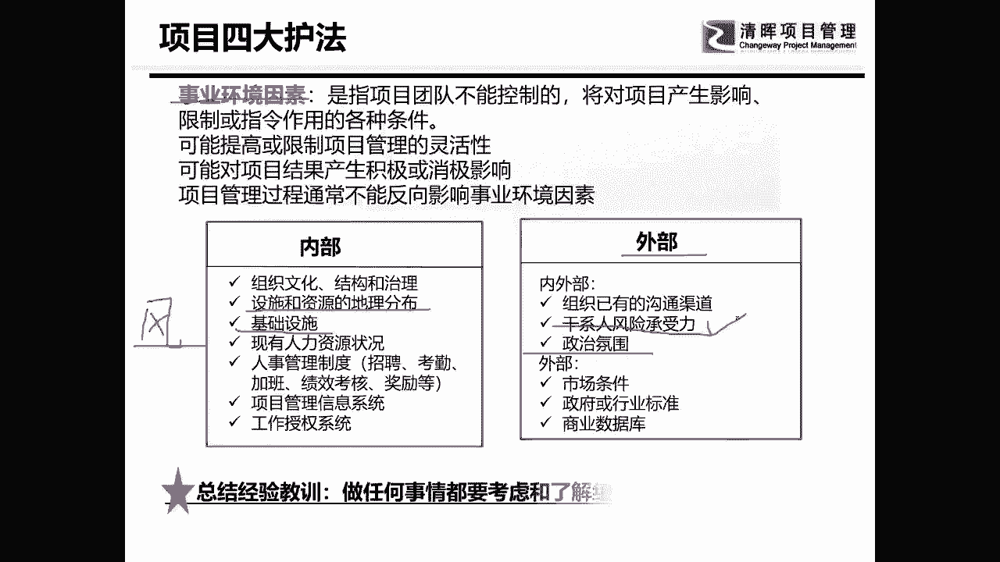
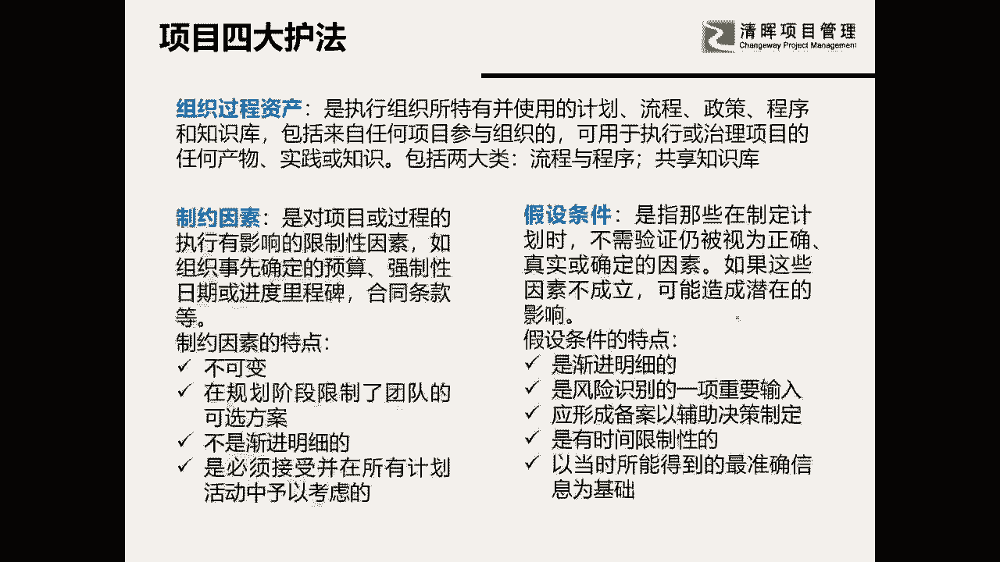
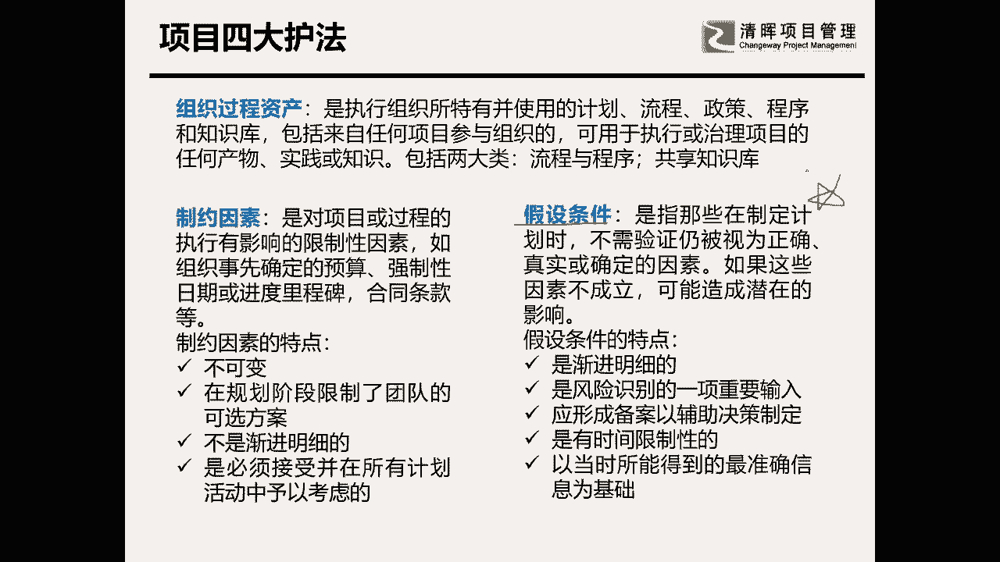
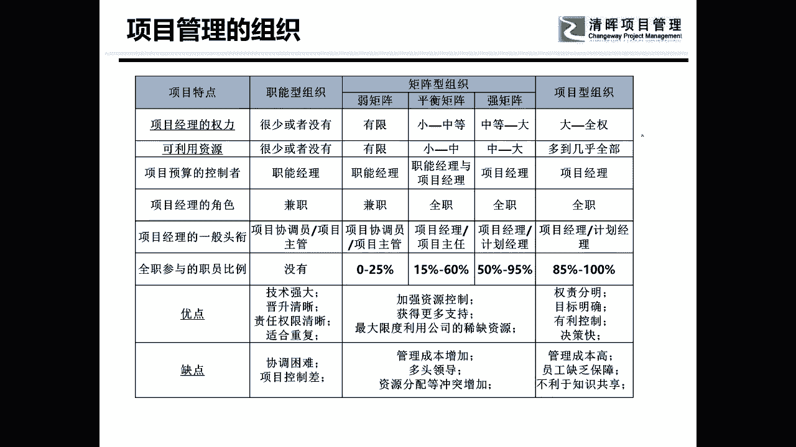

# 项目启动及主要工作 - P3：3.项目四大护法 - 清晖Amy - BV1ui421Y7xe

什么是四大护法，我们一直要来看，很多人都是偏博客学过的，他说老师不用说，我都知道为什么要看四大护法，四大护法对应了我们项目管理里的哪一个，三大维呃，思维模式里面的哪一个维度呢。

可以告诉大家对应的是风险管理，对应的是风险管理啊，对应的是我们的风险，因为你只有了解了你的收编的事业环境因素，了解了你的相关的信息，你才能降低风险发生的可能性，我们来看第一个东西叫事业环境因素。

质量环境因素大家都懂，是项目团队不能控制的，但是呢会对项目产生影响的，这个大家都理解，而且事业环境因素里，可以找到很多重大风险的源头，很多重大风险的一些源头，什么是事业环境因素，我经常会举个例子。

假设你今天在公司到家需要过十条马路，这也就是你在过第一条是马路的时候，你要左右看一看干嘛，四周看一看有没有车，然后你才能过马路，那你有没有胆子说，我在过完第一条马路，在过第二条马路的时候，你说我不看了。

因为我第一条马路看过了，所以我第二条马路就可以直接闯过去，那你狗可能会被车撞，所以事业环境因素，是一个在我们项目管理全过程，其实都应该有的一个东西，大家考过ITTO都是知道的，其实这就是最佳实践。

PMBOK里的很多东西都是最佳实践，但大家不会用，所以事业环境因素，就是大家都可以坐下来聊一聊，你觉得现在的环境状态，对我们项目现在有什么影响没有，我有的时候在开周例会的时候。

我经常会说大家认真坐下来来分析一下，因为我们会做一些风险管理的，风险的一些识别防范，第一个就是看一看周边的环境状态，来说一说政策，客户高层在所有的各方面的事业环境因素，对我们有什么样的影响。

所以这个东西是我们要去理解的，你们可以看看，我们挑一些来说一下，比如说设施和资源的地理分布，这个重不重要，相当的重要，为什么这个相当的重要，有一些设施有一些资源，它的分布地理位置就是很远的。

你就会发现它并不好弄，还有像我做过一些呃一些企业，比如说是一些工程的呃，那个设设计的那种企业，比如说你在华东地区打个桩，和你在华南地区的打个桩一样吗，不一样，土质土壤都不一样，地理环境结构都不一样啊。

我们中国人是基建狂魔，对不对，那也是你要了解每一个地方的地理，地质的特点吧，还有设施能不能运上去吧，啊这些东西都是要去了解的，基础设施好不好，有一些东西它的建设是需要场地的。

但是不是所有的地方都能够给你，提供很大的场地的，所以基础设施也很重要，人员呢各个方面重不重要，非常的重要，然后我们现在做项目，我发现我们更重要的，除了我们内部的一些东西以外，我们更要重要的要看什么呢。

是外部的，尤其是什么呢，我们来看一看，比如说你要做国外的项目，政治氛围重不重要，相当重要，东南亚地区啊，你是搞不清楚他今年是清华的，还是明年是反华的，万一一个不小心上台了一个反华的总统。

他有可能让你的项目就什么样，就没有办法继续，这些东西都非常的重要，还有一个东西其实也蛮好玩的，这个东西呢叫干性人的风险承受力，这个东西现在呢在很多的企业当中，已经放到风险管理里去，什么叫风险的承受力呢。

这个东西有的时候也是需要，我们也是可以作为一个事业环境因素放着的，也就是看一看你的容忍能程度，我记得我有一次做一个在做p mo期间，有一个项目经理啊，他都快哭了，跑过来跟我说，领导这项目我不想接。

我说你为什么不想借，他说这是一个不可能完成的项目，我一看是一个软件项目啊，那时候我做PMO是一个软件的项目，当时他要在半年之内上12个系统，而这12个系统当中呢，公司现有的系统大概只有七个。

六个还是七个七个吧，大概大概有六六，反正六个七个，然后呢有三个软件正在开发，还有两个软件连影子都没有，两个模块连影子都没有，他说半年之内上上去，你这不是玩我吗啊，我说别急，然后我们就干了些什么事呢。

我们就把所有的相关人员，我们叫干系人，对不对，所有的相关人员招在会议室召开了一个会议，我把我把签合同挖坑的那个也拉过来了，我把领导也拉过来了，我把技术人员也拉过来了，我说现在就有一个一个现状。

然后我就问那个营销的人员，我说客户你就告诉我我们到年底做到哪些系统，客户是不会跳跳脚的，也就是说这就是风险容忍度，最后分析下来说哦，客户最想要的是五个模块，也就是这五个模块呢我们要上上去。

这五个模块里有三个是我现有的，有一个呢正在开发，还有一个呢完全没有怎么办，我们定策略，然后呢这是定好策略以后呢，我们是看说我们现有的有哪些开发了，然后就问问开发的人，负责人说这个系统今年能开发吗。

等等等等，最后录下来，大概我们到年底定下来的策略是上七个系统，这七个系统里有五个系统是我们现有的，在这五个现有的系统里，有三个是他们必须要上的，而且非常重视的，有两个是添头，什么叫天头。

你不上有点难看啊，然后呢有一个系统呢正在开发的，我们就问那个开发老大说你能不能做开发，老大说开发老大在老老板的目光的注视之下呢，最后就拍了胸脯说哦，我尽量差不多能做，当时我就写下一条风险。

说这个模块可能开发不出来啊，然后概率极高，发生的概率极高，然后的话呢我们又干了个啥子，还有还有一个方块不是没有吗，怎么办，外购做接口，最后做完以后，大家知道最后的最后，最后到了年底做了几个模块吗。

做了做完成了六个，哪一个没有完成，有没有人知道我，我就剧透了啊，因为我们时间的关系，我们就直接剧透啊，哪一个呢，就是那个在开发的，就是我写下了那条严格的那个风险，所以大家有没有发现就是事业环境因素。

就是你周边的环境啊状态，它可以让你很清晰地知道，自己项目的风险在哪里啊，这个就是我们经常会做的第一个东西，叫事业环境因素，那么我们再来往后看啊。

我们再来看一看，做任何的事情，其实都要考虑些环境因素，那么我们再来看一个。

第二个是组织过程资产，组织过程资产呢它是一个双刃剑，这个大家都知道它包括两部分东西，一部分东西呢是流程制度是我们最恨的东西，一个东西呢是我们的知识库，是我们挺爱的一个东西啊。

嗯对就是那个就是我们的知识库，那么在这里你要知道公司有哪些事，是允许你做的，哪些事儿是不允许你做的，这个东西对你来说是不是风险，是不是很重要，相当重要，所以这是组织过程，资产也是你要看的。

用来查看你有没有风险的东西，第三个呢是制约因素，制约因素呢是什么呢，制约因素是天然的，是一个紧箍咒，加在你脑袋上的，是你不可以改变的，比如说主要是哪些东西，我可以跟大家讲第一个成本预算。

第二个重要的时间节点，第三个法律法规，还有质量标准，我跟你们项目管理当中，有一些东西的质量标准，是非常的非常的重要的一个制约因素，当然也没也有没有质量标准的，举个例子，本人当年做项目经理的时候。

有一个东西叫是咨询项目，大家知道吗，咨询出的东西叫咨询方案，它是没有质量标准的，它的质量标准就是干系人满不满意，呵呵所以呢你就会发现有很多啊，然后呢有什么呢，有合同条款。

而合同中的印新的规定大概七里八啦，就这些东西当然还会有一些其他的制约因素，这些资源因素有可能和事业，环境因素是放在一起的，甚至比如说某一些地方的嗯，就是天气都有可能啊，这些都是有可能的。

那么制约因素呢它天然就是风险的源头，这一点大家要了解，因此你如果能够把项目的资源因素罗列下来，我想扪心自问一下，在座各位，你们在做项目管理的时候，在项目的初始阶段，你们有没有把项目做得那么细。

我可以保证你们绝大多数没有做的那么细，所以你们最后都是干嘛的呢，都是填坑的项目经理，项目经理他就应该在什么时候呢，就是应该在启动规划阶段，好的去做好谋略，做好分析，你才是一个挖坑的项目经理。

所以志愿因素是你要罗列下来的，罗列完以后你就会发现这些东西是不可变的啊，而且呢是我的所有的计划都必须要迎合他的，所以他会不会是风险，他是风险，那么我们来讲我最爱的一个东西，四大护法当中。

我觉得他长得最美，就是她假设条件，为什么我要跟大家讲这个东西送给我们，就是现在在听课的啊，各位朋友为什么要送给你们呢，是因为这个东西太重要了，假设条件，假设条件大家看字面意思看不懂。

很多人都看不懂这个字面意思到底是什么，所以PMBOK啊，它的显性知识啊，就造成了我们看这本书怎么样想睡觉啊，就刚开始看这本书的时候特别想睡觉，假设条件呢是我们看观面的意思是认为正确的。

真实的确定的因素不需要被验证，就认为是事实的东西，听懂了没没听懂，对不对，那我帮你们翻译一下啊，我们说任何东西从字面上都解释不了，假设条件我是怎么用的，我在两种场景里会用。

第一个场景就是在做进度计划的时候，因为其实大家都会发现真正所有的计划，我们说计划很多，我们学过PMBOK，知道计划非常的多，有3+10加六对吧，那么多的东西都叫项目管理计划，但是其中有一个最核心的计划。

其实是项目的进度计划，批准了以后就要进度基准，为什么项目进度计划是最重要的呢，是因为这个进度计划是集合了所有的范围，所有的成本的因素，所有的资源的考核因素，各方面平衡，最后才会形成的一个综合性的东西。

所以叫进度计划，因此我们平时工作当中讲的计划，计划其实讲的就是项目的进度计划，你们在教进度计划给客户或给高层的时候，你们是怎么教的，你们就说我要干什么什么事，这是左边的，对不对，然后右边呢是这件事儿。

我大概开始时间是什么，完成时间是什么，是不是经常是这样子的，但是你们少了一个很重要的东西叫假设条件，你们应该如果你们PMBOK学的好，你们会发现WBS字典里就有假设条件，活动的属性里有假设条件。

什么是假设条件，假设条件呢，你可以对应到一个很重要的一个东西，很重要的东西，我们在学进度管理里面，是不是学到过一个依赖关系，其中有一个依赖关系叫硬逻辑依赖关系，或强制性依赖关系，举个很简单的例子。

你想让我明天把电脑装好，那你明天早晨必须帮我把电脑准备好，这是不是硬逻辑关系，这就是一个硬逻辑关系，而这种硬逻辑关系，往往会被项目以外的人员忽略，但它又是一个事实，大家有没有发现是这样的一个问题。

我希望你在几月几号之前，能够帮我把所有的系统都连通，那么他有没有前提条件，有你必须把其他所有的系统的接口都准备好，我才能来做联调，是不是这个东西这个东西就是一种硬逻辑关系。

是一种你在做计划的时候写下来的，但是别人往往会忽略你的，这个时候呢，如果你不把那个这个东西，就是我要写的假设条件，我会说，如果你想实现我这个工作，我有几个假设条件，假设条件一。

你必须能够在几月几号之前给我提供啊，就是呃A呃A供应商，B供应商这两个供应商软件的基础字段，那么在几月几号之前我应该怎么怎么样，那么我才能保证我在几月几号之前，能把这个活干了，这个东西叫假设条件。

所以我们在做所有的计划的时候，你是要有假设条件作为，这个东西是保我护项目经理自己的，我就告诉你，我要做这件事情，你要希望我在这个时间节点做好，是有前提条件的啊，比如说我想要进场。

帮你去构建搭建你的基础设施，前提条件是你要帮我把场地清空，这算不算前提条件算，但是很多非你项目管理，就是叫做有一个依赖关系，叫外部依赖关系，大家还记不记得，外部依赖关系就是往往是别人要做好。

你才能干的事儿，就说是你项目没有办法自己来约定的东西，自己来搞定的东西，所以我会告诉大家，做假设条件就看两个东西，第一是外部依赖关系，第二是强逻辑的依赖关系，把这两个组合起来，就是你的假设条件。

把它做进你的进度计划里，才能保护你不被并购，有很多项目经理做完了一个计划，傻乎乎的就交上去了，交完了以后更更更更做到老死，做完了以后呢，别人来告诉你啊，用户或者是客户告诉你。

他说哎你怎么做到现在还没有做好，都已经延期一个月了，这个时候你再去跟他解释说，不是啊，是因为你什么没做好，因为你一没有做好，二没有做好，三没有做好，所以我才延期的，然后你就会发现你就很容易产生什么冲突。

他会说哎哟你是想干嘛呢，对不对啊，你是跑过来跟我吵架的吗，你是跑过来推卸责任的吗，他会觉得你是推卸责任，但假设我把假设条件讲在前面呢，那就不是推卸责任，那就是告诉你你应该做好的事情没有做好。

我事先已经告诉你了，你应该要能够实现这些已知条件，我才能帮你把活给干了，这东西叫假设条件，假设条件一旦不被实现，它就是风险，大家有没有听明白，这是我的第一个用法，也就是在规划阶段的。

在过程当中其实也有很好的用法，我来告诉大家另一个实践啊，所以你会发现PMBOK里的每一个工具，其实都有用途的啊，都是有用途的，都是最佳实践，那么第二个用途是什么呢，是我在日常工作当中。

别人是最怕的就是什么呢，就是变更，对不对，最怕的就是客户或者用户跟你说提条件，我是最不怕提条件的，因为为什么呢，你能跟我提条件，就证明你有漏洞，我就能够攻击你。

