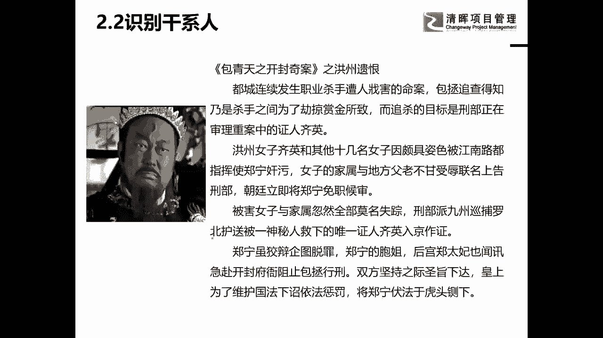
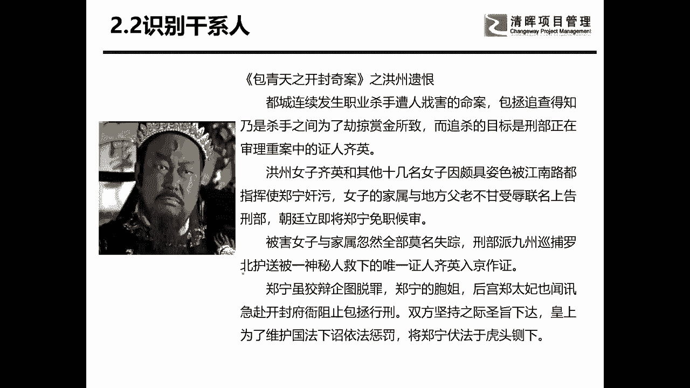
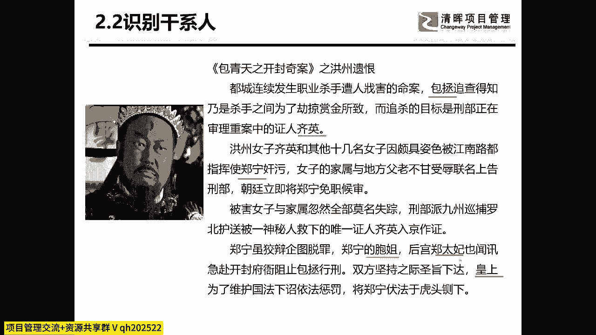
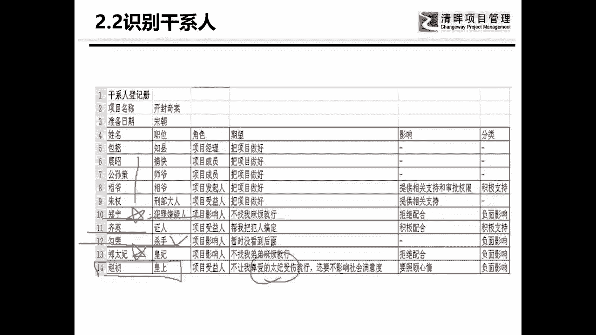
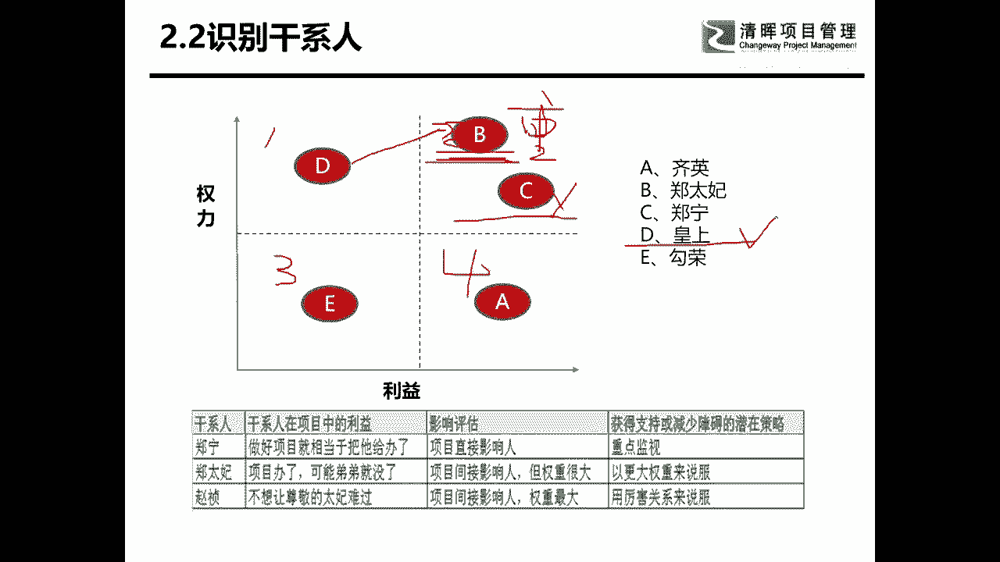
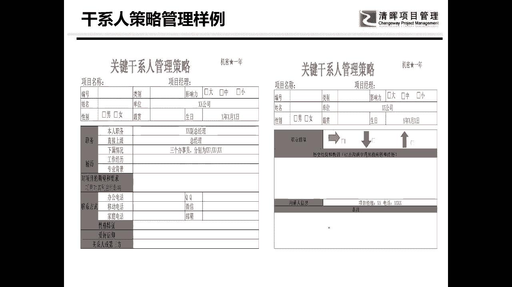
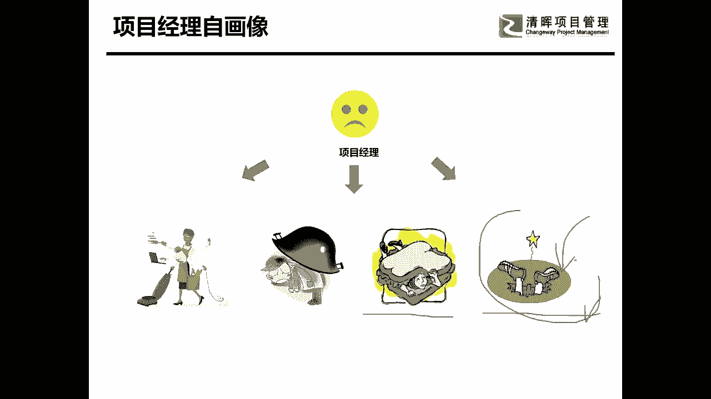
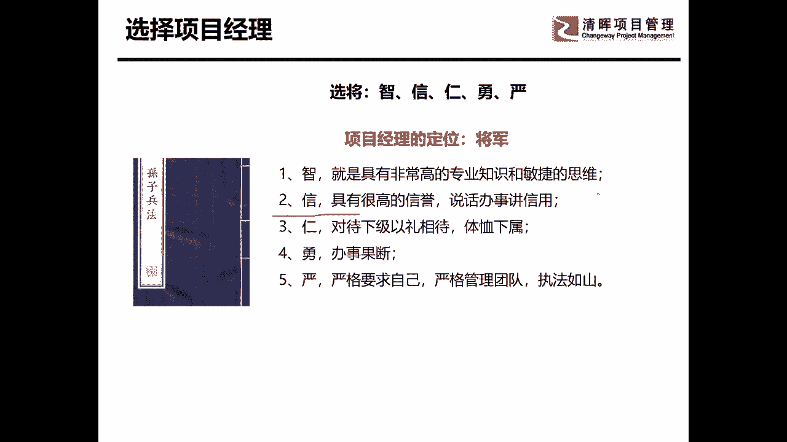
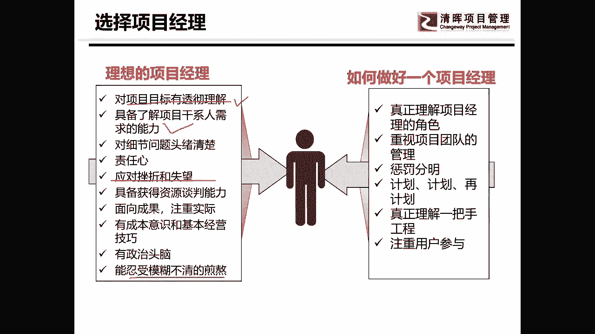

# 项目启动及主要工作 - P5：5.识别干系人 - 清晖Amy - BV1ui421Y7xe

可以了。

我们来再玩一个游戏，再玩一个游戏，玩一个什么游戏呢，我们来看一个电视连续剧啊，叫包青天的开封奇案嗯。

开封奇案，他那是讲的什么呢，这是呃洪州遗恨，他讲的说，在我们的呃都城里，发生了一个职业杀手黑吃黑的事件，就是职业杀手他们之间互砍，然后呢最后呢包拯就去查原因，他说呢他们都想，原来他们是因为要分配赏金。

每个人都想把那个一个人叫齐英这个人给杀了，而因为杀了他以后有重赏，但是呢因为杀他的人太多了，重赏嘛，对不对，杀他的人太多了，他们自己先内讧了，那么起因呢他是干嘛呢，他要去告状，要告一个谁呢，叫镇宁。

镇宁呢，自己是个大官，然后呢他无恶不作啊，所以呢呃受伤受害人起因呢，他就想去开封府包状，然后呢这个证明很厉害，他最大的问题在哪呢，他的后台呢就是包姐郑宁的姐姐啊，包姐其实是指同父同母的意思啊。

包姐呢是宫里面的正太妃，郑太妃呢，他是一个，他是谁呢，他是把皇帝养大的人，虽然不是亲妈，但是也是皇帝的妈妈，因为她从小就把她养大的嘛，那皇帝对她的感情其实很深的好，现在我来问问一下大家，我们开始互动了。

同志们，你们告诉我在这个项目当中有哪一些干系人，然后呢你们再想一想，皇帝想不想把这个案子秉公办理，就讲这两个问题来帮我写一下，我们互动一下，在这个过程当中有哪一些干写，来互动一下，来看一下，徐英很好。

抓了一个来这么多人呐，皇帝嗯，这个这个底线思维很厉害啊，他抓了个最关键的，因为最后能不能咔嚓掉，看皇帝的嗯，皇帝郑太妃晋宁啊，对包姐哈，那个包拯好挺好，终于有人把项目经理给抓出来了。

女子家属哎你你那扩散思维太大了对吧，我是不是应该问你项目经额，项目成员的老婆算不算干系人对吧嗯好，基本上大家有点有点了解了啊，差不多啊，我们来看一下，有好多人这个不准项目经理很重要。

第二个基因八人百也就好多人，对不对，然后呢，还有谁呢证明那坏蛋是吧，后台皇帝啊，皇帝想不想停工办理，我可以告诉大家，皇帝不想，因为什么呢，中国人叫情理，社会情大于法，你没有发现啊。

外国人大家有没有发现外国人是不敢违法的，你跟他说，你违法了，他会吓得脚都抖，但是你要跟中国人讲，你违法了，他会两眼一斜看着你，我违法了吗，你有没有发现是这样的一个问题啊，所以中国人一直都是情大于法的。

是皇帝呢，其实他从心里是不想把这案子给办了的，因为呢他不想让他的妈妈伤心，真是这样一件事，好把人找出来以后。

我们得干啥，我们得做一张干系人登记册啊，我们要给他做一个干系人登记册，对他不小啊，干性人登记册啊，里面有一堆的人啊，就是那个包拯啊，对不对，项目经理啊，剩下这些人叫项目成员阵营，那坏蛋啊，郑宁呢。

他肯定是拒绝配合的，我在这里想告诉大家一个很重要的信息，为什么我举这个例子，你要知道在你做项目的时候，并不是所有的干系人都是你能够争取回来的，当你已经冻到了他的核心的利益和奶酪的时候。

他永远都是你的敌人，你要把这样的人给找出来，并且你不用期望的把这样的人，能够把这样的人怎么样让他赢得，那我们项目管理里老师在讲说嗯，我希望通过一定的方法和策略能够让他支持我，是不是这样，但是你们要知道。

在这个世界上是总有一些人，他是不会永远都不会支持你的，这样的人你是要把他找出来的，包括谁呢，郑太妃啊，正态分也是不可以的，然后其因呢他是那个他是那个叫谁啊，他是那个受伤害的人告状的人，但他是很重要的。

为什么呢，如果他这个案子办不下来，他就会被那个郑宁给杀掉，所以这件事对他很重要，光荣是谁，一个杀手先呢先不相干啊，他在旁边敲敲敲锣，打打鼓的最最核心的是谁，最最核心的是他皇帝，但皇帝想不想皇帝呢。

不想让自己的太妃受伤啊，这个很重要。

所以的话呢我们再来玩一下，来我们其实这是一个互动游戏啊，其实我的所有的课都是互动的，因为我们远程的话呢速度就会有点慢啊，嗯就是超出了我预计的时间范围啊，好我们来看一下。

大家来告诉我ABCDE分别在哪个象限，权利利益方格会玩吗啊，来你们自己告诉我A是哪个象限的，这样吧我们定义一下啊，这是第一象限，这是第二象限，这是第三象限，这是第四象限，好这么画，明白了呗。

好我们说一下，我们分别的来写一下，每个人可以只写一个啊，但是大家来告诉我ABCDE分别在哪个象限，DB是几，A是四，A在四对往下你们分分嗯，你就努力一点，后面还有呢不要只讲AABCDE对的，A是什么呢。

权利相关度很高，但是怎么样利益啊，就是啊利益相关度很高，但权利很低，是不是因为他要做的不好，他就被咔嚓掉了，那个D是一对的，没错，boy呢boy是二对的，权利很高啊，地也很高，为你一不小心就把皇帝啊。

就把他弟弟给咔嚓掉了，是不是也很高好，我怎么就没见到C呢，啊我看到有人写C了，C是4C3是，A是三，A不是三勾，容是三啊，第皇帝怎么会是二呢，好吧我们我看到C的人很少啊，C而且写的大家要知道啊。

振宁是三啊，振宁怎么可能是三，权利不高，利益也不高，证明他自身就是一个大官，而且这件事跟他关系大不大，相当的大，是不是相当的大，所以它也是和北是一样的啊，他也是权利利益相关度很高，叫什么叫重点管理。

大家还记不记得这个东西叫重点管理，重点管理他们，但是并不代表我一定要迎合他们啊，对的皇帝呢权利很高，但利益程度并不高，他唯一相关的利益程度在这里啊，他不想让他的妈妈伤心，对不对。

所以呢他其实并不支持这个项目好，还有一个是E啊，义呢就是当官在旁边敲锣打鼓的啊，就是平时有事没事跑出来骚扰一下的一个人，那么在这个例子里面，大家就可以发现啊，我们其他人都不说。

我们来看这里面最重要的是哪几个人，C要不要关心C，不用关心C，就是要把他看牢了，不能让他跑了，但是正太妃很重要，但是正太拼赢不了他，那你怎么你唯一的策略是什么，你对付正太C唯一的策略，大家想想是什么。

对付正太费的策略是什么，这大V已经很很大了，有人想明白没，OK这啊，这样吧啊我们因为时间的关系啊，我们就大家可以自己去了解一下，用更大的权力压制他，因为你根本就没有办法把他拉回来。

你只有用最大的权力谁呀皇帝，那么皇帝这个事情就很大了，皇帝其实并不想并不想办这件案子，那么你能够说服皇帝的是什么，还记不记得我们一开头讲干宣的时候，说是一个利益交换的网络，社会压力很厉害，很多人很厉害。

他不是社会压力是什么东西，让他觉得呃牵制皇帝，我告诉你，皇帝是一种心心理，心里的那个其实很变态的一种呃，他是认为我是最大的啊，你还想利用啊，你只有吸引他，但是天下所有的钱，所有的土地，所有的人都是他的。

在利上面他没有办法吸引他，在这世间除了利，还有一个很重要的东西是什么，和利连在一起的，这世间有两个东西，一个叫名，一个叫利，在历上，皇帝没有办法打动，对他说，皇帝也不是明星，他是说皇帝你想不想做明君。

舆论都没有用，如果他不在乎舆论呢，有一些皇帝他就是暴君啊，他说我就唯我独尊世间，我最大，他就不需要舆论，他想要的是一个满足于自我的那个皇帝呢，当年还很年轻，他想做点事，所以呢他希望做明君，就是明星。

明就是就是你们说的舆论，就他想要这个舆论，所以这个舆论对他才是最重要的，因此的话呢他就跟他皇帝说，想不想要，你想不想要做明君，对名和利，这是所以说它是不是利益关系啊，我讲到这了，不能再往下深入了。

深之上的东西，大家可以自家回家再去考虑一下，对于肝肾人管理当中的有很多的，其实东西我已经在这个故事里，其实我已经隐喻了啊，大家可以去想一下是不是这样的一个东西，明暗和利呀，对不对。

所以呢这个东西呢就是他的策略，所以他就定下来的策略就是镇宁重点监视，找谁呀，展昭看着他，别让他跑了，郑太妃呢你也不用说服他了，就找皇帝压他，也只有皇帝能够压他了，那皇帝怎么办呢，你就告诉他。

你想不想做明君，如果你想名垂千古，作为一个明君，因为大家都知，皇帝自己也知道自己不可能万万岁，但是他想把他的名留下去啊，这就是他的想要的东西，每一个人有他自己的诉求，你真正能够掌握了别人的诉求的话。

有很多的事情就会很好办啊，我们就讲到这里，人是一个很敏感的东西啊，我们能讲的就讲到这里。

做完这个以后呢，我们就可以做很多的啊干系人的一些策略等等，呃很多的策略呢我们在这其实没有讲，在这种表格里我没有讲的太多，但是呢呃嗯我们做策略的，其实前面其实还是很多的分析啊，很多的分析。

这是我曾经以前做过的一种，嗯啊这个还不一定是啊，但是呢甚至我们会分析一些干系人，在这个公司里的一些职业的前景等等啊，然后呢你跟他日常交往过程中，遇到过的各种问题，以及呢最后做一些策略啊。

这些东西呢大家都比较比较重要啊，比较重要，所以呢这就是干系人的策略啊，大家了解一下，这就是在启动的时候必须要做的，并且在日后日日常的工作当中也是要去做的，大家有没有发现，坐在前头一定比坐在后头要好很多。

等到他他已经看你不顺眼了，你再去做就没有意义了啊。

啊我们讲干事人呢还得讲一个东西叫项目经理，项目经理呢我给了他四幅自画像啊，这个东西大家了解一下，看一看就可以了，第一个呢是什么保姆，大家有没有看明白，第二个是啥背锅的，第三个呢三明治，第四个呢填坑的啊。

这是我我给项目经理的四幅自画像啊，是不是挺像的，对不对，那么我们所主要今天就是讲，你怎么才能不这么惨啊，不这么惨啊，你填坑填进去了，也许是一个无底洞对吧，你填进去了也没有用。

有很多项目是填了无数的项目经理进去啊，来一个走一个，对不对，这呢是项目经理，那么项目经理到底应该做什么呢，很多人呢就是项目经理啊。

我认为啊项目经理，如果你想做一个挖坑的项目经理，那我讲的高大上一点，我认为项目经理是将军，将军是有谋略的，所以我呢选了孙子兵法里选将军的，像选将的一个方法叫智，信，仁永言智，就是你要有智慧啊。

你要有智慧，你要有非常高的专业的知识，思敏捷的一些思维方式，你要去懂得怎么挖坑，信呢就是你要说话办事要讲信用，你说你一个项目经理，你要是答应的事儿，你最后都能实现，别人是不是比较信服你。

我现在到现在我做事都是这样，我要么不答应，我要是答应了你，我一定会做到，我答应了你，今天干完，我把这活干了交给你，我晚上12点我也会把它交给你，因为你只有有信用了，有信誉了。

别人才会真正的相信说嗯你是一个靠谱的人，你是一个能把活干好的事情，但是你要能讲信用，你也要有智慧，你没有智慧呢，就比如说刚才我们讲的那个假设条件，如果你不会用那个假设条件。

你傻傻的去交了一个进度计划以后，你就会发现你是一个不讲信用的项目经理，因为最后把活给干砸了以后，别人是不会说是因为我这个没做好，那个没做好，他一定会说你的项目没做好，你答应的时间节点没有实现。

是不是这样，所以要有智慧，要讲信用人呢，他主要讲的是什么呢，其实讲的是换位思考，就是一个项目的一个将军，他要能够站在别人的角度来考虑这件事情，当我换了一个角度的时候，我们来看一看这个人。

他到底在项目中的期望和诉求是什么，也要知道一下自己的团队成员的期望和诉求，勇呢很重要，叫做办事果断，勇敢果敢，啥意思，我看到有很多项目经理真的唯唯诺诺，真的就是俯首甘为孺子牛，客户说啥是啥。

客户要是有个意见啊，就吓得腿都抖，何苦呢，人和人是平等的，对不对，所以但要以理据争的地方，一定要以理据真，该划出底线的地方，你一定要告诉对方，这就是我的底线，我可以告诉你，你的无谓的退让。

其实就是让别人不断的进步，所以项目经理他应该要有永远应该要果敢，而要果断严，就是严格严于律己，说句很难的话，我看到有些项目经理说啊，我们的团队成员你们都要认真干活哦，每天准时上下班。

然后自己呢穿这双拖鞋十点钟才跑过来，你觉得他能管理团队吗，他要管理好团队，他一定也是要有规范，有规则有规矩的，所以质训人永言是我觉得选项目经理应该，而且是项目经理应该具备的五个条件啊，了解一下。

然后呢这项目经理应该做点啥，这个图大家看看就可以了，嗯我里面呢不讲太多，因为今天我们互动啊，互动的速度有点慢对吧，所以我们的时间节点会有点慢，我们应该到09：30结束啊，就是一定要有没有目标感啊。

一定呢要有能够了解，肝系人的期望和需求的能力啊，然后呢要能够忍受挫折失望，忍受那惊魂模糊不清的一个煎熬，我可以告诉大家，有很多项目做在过程当中其实是非常煎熬的，因为你看不到希望，对不对。

所以你的承压能力要非常强，你叫逆商啊，这些东西呢大家了解一下选择项目经理，最最好的项目经理是什么样的，仁者见仁，智者见智，但是我给大家一个定义就是什么呢，一个好的项目经理。

一定是在启动和规划阶段好好干活的人啊，努力在启动和规划阶段，努力干活的是一个挖坑的项目经理，如果是在执行和监督阶段，在努力干活的人。

那就是一个填坑的项目经理。