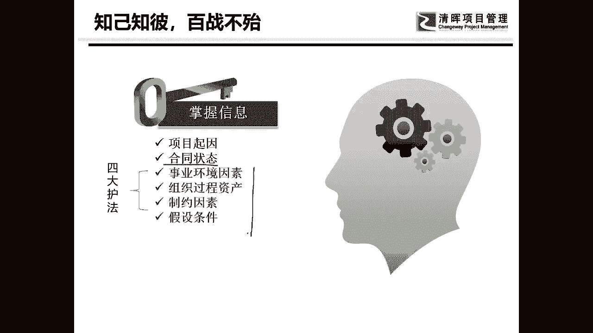

# 项目启动及主要工作 - P1：1.项目启动及主要工作 - 清晖Amy - BV1ui421Y7xe

那我们来看一下启动，那我今天要跟大家讲的这个启动呢，是一个我自己啊做了十多年的项目啊，然后呢我自己总结的一些想法，今天呢主要是跟大家聊一聊，天，都12月底了，对不对，大家也好不容易要轻松一点。

其实挺难的，因为项目经理有很多项目经理，特别是软件行业的项目经理，12月份是最忙的啊，但是呢我们好歹的放松一下，不以学习知识点为目的，以学习啊，最佳实践为目的的方式，来听听我们今天要讲的内容。

我们常规来说项目启动是干嘛，这个大家都懂，一确认项目是怎么样是被许可的，第二任命项目经理，然后呢干嘛呢允许他使用公司的资源啊，这个呢是项目管理启动的时候，我们最常做的一件事啊，这就是项目启动。

但是我们真的项目启动是这样的吗，我们在做事情的时候，前后是延续的，因此的话呢，我给大家总结了一个，我认为比较相对比较实践的，什么叫实践，实践就是说它不是一个法律法规，它就是一个实践。

告诉大家在这个启动的过程当中，我说的这个启动其实是包括了规划的，但是我今天不以做计划为主啊，而是以做启动为主啊，来讲整个一个项目它在启动啊，他在做执行之前，他应该怎么玩儿，首先第一个点。

我们当然说并不是以项目正式成立为边界的，我们要想一下项目在做之前你应该要干什么，你先要确认一下这个项目它值不值得做，也就是说这件事是不是正确的事，这东西要不要做，在做这个事情的时候呢。

我要告诉大家有两种呃，因为我做过甲方，做过乙方，你如果呢就是甲方的项目和乙方的项目，大家知道什么叫甲方的项目和乙方的项目吗，比如说我公司里想干一件事，想造一个厂房，那么这个组织他想要造的这个厂。

想造厂房，那么这个组织就是甲方，他呢可以自己造，当然了挺难，第二他可以找乙方帮你造，那么乙方跟你签了合同之后，他是不是也会有项目，所以其实项目管理啊，他是分甲乙方的哦，他是分甲乙双方的。

因此我经常跟人家开玩笑说啊，我有我有一个课程，一个课程呢是甲方项目经理应该怎么管项目，第二个呢是乙方项目经理应该怎么管项目，人家说这还要分吗，当然要分，你怎么能不分呢，你不分你就做错了哈哈。

甲方和乙方他的管理的呃大方向是一致的，但是里面是有区别的，我记得曾经有一个有一次有一个公司他跟我说，他说那个张老师，他说你能来帮我上一个项目管理的课吧，然后我就问他，我说你上这个课的对象是谁。

你看我问的是人吧，结果他说嗯他说我们公司啊，我们公司自己是承接项目的，但是呢我们会把这个项目呢因为外包给别人做，所以呢他说我希望你帮我培养的这个对象，里面呢有包括自己公司的项目经理和呃。

就是那个外包的项目经理，我说这个就挺难办的，我说你要么呢就是甲方的项目经理，我就告诉你你甲方怎么对付乙方，那要么呢你就是乙方的项目经理，我就告诉你乙方应该怎么来迎合甲方，那你把甲乙两个一起放在一起。

让我上课，那是不是意味着说我只能告诉大家，你们应该怎么配合嗯，所以大家就会发现，就是甲乙双方的角色不一样之后，你会发现他们的做事方法也不一样，那么如果你是甲方的甲方的项目的话呢。

那么你就必须做一个非常严格的，项目的可行性研究，来分析一下这个项目的启动，它对你的公司的战略和目标到底有没有价值。

这个呢叫项目的可研啊，我可以给大家看一下，这首是项目可研的一个比较常规的一个流程啊，这事我想做一件事，老板领导，甚至有的时候就老板领导自己想做一件事，然后呢我要去做项目的可行性的研究。

这里面会有很多细节，我们今天就不讲这东西啊，我们只是告诉大家，他可能要做这个，然后要申报。

有可能是要招标，那么在可行性研究里面他会研究什么呢，可能会研究可行性研究的一些报告，和技术的可行性啊，啊经济的可行性运行，其他等等，其中最核心的是哪一块，是经济可行性研究，也就是说这项目赚不赚钱。

或者说这个项目未来我们能不能让我赚钱，就是这些东西，这是我们常规组织里经常爱做的一个东西，所以呢叫经济可行性研究，我们再拉回去看啊。

这是甲方的，那么如果是乙方呢，乙方在甲方做完研究，认为这件事可做的时候，甲方有的时候会去找乙方，对不对，这个时候我们就会去做一个叫合同签订，那么在合同签订的这个过程当中呢。

我们有一个最佳实践是我经常会讲的，那就是什么呢，叫项目经理前置，我们都知道项目经理应该在什么时间节点啊，他在项目呢启动用钱，他就可以介入了，这就是一个最佳实践，我现在见过越来越多的企业。

在合同还没有签订的时候，就让项目经理就已经任命了，潜在的项目经理进去干嘛，辅助合同的签订，因为你在合同签订的时候，往往你会遇到很多什么东西，我们讲了三个思维中的哪一个风险啊，我们就会遇到项目管理。

因为我们很多人都是这样的，有有没有做过乙方，做项目经理的，天天在那抱怨说哎呀，我们的销售都不知道吃啥的，签回来，这种不平等条约啊，现在让我来填坑，有没有非常的多，对不对，所以的话呢项目经理前置是可以。

我们做的一个很重要的一个实践，项目经理的前置还有一个什么好处呢，他可以去跟人家谈判，在我们项目管理当中，我经常会提倡一个思维叫量化思维，什么叫量化思维呢，量化思维其实就是告诉大家，你能不能把东西量化。

我记得我以前是做企业管理咨询的，我跑一个企业来说，唉，我来帮你做企业管理咨询哦，好但是我帮你做的时候呢，啪报了一个说我需要大概500人天，或者是800人天，甚至有上千个人填，说是剩这么多时间吗。

当然我这是有点夸张啊，但是几几百个人填，那是必然的，而且你要知道做咨询的话，费用很贵的，一天都不是一个数，对不对，因为几个人一起去做几百个人一天，那是很正常的一件事，而且经常还不一定做得够。

但是客户就会说这么多人填，我不去干，但是如果你有项目经理，在，他会告诉你在哪一个阶段，在哪一个地方，我需要多少人去到什么样技术的人员，需要做这个事情做几天，如果他能把它量化了以后。

你就会发现客户很难跟你讨价还价，所以呢合同签订的时候可以有一个啊，那叫做任命项目经理，而不是任命项目经理，就是潜在项目经理的介入，还有那么我在这呢还设计了一个东西，叫项目交接。

因为这个流程其实是我自己在做PO期间啊，我为呃很多的项目经理所做的，一个很重要的关键节点叫项目交接，为什么呢，当如果你项目经理他自己不能够前置的时候，有没有有些企业就是这样啊。

项目经营额销售人员在前面啊，就是营销部门的人员在前面把合同，把东西都都都做完了啊，然后都做完了以后呢，他跑过来跟你说啊，这个东西你项目经理要开始做了，怎么做呢，他前面挖了个坑。

然后就让你项目经理干嘛填坑，那这个时候我们就需要有一个东西叫项目交接，来你前面的人帮我讲清楚，你到底给我挖了多少坑，你能不能让我填坑也死的明白一点，对不对，而且如果你填了坑。

你要告诉我你我能不能把你拉着一块填坑啊，有的人就是拍拍屁股就想走人，对不对，所以呢在这儿可能会有一个项目交接，大家有没有发现这个是甲方的，这个呢就是乙方的项目经理，他有可能会走到的流程啊。

然后呢我们就假设这是项目边界，其实真正的项目边界应该在项目立项确定以后，才算是项目真正开始了，但是我们做项目不是这样，首先我们在企业当中，一般来说任命一个项目经理的话呢，他有可能在立项会还没有开。

因为立项会往往是项目经理来组织开的，所以这时候呢就会把潜在的项目经理呢，先任命了，但这可能不一定是一个正式的任命，只是说公司的高层或者是领导跟你说，哎这个项目归你了，然后这个项目经理就很苦逼的。

会干嘛呢，他就会去做很多的了解很多的事情啊，就会做很多工作，做哪些呢，我们可以看一下，第一个了解需求，明确目标，首先项目经理他应该明确，知道自己想要的东西和目标到底是什么，这一点是非常的重要的。

第二呢收集项目的相关信息，大家要知道，有很多东西你是不可以只看一个点的，你要去看面，我们说我想了掌握或了解一个事物，它到底长什么样，有的时候怎么样，近观看不到，是不是要拉远一点，看看什么全貌。

而且呢要去看一看周边的环境又需不需要，所以他要了解项目的生存环境啊，项目的各方面的这种信息，然后的话呢他要去分析人，但有没有发现我这个分析人呢，我们待会后面还会慢慢的去讲。

我在这里呢会讲一个隐含在这里面的东西，叫高层理念的宣导，很多人在问我，这是啥啊，曾经有人就问过我，他说这个到底是什么，这个是什么，也就是说大家有没有人知道项目经理，还有一个人叫发起人。

他们两个其实是有一个东西有个义务的，当他们明确了或者是规划了，确定了项目的目标之后，他们有义务去干嘛呢，营销自己的项目，有很多的项目经理就会告诉我说，唉领导这个项目嗨太难了，这个项目太不好做了等等等等。

但他们不会去卖他自己的项目啊，他要去想办法把目标和什么和公司的战略啊，和公司的战略要干嘛要挂钩，然后呢，要告诉你周边的所有的，跟你这项目相关的一些高层，跟他们说，我这个项目到底在公司和组织里。

是多么的利国利民，而我们的这个项目到底有多重要，做完了以后我会怎么怎么怎么样，其实有点区别是什么，领导力，大家有没有人学过，其中有领导力，其中有一个我最喜欢叫他叫什么，叫画大饼的能力。

就是你得给人家画一个完美的美好的远景，你要告诉人家，你的项目是多么的重要，并且呢你甚至可以广而告之，因为有很多项目是什么临时性的，项目是临时性的，一次性的，甚至是悄悄的，什么叫悄悄的。

有的时候你把项目都默默事儿都全部都干完了，公司里很，组织里很多人都还不知道有这么一件事儿，所以你得不断地广而告之，让人家知道对你的这个项目要有个印象，这样的话，未来不论是分配资源还是考虑什么的时候。

他都会去考虑说哦这个项目还是蛮重要的，哎不行不行，我还是要给他留点东西的啊，留点资源的，或者是我在某些决策上，我应该要偏向他的，所以很多的项目经理呢他的一个姿态就不对，有的项目经理就天天躺在那地上躺着。

在那哭，向大海说，这个公司不给资源呢，公司不支持我呀，但你自己干了什么呢啊，你自己有没有做什么事情，而你有没有去跟公司的领导说，哎呀领导啊，你看一看我们今年公司的账，上半年的指标压力有多大呀。

我现在这个项目做的非常的大，我这个项目大到可以占我们公司战略的多少，1/5呀，啊你看人家重不重视你，所以呢有一个很重要的一个潜在的一个啊，小的一个东西叫什么呢，高层理念的宣导。

你会发现好的项目经理他接到一个项目以后，他从来都不是什么在那吭吭吭干活，有的很多项目经理闭门造车呀，拿到一个项目干嘛，开始做计划嗯，然后呢做完计划以后，他就觉得别人都能理解他，谁告诉你，别人都理解他。

你都没有，广而告之，为什么要有广告，这个世界上为什么会出现广告这种东西，那就是因为你需要做高层理念的宣导，广而告之，了解大家都让大家都了解你的东西是有多好，有多香啊。

然后呢别人才能会在心里面慢慢的会偏向于你，把这些活都干完以后，其实因为这里面应该还有很多的事啊，我这里面没讲一个东西，就是风险，对不对，等会我们来讲啊，就是风险，还有呢我们就要开一个项目的立项会议。

项目的立项会议是非常重要的，立项会议和启动会议它可不是一个会，然后呢我们就会去做所有的各种计划，做完了以后，我们呢才能开启动大会，这个就是项目启动的流程，大家看到这个流程有没有还是没有太大的感觉。

但是我可以告诉大家，在这里面会出很多的事，项目呢我有一句话叫做，不是在结束的时候失败的，我是从一开始，我就只能知道你到底是成功还是失败，我就看你项目经理在启动的时候，你在干什么，我一直都讲项目经理呢。

他是什么呢，我把项目经理分两类人，一个就是很多听过我课的人都知道，我有一个挖坑理论，对吧啊，这个挖坑理论不仅仅是用在那个啊，我那个PMP考试的啊，这个挖坑理论我最开始用的时候呢，是用在项目经理身上。

我说项目经理就分两种，一种叫挖坑的，一种呢叫填坑的，什么叫挖坑呢，什么叫填坑呢，还需要我说吗，嗯不需要了吧，挖坑的项目经理就是说他有谋略的，他会有方法，有手段，慢慢一步一步的拉着别人把你往里面引的啊。

然后最终呢实现自己的目标，而填坑的项目经理就是救火大队队长，这儿出了问题，我扑过去，那出了问题，我扑过去啊，没有方法，没有思维好，我们往下看啊，那么在这里的话呢，我们把一个简单流程稍微讲一下。

那么这个流程只是一个最佳时间，不代表呢它一定是完美的，一定是正确的，它在某一些时间节点它是比较好用的啊，但是呢具体的，我们每一个人都要根据自己的实际情况，最后来决定他应该怎么玩。

那么可行性研究呢，说句实在话，不是我们项目经理能干的，我们项目经理唯一能干的就是吆喝，啥意思呢，就是告诉你把风险灌输在可行性研究里，可不可以可以啊，是可以的，我经常就干这事儿啊。

然后的话呢还有可行性研究，乙方能不能做一样能做乙方的可行性研究。

不做这个啊，经济可行性研究，我在第一家做PO的，第一家公司做PMO的时候，我们当时PO部门就负担着一个非常重要的责任，就是合同的收益的审核，因为我当时第一家的PMO公司，是乙方为甲方服务的公司。

乙方为甲方服务的公司的话呢，你就会知道它是通过一个个合同，最终呢怎么样，每一个合同，最终呢他能够赚钱来实现公司的战略目标的，所以当时我们天猫整个部门的，最核心的一句口号。

就是我们要确保每一个合同都是赚钱的，看明显吧，觉得这个有点挺赤裸裸的，对不对，但是我们的目标非常清晰啊，所以有的时候我们说喊个口号还是蛮有用的，为啥口号就是目标啊，哈口号就是目标。

所以呢我们经常就去做一些经济可行性分析，就是分析每一个合同拿过来，而且我可以告诉大家，在合同还没有签订的时候，我们就开始去做了，去看这个合同赚不赚钱，那如果合同不赚钱呢，对不起，PMO呢没有权利说NO。

但是PMO可以做好分析，上报老大啊，由老大来决定这个客户是不是战略客户，如果是战略客户呢，他就会变成战略项目，什么叫战略项目，在我们的第我第一家公司的时候，战略项目就是第一只投钱没收益的。

第二亏钱的项目都叫战略项目啊，然后呢我们再来决定他该不该做啊，所以呢这个东西就是经济可行性研究啊，经济好。

我们讲到这儿，我们来我们歇一下啊，我们来讲一个小故事，也不是一个小故事，这和我们要互动了，各位呢我们我看了一下，我们在线的人还是不少的，那希望大家能够呢嗯跟我互动一下，我们现在有一个小游戏啊。

现在假设世界要末日了，然后在座各位，你们就是上帝啊，你们就是上帝，然后呢你们呢也没有见过这些人，但是呢现在有诺亚方舟，诺亚方舟呢它能够上三个人，他只能够上他在上不同的物种，大家想一下他的目标是什么。

我已经在提示大家了啊，他的目标到底是什么，然后呢现在是这个，这里呢只能上三个人啊，只能上三个人，那么我想问一下的就是你们作为上帝，你们没有见过这些人，你们就从这一张清单上，你们觉得上哪三个人会比较好。

然后呢你们觉得你们的理由是什么啊，来我希望看到大家跟我的互动，我给大家一定的时间啊，来看一看，来来来互动互动，警察孕妇少女理由是什么，给点理由，警察是什么比较强壮，怀孕的妻子是吧，少女。

你妈告诉我诺亚方舟的目的是什么，只有一个人回答我吗，啊慢慢多起来了，老师老师的妻子，少女僧侣，小说家125，男性歌手五花八门是吧，你们的目的是什么，你们告诉我这项目的目的是什么，而孕妇可以繁衍后代。

小学老师老师妻子少女繁衍后代，其实你们的目的都分析的非常清楚，为什么诺亚方舟要上这样的人，是因为要物种的延续，我们不考虑他的真实可靠性啊，三个人上去绝对人类要灭种的啊，这是绝对繁衍不出来了啊。

所以的话呢大家就会发现，其核心的目的是为了人类的繁衍，人类的繁衍首先必须要什么，其实我们做这道题的答案啊，大家在座各位，我来再仔细瞄一下，看看有没有人给出正确的答案啊，有没有正确给出正确的答案。

我再瞄一下啊，看一看小孙老师想要去上选择的是最多的，嘿嘿好，首先第一个目标大家都其实明确了，但是如果你明确了目标以后，你就会非常理性的发现，如果你想要人类的繁衍，必须得什么一男一女，是不是这意思。

大家有没有发现好了，就从来很多人开始啊说警察正义感啊，身体素质要强等等等等，对怀孕的妻子肯定是必须选的一个人，那相对来说比较好的答案是什么，我开始呃，我开始揭露了啊，真是还文化呢，一共就剩三个人了。

文化啥呀，次序啥呀都没了，比较好的答案来告诉大家，第一小学老师怀孕的妻子，第二个12岁少女，第三个流行男歌手，我的声音一直有问题吗，我怎么总总是看到有有人说嗯声音有问题吗，要帅哥美女才行对吧。

来额如果声音和PPT，这没有问题的，给我打一个一打一个加号呃，打个一，我这儿的网速是非常好的哟，大家看到了吗，你们已经开始暴露了，你们在项目管理当中一个非常重要的弱点啊，好啦我们呃如果各位声音有问题吗。

没有问题我就继续了，嗯如果觉得声音没有问题的，请请请请打一，我这儿的声音一直都是这样子的，我看一下啊，问一下呃，绝大多数人还是觉得没有问题，那你们再再调节一下吧，好吧好了啊，我们就继续我们后面的东西。

我这声音是挺我我这看挺好的啊，嗯那我我尽量的不动我的脑袋啊，好那么我们就继续往下讲啊，那我太后动吗，好那我尽可能的声音不动啊，好的啊，好我们继续啊，不好意思嗯，因为我这个是麦克，没法调啊。

我也不会调这东西，因为平时都挺好好的，我们来看啊，嗯那么我刚才已经公布过答案了啊，其实是小学老师怀孕的妻子，12岁少女和流行男歌手，大家有没有发现一个很重要的问题，我选的我说过了。

你们没有见过这个清单上的任何人，所以你就会发现你会发现有一个很重要的一，大家有没有人老是把一和二选出来，我就想问一句话，谁告诉你，小学老师和小学老师怀孕的妻子是一对人，我们在做项目管理当中。

往往会犯一个非常不好的毛病，就是什么呢，叫我以为啊，叫我以为我从来不摇头，你们都是远程透视，是不是说我还挠头啊，好我们来看看啊，小学老师只是小学老师，你不能明白他的性别是男是女。

在这里唯一能明确性别性别的有几个，第一怀孕的妻子一定是女性，第2年长的僧侣其实是可以判断的，因为呃因为如果是女性的的话，应该不叫僧侣，对不对啊，但是首先第一文化，它文化上他是不会接受繁衍的。

第二是年长的好了，但是这个12岁少女是不是女性，是的，还有流行男歌手是不是男的，他是男的，其他所有的人你都不能判别他的性别，所以在这个小故事其实非常好玩，这个小故事呢在里面讲了两个事情。

第一个事情就是他非常理性，他就要告诉你，你一定要明确你的目标，你才能选对你想要的答案，这是第一个，第二个是什么呢，就是我们在这里面，我们人往往会犯一个非常重要的错误，叫我以为我经常听到我的项目经理。

或我的项目成员跑过来跟我说，老师我认为客户没有问题，老师我觉得呃领导没有意见，我说你为什么觉得是领导还是客户还是谁，明确的告诉你这件事情是没有问题的，他还说我觉得没有问题啊，我看了他的表情很愉快啊。

不对啊不对啊，大家有没有发现你不能，我以为，所以这个小故事我最喜欢拿来就是什么呢，跟大家做沟通，这里面讲了两个东西，非常好玩，但是我核心要讲的是目标，你只有明确了你这个事情的目标，你才能选对答案。

你才能做对事情。

所以呢我们来看一看，我们有一句话叫任何事情都要定目标，目标呢它是一种你对于预期结果的一种期望，而且你想实现这个目标会有很很多，我们现在是项目管理课，不是不是啊，不是什么YY的其他的课啊。

所以那个我们拉回来讲东西啊，我就看了你们的评论以后，我就我我我就打愣了啊，还我们来说下文呢事件呢都要定目标啊，那么目标呢有两种，第一种叫成果性目标，成网性的目标，就是说我最后这个项目。

我会要交付一个什么东西啊，我就会交付一个什么东西，第二个呢是约束性目标，因为你们就会发现这个项目它做好以后，你不是什么东西都可以的，你要在什么时间，什么成本，什么质量的条件下去实现你的项目目标。

所以这个呢就是目标的一个管理，而且我们在项目过程当中，要不断的定点的去检查，我们的目标有没有去实现，说句实在话啊，我们在我在做项目经理的时候，我在带领你项目团队的时候，我会定期，甚至有的时候我会呃。

在周会上，我也会问大家还有没有明确自己的项目标，甚至这个目标是非常重要的，我曾经去有以前做咨询的时候啊，曾经做过一个企业，当时呢他们的企业要做的是呃，就是企业的一个变革啊。

企业的一个变革其实是我的第二家第二家公司，我第二家公司是一个甲方公司，老板想做变革，然后呢他就发了一个文，然后呢说这个东西是要变革的，然后做这个变革应该怎么做，当时的时候呢我作为PMO嘛。

我是在那个公司也是在做PMO，当时的时候呢我们就开了一个会，然后公司里的大概是就是几大，那个副总和区域的一些呃，或者是一些事业部的老总全部汇聚一堂，当时的时候呢，我们就说你们把你们听完以后的目标。

你们帮我写下来，结果发现每个人写的千奇百怪，什么都不一样，因为他们站的角度是不一样，你们觉得这个项目做得好吗，当时老板气的脸都绿了啊，他认为他发了一个很重要的文，然后大家能够意思都理解一致。

都都能跟他保持一致的意见，结果每一个人理解出来的东西都不一样啊，哼有说要在多少年前要上市的，有说要把业绩规模做成什么样的，我说你们这儿这么多的想象从哪来的，所以其实最核心的一个东西就是要不断的审视。

首先第一要统一目标，第二要不断地去审视目标，第三个你在做的过程当中，要尝试着不要偏离目标，而且我可以告诉大家，目标管理是解决冲突很好用的一种手段，我自己在做项目经理的时候，我干的第一件事就是统一目标来。

大家先坐下来讨论一下，这个项目的最核心目标是什么，有一些项目的目标是什么，有些项目的目标是为了节约成本，在核定的成本内把活给干了，获得多少多少收益，有一些项目的目标不是这样的，有些项目的目标是。

而我要赢得客户的满意，以争取下一个更大的合同，有没有，所以你就会发现不同的和呃项目啊，他的目标是不一样的，如果你是想让客户满意的啊，热了就是要想让客户满意的，那怎么地啊，你这个时候有可能会不计成本。

因为这是个小项目嘛，我多花点钱，我的目的是看在他后面一个项目上，可不可以可以，但如果这个项目就是一个很正常的一个项目呢，那我是为了你抱着赚钱的目的去呢，那我就得控成本控收益啊，了解我的及时收款。

所以你会发现不同的项目啊，他的目标其实并不一样。

那么目标呢是有smart原则的，这个大家也了解什么叫smart原则，呃，我们看理论看得非常的多，因为我们项目管理都学过smart原则，也都看过，书上都有，那smart原则到底怎么弄呢。

我给大家看一个我自己做的一个呃，那个项目的监控的一个这种表格，这是我在第几家公司做的啊，那个我们当事人你看smart原则，第一它是具体的，他要是明确能够具体表述出来的，绝对不能喊口号，这是第一个。

第二个是我最最喜欢的，也是非常重要的，当你没有办法把它度量的时候，你就会发现你的目标是空的，我那时候帮很多企业去做内训，有的企业就会告诉我，他说嗯我这个呃这个项目要干嘛，然后他把那个目标写完以后。

却通篇没有量化，然后我就问他，我说你这个项目我问你，他到底是你的数量有吗，他说什么是数量，我说成本好，他给了我一个成本，我说产值，他给了我一个产值，然后我就跟他说，那么产值和什么呢。

和你的战略有什么关系，他又傻眼了，这第三个东西叫相关性啊，这是讲性的，是相关性，什么叫和教育有什么关系，那我就跟他讲了一个很重要的东西，我说你的这个产值在你整个总战略里面。

在你这个公司一年的总产值里占了多少，他说哦我这个项目可大了，我这个占占我整个公司产值，这今年的生产任务总产值的啊1/5呀，我说这就是你的相关性，相关性就是你未来既可以跟公司高层去吼的，去卖的啊。

你可以在人家心灵上去踩一脚的地方，还有要是可实现的，如果你写了一个空的口号，那也是比较难的，呃所以呢它必须是可实现的，它最核心的是它有时间限制的，所以你会发现你可以看到我这里的项目目标。

而我们这种项目标全身都是有数量的啊，都是有数量，而且也有时间的，大家有没有发现，当然这是我一张做监控的表啊，这是我一张做监控的表，但是在做监控的表当中，我一定对每一个项目其实都是有嗯，项目目标的管理的。

每一个项目经理，甚至每一个项目成员，他都要对目标要有严格的一个管理，那么项目的目标管理呢，除了这些以外啊，除了这些以外呢，这还有一个很重要的点就是项目的目标管理，就是目标管理啊，它不仅在项目中能有。

在我们的日常的工作和生活当中，其实也是能用的，就举个日常的一个简单工作好了，比如说我曾经做过我做我的一做的一个公司吧，啊当时呢我们公司大概是呃，其实其实就是就是说我们公司的话呢，他当时是要上一个系统。

其实这个系统在我们公司现在就已经有了，然后呢这个系统的功能不够，所以呢我们就想干嘛呢，就想约我们的供应商，因为我们的公司不是做软件的啊，约我们的软件供应商过来谈一下，我们想增加功能，看看看看可不可行啊。

然后的话呢就这么一件事，所以呢就写了一封邮件，约什么约约约供应商来，大家一起坐下来谈一下，看一下，如果对方供应商呢，我的老供应商说可以做呢，那我们就不换软件了，就让他升级改造，但如果他说做不了呢。

那我们有可能就会换软件，所以呢我们就想约一下供应商，然后的话呢我们呃我们当时公司里的某一个，就是负责这一块的人，就写了个邮件，当时我正好从他边上走过，那天大概是周五，然后他就说他说诶那那个他说张老师。

张总，你你过来一下，他说我写了一个邮件，你帮我看一看合不合适，大家觉得这个目标管理有什么关系没有，对不对，但是我我当时就问了他的第一句话，就是每一个人啊，就是你在做项目的时候。

你你你要在做任何事情的时候，你都要有目标，我第一句话就问他，我说你做你写这封邮件的目的是什么，大家有没有发现，这是一种项目管理的一种文化的一种深入，而我已经成习惯了，我就会问他。

我说你你告诉我你做这个项目的目的是什么，他说哦，我想做这个目的呢，就是让他过来跟我谈一下，就是我刚才说的那个目的，我说好，然后我就问他，我说那你希望他什么时间过来，你说有没有发现这是一种量化，具体的。

并且呢是有时间限制的，但是呢他给了我，因为我们这是不是做项目嘛，所以我们没有那么量化，当时我他就给了我一句话，他说尽快那一天是周五，然后我就帮他把那个邮件看完了以后，我说你整篇邮件都没有太大的问题。

表达也非常清晰，但是我觉得我给他一个建议，我说你最好把最后一句话改一改，他最后一句话就问对方说，比如说对方姓孙，他说那个孙经理，请问你下周什么时间有空能过来洽谈一下，我说你就把它改为下一周二。

你有没有空，孙经理，你下周二能不能过来，为什么不这么改，因为当天是周五，你发出去以后，下周是周一，周一，一般大家都懂怎么样要开会，对不对，如果周一开完会以后，周二呢来不来，能不能来，如果他说能来。

是不是尽快，如果他不能来，你是不是可以追一封邮件，问他说，那周三可以吗，这是不是尽快，你们有没有发现，目标管理其实在我们日常的工作当中，其实都是非常有用的，所以不要把它想象的非常的高大上啊。

你可以在项目当中去做目标管理，你也可以在任何的事情上去做好目标管理啊，这个东西就是目标的管理好，就给大家讲的第一个理论，也就是说在做项目的初期，你一定要确定项目的目标，并且和你的团队成员达成共识。

要让所有的人都知道有目标目标到底是什么，甚至目标管理可以用来劝架，有的时候啊，呃我我是项目经理的时候，我经常也是封自己为居委会老大妈，我做PMO以后，我也封自己为居委会老大妈。

因为我老是去解决别人的冲突，对不对，那么在解决别人冲突的时候，你会发现他们每个人在冲突的过程中啊，往往是站在自己的立场上，而不是干嘛呢，而不是说我们就确定的目标来争执，所以呢你把目标往那儿一抛以后。

你会发现他们两个人就吵不起来了，他们炒的基点都都没有了，真的就会是这样，你们可以去试一试好。

我们讲完第一个目标，目标定完以后呢，我们要干第二件事，也就是我们刚才讲的就是什么呢，要了解一下项目的信息，周边的环境，那么要掌握哪些呢，第一个项目因何而产生，你们说大老板想做的项目好做。

还是你一个小小的部门经理，想做一个小事儿好做，那肯定是大老板好做，不是因为他的权利，而是因为不仅仅是因为他的权利，而是因为大老板呢往往跟战略跟挂钩，所以项目的起因很重要。

如果项目要成为这出现这样一个项目，是对你的公司是有很大帮助的，或是会对你的公司造成生死存亡的这个东西，这个就是项目的起因，第二合同的状态，这个呢是针对乙方来说的，其实甲方也会可以看啊，甲方呢也是可以看。

甲方企业呢对合同管理也是非常认真的啊，他要知道合同的嗯，那个就是叫合同的类型啊，这个大家要了解一下，有很多的项目经理，他成为项目经理之后，他都没有见过合同，都没有认真的去阅读过合同，这个是绝对不可以的。

然后呢，我想今天给大家推荐的一个很重要的东西，是大家四个东西都见过，这四个东西是不是大家都见过，事业环境因素，组织过程，资产制约因素和假设条件，我相信你们现在还记得啊，相信你们，我把它统一加在一起。

叫做四大护法，这个四大护法呢就是告诉大家知己知彼，百战不殆，好。

