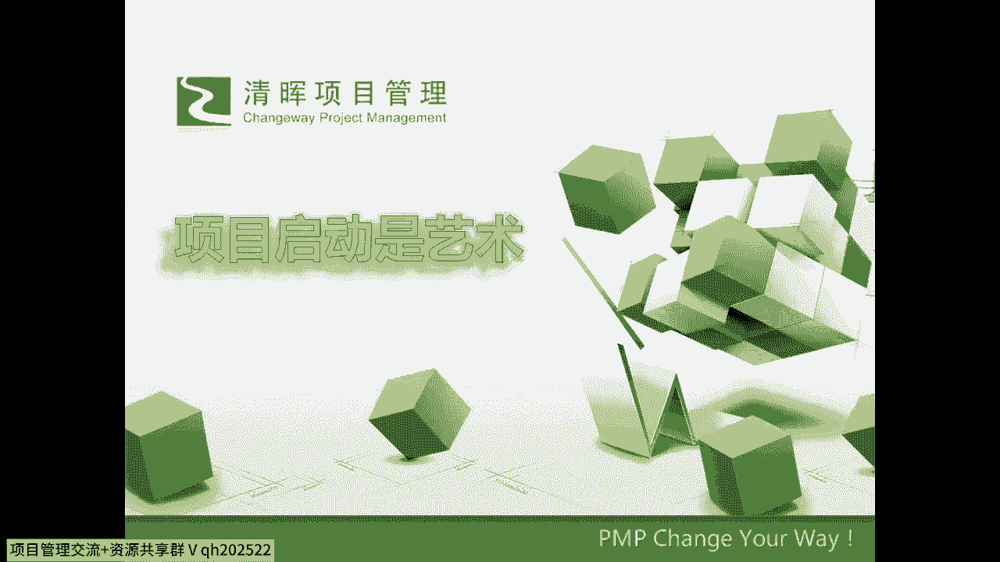
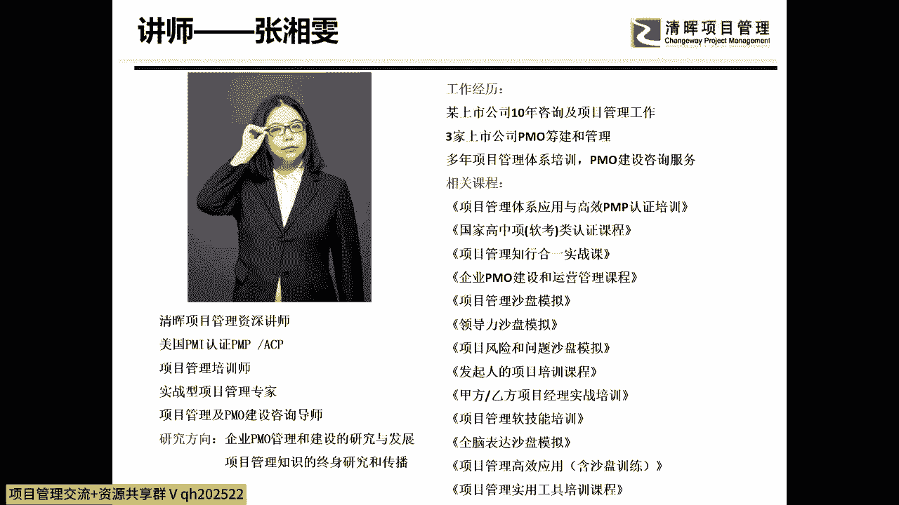
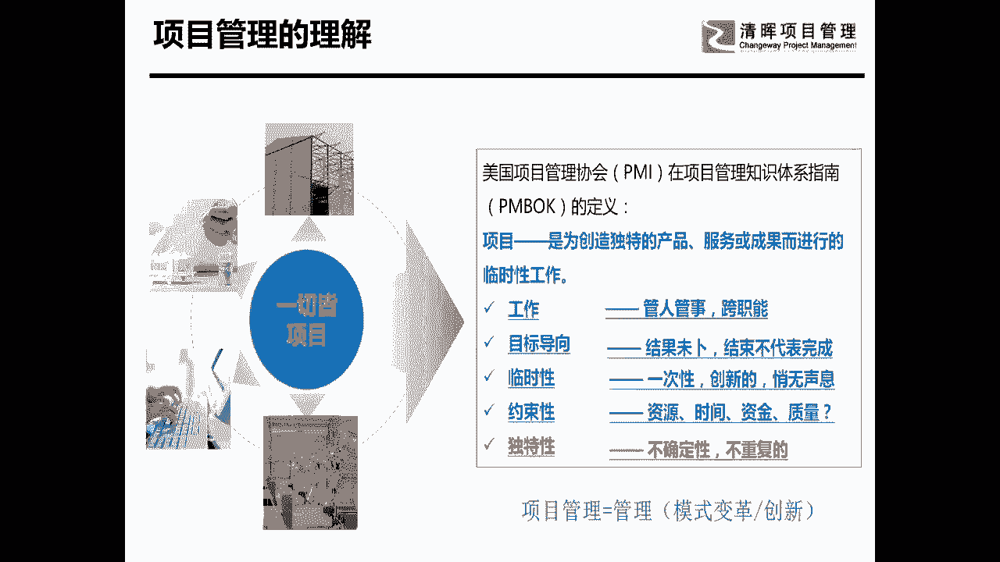
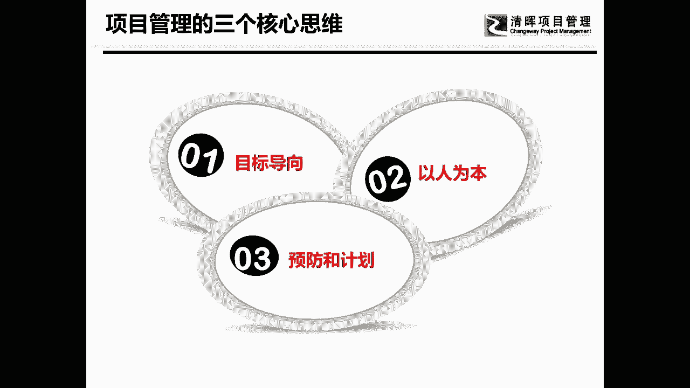

# 项目启动及主要工作 - P2：2.项目管理的理解 - 清晖Amy - BV1ui421Y7xe

哦各位朋友啊，我们晚上好啊，嗯那么今天呢是嗯我们12月份了啊，马上一过一下，也就是明年了，那么在这个今年一九呃，就是19年的最后的一个月呢，虽然有点早，但是给大家提前呢拜个年。

然后呢希望大家呢给大家一个祝福，希望大家明年的项目管理的能力会越来越好，然后呢我们就开始我们今天的讲课啊，我们今天呢主要讲的是项目，启动是艺术，那么在讲项目管理之前呢，在讲启动之前呢。

我想先跟大家聊一聊，就是大家在座各位啊，我们现在在听，我们现在在听我这个呃，就是讲解宣讲的这个各位朋友啊，嗯你们呢都是应该学过PMP的，在学完项目管理以后，你们会有什么样的一个感悟。

你们觉得在项目管理的这个，我们PMBOK的学习完之后，我们能不能拿它用在我们的实际工作当中，这个才是我们学习最最重要的东西，大家觉得是不是，所以的话呢我们从现在开始，从我们学完PMBOK开始。

其实才是我们项目管理的起点，那么我们今天呢就从起点的起点开始，跟大家来讲一讲项目管理应该来怎么做，那么首先的话呢介绍一下自己本人姓张啊。

顾长张红楼梦当中史湘云的湘晴雯的文啊，那本人呢呃不是湖南人，所以呢为什么我要这么解释一下呢，因为我们中国人呢，我们中国人是讲人情的啊，而且呢最喜欢讲的是什么呢，最喜欢讲的一个东西就是老乡啊。

那么因为我名字里有一个箱子，所以湖南人呢从来都对我特别的好，但是呢我每次都得提前声明一下，怕大家对我错付感情啊，就觉得哎呀是老乡，所以对我特别好，那么我们在项目管理当中，我们也是要要讲人的啊。

所以呢干系人管理是非常重要的，但是我要提前说一下啊，呵呵大家再轻松一下，今天的所有的课程都非常的轻松，就说一下我的名字吧，所有的经历呢也都不讲了，本人主要呢是致力于研究，项目管理和PMO的建设。

好在讲这个之前。

我们还是先来看一下项目管理，所有的人都学过了PMBO，在学完项目管理当中，也有很多人，他在实践工作当中也用到了项目管理，那么在我们用项目管理的过程当中，你们觉得项目是什么东西啊。

根据我们pm book的一个定义，他说项目是一个为创造什么，什么什么而进行的一个临时性的工作对吧，大家都熟考过试了啊，有的人考过试历史已经很悠久了，但是又怎么样呢，但是没关系对吧，忘掉了也可以再回过来。

但是大家有没有发现什么是项目，项目呢，做两个东西，项目管的东西呢是管两个来，我想问一下在座的各位，你们觉得项目管理管什么，其实我这也已经写了啊，我就问的有点有点不大好，因为原来是想问的。

但是呢因为我们这个是一个远程的啊，所以呢问多了呢，就是大家来不及回答好吧，我就不问了啊，我可以告诉大家大家，项目管理是管什么呢，管两个很重要的东西，一个是人，一个是事儿啊，但是大家会发现事好管人难管。

而且项目管理它是一个什么呢，它是一个工作，大家有没有发现他是说你项目管理呀，管的是所有应该要做的，所有应该做的工作，而这些工作室是为了干嘛呢，为了满足我项目应该要做的啊，所有的范围对不对。

所以它是一个管人管事儿的一个事情，很麻烦，而且大家在做项目管理的时候，往往会发现一个非常重要的一个特点，它是什么呢，叫跨职能，你们会发现项目呢它是一个什么呢，跨越部门的。

需要多种技能共同来完成的一件事儿，好不好做不好做，真的不好做，首先第一个大家都知道在项目当中，人是最难找的，人也是最难管的，还要跨部门，你叫不动啊，是不是叫不动啊，好这是第一个。

第二个项目呢是目标导向的，这一点从我们学项目管理开始，我们就在说了，项目是有目标的，好了这个问题可以问大家了，项目的目标是什么，来有没有人能够回答我，我想看一下在座各位啊，你是怎么来回答我的。

项目的目标是什么，恒大啊，项目的目标啊，有没有人能回答我一下，项目的目标到底是干嘛的，我们远程的互动的话会稍微慢一点啊，但是希望大家能够积极的跟我聊聊一聊天，满足客户的需求。

交付产品都没有回答到我们一个核心的根源点，同学们再想想，我们在学篇book的时候，有一张图讲，企业当中呢有两种管理，第一种管理呢叫运营，第二种管理呢叫项目，运营和项目呢都共同使用了。

公司的组织的各种资源来，为什么服务的，我说为什么服务的估计大家就能知道了啊，有人说让客户满意，那么我自己揭晓答案吧，啊大家在那个呃就是速度啊，反应还在听的状态啊，所以大家就跟着我啊。

今天我们在这个里面会有一些互动呃，会给大家讲一些小故事，所以的话呢大家要跟我积极的进行互动，那么项目管理的核心目标是干嘛，是为了满足公司的战略呀，同志们，你们当年填book和选做考试的时候。

选择题都学过的，对不对，什么叫为了公司的战略，公司的战略是什么，我其实还想问对吧，但我不问了，我直接告诉大家吧，公司的战略是能够让公司更好地生存下去，再通俗一点叫做赚钱，是不是，这是目标为导向的。

这是项目管理最最核心的一个东西，它就是以目标为导向的，但是我讲的是一个项目管理的目标，但是如果我要说某一个具体项目的目标是什么，那就不一定了，不同的项目他们有不同的自己的目标，但是大家知道吗。

在项目管理当中的这个目标导向目标，结果是未卜的啊，结束了，首先第一个他能不能做成功，并不知道，比如说在我们很多企业当中，有很多研发类的项目，不是所有研发类的项目他都能成功的，举个很简单的例子。

我们应该是去还是去年啊，去年的那个电影啊，叫我不是药神，我不是药神里面的他，你看的那个电影，你会觉得你非常的沉痛，因为这里面没有一个人是错的，每一个人其实都有他自己的目标啊，但是这些目标并不统一对吧。

这是第一个，第二的话你会发现，其实那个那个卖很贵的那个药的那个药厂，其实他也没错，为什么他没错，他要生存呢，企业的战略目标，战略目标他必须去执行，但是大家知道吗，呃在药物研发。

尤其是这种癌症的靶向型药的研发当中，70%到80的科研，也就是研究是失败的，所以他要把这个70%到80的失败的，研究的这个成本要放在什么，好不容易成功的药品上，所以我们知道项目是有目标的。

但是它是不好实现的，项目为什么会有项目啊，为什么会有项目，是因为这是一件非常不好做的事情，所以他才需要项目管理，大家有没有发现，其实是这样的，如果是一件非常好做的一个人，一个部门。

一种单有技能就能做好的一件事，他需不需要项目管理，要也很好，不要也没有太大的落差，但是如果是一件非常难做的，结果未卜的，那么这个事情其实你会发现，用项目管理就特别好，因为项目管理呢。

它的一个管理的思路方向是非常好的，我们再往下看，还有目标导向是什么呢，结束不代表完成，举个例子，我们开发了一套软件，软件开发出来了，他实现了项目的项目目标吗，没有他没有收益，他没有获得价值啊。

他没有获得收益，没有获得价值，所以呢他要在日常的工作的运用中，他才能产生价值，所以目标导向这是一个非常重要的东西，其实我们有时候我给他换位讲一下，叫做价值导向，就是所有做的事情你都是要有价值的。

第三个项目管理最大的问题在哪呢，就是临时性，项目管理不像其他的东西，你可以随便的做，它是有起点，有终点，特别是有什么呢，制约因素当中的时间制约因素是非常紧的，所以呢他是临时性的，一次性的，可能是创新的。

大家都知道吗，什么叫创新的一次性的，就是你平时从来没干过的，你从来没有干过的东西，你就会有什么有独特性，有不确定性，有不有就不可以，有的时候甚至不能重复的这些东西，他才能需要用项目管理来做。

因此我给它加了个定义，就什么呢，一切非常难做的，目标性，非常强的，时间制约因素，非常强的，紧急的要命的事情，它需要用项目管理，所以项目管理从来就是一件难做的事情，如果项目好做，就不需要项目经理。

也不需要我们整套体系，所以大家有的人就经常有人跑来跟我说，因为我有我，那有一个我是做偏猫的啊，就是我前面10年是做项目经理，后面8年呢是做PO，我在做PO期间呢，有很多项目经理来跟我吐槽，领导啊。

老师啊，我现在这个项目呢就是非常难做啊，我又我又被填坑啦，然后我就说你不要急，你坐下来想一下，我说你遇到过的项目有哪一个是好做的啊，仔细很多人仔细回想一下就发现真不好做，所以我们说项目管理是非常重要的。

项目管理是一种方法，那么项目管理的具体的套路方法，实实五矩阵还是项目集管理，还是项目组合管理，我们今天不讲这个东西，但是我们今天要给大家讲，灌输一个非常重要的一个思维模式。

我说项目管理当中有核心的三个字，三个思维模式。

我们来看一看，我觉得整个一个项目管理，不管你去看偏不可PMI的哪一本书，其实它在这里面核心都有三个点，哪三个点呢，第一个呢叫目标，或者是我有时候叫它价值导向，这是项目管理当中核心要讲的一个东西。

但是这个这个目标导向或价值导向呢，其实不完全是项目管理的，它是所有管理里面都应该讲到的东西，所以呢叫目标和价值导向，我们等会一个个来讲，第二个叫什么呢，以人为本，大家已经很多人都已经非常了解了。

说哎我们中国人做项目哪里是做事啊，明明就是在做人呐，对不对，所以呢以人为本，这是我们要讲的，第二个，第三个是做事情上最最核心的，所以很简单，一个是目标是方向，第二管事管人啊。

我今天不跟大家讲管事管人的问题，一个是管人，一个是管事，事情怎么做才能管好呢，预防和计划，大家有没有发现在项目管理在PMBOK里面，它通篇15矩阵当中，什么过程是最多的，计划过程组的东西是不是最多的。

然后你们考过PMBO了，考过那个200道选择题吧，你们在考的过程中，有没有发现那个预防事先的题非常的多，因为什么他就告诉你事情你不能做，救火大队啊，你得事先防范，做好计划，而按计划干活，妨害所有的风险。

才能把一件事做好，最终实现项目标，所以我觉得项目管理有三个核心思维，是大家一定要去记住的，为什么我要在开篇的时候，要把这个东西给大家讲一下呢，我只想灌输大家两个思路，第一项目管理是一件非常难做的事。

你想要把这件事做好啊，你要有谋略啊，你不是说呃你可以茫茫然的就去做的，第二你在做所有的项目管理的过程当中，你都不能把这三个核心思维给丢了啊，有的人在做项目的过程当中会怎么样呢，做做做做做。

做到后面他把目标给丢了，有吗有啊，然后呢，第二个你要注意到人才是最关键的，我们很多人都开始的都考过PMBOK，有没有人经常做到这样的一些题，干事人不满意了，该事人担忧了啊，干事人提出意见了。

干事仁说我觉得这个东西不放心了，干事人认为你给我的东西不够细了，你们有没有发现，最后出现问题的绝大多数都是人呐，所以以人为本是非常的重要的，第三个就是当你想把事情做好。

你所有的东西你都要带有预防的意识在里面啊，我们在做任何事情的时候，都要想这件事儿，这样可能会不会出问题，那样可能会会出问题，带着这样的三个思想来，我们进入我们今天要学习的内容就是什么呢，启动啊。

项目管理的启动。

