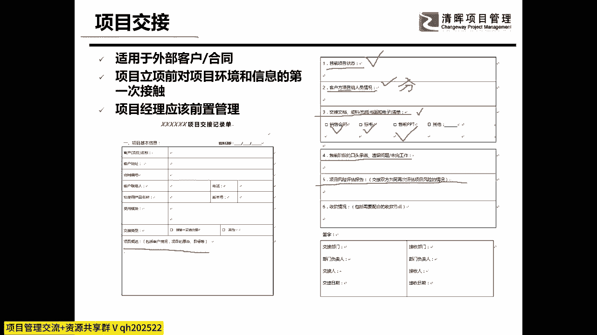
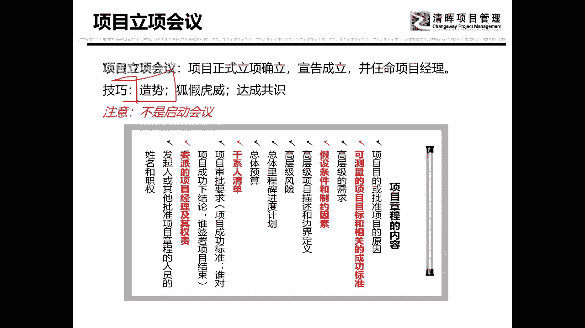
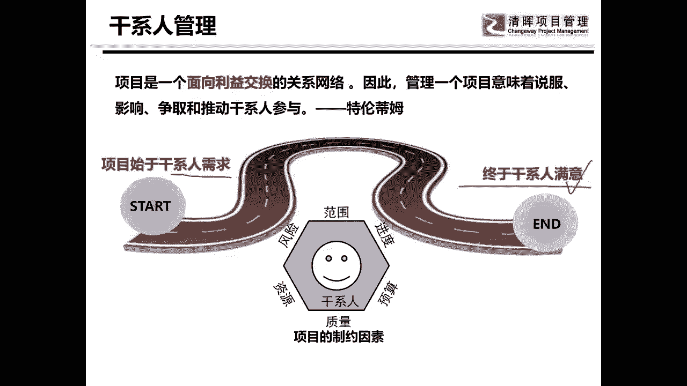
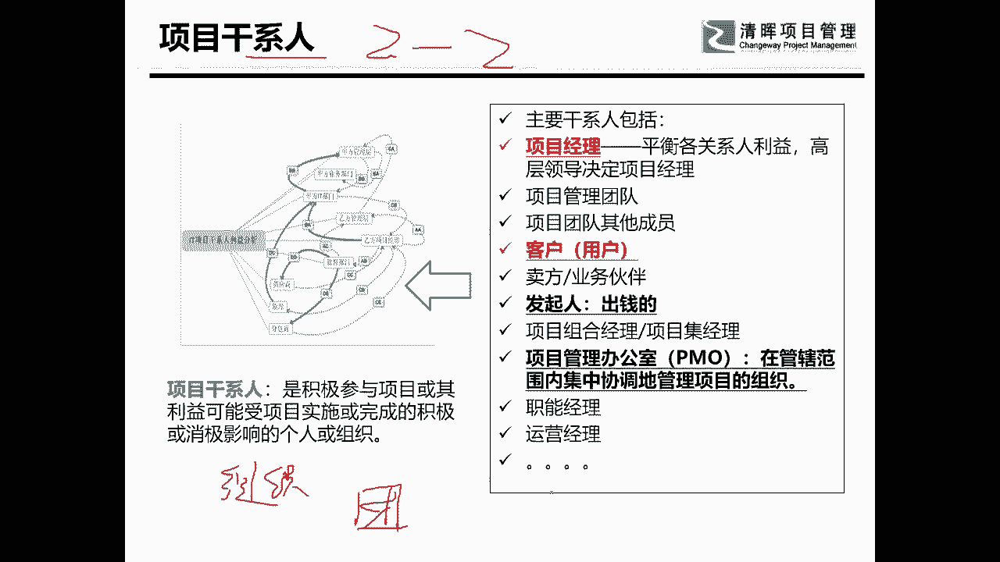
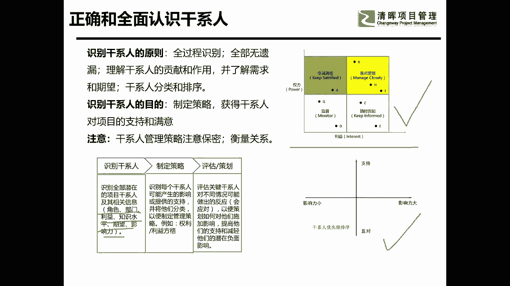
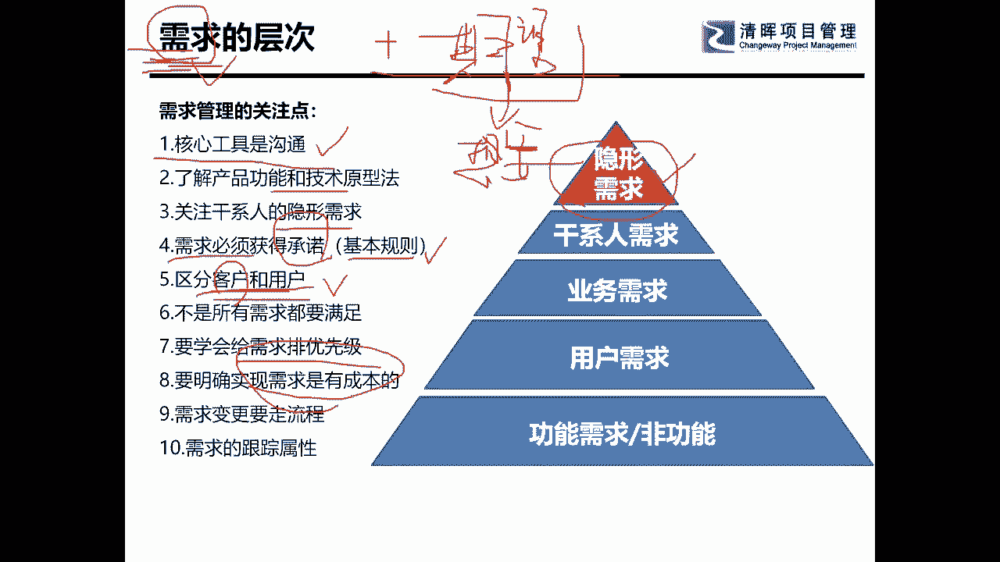

# 项目启动及主要工作 - P4：4.项目立项会议 - 清晖Amy - BV1ui421Y7xe

有政治意识好，这个呢就是我以前做过的一个项目交接表啊，大家看看我，我我给前面的那个挖坑的营销人员挖了哪些坑，也就是说你前你在负责在前面挖坑啊，那么那么项目经理拿到你这个坑的时候呢，也不是那么让你愉悦的。

就从能从那坑里给掉出来，对不对，所以呢他会让像呃，他就呢就会做这样一张交接表，由前端的人告诉项目经理，这个项目的概数大概有多少，这是随便看看啊，这种这种表单，其实说句实在话，每一个项目经理。

或者是呃有可能要做PMO的人员，他都应该根据自己的管理意识去要干嘛，需要自己去去去去去弄完呢，哎呦我看了你们的反馈以后，我怕我今天讲完以后，你们脑袋里大概除了挖坑填坑之外。

就没其他东西了啊哈那么我们可以看看啊，目前项目的状态啊，客户方的组织人员的情况，这时候我们我们是可以去分析的，我们可以去逼问的，逼问我的前端，你要告诉我你最重要的人是什么，他们的想法是什么。

他们的需求是什么，你都可以去问，然后你已经给出去什么样的清单了啊，这个东西你得给我，你得让我看到啊，你要把最最重要的版本全部都给到我，还有你有没有有没有什么口头的承诺啊，遗留的问题，我曾经经常看到。

我曾经做过好几家制造型的企业啊，他们曾经就有这个问题，他说项目都做到很后面了，客户跟他说做到最后了，客户说哎呀，你们销售在前期还口头承诺过，我什么什么什么东西，这个事你还没帮我做呢，都没有。

那你是做还是不做呢，对不对，你也不敢得罪客户对吧，所以这个时候你得搞明白啊，他有没有口头承诺过挖过什么坑，因为很多情况之下都是为了这些东西啊，好了还有你可以问一问前端的人员。

你认为在这个项目当中的风险是什么啊，其实我可以告诉大家，你一定要去问风险哦，你一定要去问风险，为什么一定要去问风险，你问不同的人，他们会告诉你不一样的风险，对于营销人员来说。

他们的很多人的风险是从哪一个出发点，大家知道吗，是从收款这个出发点，收款是一个很独特的视角，他们给出来的风险，其实对你来说是有很大的很大的帮助的啊，是真的是有一个非常大的一个帮助的，所以你可以问问他们。

然后呢就着这些风险，你问问他们，你觉得想怎么办，然后这些风险是不是你自己挖的坑，对不对，你有没有跟我一块填坑的这个勇气，对不对，所以这个是项目的交接会啊，这个项目交接会呢我是一般呢是建议呢啊。

建议项目经理啊，是要去要要去做的啊，不干的话你自己会后悔啊，然后呢干这种开这种交接会的时候呢，最好能够拉上一些领导，让他们一起听一听，知道了嗯，我手上接的是一个叫烫手山芋啊。

不是不是一个现在正好能咬一口的，这三芋很烫手啊，我现在能把它接下来，将来万一我把这项目做好了对吧，还是万一啊，把这项目做好了，你知道我的功劳有多大对吧，项目经理得得了解这个事啊。

所以这是项目交接，好玩这个东西我们他干了很多活，我把很多活都放后面了啊，我们来讲一讲项目的立项会议，项目立项会议呢我称它为狐假虎威大会，我自己是PMO的时候，我自己在做了，我做了三家公呃。

公司的那个PO，从筹建开始，不管怎么样，pm的建设呢，一般来说我都是抓一头一尾头，就是就是什么呢，就是立项啊，立项的会议呢，其实就是我们刚才真正说的确立项目正式成立，宣告呢。

项目的经理其实立项会议真正的核心，大家还有没有人记得制定项目章程，真正的那个核心的定义，可能我讲出来的呃语句啊，跟那个PMBOK的官方定义会有一定差距，那你可以听听我是怎么讲的，好像应该是制定项目章程。

其实是嗯确定项目的在公司的呃，在组织中的合法地位，并任命项目经理呃，允许他和使用公司的资源，所以其实制定项目章程，真正核心是告诉项目经理，你有权使用公司的资源，是不是这意思。

所以的话呢你们可以看到我把项目章程的内容，其实大家不用背这个内容啊，这个内容干的写成什么呢，这像啥，甚至分公司大老板诏曰，现在有一个利国利民的事儿，授予他尚方宝剑，允许他使用公司各种各种资源。

你们应该严格配合他，OK这就是项目章程，所以我在开项目的立项会议的时候，我往往会干一件什么事呢，我我会开得很隆重啊，嗯我会看的非常的隆重，然后呢我就会跟呃，我会干嘛呢，我会拉上项目经理。

项目经理是要在会议上讲话的，对不对，然后呢我会拉上所有的相关的资源部门的老大，并且能够拉上我能够拉的最大的老大，其中有一个人很重要，叫发起人，因为发起人是不可以呃，就是怎么样呢，不帮助项目经理的。

因为他是提供资源的人，但是很多项目经理呢是干嘛呢，是提供项目的人，但他不提供资源，他把提供资源这活能赖给项目经理了，那么我就告诉他，你可以赖给项目经理，项目经理应该要有技能去要到资源，但是你也得帮助他。

而且呢发起人往往是公司高层，甚至我有的时候如果这项目重大，我会拉得更高的领导一起坐在那，然后大家开会干嘛呢，项目经理巴拉巴拉讲了一堆的东西，对不对啊，我先让领导发个言啊，然后呢让项目经理发言。

项目经理就呱啦呱啦讲一堆的东西，各种制约因素，各种风险，然后呢需要什么什么什么资源，最关键的就是什么需要什么什么资源，然后两眼可可怜巴巴的看着资源部门老大说，各位资源部门老大，求你们了，你们帮不帮忙呀。

各位资源部门老大，大家要知道，在会议上，一般来说是即使他心里不愿意啊，那他也也也不能说啥，他也就会愿意，那要愿意以后呢把一张纸塞过去，签字画押，你愿意了，你在会议上答应的，你得给我干了哎呀，然后呢。

你还可以提供一些说我需要什么样的资源，这些资源的类型，这个里面哪里很重要，如果有没有有没有刺头呢，有有些项目，有些资源部门老大可老牛了嗯，资源部门老大老牛了啊，他说我真的没空，我就是没空，那怎么办。

两眼刷看着谁，所以这个呢就是启动大会，我经常叫它什么呢，狐假虎威达成共识，还有很重要的一个事儿叫造势，造势造势很重要，你一定得告诉别人，我这有一个项目轰轰烈烈的上线了，你千万不要怎么样。

就是那个走过不带一片云彩，活都干完了，都没人知道你这活是干了的，那你你想把这活干完是挺难的啊，所以的话呢你要造势啊，通过这样一个会议，曾经有人跟我说，哎他说张总，你你不要把那个立项会议开得那么轰轰烈烈。

不就一个会议，不就是一个签字吗，我们线下签签就可以了，可以吗，不可以，当时有很多项目经理都不理解我，后来我跟他们说，你傻呀啊，我在给你们要资源呢，后来项目经理都听懂了啊，项目经理都听懂了以后怎么样。

从此之后开项目的立项会开的比我都积极，因为都懂了，这个是是最好能够B资源的，不见得一定能够拿到你心仪的资源，但是好歹你走出了第一步，大家有没有发现，所以的话呢这个就是立项的会议。

好，我们再往后过，我们因为时间还是比较紧张的，那东西我们是不可以展开啊，我们来讲一讲人啊，刚才讲的很多的东西呢都是事情，那么我们来讲人的话呢，主要有一个东西，最重要的就是干系人管理。

我把团队和其他的干系人都放在一起讲了啊，干系人管理我挺喜欢一句话的，这个是呃就是客户班的管理，干系人的这本书里的一句话，作者写的一句话，这句话呢，对于我们这种在项目管理当中，溜达了很多年的人来说。

这句话的感悟是非常深的，项目呢是一个面向利益交换的关系网络，就是这一句话，这句话就是告诉你，每一个项目经理，其实啊每一个项目的干系人，其实都是在这个项目中，有他自己的利益的需求的啊。

希望能够在这项目当中获得点什么的，否则的话他就是一个不相干的人啊，所以我们在做项目管理的时候，你一定要了解他的利益的诉求到底在哪里，我经常有一句话啊，这句话呢我说项目是始于干系人的需求。

终于干事人的满意，大家效果，项目做久了以后，你就会发现真的就是这样啊，是因为有人想要怎么怎么地不管这个人是谁，当然这个人很重要，如果是公司的老板想要，那他最终就可以拿到，但如果是一个下面的一个员工。

或者是一个小职员，或者是一个小部门经理，想要做一件事，那对不起，就不一定能做成功，但是呢首先第一个我是要有干事，人要有想法，想要什么东西，然后呢经过千难万难的曲折的道路。

最后你一定要得到的一个东西叫干事人满意，其实我本人在做项目管理当中，我最重视的东西其实就是干系人，因为我做了很多项目，其实都是写方案，提提供咨询方案的，大家知道咨询方案是没有任何质量标准的，你要做建筑。

你要做一个设备，你要生产制造一些什么东西，你好歹是有一个很重要的明确的实物的产出，有食物的产出，它就有质量，但是方案是很难的，方案的变化也是非常快的，他认为这东西没有成本，就是你码码字而已啊。

我今天脑袋里想一个东西，明天我就想改了，这就是很正常的，所以你怎么才能够最终让他满意呢，啊你怎么最终才能够让他真正的实现呢，这其实就是肝肾人管理真正的含义所在，要让干系人持续地支持你，并且最终让其满意。

最后呢跟你说你的项目OK，做完了项目的终点到了，这个就是干涉人管理。

那机器人是非常多的，对的大家也是非常清楚的，知道的，对不对，我在这里呢给大家讲一个我自己做项目，干系人的一个技巧，干事人是要分类的，这个大家都懂，对不对，干事人就是对项目的利益是有相关程度的啊。

那么我把干系人呢我往往分成额两类啊，我经常很喜欢两啊，干项目经理也分两类，挖坑的和填坑的，那么项目经理呢也有两类，这两类呢又有两种，第一个第一种的两类呢是叫组织内和组织外，就是甲方或乙方吧。

常规来说比较用的比较多的就是甲方和乙方，甲方和乙方的项目干系人是不是不一样的对待，那一定是不一样的对待啊，这个东西就是很就很重要，第二个叫什么呢，叫项目团队内和团队外，为什么会这么分，大家知道吗。

因为我经常有一句话，有没有人觉得这句话我讲的对不对啊，经常你做事做得轰轰烈烈，好不容易形成了一个规模，形成了一个流程，实历史理顺了关系，结果项目经理啊，项目老大跑过来啊，公司老大跑过来跟你说，哎呀。

不好意思啊，我那儿有一个更重要的项目，你看一下你是不是折腾两人给我啊，先抽掉两个人给我，那我就问他，我说老板，那你还我吗，这俩人这个就不一定了啊，这就不一定了，对不对，是不是给你捣蛋的。

还有如果你有哪一个公司高层特别爱到你工作，工作现场去溜达一圈的，你也很痛苦，尤其是乙方给甲方做项目的时候呃，他要把客户现场溜达一圈以后，他是很圆满的回去了，答应了一堆的，为了面子，答应了一堆不平等条约。

可以让项目经理干死掉，是不是这样，大家可以看到了啊，但是呢我就把它分成第一组，织内组织外，大家要知道组织内的叫自己人，组织外的叫外部的人员啊，其实说的不好听一点，应该是该对付的一个，对不对。

所以我跟大家讲，项目经理分甲方和乙方，哈哈我我很坏啊，我做过甲方的，也做过乙方的，所以我分别知道在甲方和乙方，他们的呃思维模式其实是不一样的啊，然后呢还有一个是团队内和团队外，团队内呢是帮你干活的。

把活给干好的，团队外呢全部都是给你造成影响的啊，包括你自己公司的高层啊，这么一分，大家来再想一想，你应该怎么干活，对不对，好，这是干写啊。

我们呃这个大家熟吧，信任管理还记不记得一识别干系人，对不对，在识别干系人里面，我们要干点啥事呢，识别干系人的时候呢，我们要做一下视干事人的各种识别，然后呢，把识别的干系人的相关的信息是什么角色呀。

期望啊，影响啊，支持你还是不支持你啊，七里啪啦的一堆，包括我跟大家讲的，你的籍贯都是很重要的，对不对，为啥呢，我们是一开始的，是不是给你们介绍了一下，我说我不是湖南人，为什么呢，中国人呢是情理社会。

最喜欢的是干的一件事叫拉帮结派啊，怎么拉帮结派最快呢就是老乡啊，即使呢我跟你不是老乡呢，那我还得跟你说，我老婆跟你是老乡，总之怎么都得给你拉个关系，我才觉得我能跟你站在一条战线上，对不对。

所以你是不是要方方面面的去了解这个干系，甚至该了解这个干系人的喜好啊，兴趣爱好这些东西都很重要，把它记录下来以后的话呢，要给他们做分类，这是我们赫赫有名的分类呀，叫啥权利利益方格还记不记得啊。

我不讲了啊，权利利益方格我们不讲的啊，因为这个是应该已经考过了，对不对，甚至你也可以用一些其他的方法都可以分完类，分类的目的是干嘛，把干系人分类的目的是采用不同的策略啊，所以呢。

我们会可能会去做干系人的参与的规划啊，做完干系人的参与规划以后呢，我们要去做管理干系人，参与管理，干净人参与的目的呢，就是呃了解他们的策略想法，然后呢想办法大，让他们持续的支持我们。

那么我们管理以后的都不说，我们就说从启动和规划这个角度来讲，我们到底应该干哪些事儿，对不对，先是把人找出来，然后呢分类，然后呢知道他们关注的内容和点在哪里，想出不一样的应对策略来。

我们玩一下啊，在玩这之前还有一个东西就是需求，需求呢需求这个东西还有一个东西叫期望，大家学过啊，我们的课程其实我们呃我们清灰的偏book，其实写的是非常好的，它里面有很多的知识点，其实讲的还是蛮透的。

但是大家可能没有注意嗯，需求是干系人做项目的源头，你只有满足了他的需求，是满足了他的需求吗，他才能满意，那么我们来讲一下啊，首先第一个我们要来讲一下，需求和期望之间到底是怎么样一个关系。

我来给大家造个句啊，造个句，今天很冷，我想要保暖，所以呢我需要去买一副手套，大家有没有听出问题在哪里，其实他的期望期望呢就是想要想要呢，是可以天马行空的，哎呀我还想要住别墅呢，但是看了看银行存款。

最后发现怎么地啊，我大概只能买个两房一厅，而且还是个首付，嗯啊所以的话呢期望是我们真正要满足的，如果你想要干事人满意，你要满足的是他的需求吗，一满足的是他的期望，但是很多项目经理。

尤其是一些技术相关的项目经理，他们往往眼睛就聚焦在手套上了，然后他们就去会去问那个用户或客户说，诶老板啊，A用户啊，你觉得你想要什么手套，你要什么材质的，布的还是皮的，你要什么颜色的，白的还是红的啊。

你需要什么什么什么样的，上面要不要绣花，是不是大家就去看手套了，但其实人家都想要保暖啊，你要把他的一个期望，所以我们有的时候叫什么呢，我有时候给他给他起名叫隐性的需求啊，隐性的一个需求。

你要把它能够挖出来，这是需要靠功底的，我们在项目的初期启动的阶段，首先你就应该要了解，第一个你要知道自己的老板想要什么，他的隐性需求是什么，他的期望是什么，然后第二个你要知道。

客户或用户的需求和期望是什么，如果你搞不明白的，那对不起，你的项目是没有办法获得干系人的，持续的支持和满意的，那你怎么才能获得这些需求和期望呢，你要知道第一核心的工具是沟通。

而且沟通可以帮助你绕过很多的弯子，举个很简单的例子哦，原来你想要保暖啊，我没有手套，但是我这里有一件皮大衣，或者说我这里正好有一杯热水，你需不需要，也许他会恍然大悟的说好，我很需要。

我觉得这个东西比我想要的手套更重要，更好，对我来说更有帮助，所以他会很满意，所以沟通其实是避开你需求陷阱，的一个很重要的点儿，就是客户想要的东西，其实客户明确告诉你，我要的需求，明确告诉你的叫需求。

不是他真正一定能够表达明白的，而不是一定他能表达明白，你要挖掘的是他最顶端的隐性的需求啊，最隐性的一些需求啊，然后呢你可以用各种方法去了解，但是你们一定要知道，当他的期望变成需求以后，你一定要获得承诺。

这一点是很多项目经理很难做到的，就是什么呢，一般没有人愿意给你签字画押，说对我就是想要这个东西有吗，很多人不愿意，所以这个东西其实是需要啊，用一些方法和手段啊，未来我们可以到时候再重新沟通啊。

具体我用的一个方法，以前叫基本规则，现在还叫基本规则啊，啊来来去慢慢的去逼迫他来承诺，这也是一个方法，然后呢我们要区分客户和用户，客户和用户，大家要知道它并不完全是一样的，然后呢客户和用户呢既是不同的。

又是辩证统一的，这话是咋说啊，我们中国人永远都是这样，阴阳两极，对不对，既是怎么样地，又是怎么样滴，客户和用户呢，我给大家举一个很简单的例子，嗯今天呢，我在新华书店给我儿子买了一本高二的数学书。

回家让他数学练习册，回家让他练习，谁是客户，谁是用户啊，客户是谁，是我，对不对，我是付钱的，那谁是用户呢，我儿子最核心的一个问题就是我儿子开心吗，满意吗，不满意，大家就举。

再举一个我们日常管理工作中经常遇到的，每家公司，我们在座各位都应该有公司，对不对，公司上没有上过信息系统，上信息系统具体在信息系统里干活的，有几个是说这个软件是好的，有没有没有。

所以客户和用户是有区别的啊，我们真正要了解的是谁，客户的需求啊，我们要了解的是客户的需求，客户呢是告诉你说嗯，我需要买一本数学练习册，它最好是名校出的，有一定的难度啊。

能够呢让我的儿子的数学成绩能够提高的，这是不是客户，用户的意见重不重要不重要，用户的意见是是老妈能不能少做一点呃，能不能不做，这是他的需求，你觉得他你要满足他吗，但是我告诉你。

客户和用户的需求又是辩证统一的，如果用所有的用户都告诉客户说，老板这东西太差了，不能用，客户也会不满意的，所以呢区分客户和用户，但是又要让客户和用户要满意，就举个很刚才的那个例子，我儿子其实我儿子嗯。

我我今天好像是在家里讲的，同志们啊，我要轻一点啊，那个其实他只要告诉我一句话，说老妈你给我买的这本数学的练习册，难度太低了，不符合我现在的水平，我大概就不会再帮他买了，呵呵理解客户和用户的区别吗。

啊这些东西都是要去看的，然后呢要对所有的客需求要排一些优先级需求，我们要告诉大家一个很重要的东西，需求是有成本的，你要跟客户搞，跟客户讲明白，需求是有成本的，需求不是你任意啊可以加的，有很多人啊。

有很多的项目经理，为什么他是填坑的呢，是因为他胆子小，他不敢跟人家以理据争啊，只要客户提出来的需求，我呢都想做，我都都愿意去把它给做了，那么大家就会发现怎么样呢，就是这个这个需求啊，它是有价值的。

你不断的提需求以后，你要是什么东西都答应了，你知道在甲方的心理是一种什么样的心理吗，我第二家公司自己就是甲方，我特地去做了一家甲方公司的项目经理，我就想知道我从甲方的角度，我坐在这个位置上了。

我来看乙方的时候，当他们给我提东西的时候，我的心理反应是什么，我可以告诉你，如果我是甲方，你是乙方，我给你提需求，每一个需求你都答应，我心里的第一反应是当时合同签亏了，价格谈得太高，艰辛就是这种想法啊。

所以你一定要告诉甲方，或者是你一定要告诉家，需求是有成本的，你给我加需求，你就得给我加钱呐，啊我有一句话叫啥，我就是说增加需求是正确的啊，是可以的，但是提了需求要我们做不给钱是耍流氓啊。

所以大家要了解需求是有成本的，这一点是一定要大家去了解了解，需求是要走变更流程的，这个大家也是要去了解一下具体的啊，我们慢慢的在实践中要去了解需求呢，我们就跟大家讲到这里，主要因为是需求和干系人。

期望需求和干系人的分析啊，他的关系是非常大的。

