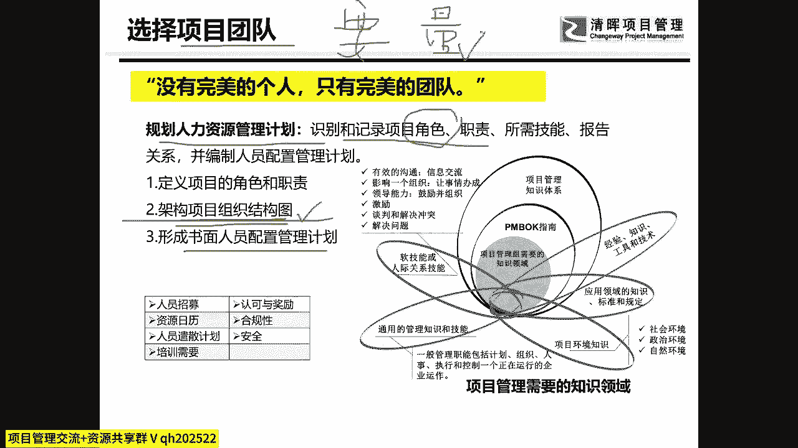
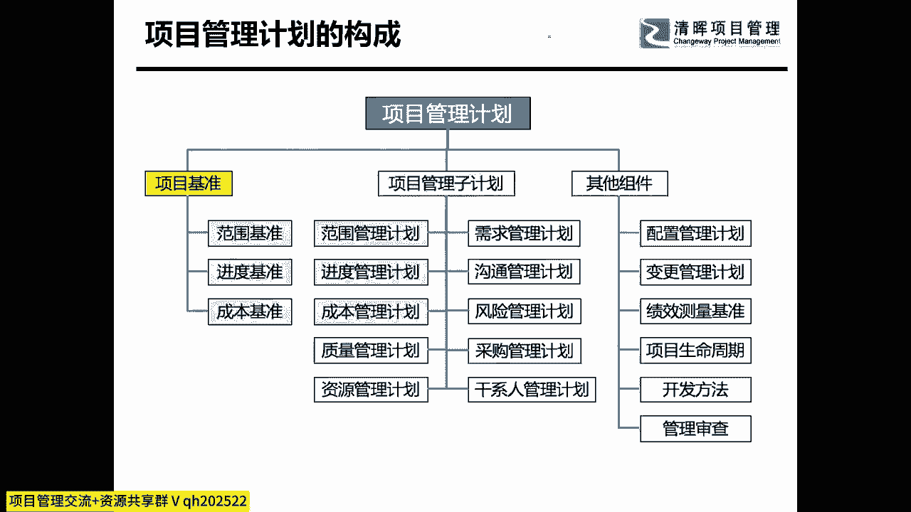
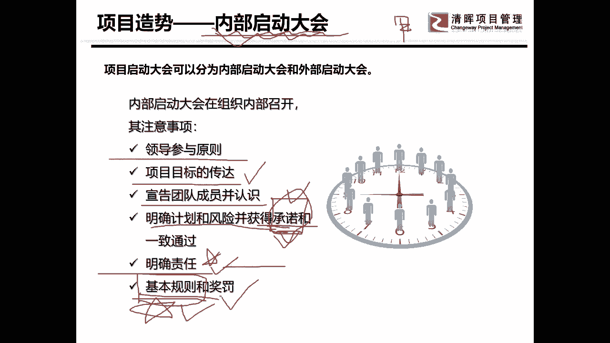
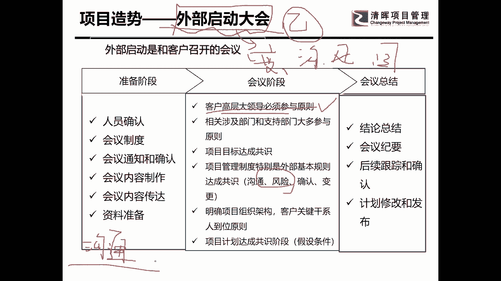
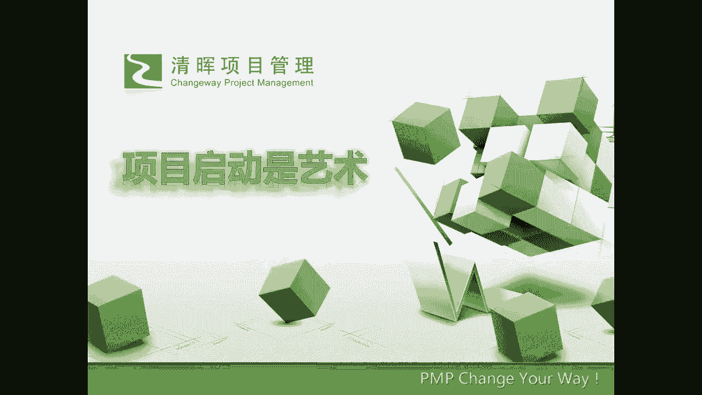

# 项目启动及主要工作 - P6：6.项目造势 - 清晖Amy - BV1ui421Y7xe

好我们再来看一看人类的选择，那个选择呢要搭配，什么叫做搭配呢，就是我们没有人无完人，没有一个人是能够掌握所有的技能的，但是的话呢我要掌握各种技能的人，把它组合起来，形成一个拥有完美的技能。

和应对承压能力的一个团队，这个就是选择团队，在选择团队呢，我们最常规用的就是什么呢啊，先做人力资源的计划啊，或者是叫资源计划，在这个资源计划里面呢，要盘清自己的家底，不是家底，就是说我到底要哪一些角色。

这个非常的重要，角色和你要到的人之间是有很大的差距的，但你一定要知道，我这个项目上到底要什么样的人，这点要知道第二个很重要的一个东西是什么呢，我们一定要能画清项目的组织结构图。

我曾经有帮助我的团队成员啊，和我的项目经理，因为我做P猫，后期做就是做的时候帮助是比较大的，有项目经理跑过来跟我嗯，吐槽，他跟我说，哎呀领导啊，那个骗猫啊，我发现现在团队难带啊，每个人的思想都很活络啊。

哎呀你看看我下面的团队成员都不跟我来汇报，他就跑领导那儿去汇报，巴拉巴拉巴拉，把我这个项目上啥活，啥事都给都给说了啊，然后你说这怎么管呢，对不对，然后我就问了他一句，我说你的项目的组织结构图你画了没有。

他说那是啥玩意儿啊，这个是不是我们的人力资源管理计划里面，是不是讲的，以前我们在6。0之前叫人力资源管理计划，因为我们在座听的人里面有有学老版本的啊，有学新版本的，所以大家就来看是不是就有个组织结构图。

它最核心的思想是什么，确定上下级的汇报关系，你没有做项目的组织结构图，你就没有在会上去做上下级的汇报的规则，所以他向哪个领导汇报都不算错，但是如果你把组织结构图画出来了，标在了那里啊，扒在墙上了。

然后你告诉他你有问题，你应该向你的某某上级汇报的时候，他要是再去找外面的领导汇报，那他就犯错了，所以你必须先要有规则，这就是人力资源计划里面很重要的一个点，所以很多人说这个东西做和不做有啥关系。

我说关系大了去了，它关系到你能不能把团队管好，还有呢要形成书面的一些配置的，管理的一些计划啊，人员的一些招聘啊，培训啊等等这些东西都要去做，这个呢是团队的建设，然后在团队建设的时候呢。

最主要还有一个东西就是怎么要到人，对不对，要到人其实他是执行过程中干的，但是要人其实很重要啊，要人的前提是你要广而告之，你要在公司的高层心目中，知道你的项目是多么的重要，并且你想要要人呢。

你还应该要有一个思维叫量化思维，为什么呢，你天天在那跟领导说，领导啊，我缺人，领导啊，你给我不给我，人人领导，我缺资源，领导说好了好了，不要吵了，我知道你缺资源，所有的项目经理都跟我说，缺资源。

你要怎么去跟领导说说领导，我现在有一个项目，这个项目它有多重要呢，它占了我们公司的整个全年度的这个产品的，一半的销售的金额，然后这个项目呢我要在几月几号之前，我如果能够把这个款项收到呢。

那么我们今年就很可能，就这个业绩就能够完成了，所以呢我帮你分析一下，我在这个项目当中，我需要什么样的角色，什么样的程度的人多少名，现在呢你已经给了我几个人，我努力消化一下以后，我发现我还缺了多少人。

领导你看一看你能不能支持我，如果你支持不到我这些人，那么其中最核心的几个人，你能不能再多给两个，这样的话我还可能有努力一下，在年底之前来完成这笔收款，你看你这么去问人家要人，然后领导就会说哦。

你这个技能的人缺几个呢，他就会帮你去想说哦，我这个大概还是能够给你盘算一下，还能给你几个人出来，对不对，你一定要用量化的思维去跟你的领导，去讨论问题，而不是躺在那儿在地上打滚，说啊我缺人啊，我缺人。

你再缺人，他也不理你啊，你一定要量化的告诉你，你到底缺几个人啊，你而且你确认这些人以后，你能够你不能够实现什么，这东西就是很重要的啊。

这是选择团队啊，好项目管理计划是我们今天一笔带过的事儿，刚讲完项目管理计划，其实大家都知道项目管理计划都做完，做完了之后，最最核心就是因为最后要干一个很重要的东西，要开一个什么会启动大会。

大家还记不记得考PMBOK的时候，考的还挺多的，对不对，启动大会是一个很重要的知识点，它是规划阶段的，最后一个工作是执行阶段的，怎么样开始宣告项目成立好，我们来看一下我们PMBOK里面的启动大会呢。

其实主要讲的是叫内部启动大会，为什么叫内部启动大会呢，如果是甲方公司啊，开启动大会，那对不起，就这一个了，就这一个了啊，甲方自己做项目的时候，或者是甲方就是找乙方来做项目的时候，他就开的这个启动大会。

叫内部启动大会，就是怎么样呢，他会把所有组织的项目的团队成员都招过来啊，然后呢他有几个很重要的原则，第一个原则叫领导参与原则，跟立项会议一样，叫什么呢，狐假虎威，借势造势，开启动大会是造势啊。

我们一直都讲，你要让领导知道你有这个项目，轰轰烈烈的知道你有一个这么重要的项目，那你就要造势，所以你要首先第一个领导要参与，然后呢要宣告要宣呃，要要广而告之，然后呢在这个会议上呢，要告明确大家的目标。

大家的目标要是都是认同的，并且呢要宣告项目团队成员相互认识，大家有没有发现，这是不是启动大会经常讲的内容，并且要怎么样要明确计划和风险，并且在这个会议上获得承诺，什么叫承诺，获得谁的承诺。

我们团队内干活的团队成员的承诺，我告诉大家，会议上在公共场合，中国人是一个很小要面子的民族，大家知道不知道，就当你在大会上公开的说yes之后，即使他他就咬着牙，他也得认，干不完他也得去干。

当然这个还要看那个职业素养啊，有的人是前头答应了，后头就把他丢了，那这样的人以后你就少合作啊，但是这个承诺是真的在这个启动大会上，在在商量的吗，不是的，大家要知道一个很重要的一个技巧。

什么样的一个技巧呢，就是说其实你跟这个人达成共识，是在会下，就是在线下的线下已经达成共识了，在这个会议上呢是一个形式啊，这个会上是一个形式，其实外国人不是这样，外国人有很多都是在会议上达成共识的。

但是中国人真不是，中国人，有很多重大的决策和承诺是线下先达成了，到会上才说yes，你要是到了会上想让他来说yes，那你有你这个会呀，这个启动大会开一天，你都开不完啊，你都开不了啊，好明确每一个人的职责。

这一点很重要，为什么这一点很重要呢，我们说在项目管理当中有一个要求叫，有且只有一个负责人，这样一条规则，大家知不知道，就是一个人就只一个事情，最好只有有且只有一个负责人，千万不要多投的领导，多投的管理。

这样的话一定会出岔子的，嗯嗯基本规则呢我今天不讲，大家以后有兴趣的可以跟大家聊一聊，基本规则是一个非常重要，是我也非常喜欢的，跟那个假设条件是同等喜爱的，我喜欢用的一个工具啊。

将来有机会的时候可以跟大家聊一聊，那么基本规则甚至你能够写好了，对你的团队管理的帮助是非常大，非常非常重大的一个东西啊，我们先在这留个悬念啊。

为我以后啊，大家来听我的课，留点余地啊，我们再来看一个会叫外部启动大会，如果你是一个乙方的项目经理，我告诉你，这个会议就是极其重大的会议，我把这个会起了个名字叫挖坑会议，因为你在项目的过。

做项目的过程当中，你规范自己团队内部的人还是比较好规范的，但是你怎么样才能够规范外部人员，特别是组织以外的人员，就是甲方的人员来满足你的行为规范呢，你唯一的机会就是启动大会。

因为这个时候大家都没有一起干活，我称它为叫谈恋爱的初期朦胧美阶段，双方看对方都相对比较顺眼，并且没有产生冲突，没有发现问题，在这个时候你去做一些制度规范，风险确认都还相对容易，你如果举个很简单的例子。

就拿基本规则中有一条我们大家最喜欢用的，其实那条很low，就是开会的时候大家不能迟到，这算不算一个团队应该掌握的基本规则，或者叫团队章程，那是不是应该是应该这样说的。

但是这个东西能不能在有人已经迟到了以后，再定，那个迟到的人肯定想你，这不是针对我吗，对不对，你这条基本规则，你这条制度不就是针对我的吗，我心里是不服气的，所以一定要在大家都没有犯错之前。

就要把这个制度流程体系全部都宣告，包括什么，包括变更，啊包括沟通，包括风险，包括目标都要在这个会上达成共识，而且很挖坑，我可以告诉大家，如果你是乙方的项目经理啊，我是专门有一节课的。

是讲外部启动大会应该怎么写PPT啊，怎么写PPT，因为这里面有很多的技巧，当然我会结合你的项目的实践，来跟你谈这个问题啊，而且我可以告诉你他有没有几个原则，我可以告诉你，他们的意愿是希望项目成功的啊。

而下面的很多成员，虽然他们主观意愿上是希望项目成功的，但他们是核心的思想，还有一句话，最好少让我干活，这就是你在做项目当中最容易引引起的障碍，所以你一定要让公司高层来。

因为你做的很多的制度体系都是很高大上的，他会觉得你说的很对，但是下面的人脸会绿的，我记得我有一次做一个事业单位，还是一个什么单位啊，这个反正是跟国企，央企中央有关的事业单位，好像啊。

当时的时候我们就提了一个要求，我们说呃各个地方的需求啊实在是太多了，我希望在每一个部门呃，科室那都有一个需求的，都定点设定一个需求的对接的相关人员，并且把那个需求人员的888的，他的职责也列了一下。

说我需要每一个部门的一个需求，对接人员的清单，当时然后呢我又说了一下理由啊，说这个东西怎么怎么滴好啊，这些需求之间可能会有什么样的矛盾，但是如果我们大家呢统一有这些人以后呢。

我们可以定期对这些需求进行管理，开会嗯，然后变更也可以，怎么怎么地，觉得很好啊，但是下面的人脸就绿了，因为嘛找不着没有人想干这事，所以呢当时他们的那个负责这个对接的，项目经理就说哎这个东西太难了。

不可能实现，不能实现对吗，我来主抓最后这件事，最后花了大概半个多月，最后真的做成了，那你觉不觉得如果每一个科室，每一个部门的有一个需求的对接人员，是不是你再去做需求调研的时候会方便很多，这就是挖坑。

你得想好了，你自己的这个项目，在对方哪里是会对你造成障碍的，哪里是你的外部依赖关系，然后明确了以后，在这里拼命的挖坑，我刚才讲我在这做，这里还有一个新的，那就是风险，那风险，什么叫风险。

我最拿手的一招就是抓着客户一起来，一起来分析风险，很多人听了都怕你怎么能抓着客户来分析分析，我说能啊，启动大会中一个重要环节，就是抓着客户来谈风险，你能告诉我在这项目中有什么风险，其实就是他们的担忧。

而且这些风险你觉得你应该怎么怎么防范，你去你去跟他们讨论，而且就是找一个一个很简短的一个时间，让大家把几个风险提出来，我告诉你对方会把自己给埋了，因为什么呢，他提到的一些风险我最后会形成策略。

而这些策略我绝对能让他们变成紧箍咒啊，所以所以这个东西就是就是啥呢，这就是就是说你的那个外部启动大会啊，我我就是举了其中的两个点啊，所以这里面的设计是很繁琐的，很繁琐的啊。

这个东西其实是相对来说是一种呃，在咨询过程中应该做的一个呃做的一个课程，因为我只有了解了你的项目的特点，你的客户的类型，你才能去做的这么一个呃启动大会的一个PPT，一个挖的坑，但这里面也有一些原则啊。

这个东西大家要了解，其实说白了你就是拉着客户的高层，狐假虎威的把你的制度和东西规范进去啊，放进去了以后啊，你们希望我讲的细一点啊，我就稍微稍微糙一点，你们就讲沟通啊，在沟通里面，在沟通里面。

你们觉得客户最让你们头疼的是什么，因为我今天时间关系，我就不让你们自己回答了啊，就不让你们自己回答了，你们知道是什么吗，获得客户的承诺，不管是谁的承诺，你都拿不到，你就连一个小小的部门的成员。

他说我今天跟你提的这个需求，你说你能不能帮我签字画押，当然你不能这么说，对不对，你能不能帮我签一个字，他都不愿意对吧，你们定好了一个决策啊，你们定了一个决策，然后你发给大家说你们认不认可，没人给你回复。

是不是这样，所以你可以在沟通的这个里面，定义一条非常重要的一个制度体系，你说我们的项目时间非常紧张，那然后呢为了避免大家相互之间的啊，就是因为信息的缓慢，你不能说是因为他们自己不想干，对不对啊。

因为信息呢是有时间差的，因此呢，你说我特地对那些特殊的需要，反馈和回复的东西，我做了一个沟通的模板，而是一种特殊格式的沟通的邮件和文档，大家有没有人记得，沟通管理计划当中有一个小点是说沟通模板。

有没有人发现过，我可以告诉你项目管理篇不可以的，每一句话我都给你给你们给你们讲个故事，你们信不啊，然后你就把那个模板做好，然后呢你就在这个启动大会上说，那么这个会议啊，叫这个模板是一种特殊格式的沟通。

是需要获得大家反馈的，因此呢为了节约大家的时间，你看你的目的是很好的，对不对，其实你知道是有的人不愿意写点yes啊，也不愿意点NO，然后怎么办呢，你就说我在这个这个东西我定一个规矩。

因为这是一种特殊的沟通，因此呢我帮我把这个邮件和邮件发出来以后呢，我们呢就决定大家三天内必须回复，如果在座各位的领导，你们三天内没有回复呢，那我就视同你们认同承诺了啊，是不是适合你们认同程度好。

下面的人当时听了有些人啊，有的人听了已经感觉有点不对了，但是呢当时在会上也没有反对，领导说好不错，我说那我们就这么执行了，他说OK可以好吧，我们就把这个东西做制度了，那你真正做的时候呢怎么办。

做的时候你不要那么硬，对不对，你把邮件发出去了，然后呢你又到了，先打一个邮件，发出去以后，先打个电话，某某领导，这个邮件已经发了，是个非常重要需要回复的，我们在启动大会上定好的沟通的规则哦。

啊您三天内要回复哦，那对方说好，我知道了对吧，有的人说没收到没收到，你说要么我再发一遍，要实在不行，我亲自过来一次好，你总是一定要让确认他收到了好，那么第三天不要等第三天过掉，然后你打个电话过去，领导。

第三天了，你给不给回复我，你是不是不会，你是不是已经承诺了，他说没有啊，我没承诺，我觉得我里面有问题，那你说好，你们有什么问题吗，要不我亲自到你这儿来跟你沟通一下，你看其实你是在逼迫他。

怎么样逼迫他承诺，你就可以去做这些方面的设计，这就叫挖坑，明白没有项目经理千万不要傻乎乎的，有很多项目经理在项目初期启动阶段，规划阶段，我看他们乐呵的不行，没活干啊，做了个计划，计划做完了。

我宣告了以后，大家都可以了，好啦好啦，你们就按着计划做吧，你们不是傻吗，对不对，你就得想好各种的谋略，这叫做外部启动大会，可以说这是个非常重要的东西，大家能不能理解好了，到这里，我们今天的课程讲完了。

稍稍的占用了大家啊8分钟的啊，一个时间总结一下，让我们汇总一下，总结一下项目启动大会，而不是项目启动大会，项目的启动是一蒙，是一门项目经理需要展开展自己谋略策略的。

是需要挖坑的。