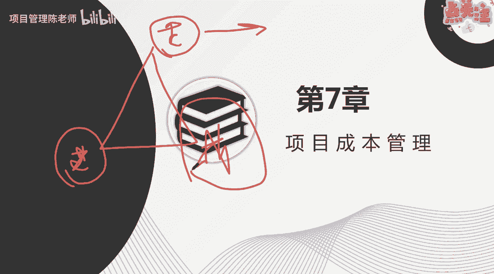

# 项目成本管理概述 - P1 - 项目管理陈老师 - BV1m84y157wG

那我们来讲第七章项目的成本管理。

那么在之前呢我们已经讲完了项目的整个管理，项目的范围管理，项目的进度管理，那么接下来成本管理，其实跟范围跟进度是息息相关的啊，三三者之间是互为相关联的，而且相制约的。

我们说项目管理呢它有传统的三大制约对吧，三大制约，什么是三大制约呢，就是我们所说的什么呀。

项目的范围，进度以及成本啊。

所谓的范进程啊，这三个是我们最传统的三大志愿，为什么把这三个拿到前面来说呢，就因为这三者之间其实存在着很多相互关联，他们的很多的内容都是相互的有联系的，比如说我们在做完范围。

一开始做范围的时候，我们得到了我们的范围基准是吧，有了范围基准，以此呢我们可以对它进行活动的分解。

对就是进度管理里面的第一个过程，定义活动，同时呢有了活动之后。

我们接下来就要来考虑做这些事儿，我们要花多少的代价，或者说我们要花多少的成本，那么成本管理就是由此而生啊，我们说做任何事情，我们都是要花费成本的，而且呢项目因为它具备临时性的特点。

那么它正因为它的临时性呢，所以我们在有限的时间内，我们在有限的资源或者有限的成本内，我们要去达成项目的目标，那么对于项目成本的管理就显得非常的重要，假如说我们不对成本进行管理啊。

那很可能出现的一种情况是怎么样呢，就是我们对对成本啊没有进行合理的一个控制，成本严重超支，项目没有钱了，项目没有钱之后会导致的情况是什么呢，就项目直接就就停止了，就做不下去了啊，我们之前讲到项目停止的。

终止的几种情况里面呢，就有其中一种叫什么呢，没有钱了啊，没有钱可以做了，那这时候项目就不得不终止了，大家可以看到我们现在有好多的这种楼盘啊，包括很多的建筑工程啊，很多烂尾的工程。

为什么这些工程到最后会烂尾，其实很重要的一点就是资金链断了，然后呢没有钱再继续往下做了嗯，所以就导致不了了。

之所以成本管理，在整个项目管理的十大领域里面呢，还是非常非常重要的。

那我们来看成本管理的核心概念，项目成本管理呢重点关注项目活动呢，完成完成所需的资源的一个成本，我们要完成某个活动，需要投入相应的资源，那么资源并不是无偿的，它是有偿的，有偿呢也就意味着我们要投入成本。

同时呢也要考虑项目决策时，对项目产产品服务或成果的使用成本，维护成本和支持成本啊，我们现在对成本这个概念呢并不陌生对吧，大家其实生活当中啊，都经常会提到成本的这么一个一个一个词，是吧啊。

比如说我们做生意做买卖，我们从一个地方进的货，那这个就是我们的什么呀，我们的进货成本，那么我们销售出去的价格，就一定要在成本的基础上，加上我们想要的利润啊，最终制定我们的销售价格啊。

所以呢成本这个东西应该大家平时都不陌生，当然也有一些成本呢，大家可能呃有时候有提到，比如说呢时间成本对吧，边际成本啊，那么这些呢啊都属于什么呀，都属于我们可以说叫做呃这个这个这个叫呃。

经济学里面的一些概念，大家能懂就懂啊，如果不能懂呢，我们可以这么来理解，我们项目管理里面的成本，指的就是我们在做项目活动时候，所需要花费资源的代价，大家可以这么理解所需花费资源的代价啊，我们管它叫成本。

当然我们说了，你要考虑到未来的什么使用成本啊，运维成本啊等等，这些呢你也可以一并的考虑在内，那么不同的相关方会在不同的时间，用不同的方法去测算项目的成本啊，不同的相关方，比如说项目的业主。

他可能更考虑什么呀，我这个建完大概需要花多少钱是吧，然后呢如果是作为运维方呢，他可能考虑你建完了之后把成果移交给我，我在运维上面，运营上面还需要花多少的成本啊，人力成本呐，固定成本啊，啊折旧啊等等。

这些都属于成本，所以不同相关方，会站在不同的角度去测算项目的成本，那么我们上节课有讲到说啊，这个增值管理啊，他其实是对什么呀，是对成本管理的一种方式啊，他把什么呢。

他把进度和成本呢融合在一起一起来考察啊，所以传统的做法，比如说增值管理啊，e v啊，pv啊，这些大家能理解就先例理解，不能理解，等，后面我们会详细的来说这一块增值的一个概念，当然了。

也有所谓的新兴的引入正得进度，es争得进度，at实际实施时间啊，这个大家了解一下就可以了，了解一下就可以了，那么对于e v m增值管理呢是需要重点掌握，那我们后面会详细来说，我们来看一下这个制定像啊。

这个成本管理它的过程其实比较简单啊，他有五个过程啊，第一个过程叫做规划成本管理啊，每一个领域的第一个过程呢都是规划对吧，规划成本管理完了之后呢，我们就来进行估算成本，估算成本之后我们来制定预算啊。

制定完预算之后呢，其实我们就得到了我们的什么呀，我们的成本基准啊，成本基准有了成本基准之后，我们就要在项目的过程当中来维护成本基准，所以呢就进入到我们的控制成本的这个过程，所以几个过程非常好理解是吧。

首先规划一下我们要怎么管诶，怎么管成本，我们对成本的衡量是怎么样的啊，我们能接受的成本的浮动的区间是怎么样的啊，这些在成本管理计划里面呢，我们要把它规定考，然后呢接下来是依据我们之前的一些成果啊。

我们来估算每一个活动它需要多少的成本，那么估算的一个依据就是什么呢，依据我们每一个活动需要投入的资源啊，这是一个估算的依据啊，比如说今天我做一个活动啊，讲课这个活动，那么我估算一下我讲课的成本是什么啊。

我的人力成本是吧，还有呢我这个场地场地的成本是吧等等，其他的这些我都要估算进去，这些东西呢是支撑我能够顺利讲课的，必要的资源，我必须为这些资源付出一定的代价，这些代价它就是成本，那当然这只是单个活动。

在一个项目当中呢，我们可能有多个活动，那我们就要把这些活动的成本呢把它估算出来，然后呢采取汇总的方式来制定项目的预算啊，不我们说我们刚之前在wb s里面呢，包括说分解活动的时候呢，已经把一个可交付物。

分解成为若干个易于管理的可交付物，那么这些每一个可交付物呢，我们又给它分解为各个活动，那现在我们把活动的成本估算之后呢，我们就要采取什么呀，自下而上的汇总啊，一点一点的把预算做出来，有了预算之后。

我们有了成本基准，那么我们在控制过程组里面，就要对这个成本进行一个有效的一个控制，确保他在成本基准里面啊，我们的项目活动在成本基准里面，同时呢也要应对产生的一些变更，假如出现了偏差。

