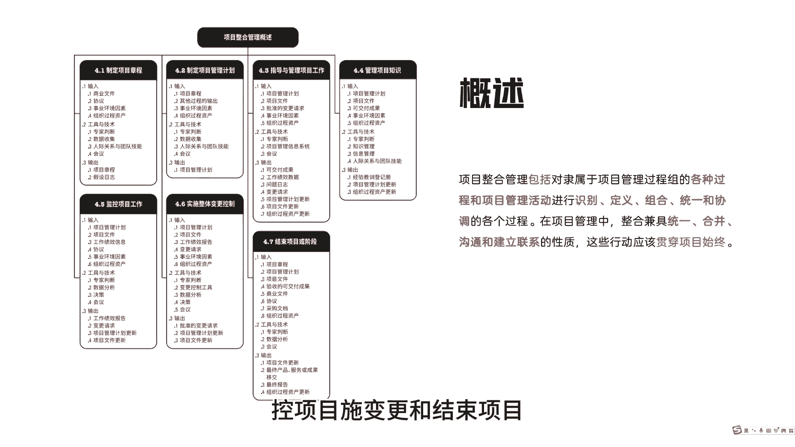
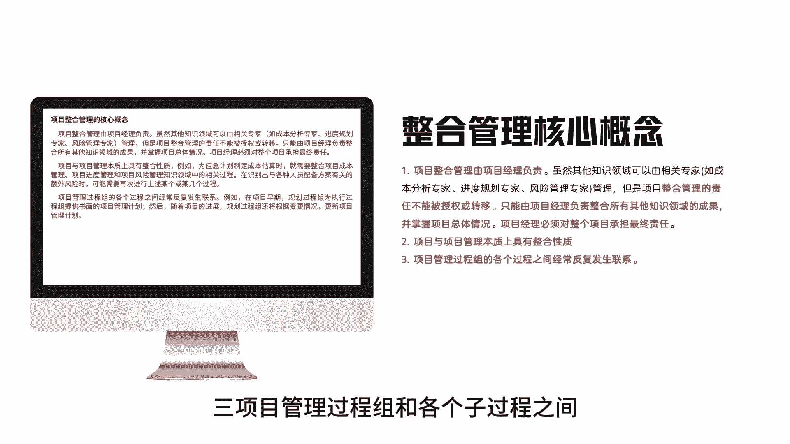
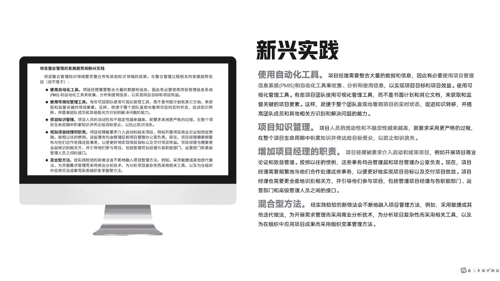

# 项目整合管理概述 - P1 - 之之喂知知 - BV1FNtJeJEPe

大家好，今天开始PMP系列整合管理，我是吱吱魏芝芝，来看一下整合管理的概述，整合管理，它包括对隶属于项目管理过程组的各个过程，和项目管理活动进行识别，定义组合统一和协调的各个过程。

在项目管理中整合兼具统一，合并沟通和建立联系的性质，这些活动应该贯穿项目始终，左边这张图可以看到，整合管理包括七个子构成，分别是定章程，定计划指导和管理，项目工作管知识监控。

项目工作实变更和结束项目，来看下整合管理的核心概念，一整合管理必须由项目经理负责，不可以去转移或授权给其他人，项目经理必须对整体项目承担最终责任，二项目与项目管理本质上具有整合属性，三。

项目管理过程组和各个子过程之间。

经常反复发生联系，最后看一下信息实践一，我们需要去使用自动化工具，因为项目会涉及到大量的数据和信息，因此我们有必要去使用项目管理的信息化，系统和制作工具来收集分析和使用信息，以实现项目目标和项目效益。

第二我们需要进行对项目进行知识管理，是指项目人员具有流动性和不确定性，因此我们需要在整个项目生命周期都去积累，并传达给目标受众，防止知识流失，第三我们需要去要求项目经理介入启动和结束，因为以前的话。

这些通常都由管理层和项目管理办公室负责，但是现在我们需要项目经理去介入，启动后结束，以便他们更好更全面地识别相关方，并引导他们参与项目，第四我们需要使用混合的方法，是指我们在实践中的做法。

需要不断的融入项目管理，这而特别强调的是，我们可能会使用敏捷或者其他迭代方法。

