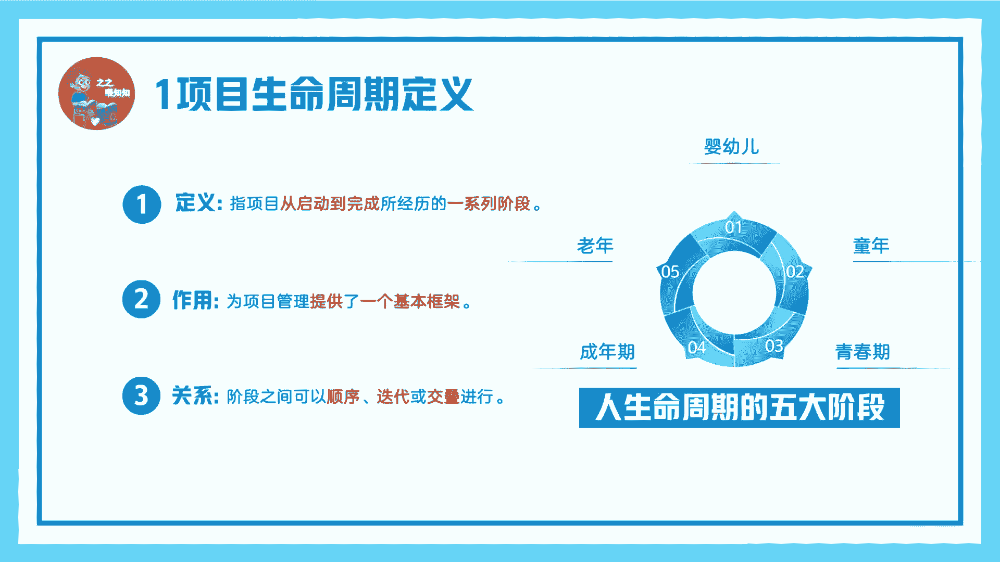
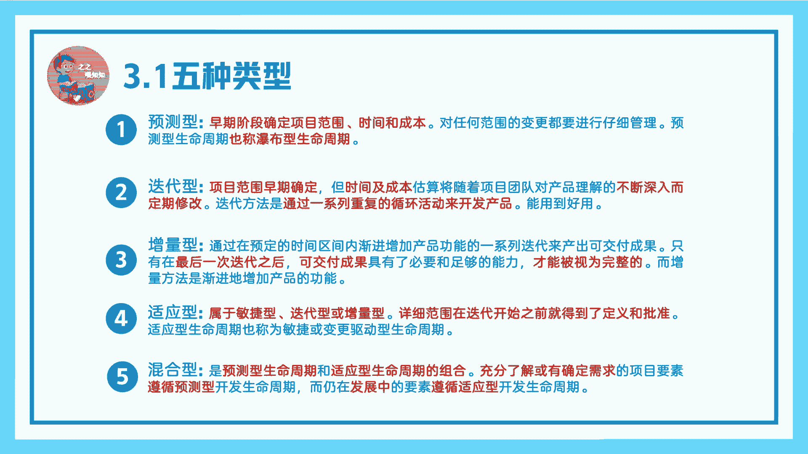
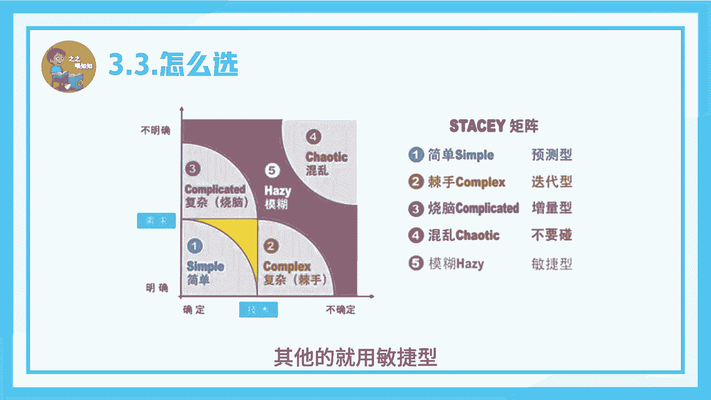
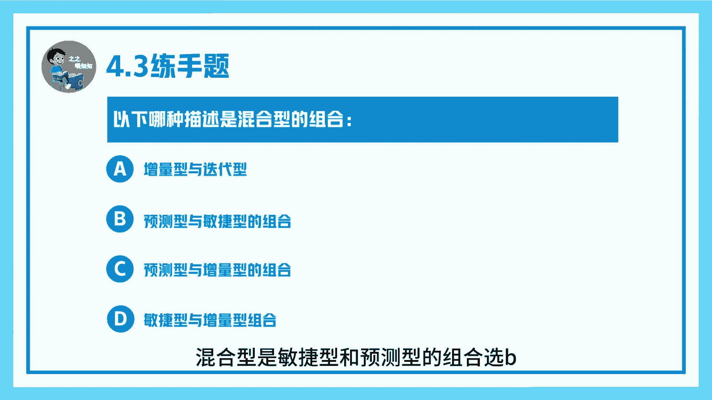
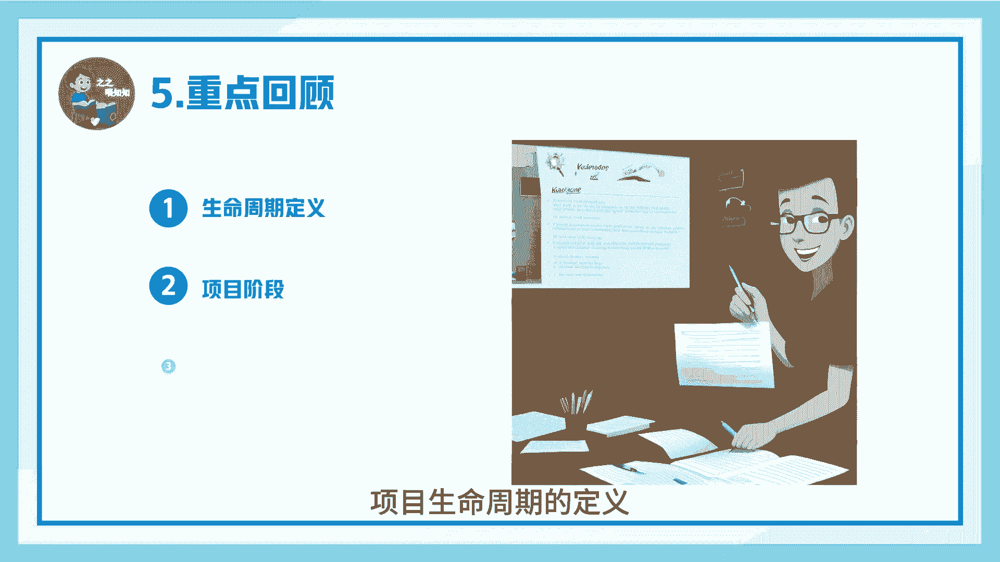

# 项目生命周期-PMP系列第六讲-之之喂知知 - P1 - 之之喂知知 - BV16ZHnegEen

12班张杰伦马上大家好，今天开始我们P用P系列第六讲项目生命周期，我是孜孜魏孜孜，首先来看一下项目生命周期定义，项目生命周期是指项目从启动到完成，所经历的一系列阶段，项目生命周期的作用在于。

为项目管理提供了一个基本框架，胸部生命周期，各阶段之间可以顺序迭代或交叉进行，用一个一人的一生来比较，我们人可能经过婴儿期，童年期，青春期，成年期和老年期五大阶段，构成了我们人的一生。

而项目的话他也有自己的阶段，我们来看一下阶段定义，项目阶段是一组具有逻辑关系的，相互活动的集合，通常以一个或多个可交付成果都完成为结束，我们书上将项目生命周期划分为开始组织执行，结束施法阶段。

每个阶段包括启动规划，执行监控收尾五大过程组，以及四大知识域，宣布阶段有典型的特征，首先它需要有名称，第二有数量，第三有持续时间，第四活动需求。

第五博弈阶段的准入退出标准，看下五种类型的消磨生命周期，预测型，早期阶段确定项目范围，时间和成本，对所有变更都仔细管理，也称瀑布型生命周期，再来看一下迭代型，迭代型项目范围，早期确定。

按时间及成本是随项目团队对产品的理解，不断深入而定期修改，迭代方法的话，是通过一系列重复的循环活动来开发产品，看一下增量习，增量习的话只有在最后一次迭代之后，项目才有完整的可交付成果。

适应型适应型属于敏捷型迭代型或增量型，他是项目范围，在迭代开始之前就得到了定义和批准，他也称敏捷型，第五混合型，混合型，是预测型生命周期和适应型生命周期的组合，他有一部分功能的话遵循预测型。

而且部分的话是遵循适应型生命周期。

对比一下我们几种类型的生命周期，首先预测型需求一开始就得到明确，它是一次性交付限制变更，不官方在你什么阶段参与项目，迭代型需求在交付期间细化一次交付，定期变更需求提交官方定期参与。

在量刑交付期间细化多次交付，变更态度的话是第也是定期变更，相关方定期参与C型频繁变化，需求频繁，多次价值交付实时变更需求相关方随时参与。

在总生命周期怎么选，我们有static矩阵，STATI矩阵为我们指出，对于需求和计数都明很明确的，我们就用预测型，对于计数不明确，需求明确的，我们就用增量型，对于需求明确，基数不明确，我们就用迭代型。

对于需求不明确，基数不明确的，我们就不要碰这种项目，其他的就用敏捷型看下练手题。

第一题，肩部生命周期，包括我们很容易想到它，包括启动组织执行和结束，选AB的话是五大过程组，其他两个都不对，第二题，项目早期旧的确定范围是成本和时间的，项目采用哪种类型，这很明显是预测型，看下第三题。

以下哪种描述是混合型，我们很容易反映出，混合型是敏捷型和预测型的组合，选B回顾一下。

我们本节主要讲到项目生命周期的定义。

项目阶段，五种生命周期类型，下一集我们将为大家讲解项目运行环境，我是知之未知之。