# 项目的基本要素｜项目关键组成部分｜生命周期、阶段关口、管理过程（上）PMP免费课程学习 - P1 - 慧翔天地软考 - BV1BN4y1U7jX

好嘞，各位同学准备了准备了，还有十秒钟时间即将开始，下午第二小段课程，今天预计下个几点呢，预计下课时间18。18点左右啊，课本上发的是17点还是17：30，我也不知道啊，预计下课时间18。18点。

为什么呢，咱学学完了活学活用啊，我们知道多快好省这四个四个要做了范围，进度成本质量，知道了这四个东西吧，好那我们讲课这个事换位思考啊，讲课这事儿我们能不能追进度呢，说我们一定要五点钟下课，不好不好啊。

那我们能不能降低质量呢，不好不好，我们能不能先砍范围，少讲一点呢，不好不好，能向大家要钱吗，不好不好，我们唯一能改的就是时间，就是时间，所以未来可能需要加课拖堂，很正常啊，加课拖堂我们能改的就是进度啊。

尽量的考虑给大家讲细一点，然后达到一定的质量标准和要求啊，不能不能不能讲的不好，对不对，还有不能向大家收钱，不能向大家收钱啊，我们能改的只能是进度，对不对，哎就是平衡平衡。

所以呢今天预计下课时间18点左右啊，项目组合项目集不是很理解，区分不太明白，不重要不重要啊，再去回去复听前面那段课程，应该应该讲的没那么难理解吧，好那接下来1。4，项目组成项目关键组成部分。

这部分知识点又开始多了啊，又开始多了，大家学习过程中一定要保持一个良好的心态，学习过程和你爬山一个道理，爬山一个道理啊，爬过一个坡再上一个坡，爬过一个坡再上一个坡啊，节节高升。

慢慢的慢慢的肯定有迷糊的地方，肯定有迷糊的地方啊，再去多听多看多听多看。

不断的巩固封，故而知新好一点，四项目关键的组成部分，这段文字超重要的啊，需要大家掌握大量的概念了，短信听了第一项目生命周期1。4。1。

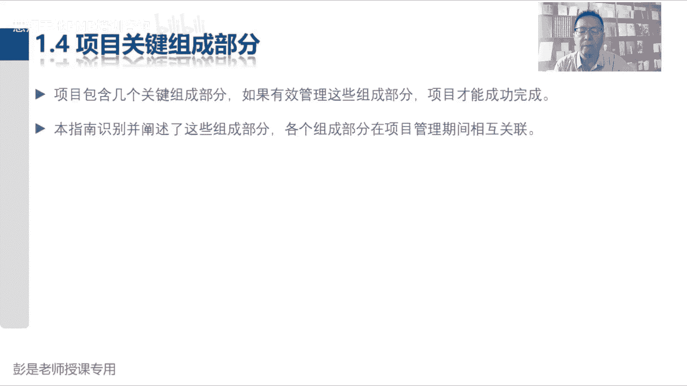

这个也不难理解吧，项目生命周期是指项目从启动到完成，所经历的一系列阶段，那什么叫阶段呢，是意图什么逻辑关系，项目活动的集合，通常以一个或多个可交付完成完成作为结束，这一阶段可能是顺序迭代交接的关系。

阶段的名称数量，持续时间88，后面都不点了，总之变成大白话就是什么呢，变成大白话就是什么呢，好不同项目阶段划分不一样，这个阶段一定要记住啊，不同项目它的阶段划分不一样，比如说我们要做个软件。

你要做个小程序，做个小程序，还做软件，软件开发里面通常通常有什么阶段呢，做科研，做项目规划，做设计，找人敲代码，然后测测测试，安装部署运维可能划分成7~8个阶段，那你要盖房子。

是不是好像阶段的命名不一样了，盖房子又不又不又不又不写代码哎，可能是可言，然后做设计，画图纸啊，施工图，结构图啊，画完图纸可能打地基，搞土方，然后盖房子，然后装修，然后打扫打扫就可以入住了。

它的阶段划分也不一样，那你要搞药品是不是还不一样呢，药品又不涉及到什么土，搞土方，对不对，打地基，盖房子，搞药品研发，你要在实验室做实验，做完实验啊，拿什么小白鼠，拿小猪都做什么活体实验。

然后呢考虑临床一期二期三期，临床三期之后呢才能够才能够上市啊，它的阶段划分又不一样，总之呢中心思想是什么呢。

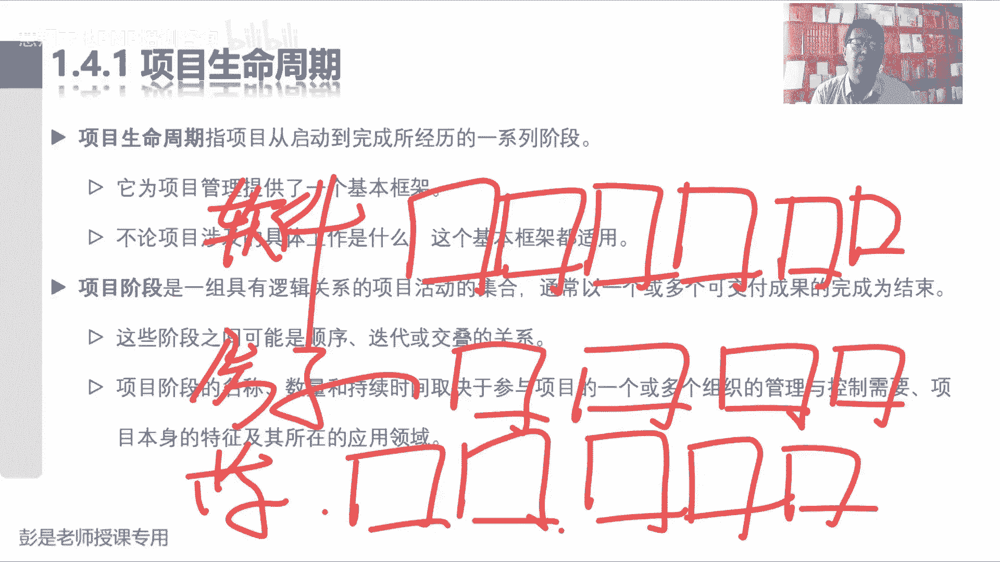

我们需要根据工作的性质，根据工作的性质，把项目从开始到结束，把它分成不同的阶段，每个阶段有每个阶段的工作重心，每个阶段有每个阶段的工作任务，这个阶段是搞设计的，这个阶段是搞施工的，这个阶段是搞装修的。

这个阶段是做保洁的诶，根据工作性质把它做做分组，以便于我们更清晰地知道什么阶段做什么事情，所以就向大家学习PV这个事情，对不对，看看我们是不是也分成了不同阶段呢，现在是听课看书这个学习的阶段。

学习的阶段过去的时候啊，嗯过去了之后，模拟考试到了这个阶段，那模拟考试过去之后啊，就是考前最后冲刺这个阶段来，所以这是根据工作的性质，根据工作的性质来把它分成不同的分段。

每个分段有每个分段的主要工作任务，这就是项目生命周期，它的它的它的它的内容是指，从开始到完成所经历的一系列阶段，这些阶段取决于这些工作的具体性质，那每个项目每个项目阶段划分是不一样的。

有的项目分五个阶段，有的项目分八个阶段，并且每个阶段的命名肯定不一样了，因为工作性质不同，搞定这个概念啊，然后再看这三个单词，这些阶段之间可能是顺序迭代或交叠的关系。

这些这段时间可能是顺序迭代或交叠的关系，这三个单词也要也要能够理解顺序，纯粹的这个意思吧，这是A阶段完成之后，B阶段，B阶段完成之后，C阶段，那交叠就是有交集啊，A阶段干的差不多了，就可以开始B阶段了。

B阶段干的差不多了，就可以开始C阶段了，它在某些某些时间上存在着交集，这就是交叠，所以呢就要搞定中间这个词了，什么叫迭代，什么是迭迭代呢，在工作里面，工作里面有没有遇到过迭代这样的场景呢。

迭代它的主要特点是什么呢，重复，循环，重复循环，他指的是工作上的重复循环，重新开展一遍，重新开展一遍，所以最好理解理解的场景，对不对，比如说啊这个场景老板让我写个文件，然后我写了一个1。0版本。

老板说这这这这都有问题，让我改，那我需要把这个文件再重新编排一遍，对不对，循环一遍了，这就是变成了2。0，以此类推了吧，老板又说这这这这需要改好，我再迭代一版，再把这个工作重复开展一遍。

就可能变成了新的3。0版本，诶，他指的是工作上的重复重复开展啊，好所以项目阶段有可能是按照先后顺序，也有可能是存在着交集并行啊，也有可能是不断的循环，不断的循环，以此类推了，迭代也有升级更新的意思吧。

重复开展一遍，做得更好，不就是升级吗，所以它的重心是把工作重复开展一遍，千万不要把这个结果和这个和这个工作对等啊，因为涉及到敏捷，敏捷里面最重要的思想就是迭代好，大概知道项目阶段，知道了生命周期的概念。

知道了这三个单词的意思就可以了，总之原则就是不同项目阶段划分不一样，有的项目五个阶段，有的项目八个阶段，有的项目十个阶段，这些阶段之间可能是先后顺序，这套串行也可能是存在着交叠关系，这就叫并行。

也有可能呢是需要不断的重复，不断的循环，不断的重复不断的循环啊，所以在粗暴理解语版这个这个写个写个文档，写个文档，老板说宋体字不好看，改成黑体好迭代一次，老板又说了，黑体字也不好看。

改成微软微软雅黑又迭代一遍，对不对，以此类推啊。

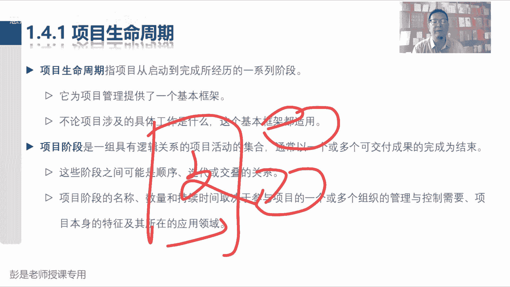

它更侧重于重复开展工作的性质，好再往下项目阶段可以基于各种因素而建立，包括巴拉巴拉，后面那段全都不念了，总之取决于管理需要，完全取决于管理需要，我要那个猪窝垒个鸡圈，垒个鸡圈，那个那个那个鸡窝。

猪圈要不要做可行性分析呢，我可能就不做了，要不要做什么设计的话，各种施工图设计图，结构图呢，我可能也不干了，我直接就上手去施工了，很可能吧，看情况，根据项目的实际情况。

有的会有的阶段可能工作量比较比较大，规模比较大比较复杂，天下大事，合久必分的，我们可以把它拆分成更多更小的阶段，可以降低项目的复杂程度啊，那有的阶段呢可能比较简单，我们就把它合并回来，以此类推。

根据我们的管理需要，根据项目的实际情况来决定，这个项目到底分成多少个阶段，就像各位同学，你中午叫外卖就直接下订单就完事儿了吧，耳熟能详的事情就很简单，不需要把它搞复杂，但是如果你叫100个人的外卖。

这事儿就要掂量掂量，如果你组织一个1000人的宴会哇，这事又复杂了吧，诶那我们就需要把它分成很多小阶段了，降低这个事情的复杂程度，知道这个意思哈，所以就有了最重要最重要这个结论。

把项目分成多个阶段的方式，有助于更好地去掌控项目管理，这事儿更好管了，因为很明确，因为很明确啊，做科研，做规划设计，做施工，搞装修交付诶更明确，同时还提供了评估项目绩效。

并在后续阶段采取必要纠正或预防措施的机会，这句话在说什么意思呢，有问题及时改，有问题及时改，总之可以帮助我们降低失败的风险，这个结论一定要记住，可以帮助我们降低失败的风险，所以再变成场景去理解啊。

怎么降低失败的风险呢，比如说甲方找我盖一个住宅小区，一共十个楼，一共十个楼啊，好做科研，做规划，做设计施工，然后装修交付交付，如果我这一口气把所有的事全完成，再来让甲方来验收，万一甲方不满意。

说这个需求跟我的这个成果跟我的需求不一样，对不对，这个楼怎么开成这个样子了，这个楼应该有电梯啊，这个地方应该有个湖啊，以此类推吧，很可能导致我们失败的成本非常非常高，所以呢为了降低失败的风险。

通常通常我们每个阶段都需要做一个评审，这是走一步让甲方看看对不对，走一步让甲方看看对不对，走一步让甲方看看对不对，这不是可以降低失败的风险吗，如果这活干错了，可以及时的纠正，这是它的重要作用啊。

好大道理。

听明白之后，1。4。2讲完了，可以看看书上这段文字，项目生命周期会受到组织行业开发方法，所用技术独特性质的影响，所以不同阶段，不同项目的阶段划分不一样，虽然每个项目都有起点终点，但具体的成果和工作。

会因项目的不同而有很大差异，你盖房子开发软件，开发药品，药品研究，做导弹，它的成果不同，但是不管项目涉及到具体的工作是什么，我们都会得出这样一个通用的生命周期，所以这段文字变成大白话，就是说。

不管你项目到底五个阶段，八个阶段，十个阶段还是100个阶段，我们总能找到一些阶段，这些阶段工作性质是开始一个项目，总能找到某些阶段，这些阶段工作，它的主要工作性质是做组织与准备，比如说我们做规划。

做设计，画图纸，这都是组织与准备，对不对，你做什么软件设计，产品设计设计，一个汽车设计一下房子，设计一下房子啊，画各种图纸啊，这都是组织与准备，还没真正动手干呢，然后总能找到一些阶段。

它的主要工作是什么呢，按照我们的规划设计做执行，把房子盖起来，打地基，开发软件，开发软件啊，都是执行，那最后执行完了之后呢，对吧，就扫尾了，总能找到一些阶段的工作去做收尾。

所以这四个阶段是不管什么类型项目，它共性的四个阶段都有这样性质的阶段，就要开始组织与准备，执行和结束。

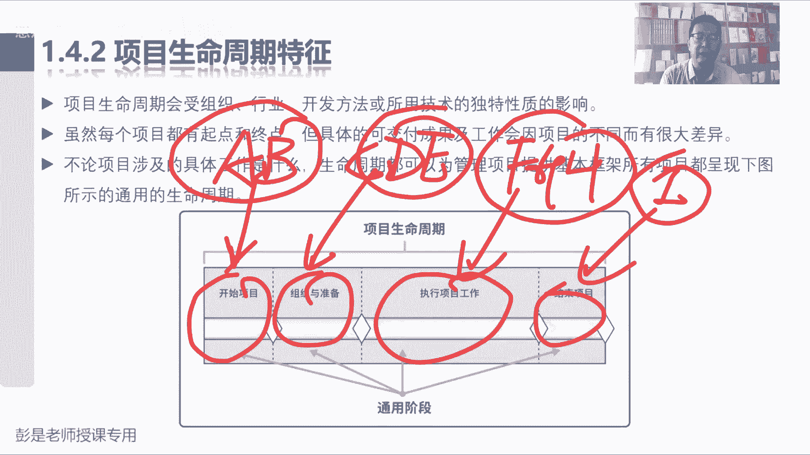

这个道理听明白就够了啊，这四个阶段到底有啥不需要背的，听明白知道知道什么意思就够了，我们总结出这四个阶段最重要的作用在后边。

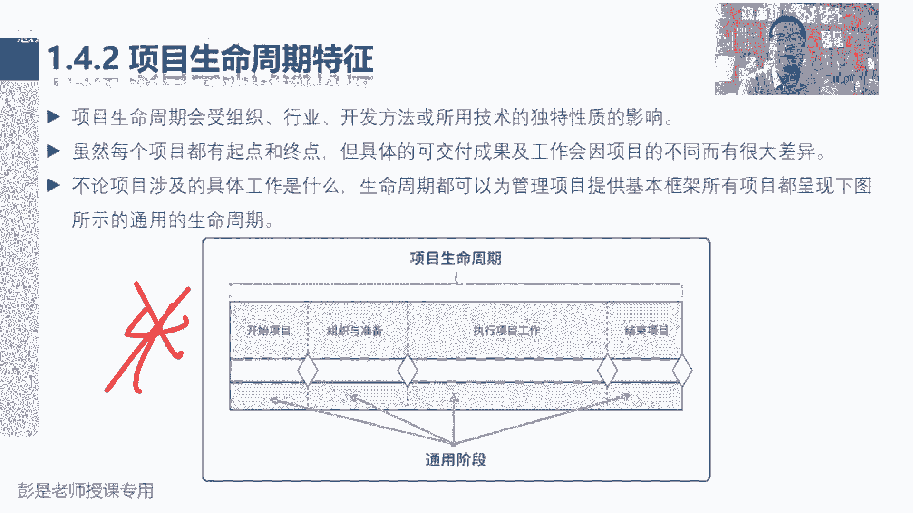

就是找特点，找规律，所以通用生命周期结构，一般可以总结出以下的特点，以下的规律就是两条交叉线，第一条交叉线看左边那张图啊，风险，这种不确定的程度在项目早期非常非常非常高，为什么呢，项目早期得到的信息少。

他比较粗略，没有那么详细啊，所以这种不确定的程度会非常高，但是随着项目渐进明细的特点，随着工作的开展，信息越来越多，越来越细化，越来越细致，越来越准确，这种不确定的程度就在有效的降低，这是这条线风险。

所以呢就有了这句话，在项目开始时风险最大，在整个项目生命周期之中，随着决策罢了，乱风险会逐步降低，那下面这条线是什么呢，变更成本，变更成本啊，就这样去理解啊，变更的成本也就是变更的代价，变更产生的影响。

变变更造成的后果是随着项目开展，随着项目开展越来越大的，为什么呢，因为我们每天都在花钱，大家的房租水电工资，对不对，社保公积金随着时间的推移，项目的成本会在不断的不断的不断的往上走，那到了项目后期。

变更的代价就越来越大，因为生米煮成熟饭了，因为木已成舟，因为大楼已经盖好了，就这个道理吧，把大楼盖好了，开业主跟你说，再加两层地下室诶，这个变更的代价非常高，非常大，那在项目早期，我们可能就是纸上谈兵。

我们在做规划设计，纸上谈兵的时候想改随时改呀，对不对，动动笔就改完了，动动笔就改完了对吧，我给客户画画图纸，我给您画了十层，客户说20层好，没问题，分分分分钟画完，对不对，就这个道理啊。

所以在项目早期变更的代价比较小，变更代价比较小，到了项目后期变更的代价会越来越高，因为木已成舟了，就有了这条交叉线，一定要记住非常重要的概念啊，好掌握了这条交叉线之后呢，再加一个小小的知识点是什么啊。

继续思考，项目有渐渐明晰的特点，随着工作的开展，这种不确定的程度会越来越低，但是呢我们随着工作的开展，成本也在不断的提升，不断的提升，那到了项目后期，这个风险一旦发生，或者是出现了问题。

或者是出现了变更，导致我们成本非常高昂，怎么避免这个问这个情况呢，怎么避免，如何避免这种尴尬的情况呢，项目后期变更的代价非常高，最好不出最好风险不发生，最好不出问题，最好不出问题，最好别改啊，少变更啊。

分阶段是个思路吧，哎分阶段不就这个思路吧，所以就带出来这样一个知识点，我们要想办法呀，想办法让问题前置，让问题前置，让问题提前出现提前发生，对不对，想办法让问题提前出现，提前发生，那怎么做呢。

就带出来刚才生命周期阶段划分了吧，你把项目分成多个阶段，多个阶段的做科研，做规划，做设计，每个阶段每个阶段需要这些人参与评审，需要这些人参与评审，那您看看我们做的对不对，对不对，现在如果改成本比较低。

不要等到后面啊，越等到等到越后，越后面变更变更的代价越高啊，所以呢就是希望我们这些相关方，这些干系人能够提前到参与到项目之中，为我们的项目贡献出他的专业知识技能，经验技巧，那对客户来说呢。

我们希望这些人提前参与到项目之中，能够说清楚你的需求诉求，期望主张，因为早发现，早治疗，早康复，就这个道理啊，把问题扼杀在摇篮里，及时的尽早的发现问题，解决问题的代价比较低，解决问题的成本比较低。

唉就提到了，最后未来我们学校学到一张相关方管理，干型管理，这是参与，希望大家能够尽早的参与其中啊，好再往下了啊，嗯所以后面这两段话就跟他说了，不显著影响成本和进度的前提下。

干系人改变项目产品最终特性的能力，在开始时最大，为什么呢，这个叫影响力，这个叫影响力啊，因为早期纸上谈兵变更的成本比较低，您说啥是啥，它随着项目的进展而减弱，为什么呢，因为到了项目后期，木已成舟啊。

您不能胡来啊，不能胡来，对不对，所以呢有了最后这个节目再也不念了啊，做出变更和纠正错误的成本，通常会随着项目越来越接近完成而显著提高，因为项目的成本到了后期，马上的命令往上走啊。

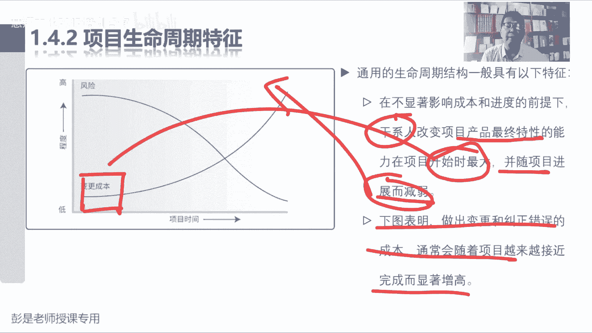

好就这一段非常非常重要啊，再往下1。4。3，快速回顾一下，刚才有没有印象中听到过这个单词的阶段，关口是在项目阶段结束时进行，将项目的绩效和进度，与项目和业务相关文件比较。

变成大白话是说这些文件包括商业论证，章程计划，教育计划，唉，我们把项目为了降低风险，为了降低风险，把项目分成多个阶段，然后呢项目启动之前，我们有两个重要的事情啊，一个叫商业论证，一个叫效益计划。

去分析这个事情的可行性和价值，那我们在项目开展的过程中，需要这样一个决策点，这个决策点最重要的工作就是，仍然分析项目是否还有可行性，是否还有价值，可是否还有可行性，是否还有价值，通过第一阶段的工作。

我们发现经过分析啊，这个项目不值得做了，不赚钱不赚钱，我们可能就不做了，诶，他做这样的决策点，这就叫接种关口，做决策，做决策，所以他怎么决策呢，就是这一大堆文件就称之为理想，项目的绩效是什么呢。

就是实际情况现实啊，我们用理想和现实来做比较分析，是否还有可行性，是否还有价值，所以变成大白话，就是原计划第一个阶段这样这样理解啊，原计划第一个阶段收入10万块钱，我们的成本是5万，能赚他5万。

现在实际情况第一个阶段收入只有8万，但是实际成本呢12万严重超支啊，那未来我们可能一分析未来可能干的越多，错的越多，咱就及时止损，这项目咱就不玩了，那如果通过分析现实情况发现诶，第一个阶段确实能够赚钱。

那我们继续再往后走。

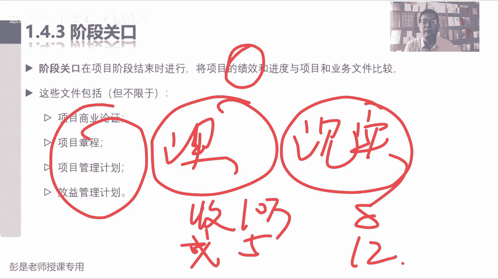

就这个东西，这就是阶段班考的重要作用啊，做决策，所以就带出来后面这一大段话，我们根据比较的结果，根据分析的结果来做决策，决策的结果可能是各种各样的，这五个角色角色的结果不太需要去背，不用背啊。

能看懂就够了，进入下一个阶段，纯字字字面意思吧，整改后进入下一个阶段，用到了整改说明什么呢，说明有问题，那还能够进入下一个阶段，说明什么呢，说明这个问题啊，不大对不对，小问题没关系啊，结束项目。

这可能过分了吧，这说明项目可能没有可行性，没有价值了，停留在当前阶段，可能形势不明朗，按兵不动，等一等，重复记账或某个要素就返工去了，大概知道这个意思可以可以了啊，这五个东西不太需要去背的。

但是讨厌的地方来了，后面这句话，这几个单词需要耳熟一点，耳熟一点啊，嗯在不同的组织行业或工作类型之中，街道关口可能会被称为阶段审查阶段，门关键决策点阶段入口阶段出口就是不同行业，不同企业用词习惯。

用词不一样，所以呢教材就把它全都罗列出来了，但考试来说，基本上大多数情况下就用阶段关口，这个专业术语也有可能使用其他术语，所以这几个单词需要印象稍稍深一点，好9296同学说，谁来组织做阶段关口呢。

好问题啊，谁来组织呢，有没有可能和组织那个商业论证的，是同一个人呢，就这个东西吧，哎发起人呐，发起人牵头分析可行性，分析价值，那阶段关口阶段关口也是发情的嗯，发起人来搞吧，他来负责牵头搞啊。

那需不需要高层参与呢，不知道最好最好参与啊。

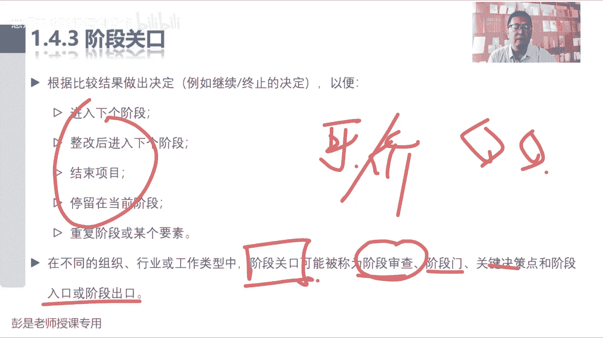

好调整下了啊，1。4。4，开发生命周期这个术语啊，这个术语啊，说项目生命周期可以是预测性和适应性，现在没讲到适应性的啊，马上会讲，项目生命周期内，通常有一个或多个和产品服务成果开发相关的。

那这些阶段称为开发生命周期，这个开发生命周期这个术语有印象就够了，粗暴理解，我项目有ABCDE5个阶段，其中BCD3个阶段和产品开发有关系，那咱就把这三个阶段称之为开发生命周期，就这样有印象就够了啊。

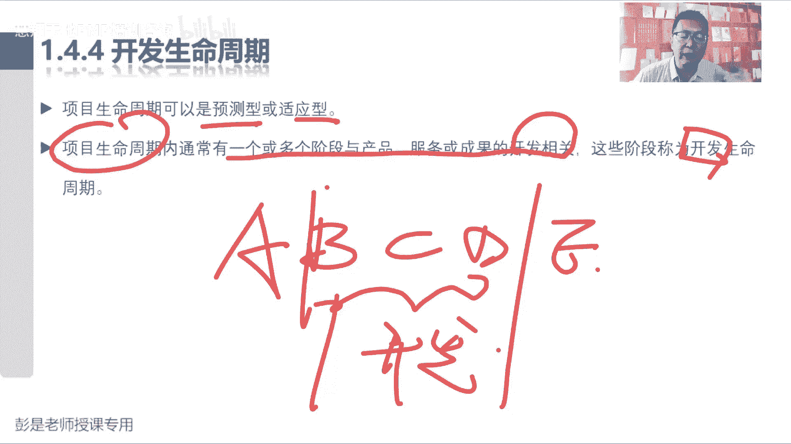

不太重要的知识点，但是再往下走，开发生命周期可以是预测迭代，增量适应或混合模式，预测型迭代型，增量型，适应型生命周期百分之百要掌握，要能理解的知识点非常重要，因为后面我们就要兵分两路了。

先去学一学传统的管理方法，基于过程的再去学一学，嘿多变环境下的项目管理方法，就叫敏捷，这叫适应性，生命周期就是敏捷好，那这段这段知识点讲讲知识点之前，再给大家粗暴的想场景，去理解这些这些东西的用途啊。

怎么去理解它呢。

等我找到一个比较空白的空白的PPT啊，先搞定预测型号，什么情况下用预测型啊，什么情况下用预测型呢，刚才说我们开公司目标，远景使命价值观，然后定战略，战略之后，定了之后呢，就有了项目和运营工作，好。

现在假设假设啊，咱们一帮同学，咱们来联合创业，我们要成立一家公司，成立一家公司叫什么呢，据信叫句信啊，好我们的拳头产品主打产品是什么呢，就和微信一模一样，所以我们战略三步走，战略三步走。

第一步我们的策略叫什么呢，超给我做一个和微信一模一样的东西，抄就这么不要脸，给我做一个和微信一模一样的东西，诶那第一目标明确不明确呢，需求明确不明确呢，范围明确不明确呢，明确吧，对不对，范围很明确了。

微信有啥功能，咱就做什么功能给我抄的一模一样啊，所以呢他叫范围明确，过程中有没有太多变化呢，咱这个范围不变不变啊，过程中不一定有太多变化，唉这种情况下我们就用预测型生命周期，就这么赤裸裸的抄就可以了。

对不对，所以它的特点是什么呢，以结果为导向，你给我抄一个一模一样的，最后把东西做出来，我来检查一下是不是一模一样，如果真的一模一样，验收打款完事儿了，所以他可以做到一次交付，能听懂吧。

可以做到一次交付的中间，你这个什么开发过程，设计过程，不要找我，不要找我啊，我就看结果，只要结果一模一样就OK了，就这个东西吧，所以范围明确，能够做到一次交付，我们就用预测型生命周期，为什么叫预测型呢。

未来可以预测呀，结果可以预测呀，范围明确，没有太多变化，结果可预测吧，诶这叫预测型生命周期，所以不好理解不好理解的同学，你前面加一个可字就完事了，对不对，可预测，可预测嗯。

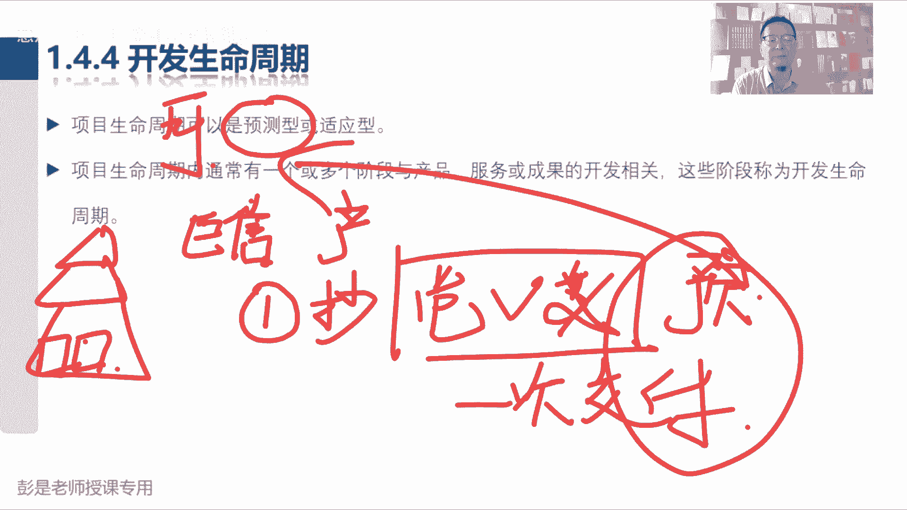

这是预测型啊，那什么叫适应性，什么叫适应性啊，再回到我们这个公司，对不对，战略第一步，我们这个定的策略叫抄，叫抄啊，战略规划，第二步说我们我们这个东西一旦上线了，一旦上线了，哎我们需要竞争，对不对。

需要竞争啊，人家说陌陌好，人家说丁丁好，人家说微信好，微信啊，屏蔽展，屏蔽展，咱要还打通，打通京东淘宝拼多多呀，以此类推吧，诶变化多了，在这么竞争激烈的行业，竞争激烈的行业变化多。

我们到底是朝着什么方向去发展，其实是不确定的，我们要取决于客户的反馈，竞争对手的措施，考虑什么政策，法律法规，考虑商业环境啊，所以叫变化多，那我们发展的方向不确定范围不确定，我们用什么生命周期类型呢。

我也不知道要做什么，但是我们需要能够快速响应，需要能够快速响应了，今天微信把我屏蔽了，明天我就屏蔽你啊，今天你和拼多多联盟了，那我明天就找就找什么淘宝，对不对，以此类推了吧，嗯好。

这种情况下需要根据商业环境的变化，根据用户的反馈快速下跌，但是呢到底做什么功能可能不确定啊，走一步看一步了，就叫适应性，就是敏捷，我们要尽快的尽快的根据市场的变化，根据客户的反馈出我们的功能来打败对手。

就是白热化竞争，这个阶段就要快，就叫适应性生命周期，然后咱战略规划第三步是什么呢，就思考啊，现在我们抄了微信，然后呢又经过了经过了斗争，把他打败了，第三个阶段呢，一家独大垄断，第一我们到底做什么。

不确定不确定啊，第二要不要这么快呢，不需要了，垄断了，着什么急呢，对不对，所以我们就要定期的出一些新的功能就可以了，这种情况下就用中间那两个单词组合到一起，就叫迭代增量，定期的把工作开展一遍。

出一个新功能，定期的把工作开展一遍，出一个新功能，就有了迭代和增量，这个模式好，大概知道这个意思啊，所以其实不同行业，不同产品，不同企业，你发展到不同阶段，可能采用不同的方法去做这个事儿，对不对。

那像微信刚出来的时候，就用敏捷英文，要快快速的推出一些一个产品，然后呢根据根据市场的反馈，因为是新鲜事物啊，对不对，微信刚出来的时候，什么被移动，被移动告，被联通告说你抢了我们短信的生意啊。

哎那就需要快速响应，所以呢他就用了敏捷这样的方式，然后到了现在这个阶段呢，他就迭代和增量定期的推出一些新功能吧，可能一两个月两三个月出个新功能，它要求稳求问啊，那什么情况下微信会用预测型生命周期呢。

在思考什么情况下，微信会用到预测性生命周期呢，什么情况下微信会自己抄自己呢，嗯还移植弄个手，把手机版的微信弄到电脑版里抄，对不对，或者是发现，比如说啊粗暴理解竞争对手出了个新玩意儿，我们觉得挺好抄。

对不对，总之范围明确对不对，海外版以此类推吧，哎看人家做抖音做火了，我们出小视频抄，以此类推啊，所以就是根据我们项目的实际情况。

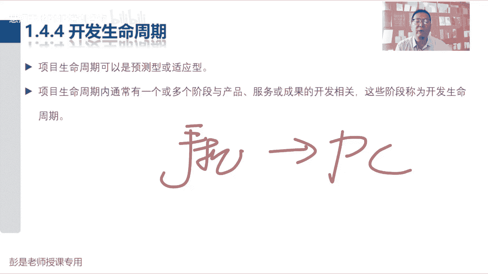

我们需要去分析采用什么样的开发方法，如果范围明确，就是这句话啊，在早期阶段我们就能够确定项目的范围，时间和成本，这种情况下我们就可预测一次交付，对不对，那可预测可预测范围既然说定了。

所以呢对任何范围的变更都要仔细管理，尽量的尽量不要改，要控制变更，这是第一种，再看最后一种，适应性生命周期也叫敏捷详细范围，在迭代开始之前得到的定义和和批准，这句话大家现在现在掌握不了啊。

掌握不了就先不要看它，不要看它啊，总之总之它的范围不明确，我们需要小步快跑，走一步看一步，走一步看一步，这叫敏捷，适应性，适应性生命楼梯，那中间这种呢把它俩加到一起就叫迭代和增量。

这是定期定期推出一些新功能，定期推出一些新的产品服务成果，知道了这个意思就够了啊，未来还会反复讲这段知识点。

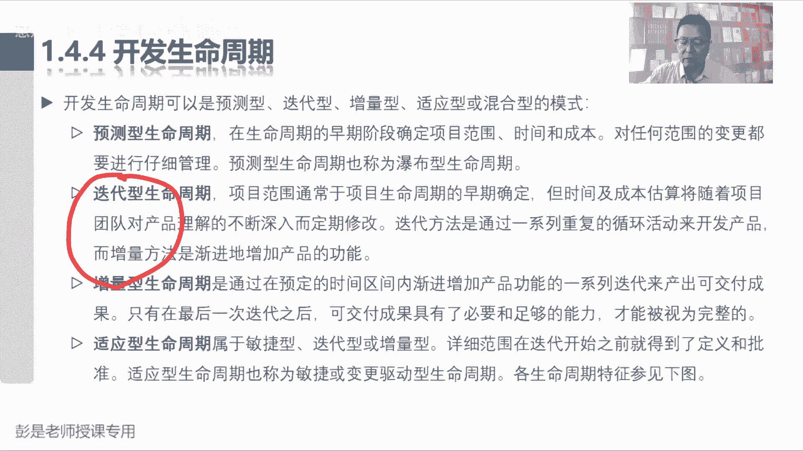

好所以就带出来这张表，再回顾一下刚才讲的这个模式啊，预测型是指说需求在开发前预先确定，那我们就可以做到一次交付，就可以做到一次交付，所以呢需求明确，需求明确，那我们就要自然而然的尽量限制变更，最好别改。

所以呢大家不需要持续参与特定里程碑点，你定期来看一看，甚至最后交付的时候再看都可以啊，这就是预测型生命周期，在这样的场景下，它有它的优点，那敏捷性生命周期呢再看最右边，这是需求在交付期间才会频繁的细化。

那到底做什么，现在说不准呢，所以变化多，那频繁的交互有价值的各种子集，走一步看一步，走一步看一步，那我们就可以把什么什么变更融入项目，持续参与啊，所以他更关注的是时效性，需要能够快速响应啊。

所以他用的频繁实时持续这样的单词，中间这个迭代和增量和敏捷有什么区别呢，实际上它的工作方式差不多，它的区别主要就在于周期。

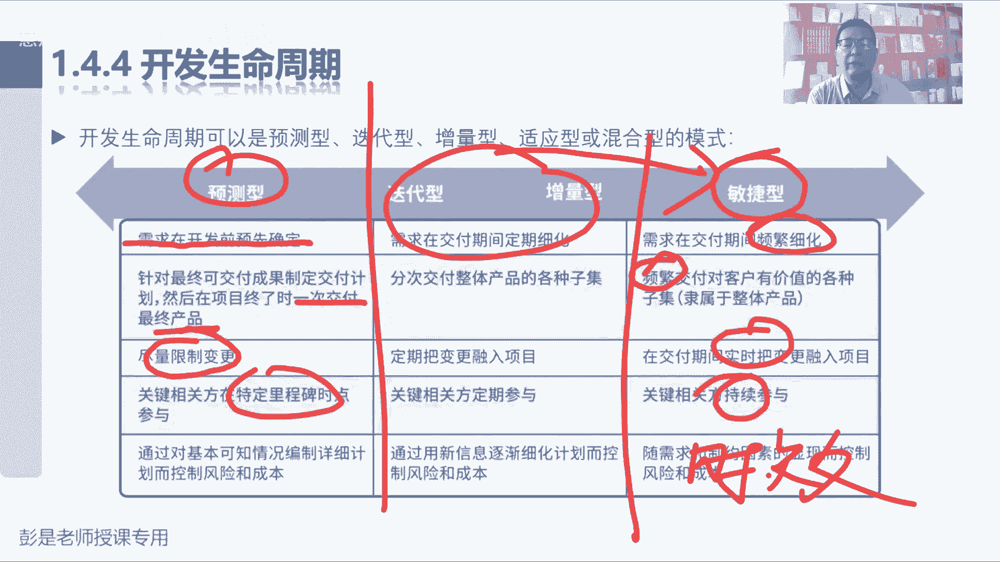

它的区别主要就在于周期，敏捷可能需要我们一周两周就出一个新功能，它需要非常快的，那迭代和增量呢通常大于四周，一个月，两个月，三个月，它通常迭代的周期会更长，它本质上游戏规则是一样的啊。

就是周期长短的区别，所以中间这个完全可以让他去死，学不学没关系，因为游戏规则是一样的好。

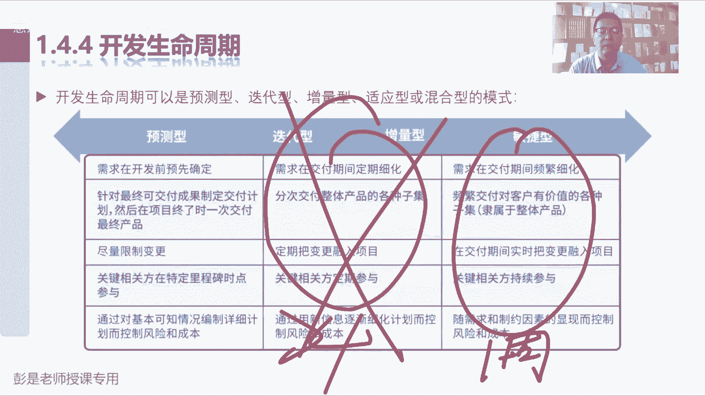

这就是关于1。4。4这几个概念，一定要掌握非常重要的知识点啊，所以大家活学活用，你可以放到任何一个场景里面去，理解这个概念对吧，什么情况下直接要结果，什么情况下走一步看一步，以此类推吧。

所以在在粗暴这个场景，便于大家更好的去，更好的去理解他的中心思想啊，比如说比如说你去餐厅吃饭，鱼香肉丝，宫保鸡丁，什么软炸里脊，水煮鱼，水煮肉，就这些东西，如果你都吃过了，如果你都吃过了。

还还还觉得味道不错，下次是不是可以一次交付了呢，因为它是确定的，对不对，你确定这些东西好吃啊，饭没确定啊，就可以做到一次交付了，点五个菜，老板都给我做好，你就不管了，你就不管了啊，过程中尽量少参与。

我们以结果为导向，那如果这些菜都没吃过，你也不知道好吃不好吃，你会一次点五个菜吗，还是说还是说基于风险这个视角，我们最好吃一个看一看，吃一个看一看，吃一个看一看，这不就是循环嘛，对不对，先点菜先来一个。

然后我们吃看看好吃不好吃，再点第二个菜，再点第二个菜啊，再吃再点第三个菜再吃，如果如果过程中发现不好吃，这家餐厅做的菜一般咱就不吃了，及时止损呐，因为需求不确定，因为变化多，所以点菜吃，这就是迭代。

这不循环嘛，对不对，点菜吃，点菜吃，把这些工作循环一遍，循环之后呢，我们会得到一个体验，这就是增量了，这个菜还好吃，这个菜也好吃，这个菜不好吃，这就是增量，吃一堑长一智啊，就这个大道理吧。

所以它普遍适用于任何一个场景啊，大家学习也是迭代和增量啊，现在在听课，听第一章听完之后呢，大家需要去看书，看第一章，然后呢做题做章节练习题，做第一章，这些工作完成之后就会得到一些知识。

这不就是迭代加增量吗，再去听课看书做题，做第二章，然后又得到了新的知识，循环得到一些新的东西，循环得到一些新的东西，如果所有的知识你都知道，所有的知识你都学完了，你就可以预测了一次，把这本书看完风险低。

因为都学过了，如果没学过的情况下，你一次把这本书看完，什么都记不住啊，那为了降低风险，那就阿拉米的小步快跑，对不对，听一段记一些知识点，听一段记一些知识点，可以降低风险。

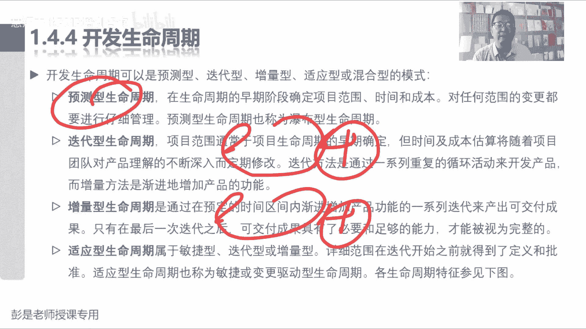

好知道这个意思啊，不解释了，不再举例子了啊，再举就太多了，最后这个单词也需要大家记住啊，混合型混合型是什么意思呢，迭代迭代和就是敏捷加预测，所以变成人话，就是说根据项目生命周期的情况。

有的阶段该预测的就预测，有的阶段可能变化多，该适应它就适应，这就叫混合，根据项目的实际情况，该预测就预测，该敏捷的就敏捷，好，知道这个意思啊，所以说大家那个去年去年今天都在用的。

那个健康码刚出来的时候不也是敏捷吗，要快速的根据疫情的形势地对吧，玩了命的快啊，玩了命的出啊，得得四天做个健康码，过两天做个扫码登记，要快啊，敏捷对不对，因为疫情形势形势着急呀，着急呀紧迫呀。

然后发展到了后期，这玩意儿就不着急了，定期的出一些新的功能，对不对，就是迭代加增量，然后什么情况下用预测呢，移植啊，对不对，什么支付宝里有健康码，微信里面也有健康码，做的一模一样啊。

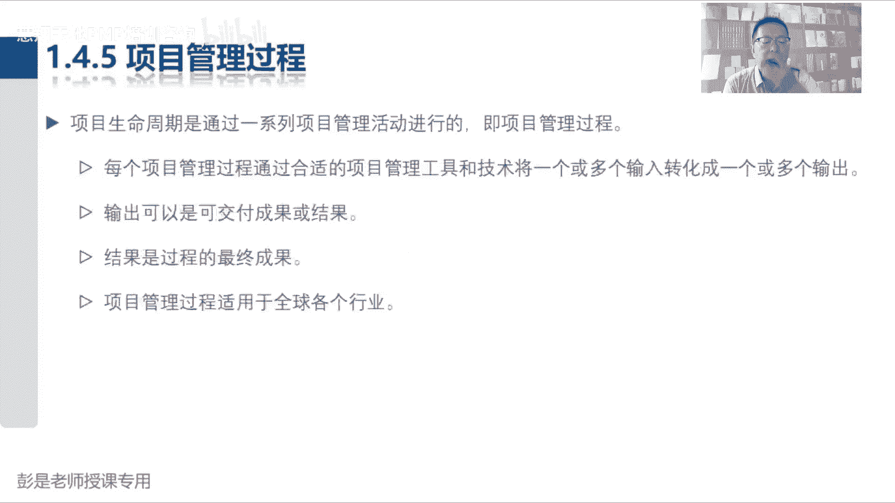