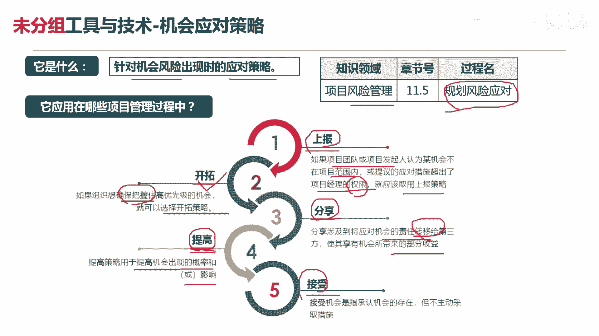
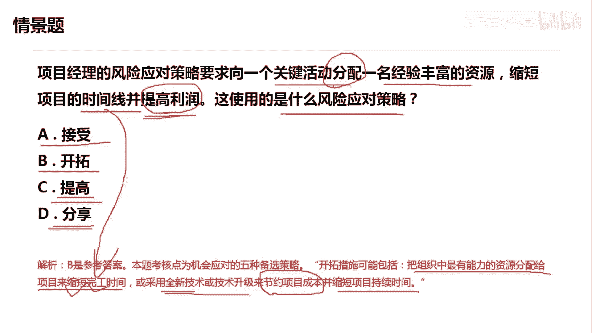

# 项目管理60个实战工具大全 - P10：机会应对策略 - 清晖在线学堂 - BV1tH4y1B7nA

各位同学大家好，我是宋老师。

今天我们来看机会应对策略，机会应对策略呢主要是应对机会的风险，出现时的一些应对策略，它主要是在风险管理的规划，风险应对过程中所使用，因为我们是要考虑有哪些机会的应对策略，所以它是属于规划过程组。

机会应对策略呢它有五种应对，一种呢叫做上报，第二个呢叫开拓，第三个叫做分享，第四个叫提高，第五个叫做接受，其中上报策略和接收策略呢，它和威胁的应对策略当中是一样的啊。

因为威胁的应对策略当中也有上报和接受，我们先来看上报，上报呢，它是如果项目团队或者发起人，认为某机会不在项目范围内，或者提议的应对措施超出了项目经理的权限，那么在这种情况下，我就应该采取上报策略。

但一旦上报之后呢，我项目经理其实就不用管这个机会了，所以它和接收策略不太一样，接收策略当中有一个叫做被动接收，被动接收呢我还是要对他进行监督的，不像上报连监督都不用监督。

那么接收策略当中呢还有一个主动接收，主动接收呢，他是会准备一些应急储备，准备一些备选方案来接收这个机会所带来的，这种影响，好另外的三种呢，一个是开拓，开拓策略呢，它是如何组织。

想确保把握住高优先级的机会，就可以选择开拓策略，他要确保把握，所以是百分之百的去拿下这个机会，因此呢他一般会把组织当中，最有能力的资源去拿出来用，或者采用一些新技术，新方法去抓住这样的机会，分享策略。

它是涉及到将应用机会的责任转移给第三方，使其享有机会所带来的部分收益，所以它和威胁应对策略当中的，这种这个转移是对应的，因为转移呢他是把威胁转移给第三方的，保险公司，由他们来承担这个威胁带来的一些损失。

但是分享不一样，分享是和大家一起去挣钱，他是把这种机会呢也是转移给第三方，由第三方合作采取这个收益，所以呢他一般会采用一些联合公司啊，合伙人的这种机制形式，第四种呢叫做提高提高策略呢。

它主要是用于提高机会出现的概率或者影响，提高，它一般是增加资源，用增加资源的方式去提升机会发生的概率，因此呢它和这个威胁应对策略当中的，这个减轻措施也是对应的，因为减轻措施呢。

它往往是减轻威胁所带来的一些损失，比如说他会用这个原型法呀，或者说多次的测试啊，来去发现一些风险，减轻一些影响好，所以这个是提高的特点，提高特点。

增加资源，我们来看这样一道题，项目经理的风险应对策略，是要求向一个关键活动分配移民经验，丰富的资源，缩短项目的时间线并提高利润，这使用的是什么风险应对策略呢，首先我们看到他呢是提高利润的。

所以它一定是一个机会，它不会是一个威胁，因为威胁呢往往是带来一些损失，接收策略，刚才我们说了接收策略呢，它分主动接受和被动接收，如果是主动接收，它往往是准备一些应急储备。

或者呢一些这个延长的这种这个进入时间啊，等等这种方式，但是我们这道题目很显然用不到这个接收策略，开拓开拓，它是可以去这个分配关键的这个资源，然后呢这个缩短我们的这个时间线，提高利润，采取一些新的技术。

这个开拓是可以对应我们的这个情境，提高提高呢它主要是增加资源啊，我们这里面是分配资源，它增加资源呢它是需要提升这个机会，抓住它的概率啊，这个题目呢他没有提到提高的一些应用场景，分享呢。

它主要是把机会带来的收益呢分享给第三方啊，建立合伙人的这种机制形式，因此呢也不符合我们的情景描述，因此呢这道题目呢我们是应该选择开拓开拓，他主要是把组织当中最有能力的资源，分配给项目，来缩短完工时间。

好缩短完工时间，缩短时间线，或采取一些全新的技术或者技术升级，来节约项目的成本，并且缩短项目的持续时间，因此呢我们这一期呢是选择开拓这个工具好，今天呢主要是和大家分享的是机会的应对策略。

我们下次再见。

