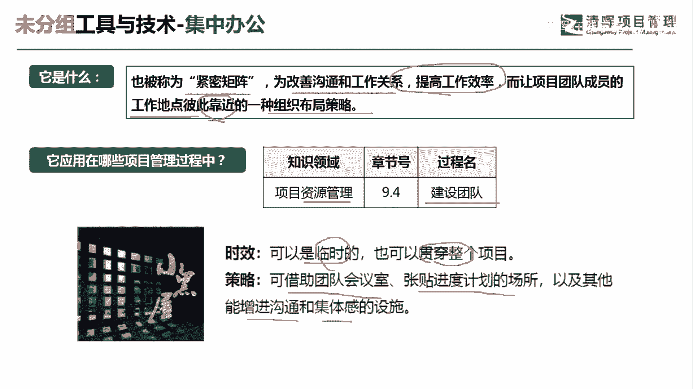
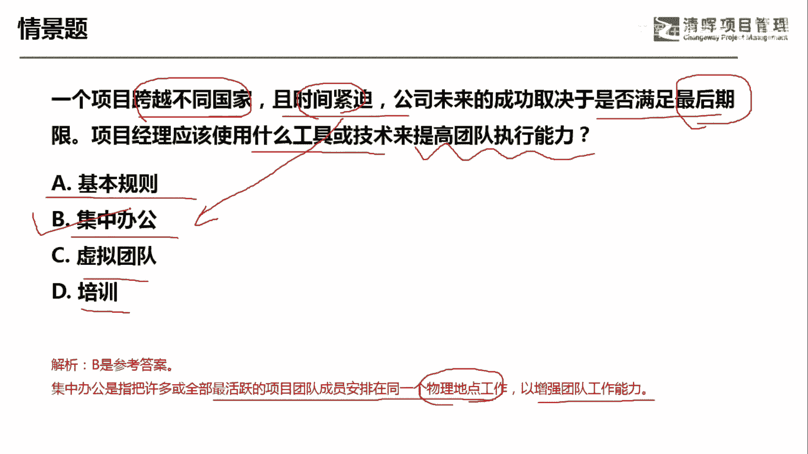

# 项目管理60个实战工具大全 - P12：集中办公 - 清晖在线学堂 - BV1tH4y1B7nA

各位同学大家好，我是宋老师。

今天我们来看集中办公这个工具，集中办公也被称为紧密矩阵，他是为改善沟通和工作关系，提高工作效率，而让项目团队成员，工作地点彼此靠近的一种组织布局策略，这个集中办公呢。

它往往是在资源管理的建设团队过程中使用，为什么在建设团队过程中使用呢，因为我们建设团队主要的目的，就是要打造一支高绩效的团队，让我们提高一些工作效率，像这种集中办公呢就是一个不错的工具。

集中办公呢它从时效性上来讲呢，可以是临时的，也可以是贯穿整个项目生命周期，像我们有时候呢邀请外部的一些这个开发团队，进入到公司中来，那么他们呢就属于一种外包团队，有时候呢我们就会用集中办公的方式。

把它们组织在一起，所以呢我们可以借助团队的会议室，张贴进度计划的一些场所，以及其他能增进沟通和集体感的一些设施，我们可以看到在集中办公的场地呢，往往首先成员基本上是同一个团队。

另外呢我们在他的这个墙壁上啊，这些可看的这些地方呢都可以看到一些标语啊，或者是这个进度甘特图的这种表现，那这种呢其实就是一个集中办公的这个场所，他可以去增进沟通，可以去满足一些集体感。

所以它相对于这个虚拟团队来说呢，他从这个团队的凝聚力上来讲更加这个优胜，另外呢，集中办公往往是在这个我们遇到一些里程碑，快要接近的时候，遇到一些紧急情况的时候，这个时候呢往往用集中办公效果会更好。

我们来看这样一道题，一个项目跨越不同的国家，且时间紧迫，公司未来的成功取决于是否满足最后的期限，项目经理应该使用什么工具和技术，来提高团队的执行能力，一个项目跨越不同的国家，那有可能他是一个虚拟团队。

但是呢他时间紧迫，公司未来呢成功，就取决于你是否能满足最后的这个交付期限，那在这种情况下属于紧急的这种情况，那我们宁可让大家买飞机票都集中在一起，提高工作效率啊，A选项基本规则。

基本规则它是在我们管理团队的时候，遇到冲突的时候，有时候呢会有一些基本规则来制约，这种大家的这种处理方式，处理问题的方式，比如说会考虑到冲突，管理它的一些流程，那这些大家都会默认的一些规则。

但是呢我们这道题目主要是讲，虚拟团队遇到时间紧迫，要在最后期限交付，那应该怎么办啊，这个情景怎么办，那肯定不能用基本规则，基本规则往往是遇到冲突的时候再去使用，集中办公，可不可以集中办公，可以为什么呢。

因为他遇到时间紧迫，日期即将来临的这种情况，我们可以用集中办公提高工作效率，虚拟团队呢，虽然我们这道题目他讲到跨越不同的国家，它其实本身就是一个虚拟团队，做了一个项目，但是呢因为时间紧迫。

所以呢你不可能再用虚拟团队的这种方式，所以你要改变工具，培训，培训往往是在我们情景当中，说明你缺乏某一类技能的时候，我们可以用培训的方式，这道题目呢我们应该是选B选项，集中办公。

是指把许多或者全部最活跃的团队成员，安排在同一个地点，物理地点工作，以增强团队的工作能力，还可以提高沟通的效率，这一题呢我们是选B选项，好，今天主要和大家分享的是集中办公这个工具，我们下次再见。

