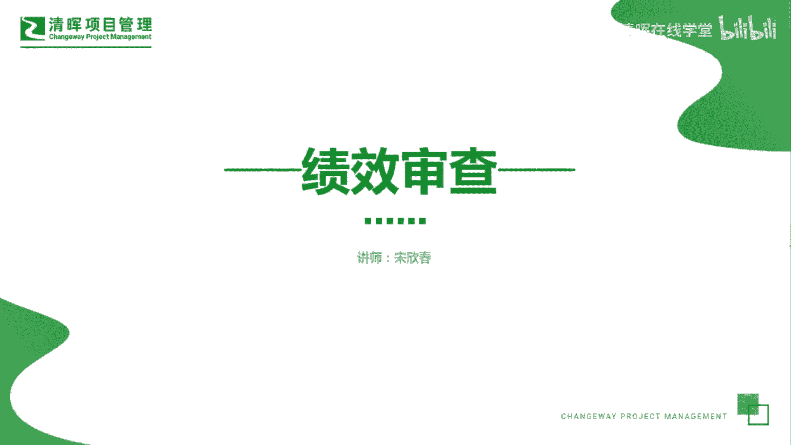
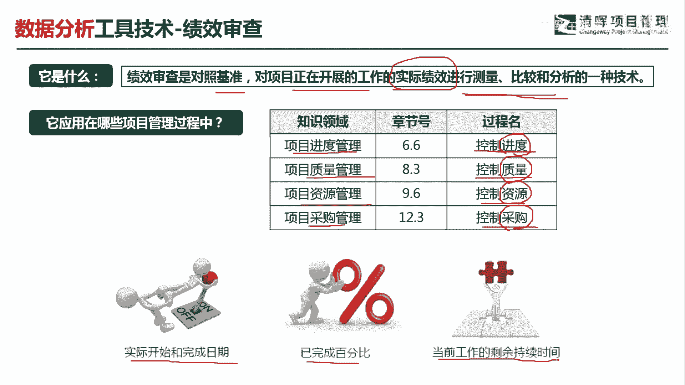
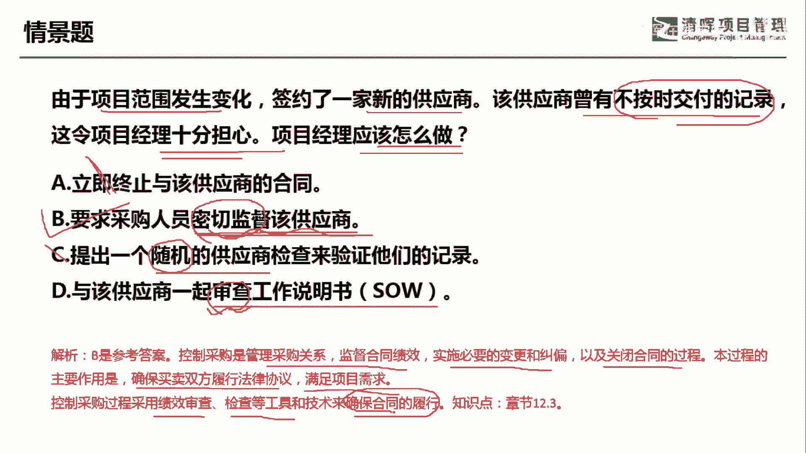

# 项目管理60个实战工具大全 - P13：绩效审查 - 清晖在线学堂 - BV1tH4y1B7nA

各位同学大家好，我是宋老师。

今天我们来看绩效审查这个工具，绩效审查主要是对照基准，对项目正在进行的工作的实际绩效，进行一个测量比较和分析的一种技术，所以这个工具呢，基本上都是在监控过程中所使用，在项目的进度管理，控制进度过程中。

以及在质量管理的控制，质量过程和资源管理的控制，资源的过程和采购管理的控制，采购过程中都会用到绩效审查，因为比如说我们要考虑进度的完成情况，那这个是要进行进度的绩效审查的。

还有质量的绩效是否达到我们的质量标准，也要进行进这个质量的绩效审查，资源是否完成到位，是否够用，这个时候呢我们也要看他的绩效审查，比如说人的资源，他的这个绩效完成情况，还有采购管理的时候。

为什么也要这个控制采购会采用到绩效审查呢，因为我们和这个供应商进行签订合同的时候，我们会考察它的各个阶段的这个采购完成情况，所以也会在控制采购过程中使用到绩效审查。

比如说我们的合同当中有开始时间和完成时间，中途呢我们会看到它的完成百分比，会得到他当前工作的剩余时间，而这个呢其实就是一种绩效审查得到的结果。

我们具体来看这样一道题，由于项目范围发生变化，签约了一家新的供应商，该供应商曾经有不按时交付的记录，这是一个不好的历史，这令项目经理十分担心啊，他是十分担心，但是并没有这个出现实际的情况。

问项目经理应该怎么做，A选项，立即终止与该供应商的合同，这个呢太绝对化了，太狠了对吧，我们不应该立即就终止，因为这个毕竟是一种担心，并没有说他现在也会发生这种情况，B选项要求采购人员密切监督该供应商。

这个可不可以，这个是可以的，因为密切监督呢，它其实就是代表了控制采购过程中，我们经常要用到一些这个审查审计啊，包括我们的绩效审查，去了解这个供应商的完成情况，避免呢它再次发生不按时交付的这种记录。

C选项提出一个随机的供应商检查，来验证他们的记录，随机的供应商检查呢，只是我们密切监督该供应商当中的，一种手段而已，你管他是随机还是不随机的，其实都是密切监督，对不对，所以B呢包含了CD选项。

与该供应商一起审查工作说明书，我们现在呢只是十分担心，并没有说他出现了不按时交付的记录，所以你没必要，一开始就是审查这个工作说明书啊，工作说明书呢，它主要是告诉我们应该怎么样去完成，这个项目的交付。

所以在这个时候不需要去审查，除非他发生了这个不按时交付的记录再去审查，因此呢我们这一题应该选B选项，做好监督控制采购，它是管理采购关系，监督合同绩效，实施必要的变更和纠偏，以及关闭合同的一个过程。

这个过程的主要作用呢是，确保买卖双方履行法律的协议，满足项目的要求，我们这个控制采购过程呢会采用一些绩效审查，检查等工具和技术来确保合同的履行好，今天呢主要和大家分享的是绩效审查这个工具，我们下次再见。

