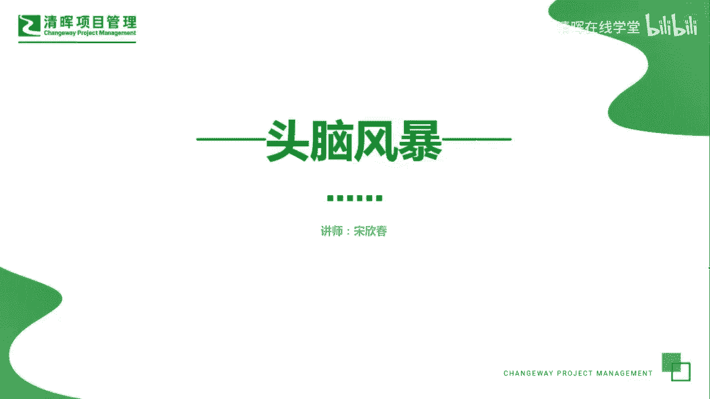
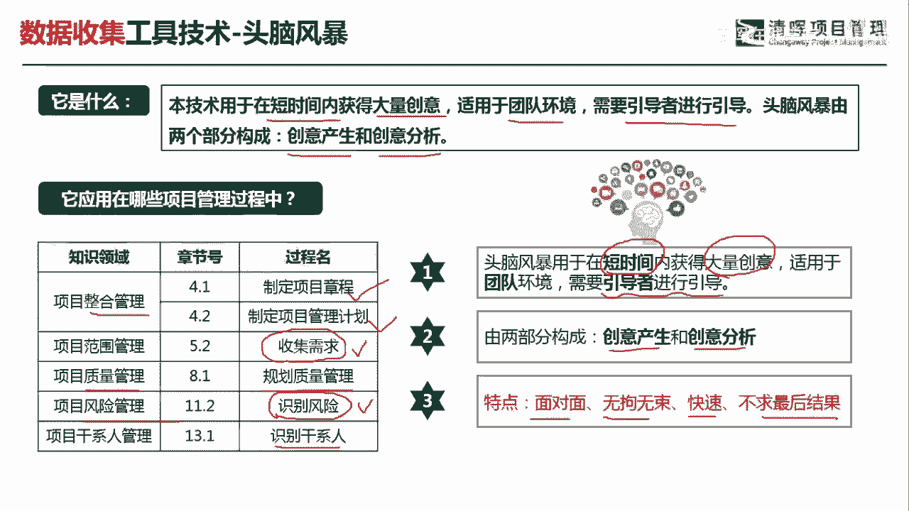
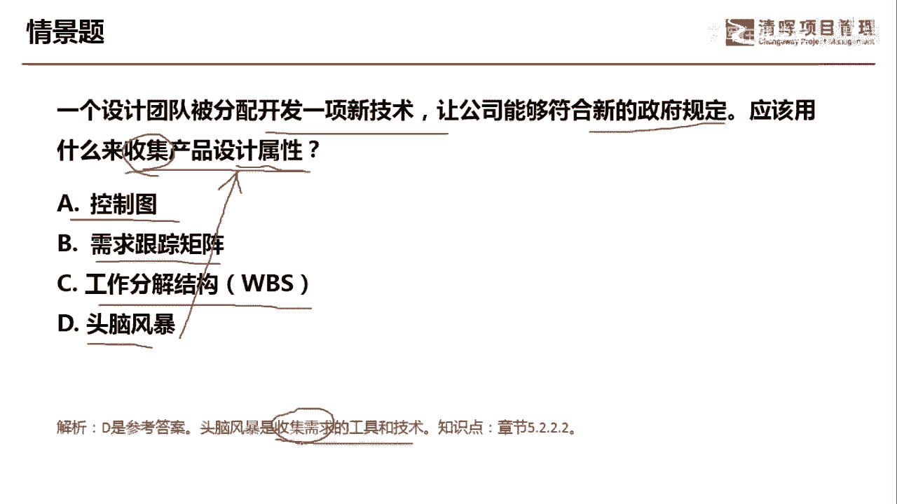
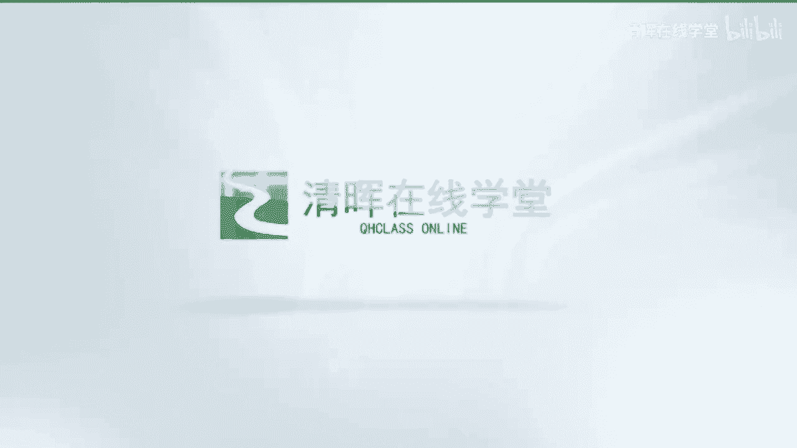

# 项目管理60个实战工具大全 - P19：头脑风暴 - 清晖在线学堂 - BV1tH4y1B7nA

各位同学大家好，我是宋老师。

今天我们来看头脑风暴这个工具，头脑风暴它适用于在短时间内获得大量的创意，适用于团队的环境，需要引导者进行引导，头脑风暴呢由两个部分构成，一个呢是创意的产生，一个是创意的分析，头脑风暴这个工具。

它在整个管理知识领域的制定项目章程中，还有制定项目管理计划中都会用到，另外在范围管理的搜集需求，这个里面呢每次考试手机需求是考的比较多的，就是遇到的用头脑风暴这个技术会比较多，质量管理的规划。

质量管理也会考虑到头脑风暴，风险管理呢在识别风险的时候也会用到，所以呢在考试的时候呢，其实是收集需求，还有识别风险这两个过程，他考头脑风暴遇到的这种情景会比较多一点，干线管理呢识别干系人也会遇到。

识别干系人的时候，也会用头脑风暴来去激发你的创意，那我们头脑风暴里有这样几个适用情景，大家要注意一下，一个是头脑风暴呢，它是在短时间内啊，不会时间很长，短时间内获得大量的创意。

这个大量的创意呢包括了你的需求啊，包括你识别的风险啊，包括你识别的干系，都要激发你的想法啊，这里的创意其实就是想法适用于团队的环境，但是呢需要引导者来进行引导，不是说头脑风暴就是天马行空。

但是呢需要有一个方向去引导你进行头脑风暴，要有一个主题来引导他的两部分呢，一个是创意的产生，还有一个是创意的分析，创意的分析呢是在我们前面搜集这个创意之后，然后呢再进行头脑风暴的进一步的加工。

它的特点是面对面的无拘无束的，快速的不求最后的结果，简单来讲就是说它呢是求量不求质，它是快速的去搜集一些创意想法啊，不会去求得最后的结果，在这个会议上也不会有任何的去批判，我们只是把想法先说出来。

我们来看这样一道题，一个设计团队被分配开发一个新技术，让公司能够符合新的政府规定，应该用什么来搜集产品的设计属性，好，这道题目呢它的关键词呢在于，它是要你去搜集产品设计的属性。

其实呢也是去激发要激发你的一些创意想法，A选项控制图，这个工具呢它是在控制质量的时候会用到啊，它是控制质量的一个工具，主要的就是来识别你的质量管理过程是否稳定，有没有超出控制上下线的一些这个失控点啊。

而且呢它可以去预测你的质量的一个，这个未来的绩效需求跟踪矩阵呢，它是属于我们在这个搜集需求之后，然后得到了一个输出需求跟踪矩阵，一般会怎么用呢，就是我们在这个遇到和这个相关的客户。

对于某些需求有一些这个争议，不同的想法的时候啊，比如说客户说你这个需求怎么没有给我完成啊，这个时候呢我们可以去看一下需求跟踪矩阵，它是一个追溯的一个文件啊，彼此的这种文件记录啊，签字啊。

都在这个需求跟踪矩阵当中啊，也可以为我们的这个变更呢提供一些指南，工作分解结构呢它首先它不是一个工具，它是一个什么呢，它是属于我们创建WBS的一个输出，也就是我们定义好范围之后要做多少事情。

定义好了之后，我们开始把事情呢进行这个工作的分解，它也是我们这个范围基准的一部分，它的最小结构呢是工作包啊，头脑风暴，这个呢是符合我们的这个情景的，就是搜集产品的设计属性。

可以作为你创意收集的一个很好的工具，因此这道题呢我们是选D选项，它是收集需求的一个工具和技术，这题是站在收集需求的角度好，今天呢主要和大家分享的是头脑风暴这个工具，我们下次再见。

