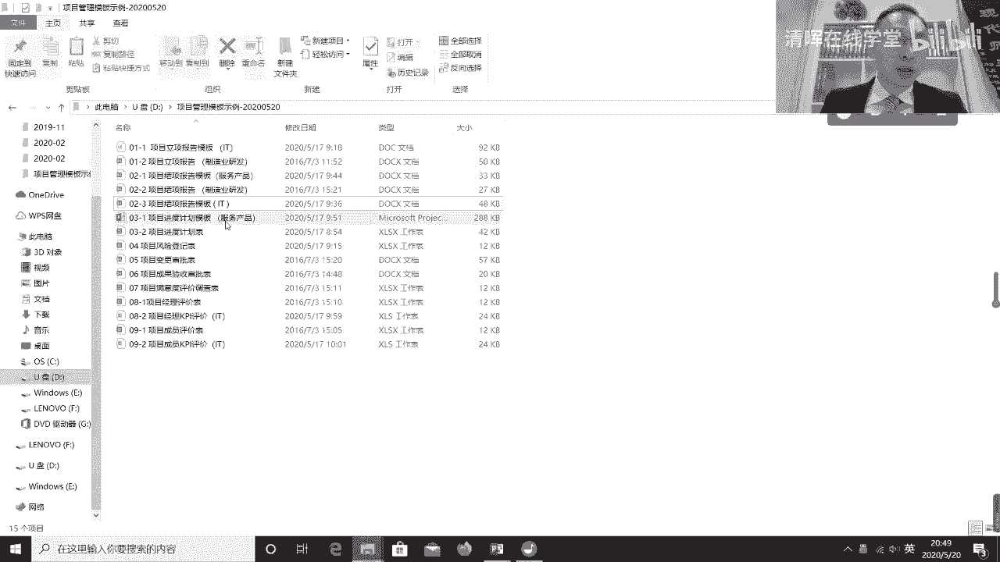
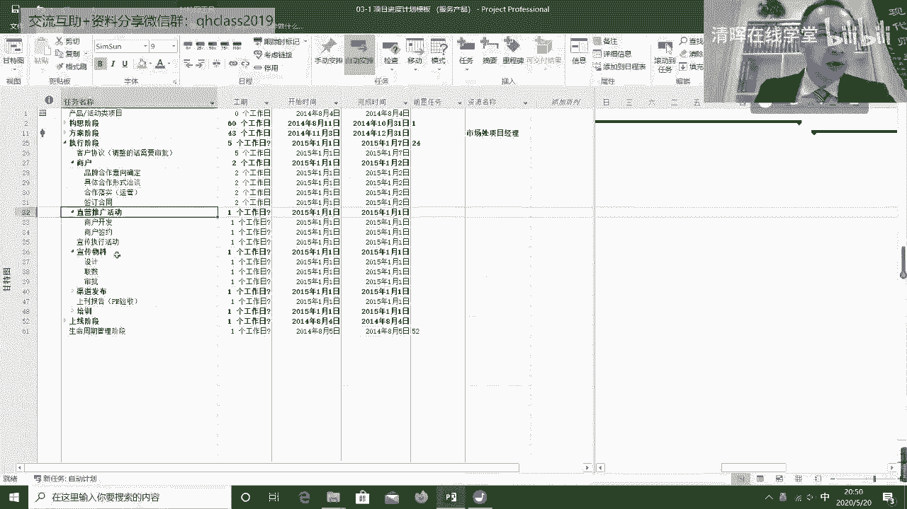
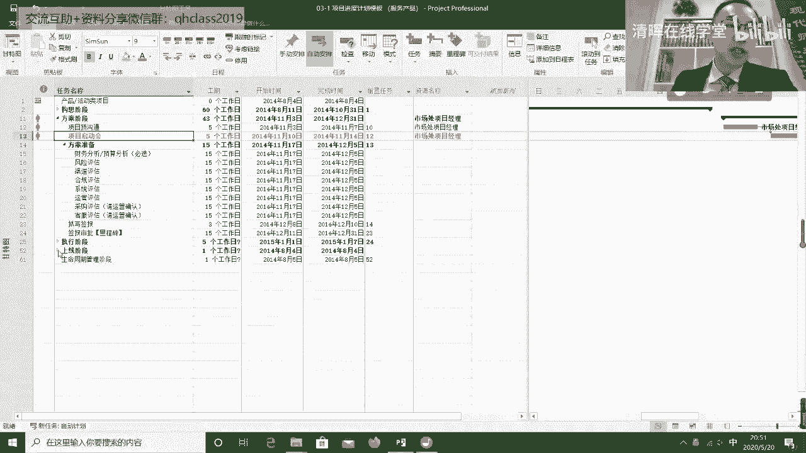
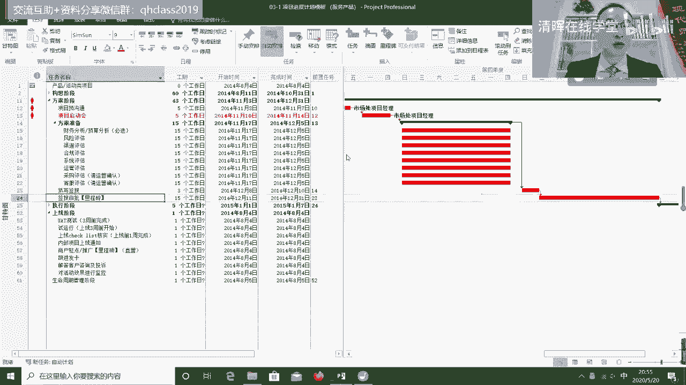
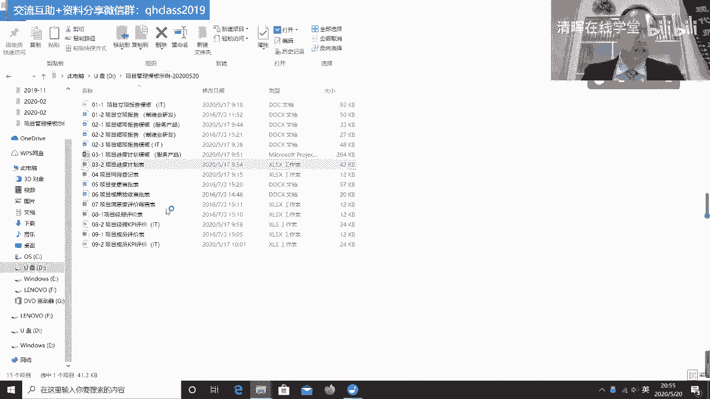

# 项目管理60个实战工具大全 - P1：进度计划 - 清晖在线学堂 - BV1tH4y1B7nA

我看一下项目的进度计划的模板啊。

项目进度计划模板呢我们想给大家看两个，其中一个模板呢就是大家比较熟悉的，大家一看这个，大家一看这界面应该能看出来，这个背后是微软的product对吧，Microsoft product。

那这个呢其实通常也是这个做项目经理啊，最常用的一个做计划的工具，当然了，我们也可以用很多的这个现成的项目管理软件，但大部分项目管理软件里面呢，它其实做计划的界面。

基本上都是按照这个m poor die它这个界面来的，但通常呢当我们在制定项目计划的时候呢，我们说这个对吧，我们至少肯定我们得要做阶段划分对吧，所以通常的当我们在制定计划的时候。

我们一定会把它分成几个大的阶段，比如我们这里边我们会分成这个构思阶段，方案阶段，执行阶段，上线阶段以及生命周期管理阶段，每个阶段之下呢，可能它会包括一些主要的活动的内容对吧，然后呢。

这个或者是说呢主要的交付在这个交付底下呢，可能我们再去走向不同的活动对吧，所以这里边呢，这个我们会逐层的进行分解和细分，这就通常我们说的WBS。

通常的，当我们再去制定这个项目的计划的时候呢，我们除了做阶段划分之外，我们还要特别注重的一点是，每个阶段结束的时候啊对吧，每个阶段结束的时候，他理论上都有个里程碑，这个里程碑它是用来做评审的对吧。

或者叫关卡，关卡评审也可以，那评审的目的是什么呢，评审我们是不是可以进入到下一个阶段，换句话说呢，我们阶段性的我们干了一大堆活之后，我们必须有一个阶段性的集中评审，评审的目的呢是评审。

我们是不是可以开启下一个阶段，以及投入下一个阶段的资源，所以呢这个要一个阶段性的里程碑评审，然后呢通常制定项目计划的时候，开始一定要有一个重要的事叫项目启动会对吧。

通常这其实才是这个通常项目开始集中冲刺，实施了一个起点，要项目的启动会，通常我们会关心项目的上限。

为什么呢，这个其实是一个帮助我们对吧，由项目阶段转成运营阶段的一个过程，所以通常呢首先最左侧呢得有项目的阶段，划分活动的内容，那WBS呢，我们说所有的项目的工作分解结构对吧。

Workbook down strucw b s，它其实是要在体现的这个这个任务，名称的这一列里头，第二呢我们制定项目计划呢，除了工作分解对吧，和交付物分解之外，我们还需要关心完成每个不同的活动。

或每个不同的交付，我们所需要的工期对吧，开始的时间，结束的时间对吧，然后呢所需要用到的资源，用到哪些资源，而且呢这里面呢ms project呢它有一个好处，它可以定义不同的活动之间的依赖关系对吧。

所以这一列对吧，比如说23这项活动，它的前序对吧，它的前序不这个24这项活动，它的前序是23，这一列意味着说呢，你写签报结束之后才可以进行签报审批，所以呢m product有一个好处。

就是可以定义不同的活动之间的依赖关系，通常当我们制定项目计划的时候呢，其实有两件事比较难对，第一个就是分解产品，分解活动分解对吧，分解呢其实是把一个这个模糊的东西呢，它通过分解的方式进行结构化的分解呢。

他去梳理它本身的这种结构和脉络，然后呢化整为零，当我们拆的越散呢，我们对这个东西本身的理解就越精准对吧，所以呢其实分解的目的，是为了帮助我们更准确的去了解项目的目标，以及项目的活动这么一个过程对吧。

然后分解这事就挺难，之后呢，我们接下来要关联关联是什么呢，关联我们是要基于目标做关联，我们基于的目标是什么呢，基于这个目标是说如何能用更少的时间，更少的成本去实现项目的交付对吧，为了实现这个目标。

我们要把项目分解出来的这一大堆活动和交付，再次去进行关联，定义他们之间的依赖关系，但这个依赖关系不是它分解式的依赖关系，而是他在实现产品过程中的先后顺序，以及谁必须依赖于哪个东西完成了之后。

他才可以完成对吧，哪些活动是可以并行完成的，哪些活动是要先完成了A再完成B的，哪些活动是要等B完成了之后，A可以才可以开始的，那这些其实是他们的依赖关系问题，所以呢ms project最大的好处就是说。

它可以去体现依赖关系，可以定义他们之间的依赖关系啊，通常情况下呢，我们一般来说呢这个项目计划的展示呢，他他最好不要用列表，因为直观，所以往往我们会采用右侧的这个甘特图对吧。

所以呢大家知道这个但凡做项目管理的人，一定都会非常熟悉这个图甘特图，甘特图呢是项目管理发展史上，一个非常伟大的发明，之所以伟大的原因，是因为他有一个直观的方式对吧，横向显示的是时间对吧。

纵向显示的是活动和任务，可以用不同的颜色去显示呢，它的进度的好坏对吧，那他所以呢所有制定的项目的计划呢，它其实我们前面分析半天，那其实最终的目的只是为出甘特图，然后呢通过甘特图呢。

让所有的人都能非常直观的去搞清楚，是说这个项目对吧，什么时间点需要完成什么事儿，哪些活可以并行，哪些活必须串行对吧，所以我们在这里看到对吧，有箭箭头线的，这说明他必须得串行。

那这些并列的呢说明它可以并行啊，所以首先呢我们说制定项目计划模板，通过MPODI，这是一种方式吧，然后阶段划分工作，分解工期交付的起点，结束点对吧，然后这些不同的活动之间的依赖关系。

用到什么样的资源对吧，然后呢形成甘特图，当然了，我们说这ms per day它有很多的更多的功能啊，比如它可以自动的去寻找里面的关键路径对吧，就是制约我们整个项目时间最长的那个路径。

通常是项目最重要的路径啊，当然这个因为咱们今天主要的目的不是讲m product，就不细讲了，所以呢这是一种计划的方式，这个计划的方式正在工作的分解时间的定义，然后依赖关系的定义。

以及资源跟依赖活动之间的匹配，然后呢，我们还可以再看另外的一个，这个项目进度计划的表啊。

这个这是个excel表的，这个我们说excel表也可以制定项目进度计划，那我们想给大家展示这个项目进度计划的原因，是因为什么呢，在这个项目进度计划里面吧，我们跟这个项目的成本啊进行了关联。

所以我们看到左侧呢，其实还是项目的工作分解对吧，我们先做阶段，分解不同的里程碑，然后分解不同阶段的不同的任务，但这这里面我们其实举这个例子，是建这个3mm i体系的一个一个这个项目。

然后呢基于不同的任务呢，我们有不同的开始时间，不同的结束时间对吧，工期更重要的是什么呢，我们要关联每一个不同的任务，后边的他的工作量对吧，工作量人天在这里边有12个人天，过程诊断诊断用12个人天对吧。

然后呢之后呢我们要去算的干这个活的，干这个活儿，这个人天如果核算到成本上，它需要多少钱对吧，如果这是人干的，他主要是人力的成本，那这时候我们要判断干这个活的这个人，他什么级别的对吧，他工资是多少对吧。

他的薪酬是多少，通过这个薪酬呢去反推呢，它的成本再把它关联到工作任务上，那这个时候呢，其实我们就在制定项目计划的同时，我们就基本上除了知道活儿怎么干，什么时间点完成，我们还能够去测算到底哪项任务。

它大概的成本是多少对吧，这是一个成本分解的过程，然后呢我们说这个东西呢，那这样的时候呢，当我们逐条的去定义它的成本，而且这个成本呢它取决于它后边的资源，这个资源指的是人力资源对吧。

但人力资源这个价格呢它其实需要预设的，所以通常我们可能在后面会有费率，这个费率取决于什么呢，在我们的比如说这家公司里面对吧，这个什么岗位的什么级别的对吧，他工时费率是多少，人天费率是多少。

我们先有一个定义，根据这个定义呢，我们在制定计划的时候呢，选择对吧，我们到底应该选用什么级别的人，什么岗位的人来去干这个事，选选择完用什么级别的人干这个事儿呢，那这时候我们会发现它其实这个对吧。

我们选选择完了之后，我们会发现它的费率会发生变化对吧，然后这时候呢，我们最底下就会出现我们整个项目的成本，所以呢我们可以根据我们所能接受的成本，那以决定对吧，我们在这个在这个不同的任务上对吧。

我们到底派什么水平的人去干这个事，其目的其实是帮助我们去进行判断对吧，判断我们到底该用什么样的人啊，然后解决我们的成本问题，所以那这样的做计划的好处呢，是说呢我们在制定项目时间表的同时，同时呢。

我们关联到我们的人力资源的成本上对吧，处理人力资源的成本呢，通常我们在做项目过程中，我们还得关心别的成本，因为有的可能有采购对吧，那项目管理呢也有项目管理的成本对吧，人工有人工的成本对吧。

然后这个硬件硬件采购的成本，然后这些成本呢会发生在什么时间对吧，我说既然我们要考虑到花钱，我们必须要考虑到一个它不是集中花钱对吧，什么时候花这个钱对吧，所以这时候呢，它才有利于我们在项目管理的过程中。

做成本控制，这大招呢，这个项目过程中的成本控制，一直以来其实都是项目管理中的一个难点对吧，大多数的人呢，他其实能够做到项目这个时间点的把控，就不容易了，但是呢如果我们能够在时间点的把控的同时呢。

再能加上对成本的把控，而且能够那成本如果想把控，我们就得必须得把这个成本跟这个活动，他俩之间做关联，成本呢我们至少会分成两类，一类是人力资源的成本对吧，一类是采购的成本对吧，人力资源的成本，采购的成本。

如果我们能把人力资源的成本和采购的成本，基于不同的时间对吧，基于开展活动时间不同，那用这个人的时间不同对吧，然后这个开展活动的时间不同，花这个花这个买东西的时间不同。

当我们能把这个东西呢跟项目的这个计划的，时间表关联在一起的时候，这时候呢我们才能够在进行项目进度，计划控制的同时呢，去完成对于成本的控制，我们说包括对人力资源成本的控制，以及对于项目采购成本的控制。

所以呢这也是一种制定项目计划的方式啊。