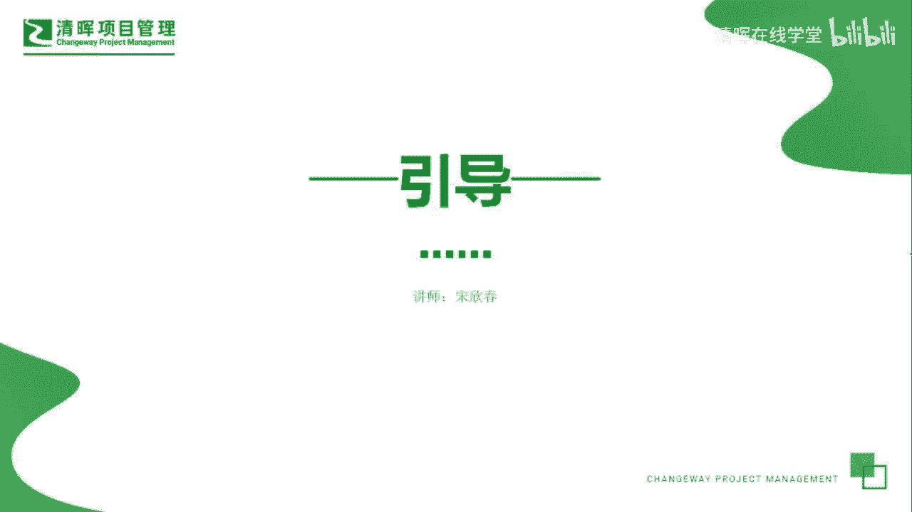
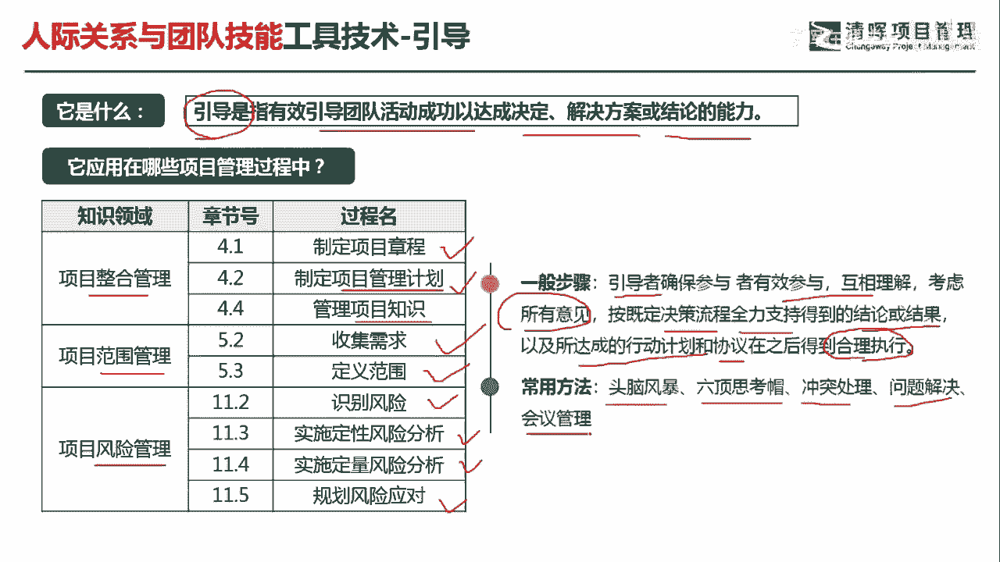
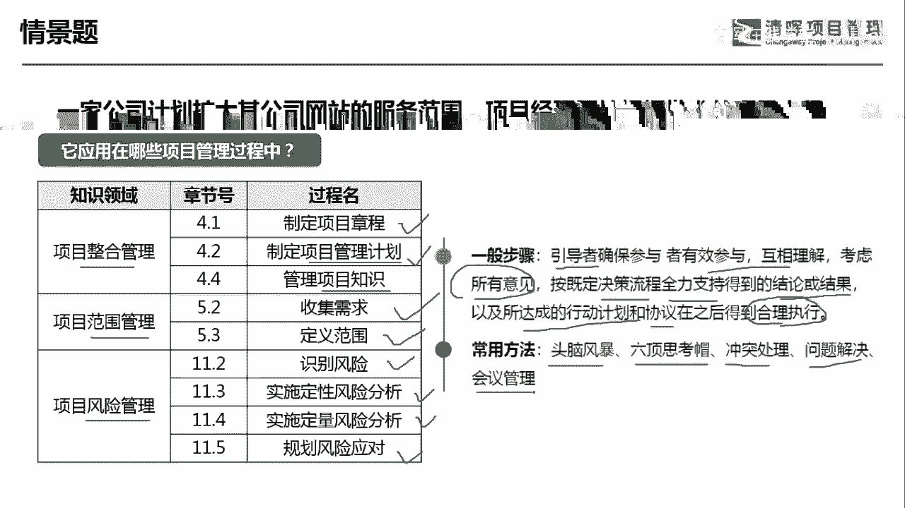
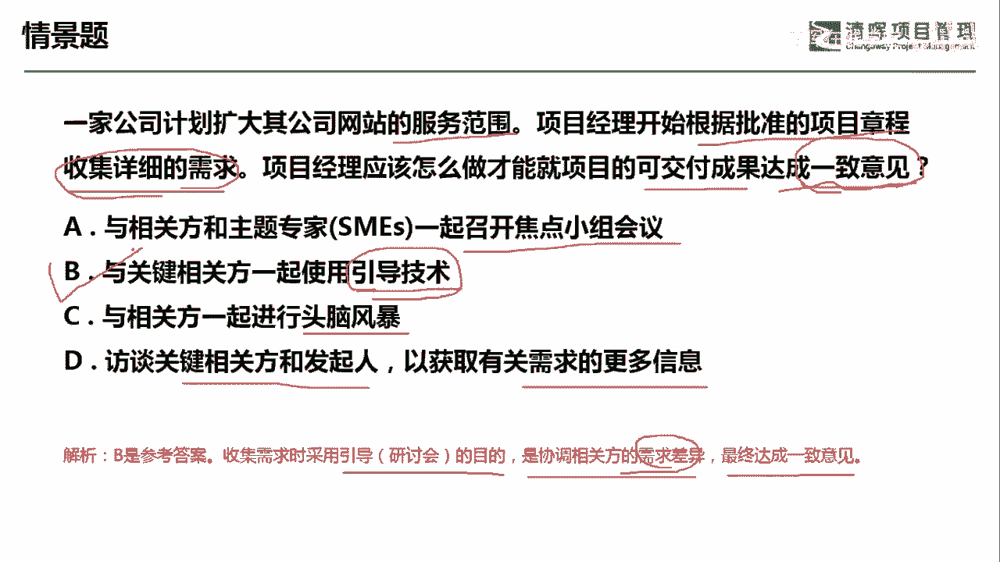

# 项目管理60个实战工具大全 - P20：引导 - 清晖在线学堂 - BV1tH4y1B7nA

各位同学大家好，我是宋老师。

今天我们来看引导这个工具，什么是引导呢，引导是指有效的引导团队活动成功，已达成决定解决方案或者结论的一种能力，所以引导呢它其实是一种能力啊，也是一种工具和方法，引导这个工具。

他在我们很多的过程当中都会用到，尤其是在整合管理的制定项目章程的时候，比如说我们大家对于项目章程的，其中的某些目标，某些里程碑，某些这个总体预算，大家有不同的意见，那我们只能是用引导的方式达成一致。

在制定项目章程，项目管理计划的时候，都会用到项目管理计划呢，比如说我们有十大子计划啊，三大基准，还有其他组成部分，这个都是需要充分的进行讨论的，但是你的讨论一定是要有一个这个引导者，去协调各方的观点。

好在管理项目知识的时候，这个呢属于执行过程，那执行过程呢我们需要去总结经验教训，那需要把隐性的知识能够显性化，那这种知识的管理呢也是需要引导者去协调的，在范围管理的搜集需求以及定义范围的过程中。

也会用到引导这个工具，那我们在收集需求的时候，大家对于需求是否是真需求，还是伪需求也要去引导达成一致，在定义范围的时候，哪些需求是要放在这个范围边界当中的，也是需要达成一致的，在风险管理的识别风险。

定性，风险分析，定量风险分析以及规划风险应对的过程当中，我们都会有不同的意见，也会去用引导的这种方式，去达成这个最后的协调，但是呢引导呢他有他的这种步骤，也有他的常用的一些方法。

它其实是一种嵌入到其他工具当中的一种方式，那从一般的步骤上来讲呢，引导者他需要确保参与者有效的去参与，你的这个讨论过程，能够相互理解，考虑所有的意见，按照既定的决策流程，那全程的知识得到结论或者结果。

所以呢在引导这个过程当中，他其实是要有一个指导者去统领全局的啊，他和焦点小组有点类似，都需要有一个主持人，达成我们最后的行动计划和协议，那并且呢这个行动计划和协议呢，在我们这个引导会议之后呢。

会得到合理的执行，引导，这个工具呢它会嵌入到其他的工具当中所使用，比如说我们头脑风暴的时候，那六顶思考帽呢，这个其实也是一种类似于像头脑风暴的方式，只不过它是站在我们六个这种不同的，这种观点下进行讨论。

那冲突处理呢当然需要引导者了，因为我们最后呢是要达成这个冲突处理的，这种意见问题解决，还有会议管理，会议管理呢我们又会前管理，会中管理，还有会后管理，也是需要有一个主持人去达成。

我们的这个会议的这个会上的协调啊，这个就是引导技术正常使用的一些这个场景。

那么具体的来看这样一道题。

一家公司计划扩大其公司网站的服务范围，项目经理开始根据批准的项目章程，搜集详细的需求，那说明了他是在搜集需求，项目经理应该怎么做，才能就项目的可交付成果达成一致的意见啊，他要达成一致的意见。

A选项与相关方和主题专家，一起召开焦点小组会议，好这个焦点小组会议呢，它其实也是收集需求的一个工具，只不过呢焦点小组呢，它更多的是讨论你的期望和态度，那至于说我们是不是要能够达成一致。

这个不是焦点小组他所需要关注的内容，B选项与关键相关方一起使用引导技术，那这个我们是在这个收集需求过程当中，也会用到的一个技术，它的一个特点呢，就是会在考虑不同的观点之后呢，我们达成最后的一致意见。

这个就是符合我们引导技术的特点，C选项与相关方一起进行头脑风暴，头脑风暴呢它是求量不求质的，它主要是激发新的一些创意啊，收集更多的需求，但是呢他并不会去达成一致，达成一致呢是接下来要做的事情，D选项。

访谈关键相关方和发前，以获取有关需求的更多信息，既然是要获取更多这个有关需求的信息的话，那他不会去达成一致的，那因此呢我们解题的这个思路呢，应该是先抓住它是什么过程，然后呢看他要达成什么样的结果。

因此呢我们这样就可以判断出来，哪个是正确的选项，搜集需求有时会使用这个引导引导，也就是研讨会的这种形式呢，达成它是协调相关方的需求差异，最终达成一致意见啊，协调需求的差异。

因此呢我们这道题目是选B选项好，今天呢主要和大家分享的是引导这个工具。

我们下次再见。

