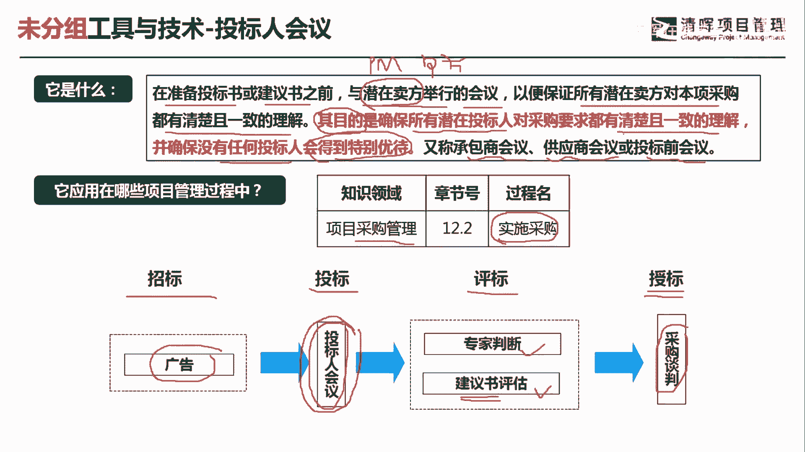

# 项目管理60个实战工具大全 - P24：投标人会议 - 清晖在线学堂 - BV1tH4y1B7nA

各位同学大家好，我是宋老师。

今天我们来看投标人会议这个工具，投标人会议呢，他是在准备投标书或者建议书之前，我们与潜在的卖方举行的会议，以便保证所有的潜在卖方，对本项采购都有清楚而且一致的理解，它的主要目的就是确保所有的潜在投标人。

对采购要求都有清楚且一致的理解，并且确保没有任何投标人会得到特别的优待，也就是说投标人会议呢，它主要是对于采购的一些要求，大家进行统一的说明，然后呢有什么问题呢，都会去统一的答复。

所以呢这个会议呢又叫做承包商会议，或者叫做供应商会议，或者叫做投标前的会议，他是在投标之前开了一个这个会议，与潜在的卖方举行的会议，注意在这个采购当中呢，我们项目经理呢是处于甲方地位。

唯一的在这个知识领域当中处于甲方的地位，其他的过程我们还是算是这个乙方的人员啊，所以在采购管理的实施采购的过程中呢，我们会用到投标人，会以这个工具呢只会在这个过程当中使用。

一般呢我们这个招投标呢都有一定的这个流程，招标的时候呢，我们一般会打一些广告，有时候在一些网站上公布一些信息，投标的时候呢，我们会开展投标人的会议，主要的让潜在的卖方呢一起参加，对于采购的一些要求呢。

我们做出一些说明，在这个会议上呢，我们会充分的阐述一些这个大家不清楚的问题，接下来就开始评标了，评标的时候就会邀请专家，然后呢通过对建议书进行评估，选出我们的合格的这个供应商，最后呢你在售票的时候呢。

还要进行采购的谈判，因为采购谈判呢我们会得到的是合同，所以我们今天讲的这个投标人会议呢，它其实是在我们实施采购的开始，让这个潜在卖方一起参加，一起参加，这个工具在采购当中是比较重要的。

我们来看这样一道题，采购部门向项目经理提供了一份能够提供供应，一个项目可交付成果的供应商名单，高级管理层坚持认为，所有的供应商均有赢得合同的同等机会，也就是说这个供应商名单当中的人员呢。

这个供应商都可以去获得我们的合同，然而重要的是什么，重要的是项目的成本仍然起到决定作用，也就是说这个合同呢主要是看重成本的管控，项目经理下一步应该怎么做，A选项，与所有的潜在供应商召开一次投标人会议啊。

这个呢会议其实就是在会上，会说明我们的这个采购的要求啊，对于我们后面的合同有什么样的要求，他都会说明，比如说会说明我们的成本，是非常起到决定作用的啊，大家要关注这一点。

这个呢就是一个投标人会议上说明的内容，B选项选择之前曾经以最低价格交付的供应商，直接选择最低价格的供应商呢，其实是比较武断的一个选项，所以我们不建议直接去选这个最低价格，有可能最低价格。

但是它质量不好对吧，其实他主要是选择一个平衡点，C选项从已经证明是可靠的供应商，选择最佳的报价，我们现在的这个情境当中，已经说明了，所有的供应商均有合赢得这个合同的同等机会。

所以就不仅仅是从这个已经证明了，可靠的供应商当中去选择，也有一些潜在的这个没有合作过的供应商，他们都有同样的机会，所以呢这个地方它有点偏颇了，已经证明了没有证明的也可以。

D选项选择将接收成本补偿合同的供应商，成本补偿合同，它其实是合同当中的一种类别，我们直接选择这一类的合同，其实也是比较偏颇的一个选项，而且呢他这个合同呢情景当中已经说明了，是成本起到决定作用。

那更应该是选择总价合同，而不应该选择成本补偿合同，因为成本补偿合同呢，它的这个合同的价格呢其实是经常波动的啊，它不像这个总价合同，它相对来说呢不会受到太多的影响，因此呢我们这道题目呢。

如果是表明所有的供应商都要选，都有这个机会赢得这个合同，那么我们应该是召开一个投标人会，来说明我们的成本起到决定的作用，然后大家在相同的这个平台上，标准下去进行竞标，所以这一题呢我们是应该选择A选项。

投票人会议，他是在卖方提交建议书之前，在买方和潜在卖方之间召开了会议，这个目的是要确保所有潜在投标人，对采购要求都有清楚而且一致的理解，并且确保没有任何投标人会得到特别的优待。

这个里面是所有潜在的投标人，他对应的就是我们所有的这种供应商啊，大家都有机会赢得这个合同，好，今天呢主要和大家分享的是投票人会议，这个工具。

我们下次再见。

