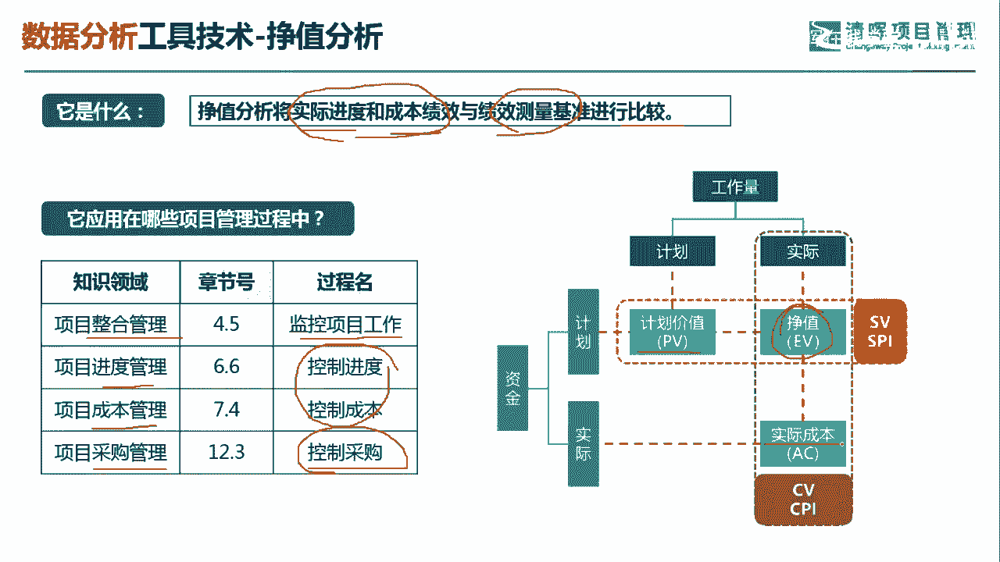
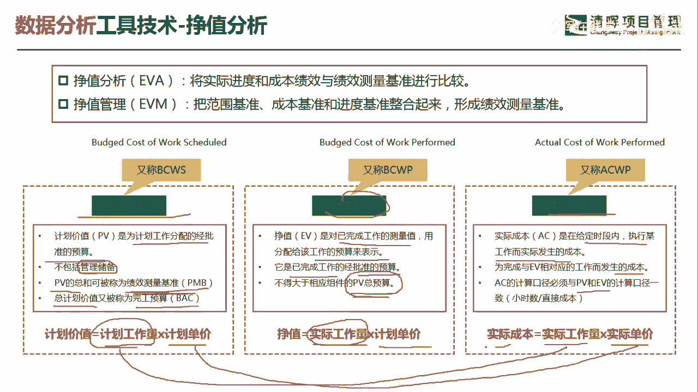
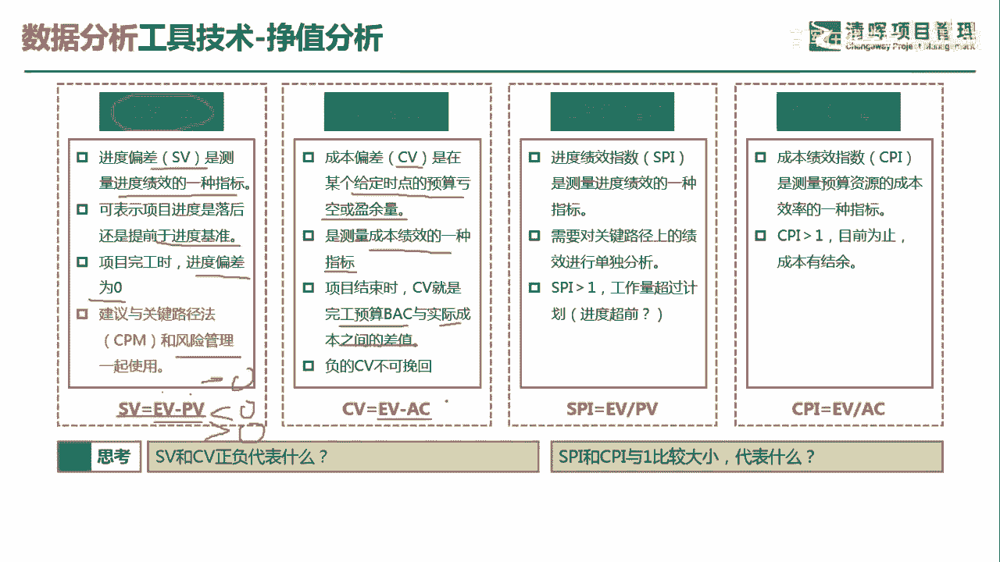
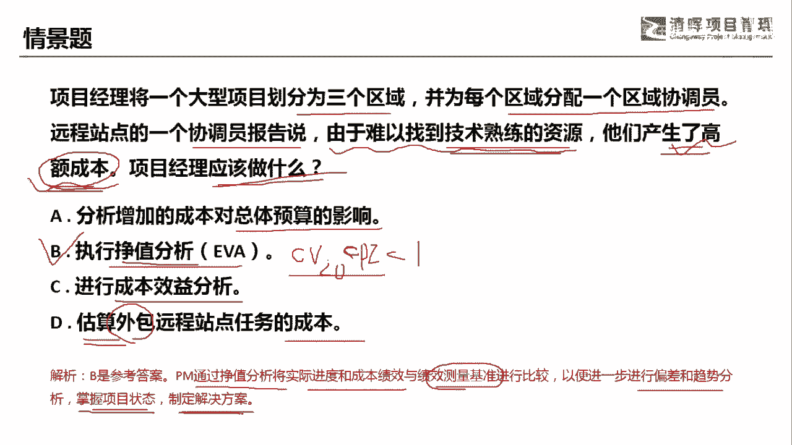

# 项目管理60个实战工具大全 - P28：挣值分析 - 清晖在线学堂 - BV1tH4y1B7nA

各位同学大家好，我是宋老师。

今天我们来看政治分析这个工具，政治分析呢它是将实际进度和成本低效，与绩效测量基准进行一个比较，所以在这个当中，我们需要了解的是实际进度和成本绩效，然后呢与绩效测量基准。

也就是说它原来的一个计划进行一个对比，政治分析呢，在整合管理的监控项目过程中会使用，比如说监控它的进度情况，监控它的成本情况，还有在进度管理和成本管理这个当中呢，主要是控制进度和控制成本。

另外在采购管理的过程中啊，在采购管理的控制，采购过程中，也会考虑到，比如说采购方的一些进度和它的成本绩效情况，所以呢政治分析呢其实围绕的是核心，它的正德价值，正德价值。

然后与计划价值以及实际成本进行一个对比，这样的话我们可以得出它的这个成本的偏差，还有进度的偏差。

成本的绩效和进度的绩效情况，但是呢我们了解政治分析之前呢，我们先要了解几个这个指标的含义，第一个呢就是叫计划价值，什么叫计划价值呢，计划价值它是为计划工作分配的，经过批准的预算。

但是我们这个里面计划价值呢，是不包含管理储备的，因为管理储备呢它本身不是我们的成本基准，或者说我们的进度基准的一部分，这个PV的总和也就是计划价值的总和，可以被称为这个绩效测量基准，好绩效测量基准。

那总计划价值，比如说无数个这个PV，无数个阶段的这个PV呢又可以被称为完工预算，完工预算呢就是budget at completion，就是BAC简称BC计划价值，如果用公式来表示呢。

就是计划的工作量乘以你的计划单价，同样正德价值呢，它是对已经完成了工作的一个测量值，也就是用分配给该工作的预算来表示，他是已经完成工作的，经过批准的预算，我们是不得大于这个相应组件的PV的总预算的。

这个PV的总预算呢是我们的八级的，你的正德价值呢是不可能超过它的，因为什么呢，因为正值它是等于你的实际工作量，乘以你的计划单价啊，它和刚才的这个计划价值不太一样，我们在这个里面呢就是实际的工作量。

而不是计划的工作量了，AC是代表实际成本，actual cost啊，刚才一边呢叫做own value，正德价值PV呢叫做planet value，计划价值，实际成本AC它是在给定时间段内执行某工作。

而实际发生的成本，也就是说我们未完成，与这个正德价值相对应的工作而发生的成本，他们的计算口径呢是和PVEV口径是一致的，那实际成本的计算公式呢，就是你的实际工作量乘以你的实际单价啊。

它和计划价值也不一样啊，计划价值它是计划工作量乘以计划单价，所以在这个地方呢我们就变成实际单价，也就是实际的工作量乘以你实际单价。

得出你的实际成本，了解了这三个这个变量之后呢，我们接下来对于这些变量之间关系，也要有一个清晰的了解，第一个叫做进度偏差，进度偏差它简称SB叫做chedule revise。

Schedule revise，它是测量进度绩效的一种指标，表示的是进度落后还是提前于进度基准，如果项目完工的时候呢，我们的这个偏差呢，这个进度偏差就是零，我们建议与关键路径法一起啊。

包括这个风险管理一起使用啊，为什么这么说呢，如果你发现一个项目的进度，这个有偏差，有偏差，比如说落后，但是你还要看一下是不是关键路径上，真正的落后啊，才是代表你这个整体项目的落后。

SB呢代表EV减去PV，就是正德价值减去你的计划价值，如果它是小于零的，代表你的进度落后，如果是是大于零的呢，是代表你的进度提前，但是如果SUV正好等于零呢，就代表你是符合进度的，符合计划进度。

成本偏差同样它叫cost of rice，它是在某个给定的时间节点的，预算亏空或者盈余量，它是对于测量成本绩效的一种指标，项目结束时，这个成本偏差呢，就是完工预算与实际成本之间的一个差值。

负的这个成本偏差是不可挽回的，但是实际花出去的那CV等于EV减去AC，也就是正德价值减去你的实际价值，同样这个CV如果大于零。

代表成本有结余，如果是小于零的话，代表成本是超支了，如果等于零的话，是代表你成本正好符合原计划，同样的我们在进行一种变换，就是求得进度绩效指标，进入绩效指标呢简称SPI。

它叫schedule performance indeed，它是测量进入绩效的一种指标，进入绩效的一种指标啊，更多的是一种效率指标啊，一种效率指标，也需要对关键路径上的绩效进行单独的分析。

这是什么意思呢，如果你发现SPI这个算出来，比如说它是等于V除以PV的这个公式，它如果是小于一的话，小于一的话，它是代表什么进度落后，但是呢是不是代表我们关键路径上的进度落后。

这需要进行关键路径的单独分析，你才能知道SPI如果大于一的话，代表进度提前，如果等于一的话，这代表符合计划，符合计划，成本绩效指数，cost performance index呢。

它是测量预算资源的成本效率的一种指标，也是一种效率指标，CPI如果大于一，它代表目前为止呢我们成本是有结余的，如果是小于一的话，代表成本是超支的，如果是等于一的话，我们也是代表成本是符合计划的。

它的公式呢等于EV除以AC，EB除以AC，所以大家从这个公式的转换上，你也可以看出来，SPI呢是1V除以这个PV，那如果是大于一，是代表什么，其实就是1V减去PV唉大于一样的啊，它和这边其实是同样的。

这个呢就是我们政治分析当中的几个指标，这个指标这个呢一定要注意啊，这个在考试当中，这是必考的，我们所要了解的就是一个呢是SV怎么算，CV怎么算，SPI怎么算啊，CPI怎么算，以及他们所代表的一些含义。

好我们具体来看这样一道题，项目经理将一个大型项目划分为三个区域，并且为每个区域分配一个区域协调员，远程站点的一个协调员，报告说，由于难以找到技术熟练的资源，他们产生了高额成本，产生了高额成本。

那至于说这个高额成本，是不是超出了你的这个原计划，这个时候项目经理应该怎么做呢，你怎么做才能知道它的高额成本的这个，实际体现的意义呢，A选项分析增加的成本对总体预算的影响，这个其实就包含在政治分析当中。

这因为政治分析呢你会去考虑它的这个CV，包括它的这个这个CPI好看，他们的这个指数情况如果小于零的话，代表CP小于零的话，代表成本超支，SCPI小于一的话，也是代表成本超支的，进行成本效益分析。

什么时候进行成本效益分析呢，如果是要上一个新技术，如果是有一个好的资源，那我们要不要进行这个寻找，要不要进行上这个新技术，这个时候要考虑性价比的，所以一般遇到成本效益分析都是考虑性价比。

但是呢我们这道题目呢，它是告诉我们，事实上它是产生了高额成本的高额成本的，所以呢要考虑这个政治分析，考虑它对于我们的进度，对于成本的一个整体影响，D选项估算外包远程站点任务的成本，估算成本，估算成本呢。

它是这个我们现在呢其实是不需要去估算的，因为他已经告诉我们产生的高额成本啊，如果他没有说可能会带来什么不确定性，可能会带来什么成本，如果他简简单单只是说，由于难以找到技术熟练的资源。

那你接下来你再去估算你的成本啊，所以这一题呢我们应该考虑B选项，执行一个政治分析，pm通过政治分析，将实际进度和成本，绩效与绩效测量基准进行比较，以便进一步进行偏差和趋势分析，掌握项目的状态。

制定解决方案，好今天主要和大家分享的是政治分析这个工具。

我们下次再见。

