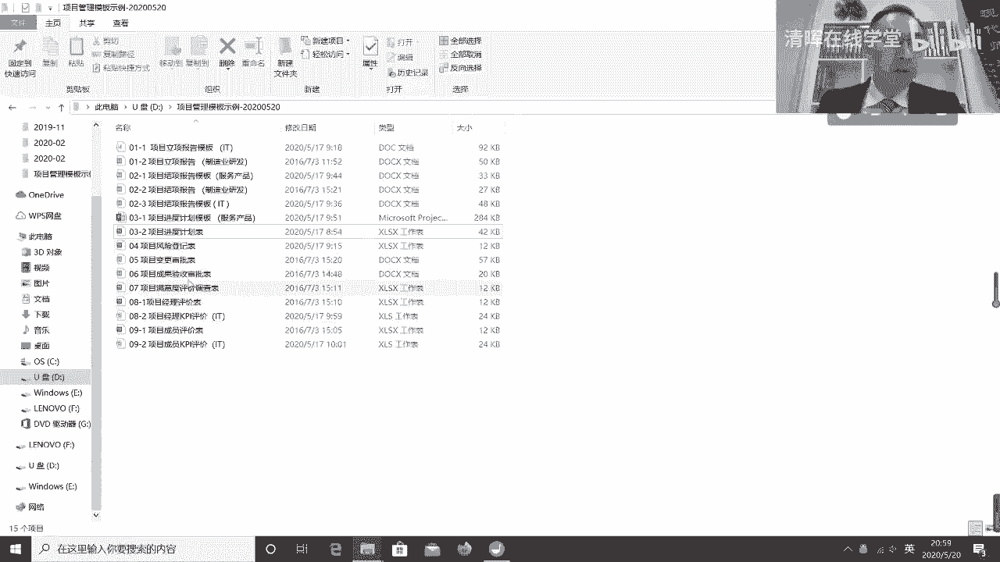
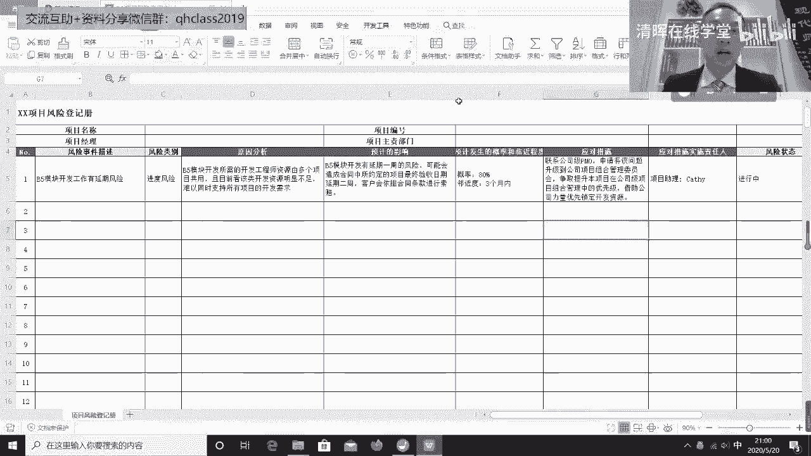
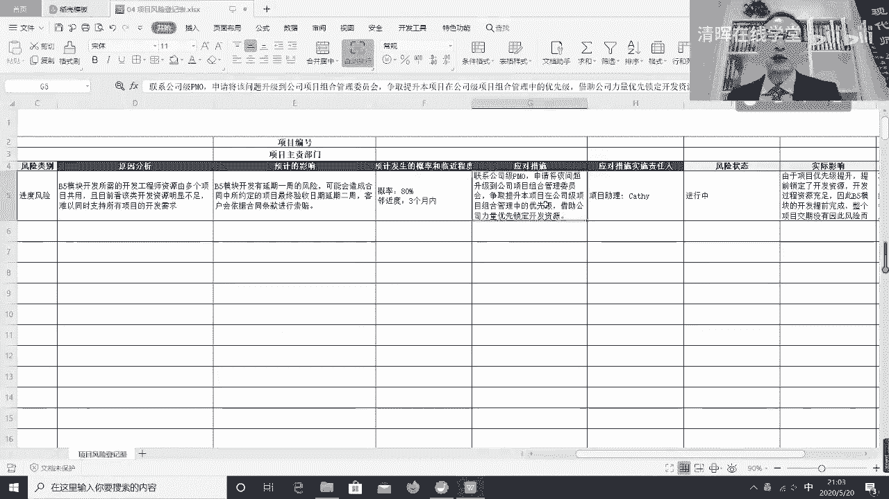
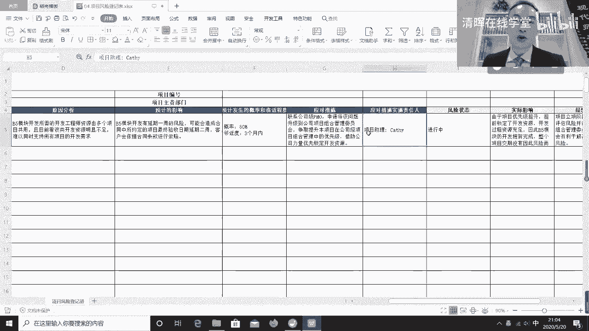
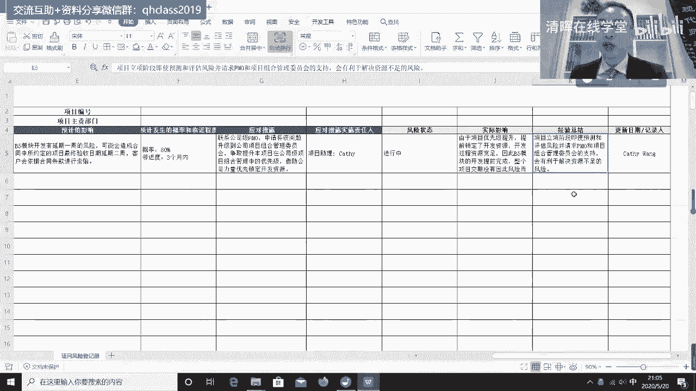
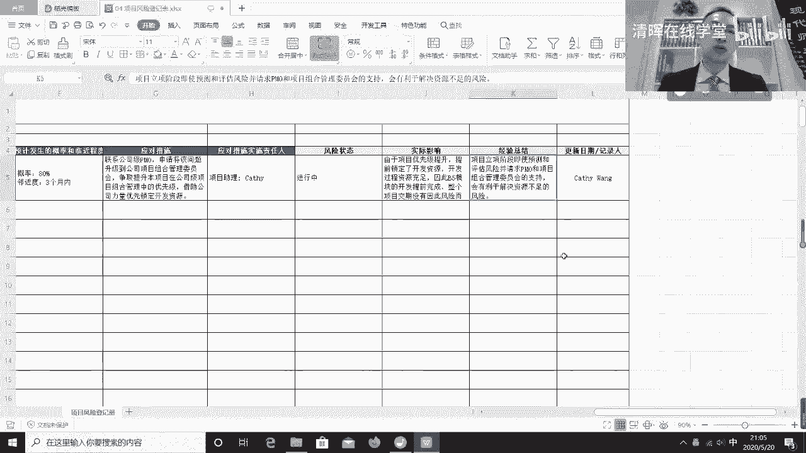
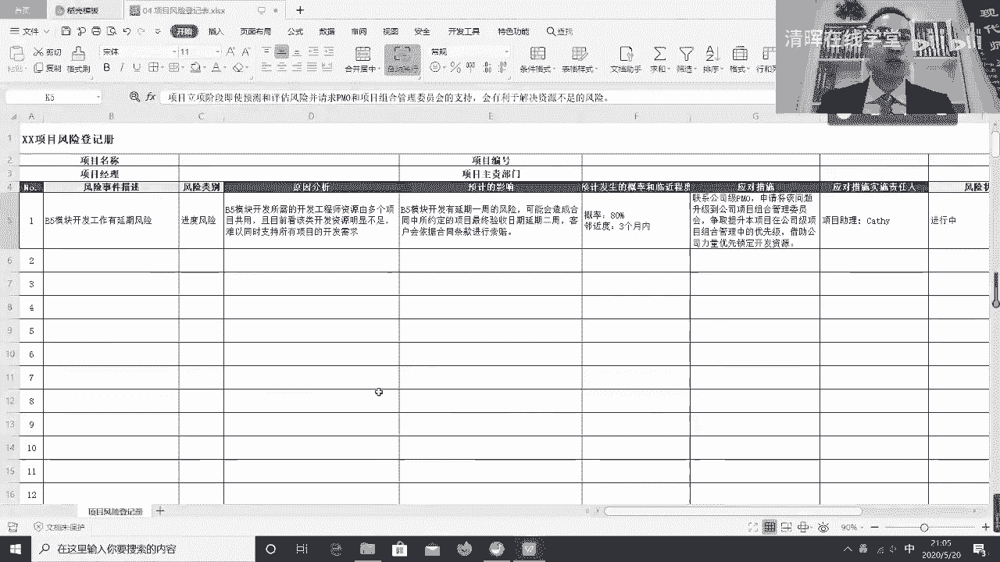
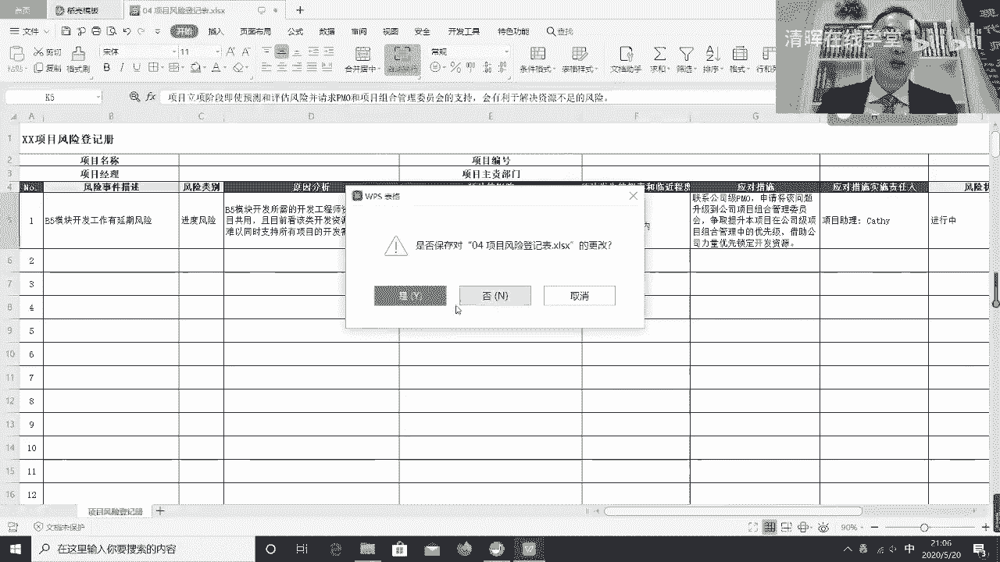
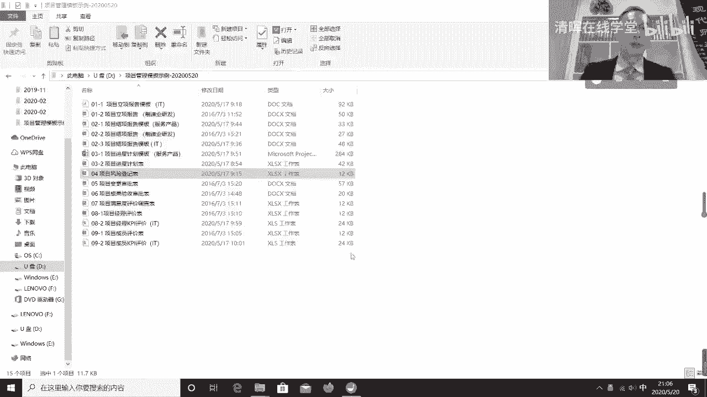

# 项目管理60个实战工具大全 - P2：项目风险登记表 - 清晖在线学堂 - BV1tH4y1B7nA

在我们制定项目计划的时候呢，其实一定有一项非常重要的工作，就是我们得考虑风险问题，那在制定项目计划的时候呢，我们往往一定会能识别出好多风险来，我们识别出风险之后呢，我们既然要识别了。

就得评估一下这风险对吧，影响大不大，然后呢，所以这时候呢那我们在评估之前呢，我们通常所有识别的风险。

他必须得先记录下来对吧，我们不能只是知道了没有地记，所以通常呢每个项目呢应该要有自己的一个，风险登记表或者登记册，或者登记簿或者登记单都行，反正总得有一个记录风险的地，所以呢通常呢我们识别出一个风险呢。

我们要把这个风险放这对吧，我们描述一个风险事件，这风险事件呢往往是说，这个项目可能有延期的风险，这是个事件，我们可能我们通常要给这个项目分个类对吧，它它是哪种类别的分析对吧，你进度风险技术风险质量风险。

合同风险对吧，成本风险人可以有很多种不同的风险，分个类，比如说这是进度风险，然后呢我们要思考这风险是怎么造成的对吧，原因是什么，通常呢从风险管理的角度，原因应该是已知原因，就它一定是已经发生了的。

因为一个已知的原因，所以呢我们去推演出它可能会带来一个事件，这个事件可能会发生，事件还没发生的，如果事件已经发生了，不叫风险，叫问题，所以呢通常呢一个已知的原因，它带来了呢一个可能会发生的事件。

这个事件如果一旦一旦发生了之后呢，它会带来影响，就是E这一点会发现它可能会带来影响，那这个影响呢，如果对我们来说是一个很有影响的影响对吧，比如说延期了，客户会因此而索赔的对吧，或者是领导会因此而发怒的。

那这个时候我们才要去考虑，我们是不是必须得去应对它吧，第一影响很大，第二呢我们还得关心什么呢，影响大家如果发生概率低，比如说虽然这个风险影响很大，但发生发生概率特别小，500%分之十。

那我们可能也就不管了对吧，因为你这个应对风险它是有管理成本的，如果风险的发生几率太小，就不要应对了，这个否则应对半天很可能根本发生不了对吧，那没办法，拼运气对吧，这个然后呢，但如果发生概率很大。

而且时间又很近，那这时候意味着说我们必须要去应对它对吧，所以呢那比如说呢刚刚我举这个例子吧，比如说我们发现了这个原因是什么呢，我们在项目中开发一个模块，这个模块呢是需要的，开发资源比较特殊。

而且这开发资源的多个项目共用，我们目前明显看起来吧，大家都用肯定不足，肯定都用不上的，所以呢我们担心的是什么呢，这事件是万一这个我们该用时，结果没用上，结果导致我们的项目受影响了对吧。

这个预期造成的影响，结果呢我们的项目受影响了，肯定我们倒霉对吧，所以呢为了而且这件事发生概率又挺大，所以我们要想办法去解决它，怎么解决呢，那我们要想个应对措施，举个例子，比如说我们要联系公司的PO对吧。

因为涉及到跟别的项目抢资源了，我们自己抢，这是抢不来啊对吧，他必须得升级，让公司来帮助我们抢，所以说我们要联系公司的PO，让公司PO呢，帮助我们把这个问题，然后呢我们要去汇报说明什么呢。

说明我们项目很重要对吧，我们优先级要更高一点，什么叫优先级高呢，就是说我因为我们的项目比别的项目重要，我们要要说服领导，我们的项目比别的项目重要，所以这稀缺资源应该我们先用对吧。

然后呢这样对公司大局有好处，所以呢当我们会发现我们资源不足的时候呢，我们要站在公司大局角度考虑问题，站在公司大局角度考虑问题，我们要说服公司的领导们，站在公司的大局，你得先保证公司内重要的项目。

我们这项目比较重要，所以呢这个稀缺资源应该先给我们对吧。

所以这是一种应对措施，那如果是说呢我们这个说服成功了，我们提前锁定了公司的资源，领导们答应没问题，这资源先给你们预留，谁也抢不走。

说明这应对措施有效对吧，那既然要做这个应对措施，我们这有个责任人对吧，比如说我们派项目助理对吧，去做这个这个汇报，同时盯着公司。

这资源是不是在我们这儿对吧，然后呢，这个我们描绘风险的状态发生了，还是没发生对吧，然后将来可能我们要关心一下结果，实际的结果是什么对吧，我们说有可能因为我们的优先级提升了，获得了领导们的支持。

提前锁定了稀缺资源，结果我们开发的时候就我们资源重组了，当然我们资源充足了，肯定有倒霉的，可能，别的资源，别的项目资源就不充足了，但是那如果我们站在项目经理的角度呢，我们狭义的对吧。

我们狭隘的去考虑这个问题，先保护我们自己的项目对吧，但是呢我们需要公司领导们，站在大局的角度考虑问题，但是如果我们不是公司领导，我们就不站在公司领导角度考虑问题了，我们呢需要公司领导站在公司大局的角度。

先把握我们自个儿的项目对吧，所以这时候呢，可能因为我们用了一个合理的方式去请求领导，资源的支持，结果呢我们先把资源抢过来了，所以呢我们要总结一下成功经验，成功经验是什么呢，在项目立项阶段的时候对吧。

这个我们要及时的预测和评估风险啊，然后呢，并且请求呢，项目管理办公室跟项目组织管理委员会的支持，那支持的目的呢是希望通过他们的支持，帮助我们解决资源不足的问题对吧，我们最怕的是什么呢。

这个资源不足没提前想到，而当发现资源不足的时候才去要求，但那会儿其实别人帮你协调都很困难了，所以所以有些事要提前想。

所以我们说前面为什么这立项是要多想，为什么要做计划，那其实这些东西呢其实都是为了帮助我们解决，提前预估到问题，提前找人帮忙，这样更容易解决问题，最怕的是什么呢，现发生问题，现找人帮忙。

这对谁来说措手不及都不太好弄对吧。

所以这种说风险登记册我们所需要做的，对于项目经理来说。

风险管理是个非常重要的事，那因为题非常重要，所以呢我们这个一定要有风险登记表，那有风险登记表的目的呢。

其实是为了帮助我们的，别忘了那些重要的风险对吧，然后风险要把优先级。

