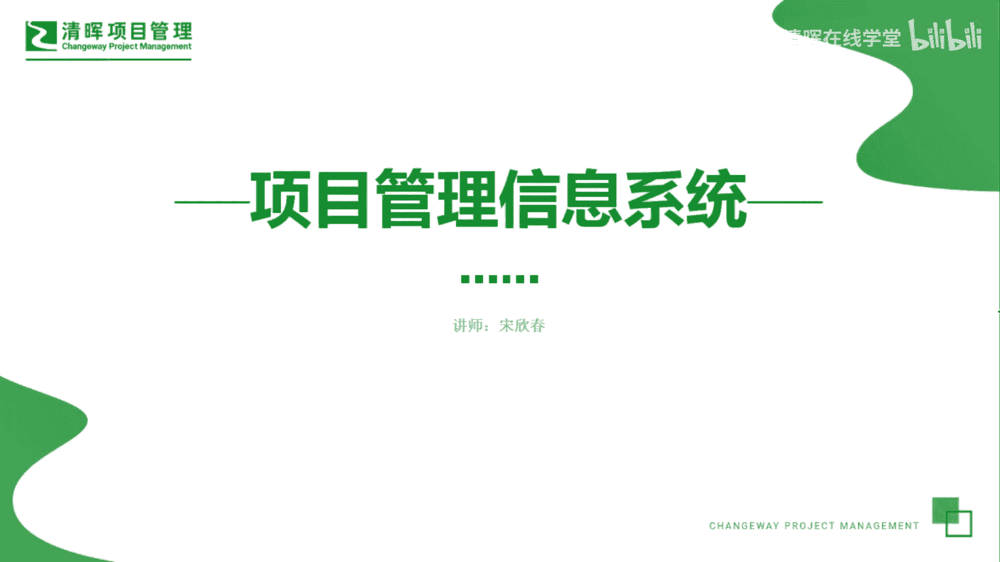
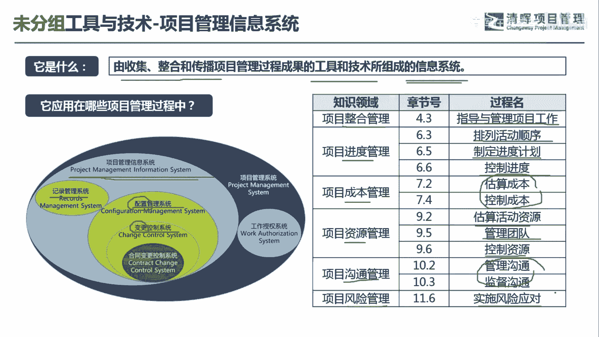
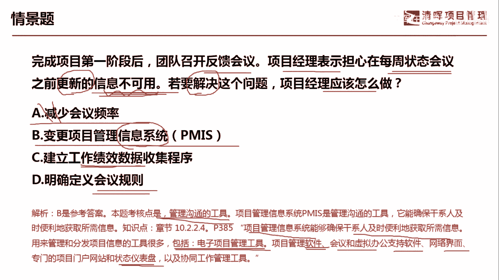

# 项目管理60个实战工具大全 - P30：项目管理信息系统 - 清晖在线学堂 - BV1tH4y1B7nA

各位同学大家好，我是宋老师。

今天我们来看项目管理信息系统，项目管理信息系统，它主要是由搜集整合和传播，项目管理过程成果的工具和技术，所组成的信息系统，所以它是一个工具，也是一个信息系统。

它简称叫做pm i s p m s项目管理信息系统呢，他如果是站在这个项目管理系统的，这个环境下来看，它里面又包含了记录管理系统和配置管理系统，其中呢配置管理系统包含了变更控制系统。

这个配置是什么意思呢，配置一般来讲的就是产品的一些特性，比如说它的一些型号版本等等，那这个里面呢也包含了变更控制器系统，也就是说当我们的一些版本啊，功能啊，特性啊有所变化的时候，它其实是要通过一个变更。

控制流程来进行改变的，那由于呢我们经常和外面的这个供应商，产生一些联系，所以会有一些合同的出现，合同如果一旦产生变更，也需要进行合同的变更控制系统，所以从这个包含关系上来看，项目管理信息系统呢。

它包含了记录管理系统和，配置管理系统这两大类，其中配置管理系统当中又包含了变更控制系统，项目管理信息系统这个工具，它在我们整个管理的指导管理项目，工作过程中会使用，另外在进度管理的排列活动顺序。

制定进度计划和控制进度过程中都会用到，那比如说我们要这个了解项目的进展情况，那你肯定是要通过一个这个比较便利的，一种线上平台，这个信息系统去了解，在成本管理的时候，同样也可以通过这个PM系统。

去了解它的成本的变化情况和它的估算情况，资源管理的时候呢，也需要用到这个信息管理系统，估算活动资源有哪些，然后你如何管理团队，如何去控制资源，包括在沟通管理的时候呢，我们通过这个PMS系统呢。

可以更好的去管理沟通和监督沟通，有一些信息呢，我们就可以放到这些信息系统平台上，大家都可以看见，效率会更加高一点，风险管理的过程中，我们也会在实施风险应对的时候会采用它，因为我们风险应对呢。

这个无论是机会还是危险呢，都有五种应对措施，那我们要看你的风险的应对完成情况。

那可以通过这个信息系统这种环境去了解，我们来看这样一道题，完成项目第一阶段之后，团队召开反馈会议啊，这个反馈会议其实就是review会议了，审查会，项目经理表示担心，在每周状态会议之前更新的信息不可用。

若要解决这个问题，项目经理应该怎么做，项目经理担心的是什么，在每周状态会议之前更新的信息不可用，这个其实呢不可用，其实就是沟通的问题，这信息不能产生价值，A选项减少会议的频率其实并不一定要减少。

反而有可能会增加啊，所以他这个是绝对选项，不要去选它，B选项变更pm s系统，这个是什么意思呢，它其实呢，这个信息本身就可以放在这个平台上啊，有什么变化，我们及时通过这个信息来传达啊。

他是管理信息的管理，沟通的一种非常高效的一种工具，C选项建立工作绩效数据搜集程序，我们现在的问题呢，不是对于工作绩效数据搜集有问题，而是说更新的信息有时候不可用的问题。

这种不可用呢包含了他不能传达顺畅啊，相关的肝实验也不知道，D选项明确定义会议的规则，会议的规则呢，它其实属于我们这个会议管理当中，要注意的一些规则，这个呢并不是解决信息不可用的一种方式啊。

会议的规则呢一般是处理冲突啊，或者是这个会前我们要准备一些什么资料啊，会后呢我们要如何发放这个会议纪要等等，做出一些规范，因此呢我们这题是选择变更PMI系统，这题考的是管理沟通，管理沟通。

那我们PIC系统呢，能够确保干事及时便利的获取信息，这个也是一个非常好的这个电子项目管理工具，因为它这个里面呢也是一种软件啊，会议和虚拟办公知识的一种软件，网络界面，专门的项目门户网站和状态仪表盘。

状态仪表盘呢其实也是一种这个敏捷的工具，就大家能够在这个同一个平台上，看到他项目的各种进展情况，好今天的主要和大家讲的是项目管理信息系统，我们下次再见。

