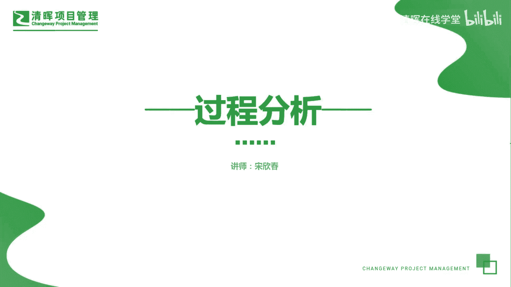
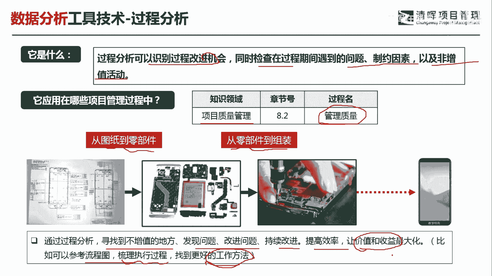
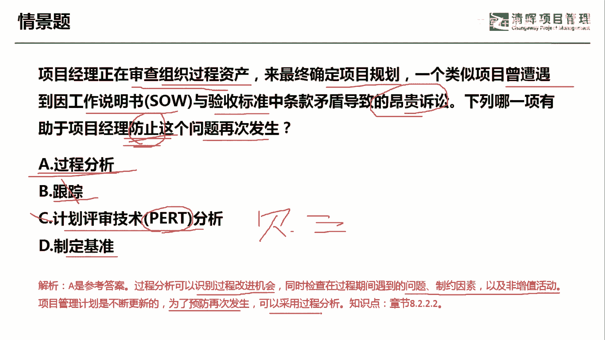

# 项目管理60个实战工具大全 - P6：过程分析 - 清晖在线学堂 - BV1tH4y1B7nA

各位同学大家好，我是宋老师。

今天我们来看过程分析这个工具，过程分析呢主要是可以识别过程改进的机会，同时检查在过程期间遇到的问题，制约因素以及非增值活动，在偏僻的很多情景题当中呢，它往往暗示项目经理如果要进行改善，你应该去怎么做。

那么要进行改善呢，其实有一个很多的这个考点，就是要发现一些增值和非增值的活动，这样的话你才能有的放矢，才能去进行这个改善，活动过程分析呢，它主要是在质量管理的管理，质量过程中所使用啊。

比如说我们在装配一个这个手机的时候，你从这个图纸到零部件，从零部件到组装的过程中，你可能会发现某些零部件其实是不必要的，那有时候呢你也会发现，这个有些动作是不必要的。

那这些其实都是非增值的一些这个改善点，那在此基础上进行过程分析，你就会发现你下一步应该怎么样去进行改善，为了未来去做一个准备，所以呢通过过程分析，我们寻找到不增值的地方，发现问题，改进问题，持续改进。

提高效率，让价值和收益最大化，也可以参考流程图来进行这个梳理，执行过程以便找到更好的工作方法，所以这种过程分析呢，它往往和这个质量审计也有很大的区别，那么质量审计呢更多的是对于质量的过程。

政策流程是否遵守的一种这个检查判断啊，我们过程分析呢更多的是为了这个改进，改进产品的质量，然后通过发现一些增值的，非增值的活动去进行改善。

来看这样一道题，项目经理呢正在审查质量这个组织过程资产，来最终确定项目的规划，一个类似项目曾遭遇到，因工作说明书与验收标准中的条款矛盾，导致的昂贵诉讼，那下列哪一项有助于项目经理。

防止这个问题的再次发生，防止这个问题的再次发生，其实就是怎么样进行改善啊，指向于未来A选项过程分析，过程分析呢，其实就是通过一些流程去发现当时的问题点，然后呢寻找到可以改善的地方啊。

我们就可以用过程分析，来防止这个问题再次发生，跟踪没有这个工具，所以呢我们把它剔除掉，计划评审技术呢，PERT技术呢，它一般是这个属于在不确定性情况下的一种，估算技术，比如说经常用的贝塔分布。

这个三角分布啊，这些呢都属于估算工具，它呢都是计划评审技术当中的一种，但是我们这道题目很显然不是，在不确定性情况下进行某些估算，没有估算成本，没有估算进度，因此不要去选它，制定基准。

制定基准并不能防止某个问题再次发生，它不会起到预防的作用，因此呢我们这道题目呢应该通过过程分析，来识别过程改进的机会，同时检查在过程期间遇到的问题，制约因素以及非增值的活动，防止问题再次发生。

可以采用过程分析，今天呢主要和大家分享的就是过程分析。

这个工具，我们下次再见。

