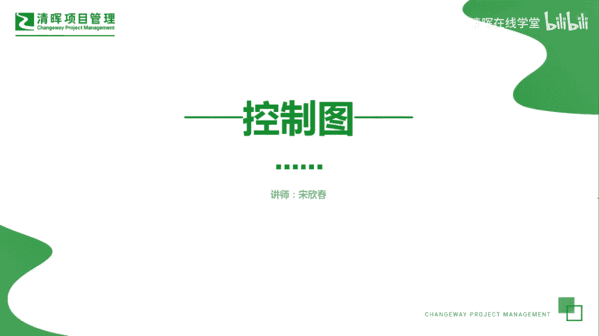
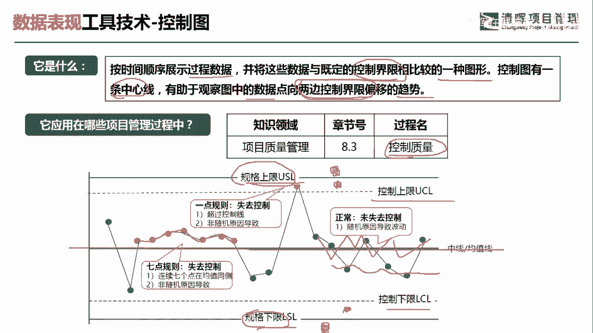
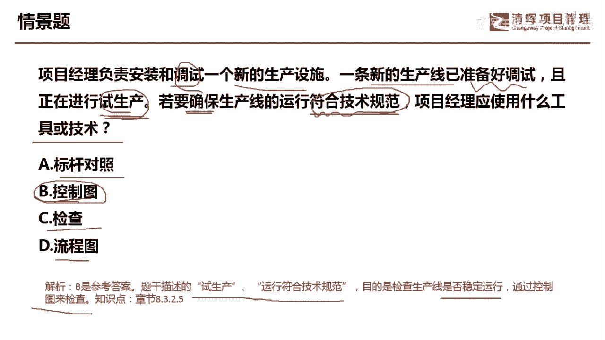

# 项目管理60个实战工具大全 - P9：控制图 - 清晖在线学堂 - BV1tH4y1B7nA

好，我是宋老师。

今天我们来看控制图这个工具，控制图呢它主要是按时间顺序来展示过程数据，并将这些数据与既定的控制界限相比较，的一种图形，所以它也是一种数据表现形式，控制图呢有一条中心线，它有助于观察图中的数据点。

向两边控制界限偏移的趋势，所以呢他是看趋势，它也可以预测未来的质量绩效控制图，只有在质量管理的控制质量过程中使用，它只有在一个过程中使用过，控制图的展现形式是怎样的呢，我们看到下面的这张控制图呢。

它有这样几条线，大家要注意一下，首先呢它有一条这个中心线，中心线中心线是围绕控制的上限和控制的下限，但是我们要注意的是，在这个控制上限和控制下限之外呢，还有一个规格的上限，规格的下限。

我们经常所说产品的不良是怎么产生的，如果它超出了规格的上限，比如说在规格上限之外，那我们直接就可以判定这个产品呢它是不良的，但是呢如果这个控制点它是在控制的上限，控制的下限之外。

但是处于规格上限和规格下限之内，比如说在这个地方哎，在这个地方，我们只能判定它这个质量过程呢是不稳定的，不能直接判定它这个产品此时就是不良的，所以这个地方有个概念，我们要理清楚啊。

好另外还有一种判定控制失控的这种方法呢，就是说如果我们在中心线的上方，发现有连续的七个控制点，这个时候呢我们认为呢，它是因为非随机因素导致的，是一种系统因素导致的这种问题，它往往也是属于失控的。

或者呢在中心线的下方有连续的七个点，这些呢都是代表非随机因素所导致的失控，但是呢如果我们发现有的点它是围绕控制，围绕这个中心线上下波动，这种情况呢它是正常的，是不能说失控的。

它是因为随机因素所导致的正常的波动啊，这个就是控制图的主要的一些特点，有时候呢我们在考试的时候呢，他会在情景题当中告诉你，哎有一个控制上限和有个控制下限，然后呢ABCD4个选项呢其实就是一组数据。

让你判断这个四组数据呢，它是否超出了这个控制的上下限，其实呢这种题目是往往比较好容易判定的啊。

我们具体来看一道题，项目经理负责安装和调试一个新的生产设施，一条新的生产线已经准备好调试，且正在进行试生产，若要确保生产线的运行符合技术规范，项目经理应该使用什么工具和技术，这个情景题呢。

我们可以发现他这个是生产线，正在正在进行试生产，而且呢我们现在要看它运行是否符合技术规范，问应该用什么方法去看它是否哎，我们要确保它符合技术规范的标杆，对照它的特点是什么。

标杆对照主要是寻找内外部的最佳实践啊，去跟最佳实践去学习，那么这道题目很显然情景当中没有提到，最佳实践控制图，控制图呢它是可以预测未来的质量绩效的，它其实呢是可以确保我们生产线这个是生产。

它能够符合技术的规范，不要有失控的情况出现，检查呢，这个工具，它可以在我们这个管理质量和控制质量，过程中使用，它主要是检查你的质量，可交付物是否有缺陷，我们这道题目呢主要是看生产线的运行。

是否符合技术规范，而且它是试生产，所以呢更加符合控制图的这种工具特点，流程图呢，它更多的是这个我们规划质量和控制质量当中，用的这个工具，主要是通过各个流程节点去发现你的质量问题。

或者说规划你的质量管控好，我们这道题目也没有谈到流程的问题，所以呢这题呢我们应该选择控制图，因为题干当中写到了试生产运行符合技术规范，它的目的是检查生产线是否稳定运行，通过控制图来检查好。

今天主要和大家分享的是控制图这个工具。

我们下次再见。

