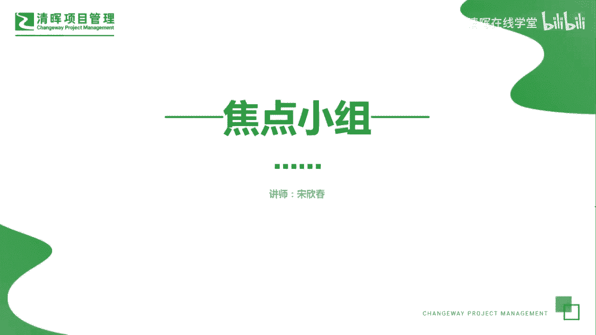
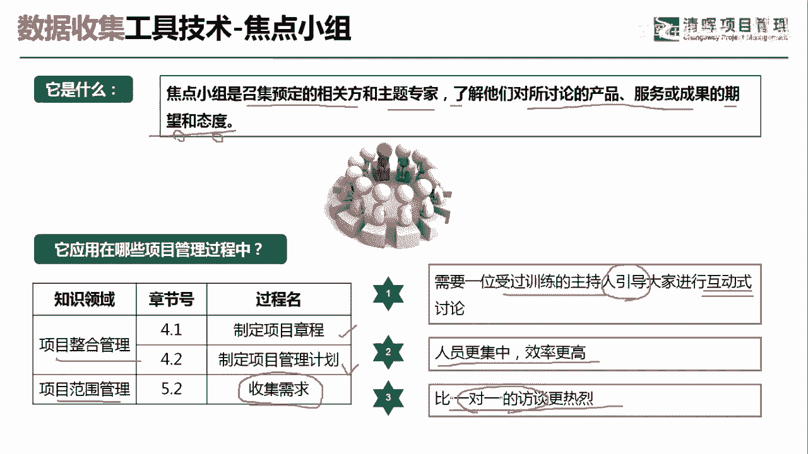
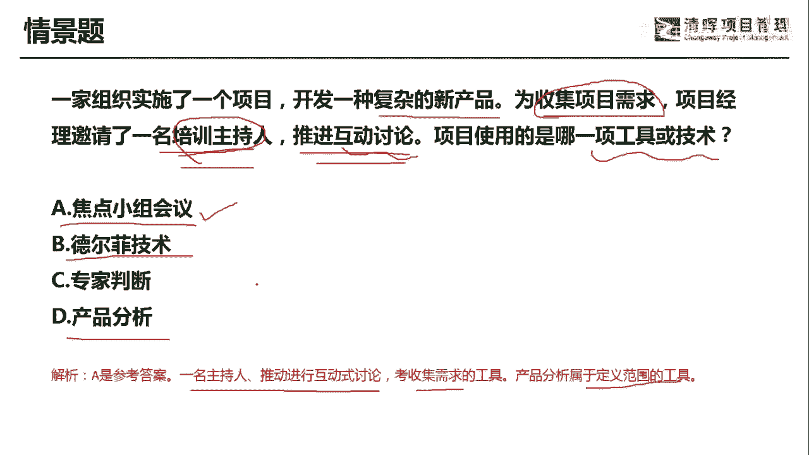
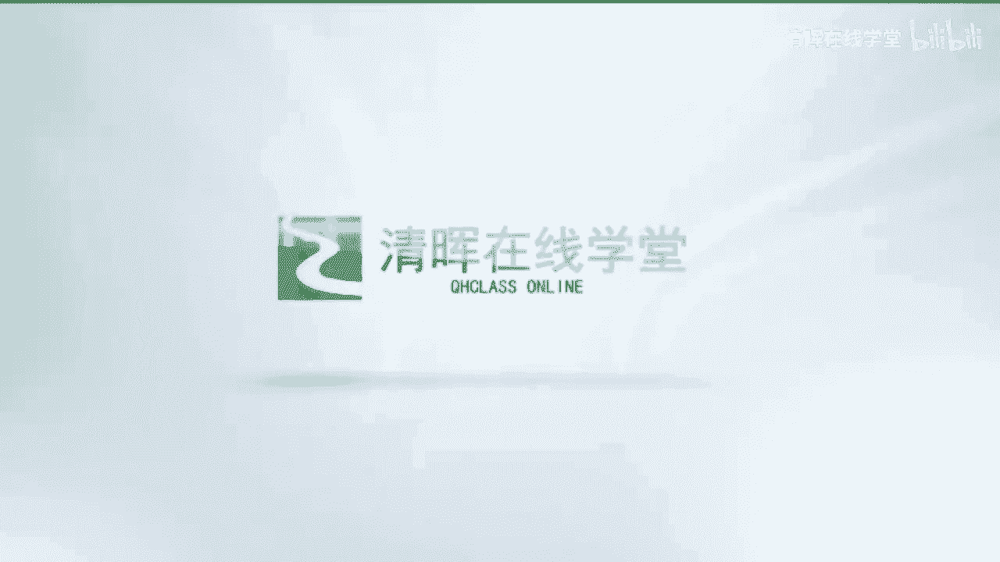

# 项目管理60个实战工具大全 - P15：焦点小组 - 清晖在线学堂 - BV1tH4y1B7nA

各位同学大家好，我是宋老师。

今天我们来看焦点小组这个工具，焦点小组呢他是召集预定的相关方和主题专家，了解他们对所讨论的产品，服务或成果的一个期望和态度，所以呢他重点是了解这个期望和态度，这是他们的关键词，焦点小组这个工具。

它在整个管理的制定项目管理计划，制定项目章程，这两个过程中都会经常用到，在范围管理的搜集需求过程当中，也会用到这个焦点小组，那么焦点小组呢它的适用情景有哪些呢，第一个它是需要一位受过训练的主持人。

来引导大家进行互动式的这种讨论，所以呢焦点小组呢它也是一种互动式的形式，它的效率会更高，而且呢人员会更加集中，他是把大家聚集在一起，所以呢它会比一对一的这种访谈呢更加热烈，一对一的这种访谈呢。

它相对来说呢可以了解一些私密的信息，但是呢不像焦点小组，它效率比较高，就是把所有的这种干性人啊都集中在一起去，针对于某个这个产品服务或成果进行讨论，了解大家对于这个产品服务成果的期望和态度。

所以呢他是了解期望和态度，他和引导不太一样，引导技术它是不但了解你的期望和态度，而且呢他会针对于大家的这种不同的观点，来进行协调，最后呢他能达成一致，这个呢就是引导的一个特点。

所以呢大家要注意它和焦点小组的这个区分啊，我们要了解期望和态度。

一定是用的是焦点小组，具体我们来看这样一道题，一家组织实施了一个项目，开发一种复杂的新产品，为搜集项目的需求，项目经理邀请了一名培训主持人，进行这种推进互动，讨论项目使用的是哪一项工具或者技术好。

这道题目呢已经提醒我们，它是为了搜集项目的需求，所以呢它是在收集需求过程当中应用某些工具，那我们接下来看哪一个工具适用于这个情景呢，A选项，焦点小组会议好，焦点小组会议呢。

它是可以应用在收集这个需求过程中，而且呢它有一个特点，就是有一个主持人来进行，这个互动式讨论的一个推进啊，所以这个是比较合适的，德尔菲技术，德尔菲技术呢它是在头脑风暴的基础上，为了避免这种数据的偏移。

比如说有一个这个意见领袖，来参加你的头脑风暴，那你肯定去听意见领袖的建议，所以呢他收集的数，这个数据呢有可能会产生一些偏移，但是呢德尔菲技术，就是为了避免这个数据的偏移。

他把所有的专家呢进行匿名的这种投票啊，用匿名背靠背的方式进行投票，然后多轮次的投票，最后达成相对比较公正公平的一个结果，专家判断这个工具呢，它也可以在搜集需求的过程中使用，但是呢我们这道题目的情景呢。

因为强调了邀请了这个培训主持人，而且推进互动式的讨论，所以呢它更加适合于这种焦点小组的这种特点，产品分析呢，它不是一个这个搜集需求的一个工具，它是在我们定义范围的时候，要考虑的这种工具好。

因此呢我们这一题是选择A选项，通过一名主持人推动进行互动式的讨论，搜集需求，那产品分析呢是属于定义范围的工具，好，今天呢主要和大家分享的是焦点小组会议，这个工具，我们下次再见。

