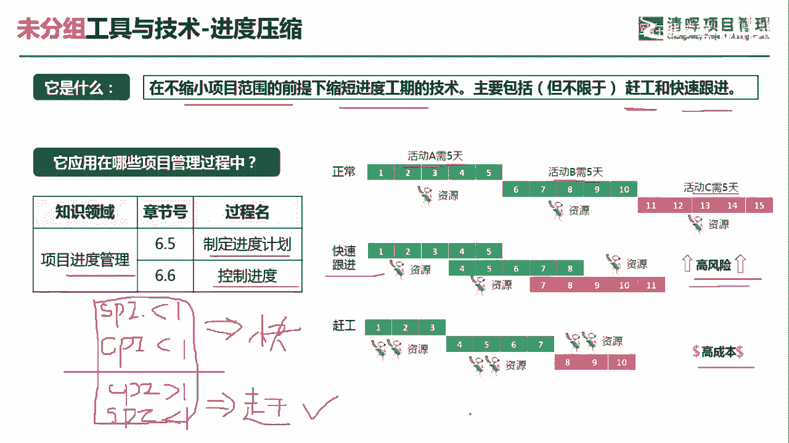
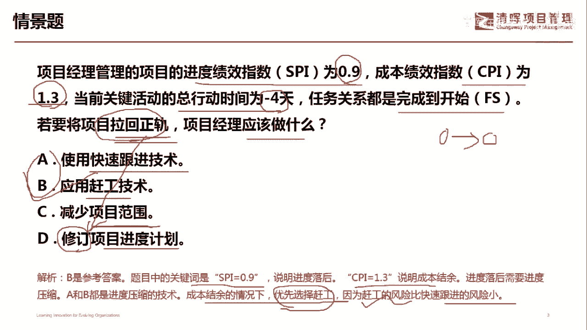

# 项目管理60个实战工具大全 - P16：进度压缩 - 清晖在线学堂 - BV1tH4y1B7nA

各位同学大家好，我是宋老师。

今天我们来看进度压缩这个工具，什么是进度压缩呢，它是指在不缩小项目范围的前提下，缩短进度工期的一个技术，主要包括但不限于赶工和快速跟进，当然了，主要还是赶工和快速跟进，进入压缩技术呢。

主要也是在进入管理知识领域当中的，制定进度计划和控制进入过程中所使用，那什么是赶工，什么是快速干净呢，赶工主要就是增加这个资源，增加这个成本，它其实呢就是拿资源和成本去换时间。

比如说我们经常所说的这种加班，就是属于赶工的一种形式，那他要付加班费啊，或者说这个要进行一些激励啊，这个拿成本换时间，它有没有风险，当然也有快速跟进是什么意思呢，快速跟进它是不去增加资源的前提下。

他呢把多个活动呢，由原来的这种串行改成并行开展，那比如说我们正常的活动，我们可能是需要这个A活动需要五天，B活动的需要五天，C活动需要五天，那如果是这个快速跟进的话，那其实呢就是把这个A活动和B活动呢。

把它叠加起来，包括C活动一起叠加起来，这个是并行开展，那并行开展的，同样也可以去对于进度来进行这个压缩，但是呢它产生了一个后遗症，就是会产生一些高风险啊，刚才我们所说的这个赶工，它有没有风险。

也会有风险，但是赶工的风险呢相对于快速跟进会小一点，那它也是会产生成本的，那这种这个快速跟进和赶工呢，经常会怎么样去考呢，它一般会结合正值管理当中的两个指数，一个是CPI，一个呢是CPI结合起来。

如果这道题目告诉你，SPI小于CPI也小于，这说明什么进度落后，成本超支，所以在这种情况下呢，我没有资源，没有钱，那你只能用什么，只能用快速跟进，如果这个时候他告诉你，这个CPI这个时候是大于一的。

当然了，它SPI还是小于一啊，SPI还是小于一，说明了进度还是落后的，但是呢他好歹这个成本还是有结余的，所以呢他可以怎么样可以拿这个成本去换时间，拿成本去换时间，这个时候呢我们建议呢就是选赶工了。

如果这道题目呢没有SPI和CPI，他只是问你这个进度现在落后，我们怎么样去赶进度，那你呢优先选择赶工，因为赶工相对于快速跟进来讲，它的这个风险会小一点啊。

这也是一个经常会用的一些措施，好我们具体来看这样一道题，项目经理管理的项目进度绩效指数啊，这个你们看见了SBIS0。9，说明进度落后，成本绩效指数CPI呢是1。3，说明了这个成本有这种结余。

当前关键活动的总行动的时间是四天，任务关系都是完成到开始的关系，就前面一个活动完成了，后面一个活动紧接着开始，若要将这个项目拉回正轨，问项目经理应该做什么，拉回正轨，其实呢就是说拉回你的这个基准啊。

比如说我们的进度基准，你要拉回这个基准A选项，使用快速跟进技术行不行，快速跟进技术呢它其实风险是比较大的，风险是比较大的，在这种情况下呢，我们呢是不建议用这个方式好，B选项应用赶工技术赶工。

我们这个时候呢因为CPI是1。3，说明我们还是有成本的，有资源的，那我们可以去购买这个新的资源，或者呢采用加班不加班配的方式，这个可以优先考虑，C选项，减少项目的范围，这是不建议的啊。

这是属于一种风险的规避策略，减少范围，风险减少风险好，减少范围，这是不建议的啊，D选项修订项目进度计划，因为他现在要拉回正轨，所以呢根本就不存在修订进度计划这一说啊，它只是要维护原来的进度基准。

因此呢我们这道题目是选赶工赶工，因为你发现进度落后，成本有结余，这个进度落后需要进度压缩，那A和B呢都是属于进度压缩技术，在成本有结余的情况下，我们优先选赶工，因为赶工的风险呢相对于快速跟进。

风险会小一点，好我们这一题选B选项，今天呢主要和大家分享的是这个进度压缩技术。

我们下次再见。

