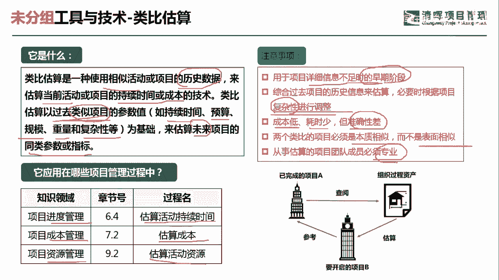
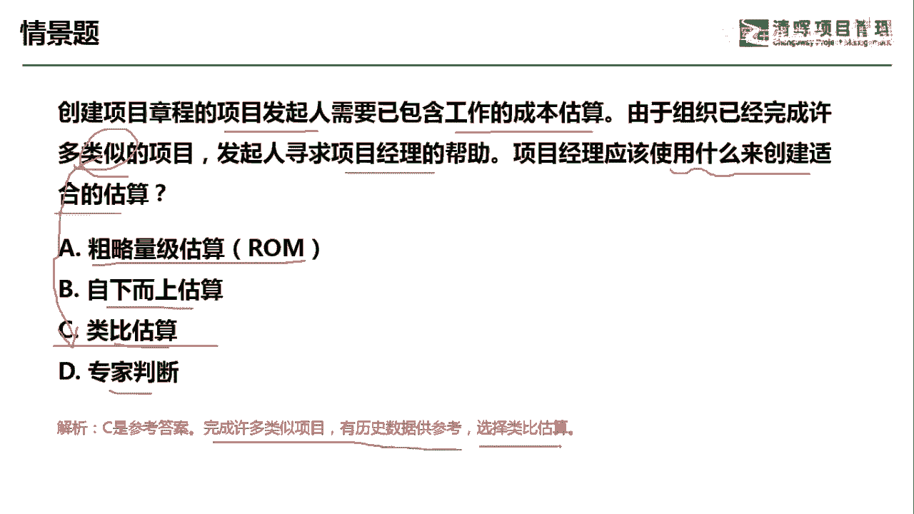

# 项目管理60个实战工具大全 - P17：类比估算 - 清晖在线学堂 - BV1tH4y1B7nA

各位同学大家好，我是宋老师。

今天我们来看类比估算这个工具，什么是类比估算呢，它是一种使用相似活动或者项目的历史数据，来估算当前活动或者项目，持续时间或者成本的一种技术，那当然了，现在我们也加上了一些资源，也可以去进行估算。

类比估算呢它是以过去类似项目的一些参数值，类似过去的类似项目参数值，哪些参数值呢，比如说持续时间，预算规模，重量复杂性等等，它这些参数值为基础，来估算你未来项目的同类的参数或者指标。

那这个呢就是类比估算的一个主要定义，类比估算这个工具在进度管理，成本管理和资源管理当中都会用到，比如说我们在估算活动持续时间的时候，在估算成本的时候，在估算活动资源的时候，都会用到类比估算。

所以说类比估算呢它是一个估算的主要工具，但是呢我们有一些注意事项，就是在什么情况下会使用类比估算呢，第一个就是用于项目详细信息不足的，这个早期阶段，比如说我们在项目这个规划的时候。

你发现你现在呢手头上没有一些这个，详细的这个工作包，那你这个时候呢可能有一些过去的一些项目，也是类似的，那可能呢我们就可以参考它的这个参数值，来估算，还有就是综合过去项目的历史信息来估算。

必要时根据项目的复杂性进行调整，也就是说类比类比它不是完全相似的，它可以根据一些历史信息来做一些调整，根据项目的复杂性来进行调整，类比估算的成本是比较低的，它耗时也比较少，但是呢准确性是比较差的。

因为它是在短时间内进行的一种估算，它不像这个自下而上估算，它这个有了详细的这个WBS之后，这样的估算呢它可能就是比较精细了，两个类比项目呢它必须是本质上相似的，而不是表面相似，这个里面的本质相似呢。

就是比如说我们同样的是建造大楼，那么旁边的大楼是由同一家公司来建造的，那这个公司呢他建造了另外一栋大楼，那我们就可以作为一个参考，那你不可能说建造大楼的跟建造飞机的，做这个互联网开发的某些项目做参考。

这个呢就是本质上它不是相似的，那从事估算的这个团队呢是必须是专业的，也就是说他有专业的人做专业的事情，这个就是类比估算的主要的一些注意事项。

我们来看这样一道题，创建项目章程的发起人，需要以包含工作的成本估算，由于组织已经完成许多类似的项目发起，寻求组织，寻求项目经理的帮助，项目经理应该使用什么来创建合适的估算好，这题呢其实是估在估算成本。

他已经告诉我们有类似的项目，那在这种情况下呢，我们可以用这个类比估算，那出量级估算是什么含义呢，粗量级估算一般是在项目启动的时候，我们有可能这个要制定项目章程当中，也需要有一个这个总体的估算。

总体的预算估算，那这个时候呢它是比较粗略的自下而上估算呢，它也是属于我们在规划过程当中估算进度，估算成本，估算活动资源的一种估算技术，但是它主要是有了这个比较明晰的这个，WP框架之后。

自下而上进行了估算，所以呢它的这个估算值呢，相对类比估算是比较精确的啊，专家判断，专家判断呢，我们可以看成是一种自上而下的估算，那么这种估算呢相对来说也是比较粗略的，但是呢我们这道题目已经明确了。

有类似的项目，那我们完全就可以参考类比估算这个工具好，我们这道题目是选C选项，完成许多类似的项目，有历史数据参考，可以选择类比估算好，今天呢主要和大家分享的是类比估算这个工具。

我们下次再见。

