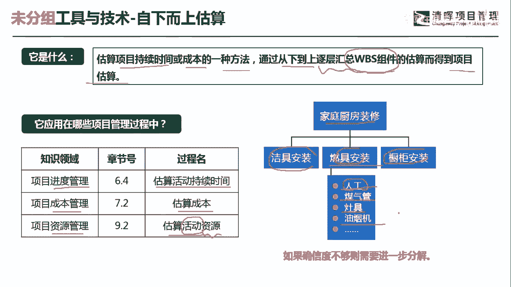
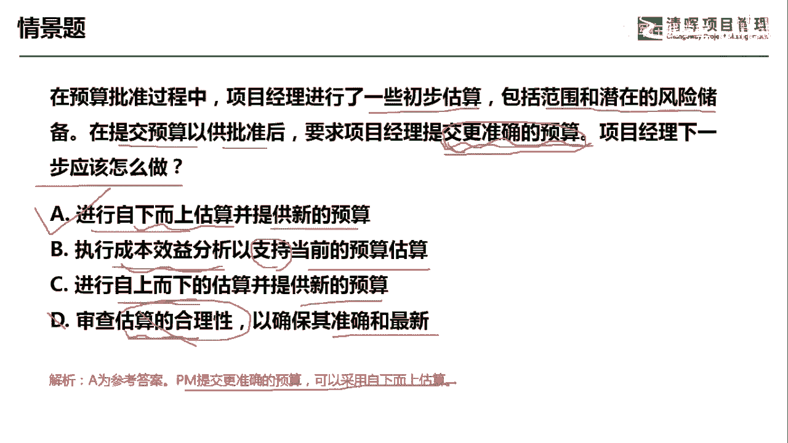

# 项目管理60个实战工具大全 - P22：自上而下估算 - 清晖在线学堂 - BV1tH4y1B7nA

我是宋老师，今天我们来看自下而上估算这个工具。

自下而上估算呢，它主要是估算项目持续时间，或者成本的一种方法，通过从下到上逐层汇总WPS组件的估算，而得到的项目的估算，所以呢自下而上估算的，必须是有一个比较明确的WBS组件。

然后在此基础上才能自下而上逐层的进行汇总，估算好自下而上估算，它主要是在进度管理的估算，活动持续时间经常会用到，比如说我们要估算活动的持续时间，那你通过这个前期的WBS分解。

然后逐渐的这个每一个WBS有哪些活动，需要去安排，每个活动的时间，你就会知道，这样你总体的活动持续时间也会估算出来，在成本管理当中呢，估算成本也会用到自下而上估算，通过自下而上估算之后呢。

你会对于接下来的这个制定预算，会有一个比较精确的一个估算基础，另外在资源管理的估算，活动资源当中也会用到自下而上估算，这个时候呢，因为我们前面呢对于活动呢有了一个估算之后。

你接下来相对应的活动所配给的一些资源，同时同时呢也会得到估算，家庭厨房装修如果是作为一个项目的话，那我们可以对他的一些可交付成果呢，进行一个这个划分啊，比如说洁具的安装，燃具的安装，橱柜的安装。

这个呢是按照可交付成果来划分的，我们都知道WBS的划分呢有这样几种形式，一种呢就是按照可交付成果进行划分，一种呢是按照生命周期来划分，还有一种呢是混合式的方式，既有这个按可加服务。

也有呢按照阶段我们这个例子当中呢，很显然是按照可交付成果，其中燃具安装当中再往下分解，可以分解成人工煤气管要安装，还有灶具要安装这个油烟机要安装啊，人工呢要人工的这个安排，所以呢根据这个WBS。

你基本上就可以估算出来，你的这个活动的持续时间，还有相应的估算的成本，还有呢我们的活动所需的一些资源，都可以得到自下而上估算，是一个比较精确的一个估算，那相对于他这个精确来讲呢。

我们这个类比估算呢就是比较粗略的，类比估算呢一般是在情况比较紧急的时候，或者说我们过去有一些类似的这个项目，作为一个参考啊。

也是可以用这个类比估算的，我们具体来看这样一道题目，在预算批准过程中，项目经理进行了一些初步的估算，包括范围和潜在的项目，潜在的这个风险储备，再提交预算以供批准之后，要求项目经理提交更加准确的预算。

项目经理下一步应该怎么做，他要提交更加准确的预算，那我们应该怎么办呢，A选项进行自下而上的估算，并提供新的预算，先有估算这个成本，然后呢再进行制定预算，所以呢我们可以通过自下而上的估算。

这种是相对比较精确的，B选项执行成本效益分析，以支持当前的预算估算，这个是写的是支持，我们现在要提交更加准确的估算，成本，效益分析呢更多的是我们出现了某些这个机会，或者说出现了一些新技术的时候。

你要考虑是不是使用采用这个新技术，或者呢呃增加一些零部件，你这个时候要考虑一个性价比啊，所以呢他不会去给你提交更加准确的预算，C选项进行自上而下的估算，并提供新的预算，自上而下估算。

其实就是一些专家判断它是从上往下的，这种估算呢相对来说是比较粗的啊，它不像自下而上估算，有一个明确的WBS为基础，D选项审查估算的合理性，以确保其准确和最新估算的合理性。

并不能去这个协助提交更准确的预算，它只是你这个更准确预算的一个这个附加，就是说你是怎么样去得出这个更准确的预算的，因此呢我们如果从工具的角度来看，这个D呢不是一个工具，它其实呢是一个嗯输入参考。

输入参考好，我们这题呢应该是通过自下而上的估算，得到更加准确的这个预算，今天呢主要和大家分享的是自下而上估算。

这个工具，我们下次再见。

