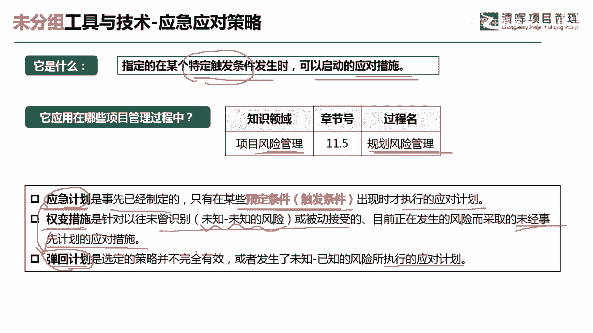
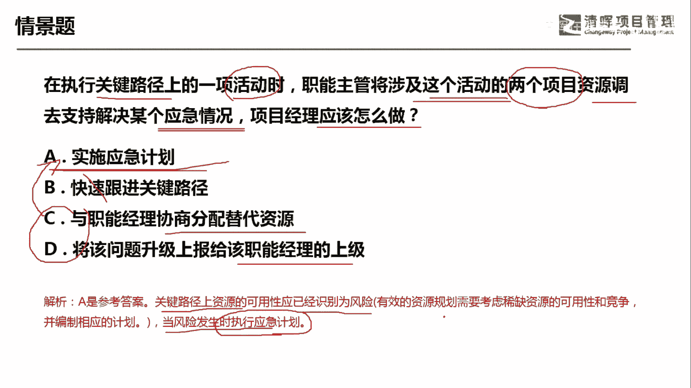

# 项目管理60个实战工具大全 - P23：应急应对策略 - 清晖在线学堂 - BV1tH4y1B7nA

各位同学大家好，我是宋老师。

今天我们来看应急应对策略这个工具，应急应对策略它是指定的，在某个特定的触发条件发生时，可以启动的应对措施，这个策略呢它其实是提前已经制定好的，我们只要等到有特定的触发条件发生的时候。

我们就可以启动这个应对的措施了，应急应对策略呢它是属于风险管理的规划，风险管理过程中所使用，为什么呢，因为我们这个时候呢是在规划风险的各项指南，各项策略，所以这个时候也会考虑到应急应对策略的制定。

有时候应急应对策略也翻译成应急计划，翻译成应急计划，它是事先已经制定的，它只有在某些预定的条件或者触发条件发生时，我们才能执行的应对计划，比如说这个下雨要收衣服，这个是一个风险发生，那在这个下雨之前呢。

我们有可能看到乌云，看到这个瓜分，所以呢瓜分和乌云，它就是属于一些预定条件或者叫做触发条件，在你看到这些条件存在的时候，我们就应该可以去实施应急应对策略好，另外一个叫全面措施。

全面措施呢它是对应这个应急计划的，全面措施呢，它往往是针对以往这个未曾识别到的，一些未知的未知风险的时候，或者被动接受的目前正在发生的风险而采取的，未经事先计划的应对措施，它其实也是权宜之计。

它不是长久的，他不是像这个应急计划，他有事先的这个制定的，它是临时发生的这种事件啊，所以我们可以应对未知的未知风险，什么叫未知的未知风险，也就是说我不知道这个是不是有风险，我也不知道他在什么情况下发生。

所以呢在这种情况下突然出现了，我只能采取全面措施，但是你采取全面措施之前，一定要申请各项变更，比如说申请一些储备啊，啊申请一些这个特殊的时间啊，好弹回计划呢，它是在选定的策略并不完全有效。

或者发生了这个未知的已知风险，所执行的应对计划，这个什么意思呢，弹回计划其实就是我们所说的AB计划，当中的B计划，它是A计划，应急计划无效，这个时候我们再会用这个弹回计划，他会计划其实也是属于。

应对已知的未知风险的啊，什么叫已知的未知风险呢，就是说我知道这个是一个风险，它可能会发生，但是我并不知道它在什么情况下去发生，那这个呢就叫做已知的未知风险，好我再说一下，应急计划和谈回计划。

对应的都是已知的未知风险。

全面措施对应的是未知的未知风险，我们来看这样一道题，在执行关键路径上的一项活动时，职能主管将涉及到这个活动的两个资源调取，支持，解决某个应急情况，问项目经理应该怎么做，这说明什么情况呢。

这说明你关键路径上是有一个活动的，是需要一些资源去完成的，但是你这个时候把资源调走了，那你应该怎么做，关键路径上的这个资源，一般是不能轻易的去动的啊，你一旦动了之后就会产生一些不确定性。

因此呢它是一种风险，所以呢在这种情况下，已知的未知风险发生了，我们采取的就是应该是实施应急计划，应急计划或者叫应急应对策略，快速跟进呢，它主要是这个在进度压缩当中采取的一种措施，进入压缩呢还有赶工啊。

还有快速跟进，赶工呢他是拿资源换这个进度，那这个快速跟进呢是拿风险换进度好，但是我们这道题目没有说，我们这个进度已经落后，因此不要选择快速跟进，而且他风险非常大，C选项与职能经理协商分配替代资源。

可不可以可以，D选项将该问题升级上报给该职能经理的上级，可不可以也可以，但是呢，CD呢都属于实施应急计划当中的计划之一，所以A包含了CD啊，我们还可以怎么样，还可以到外部去招募啊。

招募资源或者怎么样去培训资源都可以，它都属于应急这个计划之一，好这题呢我们是应该选A选项，因为关键路径上的资源呢，它的可用性应该是已经识别为一个风险的，当风险发生时，我们就应该执行应急计划好。

今天的主要和大家分享的是应急应对策略。

这个工具，我们下次再见。

