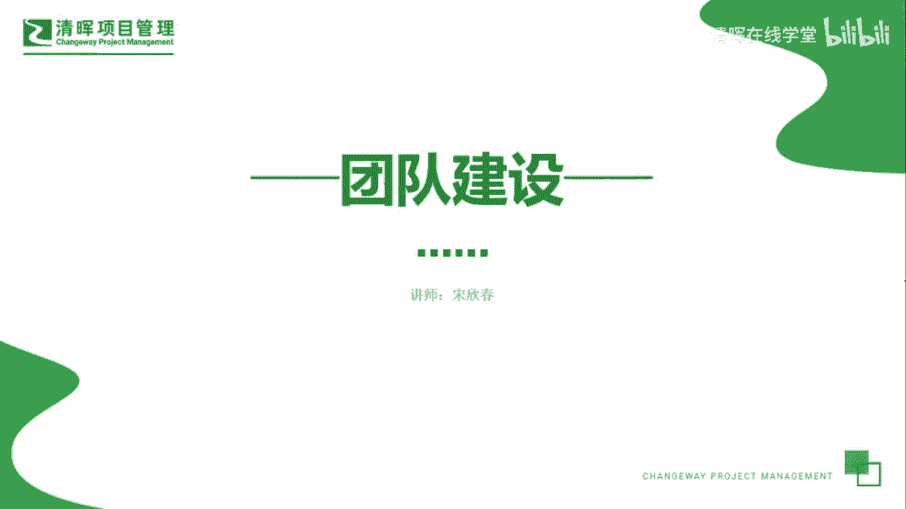
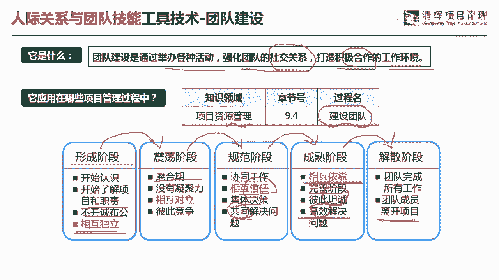
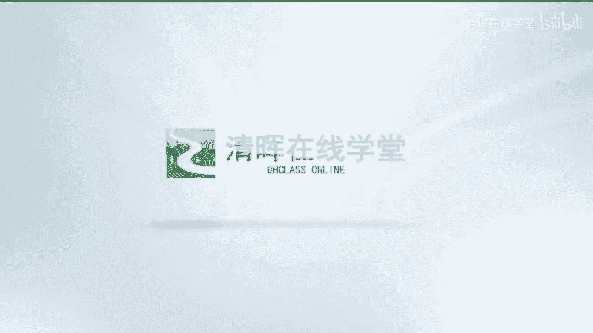

# 项目管理60个实战工具大全 - P25：团队建设 - 清晖在线学堂 - BV1tH4y1B7nA

各位同学大家好，我是宋老师。

今天我们来看团队建设这个工具，团队建设呢主要是通过举办各种活动，强化团队的社交关系，打造积极合作的工作环境，其实它主要是为了大家能够破冰，就是打破人际间的一种隔阂，所以呢团队建设它是在资源管理的。

建设团队过程中所使用，我们建设团队之前呢是有一个获取资源，获取资源，有人的资源，有物的资源，那把人的资源获取过来之后呢，你接下来就是要把这个团队呢战斗力提升，所以呢它有一个建设团队过程。

团队建设有一个理论叫做塔克曼阶梯，发展阶段理论，这个是指的我们有一个团队，他从行程一直到解散，他们经历了五个阶段，第一个叫做形成阶段，形成阶段的特点呢就是说大家呢开始认识。

开始了解到项目和各自的工作职责，但是呢没有开诚布公，相互是独立的，彼此呢可能谁也不跟谁特别熟，大家呢先观察这些呢都属于形成阶段的特点，第二个阶段呢叫做震荡阶段，震荡阶段呢也叫磨合期，它是相互对立的。

这个时候呢有很多的冲突存在，有彼此的竞争，就是有时候的想法都出现了，在某一次会议上，大家的想法都在出现，然后呢彼此有一些这种竞争对立，这些都属于震荡阶段，震荡阶段再往下就到了这个规范阶段。

当然有的团队永远是在震荡，这说明了他这个团队的这个项目负责人呢，可能需要领导力的这个提升，好政党阶段，他如果平滑的话，那就到了这个规范阶段了，规范阶段它主要特点呢就是能够相互协同工作。

相互的信任来我们没有冲突了，剩下的是信任，然后集体决策，共同去解决某个问题，共同去解决某个问题，这个时候呢是开始慢慢的，有这个工作效率出现了啊，你不可能在震荡阶段产生工作效率，好规范阶段再往上呢。

还有一个成熟阶段，成熟阶段的特点是相互依靠，这个时候呢是比较完善的一个阶段，彼此之间的是非常坦诚的，能够高效地去解决问题啊，这个地方是高效的解决问题，刚才呢规范阶段是共同的去解决问题。

最后一个阶段呢就是各回各家，叫做解散阶段，团队完成所有的工作，团队成员离开项目，这个就是我们塔克曼阶听团队理论，它总共有五个阶段，有时候考试的时候呢，他会给你一个情境。

它让你描述这个是属于哪一个发展阶段，如果你发现大家呢彼此有很多的冲突，那很显然处于震荡阶段，那如果发现大家开始干活，开始相互信任，那肯定是规范阶段，如果是高效的解决问题。

那很显然是属于成熟阶段，我们具体来看这样一道题，项目团队资源位于三个不同的国家，所处时区，至少比项目经理时区呢早12个小时，项目经理过去只有与集中团队，集中办公团队一起工作的经历。

在首次的项目团队会议上，项目经理注意到，对沟通方法存在许多的冲突和争论，项目经理应该在这次会议之前，引入什么工具或技术，来提高此次会议以及今后所有其他会议的效率，这个时候呢我们出现了这种冲突。

那很显然属于塔克曼阶梯发展阶段的政党阶段，位于三个不同的国家，资源位于三个不同的国家，说明它本身是虚拟团队，但是项目经理呢，以往只是与集中办公团队有一起工作的经历，那这个时候在会议上出现了冲突。

他应该在会议之前呢去引入什么样的工具，来提高这个会议的效率，其实在这个之前你要做好什么样的活动呢，你要考虑好这个虚拟团队，更多的是要加强沟通，要打破一些隔阂啊，要理解各自的这种国家文化好，A选项。

团队建设活动，团队建设活动呢它主要是这个破冰，把大家凝聚在一起，打造高绩效的团队，因此呢这个是在会议之前可以去考虑的，我们来一次团队建设，比如说大家呢这个在线上，或者做一个这个协作游戏。

那这样的话大家可以彼此熟悉，所以团队建设活动，这是OK的，团队章程，这不是一个工具，团队章程呢是属于我们规划资源管理，的一个输出内容，它主要是明确团队之间的一些价值观啊，它不是一个工具。

培训这个是一个工具，但是培训呢往往是应对，我们缺乏某些技能的情况下去参与，去培训，集中办公，集中办公呢它主要是解决工作效率提升的问题，但是呢我们这个时候呢它是虚拟团队，他并没有说我们接近某一个里程碑。

到了到了什么重要的节点啊，因此不需要集中办公，所以我们这一题呢应该考虑A选项，如果团队成员工作地点相隔甚远，无法进行面对面的接触，就特别需要有效的团队建设策略啊，我们这一题选A选项好。

今天呢主要和大家分享的是团队建设这个工具，我们下次再见。

