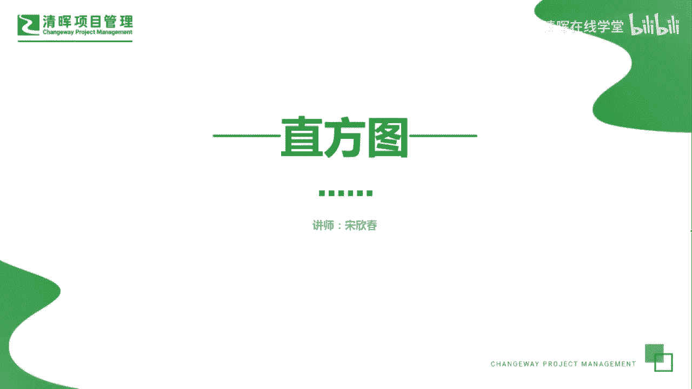
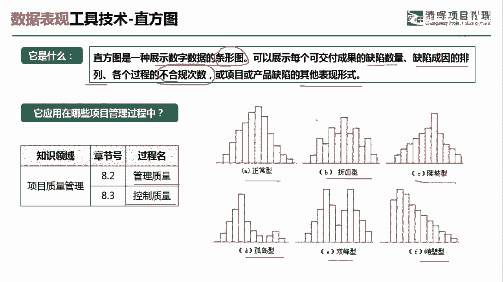
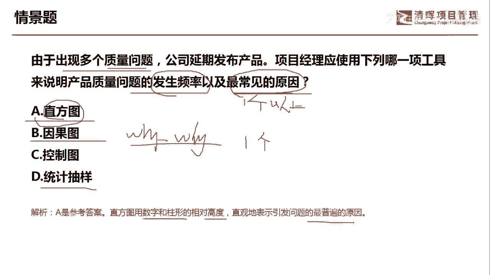
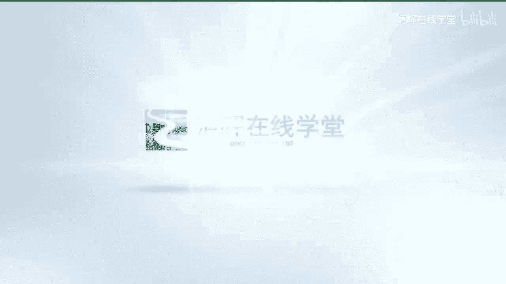

# 项目管理60个实战工具大全 - P29：直方图 - 清晖在线学堂 - BV1tH4y1B7nA

大家好，我是宋老师。

今天我们来看直方图这个工具，直方图呢它是一种展示数字数据的条形图，它有时候也称为条形图，可以展示每个可交付成果的缺陷数量，缺陷成因的排列，还有各个过程的不合规的次数，或者呢项目或产品缺陷的其他表现形式。

直方图只有在质量管理的管理，质量和控制质量过程中所使用，它其实呢展示的是引起缺陷的主要原因，和帕累托图是一样的，但是帕累托图呢更多的是有排序啊，他把这个最主要的原因呢是放在最左边的，它不像这个直方图呢。

它比较随性，它有各种形式去展现这个缺陷的数量，或者其他的这种缺陷的表现形式，正常型啊，折尺形啊，陡坡型啊，还有孤岛型啊，双方型啊，峭壁型啊，这些都可以去用来展示你的主要原因。

是一个直方图的表现形式，我们具体来看这样一道题，由于出现多个质量问题，多个质量问题，产品延期发布产品，公司延期发布产品，项目经理应该使用下列哪一项工具，来说明产品质量问题发生的频率，以及最常见的原因。

最常见的原因好，这个里面我们有必要做一下补充，就是直方图呢，它其实呢也可以去展示一定的频率，以及它可以发现的是主要原因，这里面主要原因其实就是最常见的原因，因果图呢也叫做石川图，或者叫做鱼骨图。

或者叫做y guy图，这个里面y guy图呢就是你多寻找，多问几个，为什么Y跟Y图因果图它主要是发现根本原因，这里面根本原因呢一般指的是一个最常见的音，也就是主要原因呢，它一般是一个以上啊。

一个以上这个地方呢大家要注意一下，控制图呢它主要是展示你质量过程是否稳定，它也是控制质量的一个工具，另外它可以预测你未来的质量的趋势，统计抽样，更多的是从一个小的样本来推算出总的母体。

或者说更多的样本统计数量的，一般我们用在这个有些行业会用的比较多一点，他不可能大批量的去这个E的开箱去检查，或者呢你生产出来的汽车，不可能每一个汽车你都会去这个去撞击一下，他有可能去样本抽样抽样一下。

你的这个一些安全系数去撞击撞击实验对吧好，综上所述呢，我们这一题，如果是说明产品质量问题发生的频率，以及最常见的原因，那我们可以选择直方图，其实更好的也可以选择帕累托图，帕累托图它更加直观。

它是排序的直方图，直方图用数字和柱形的相对高度，直观地表示引发问题的最普遍的原因，这题呢我们选A选项好，今天主要和大家分享的是直方图这个工具。

我们下次再见。

