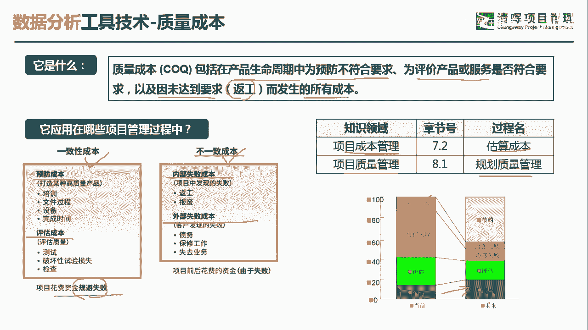
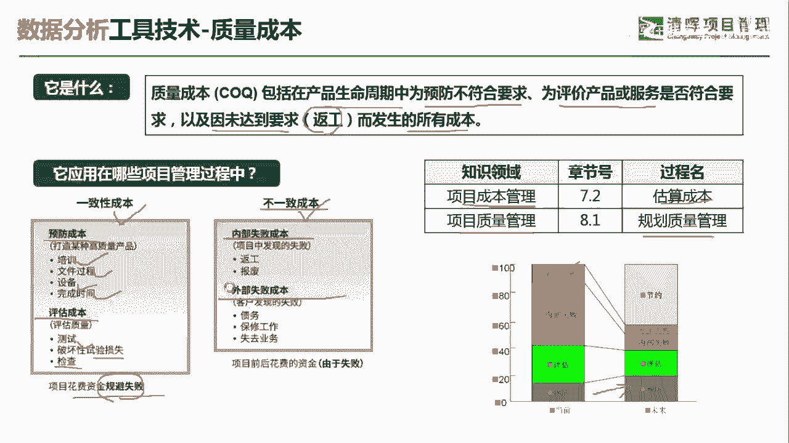
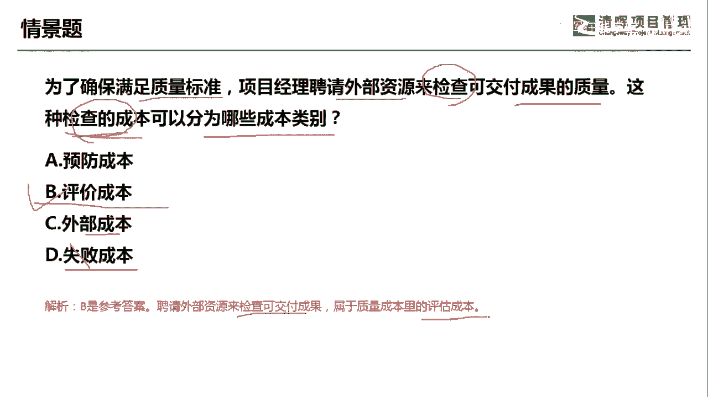
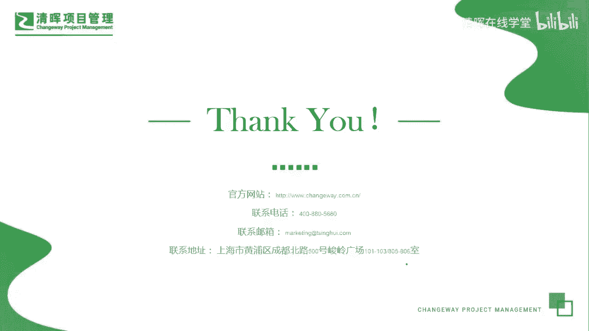

# 项目管理60个实战工具大全 - P31：质量成本 - 清晖在线学堂 - BV1tH4y1B7nA

各位同学大家好，我是宋老师。

今天我们来看质量成本这个工具，质量成本呢是包括在产品生命周期中，为预防不符合要求，为评价产品或服务是否符合要求，以及因未达到要求，比如说要进行返工而发生的所有成本，质量成本呢。

它在项目成本管理的估算成本过程中会使用，比如说我们估算成本的时候，你要考虑到质量的成本，在质量管理的规划，质量管理过程中也会考虑到质量成本，因为我们要做好质量的规划，要考虑到哪些这个质量要考虑进去。

好质量成本呢它分为两个大类，一个呢叫做一致性成本，一个叫做非执行成本，也叫不一致性成本，其中一致性成本呢分为两类，预防成本和评估成本，预防成本呢它和评估成本一样，都是为了花费资金来规避失败的。

它其实就是为了避免失败而导致的必要的花费，比如说对员工进行培训，对他进行标准操作流程的培训，就是为了避免他在后期的操作不规范，而导致的反攻，所以呢这是必要的花费，另外在评估成本当中呢。

比如说我们生产汽车的，要对汽车的安全系数进行考察，那你要把这个车进行撞击实验，那装修实验它其实是一种这个破坏性的实验，损失它是必要的，所以呢它也会产生成本，这个呢就是评估成本当中的一种，还有呢测试检查。

有时候呢也会导致一些成本发生，但是呢这些都是必要的一种花费，但是还有一种是不必要的花费，他们统称为不一定成本，那么不一定成本呢又分为两类，一个叫内部失败成本，一个叫外部失败成本。

他们其实是由于失败而导致的一种花费，完全可以规避，内部室外成本呢，一般是由项目中发现了这种失败，比如说有我们的这个质量保证，或者说质量控制团队去发现了一些返工报废，或者呢这个外部室外成本是由外部的客户。

客户去发现的这种失败而导致的一些债务啊，或者保修的工作啊，或者说失去了这种业务，那这些呢叫做不一致性成本，那我们在平时的质量成本的管理当中呢，我们要规避哪一类的风险，这个质量成本的这种出现呢。

首先要压缩不一致性成本，也就是外部失败和内部失败成本，要把它尽量的要把它消除掉，其实呢这些都是不必要的花费，但是我们可以重点关注哪一类呢，我们可以提升这个预防成本，提升预防成本呢。

其实就是为了避免后期产生这个失败，而导致不必要的花费啊。

这个呢就是质量成本的一些使用方式，我们具体来看这样一道题，为了确保满足质量标准，项目经理聘请外部资源来检查，可交付成果的质量，这种检查的成本可以分为哪些成本类别，好这里面提到了检查的成本。

刚才我们所说预防成本当中包含哪些好，预防成本呢，比如说我们这个给员工进行培训。

对机器进行保养，这些都属于预防成本啊，培训文件过程，标准化设备保养完成时间规范好，评估成本呢，评估成本包括了测试，破坏性的实验损失以及检查好。

我们可以看到题目当中提到的检查成本，那我们可以把它归类为评价成本，外部失败成本，这是由于客户发现的失败导致的成本好，失败成本呢，它这个里面分为内部失败和外部失败，这个颗粒度画的更加粗一点。

因此呢这一题呢我们应该选择B选项，他是聘请外部资源来检查可交付成果，属于质量成本里的评估成本好，今天呢主要和大家分享的是质量成本这个工具。

我们下次再见。

