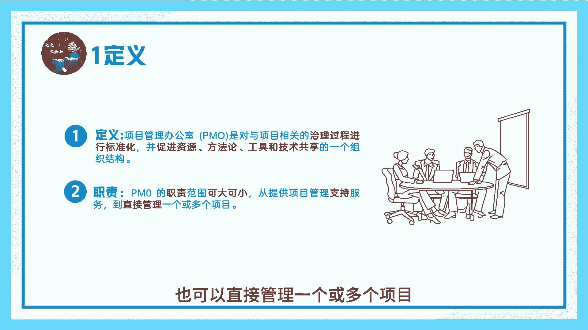
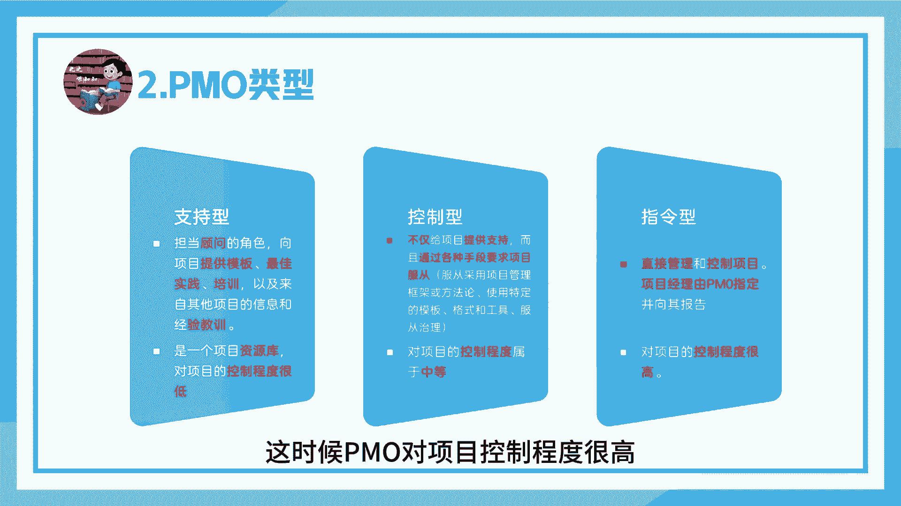
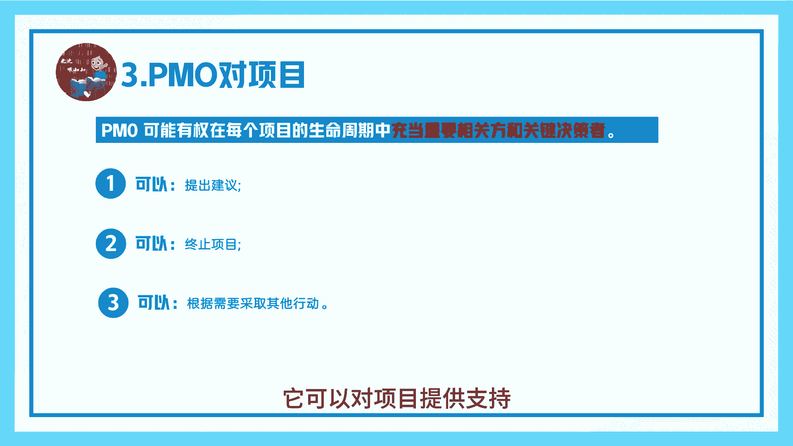
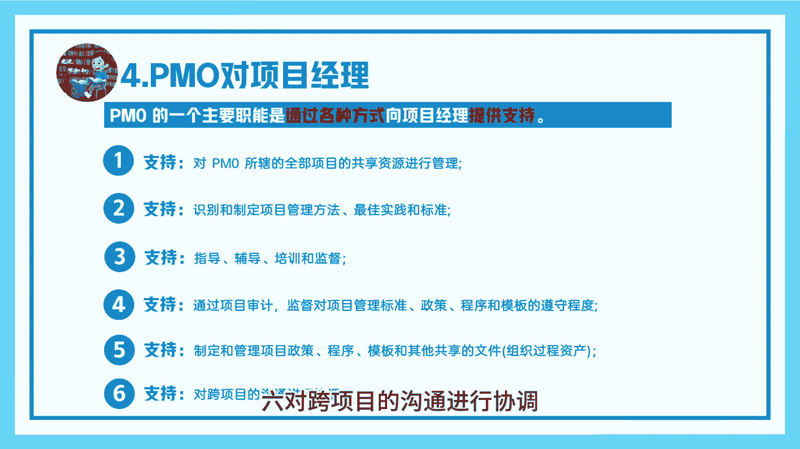
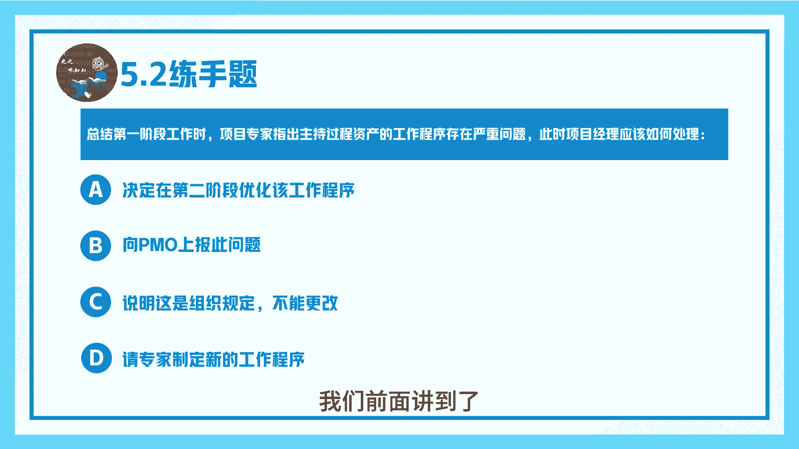
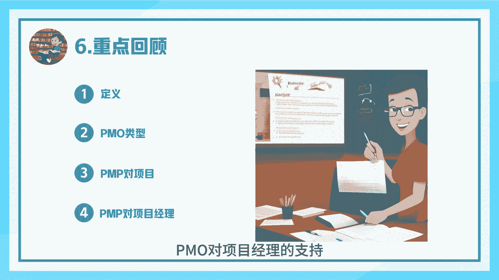

# 项目管理办公室PMO-PMP系列第八讲-之之喂知知 - P1 - 之之喂知知 - BV1JypTeiELz

♪ 海上的晚霞像年少的画铺在天空 ♪，♪ 等海鸥衔走它 ♪，♪ 遥远的帆 ♪，♪ 任风浪拍打 ♪，♪ 为梦再痛也不会害怕 ♪，♪ 远远走的风沙去谁的 ♪，大家好，今天开始我们PMP系列第八讲。

项目管理办公室，我是孜孜魏孜孜，现在看一下P保和定义，PMO是对与项目相关的治理过程进行标准化，并促进资源方法论，工具和技术共享的一个组织结构，JOOO的职责可大可小，他可以对项目提供支持服务。

也可以直接管理一个或多个项目。

PMOO有三种类型，第一种字词形，这是我的PMO担当顾问角色，他向项目提供模板，最佳实践培训以及经验教训，这时候PMO是一个资源库，对项目的控制程度很低，第二种类型控制型，它不仅给项目提供支持。

而且通过各种手段要求项目服从，这时候P52对项目的控制程度属于中等，第三种指令型，POO直接管理和控制项目，项目经理由PO指定并向其报告，这时候确保对项目控制程度很高。

看下PMO对项目的影响，PMO可能有悬，在每个项目生命周期，他可以对项目提供支持。

可以终止项目，可以根据需要采取其他行动，PMO对项目经理而言，PMO的一个主要职能是，通过各种方式向项目经理提供支持，它主要支持包括，一对所辖的全部项目的共享资源进行管理，二识别和自制定项目管理方法。

最佳实践和标准，三指导辅导培训和监督，侦测模板和程序的遵守程度，五制定管理项目的政策程序，模板和其他共享文件，六对跨项目的沟通进行协调分享。

练手题，第一题不直接管项目，但有权要求项目采用公司特定的项目管理，方法论的PO属于什么类型，这很明显属于控制型，D答案教练型，这是民警里面的第二题，总结第一阶段工作时，项目专家指出。

组织工程资产的工作程序存在严重问题，此时项目经理应该如何处理，这时候应该向平文汇报，因为组织过程资产中的工作程序，我们前面讲到了。

他有PML或项目外成员更更新回重点回顾，本节主要讲的拼谋定义，拼模类型，拼模对项目的影响，拼谋对项目经理的支持。

下一集我们将为大家讲解几个术语，我是孜孜魏芝芝，♪ 我希望许过的愿望一路生花 ♪，护送那时的梦，♪ 抵挡过风沙 ♪，♪ 指尖的樱花如诗 ♪，♪ 写谁的韶华 ♪，疯狂的热爱，♪ 夹带着文雅 ♪。

♪ 我希望许过的愿望一路生花 ♪。