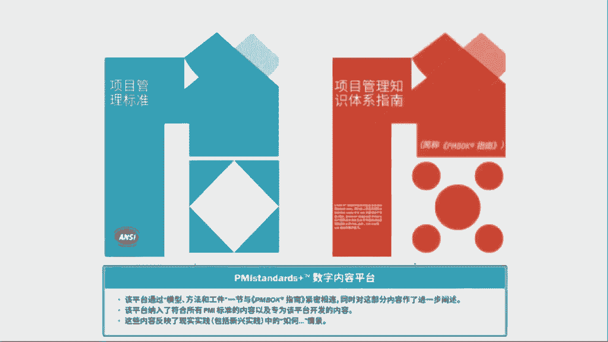
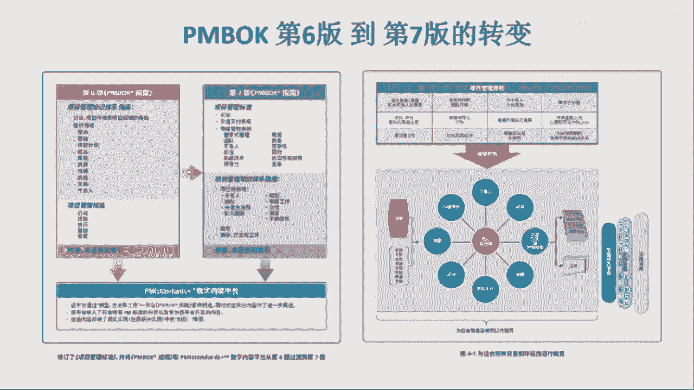

# 项目管理如何“知行合一”—肖杨 - P1：1.PMBOK第七版做了哪些变动？ - 清晖Ava - BV1BD4y1E72q

今天呢其实就想跟大家来去做一下关于这2块的分享。那首先呢这个想先谈一点的是什么呢？就是他主要刚好赶上这个机会啊，就是pin报现在改版了。拼报改改版了之后呢，后来我想了想这个老谭那个老板怎么结合吧。

好像有点落伍。那所以这样的话呢，那正好借着这个机会啊，顺便谈谈对新版的理解啊。然后顺便谈一谈这个新版的pin box跟pri之间它之间的区别。

首先呢这个pinbox第七版呢嗯在我看来其实是一个挺颠覆式的改版啊，是一个非常跨越的突破式的改版。那跟其实这个前六版呢有有较大的区别。那不论是从结构上还是从定位上，那它都有了很大的区别。

然后呢首先呢我们发现从内容上来说呢，那pinbox第七版呢，它其实准确来说是由是由三部分组成的啊，只要书上的内容主要是两部分那分上半部分，下半部分。那上半部分呢是项目管理标准。那那这个项目管理标准呢。

它其实是说是跟美国的标准化协会，就是安y，就是我们大家看到这个这个写项目管理标准，这个蓝色的这个这个封皮，左下角有一黑白色的写着ANSI那那这个叫安y安y呢是是美国标准化协会啊。

准确说我们一般简称叫美标。那因为我在ISO里面代表我们国家嘛，去参与国际标准的编写那。安C呢它是代表美国的那我呢是代表中国的，就国家标准化委员会，我们叫ICC那然后所以呢其实我们在IO里边还挺熟的。

然后呢，那这个PMI这次的这个项目管理标准呢，它其实是跟美标，是达成了共识的。换句话说呢，它其实也是名名副其实的美国标准，对它符合了美国标准。就像我们国家呢要出一个国家标准，它叫中国标准。

那在美国出一个国家标准就是美国标准，那就是美标。所以呢这个pin bulk这个第七版的上半部分呢，它其实是一个国家标准，是美国的国家标准。然后呢，下半部分呢是项目管理知识体系指南。那换句话说呢。

下面这部分它不是标准啊，然后呢，它也不是美国的国家标准所认可的。它更多的呢偏向于的是一种啊偏向于的是一种指南性的，就指导性的文件，指导性的文件呢，大多数情况下呢，它其实都是用来指导这个标准落地的。

所以呢这时候它把它叫做知识体系指南。所以呢这时候我们会看到呢，首先呢这个拼报ge呢它两部分，上半部分呢是美国的国家标准，那它是标准，下半部分呢是一个体系指南，准确来说是一个体系的指导性文件。

然后除此之外呢，这次非常创新的提出来了一个这个PM standards啊这个plus然后呢一个数字内容的平台。那这个数字内容的平台呢。

它里边主要提供的是各种啊拼报概里面或项目管理知识体系中会涉及到的模型方法和共建啊，但共建呢也可以理解成工具。然后呢，所以呢相当于呢这是一个数字化平台。这个做法也很创新。相当于呢项目管理知识体指南中呢。

它就不会去过多的讲述各种的模型方法共建。因为那样的话会占用很多的篇幅。所以他把很多具体的这个模型方法共建的内容都放到了这个数字化平台上。那这样的话呢。

大家如果希望了解更多的关于这个项目管理体制的指南所涉及的这个模型方法共建的话，它就可以去这个平台上去查询。然后这样的话呢，一方面它减少了这个书本身的这个厚度。第二来说呢，它其实查询起来会更方便。

所以呢它这个是一种非常创新的做法。所以这样的话呢，我们会看它这个pin bulk这个第七版呢，它其实就变成了三部分，相当于是一个标准那加上一个知识体系的指南性文件。

再加上一个含有各种啊不同的模型方法工具的，然后包括标准的一个数字化平台，这个数字化平台，它表现一个知识库。所以就变成了一个标准，那加上一个体系的落地指南，然后再加上一个知识库。那共同构成了呢。

其实这次第七版的这个pin box。所以首先这个做法呢很创新。因为以前第一既没有这个平台，第二呢嗯也没有把这个标准跟知识体给它分这么清楚。

那确实呢这个第七版呢跟第六版相比，那它从内容上，它其实也有了非常大的变化。它不仅仅是这个结构上。然后呢，以前呢，其实这个前六版的pin bulk，那其实都差不多。那就像我们从当年很早的时候学的时候。

最开始是九大知识领域，五大过程组，那经典的那个五大过程组最大知识领域，后来变成了呢五大过程组十大知识领域，那就像我们大家现在所看到的一样，对吧？启动规划执行监控收尾，那五大过程组啊然后再加上呢整合范围。

那进度成本质量、资源沟通风险采购看系人。啊这十大知识领域。那这个东西其实在PMI已经用了好几十年。那这次的改变呢，那我们会发现他做了一个很大的调整。那在这个调整中呢。

因为它分成了标准和知识体系指南这两部分。那标准里边呢，它更多的是样一个标准的写法。那而且呢这个标准呢是它是基于原则的。所以首先呢在这一点上呢，它其实也是一个非常大的调整。因为前六版的pin bulk呢。

我们它采用的都是过程方法，过程方法我们通常叫process based，所以呢它会去谈项目管理的各种不同的过程，对吧？然后呢，输入是什么？输出是什么啊，活动内容是什么？

但这一次呢它这个破天荒呢把它改成了这个基于原则的，就原则方法，就princple based。principle based呢其实跟process based它有着本质的区别。

那process base呢是说呢，其实我们对于啊这个方法的要求更多的呢规范和定义的是它的过程，标准化的过程。然后呢让大家按照过程开展，那就不容易犯错。但princple base的呢。

它一向往上升了一个层面。换句话说呢，其实我们更多给大家传递的不是工具技术跟过程方法。我们更多的传递的是项目管理的原则和理念。那当然原则和理念呢，那它就可以更有效的去应对各种场景。啊，因为过程嘛。

它相对来说它还是会稍微有点僵化基于形式。但是这个也是造成了过去在过去的十几年甚至几十年里边，其实项目管理知识体系在其中落地的时候，一直比较难。是因为它基于过程的这种体系框架，它其实会有点教条，然后呢。

它其实大家不太容易理解是说如何按照具体的这个项目的场景啊，或者组织的环境去进行调整，但是这第七版的拼报呢，它改成了基于原则的啊原则。基于原则的时候呢，这时候呢。

就需要大家在学习的过程中更多的是要去理解它原则，理解它内涵啊，然后呢在实际的自己的工作中应用的时候呢，而不是教条的去照搬这个活动跟过程，而是要去思考是说这个原则，那在自己的实际工作中，对吧？

它应该是怎么去落地的。所以这时候呢这个原则要落地呢，首先呢这个所有的标准呢，基本上都是好多都是走走原则导向的。因为为什么呢？因为这个尤其这个很多标准它都是要适用于各行各业，然后呢，各种不同的类型的工作。

所以这时候呢在原则是永远不会变的东西。那通常我们一般认为不管是知识领域也好啊，过程也好啊，它还偏向于形式性的东西。所以呢它在不同的地方落地的时候，它需要做大幅的剪裁调整。

但很多时候其实原则这个东西它是不用调整的。因为原则是永远是对的，就有点像我们国家这个道层面的道一样东西。所以呢这时候呢首先第基本上有一个很大的变化，是说它把这个原来的过程它提炼成了原则。

然后这时候呢当然这个一方面呢有一点有缺点。那从先说缺点，从缺点来说呢，我们想这个理解一个过程，它比较偏形式的东西，它理解起来比较容易。那理解原则呢，这时候难度系数就增加了很多，对吧？

就像给大家讲道啊讲道理的这个道。那我们说传道它显然比讲工具技术要难很多很多。所以呢那换句话说呢，第七版呢，他对于读者啊跟老师其实提出了更高的要求。因为由原来给大家讲讲形式的，突然变成了讲内涵的了。

啊但是呢如果这个真的能理解的好，学习的好，它落地的时候，它其实就会不拘泥于形式，它会有利于落地。那第二呢这个知识体系指南呢，它本身呢走向了绩效率。所以这我们会看到它这里面提到的是十二大原则，八大绩效率。

那绩效率呢是结果导向，这个跟以前的过程导向也有本质的区别。过程导向呢更多的讲的是说一般proces based啊，我们知道就是说不管这个结果干的怎么样。

但是你过程必须要跟我的要求是符合的那这时候呢他其实坦诚的讲，我们在ISO开会的时候啊，就跟各个国家最顶尖的专家开会的时候，大家也会经常PK这个问题。就是其实呢这点我还挺能理解的。

尤其是在ISO里边以美国美为首的，就是准确来说是是以安C以以美标。那以以美标代表的这个。美国为首的专家们呢，他会非常强调说，其实项目管理它就不应该是一个process based的就过程方法的这种方法。

它这本质上就应该是一个结果导向的。我们一般叫目标目标导向叫objective base，它应该属于目标方法。换句话说，项目管理呢，它其实本来就是以结果为导向的。

那由我们组织大家跨职能的临时性的去干一个非常创新的事儿。那其实我们连这个事儿怎么连这个事儿可能从一开始是什么都搞不清楚，它不可能首先有对过程一个明确的定义。所以项目管理它是属于典型的，先组织大呀。

甭管用什么招，先把事儿干出来，干出结果来。然后干出来一遍之后呢，然后再在复盘。在复盘的过程中呢，我们才能够去梳理清楚。哎，这实现目标的过程到底怎么干是最直接的是最好的。所以呢这个项目管理呢。

它属于比较典型的结果导向和目标管理的方法。🎼那所以呢在这个这次的这个pinbox第七版的知识体系指南的这个部分啊，就是不是标准的一部分。知识体系指南的这部分。它其实呢也比较强调的是说要结果导向。啊。

那结果导向的概念呢就是说可能中间的工具过程活动啊逐渐的淡化。但是更多的强调的是说呢，大家要注重几个方面出现我们所预期的结果啊，所以这就是他那个他的这几个八大绩效率，对吧？

比如说干系人我们期望的结果是干系人的管理。我们所期望的结果是什么，对吧？而关心的不是活动，对吧？然后这里边说团队管理，我们期望的结果是什么啊，然后呢开发方法上，我们要以结果为导向去选择合适的开发方法。

对吧？如何呢让这个风险管理的结果变好。那所以呢它变成了一种结果导向。所以这是呢这个第六版跟第七版，它其实是有这样一个颠覆性的变化，那由原先的注重过程管理，变成了现在变变成了注重第一原则，第二呢注重结果。

所以变成了是原则加结果的管理，去替代了原来的过程方法。第二呢，把这个所有跟工具对吧？跟工具模型方法相关的东西统通的扔到了一个知识库的平台上面去啊，那个是供大家查询的，这个东西不需要每个人全都背下来。

其实以前吧我也觉得这个拼榜里面需要备的工具技术太多了。对他背了那么多，其实也记不住。而且按照西方管理的逻辑，他只要知道在哪查就行。他不需要把1一0百好几十种的工具技术都记住。这个东西哪能记得住呢？

更多的其实要记住的就是内涵。然后更多的要做到的是结果导向。然后呢，然后呢我们开展工作依据的是我们的原则，然后我们的目标是实现结果。然后呢，我们应该学会去一个知识库跟平台上去选择啊。

适合我们的工具技术来服务于根据不同的场景服务于我们对吧？依据原则实现结果。所以呢这个这个是我对第七版，它这个导向上的理解。那确实呢从层次上比第六版高了一节，因为第六版还是比较拘近于形式的。

比如说啊遵循什么样的过程。那然后必须做到什么样的知识，所以它还是比较均泥于形式一点。然后而且要死记硬背100好几十种工具技术。那到第七版的时候，我们会发现它调整了。

那更多的调整是对人本身的这种内涵的理解跟结果导向。所以呢首先这是拼报第六版到第七版，我的一个理解。

但理解的也不一定很准确啊，仅供大家参考。

