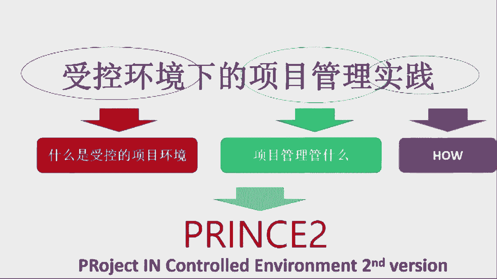

# 项目管理如何“知行合一”—肖杨 - P2：2.关于PRINCE2的方法论 - 清晖Ava - BV1BD4y1E72q

然后呢，接下来呢我们再谈谈prince two。因为咱今天这个主题主要是谈这个PMP跟pri two啊，它俩第一了怎么对比，第是他怎么整合，对吧？因为这个从我干项目管理这么多年。

包括呢啊熟悉这么多流派啊，认识这么多国际专家。那其实一直以来最大的体会呢。大按照这管理这个东西，他没有绝对的对和错。那用的用的合适了就叫对，用的不合适呢，就叫不对。

所以呢其实管理水平的高低主要是在于用的场景是否适合。第二，这个度拿捏的是否准确。那不管是什么样的。这个先进的管理方法啊，但不管是哪儿来的，美国来的也好，英国来的也好，欧洲来的也好，什么日本来的也好啊。

不管是从哪儿来的管理方法，它其实最适用于的都是它最特定的那个场景。那甚至有些方法呢，它其实是非常非常通用的那非常通用的方法呢，就会有一个问题。到一个具象化的场景的时候，那它就不那么容易切合场景。

是因为对吧？我们说这个通用就是要把所有的具体场景的特征去掉啊，所以呢把具体场景特征去掉了。通常我们说标准就是这样子的那标准的要求是普适性。那普适性呢就得把所有个性化的东西都去掉。那这样的话呢。

在全球范围之内，对吧？国际化的标准，国际标准就全球范围之大家都适用，是因为个性的去掉了，每个国家自己都去掉了。那作为一个国家标准呢，如果想全国都适用，我们就得把各个行业的特征的东西去掉。

那这样的话全国才能适用。所以呢往往通用的东西呢，它是不带场景的那不带场景的。当我但是我们这个东西要用的话，它必须得跟具体场景相结合。那如果是说里面没有具体场景，那就得要求使用的人。

他能够做到理解自己的场景。同时呢把这个通用的工具方法和原则结合到自己的场景里。当然这是一个非常难的事儿。那这件事能做到就是说能执行的合一了。但实际上他很难。

所以呢一直以来呢最容易落地的呢方法其实往往是这个方法本身是在场景的。而且他这个场景跟我们这个工作场景又很像。那这时候呢对我们来说，这方法就很接地气啊，它落地很容易。然后但实际上来说呢。

这个项目管理这个框太大了，那各行各业各种事儿它都可能很适合咱项目管，而且各个国家的文化差异又大，管理成熟度差别也大。不同的行业呢，他干的活差别也大，人员能力水平差别也大。

所以这时候就造成了是说呢其实我们没有办法找到一种项目管理方法能适用于所有的场景。然后所以呢我们只能是想办法找相对接近的。然后所以呢这时候能不能选择到一个跟自己的项目场景非常匹配的方法。它其实对我们来说。

它它就是一个非常关键的事儿。当然很多时候这也是个幸运啊，也不一定能找得到。那接下来我们再说这个pri素。pri素呢跟这个pin box它有一个非常本质的区别啊，这个后面也会去谈。

其实pin box呢它其实呢以前的时候叫项目管理知识体系啊那现在呢其实变成了标准加项目管理知识体系。我们说项目管理知识体系呢，它本身就属于通一性比较强的。那标准。标准呢它更是通用的。啊。

尤其是当我们这个标准呢，从一开始如果又是为了适适用全球的那这时候呢它通用性会更强，就是场景会更少。所以呢通常情况下呢，我们别人认为呢这个不管是知识体系也好啊，标准也好，它相对来说呢。

它带有的具体的行业场景它不会特别明显。因为它一旦明显了，没办法通用。然后呢，但是这个来源英国的这个受控环境下的项目管理，就prince to，它其实背后是带有一定特定的场景的。准确的来说呢。

princewo虽然它是一种通用的项目管理方法论。但是呢它其实也是适用于某些场景，对吧？当然它可以适用于所有场景，但是不一定拿到所有场景下都好用。那pricho呢，它从最开始的时候呢。

它相当于来说它是最开始起源于在英国的这个数字化转型时期，当然那会儿不叫数字化，那会儿叫信息化转型。就上个世纪70年代的时候，英国刚好在做信息化转型。然后呢。

就大致相当于我们国家现在天天推数字化转型这个时期啊。所以那时候呢大量的这种信息化建设项目，尤其是政府主导信息化建设项目。而且这些项目呢失败率又特别高。就像我们现在的信息化项目失败率高，它是一样的。

然后那会信息化项目失败率很高。然后呢，英国政府呢为了去降低这种信息化项目的失败率。所以呢他收购了一个咨询公司的方法论。然后呢组织全全国的专家进行了改造。首先形成了一套这个信息化的项目管理的方法论。

首先它叫方法论，它不叫知识体系。那叫方法论的原因是什么呢？它其实主要讲的就是如何把啊一个项目给做成功啊，做成功的方法是什么？所以他讲的不是知识体系，知识体系会覆盖各种方法啊，标准不是方法，标准是要求。

那方法是什么呢？方法是面向一个场景和面向一个对象的。换句话说呢，纯素的定位它是mes方法论。所以呢英国政府他把这套东西出来的原因是因为什么呢？他看到的是说大量承接政府信息化项目的这个项目团队。

根本就不知道这个活应该怎么干，人员组织不起来，目标搞不清楚。然后过程中呢，然后又经常走很多的弯路。那为了避免一群根本不懂项目管理的人又去干这个项目管理的活，还老失败的这种现象。

所以等于政府出面组织了一个方法论，然后呢，那就要求所有你干我政府项目的，你必须都按我的这个方法来。因为你按照我这个方法来呢，它有几个好处。第一，你只要按我这方法来。你管的就比原来管的好，项目过程就受控。

啊，你就能少出问题，第二呢，我对你监督检查也会比较容易，对吧？因为你你干活的方法是我要求的。所以这时候我必然知道是说啊，我怎么去检查，你看你哪儿做对，哪做的不对。然后我想帮你能帮到点子上，对吧？

然后我我能提前去发现你的风险和问题。所以pri two呢它是这么出来的一套东西。所以它叫受控环境下的项目管理。它首先要解决的问题是说这项目过程它得受控啊，受了控之后，你大家的项目管理方法才能用得了。

如果从一开始整个项目过程的受控环境都没搭起来，整个项目处于失败的，就换句话说，这个大家各自为政，这这有再好的项目管理工具技术方法也没有用。因为大家根本就没形成合力。所以呢这个英国的项目管理呢。

它相当于是一个面向不受控场景的一个方法论。它首要解决的问题就是如何让一个不受控的项目环境受控。然后呢，在这个受控的环境之下呢，大家在怎么开展项目管理。

所以它背后其实是面向某一特定场景的那这两个知识体系是不一样的。比如说对于拼 bulk来说呢，他要去识别那，首先这是个什么类型的项目，对吧？是个预测型的项目，对吧？然后还是对吧？是一个还是个敏捷型的项目。

或者还是个适应型的项目，它它其实里边会包含很多种不同的类型，而且呢它越来越开始上升到了组织级，它偏向于一个大的体系的建设，那，尤其上升到了标准这个层面。

所以首先我们看他俩其实这个范围是完全不一样的那pre促ol它就是一个方法论。换句话说干活怎么能把它家管起来呢？过程受控啊，它其实是这样的一个东西。

