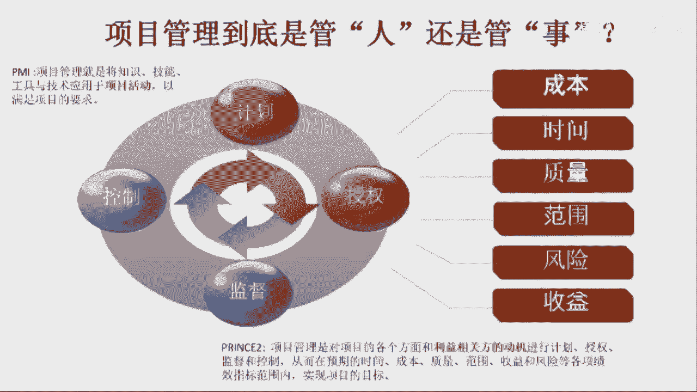

# 项目管理如何“知行合一”—肖杨 - P4：4.PMBOK和PRENCE2的区别 - 清晖Ava - BV1BD4y1E72q

然后呢，pinac第七版呢，它有8个大绩效率。那我们说的pri tool里边呢，它是要七大主题和七大流程啊，因为它这个做法呢是一个比较经典的做法啊，就是分成主题啊，专业性流程协同性。

那Pb的这个八大绩效率呢是一个非常创新的做法。那它这个八大绩效率呢，嗯其实我也理解了半天，这个什么叫绩效率呢？它是这样定义的项目绩效域是一组对有效的交付项目成果至关重要的相关活动。

那项目绩效率是相互活动，相互关联，相互依赖的焦点领域。那它是一个领域，它可以协调一致的实现预期的项目成果。那一共有8个绩效率。所以换句话说呢，这个绩效率吧，它是一个焦点领域。所以呢换句话说。

底下这8个绩效率呢就是8个在项目管理过程中需要特别聚焦关注的领域啊，然后这8个领域呢，我们都应该要做到以结果为导向。然后以结果为导向的呢，去协调啊，为了实现结果最有利的一系列的相关的活动和内容啊。

所以呢这个八大绩效育主要是告诉我们什么呢？这开展项目管理的时候，我们重点是关注哪8个方面，这个方8个方面，而且是要做到这8个方面是以结果为导向的开展工作啊，然后所以呢这是八大绩效率。

这八大经效域里边呢会包括那首先干系人对吧？就是干系人管理啊，团队构建。然后呢，开发的方法和生命周期，那主要是什么呢？一开始啊这个选生命周期别选错了，开发方法别选错了，对吧？我们怕的是什么呢？

这个应该按敏捷方法管的场景，结果用了瀑布的方法，或者是应该用瀑布方法管的场景，用了敏捷的方法，是吧？或者是说呢这个应该用适应性方法管的，结果用了敏用了瀑布的方法，那这些都是属于一开始没选对。

所以开始就得先关注我最重要的是一个对吧？是是我从结果上来看，我们应该选哪种方法？然后对吧规划啊项目工作啊交付啊测量不确定性。那这8个领域呢其实是pin book第七版中呢。

它所定义出来认为在项目管理过程中得重点关注跟管理的。再换句话说呢，作为项目经理跟项目管理团队，啊，主要是先盯着这8个方面管，其他的方面可以稍微啊先忽略一下。而且呢做到结果为导向。

首以呢这是它的8个 bugg绩效于。那我们刚刚讲的，其实priise two呢，首先呢这个首先啊首先有一点，pin box它的管理范围绝对是远大于pri two。纯塑呢只是谈了对某一种方法进行管理啊。

所以纯塑呢它其实就是指的是一种方法。那这种方法呢其实往往是相对来说最开始目标相对清晰的，不是用特复杂的项目。啊。所以呢这个但是呢拼 box它是适用于多种方法的。而且呢他因为最开始前面都是标准嘛。

所以他偏向于从整个组织层面来去看看问题。那priwo呢更多的还是从项目层面看问题。大家知道从项目视角看问题，跟从组织视角看问题，这是两个视角，对吧？就换句话说，这是总经理看问题。

还是项目经理看问题的问题。所以在这里边呢，首先拼报第七版的它的范围是远大于priwo的，因为它是一个知识体系是覆盖组织的。然后这个pri tool呢，它只是一个方法论。

它讲的就是如何组织大家把一个项目做好。所以首先范围不同。所以基于不同的范围呢。所以这时候我们会发现呢，这个print塑的项目管理，但它确实有些东西跟这个pin box还挺像的。所以呢其实我们会看到。

如果我们把这个print塑的7个主题跟7个流程合起来啊，那它其实跟我们这个pin bulk这个八大绩效率就有很多很相似的地方了啊，因为呢它会有组织啊，那七大流程合起来呢。

这个七大流程它其实本身就是开发方法和生命周期。对吧然后呢纯速欺诈主题中有计划在在这个Pb里面叫规划啊，这是差不多的。然后呢，这个这个pinb里边有项目工作。那其实呢在我们这个这个欺诈流程中呢。

它里边有阶段控制和产品交付管理，包括指导工作，它指的都是项目中的一些相关的管理工作。然后呢，这里面有个交付的过程，其实在在这个七大纯溯的七大流程中，主要指的就是产品交付管理的过程。

那然后呢测量啊其实呢在这个这个里边我们有一个东西没讲。那其实在这个pri塑的这个进展的这个主题里面，它有6个项目管理的绩效指标。这个绩效指标其实主要谈的是那这个六个绩效指标就是实践范围成本质量风险收益。

那这个呢被我们称之为是这个print塑项目管理的那6个绩效指标。所个6个绩效指标呢，它其实呢也是去帮助我们解决测量性的问题。那进展这个主题它主要要解决的问题。

就是要随时的把我们计划的成果跟实际的成果做对比，这样我们才能做差距分析啊，才能做偏差分析才能做预测。那然后呢要偏差分析的指标。那就是我们说六大绩效指标，时间范围风险质量成本收益。

所以这点跟测量也是对上的。再就风险管理嘛不确定性。所以呢我自己的一个感觉跟体会呢。就是说今把pre塑的这个七大流程跟七大主题加一块儿。然后呢，除了干系人那块偏弱，因为为什么呢？因为干系人呢准确来说呢。

在英国的项目管理中，它不是pri two管理的重点，它是那个项目集群管理MSP管理的重点啊，因为呢在这个英国的项目管理中呢，他把项目分成两类，一类是比较复杂的，按照项目集群管一系列项目的管理的官方管。

一类是相对简单的，就是按照pri two来管。所以呢如果我们把pri two跟MSP的两种方法加在一块儿。他其实就跟pin box第七版的八大绩效率就更加吻合了啊。

所以首先这这是我对他这个里面的一个理解。所以呢得出一结论是什么呢？其实他俩挺像的，就他俩很多管理的方向吧很接近。然后呢，但是呢这个pin box第七版呢确实跟这个跟printwo它不能完全吻合。

所以其实pin box第七版，它有点像英国的pri two加上MSP就是英国的项目管理，加上英国的项目集群管理，它俩加一块儿。然后呢，甚至呢再把英国的项目管理，加项目集群管理，再加项风险管理加在一起。

它就跟pin box这个第七版的管理，它就吻合度非常高。

当然首先啊这是我们目前是从形式上是这么去看。从内涵上来说呢，它俩还是有区别的。因为一直以来呢这个英国的管理吧，他比较注重组织。然后呢，所以这个从纯塑来说呢，纯塑他就把项目看成是一个组织啊。

他更加关注的是把一群人变成一个组织，让这个组织受控的难度。但是呢，pin box第7版呢，它在很大程度上，它它延续了PMI的这个这个pin box的传统的一个做法。就是他更加比较关注的是什么呢？

他比较关注的是这个。这里面一些具体的那专业啊活动那技术，它比较关注的是这些东西，这些东西比我们偏向于叫事儿。但是英国的东西呢，它普遍比较关注于人啊。

那这就是我们说这个这个英国项目管理跟美国项目管理从大的方向上它还是会有这么一个差异。当然我觉得这个差异是来源于文化的差异啊，按照道这个美国人是比较简单的，因为美国的文化它比较直白。

美国是一个非常法制的国家，它很多的时候大家是这个依法治国就事论事，大家对法律的东西它遵从性非常好。英国呢跟中国有点像，它是经历了漫长的封建社会的国家。美国都没经历过封建社会。但英国跟中国很像。

它经历了漫长的封建社会，它对人的关注度非常高。然后呢，组织的这种啊科层的文化啊，组织层级的文化，包括做人的深度啊，说话不直接。啊然后呢，这个这点呢其实英国跟中国很。

有很相似的地方，美国人是比较直接的，就他说的就是他想的他想的怎么就他想什么就说什么了。但英国呢跟中国人很像，很多时候他说的不一定是他想的，这样他表达的不一定是字面的意思。然后呢，第二呢。

他有的时候表达了一个东西之后，你得琢磨他到底为什么表达这个，对吧？他所以呢这个中国跟英国的处理事情的复杂度比美国要复杂很多。这个事儿套到项目管理上，他也是这样的对吧？我们说平常的事儿。

英国跟中国的就都挺复杂的那项目这种创新不确定影想，那就更复杂了嘛。所以呢这个英国的项目管理呢，他比较关注的是说，我们得先把这人搞清楚，对吧？这个利益相关方的动机是什么，有多少相关方，他的动机是什么？

对吧？就是我们说右下角英国的项目管理的这个定义。他这么定义的项目管理是对项目的各个方面和利益相关方的动机啊，我们说先看相关方的动机啊，动机按照动机分相关方进行计划授权监督控制，这干嘛呢？

搭台子组织大家制定约束大家工作内容的计划，统一大案目标。第二，组织大家明确各自的角色职责和分工授权得给这个项目的，即使是个临时性组织，也得建立监督机制。因为你没有监督的话，大家不遵守自己做过的承诺。

之后过程中得有人拍板儿，这就是控制，对吧？谁来决策什么事儿，你控制。然后呢，谁来落实决策的要求。所以呢这个计划授权监督控制，它解决了这个项目搭建售控舞台的问题。

然后从而才能在预期的时间、成本、质量范围、受益风险的各项绩效指标范围内实现项目的目标。所以英国人他对项目管理是这么理解的。而且这是大家知道这个print塑啊，是英国项目管理的入门级产品。

英国项目管理有一系列产品啊，受控环境下的项目管理MSP项目群管理。然后呢，MOP项目组合管理。然后呢，这个P3O项目管理办公室MOV价值管理MOR风险管理啊，它它有一系列的它的这个项目管理的方法论啊。

覆盖有不同的场景，不同的领域，不同的难度系数，不同的等级。那pre塑其实只是英国的入门级产品。那即使是一个入门级产品，我们一看他这个项目管理就很有深度，对吧？一上来就是谈相关方，一上来就是谈搭台子。

对吧？然后一上来就是谈考核绩效。然后呢，他认为英国的项目管理认为是我们把前面这三个事做到了，相关方分析做好了，台子打好了。对吧绩效考核指标定好了，这项目才能顺利实现项目流程。所以这这英国项目管理的特点。

它呢跟跟跟美国的这个关注点就不太一样。那美国的关注点呢比较关注于这个用什么样的方式做这个事儿啊，最专业最科学。英国人比较关心的是，怎么能把这帮人变成一个组织，能让这帮人目标统一了。

能形成相互制衡的一个集体。然后这样的话呢，即使我不知道事儿怎么干，但是只要这帮人能齐心合力一块做事儿，他总能找出怎么做最好来。所以呢英国的管理是在于把人管起来，把一群人变成一个组织。然后呢。

那那其实美国的项目管理呢比较注重的是大家用什么样的方式来做这个事是最科学的。所以呢首先他俩在这点上其实还是不太一样。

然后呢，所以这时候呢我们就会发现呢，其实他俩这个方法论的定位啊就有区别，对吧？就像我们刚刚所说的，其实这个PMI的这个知识体系呢，它不管怎么改版啊，它比较侧重于啊项目管理的科学性和专业性。

那他对人关注度不是特别高。那当然现在我们说对于项目经理的关注度还有了一些了，至少经济城市管家。在英国的项目管理呢，他不光关心项目经理，他关心所有相关方。

他的目的是如何把一群相关方啊就这一个特定的目标能变成一个齐心合力开展工作的组织。因为他比较讲究的是怎么把人组织起来。所以呢在英国的项目管理中呢，我一直认为呢，这个项目是一种组织保障形式。

它是一种承载创新跟变革的组织保障形式。英国的项目管理呢重在把人组织起来。美国的项目管理呢重在选择合适的方式开展工作。所以这一直是他俩的区别。所以呢美国的项目管理呢侧重专业。那英国的项目管理呢侧重使用。

因为你项目管理它毕竟是个管理工作，管理工作主要管的是人啊，管的不是工具。而且在英国的项目管理过程中啊，坦诚的讲，每次讲不是素质都假。英国的项目经理，他不会工具都没关系。

因为英国的项目经理的核心目的是把合适的人用在合适的地儿上，自己可以不会，只要自己在项目成员中对吧？找到了会使WBS的对吧？会画网络图的啊，然后会做政直管理的。他把那他把这样的人。

他把他忽悠到自个的项目团队中，那说服的加入，然后让他来干这个事儿就可以了嘛。所以这个英国的项目管理的，这项目经理呢重在人员的组织环境的构建，影响不同的相关方，特别是影响领导的能力。然后美国的项目管理呢。

他比较注重的是这种专业性那用专业的方式解决专业的问题的能力。所以这个一直以来是他俩他不太一样。