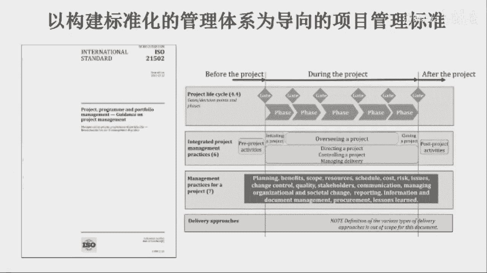

# 项目管理如何“知行合一”—肖杨 - P5：5.PMP与PRINCE2在实际项目应用中的整合 - 清晖Ava - BV1BD4y1E72q

但他俩虽然不一样，但他俩是可以结合使用的。因为实际上当我们在企业中干项目这个时候啊，我们说这个不管是情商高一点，智商高一点。所以一般我们说干英国项目管理的情商都得特别高，这干美国项目管理的吧。

它这个智商得很高。但实际上在我们国家啊，我们叫中国嘛，对吧？中国这个中庸的国家，这活更不好干，我们文化历史又长，5000年的文化史，对吧？这个人都不好搞定。第二呢，咱作为发展中国家，这事儿也都不好搞定。

这对吧我们说发达国家最大的优势就是。咱们这儿很多很复杂的事儿，作为一个发达国家成熟的环境中，人家都没有了。然后所以呢我一直觉得这个其实很多时候在发达国家，你想找点那特别难的事儿，还不好找。

就是因为他他没有那么多问题。我们国家这发展过程中啊，它是什么问题都有，尤其是快速发展，人员又多，参差不齐，什么问题都能出现，对吧？这个发达国家好多的好多奇怪问题出现不了。然后第二呢，我们人又复杂。

5000年的文化史对吧？我们国家的人都很聪明，谁忽悠谁都不太容易，把一群人凑在一块，组织大家做事儿，对吧？每个你想让每个人能真心出力，都得花费一番心思。所以呢这个我们说道这个在我们国家当项目经理啊。

🎼这个单纯用美国的方法是不可能的，对吧？就就换句话说，坦诚的讲，即使项目管理是来源于美国的80年前在美国发明的，即使美国的国防部是项目管理最强的组织，但是任何一个美国优秀的项目经理来中国。

他当不了项目经理。根本就搞不定中国人。😡，在中国要想能搞定中国的项目经理，这就得是中国自己人，就不是中国自己人，也很难搞定。美国人根本当不了中国的项目经理。哎，但是吧中国人去美国能当项目经理。

你还真别说，很多华人在美国当项目经理当的很好。所以呢。😊，在我们国家呢，我们呢既要掌握这个相当于来源于PMI的那先进的科学的工具技术方法。同时呢我们又得向英国人去学习，他怎么能把这帮人管起来？

为什么向英国人学习呢？英国人当日不落帝国200多年。拥有在全球范围之内无数的殖民地。英国人的厉害之处在于，虽然本土工作能力不强。但人家能组织海外的这帮殖民地给他干活，对吧？我们说到现在虽然殖民地没了。

都叫英联邦国家，所有的英联邦国家是效忠英国女王的。你看人家这个人家英国女王不光管着英国，人家管着一大堆英联邦国家，什么印度啊、南非呀、加拿大呀、新西兰呀、澳大利亚，对吧？一大堆英联邦国家。

人家都效忠英国女王，人家都是给英国女王干活的。英国人在这个历史长河中，他练出来了一个很有水平的事儿，人家管什么国家都能管得了。是吧然后所以呢这个他不光所以呢这个当然也有缺点啊，就是因为自己老婆干活那。

变得就是越来越善于，对吧这个。管理别人干活啊，自己干活能力就没有那么强了。但是呢这点值得我们学习。我们在实际开展工作过程中，我们既得锻炼是说如何张罗组织别人啊，心很心甘情愿的给我们干活。

同时我们又得知道这帮人到底怎么干这个活，能干的又快又好，对吧？我们得给提供合适的工具方法。所以呢在我们实际开展项目管理过程中呢，他这都得学。所以一直以来呢我个人的提倡是说呢，先学PMP再学pri是粗。

然后呢，先学各种工具技术方法，再学怎么能把人管起来，把一群人变成一个组织，然后能让这帮人齐心合力一块做事儿啊，让能让一群中国人齐心合力一块做事儿，那很不容易的。然后所以呢这种情况下呢。

我们相当于把它框架一整合，还变成一个这样的框架。坦诚的讲，这框架大概是我45年前的时候画的。当时画呢其实也是为了也是思考怎么把PMP跟printle整合到一块呢？一想到中间有个端到端的流程，价值链条。

就是我们看右边那黄色那写了个字，value chain价值流。因为项目的核心呢其实是创造价值啊，而且是创造一个创通过一种这个提供创新的产品跟结果来创造价值。所以它得有个端到端的交付过程。

这个交付过程它是有生命周期的对吧？前面有准备，中间有启动，有计划，后边要收尾，中间要执行。备量这个过程受控呢，对吧？我们呢其实往往会按阶段划分啊，这是face阶段划分划分了中间呢中间就得有评审节点。

这节点叫get对吧？所以这个项目阶段划分要节点。然后呢，除此之外呢，组织大家协同开展工作要流程，这流程跟face不一样。那face是阶段啊，流程是大家协同的方式。然后呢，按照英国的项目管理呢。

这个过程控制吧，它得分层。项目管理委员会呢控制整个项目的过程叫项目指导流程，就是决策流程啊，项目委员会的决策指导流程。项目经理呢开展这个自己的这个项目管控叫阶段控制流程。

那小组经理呢带着大家干工作包叫产品交付管理流程，这是个执行的流程。然后呢，每个阶段临近边界的时候呢，他得组织大家汇报啊，汇报要有汇报的流程，对吧？为了提升汇报的效率跟汇报的结果。

这个汇报的流程叫阶段边界管理流程。所以这样加一块儿呢就出来了这么几个流程，相当于呢就把英国的这个。这个项目管控的过程啊，跟这个美国的这个项目端到端的这个过程，进行了整合。

然后再把那中间的阶段这个管控的手段加上，它就形成了这样一个整体的管理框架。那我个人呢其实在实际工作中开展项目是基本上都是按这个来的。这个呢是我45年前的时候，他自己自己这个沉淀出来的。

后来呢这个去年年底的时候啊，我们大家看这个2020年12月22号，就去年年底的时候，这个国际标准化组织就是ISO啊这个TC258项目管理标准化技术委员会啊，出台了一个最新的标准。

我们叫ISO21502S21502是个什么标准呢？这个标准国际标准是它是propro portfolio management guidanceance onpro manager就是它是目前其实这个ISO项目管理的一个相对来说最全面的标准。

这个标准里边呢，它提供了一个最新的框架。为什么是最新的呢？这TC258成立了十二三年了。那这是去年年底出的这是最新的一个一版。在这版里面，我会发现它这个框架其实跟我之前总结的框架很像。啊。

相当于呢也是有生命周期啊，然后呢有阶段划分fis gate。然后呢过程控制啊分成项目管理的过程啊，然后底下呢有专业的主题。项目管理的过程呢，我们会发现呢既有前面的前期的启动的过程。

又有后边结束的收尾的过程。然后而且呢中间过程控制呢又分成了指导项目啊，控制项目跟管理交付。那跟跟pri two的那个三个这个过程控制的流程呢很像。所以呢这个框架呢其实我看完了之后非常开心。

因为其实这就是项目之前的套路一样。那把pri two的欺诈流程啊，跟PMP的五大过程组进行了有效的整合，整合完了之后，它就落地起来比较容易了，互补，对吧？技能用科学的方式把目标管理的活干了。

同时还能用过程控制的方法把人员组织起来，让项目有节奏，所以一看呢跟ISO21502最新的项目管理标准基本是一致的。所以这就很好。

