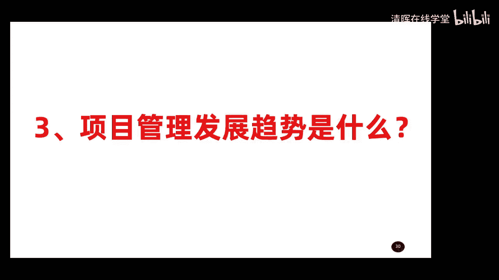

# 项目管理思维和发展趋势 12讲 - P10：10.条条大路通罗马 - 清晖在线学堂 - BV1Vz421D7kH

好这个给大家了解好，最后呢要给大家稍微说一说啊，这两种方法啊，大家看到这时我用了一个图叫做桃啊，条条大路通罗马，什么意思呢，我们在项目管理过程中啊，这两种产品都在啊，还有可能呢这两个场景呢。

还会有交融和交叉的概念，后面给大家讲啊，还会有这样的一些交叉的概念，所以呢你不管是选用哪种方法呢，其实啊都可以，如果你项目是传统的，你就选择传统的这种方法，项目敏捷，你就选择敏捷这种方法都没问题。

最终呢你实现项目的要求其实就可以了，也就是说都是可以达到项目的最终目的的，所以条条大路通罗马，什么意思啊，你说手里有什么资源，你的项目是什么样的一个状态，你就选择合适你项目的一种啊。

方法会有这种思维呢去做啊，最终实现项目的结果都可以啊，这条条大路通罗马是这个概念，没有哪个好哪个不好，有的只是什么合适不合适，或者叫什么适合不适不适合啊，或者叫适合唉。

也就是说你选择最适合的方法去用就可以了啊。

这是这么一个概念好第二个问题给大家聊完了，第三个问题，项目管理的发展趋势是什么啊，这个呢哎这个这个问题比较的open啊，是个开放式的开放性的问题啊，比较open的一个问题，那到底是我们项目。

现在项目管理的一个发展方向是什么，我们怎么去应对和准备它呢。