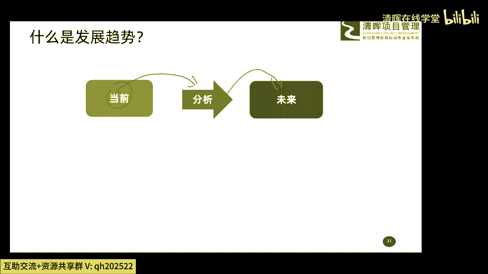
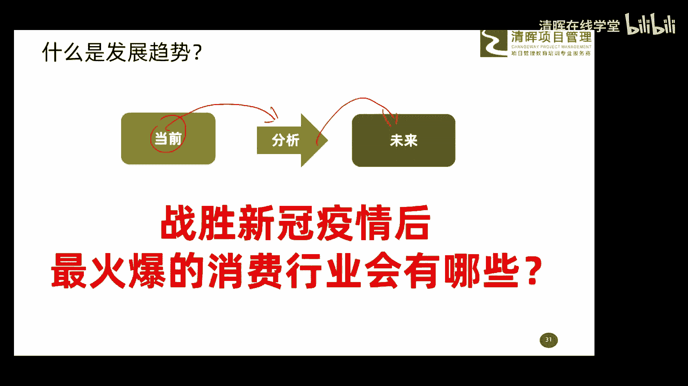
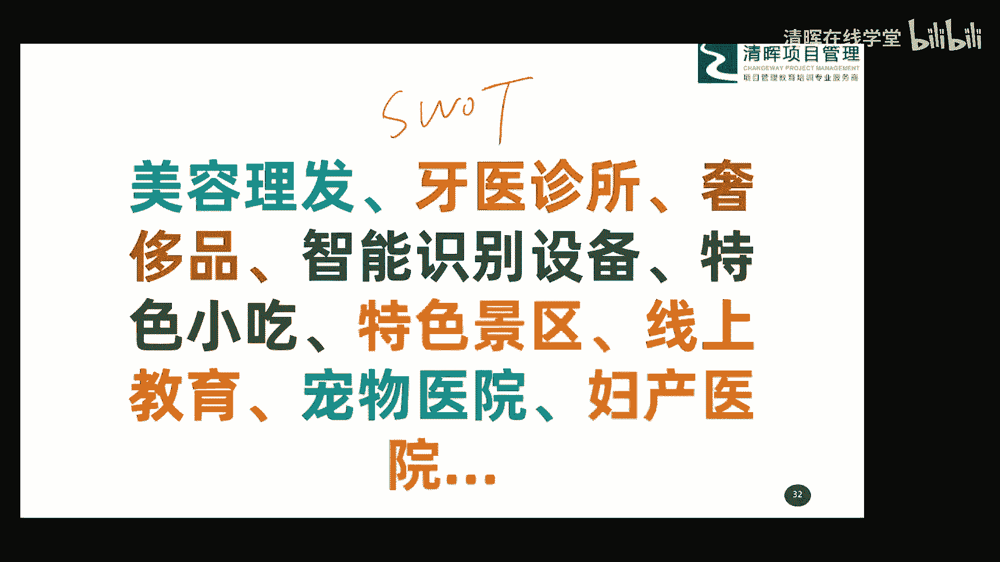

# 项目管理思维和发展趋势 12讲 - P11：11.项目管理发展趋势是什么 - 清晖在线学堂 - BV1Vz421D7kH

我们继续看啊，首先聊一聊什么是发展趋势啊，非常简单，趋势这个词呢大家也平时也常用，也就是说我们现在嗯当前是一种什么情况，然后我们分析分析，那我们就大体能知道未来是一种什么情况，所以趋势是什么趋势。

就是对当前情况的分析，来得到未来的一种情况的这么一种方法，这就是所谓的啊这个趋势分析啊，就是关于趋势的概念啊，那这里头也想用个例子呢给大家去讲一讲啊，因为大鹏老师呢这个呃讲课的风格，就是说大量的例子啊。

大量的例子嗯，通过例子来去讲一些大家可能理解起来，稍微有点困难的一些理念啊，一些东西大家可能瞬间就懂了啊，所以呢这次也会给大家用个例子啊。

这例子呢大家跟我一起思考一下啊，就是战胜我们新冠疫情后啊，这个新冠肺炎呢，现在在咱们国家呢也基本上被控制住了啊，大家都看看这个新闻也都知道啊，那好战胜新冠肺炎后啊，这个疫情后最火爆的消费行业会有哪些。

嗯你看我这个给大家一个问题啊，新冠肺炎我们把它粘上以后，你觉得在哪些消费行业会有一个爆发啊，会非常火爆，给大家呢一点点时间，给大家15秒时间吧，哎大家思考一下，然后把你的一些想法发到我们讨论区。

我们看一看大家是怎么想的啊，一会儿呢我再给大家公布，公布我们做调查问卷的结果，看看跟大家的想法是不一样啊，好大家来思考一下，你觉得新冠肺炎这事了了以后，最火爆的消费行业会有哪些啊，啊呃没有正确与错误啊。

你怎么想的，你就怎么发出来啊，A餐饮理由啊，火锅烧烤对对对，火锅烧烤诶还有吗，哎呀这个火锅好长时间没吃了，烧烤也是还有医疗旅游嗯，保险啊，对保险保险对，网络养生哈哈对对对，身体好是啥都好的是吧，养生啊。

还有吗，好亲子关系消费啊，亲子关于话费啊，保险医疗服装，对对对，还有服装啊，还有吗，来朋友们把你的想法网上教育啊，美食生鲜外卖啊，养生娱乐场所啊啊对大家就去嗨一下，释放一下电子商务人工智能网课诶。

理发美容理发啊，理疗中医药啊，娱乐保健好，大家这个看来思路很open哈，呃确实啊，这个在我们这个这次新冠肺炎结束以后呢，真的有些行业会有一个爆发，会有个爆发啊，那这个事儿呢。

其实我也做了一个小小的调查问卷，发到我们以前的学员在那个群里了啊，做个调查问卷，我说哎你们觉得这个新冠肺炎结束以后，最火爆的行业会有哪些呢，他们也给我做了好多好多好多好多的反馈啊。

大家看一看啊，这是我通过调查问卷收集上来一些啊，所谓的排名比较靠前的吧，大家看一看，第一个叫美容理发啊，美容理发这个是硬需求吧，现在托尼老师都不能上班是吧，大家没没没办法，现在要不是自己动手，对不对。

要不的话就是我们说长发开始飘飘了啊，所以美容理发一定是这个，咱们说哎马上这个疫情结束以后，非常火爆的一个行业，然后牙医诊所，牙医诊所，然后奢侈品销售，然后智能识别设备哎，特色小吃，特色景区，线上教育。

就像我们现在这种吧，线上教育，然后还有叫宠物医院，这个宠物医院也这个调查问卷中，还有一些朋友提到了好几个啊，这个宠物院可能是不是，这宠物在家憋的时间太长了，出了问题啊，然后还有一个叫妇产医院。

这个我不太理解妇产医院啥意思，说10月份会有爆发啊，这个是啊，我大体明白了，你们明不明白啊，这感觉啥概念啊，我大体明白了好行，这就是我们做一个调查问卷呢，这个通过调查的这个结果啊，大家反馈这样的东西。

所以大家会发现我们根据当前的一些情况，我们根据当前的情况，我们可以推导到未来发展的一种趋势啊，或者未来发展的一些情况，这是属于趋势分析啊，这属于趋势分析的概念啊，所以说大家把这个东西理解清楚就可以了。

然后我们在很多这个项目管理场景中呢，其实有很多工具啊来做这个事的啊，很多工具来做这个事的，比如说有个工具叫s w o t sweet sweet spot，这个我不知道有些朋友用没用过啊。

那这sweet呢分析呢其实就是从四个维度吧，啊优势劣势，机会威胁，那这四个因素这四个维度来哎这个分析的嗯，大家不妨想一想啊，你说我们所从事的这个不同的行业，大家现在面临着这个这个威胁和这个劣势。

是什么啊，我们有哪些所谓的这个优势和这个机会，那好那把大大家把这些东西分析清楚以后，我们是不是能找到一些方法，那么把我们这些优势的机会利用起来，然后呢客服或者战胜我们这些威胁和劣势。

大家可以使用这个小工具，可以稍微思考一下，那如果大家能把这个东西想清楚，搞明白，找正确，那也许你的事业的春天呢也就来了，对不对，其实这方面例子有很多啊，嗯给大家讲两个吧，其实在很多这种啊不利场景下呢。

对我们来说呢，可能真的是威胁是蛮严重的，但是也是存在着很大很大的一个机会在的啊，比如说你看这次是新冠肺炎啊，03年我上大学的时候，那时候有一个叫非典啊，很多朋友应该也知道。

那非典这个事呢其实也是一个很大的威胁，对不对，但是呢最终呢你看有些企业呢，就利用了这样的一个啊机会啊，利用了这样一个场景呢，其实产生很好的一个结果，比如说03年的非典最后催生了什么。

大家现在每天可可能都在用的什么淘宝啊，京东啊，这些电商平台，都是在非典发生以后才发展起来的吧，哎我们说从传统这种啊营销模式来，转变成了线上的营销模式，这都是哎我们通过非典这次这个问题呢，我们发展起来的。

然后还有一个呢，就是某一年有一个叫三聚氰胺的毒牛奶对吧，大家都知道呃，三氰胺事件是吧，哎那你说这个毒牛奶这个事，你说最后成就了哪家企业呢，有没有朋友知道的毒牛奶三级氰胺，有没有知道的嗯。

有一家企业呢叫做九阳电器啊，大家知道诶这个牛奶啊有3000不喝了，但是我们早上早餐呢还是习惯喝点什么东西的，比如说我们哎牛奶不喝了，喝点豆浆吧，所以呢这个九阳电器啊靠着这个豆浆机啊，一款豆浆机诶。

在这个这个三西安这个事件发生以后呢，迅速的发展壮大啊，迅速的发展壮大，最终呢通过这事还上市了啊，所以你看这不也对他们来说也是个机会嘛，对不对，所以说呢大家在很多场景下啊，我们要顺应这种趋势。

也就是说出现这种场景啊，没有办法去改变，你就是什么接受它，适应它，找到一些你的优势，去把它这个优势发挥出来，给他展示出来，这样呢可能哎你就唉顺势而为就成功了啊，所以呢这就是一种顺势的趋势的概念啊。

那我也不是创新发展创新这方面的专家啊，说太多创新的事呢，我也给大家呢没有办法更多的分享啊，但是只是给大家引导一下，哎你想一想后期我们可以利用这样的一个机会，或利用当前的一种问题啊。

这种场景我们怎么去发展我们自己啊，大家可以思考一下好了。

