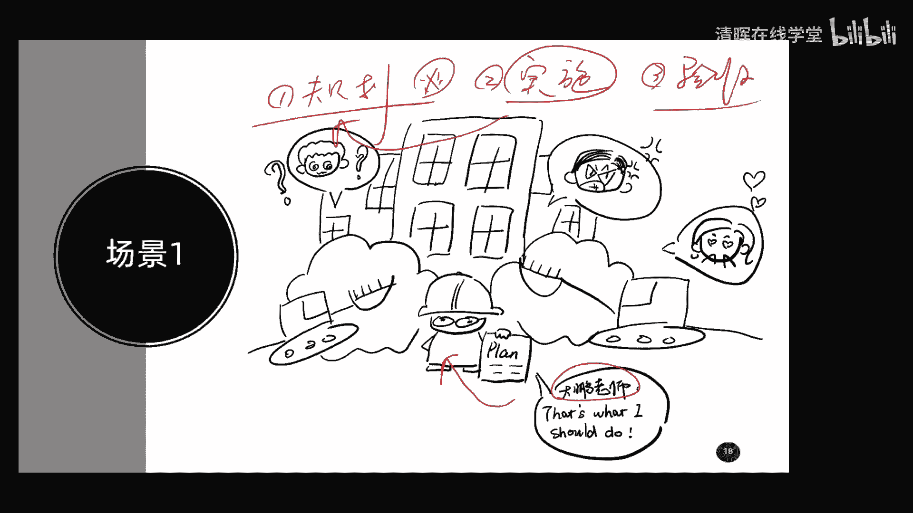
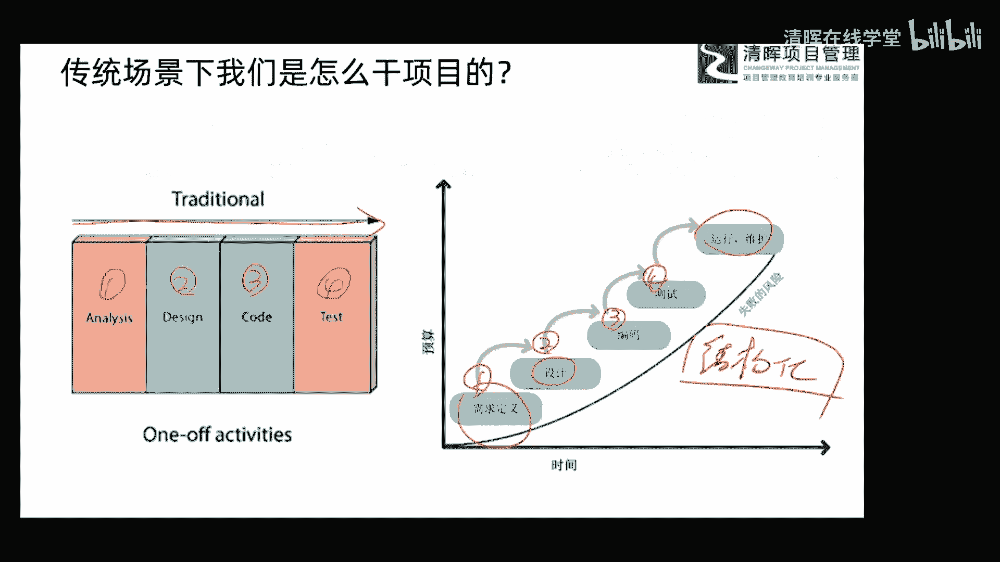
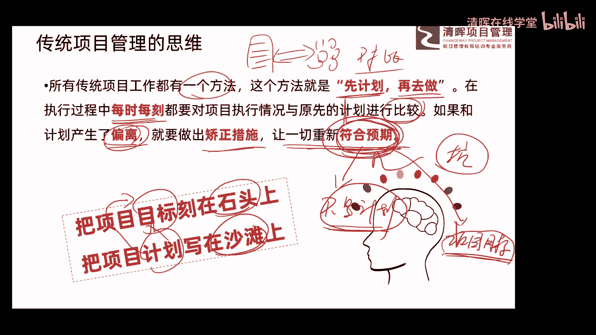

# 项目管理思维和发展趋势 12讲 - P4：4.传统项目管理的思维 - 清晖在线学堂 - BV1Vz421D7kH

然后我们再继续看另外一个问题啊，也就是说我们现在要了解项目管理，思维有哪些啊，那这个呢其实是我们今天分享的主要内容了，前面给大家做了大量的这种引导啊和铺垫，主要我们想了解这哎我想聊一下这样一个问题。

就是项目管理的思维到底有哪些，如果大家想搞明白这个思维有哪些，首先我们要搞清楚两件事，第一件事就是说我们到底干项目可以怎么干，那不同的看法可能我们的思维或思想也不一样，对不对。

所以呢首先我们要搞清楚第一件事，我们可以怎么去干，怎么去干第二件事，那我在这种干法下，我们是什么一种什么，这个所谓的这种思维的概念，也就是说你要不搞清楚我们怎么去干，那你就不知道怎么去干的。

这种思维是什么，所以呢我们要搞清楚项目管理思维有哪些，首先我要给大家分享分享，我们干项目的几种方式，然后呢对于每一种方式，他的思想是什么，它的内核是什么，我给大家一点一点去解析啊。

好首先呢我们看这一个场景啊，这个场景呢大家先看一看啊，大家看一下能不能看懂是什么内容啊，内容嗯在准备这个今天分享的时候呢，本来想从网上找一些这个图片啊，当然发现了网上那些图片呢。

总是不能get到我的一些点，也就是说它不是定制的啊，有些东西呢呃相对来说呢，这个呃不太符合我的要求啊，后来呢我的搭档尤老师呢就帮我画了一些图啊，大家看这张图，这是我们啊自己画了一张图啊，小漫画啊。

嗯非常简单啊，大鹏老师在哪呢，大鹏老师在这，哎这就是大鹏老师拿这个计划，然后呢戴着个眼镜啊，戴着个安全帽，这是在干嘛呢，大家看后边的这个背景啊，这是一个楼房，其实呢想给大家展示。

就是呃这个我们现在呢在盖大楼，现在大鹏老师在盖大楼，那大家想想在我们盖大楼的这个场景下，哎我们是怎么做的啊，你通常在这种场景下，你是怎么去啊开展这样一些工作的啊，比如说现在大家也都在盖大楼啊。

你是怎么做的啊，让大家知道我们在盖大楼之前啊，盖大楼之前啊，是不是首先要做所谓的规划和计划呀，对不对，你想想身边咱们这种案例非常多呀，我们现在要盖个大楼，首先要做个规划的计划，也就是说在动工之前。

我们的规划和计划呢一定要什么，做得非常非常的详细，也就是说第一步我们要做出来什么规划，就是规划好，而且这种规划呢是非常非常的详细的，你想一想啊，特别是今天来的建筑行业的一些朋友啊。

如果你在从事这个这方面的相关工作的时候，你会发现，那在挖大坑之前，在我们打地基之前，我们所有的这种大楼的设计都已经，什么非常的完美了，或者非常详细了，哪块有个柱子，哪块有个门，哪块有个窗户，这个门多高。

这个窗户多宽，全都已经什么设计得详详细细了，也就是说，我们这个规划已经做的非常非常到位了啊，非常非常到位了，然后呢再开始按照这个计划什么啊，叫做开展实施唉，找实施或者就要开工好，拿着计划我们去实施。

拿着计划去实施，然后按照我们规划的所有内容，按照计划的所有内容，一步一步的一点儿一点儿的唉，然后把这个计划呢都规定好的工作，都把它做出来，最终呢第三步哎，成果出来了，哎我们进行验收啊。

经验收验收交付就可以了，所以你看这样的一个场景大家是非常熟悉的吧，那在这种场景下，我们的做项目的思维是什么呢，大家可以思考一下啊，可以思考一下，我给大家呢几秒钟时间啊，你稍微的思考一下，在这种场景下。

你的做事的思维是什么。

其实非常简单，我也给大家总结完了啊，大家看一看啊，首先我们来了解一下，刚才给大家讲两个场景中的一个流程给大家聊，呃，刚才那个旮瘩楼的一个流程好，这种流程呢我们一般管它叫做瀑布模型哎，或者叫结构化方法。

也就是说我们首先呢对一个项目也好，或者一个具体的工作也好，我们进行需求的定义，我们搞清楚要干点什么，大的要求是什么诶，把它定义的非常非常的清晰完美，唉然后呢再做设计，所以第一步呢定义好需求。

第二步呢做好设计，哎我们根据大家要求，我们做各种各样的规划计划，把这个计划做出来以后，第三步呢就是IT行业的啊，叫编码，那我们建筑行业呢就施工了，对不对呀，编码那就是it行业的，我们编代码嘛，敲代码。

大鹏老师呢第一份工作叫程序员，也是干这个事的啊，好那第四步呢我们工作干出来以后呢，要进行测试啊，那it行业叫测试，那在其他行业可能就业这个啊叫什么这个呃，检测也好啊，或者是质量检查也好啊。

类似这样的东西，来检查一下你的工作有没有问题，没问题呢，进行了这个所谓的验收，然后就移交了，然后进行了啊运行和维护这么一个概念，所以呢这样一个做事的一个流程，我们管它叫做瀑布模型或者叫结构化方法。

或者叫结构化的方法，或者叫瀑布模型，那好这边呢就是我们这样的一个展，一个整个这个流程一个展示，大家看一下，你看它是不是一个线性的概念，从前往后是线性的概念，第一个做好这个事儿，第二个做好这些事。

第三个做好这个事儿，第四个做好这个事儿，诶你看这是一个线性的概念吧，非常符合我刚才给大家讲的盖大楼的概念，对不对，所以呢它是一个线性的这种啊，开展工作的一个啊一个方式，那如果大家在这种场景下做项目。

你的思维是什么，来看这句话，在这种传统的这种场景下，哎我们有一个统一的方法，有一个统一的方法，这个方法就是一定要先计划再去做，一定要先计划再去做，唉这个是没有任何的这个啊可以讨论空间的。

如果你的你这个项目是传统的行业啊，基本上呢是这么一个概念，就是先计划再去做，然后呢在我们做的过程中，大家要做好每时每刻的这么一个事儿，叫什么呢，对项目执行的情况与原先的计划呢进行比较。

我们可以认为呢这是一个计划，这是一个计划，这是你实际的结果的情况，他俩之间呢要随时的做什么对比，随时做对比干嘛呀，来看一下你的实际工作情况和计划之间，是不是这个要求之间是不是有差异，有问题。

如果你发现有差异了，有问题了，也就出现了什么偏差或者偏离，这时候怎么办啊，一定要什么做出纠正措施或矫正措施，你和计划不一致了呀，那你一定要做出纠正，纠正和矫正措施来改变这个问题。

然后最终呢让一切重新符合预期，同意符合预期，这句话呢其实呢读起来很简单，大家呢也非常的这个容易理解啊，但是我告诉大家呢，告诉大家啊，这句话中呢挖了一个很大的坑啊，这句话中有坑啊，有坑有坑，坑在哪里。

在最后这一句话上，他说让一切重新符合预期，很多朋友说了，那那不就符合计划吗，计划做完了，我们按照实际计划去做对吧，做的过程中发现和计划不一致了，那好那我们改一改，再复合计划去呗，告诉大家，如果你这么想。

那你在这个坐在项目工作中呢，你就掉入了这个坑，你看它的理念是什么，让一切重新符合预期，这个预期是什么，预期是计划部，大家思考证有问题，预期是计划部，如果预期是计划，那好你认为它符合计划。

OK我认为这是你的理解，但是如果你认为预期不是计划，那它是什么，大家一定要把这个搞清楚啊，我告诉大家，这个预期不是计划，这个预期不是计划，这个预期是什么，是你的客户或你的用户对你的最终的要求。

或者是叫你项目的目标，所以呢大家知道预期我们是什么，是项目的目标，是这个东西啊，这是我们的预期，那好这句话就告诉我们，在这种传统行业下，虽然我们是按照计划来做工作的，来做这样相关的一些。

具体的这样一个啊工作的话，但实际上计划也是可以改的，计划也是可以改的，因为呢我们在后期啊，如果大家对这个项目管理深入了解的时候，你会发现项目呢还有一个特点叫渐进明细性，渐进明细性。

也就是说我们在向早期啊，多多少少都是有模糊的概念，你的计划做的也不可能那么准确，那在整个过程中呢，你了解信息呢越来越多，越来越详细，这时候怎么办呢，你的计划就可以根据你新的信息呢，来进行调整了。

来优化了，所以呢计划是可以改的，那这个道理大家懂了以后，大家发现什么不变呢，目标一般是不变的，什么可以变的，计划是可以变的，如果你在传统场景下做项目，你发现你的做的具体的结果和计划不一致的。

你首先要分清楚是你计划做的有问题，还是你执行过程中有问题，如果你发现你计划做的确实有问题，那好你就想办法去修改你的计划啊，去把你的计划更新了，你计划做的不对，对不对，如果你发现你计划做的没问题。

那好现在不一致了，那也就是你实际的执行出现了问题，这时候你就想办法去把你实际执行的情况，进行什么修正，进行这种所谓的变更，让它符合你的计划去，所以呢这句话啊非常有深意，叫让一切重新符合预期。

这个预期大家一定要记住这个项目的目标啊，可不是计划的概念，所以底下呢也给大家总结两句话，就把项目标我们要刻在什么石头上，哎你把它刻在石头上，它基本上就不会变了吧，不会改了吧。

但是我们的计划是写在什么沙滩上的，只要有一些新的信息来，会有新的一些场景出现，我们的计划都是可以改的，最终我们实现的是什么，我们计划实现了什么，实现的是我们的目标啊，我们通过它计划的这样的一个啊。

一个一个具体的内容，我们最终是想实现目标的，目标是不变的就可以了，所以呢这叫什么目标驱动啊，也就是所谓的这种项目管理的这种，我们要以目标为导向的概念，所以这是传统项目管理的思维，大家理解一下。

平时呢大家看看你工作是不是这种看法啊。

好那这是第一个场景，大家理解了。