# 项目管理思维和发展趋势 12讲 - P8：8.敏捷项目管理的结构和逻辑 - 清晖在线学堂 - BV1Vz421D7kH

好。

那我们看一下敏捷项目管理的一个结构和逻辑，这张图呢非常经典啊，如果大家搞敏捷玩敏捷的这张图呢。

基本上都见过，也都都用过啊。

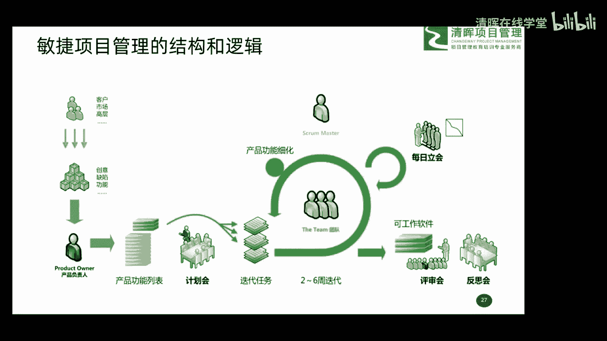

那这里头呢大家看一下啊，敏捷怎么玩的，我们这个人啊，刚才给大家说的PO那个人吧。

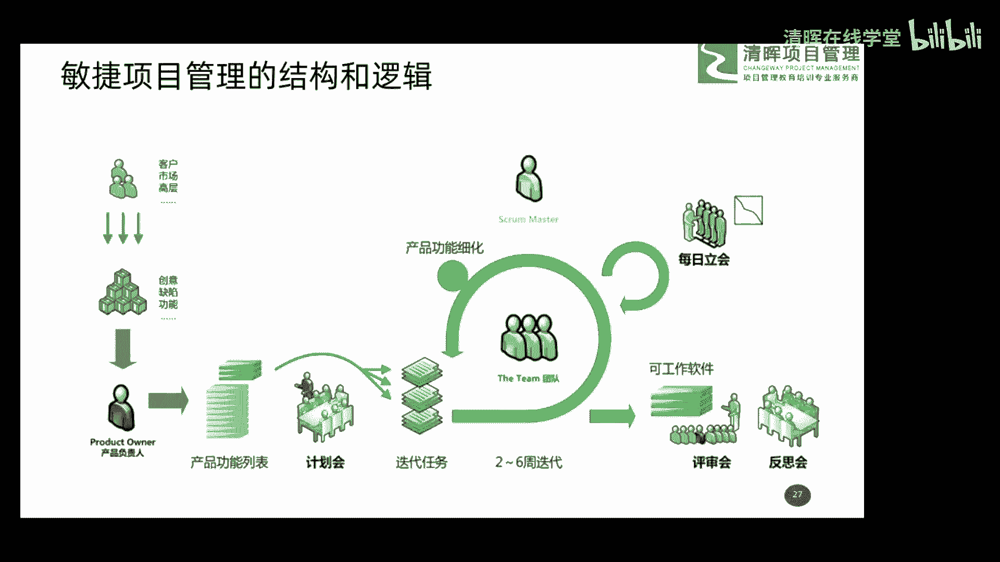

叫产品负责人嘛，代表客户的是吧，一般我们在很多行项目中呢。

呃可能产品经理啊主要是做这个决策的，或者是类似的这样一些角色吧，然后呢他从我们的客户唉。

市场高层来收集到一些需求，然后把这些需求呢哎混在一起。

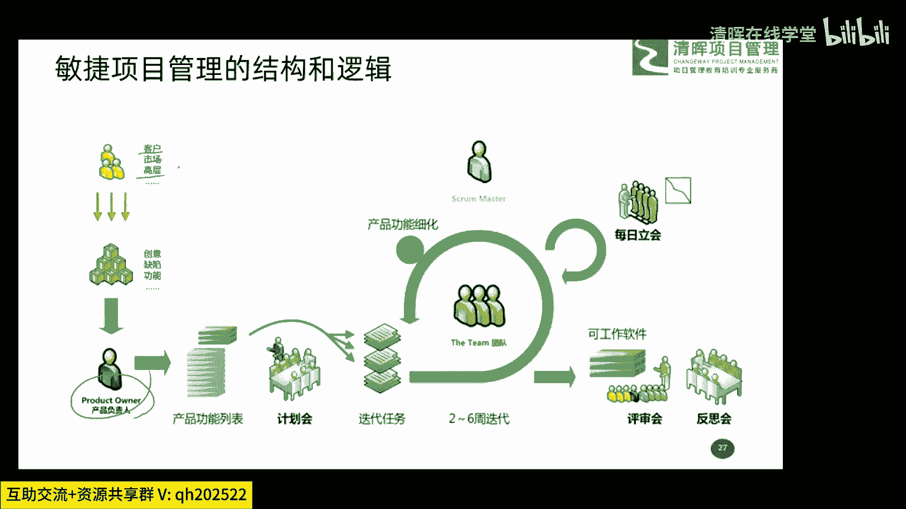

然后包括呢有些创意啊，有一些功能的这个设想。

包括可能又要解决缺陷哎，都收集过来啊，这都是来源，然后把这些东西放在一个文档中。

叫产品功能列表，这东西我们管它叫做什么PB，然后对这个产品功能列表中所有要做的事，我们进行优先级的排序。

进行优先级的排序啊，一定要有优先级啊，拍完戏以后怎么办呢，我们把优先级最高的。

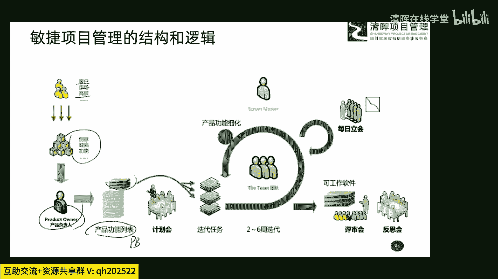

也是价值最大的一些内容先给他找出来，然后呢把它细化到什么。

可以开展具体工作的这么一个层次，这个东西呢叫做任务啊。

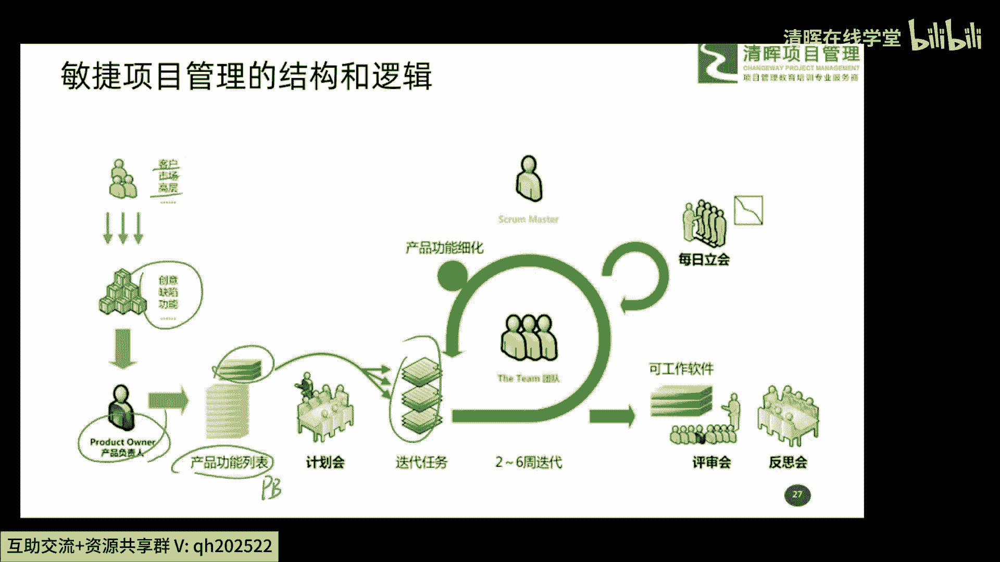

啊这task啊这个东西，然后开展了一个什么两到六周的一个迭代循环，这个时间段是固定的啊。

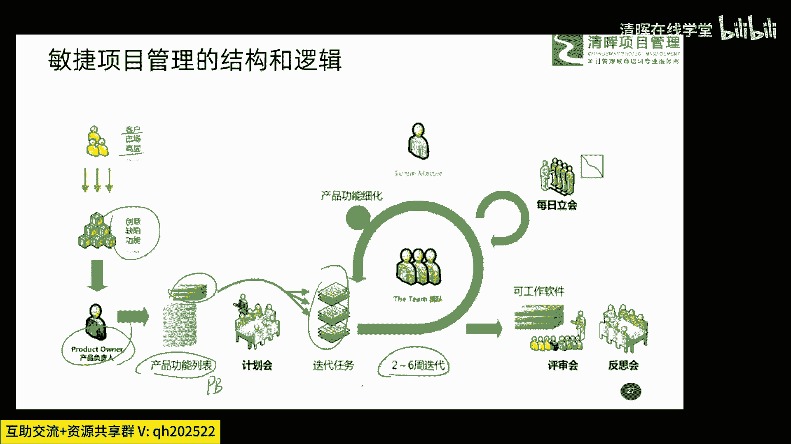

最多最多不超过六周啊，最短的也不建议低于两周。

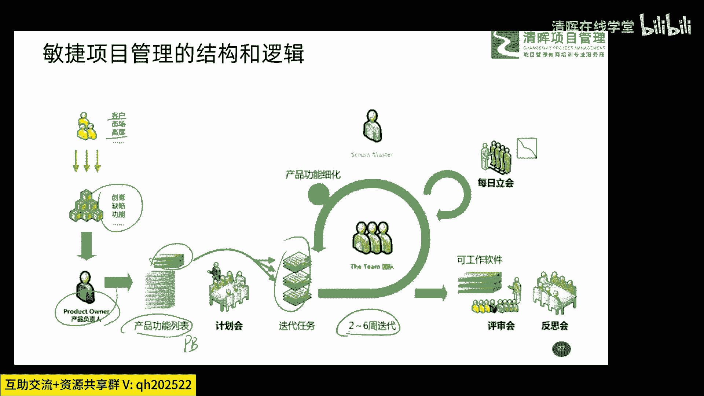

哎，你固定好一个时间段，就在我们在敏捷中那管叫时间盒的概念，然后把这个优先级最高的这点工作。

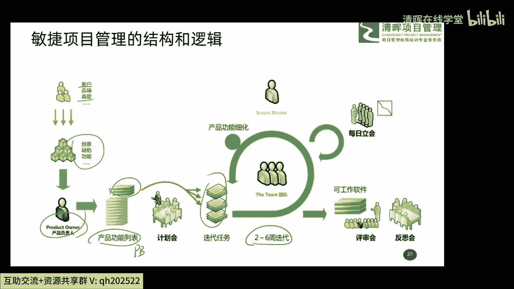

什么给他什么，在这个时间段内给它完成了。

完成以后呢，就产出了一些什么可以啊交付的成果，或者说是可以工作软件吧。

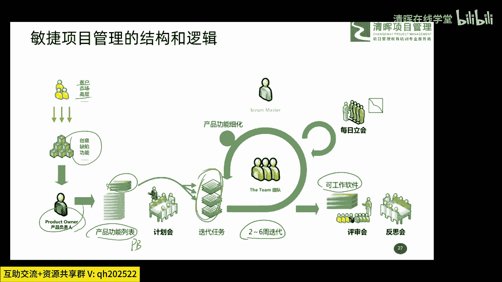

或者可以交付的成果，然后呢通过评审会来评估是否达到了要求。

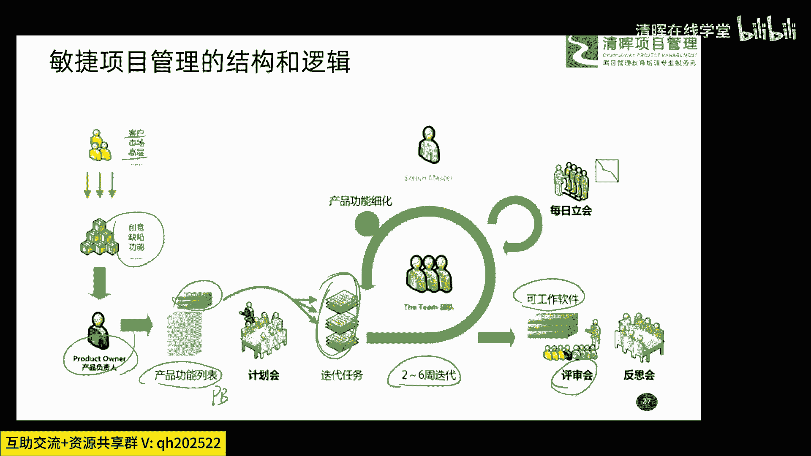

通过反思会呢来干嘛呀，来对整个迭代这个过程中。

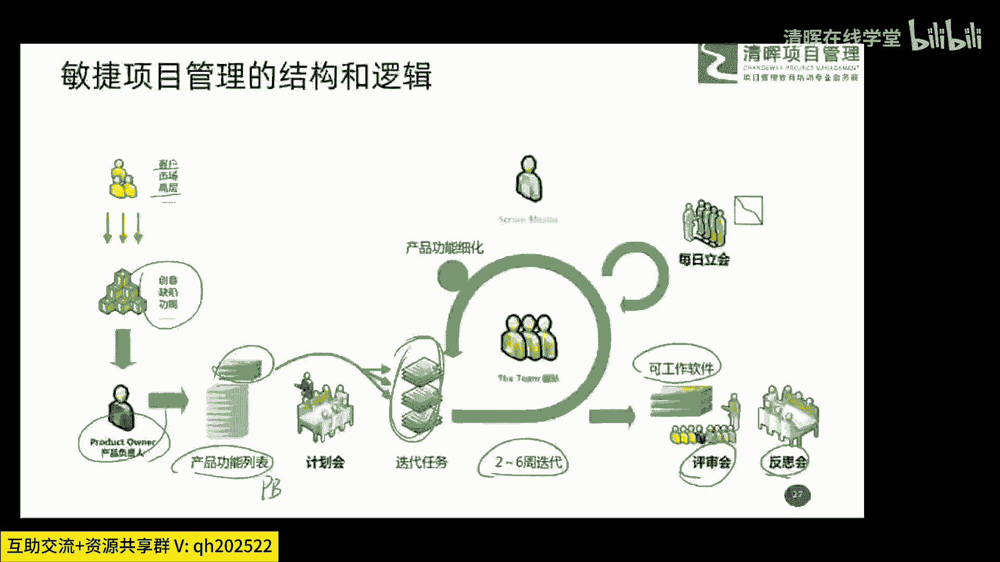

哪些地方干得好，哪地方干的不好呢，进行PDC过程改进，哎这是整个这么一个流程。

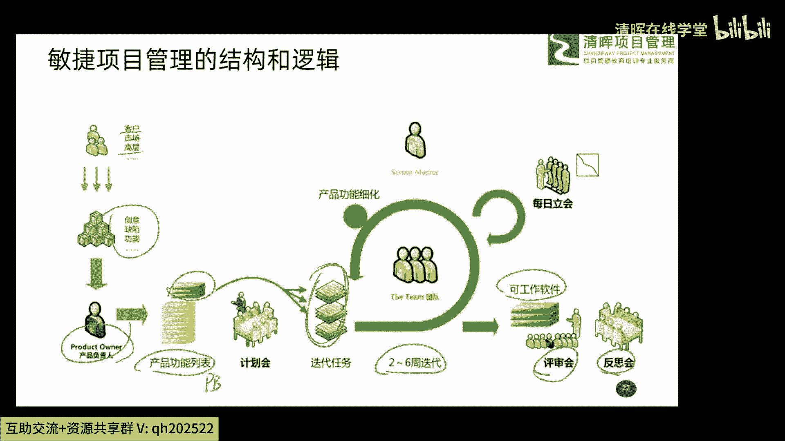

然后呢这里头还有一个东西叫每日例会，其实这个如果大家玩过敏捷的朋友，应该非常熟悉了，每天早上站着开那个会说三件事，第一呢我昨天完成了什么。

第二呢我今天计划干什么，第三呢，我现在工作中有没有障碍问题。

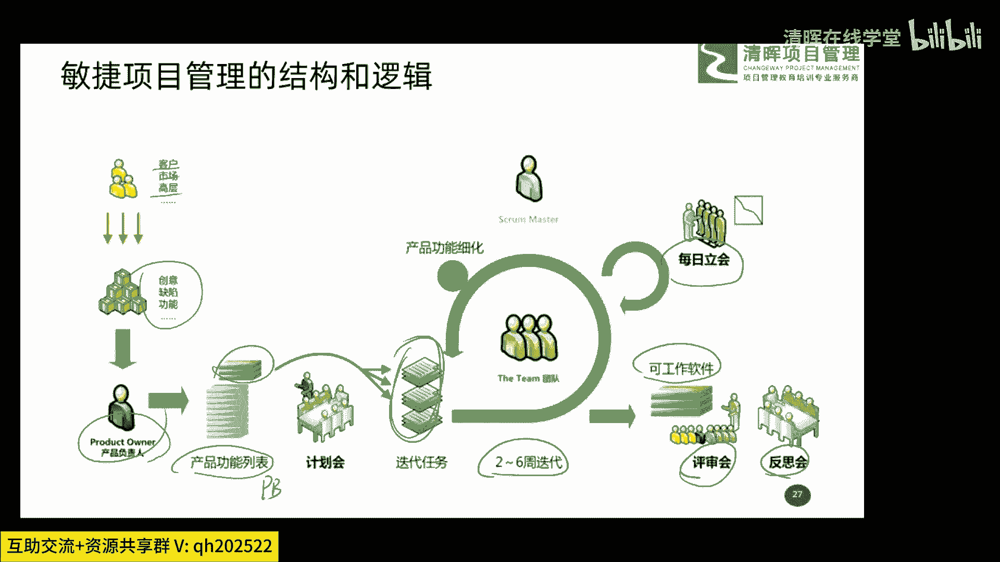

需要SM或者别人帮我去解决，这是每日例会，属于信息交流和工作安排的这么一个会议。

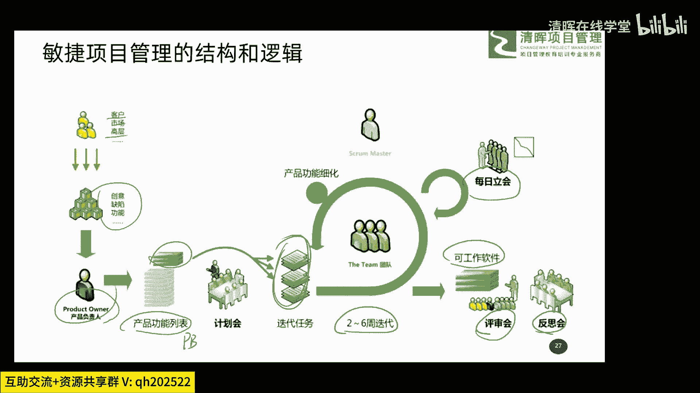

所以这个整个这么一个小的流程图呢。

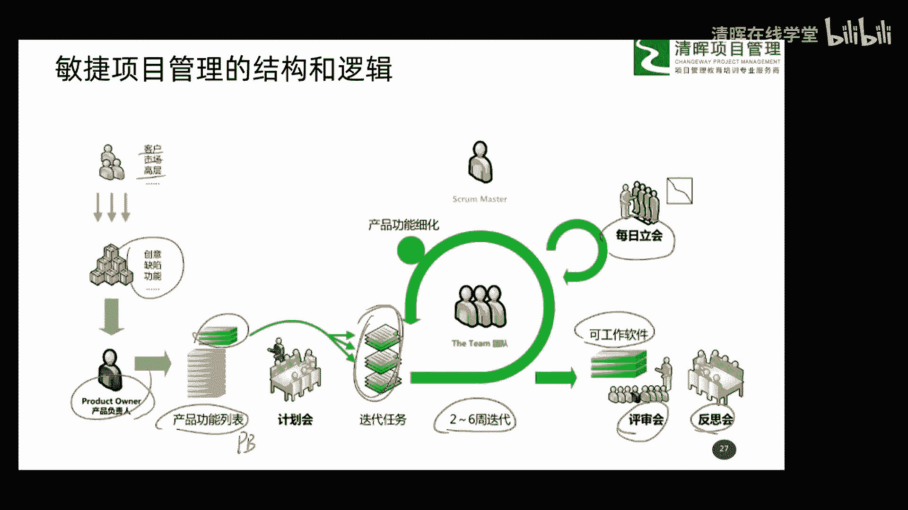

就给大家讲明白应对场景二，这种场景下我们怎么去开展具体项目。

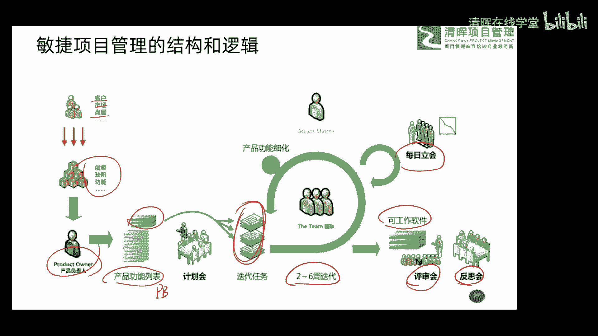

以及它的逻辑和流程是什么啊，所以大家要稍微了解下行了。

