# 项目管理思维和发展趋势 12讲 - P1：1.什么是项目 - 清晖在线学堂 - BV1Vz421D7kH

好我们看一下今天分享内容，项目管理思维和发展趋势，按照刚才给大家说的拆文解字的方法，我们可以拆成了三大部分，第一大部分呢叫做项目管理，第二部分呢叫思维，第三部分叫发展趋势，唉，这是第一部分。

这是第二部分，这是第三部分啊。

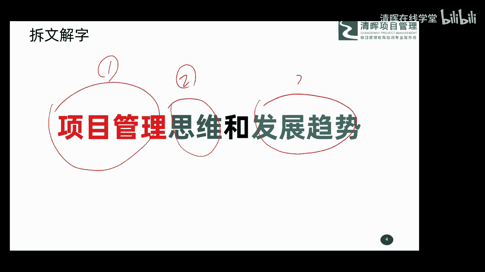

这是发展趋势啊，那这三部分拆出来以后呢，那我们今天就围绕这三大部分呢，来给大家做一个解析吧，来做一个解析啊，好那首先呢我们看一看啊，这个第一部分项目管理，在这里呢我要给大家分享啊。

这个关于项目管理的一些，基础的一些概念理念啊，基础的概念理念啊，包括什么项目，什么项目管理，这个大家先了解一下就可以了，然后呢再给大家讲一讲思维的东西，包括我们做事的思维和项目管理的思维。

然后再给大家聊一聊我们这个行业啊，未来的发展的一个方向和趋势吧，那把这三件事呢，今天呢用大约90分钟时间呢给大家啊。

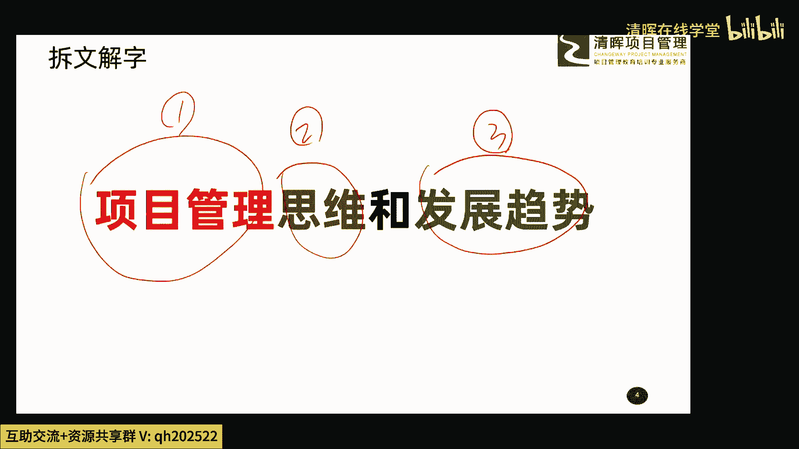

聊完聊清楚啊，今天我的这个分享也就啊就可以结束了啊。

好那这就是我们今天的一个主题啊。

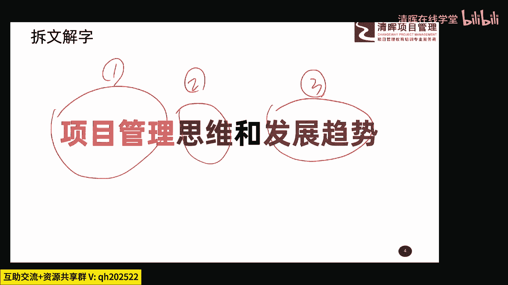

大家了解一下啊，首先呢我们看第一个事啊，就是什么是项目和项目管理，因为今天呢我跟咱们课程的班主任聊的时候呢，啊班主任跟我说了，有一些朋友呢，这个系统的学习过项目管理的那种。

就是考过p mp或者类似的相关的一些认证，那大部分朋友呢可能啊还没有这个专业的，系统的学习过项目管理，那这时候呢我们就简单的给大家解析一下啊，关于什么是项目和项目管理啊，给大家呢稍微啊回顾一下。

或者是了解一下啊。

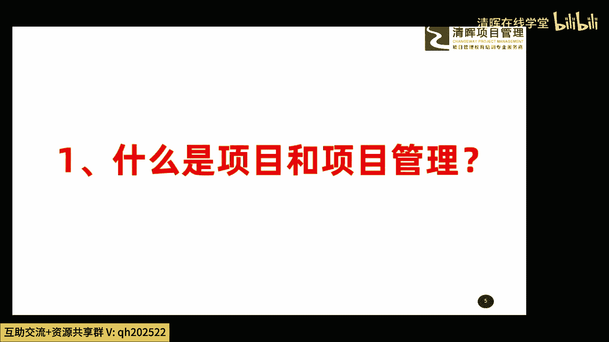

非常简单的这两个概念，首先呢什么是项目啊，这个大家要搞清楚，因为我们这次课程的主题是项目管理的，这个内容啊，有项目管理的这个他的一些趋势的东西，所以你首先要了解那到底什么是项目啊，这要搞清楚啊。

否则后面的内容呢大家不容易跟得上了啊。

那在我们偏book这本书中啊，就是现在项目管理的一个。

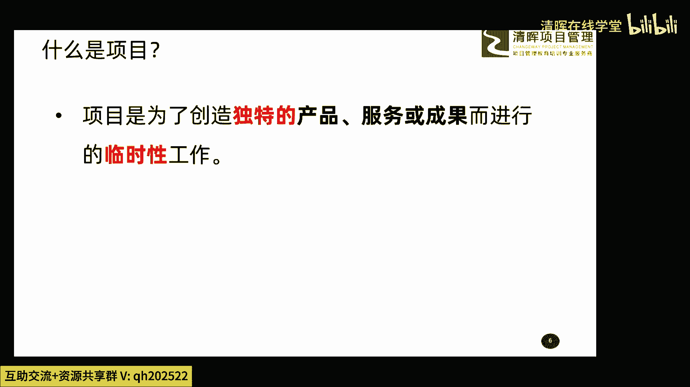

我们可以管它叫做一个圣经吧，也就是说现在我们做管理。

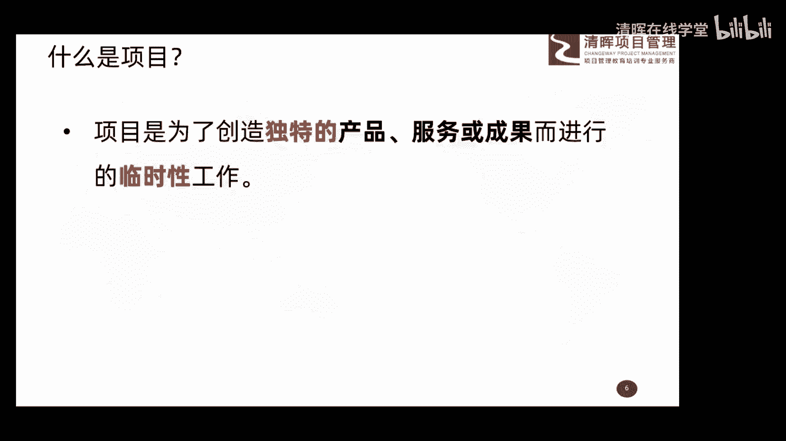

基本上都会按照，PMBOK的这本书的一些最佳实践来开展，我们具体的管理，那在这本书中呢，他讲到了关于项目的定义，这个定义呢从第三版啊，PMBOK的时候呢，到现在第六版了啊，这也就是说呃从来没有换过啊。

从来没有换过呃，这个定义呢也非常经典啊，我们看一下非常简单，他说项目是为了创造独特的产品服务或成果，而进行的临时性的工作，只要是符合这样的一些特点的事儿呢，这个我们都是什么项目的概念，都是项目的概念啊。

所以带大家了解一下就行了啊，这是关于这个我们下面的一个定义好，那如果按照这个定义来说啊，大家可以思考一下啊。

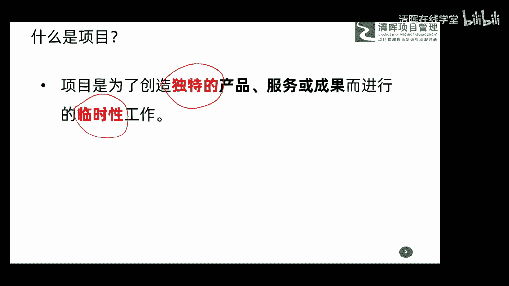

如果按照这个说法来说，我们身边发生的绝大多数的事情啊，绝大多数的事是不是都可以当做项目来做嗯。

大家想一想，比如说往大了说咱们国家的这个探月的工程。

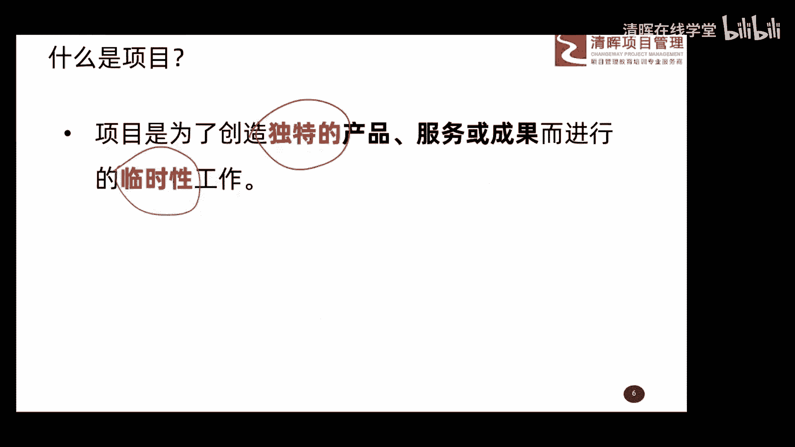

我国的嗯，咱们说那个叫北斗啊，北斗导航的那个系统的建设，还有呢这次应对这个新冠肺炎的这个战役。

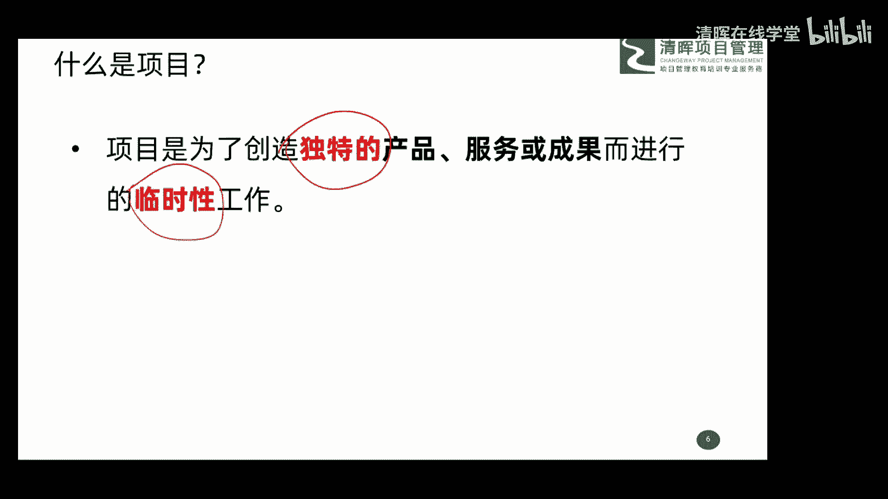

是不是都是项目的概念，是不是他们都有这个独特的概念和。

临时的概念呢，好往小了说咱们做顿晚饭啊。

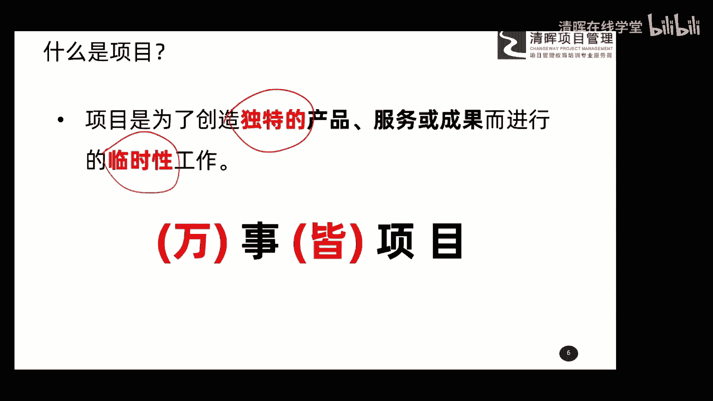

这个点呢估计很多朋友呢可能是刚吃完晚饭啊，或者正在做晚饭吧。

哎这是我们做的晚饭，我们搞一次这样的直播讲座，是不是都符合这个场景啊，哎这就是关于我们项目的定义，大家了解一下就行了啊，所以给大家总结了底下的一句话。

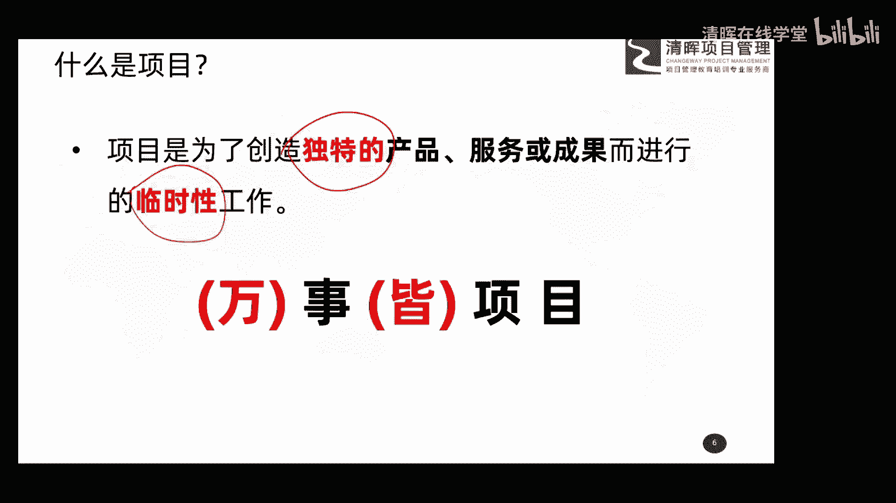

叫做万事皆项目，也就是说我们做什么事，只要符合它独特的，它是临时的啊，这样的一个特点都可以当做项目来干啊。

这个就是万事皆项目，所以说呢项目管理现在呢他之所以现在比较火。

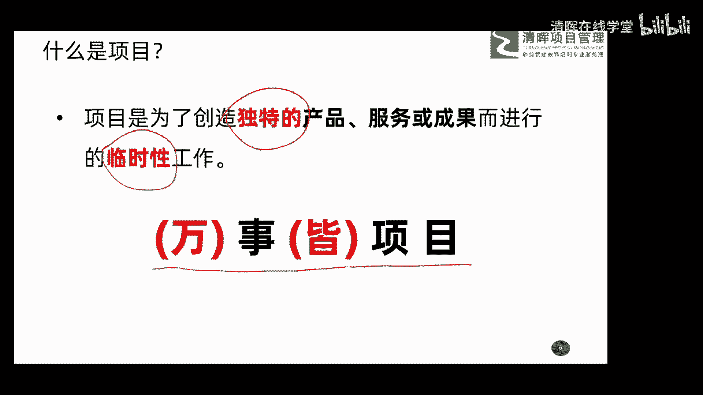

原因就是它的受众面太大了，什么事都可以当做项目来干。

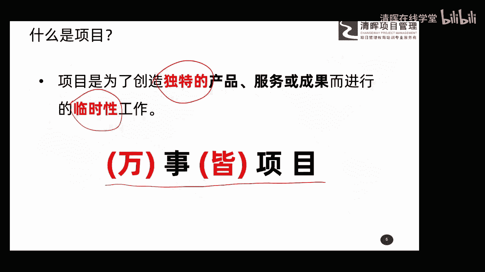

所以你要懂区懂这种管理方式，这样才能把这事干好啊，所以万事皆项目。

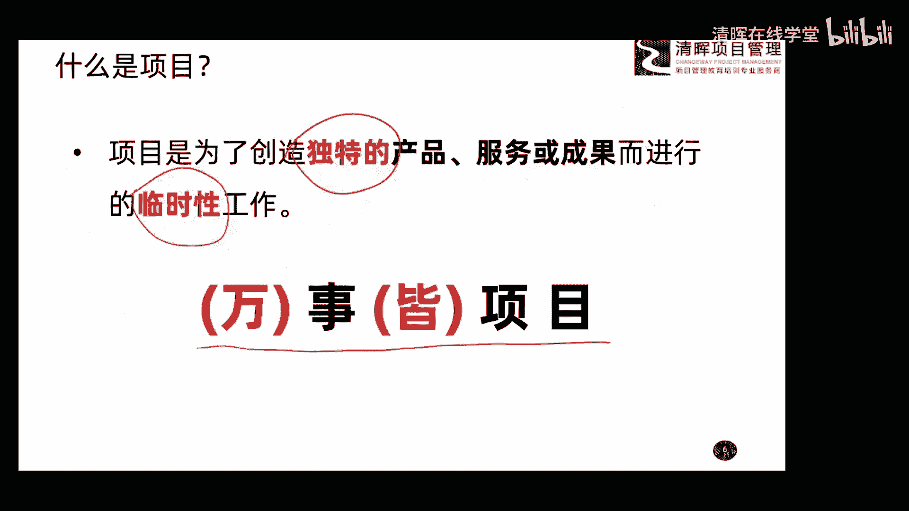

这是关于项目的一个概念。