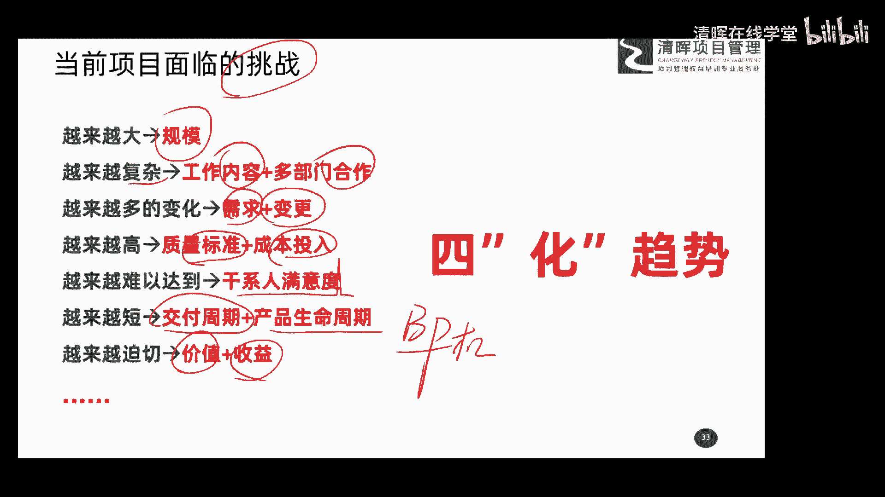
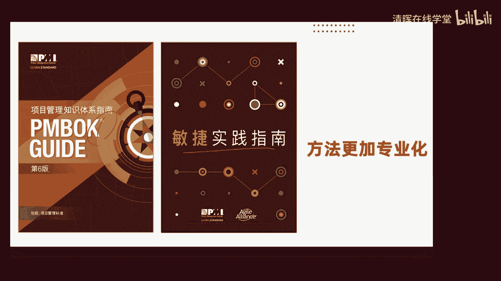
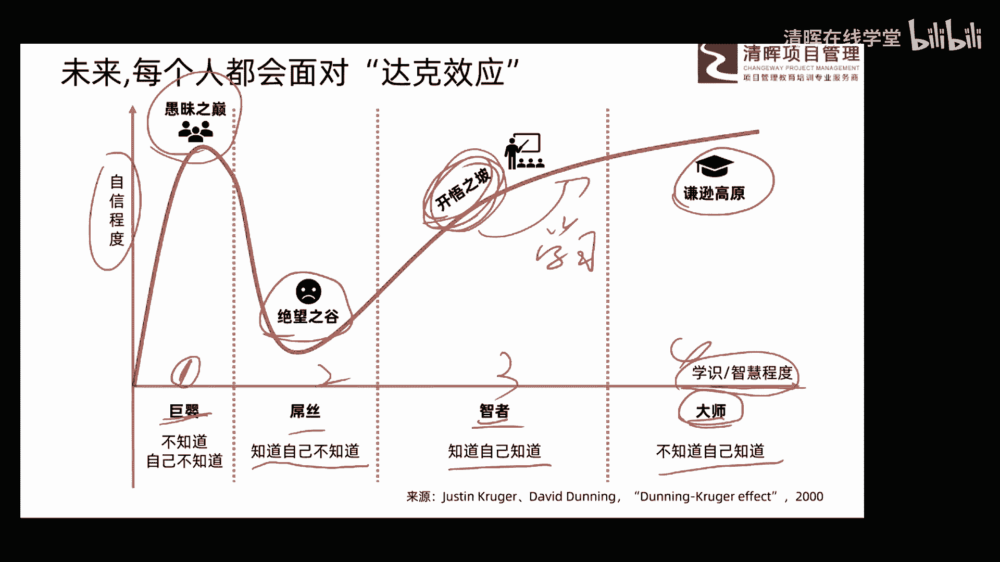

# 项目管理思维和发展趋势 12讲 - P12：12.四”化”趋势 - 清晖在线学堂 - BV1Vz421D7kH

在家呢看一看，这是我们当前项目面临的一些挑战啊，比如说我们想知道我们项目未来发展趋势，那一定要先知道我们当前有哪些挑战，而这些挑战呢都是我们未来发展的趋势，我们要把它解决掉，要给他响应好，对不对。

那这次给大家也做了一个总结，这是我这是我我做的第二个调查问卷，是为了咱们课程呢我做了三个调查问卷啊，发给了大约是呃两三个群，大概是有五五百五百左右的这个这个，这个这个调查的受众吧。

最后反馈上来有200多个这个结果，所以呢给大家也做了总结啊，那好那很多朋友认为呢目前项目面临挑战呢，有这么多唉，给他排了个顺序，第一规模越来越大了，以前呢可能哎这个项目呢。

可能呃这个规模呢都是咱们说这个哎几10万，几百万对吧，现在动不动就上千万上亿，对不对，所以这规模越来越大了啊，而且呢对这个工作的内容，和这种跨部门的合作呢越来越复杂，以前可能单一部门就可以搞定。

现在可能什么这个几个部门还在，大家在一起合作才能搞定，而且这个内容呢也特别特别的什么复杂了，以前可没有这么多的要求，现在要求也特别多了啊，然后呢越来越多的变化，比如说啊需求呢现在变化越来越频繁。

然后变更呢也现在是非常非常的这种常见了啊，所以说我们在这过程中呢，这个变化的概念呢越来越广泛，然后越来越高，指的是我们的质量，这个要求质量的标准，还有成本的投入，也是钱越花越多。

客户要求在什么也越来越什么，这个这个相对来说呢这个质量要求越来越高，然后越来越难以达成的，指的是肝性的满意度，以前呢咱们说给他一个他能用就行了，现在呢不光能用，还要好用，还有什么东西简单耐用。

哎所以说现在要求呢也越来越，这个这个这个这个难以达成了啊，然后越来越短，指的是我们的交付周期哎，和产品的生命周期，什么交付周期啊，以前可能项目呢是十个月，现在客户说不行，十个月我接受不了。

你要给我五个月，可能四个月或三个月，你就要给我，然后生命周期，产品生命周期是指什么意思啊，我们的项目最终可能是一个，以各种产品的形式交付给客户，那好以前这个产品可能10年20年都存在。

比如说是咱们说这个给大家举个例子啊，比如说咱们说那个这个呃，有一个东西呢叫做BP机，BP机哎这样一个东西必须机，那这个呢可能有些朋友应该知道啊，大部分朋友应该知道它是一个产品吧。

那好什么叫产品什么时候起啊，从它上市到最终市场把它淘汰掉，它没有了这么一个周期呢，叫做产品生命周期，所以你看以前的一个产品，可能我们呃因为这个整个这个变化比较慢嘛，所以呢它的产品收入期可能比较长。

那现在呢一个产品的生命周期越来越短，可能几年几个月，可能还有一两个月就死掉了，对不对，所以呢产品生命周期也是越来越短的啊，越来越迫切指的是我们的干涉，那我们的客户呢。

哎对我们的这个项目最终达到的结果的价值，和它的收益要求越来越高了，不要求我们说把结果做出来就行了，你这个做出来结果对我来说要有价值啊，你给我一个结果，结果没价值，对我来说也是什么没有用的。

我不要求你给我结果，我要求你结果是什么有价值的概念，所以呢这就是我啊，我们第二个调查问卷收集上来的，就是目前项目面临的一些挑战，那这些挑战怎么去办呢，这也是我们今天第三个话题了，给大家总结了一个趋势。

叫做四化趋势，大家看一看啊，我们根据当前的这个挑战给大家总结的东西，对不对啊，对你来说呢有没有呃，有没有一些启发吧，嗯那为了应对现在这样一些问题，我们有趋势的预测，那针对这些趋势。

我们可以做对应的一些动作，来来去想象，这样的话我们后期可能发展起来就比较容易了，大家工作起来也会比较的这个简单好。

那四化趋势给大家分享一下，第一话叫目标更加价值化，我刚才给大家讲到了，现在客户对我们的要求，不单单是你给他一个他要的结果就可以了，而是这个结果对他来说一定要有价值，否则他心里一定会不满意。

大家看这张图啊，这张图非常经典，现在呢我们做一个项目啊，我们在这个栽树，对不对，那以前说啊，那我们栽树呢，做好计划以后，那好你干什么，他干什么，他干什么，那好各负其职就行了吧，对不对。

但是大家会发现这个场景下，你会发现如果没有以价值为导向，你会发现整个这个项目，虽然做完以后可能没有价值，你看这个项目中有三个活要干，第一个是挖坑，第二个呢其实这个是栽树苗，这是第一个挖坑，第二个栽树苗。

第三个呢是这个填坑啊，或者咱们说叫啊培土吧，结果这项目呢其实呢三项工作我们干完了两项，而这两项干的还是蛮不错，你看第一个挖坑挖的蛮深的吧，对不对，第二个呢这栽树苗出现了问题，所以第一个是成功的。

第二个事呢栽树苗出现问题，第三个填土填的也也是蛮蛮好的，你看填的满满的嘛，对不对，但是它们组合在一起，你会发现诶没价值没价值，一点价值没实现，所以呢你看以后我们的项目发展。

一定是客户对我们交付给他的结果，的价值呢是越来越关注的啊，所以呢大家在整个项目管理这个过程中，一定要关注价值，你去分析客户的要求，他的价值点在哪里，他对你价值期望在哪里。

然后你再想怎么去更好地满足它价值的要求，这样他才会更满意，他在过程中才会才会更愿意买单，更愿意掏钱啊，所以呢第一个话叫目标更加价值化，第二句话呢叫方法更加专业化了，也就是说现在的项目越来越复杂。

然后内容越来越多啊，整个流程呢相对来说对我们来说呢，这个要求也越来越，这个这个对我们的要求也越来越大啊，所以这个过程中呢，大家千万不能再像以前那种我想咋干就咋干，我这野路子也能干，我这正正规军也能干。

现在你想咋干就咋干的，结果就是你很快就被KO了，对不对，一定要玩正规军的看法，所以说针对我刚才给大家分享的两种场景，那标准的场景啊，就是那个传统场景，我们用这样的一套还专业化的方法去干啊。

就是所谓的叫项目管理的肢体指南，Pbook，这本书给大家讲，这个叫应对传统的项目管理，怎么去标准去干，那如果是敏捷的方法呢，还有第二本书叫敏捷实践指南，他告诉大家，在敏捷场景下你怎么去看啊。

也是一种标准化的一种专业化的，专业化的方，专业化的这种方法啊，所以说呢大家在未来的这个场景下，你一定要学习啊，一些专业的标准的这样一些方法，然后用这种专业和标准方法，指导你做这种复杂的这种异变的。

或者是这种相对来说规模越来越大的，这种场景下的项目，这样才能达到很好的一个结果，千万不能再玩野路子，玩自己的这种这种这种套路了啊，这样的话非常容易失败，唉所以呢第二个趋势呢我认为呢叫方向啊。

方法更加专业化啊，好第三个呢叫过程更加混合化，这说什么概念呢，我们前面一直给大家讲了两种场景吧，哎这个叫传统的传统的啊，和这个敏捷的啊，和敏捷的那这两种不同的场景，大家看一下。

用这张图来给大家稍微解析一下啊，这个嗯这个X轴和Y轴呢，分别代表需求的不确定性，和技术程度的不确定性，其实我们做现在任何的项目管理，现在都面临这两个问题，需求呢开始越来越不确定，那技术程度呢也是。

开始呢有一些不确定的东西出现了，如果你需求的不确定性和技术程度的不确定性，这两个不确定性程度都比较低，那也就是在这块的一个象限，这个时候你就使用传统的，你就使用咱们传统的这种这个呃，管理方法就行了。

先做好计划，然后呢按照计划去什么去哎，一点点一步一步一点一点去开展，去实现就可以了，因为本身的需求不确定性比较低，技术不确定也比较低，那你就按照传统方法去做，对不对。

那如果在这块也就是说确不确定非常非常的高，技术不确定性非也非常非常的高，这个时候你怎么办，这个时候你怎么办，这时候我告诉大家，如果你发现你现在做的项目是在这一块呢，就是根本上冒险的。

大家记得把它kill了，别做了，你做这种项目，你失败的概率是非常非常的高啊，不建议朋友们去尝试在这个领域的一些项目啊，就是需求不确定的特别特别高啊，技术确技术程度不缺也特别高。

这种场景下大家尽量不要去碰啊，除非你是个创新者，你是在创业啊，你可以找这些所谓的蓝海来来去尝试，否则不建议大家去碰这样的一个场景下的项目，那还有呢就是说我们有一定的需求不确定性啊。

然后也有一些技术程度不确定性，也就是说在这过程中需求会有变化，那技术程度呢也会有一些变化，这时候呢我们管它叫做繁杂的和复杂的，这时候我们使用一种方法叫做适应方法，也就是说大家说的叫敏捷的概念。

用这种方法不断的去迭代增量，通过这种不断的优化的方式，来渐进的这种实现我们项目的目的，来降低项目的这种风险啊，来实现最高的价值，唉这是敏捷的概念，那过程更加混合化，什么意思呢，这个说的是啥意思啊。

我们没有一个项目是非常非常的这种啊，传统的也没有特别特别多的项目是完全敏捷的，它都有些项目是这样的概念，中间有一些内容我们是搞得清楚的，是很确定的，这个时候呢这些内容我们就使用什么唉。

这种传统的这种做项目的商，这个方法和思维去做，那这个项目中有一些内容呢，是有一些不确定性的，包括需求啊，包括技术的不确定性，那我们就用什么敏捷的这种思维和方法去做，也是我们把项目呢要分成了什么。

两个不同的领域，那传统的领域适合那些没什么变化的那些内容，去做敏捷的那个领域呢，就做那些稍微什么有不确定性的一些工作去，所以说我们在整个未来项目发展的这样，一个场景下，我们一定是什么混合起来。

也就是说他们之间不可能完全界限清晰，一定是慢慢在交融啊，而且这种交融呢一定是未来发展的一个趋势啊，越来越交融在一起，那好，这就是我们第三个叫做过程，更加的混合化的这么一个概念啊。

所以呢我们在整个过程中呢，大家知道传统和敏捷的两种管理的，将这个思维和方法的它的优缺点，然后呢我们要融合两种方法，各取所长，相互搭配，这是混合的一个概念啊，好最后一个叫做结果更加的产品化。

结果更加的产品化，那这个结果更加的产品化呢，其实挺有意思的啊，这也是我们的学霸，尤老师呢给我画了一张插图啊，呃我我现在呢呃这个要搞个课啊，给大家讲的叫老婆生气的100个理由啊，那我们平时怎么干啊。

或者说传统上怎么干啊，所以大家可以看一看这张图啊，看一下这个图啊，我们可以怎么干呢，比如说我现在呢就要讲这门课啊，我给大家分享的就是这个这个老婆生气的，100个理由，我们怎么去应对啊。

那我们每一次这种用这种课堂的方式分享，那其实就是一个项目嘛，对不对，哎就是一个项目，那最开始的时候哎最开始的时候，那我们课堂哎都是这种方式，就是在线下面授的这种方式来进行的，那我们就在一个地方啊。

大家呢听我讲，然后呢我们实现所谓的这种知识的这种传递啊，但是大会大家会发现啊，大家会发现这种方法效率其实不高不高，对不对，效率不高，那所产生的这种经济价值和这种影响的价值呢，也是比较有限的。

因为毕竟呢它受环境的影响，对不对，哎大家聚在一起啊，然后这个哎这个效率啊也不是特别高，然后产生经济价值和影响价值呢，也是比较有限的，那我们能不能改变一下思维，我们能不能把我们的课程呢这种分享东西呢。

我们把它变成书籍，我现在是面对面面对面给大家去讲这个这个课，那我我要讲的内容呢，我把它写成一本书行不行，可不可以这样我那受众是不是就更多了，而且是不是把我自己的这个东解。

这个讲解的这个这样的一个工作解放出来了，我可以找更多受众啊，对不对，来去影响他们，那这样是不是能给我产生一些，而所谓的更高的经济价值，对不对，或者影响价值，大家可以来思考一下这个问题，对不对。

所以你会发现很多老师呢早期呢都是在讲课，后来有些基础呃，这个积累以后呢，我们都会把这些积累的东西呢进行呢啊书面化，把它写成书，包括现在呢你说这就叫candle电子书啊，都可以。

所以呢它是一种新兴的一种啊分享的方式，可以实现更高的这种影响价值，包括啊这种啊经济价值，对不对，但是大家知道书呢也是有局限性的啊，这种书籍也是有局限性的，它只能阅读啊，只能拿着看，对不对。

那你说现在大家的工作都是快节奏的，对不对，那我们睡呃碎片化的时间特别多，那怎么去把这些碎片化的时间高效的利用起来，那现在是一个叫知识付费的这么一个时代，所以大家看你的手机上也装了好多这种app吧。

什么得到啊，知乎啊，唉哔哩哔哩啊，网易公开课呀，哎还有些什么什么啊，喜马拉雅呀这样的一些APP，你会发现如果我把我的一些知识，通过这种音频也好，视频也好，诶或者是微课也好，诶，我要把这个东西哎。

做成这样的一些结果来给大家，是不是能带来更高的一种什么收益，包括经济收益，包括什么影响的收益，所以呢这里头给大家讲一个第四个这个理念，就是说我们现在很多传统的做项目，它的结果是一种什么服务。

它是一种服务，比如现在我给大家分享这样一个课，其实是一种服务，对不对，如果我能把这种服务，我把它什么产品化学，比如说给他这样一个产品化或这些产品化学，你会发现我这个服务带来的价值，会有指数级的增长。

而且相对来说呢对我个人也好，对大家来来说也好，都是一个巨大的进步，这就是我们第四个理念或第四个分啊，分析得到的就是现在很多项目的结果，我们要以产品化为导向，尽量呢不是单单的提供一个服务出来。

而是要把这种服务尽量进行产品化进行复制，这样我们会产生更高的收益，更好的效果，这就是所谓的第四个叫结果更加产品化，结果更加产品化，不知道大家能不能跟上我的思维啊，这块的内容呢啊。

相对来说呢呃这个呃呃有一些跳跃了啊，所以这是第四个内容叫产品结果更加产品化好，那这就是我们四话的内容，也是我把大家呢这个关于项目管理的未来发展，趋势呢给大家做了一个这样一个总结和分享吧，通过我们的调查。

通过大家的共同的这种啊这种积累，通过大家的共同的这种总结，我们把这个东西做了简单的一个分析啊，好，最后呢我想用这样一个图形呢，来结束我今天的这个这个分享啊，结束今天的这个这个这个讲座啊。

啊大家看这张图啊，这张图呢叫做啊达克效应啊，达达克效应其实有时候也管它叫做邓宁，叫克鲁格效应啊，其实这个东西挺有意思的，是2000年的时候呢，获得了一个叫搞笑诺贝尔奖，心理学奖的这么一个一个一个结果啊。

当时呢是这俩这个这个邓宁和克鲁克这俩人呢，在那个呃这个呃一篇文章上啊，发表了这么一个杂志上，发表了这个一个报告，应该是这俩人应该是是美国的康奈尔大学的吧，我记得好像是啊，然后发这个写了一个报告。

这个报告名字我想想啊，这报告名字还挺长，叫呃叫论正确论，无法正确认识能力不足，如何导致过高自我评评价啊，其实挺拗口的这么一个概念，其实他说的啥意思呢，说啥意思呢，就是说无知要比知识更容易产生自信啊。

给大家解释一下，你看这张图，它分成了12344个象限，12344个象限，第一个象限呢呃这个Y轴代表自信的程度，S代表学识和智慧的程度，也就是说越往用你的学识越多，智慧越高，然后越往上呢你自信程度越高啊。

所以第一个象限呢我们管它叫什么经期，什么意思啊，自己呢知道的东西不多，唉知道东西不多，但是自己非常非常的自信，也就是说这个层次的这个人呢，也就是说大而无畏，我自己不知道，但是我非常自信啊。

这样的一个层次啊，这样一个啊一个一个东西叫做啊这个巨婴，我们管它叫做愚昧之巅啊，也就是说不知道自己不知道诶，这样一个几个层次啊，好那随着你的学识的不断的提高，你智慧程度不断提高，然后你发现啊。

原来什么我自己不知道东西那么多，然后你的自信程度会瞬间的这种下，这个下滑会达到一个一个低谷，这个这块呢我们管它叫做绝望之谷，哎感觉自己不知道这个知道的东西太少了，自己不知道的东西太多了。

这时候非常的绝望，没有自信了就绝这个叫绝望之谷啊，这个时候呢叫知道自己不知道，哎其实呢这个有个词我们叫屌丝好好，然后再往后呢，你的学识越来越多，这个程度也越高，哎你知道自己知道哪些东西了，哎。

你就开始进入了一种什么自信重建的一个概念，自信哎又提升下来了，叫开悟之坡，现在呢其实我我我我相信啊，我也觉得呢今天来听啊，我的直播的这个讲座的这个朋友，应该都在什么开悟之坡上，你知道自己知道哪些。

你也知道自己什么不知道哪些，所以你再来学习嘛，所以大家都是属于什么智者这个层次啊，开悟智夫智者的概念，当然了，大家学识达到更高的程度啊，你也变成了非常智慧了，你的自信程度也达到了非常高的一个顶点。

这叫谦逊高原，就不知道自己知道，你已经不知道自己哪些东西不知道了，就是你什么东西都知道了啊，这个就是属于大师的层次了啊，所以说我想用这样一张图呢，结束我今天的这样一个分享啊，之后呢用一下啊。

用一句话呢来来做个总结吧，也就是说通过这样一个打开效应，这个图呢，我希望大家都能在开悟直播上，不断的去往上进行进步啊，不断的去啊学习啊，不断去学习啊，也就是说学习呢，我们事实是永远在在这个路上的啊。

永远在路上的，不断的通过学习来提升我们自我，最终要达到大师级这样一个目标啊，各位朋友，我是李大鹏，谢朋友们。

