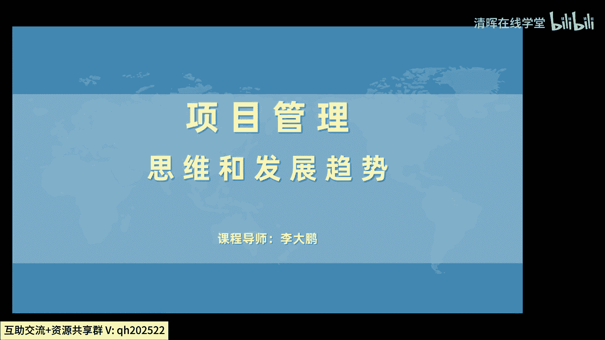
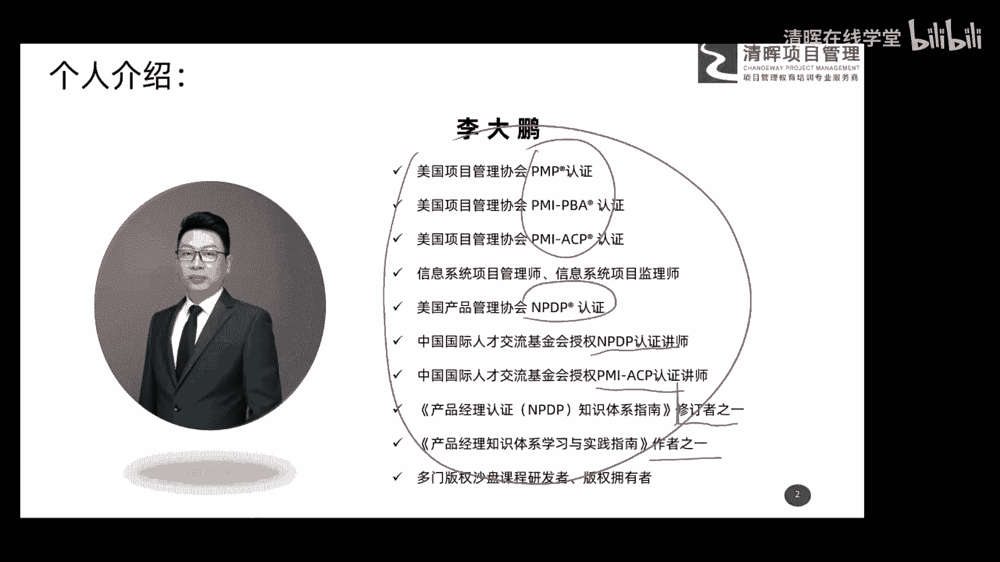
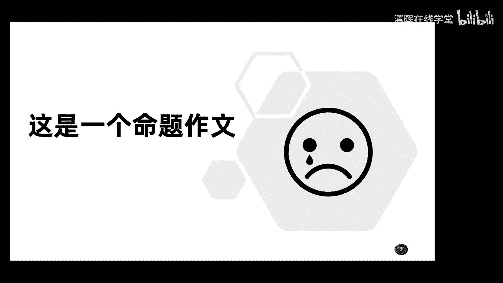

# 项目管理思维和发展趋势 12讲 - P13：导言 - 清晖在线学堂 - BV1Vz421D7kH

晚上好啊，今天呢由咱们清辉公司组织啊，有我呢在线上呢用这个直播的这种方式呢，给大家分享一些项目管理的实战的一些内容，那今天呢我们要分享的内容是，项目管理的思维和发展的趋势。

主要和大家呢想讨论一下项目管理是什么啊，我们怎么去做好这件事，以及呢未来这个行业发展的一些方向的，这么一些内容，今天晚上的分享时间呢大约是啊1。5个小时，一个半小时左右，我们还会留出一点时间呢做互动啊。

大家有什么问题呢，可以在最后的半个小时啊，这个时间内呢我们来做交流好，那各位朋友泡好茶水，摆上小吃啊。

我们边吃边聊，嗯在课程开始之前呢，还是按照传统的套路啊，首先介绍一下我自己呃，我是李大鹏，一名八零后呃，82年出生在东北的吉林省啊，可能这里头是不是有一些老乡啊，大学毕业后呢，我在一家大型的it类企业。

这个这个呃i it类企业中呢工作了啊，是14年，我做过程序员，做过项目管理的岗位，做过咨询，做过产品管理，也做过营销的这个管理，目前呢我主要在从事项目管理和产品管理的。

这个相关领域的一些啊培训和咨询工作，那右边这一部分呢大家可以看一看啊，右边这一部分额，右边这一部分呢是我的一些学习呀，和这个这些年的一些啊成果的这些内容，大家可以稍微了解一下啊。

在项目管理和产品管理这个领域呢，这个我这些年呢也进行了一些学习和研究啊，啊上边的一些内容呢，像美国的啊这个PMI搞的PMP的认证啊，PPA的认证，还有CP的认证，那这三个呢是我们关于项目管理的一个啊。

全球的通用认证啊，然后信息系统，项目管理师和信息系统项目监理师呢，就是咱们国家搞的那个啊软考的两个认证，后来呢我又从事了产品管理的一些工作，所以又去学习了这个美国产品管理协会，MMDP的一个认证。

就是新产品研发经理的这么一个认证，后期呢我也是申请和评审了一些啊，关于这个这些认证的一些讲师的资质，大家可以看到啊，我现在是呢这个中国国际人才交流交流基金会，授权的NPDP的认证讲师。

和PMICP的认证讲师啊，啊然后在我的这个学习呀，和后期的分享过程中呢，我也参与了一些书籍的修订和编写啊，这里头呢有个叫产品经理认证MPDP啊，知识体系指南，这就是我们考NPDP啊。

产品经理的那本啊教材我是一个修订者之一，后来呢我们一些老师呢也一起呢，合作编写了一本叫产品经理知识体系，学习实践指南，我是呢第四章的这个作者之一，然后在整个教学过程中呢，为了把这种啊枯燥的知识呢啊。

更容易的让大家去接受，我，们后期呢也研发了一些关于沙盘课的一些内容，这些内容呢后期呢大家如果感兴趣的话，都可以联系我们相关的课程的一些老师，来咨询啊，好那这就是我个人的一些基本情况。

大家了解一下就可以啊，好嗯，接着呢我们看一下，今天我们要给大家分享的这么一个一个内容啊，刚才给大家说了。

