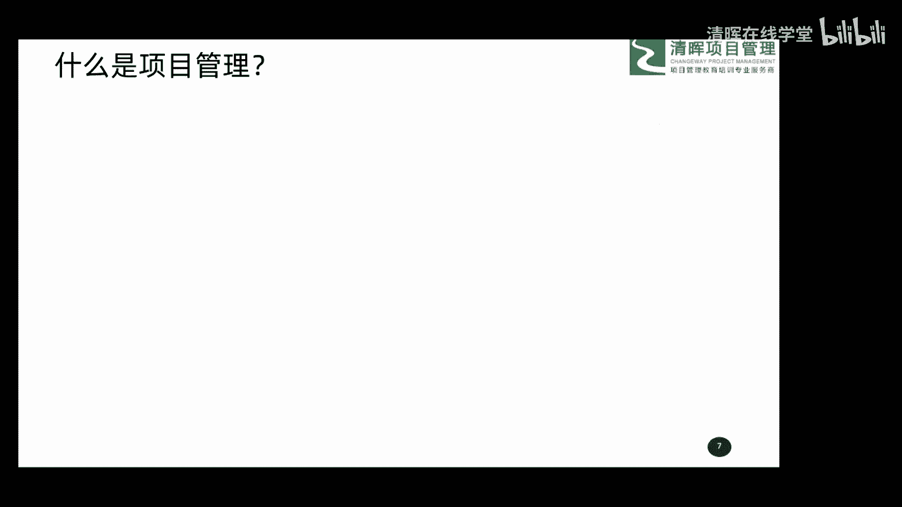
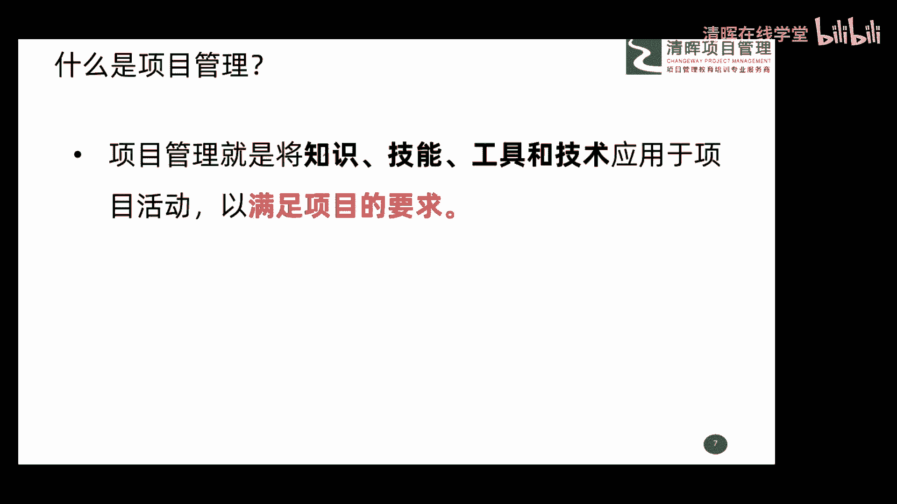
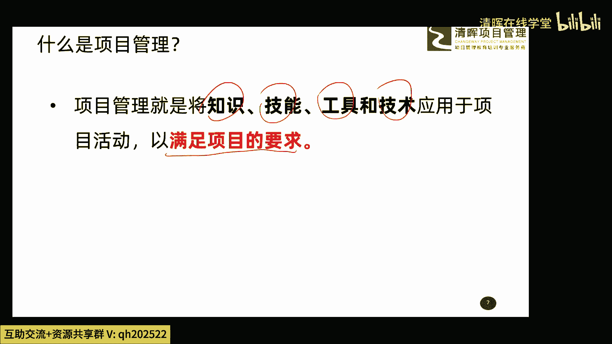
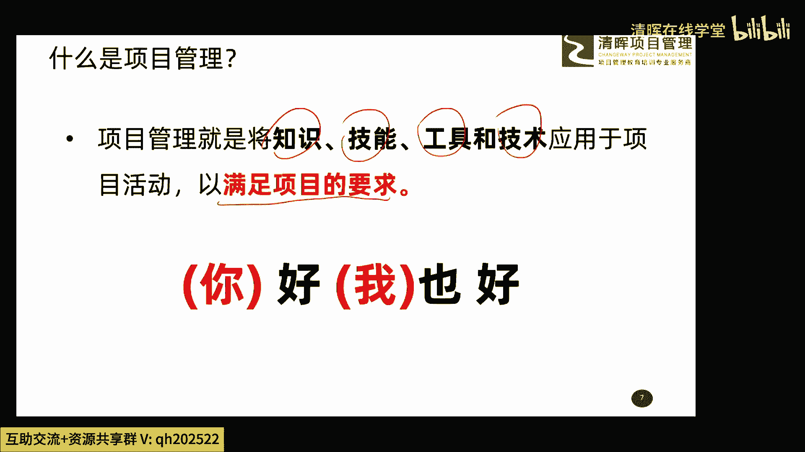
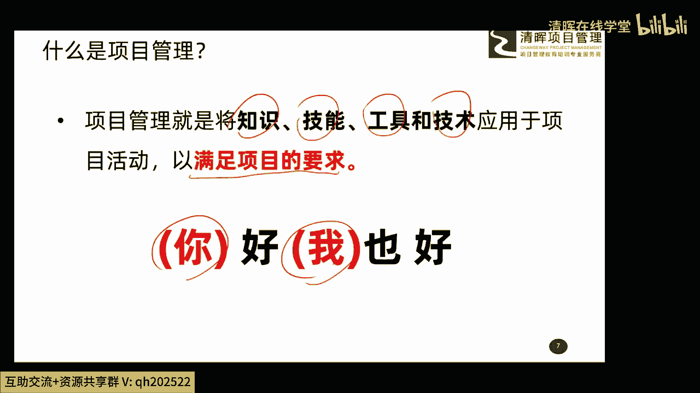
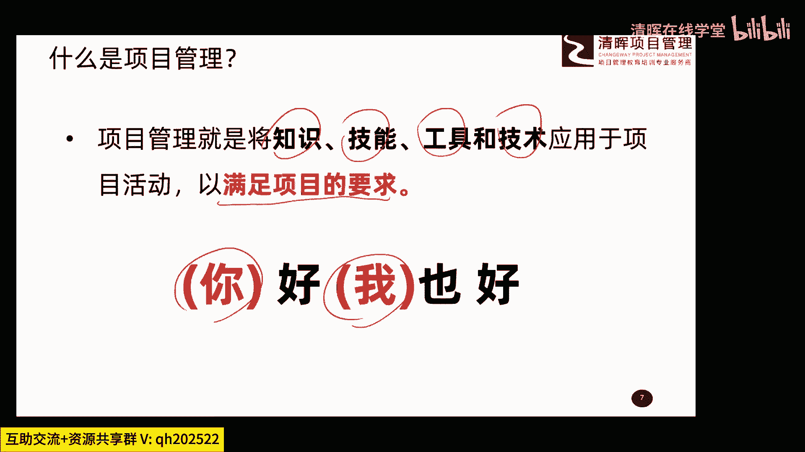
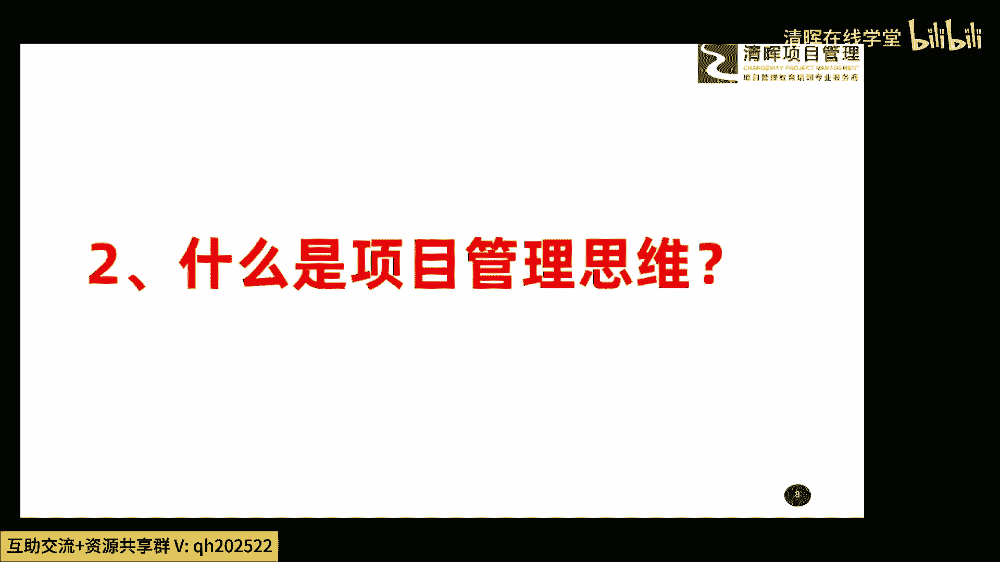
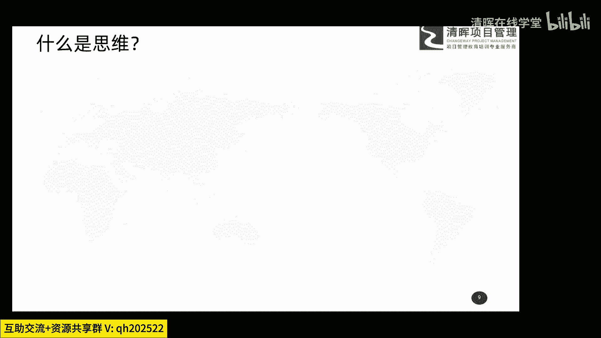
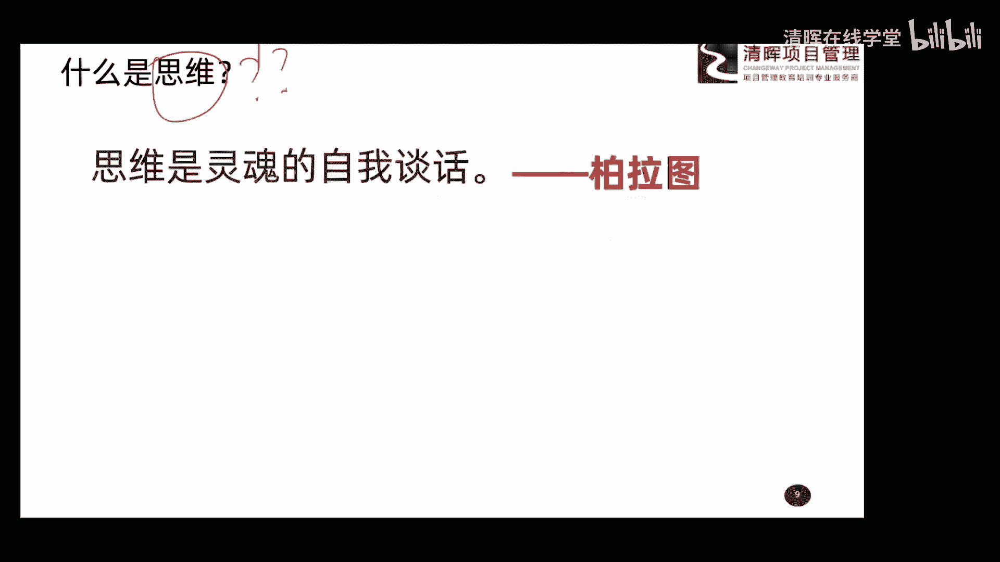
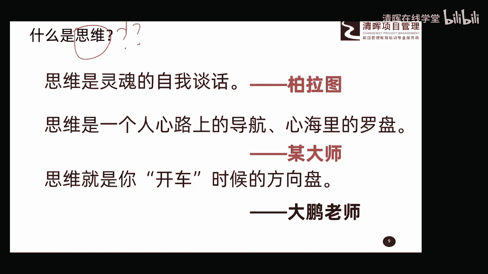

# 项目管理思维和发展趋势 12讲 - P2：2.什么是项目管理 - 清晖在线学堂 - BV1Vz421D7kH

接着呢我们再给大家聊一聊，这个关于什么是项目管理这两个概念，大家解释清楚啊，了解清楚以后呢，我们就呃开始开始我们其他的内容啊，这两个是基础的东西。

先回顾一下吧，那什么是项目管理呢，在我们PMBOK这本书中呢，也给大家一个这么一个定义，说项目管理呢就是将所谓的知识技能。

工具和技术唉用在项目活动中，最终呢满足项目要求，这也很好理解，也就是说你会点啥，你懂点啥，你会用什么，哎你把这些东西呢都用在你的项目中，然后把这个项目干好，达到我们说最终的一个比较好的一个结果啊。

这样的话就是项目管理的概念，也就是说这个概念呢其实非常非常的简单，就是告诉我们啊，你要把一些东西用在项目中，就能把项目干好。

就这么一个东西，所以呢这里头也给大家总结了一句话，最终我们通过项目管理的这种方法或手段，或者是这样的一些工作的这种开展，我们达成的结果是你好我也好。

你呢指的是我们的客户啊。

用户啊，哎包括其他的一些该型相关方案，我呢指的是我们的项目经理，项目团队，包括我们自己的组织哎，就是大家都满意，哎这事儿呢我们说大家都好啊，这么一个结果，这就是项目管理最终的目的。

或者是最终的一个要求啊，所以大家这两个概念先了解一下啊，这是一个基础的东西，嗯好了。

那这两个基础的概念大家懂了以后呢，我们聊一下第二个话题啊，什么是项目管理的思维，这一块的内容呢在我们书中就没有了，大家找任何一本工具书呢，可能也都找不到啊，嗯这个关于项目管理的思维呢。

这块呢我们首先要搞清楚一个事，就是什么是思维啊。

什么是思维这个概念，这里头呢为了今天的课程呢，我也找了一些资料啊，包括呢我也上网查了一些相关的一些啊文档啊，包括啊查了一些书籍啊，但是关于什么是思维这个事呢，其实说句实话啊，嗯不是特别清晰啊。

各种资料上呢解析的呢也是特别的笼统啊。

然后呢有一些说法呢也特别的空洞，哎，也就是说你这个事儿你想搞清楚什么是思维呢，这个这个思维啊其实挺难的，挺难的，因为这个东西有点太过于抽象了，我也找了一些具体的说法，大家可以跟我一起来看一看啊。

有一个人是这么说的，说思维呢是灵魂的自我谈话，思维是灵魂的自我谈话，他说呢思维呢是产生于自己，是自己和自己的这么一种对话，也就是自己对自己的一种认识，哎这属于一种思维的概念，但是我考虑这个问题呢。

也考虑了挺长时间，我觉得有道理，但是呢我总觉得呢，我没有办法很好的把记把它解析出来，可能咱们说咱们这个level哈还没有达到呃，说这句话的，这个这个这个大师的这个level的层次上。

所以呢但是我我我个人还是觉得，这句话还是很很有很有道理的，蛮对的，他这句话是谁说的呢，这个人叫柏拉图啊，他是这么解析什么是思维的啊，这还有哲理的啊，然后呢我继续又看了一些其他的一些资料啊。

找到另外一句话，我觉得也是非常非常有道理。

他是这么说的说，那思维呢是一个人心路上的导航，心海里的罗盘，唉，我觉得这句话比上个这个柏拉图大师说的，这句话呢，唉更清晰了一些，更清晰了一些，嗯也就是说通过这句话呢，有多少我感觉哎呀我有一些认识了啊。

思维呢啊，它可以引导我们是不是一个导航的概念呢，一个罗盘的概念，知道哎我们要去哪，我们怎么去哪儿哎这样一个概念，所以我觉得这句话说的更紧，更清晰一些，是一种关于思维的一种呃更进一步的解析吧。

啊然后这句话呢我觉得也是蛮不错的，但是呢查来查去呢我没有找到这句话的啊，这个最终的这个这个啊是谁说的啊，所以呢我就用某大师来代表了吧，我觉得呢能说出这句话呢也是个大师啊，然后经过我的一些资料的这种啊。

咱们说这种查询啊，包括自己又做了一些思考啊，啊我个人认为啊思维是这样的思维，就是你开车时候的方向盘啊，这句话呢可能相对来说比较的这个呃，通俗一些了啊，我理解的思维就是说你现在要做一件事。

那你脑子里的方向在哪里啊，你怎么去啊去完成这件事，你一定要有个这种所谓的方向的概念，然后去把控这种方向，按照这种方向呢去把它做出来，所以这是我对思维的一种理解吧，所以四位就是你开车的时候方向盘啊。

所以呢这是大鹏大鹏老师的解析啊，然后呢我做这个课件的时候呢，当时做完以后呢，分享给我的搭档尤老师呢去看了一下，他说大鹏老师呢，我给你个建议，你把这个开车这俩字儿呢加上引号，否则容易产生歧义。

这个其实我没太整明白为什么会有歧义啊，这个开车是有什么其他的说法吗，反正我理解就是你做事的一个方向啊，如果有什么其他说法的话，有朋友了解的话啊，那可以在我们的评论这个评论区呢，在这个评论区里发一发。

原来开车是不是有其他的含义啊，为什么要加上引号啊，好那这是关于我关于思维的我的一些认识啊，包括一些其他大师的一些认识啊，大家呢稍微拿出来分享一下，大家先了解一下啊。

